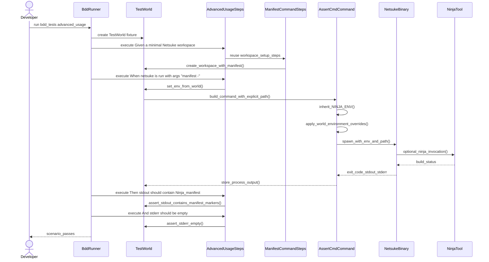

# Developer guide

This guide describes the day-to-day engineering workflow for Netsuke, with a
focus on writing and maintaining tests. It is the source of truth for how the
test suite is expected to be used by contributors.

## Quality gates

Run these commands before finalizing any change:

- `make check-fmt`
- `make lint`
- `make test`

When command output is long, preserve exit codes and logs:

```bash
set -o pipefail
make test 2>&1 | tee /tmp/netsuke-make-test.log
```

For documentation changes, also run:

- `make fmt`
- `make markdownlint`
- `make nixie`

## Test suite map

Netsuke uses a mixed strategy:

- Unit and integration tests live under `tests/` as ordinary Rust test files.
- Behavioural tests use Gherkin feature files in `tests/features/` and
  `tests/features_unix/`.
- Behavioural step definitions and fixtures live in `tests/bdd/`.
- Behavioural test discovery is defined in `tests/bdd_tests.rs`.

## Behavioural testing strategy

Behavioural tests run through `cargo test` using `rstest-bdd`, not a bespoke
runner. The `scenarios!` macro in `tests/bdd_tests.rs` discovers feature files
and binds a shared fixture entry point (`world: TestWorld`) to each generated
scenario test.

### State and isolation policy

- Scenario isolation is the default: scenario state must be recreated per test.
- Shared process-wide state is avoided unless infrastructure cost requires
  controlled reuse.
- Use `Slot<T>` for optional or replaceable scenario values.
- Use typed wrappers in `tests/bdd/types.rs` for step parameters to avoid
  ambiguous string-heavy signatures.

### Step authoring policy

- Keep `Given` steps for context and setup.
- Keep `When` steps for one observable action.
- Keep `Then` steps for user-visible outcomes, not internal implementation
  details.
- Prefer explicit, domain-focused helper functions over large step bodies.
- Keep step modules cohesive by domain (`cli`, `manifest`, `ir`, `stdlib`,
  `process`, `locale_resolution`).

### Compile-time safety

`rstest-bdd-macros` is configured with `strict-compile-time-validation`, so
missing or ambiguous step bindings should be treated as compile-time failures.

## rstest-bdd v0.5.0 usage

The migration plan and implementation record are tracked in
`docs/execplans/rstest-bdd-v0-5-0-behavioural-suite-migration.md`.

Current usage in this repository is:

- `rstest-bdd` and `rstest-bdd-macros` pinned to `0.5.0`.
- Step parameters favour typed wrappers from `tests/bdd/types.rs`; wrappers
  implement `FromStr` so step signatures can use domain types directly.
- Prefer inferred step patterns for simple, no-argument steps when this
  reduces duplication and keeps feature wording clear.
- Use `rstest_bdd::async_step::sync_to_async` for manual sync-to-async wrappers
  and the concise wrapper aliases (`StepCtx`, `StepTextRef`, `StepDoc`,
  `StepTable`) where required.
- Introduce async step definitions only where asynchronous behaviour is natural
  and improves coverage.
- Keep async execution on Tokio current-thread runtime for behavioural tests.
- Restrict `#[once]` fixtures to expensive, effectively read-only
  infrastructure.

These points are strategy rules, not optional style guidance.

## How to add or update behavioural tests

1. Add or update the feature text in `tests/features/` or
   `tests/features_unix/`.
2. Implement or update matching steps under `tests/bdd/steps/`.
3. Reuse existing fixtures/helpers before adding new world state.
4. Add typed parameter wrappers in `tests/bdd/types.rs` when step arguments
   represent distinct domain concepts.
5. Run `cargo test --test bdd_tests` and then the full quality gates.

## Test isolation utilities

Environment variable mutations and working-directory changes are process-global
side effects that can cause data races when tests run in parallel. The
`test_support` crate and test fixtures provide resource acquisition is
initialization (RAII)-based utilities to serialize and safely restore these
mutations.

### `EnvLock`

`test_support::env_lock::EnvLock` is a global mutex that serializes all
process-global mutations (environment variables, current working directory)
across concurrent test threads. Acquire it at the start of any test that
mutates the environment:

```rust
use test_support::env_lock::EnvLock;

let _env_lock = EnvLock::acquire();
```

The lock is released when the guard is dropped. In BDD scenarios,
`TestWorld::ensure_env_lock()` acquires it once per scenario and holds it for
the scenario lifetime.

### `EnvVarGuard`

`test_support::EnvVarGuard` is a lightweight RAII guard for setting or removing
a single environment variable and restoring it on drop:

```rust
use test_support::env_lock::EnvLock;
use test_support::EnvVarGuard;

let _env_lock = EnvLock::acquire();
let _guard = EnvVarGuard::set("HOME", temp.path().as_os_str());
let _guard = EnvVarGuard::remove("NETSUKE_CONFIG_PATH");
```

For BDD steps that need to track mutations through `TestWorld`, use
`mutate_env_var` from `tests/bdd/helpers/env_mutation.rs` instead.

### `original_ref()` on environment guards

`NinjaEnvGuard` and `EnvGuard<E>` both expose a non-consuming accessor:

```rust
pub fn original_ref(&self) -> Option<&OsString>
```

Use this to inspect the value that was in the environment *before* the guard
was activated, without consuming the guard.  This is the correct way for BDD
steps to obtain the prior value when calling `track_env_var` because the
consuming `original(self)` would drop the guard prematurely:

```rust
let guard = override_ninja_env(&SystemEnv::new(), &ninja_path);
let previous = guard.original_ref().cloned();
world.track_env_var(
    ninja_env::NINJA_ENV.to_owned(),
    previous,
    ninja_path.as_os_str().to_owned(),
);
world.ninja_env_guard = Some(guard);
```

The consuming `original(self) -> Option<OsString>` method remains available
when the guard is no longer needed after the read.

### `CwdGuard`

Tests that call `std::env::set_current_dir` must restore the original working
directory after the test. `CwdGuard` is available from `test_support`, and is
used in `src/cli/config_merge_tests.rs`; local copies also remain in
`tests/cli_tests/config_discovery.rs` and `tests/cli_tests/merge.rs`. It
captures the current directory on construction and restores it on drop:

```rust
use test_support::CwdGuard;
use test_support::env_lock::EnvLock;

let _env_lock = EnvLock::acquire();
let _cwd_guard = CwdGuard::acquire()?;
std::env::set_current_dir(temp.path())?;
```

Acquire `EnvLock` and then `CwdGuard` so Rust drops them in reverse declaration
order: `CwdGuard` restores the CWD first, and `EnvLock` releases second.

### `restore_many` and `restore_many_locked`

`test_support::env::restore_many` restores a batch of environment variables
from a `HashMap<String, Option<OsString>>` snapshot. It acquires `EnvLock`
internally, so callers do not need to hold the lock:

```rust
use std::collections::HashMap;
use std::ffi::OsStr;
use test_support::env::{restore_many, set_var};

let mut snapshot = HashMap::new();
snapshot.insert("HELLO".into(), set_var("HELLO", OsStr::new("world")));
restore_many(snapshot);
// "HELLO" is now restored to its prior value (or removed if it was unset).
```

`restore_many_locked` is the `unsafe` variant for callers that already hold
`EnvLock` — typically `Drop` implementations. The caller **must** hold the lock
for the duration of the call:

```rust
// SAFETY: EnvLock is held via self.env_lock.
unsafe { test_support::env::restore_many_locked(vars) };
```

Prefer `restore_many` in normal test code. Use `restore_many_locked` only
inside `Drop` or other contexts where `EnvLock` is already acquired.

### `mutate_env_var` (BDD scenarios)

`mutate_env_var` in `tests/bdd/helpers/env_mutation.rs` is the canonical way to
set or remove an environment variable within a BDD scenario. It acquires the
scenario-scoped `EnvLock`, performs the mutation, and registers the key for
automatic restoration when the scenario ends:

```rust
use crate::bdd::helpers::env_mutation::mutate_env_var;
use crate::bdd::types::EnvVarKey;

// Set a variable
mutate_env_var(world, EnvVarKey::from("NETSUKE_THEME"), Some("ascii"))?;

// Remove a variable
mutate_env_var(world, EnvVarKey::from("NETSUKE_CONFIG_PATH"), None)?;
```

Do **not** call `std::env::set_var` directly in BDD steps — use
`mutate_env_var` so that cleanup is tracked through `TestWorld`.

### Ordering rules

1. Acquire `EnvLock` first.
2. Acquire `CwdGuard` second.
3. Create `EnvVarGuard`s for all variables that need sandboxing.
4. Perform the test.
5. Guards drop in reverse declaration order — CWD and environment
   variables are restored while the lock is still held, preventing races.

## `TestWorld` field groups

`TestWorld` (`tests/bdd/fixtures/mod.rs`) is the shared fixture for all BDD
scenarios. Its fields are organized by domain:

### Scenario state groups

State fields organized by concern to facilitate scenario authoring and
maintenance.

Table: Scenario state groups and fields

| Group              | Fields                                                                                                                                                                                                                                   | Purpose                                                                  |
| :----------------- | :--------------------------------------------------------------------------------------------------------------------------------------------------------------------------------------------------------------------------------------- | :----------------------------------------------------------------------- |
| CLI state          | `cli`, `cli_error`                                                                                                                                                                                                                       | Parsed CLI configuration and parse error capture.                        |
| Manifest state     | `manifest`, `manifest_error`                                                                                                                                                                                                             | Parsed manifest and error capture.                                       |
| IR state           | `build_graph`, `removed_action_id`, `generation_error`                                                                                                                                                                                   | Build graph, negative-test identifiers, generation errors.               |
| Ninja state        | `ninja_content`, `ninja_error`                                                                                                                                                                                                           | Generated Ninja file content and errors.                                 |
| Process state      | `run_status`, `run_error`, `command_stdout`, `command_stderr`, `temp_dir`, `workspace_path`, `path_guard`, `ninja_env_guard`                                                                                                             | Process execution results, temporary directories, and path/ninja guards. |
| Stdlib state       | `stdlib_root`, `stdlib_output`, `stdlib_error`, `stdlib_state`, `stdlib_command`, `stdlib_policy`, `stdlib_path_override`, `stdlib_fetch_max_bytes`, `stdlib_command_max_output_bytes`, `stdlib_command_stream_max_bytes`, `stdlib_text` | Stdlib rendering, network policy, and size constraints.                  |
| Localization state | `localization_lock`, `localization_guard`, `locale_config`, `locale_env`, `locale_cli_override`, `locale_system`, `resolved_locale`, `locale_message`                                                                                    | Scenario-level localizer overrides and resolution state.                 |
| HTTP server state  | `http_server`, `stdlib_url`                                                                                                                                                                                                              | Test HTTP server fixture for fetch scenarios.                            |
| Output state       | `output_mode`, `simulated_no_color`, `simulated_term`, `output_prefs`, `simulated_no_emoji`, `rendered_prefix`                                                                                                                           | Accessibility and output preference resolution.                          |
| Environment state  | `env_vars`, `env_vars_forward`, `env_lock`, `original_cwd`                                                                                                                                                                               | Restoration snapshot, forwarding map, scenario lock, and CWD capture.    |

### Key `TestWorld` methods

- `track_env_var(key, previous, new_value)` — record a variable for
  restoration at scenario end and store `new_value` in `env_vars_forward` so
  that `build_netsuke_command` can forward it to child processes without
  re-reading the process environment.
- `ensure_env_lock()` — acquire the scenario-scoped `EnvLock` on first
  call; subsequent calls are no-ops. Also captures the current working
  directory for later restoration.
- `restore_environment_locked()` (unsafe, private) — called from `Drop` to
  restore all tracked variables while the lock is still held.

## Configuration merge architecture

Configuration merging lives in `src/cli/config_merge.rs`. The module keeps
config-layer plumbing separate from the public CLI surface in `cli::mod`.

### Two-pass file discovery

OrthoConfig's `ConfigDiscovery::compose_layers()` returns only the **first**
matching config file it finds. Because user-scope locations (XDG Base
Directory, HOME) are checked before the project root, a user config can shadow
a project config.

To enforce **project scope > user scope** precedence, `merge_with_config` uses
a two-pass approach:

1. **First pass** — run `config_discovery()` to find whatever file exists
   first (typically user-scope).
2. **Second pass** — if the first pass did not find the project-scope file
   and `NETSUKE_CONFIG_PATH` is not set, load `.netsuke.toml` from the project
   root directly via `load_config_file_as_chain` and push its layers last.

Because `MergeComposer` uses last-wins semantics, pushing the project layers
after user layers gives them higher precedence.

The same logic is mirrored in `collect_diag_file_layers` for early `diag_json`
resolution (before full merging).

### Layer precedence

The final merge order is:

1. **Defaults** — `Cli::default()` serialized as a base layer.
2. **File layers** — discovered config files in the two-pass order above.
3. **Environment** — `NETSUKE_*` environment variables via the Figment Env
   provider.
4. **CLI flags** — values explicitly passed on the command line.

### Configuration merge helper functions

Private helper functions for config discovery and diagnostic-JSON resolution.

Table: Configuration merge helper functions

| Function                     | Purpose                                                              |
| :--------------------------- | :------------------------------------------------------------------- |
| `config_discovery`           | Build single-pass `ConfigDiscovery` with optional directory anchor.  |
| `project_scope_file_str`     | Resolve the expected project `.netsuke.toml` path as a string.       |
| `project_scope_layers`       | Load project-scope config directly, bypassing discovery.             |
| `push_file_layers`           | Push all file layers onto a `MergeComposer` in precedence order.     |
| `collect_diag_file_layers`   | Mirror of `push_file_layers` for early `diag_json` resolution.       |
| `is_empty_value`             | Return `true` for an empty JSON object (no CLI overrides).           |
| `diag_json_from_layer`       | Extract `diag_json` from a config layer, preferring `output_format`. |
| `diag_json_from_matches`     | Resolve final `diag_json` from CLI matches with fallback.            |
| `cli_overrides_from_matches` | Extract CLI-supplied fields, stripping defaults and non-CLI sources. |
| `env_provider`               | Return the `NETSUKE_` prefixed Figment environment provider.         |

#### `diag_json` contract

Tooling that wants a stable contract for early diagnostic-JSON resolution
should treat the input consumed by `collect_diag_file_layers`,
`diag_json_from_layer`, and `diag_json_from_matches` as versioned schema
`netsuke.diag-json-resolution.v1`:

```json
{
  "$schema": "https://json-schema.org/draft/2020-12/schema",
  "$id": "urn:netsuke:diag-json-resolution:v1",
  "title": "Netsuke diag_json resolution layer",
  "type": "object",
  "description": "Subset of merged configuration consulted before full CLI merging.",
  "properties": {
    "output_format": {
      "type": "string",
      "enum": ["human", "json"],
      "description": "Preferred field. When present and valid, this decides diag_json."
    },
    "diag_json": {
      "type": "boolean",
      "description": "Legacy fallback field used only when output_format is absent or invalid."
    }
  },
  "additionalProperties": true
}
```

Versioning and compatibility rules:

- Version `v1` has no required fields. Both `output_format` and `diag_json`
  are optional.
- `output_format` is the preferred field. Valid `"json"` resolves to
  `diag_json = true`; valid `"human"` resolves to `diag_json = false`.
- If `output_format` is present but invalid, resolution falls back to
  `diag_json` when it is a boolean value.
- Non-object values, or objects that contain neither recognized field, produce
  no `diag_json` decision.
- `cli_overrides_from_matches` must continue to emit a JSON object, even when
  no CLI override is present.
- `is_empty_value` treats only the empty object `{}` as "no CLI overrides".
  Downstream tooling must not replace an empty object with `null`, `[]`, or any
  other sentinel.
- Additional properties are ignored by `diag_json` resolution and may be
  present because the same layer object also participates in full config
  merging.

## BDD command helpers and environment handling

The BDD step module `tests/bdd/steps/manifest_command.rs` provides three
helpers that launch the netsuke binary in a controlled environment:

- **`netsuke_executable()`** — locates the compiled netsuke binary using
  `assert_cmd::cargo::cargo_bin!("netsuke")`. Returns the resolved `PathBuf` or
  an error if the binary is not found.
- **`build_netsuke_command(world, args)`** — constructs an
  `assert_cmd::Command` with a sanitized environment. The helper:
  1. Calls `env_clear()` to strip the inherited environment for test
     isolation.
  2. Forwards `PATH` (via `std::env::var_os`) **without** acquiring `EnvLock`
     because the calling thread may already hold the lock via a
     `NinjaEnvGuard` stored on the `TestWorld` — and `std::sync::Mutex` is
     not reentrant. The direct read is safe: when a `NinjaEnvGuard` is
     alive, it serializes all env mutations; when no guard is alive, the
     `PATH` mutation from `prepend_dir_to_path` has already completed.
  3. Forwards all scenario-tracked environment variables from
     `world.env_vars_forward` (including `NETSUKE_NINJA` and any variables set
     by BDD steps) without reading the process environment, eliminating data
     races.
- **`run_netsuke_and_store(world, args)`** — calls `build_netsuke_command`,
  runs the command, and stores stdout, stderr, and exit status in the
  `TestWorld` fixture for subsequent `Then` step assertions.

### Environment contract

After `env_clear()`, only these variables are present in the spawned command:

| Variable     | Source                   | Purpose                       |
| ------------ | ------------------------ | ----------------------------- |
| `PATH`       | Host `std::env::var_os`  | Locate ninja and subprocesses |
| Scenario env | `world.env_vars_forward` | BDD-step-configured overrides |

`world.env_vars_forward` is a `HashMap<String, OsString>` containing the
*current* values that BDD steps intend to pass to child processes, including
`NETSUKE_NINJA` when a fake ninja is installed. The helper iterates
`env_vars_forward` and calls `cmd.env(key, value)` for each entry, so the child
process receives exactly the variables that steps have configured without
reading the process environment.

The separate `world.env_vars` map is a **restoration snapshot**: keys are
variables set during the scenario, and values are their *previous* values (for
restoration when the scenario ends). It is not used by `build_netsuke_command`.

### `given_config_file_with_setting` step (`tests/bdd/steps/advanced_usage.rs`)

The Gherkin step `a workspace with config file setting {key} to {value}` writes
a `.netsuke.toml` file to the scenario's temp directory with the given key set
to a TOML value derived from `{value}`:

- `"true"` and `"false"` are parsed as TOML booleans.
- All other values are written as TOML strings.

This step uses the `toml = "0.8"` dev-dependency added to `Cargo.toml` for
serialization.  Do not add further crate dependencies to support this step; the
existing `toml` crate is sufficient for key/value configuration files of this
kind.  The step is intentionally limited to scalar types: extend it only when a
concrete BDD scenario requires numeric or array values.

### BDD test execution flow (e2e behavioural tests)

The following diagram illustrates how a BDD scenario flows through the test
infrastructure, from scenario invocation through workspace setup, command
execution, and assertion validation. This applies to **end-to-end behavioural
tests** defined in Gherkin feature files, not unit or code-level integration
tests:



**Figure**: End-to-end BDD test execution sequence showing how workspace setup,
environment isolation, command invocation, and assertions flow through the test
infrastructure. The `TestWorld` fixture coordinates state across steps, while
`build_netsuke_command` ensures environment isolation via `env_clear()` and
explicit forwarding of scenario-configured variables. This flow applies to
feature-file-based behavioural tests, not code-level unit or integration tests.

### Integration test helper

`test_support::netsuke::run_netsuke_in(current_dir, args)` provides a simpler
interface for integration tests outside the BDD framework. It sets `PATH` to an
empty string (relying on the resolved binary path) but does **not** call
`env_clear()`, so other environment variables (including `NETSUKE_NINJA` set
via `override_ninja_env`) are inherited normally.

For tests that need **deterministic, isolated** child-process environments, use
`test_support::netsuke::run_netsuke_in_with_env(current_dir, args, extra_env)`.
Unlike `run_netsuke_in`, this variant calls `env_clear()` so the child inherits
**only** the variables supplied in `extra_env`, plus two automatically
forwarded variables: `PATH` (from the host `std::env::var_os`) and
`NETSUKE_NINJA` (forwarded when an `override_ninja_env` guard is active in the
current process). Use this helper for configuration-layering tests or any test
that sets environment variables which could race with parallel test execution.

## Documentation upkeep

When test strategy or behavioural test usage changes, update this file in the
same change-set, so the documented approach remains aligned with the codebase.
