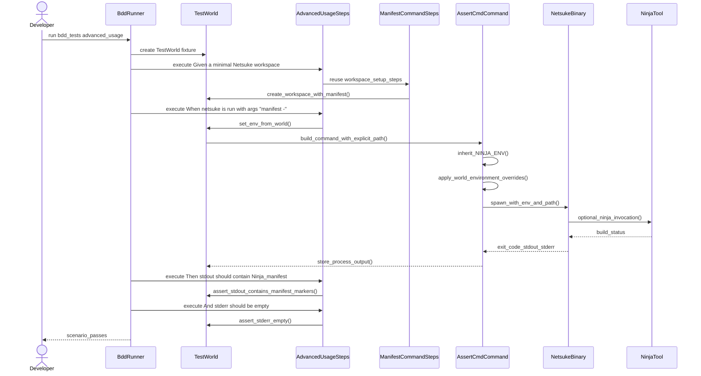

# Developer guide

This guide describes the day-to-day engineering workflow for Netsuke, with a
focus on writing and maintaining tests. It is the source of truth for how the
test suite is expected to be used by contributors.

## Command-line interface architecture

The governing command-line interface (CLI) architecture record is ADR-003,
[`Agent-consistent human-first CLI`][adr-003-cli]. It defines the pre-0.1.0
contract: keep the terminal experience human-first, make names and outputs
consistent enough for agents and automation, remove legacy aliases instead of
preserving inconsistent vocabulary, use `--json` as the only structured result
mode, keep subprocess output out of JSON stdout, and require explicit `--force`
or `--dry-run` controls for consequential operations.

The architectural source of truth for CLI behaviour is
[`docs/netsuke-cli-design-document.md`](netsuke-cli-design-document.md). Use
that document when changing command grammar, output modes, diagnostics,
localization, accessibility behaviour, configuration precedence, or planned
product surfaces such as `context`, `skill-path`, `runs`, `profile`, delivery,
and feedback commands. The overhaul execution plan in
[`docs/execplans/netsuke-cli-overhaul.md`](execplans/netsuke-cli-overhaul.md)
tracks sequencing only; it must not replace ADR-003 or the CLI design document
as the durable architecture record.

[adr-003-cli]: adr-003-agent-consistent-human-first-cli.md

## Graph view projection and renderer adapters

The `graph` subcommand renders the build dependency graph in-process. Its
domain projection lives in [`src/graph_view`](../src/graph_view) and follows
the hexagonal port/adapter pattern:

- [`GraphView`](../src/graph_view/mod.rs) is the deterministic projection of
  [`BuildGraph`](../src/ir/graph.rs). It is constructed once, sorts every
  collection (nodes, edges, default targets), and is invariant under `HashMap`
  insertion order. The shuffled-insertion proptest in
  [`src/graph_view/tests.rs`](../src/graph_view/tests.rs) covers this invariant.
- [`GraphRenderer`](../src/graph_view/render.rs) is the trait every renderer
  adapter implements. The contract is intentionally minimal:
  `render(&self, view: &GraphView, sink: &mut dyn io::Write) -> Result<(), GraphRenderError>`.
  Adapters consume `GraphView` only — they never touch `BuildGraph` directly.
- [`DotRenderer`](../src/graph_view/render_dot.rs) emits Graphviz DOT.
- [`HtmlRenderer`](../src/graph_view/render_html.rs) emits a self-contained
  HTML page (server-rendered SVG, accessible textual outline, and a
  `<noscript>` fallback containing the DOT source verbatim).

`EdgeView::class` mirrors the four Ninja dependency relations so that renderers
can style each one distinctly:

| Variant          | Ninja separator           | DOT style       | SVG class              |
| ---------------- | ------------------------- | --------------- | ---------------------- |
| `Explicit`       | none (input in `$in`)     | solid (no attr) | `edge`                 |
| `ImplicitDep`    | single pipe (`\|`)        | `style=bold`    | `edge implicit-dep`    |
| `ImplicitOutput` | single pipe on LHS (`\|`) | `style=dotted`  | `edge implicit-output` |
| `OrderOnly`      | double pipe (`\|\|`)      | `style=dashed`  | `edge order-only`      |

`ImplicitDep` carries Ninja's single-pipe implicit inputs — header files or
schemas that trigger a rebuild without appearing in `$in`. The bold stroke
reads as "rebuild-triggering hidden input," distinguishing it from the dashed
order-only stroke (no rebuild trigger) and the dotted implicit-output stroke
(auxiliary output side).

A new renderer — for example the `--json` view planned for roadmap item
`3.15.6` — should be added as a sibling module under `src/graph_view/` that
implements `GraphRenderer`. The runner dispatch in
[`src/runner/mod.rs`](../src/runner/mod.rs) picks the appropriate renderer
based on `GraphArgs` and writes through the shared `write_text_file`/
`write_text_stdout` sink helpers. The `-` sentinel for `--output` is recognised
by `process::is_stdout_path`.

`--html` and `--output` are explicitly excluded from `OrthoConfig` layering:
they are per-invocation arguments tagged `#[serde(skip)]` on
[`GraphArgs`](../src/cli/mod.rs). Layering `--output` through a config file
would silently change the artefact destination — a footgun the design avoids by
construction.

## Quality gates

Run these commands before finalizing any change:

- `make check-fmt`
- `make lint`
- `make test`

When command output is long, preserve exit codes and logs:

```bash
set -o pipefail
make test 2>&1 | tee /tmp/netsuke-make-test.log
```

For documentation changes, also run:

- `make fmt`
- `make markdownlint`
- `make nixie`

## Release help tooling

Release builds generate help artefacts explicitly with `cargo-orthohelp`,
rather than from `build.rs`. The build script remains responsible for the
localization key audit only. Release automation installs the pinned tool with:

```bash
cargo install cargo-orthohelp --version 0.8.0 --locked
```

The workflow then calls:

```bash
scripts/generate-release-help.sh <target> <bin-name> <out-dir> <ps-module-name>
```

The script writes manual pages under
`target/orthohelp/<target>/release/man/man1/` and, for Windows targets,
PowerShell external help under
`target/orthohelp/<target>/release/powershell/Netsuke/`. It computes the manual
date from `SOURCE_DATE_EPOCH`, falling back to `1970-01-01` when unset or
invalid.

Keep `[package.metadata.ortho_config]` in `Cargo.toml` aligned with the CLI
when adding, renaming, or removing user-facing options. Changes to CLI
documentation metadata should be covered by `rstest` workflow/script contract
tests and by `rstest-bdd` release-help scenarios.

## Formal-verification tooling

Kani is the repository-supported bounded model checker for local
formal-verification smoke checks. The supported version is pinned in
`tools/kani/VERSION`; do not install an unpinned `latest` Kani when validating
repository work.

Install or refresh the pinned Kani tool with:

```bash
make install-kani
```

`make install-kani` delegates to the pinned `rust-prover-tools` CLI through
`uv tool run`. The prover tool reads `tools/kani/VERSION`, runs
`cargo install --locked kani-verifier --version <version>`, runs
`cargo kani setup`, and verifies that `cargo kani` is callable. Kani may manage
its own supporting Rust nightly toolchain during setup. That toolchain must not
replace the repository's ordinary stable Rust workflow.

Delegated prover targets print maintainer diagnostics to standard error before
invoking `rust-prover-tools`. Expect `prover-tools:` lines containing the
pinned source, Make target, redacted command shape, relevant Kani version, and
non-zero exit status on failure.

Use the Make targets for day-to-day formal-verification checks:

- `make kani-check` runs the fast local version check used by `formal-pr`.
  This check verifies the installed `cargo kani` command matches
  `tools/kani/VERSION`.
- `make kani-full` runs the complete Kani proof suite through `cargo kani`.
- `make kani-ir` is the Intermediate Representation (IR) proof-suite alias.
  It currently delegates to `make kani-full` because all Kani harnesses are IR
  harnesses.
- `make formal-pr` aliases the pull-request formal-verification smoke path.
- `make install-verus` and `make verus` delegate to `rust-prover-tools` for
  the optional Verus installer and proof runner. These targets are not part of
  the ordinary pull-request gate.

Kani is intentionally not part of `make test`, `make lint`, `make check-fmt`, or
`make all`. `Cargo.toml` declares `cfg(kani)` under
`[lints.rust] unexpected_cfgs` and sets
`[package.metadata.kani.flags] default-unwind = "6"`; both settings are part of
the harness contract and must move in lockstep with new Kani-only modules.

### Kani harness inventory

The IR harnesses are declared by the modules they verify, under
`#[cfg(kani)] mod verification`, with harness bodies stored in sibling
`*_verification.rs` files. They are private to those modules unless a future
proof genuinely needs a wider helper. This keeps production modules below the
400-line source-file limit while preserving access to private helpers.

The manifest harnesses drive production helpers rather than constructing
expected errors by hand. The cycle harnesses drive `cycle::contains_cycle`, a
`cfg(kani)` production entry point that shares `CycleDetector` traversal with
`cycle::analyse` and skips only report-path allocation and canonicalization.

| Harness                                               | Module                                 | Property                                                                                      | Bound                 | Notes                                                                                                                                                                     |
| ----------------------------------------------------- | -------------------------------------- | --------------------------------------------------------------------------------------------- | --------------------- | ------------------------------------------------------------------------------------------------------------------------------------------------------------------------- |
| `duplicate_output_always_rejected`                    | `src/ir/from_manifest_verification.rs` | A duplicate path in one target is detected and the reported duplicate path is preserved.      | `#[kani::unwind(12)]` | Drives production `find_duplicates` with symbolic duplicate names. Full manifest lowering reaches action hashing before duplicate assertions become tractable under Kani. |
| `empty_rule_shape_is_rejected`                        | `src/ir/from_manifest_verification.rs` | An empty rule selector reaches `IrGenError::EmptyRule` and preserves the target name.         | `#[kani::unwind(6)]`  | Drives production `resolve_rule` with a symbolic target name and a minimal rule map.                                                                                      |
| `multiple_rule_shape_is_rejected`                     | `src/ir/from_manifest_verification.rs` | A multi-rule selector reaches `IrGenError::MultipleRules` and preserves sorted rule names.    | `#[kani::unwind(8)]`  | Drives production `resolve_rule` with symbolic rule ordering over short bounded names.                                                                                    |
| `missing_rule_shape_is_rejected`                      | `src/ir/from_manifest_verification.rs` | A missing single rule reaches `IrGenError::RuleNotFound` and preserves target and rule names. | `#[kani::unwind(6)]`  | Drives production `resolve_rule` with symbolic target and rule names and an empty rule map.                                                                               |
| `self_dependency_reports_cycle`                       | `src/ir/cycle_verification.rs`         | A self-dependency is reported as a cycle by production traversal.                             | `#[kani::unwind(5)]`  | Drives production `contains_cycle`, which reuses `CycleDetector::visit` in boolean mode.                                                                                  |
| `two_node_cycle_reports_cycle_a_first`                | `src/ir/cycle_verification.rs`         | A two-node cycle is reported when the `a` node is inserted first.                             | `#[kani::unwind(5)]`  | Drives production `contains_cycle`; the separate insertion-order harnesses cover deterministic map-entry traversal under the Kani map.                                    |
| `two_node_cycle_reports_cycle_b_first`                | `src/ir/cycle_verification.rs`         | A two-node cycle is reported when the `b` node is inserted first.                             | `#[kani::unwind(5)]`  | Drives production `contains_cycle`; this complements the `a`-first harness so the proof is not tied to one insertion order.                                               |
| `direct_missing_dependency_does_not_report_cycle`     | `src/ir/cycle_verification.rs`         | A single target with an absent dependency is not reported as a cycle.                         | `#[kani::unwind(6)]`  | Drives production `contains_cycle` and proves that a missing direct dependency does not enter the cycle branch.                                                           |
| `transitive_missing_dependency_does_not_report_cycle` | `src/ir/cycle_verification.rs`         | A two-target chain whose deeper dependency is absent is not reported as a cycle.              | `#[kani::unwind(6)]`  | Drives production `contains_cycle` and proves that an absent dependency below another target does not synthesise a false cycle.                                           |

Under `cfg(kani)`, `src/ir/graph.rs::IrHashMap` is a fixed-capacity
deterministic compatibility layer used by production IR code under proof. Under
ordinary builds it is a type alias to `std::collections::HashMap`, so the public
`netsuke::ir` API remains unchanged.

Mutation evidence for these harnesses lives under
`docs/verification/mutations/`. File names use the harness path with `::`
replaced by `__`, for example
`ir__cycle__verification__self_dependency_reports_cycle.patch`.

### Kani cfg compile-time checks

`tests/kani_cfg_ui_tests.rs` keeps the Cargo-side `cfg(kani)` contract covered
outside the Kani runner. The trybuild case `tests/ui/cfg_kani_policy_pass.rs`
checks that `Cargo.toml` still declares `[package.metadata.kani.flags]`,
`unexpected_cfgs`, and `check-cfg = ["cfg(kani)"]`, and that the Makefile still
provides the `kani-ir` alias.

The same test module invokes `rustc` directly for two small UI snippets:

- `tests/ui/cfg_kani_compile_pass.rs` must compile with
  `--check-cfg=cfg(kani) -Dunexpected-cfgs`.
- `tests/ui/unknown_cfg_compile_fail.rs` must fail under the same flags and
  name the rejected cfg in stderr.

Do not mutate `RUSTFLAGS` in these tests. Trybuild removes ordinary `RUSTFLAGS`
when it creates its temporary project, and repository tests avoid global
environment mutation unless a guarded helper is already in place.

Phase 1 keeps the rest of the formal-verification surface deliberately narrow.
Kani is the only supported and gated formal-verification tool today. Verus is
optional, proof-kernel-only, and not installed or run by default; any first
Verus work must stay outside ordinary Cargo and focus on a small cycle
canonicalization model. Stateright is deferred entirely until Netsuke gains an
accepted stateful concurrent subsystem such as a daemon, watch service,
remote-execution coordinator, actor protocol, or internal scheduler with
long-lived mutable control-plane state. See
[`docs/formal-verification-methods-in-netsuke.md`](formal-verification-methods-in-netsuke.md)
for the design rationale and re-entry criteria.

Pull requests run a dedicated `kani-smoke` CI job alongside the ordinary
`build-test` job. The job installs `uv`, installs the pinned Kani version
through `make install-kani`, and runs only `make kani-check`; it does not run
`make kani-full`, `make verus`, coverage, CodeScene upload, or the normal build
matrix. Its cache is intentionally separate from ordinary Cargo build
artefacts: the job uses a Kani-specific cache key derived from
`tools/kani/VERSION` and the Makefile, then caches the job-local Kani Cargo
home plus Kani support-file home.

## Test suite map

Netsuke uses a mixed strategy:

- Unit and integration tests live under `tests/` as ordinary Rust test files.
- Behavioural tests use Gherkin feature files in `tests/features/` and
  `tests/features_unix/`.
- Behavioural step definitions and fixtures live in `tests/bdd/`.
- Behavioural test discovery is defined in `tests/bdd_tests.rs`.

## IR dependency classes

`src/ir/from_manifest.rs` lowers manifest `sources` into `BuildEdge.inputs`,
manifest `deps` into `BuildEdge.implicit_deps`, and manifest `order_only_deps`
into `BuildEdge.order_only_deps`. Keep those classes separate: recipe
interpolation (`$in` and `{{ ins }}`) receives only `BuildEdge.inputs`, while
`src/ninja_gen.rs` renders implicit deps with Ninja's single-pipe separator.

`src/ir/cycle.rs::CycleDetector::visit` traverses `inputs` and `implicit_deps`
when detecting cycles. It intentionally does not traverse `order_only_deps`,
because order-only dependencies express scheduling order rather than rebuild
freshness.

## Behavioural testing strategy

Behavioural tests run through `cargo test` using `rstest-bdd`, not a bespoke
runner. The `scenarios!` macro in `tests/bdd_tests.rs` discovers feature files
and binds a shared fixture entry point (`world: TestWorld`) to each generated
scenario test.

### State and isolation policy

- Scenario isolation is the default: scenario state must be recreated per test.
- Shared process-wide state is avoided unless infrastructure cost requires
  controlled reuse.
- Use `Slot<T>` for optional or replaceable scenario values.
- Use typed wrappers in `tests/bdd/types.rs` for step parameters to avoid
  ambiguous string-heavy signatures.

### Step authoring policy

- Keep `Given` steps for context and setup.
- Keep `When` steps for one observable action.
- Keep `Then` steps for user-visible outcomes, not internal implementation
  details.
- Prefer explicit, domain-focused helper functions over large step bodies.
- Keep step modules cohesive by domain (`cli`, `manifest`, `ir`, `stdlib`,
  `process`, `locale_resolution`).

### Compile-time safety

`rstest-bdd-macros` is configured with `strict-compile-time-validation`, so
missing or ambiguous step bindings should be treated as compile-time failures.

## rstest-bdd v0.5.0 usage

The migration plan and implementation record are tracked in
`docs/execplans/rstest-bdd-v0-5-0-behavioural-suite-migration.md`.

Current usage in this repository is:

- `rstest-bdd` and `rstest-bdd-macros` pinned to `0.5.0`.
- Step parameters favour typed wrappers from `tests/bdd/types.rs`; wrappers
  implement `FromStr` so step signatures can use domain types directly.
- Prefer inferred step patterns for simple, no-argument steps when this
  reduces duplication and keeps feature wording clear.
- Use `rstest_bdd::async_step::sync_to_async` for manual sync-to-async wrappers
  and the concise wrapper aliases (`StepCtx`, `StepTextRef`, `StepDoc`,
  `StepTable`) where required.
- Introduce async step definitions only where asynchronous behaviour is natural
  and improves coverage.
- Keep async execution on Tokio current-thread runtime for behavioural tests.
- Restrict `#[once]` fixtures to expensive, effectively read-only
  infrastructure.

These points are strategy rules, not optional style guidance.

## How to add or update behavioural tests

1. Add or update the feature text in `tests/features/` or
   `tests/features_unix/`.
2. Implement or update matching steps under `tests/bdd/steps/`.
3. Reuse existing fixtures/helpers before adding new world state.
4. Add typed parameter wrappers in `tests/bdd/types.rs` when step arguments
   represent distinct domain concepts.
5. Run `cargo test --test bdd_tests` and then the full quality gates.

## Manifest `foreach` expansion

Manifest collection expansion is implemented by `expand_foreach` in
`src/manifest/expand.rs`. It processes collection-valued manifest entries such
as `targets` and `actions`: each item may define `foreach` to create one
concrete item per value, and may define `when` to filter generated or static
items before later manifest stages run.

The pipeline is:

1. Manifest parsing produces a mutable `ManifestValue` document.
2. The manifest expansion stage passes that document and the configured
   MiniJinja `Environment` to `expand_foreach`.
3. `expand_foreach` reads `targets` and `actions`, evaluates each item's
   `foreach` expression or literal sequence, evaluates any `when` guard, injects
   `vars.item` and `vars.index` for generated items, and replaces each
   original collection with the expanded concrete list.
4. Downstream deserialization and rendering consume the expanded
   `ManifestValue`; they should not see the `foreach` or `when` control keys.

Callers must treat expansion as fallible. Errors can come from malformed item
metadata, such as a non-object `vars` value, expression parse or evaluation
failures in `foreach` or `when`, and serialization failures while copying the
MiniJinja item value into manifest `vars`. Propagate these errors with context
rather than defaulting to a partially expanded `ManifestValue`.

Minimal target-level example:

```yaml
targets:
  - name: "lint-{{ item }}"
    foreach:
      - src
      - tests
    when: "item != 'tests' or env.CI == 'true'"
    command: "cargo clippy --manifest-path {{ item }}/Cargo.toml"
```

## Test isolation utilities

Environment variable mutations and working-directory changes are process-global
side effects that can cause data races when tests run in parallel. The
`test_support` crate and test fixtures provide resource acquisition is
initialization (RAII)-based utilities to serialize and safely restore these
mutations.

### `EnvLock`

`test_support::env_lock::EnvLock` is a global mutex that serializes all
process-global mutations (environment variables, current working directory)
across concurrent test threads. Acquire it at the start of any test that
mutates the environment:

```rust
use test_support::env_lock::EnvLock;

let _env_lock = EnvLock::acquire();
```

The lock is released when the guard is dropped. In BDD scenarios,
`TestWorld::ensure_env_lock()` acquires it once per scenario and holds it for
the scenario lifetime.

### `EnvVarGuard`

`test_support::EnvVarGuard` is a lightweight RAII guard for setting or removing
a single environment variable and restoring it on drop:

```rust
use test_support::env_lock::EnvLock;
use test_support::EnvVarGuard;

let _env_lock = EnvLock::acquire();
let _guard = EnvVarGuard::set("HOME", temp.path().as_os_str());
let _guard = EnvVarGuard::remove("NETSUKE_CONFIG_PATH");
```

For BDD steps that need to track mutations through `TestWorld`, use
`mutate_env_var` from `tests/bdd/helpers/env_mutation.rs` instead.

### `original_ref()` on environment guards

`NinjaEnvGuard` and `EnvGuard<E>` both expose a non-consuming accessor:

```rust
pub fn original_ref(&self) -> Option<&OsString>
```

Use this to inspect the value that was in the environment *before* the guard
was activated, without consuming the guard.  This is the correct way for BDD
steps to obtain the prior value when calling `track_env_var` because the
consuming `into_original(self)` would drop the guard prematurely:

```rust
let guard = override_ninja_env(&SystemEnv::new(), &ninja_path);
let previous = guard.original_ref().cloned();
world.track_env_var(
    ninja_env::NINJA_ENV.to_owned(),
    previous,
    Some(ninja_path.as_os_str().to_owned()),
);
world.ninja_env_guard = Some(guard);
```

The consuming `into_original(self) -> Option<OsString>` method remains
available when the guard is no longer needed after the read.

### `CwdGuard`

Tests that call `std::env::set_current_dir` must restore the original working
directory after the test. `CwdGuard` is available from `test_support`, and is
used in `tests/cli_tests/config_discovery.rs` and `tests/cli_tests/merge.rs`.
It captures the current directory on construction and restores it on drop:

```rust
use test_support::CwdGuard;
use test_support::env_lock::EnvLock;

let _env_lock = EnvLock::acquire();
let _cwd_guard = CwdGuard::acquire()?;
std::env::set_current_dir(temp.path())?;
```

Acquire `EnvLock` and then `CwdGuard` so Rust drops them in reverse declaration
order: `CwdGuard` restores the CWD first, and `EnvLock` releases second.

### `restore_many` and `restore_many_locked`

`test_support::env::restore_many` restores a batch of environment variables
from a `HashMap<String, Option<OsString>>` snapshot. It acquires `EnvLock`
internally, so callers do not need to hold the lock:

```rust
use std::collections::HashMap;
use std::ffi::OsStr;
use test_support::env::{restore_many, set_var};

let mut snapshot = HashMap::new();
snapshot.insert("HELLO".into(), set_var("HELLO", OsStr::new("world")));
restore_many(snapshot);
// "HELLO" is now restored to its prior value (or removed if it was unset).
```

`restore_many_locked` is the `unsafe` variant for callers that already hold
`EnvLock` — typically `Drop` implementations. The caller **must** hold the lock
for the duration of the call:

```rust
// SAFETY: EnvLock is held via self.env_lock.
unsafe { test_support::env::restore_many_locked(vars) };
```

Prefer `restore_many` in normal test code. Use `restore_many_locked` only inside
`Drop` or other contexts where `EnvLock` is already acquired.

### `mutate_env_var` (BDD scenarios)

`mutate_env_var` in `tests/bdd/helpers/env_mutation.rs` is the canonical way to
set or remove an environment variable within a BDD scenario. It acquires the
scenario-scoped `EnvLock`, performs the mutation, and registers the key for
automatic restoration when the scenario ends:

```rust
use crate::bdd::helpers::env_mutation::mutate_env_var;
use crate::bdd::types::EnvVarKey;

// Set a variable
mutate_env_var(world, EnvVarKey::from("NETSUKE_THEME"), Some("ascii"))?;

// Remove a variable
mutate_env_var(world, EnvVarKey::from("NETSUKE_CONFIG_PATH"), None)?;
```

Do **not** call `std::env::set_var` directly in BDD steps — use
`mutate_env_var` so that cleanup is tracked through `TestWorld`.

### Ordering rules

1. Acquire `EnvLock` first.
2. Acquire `CwdGuard` second.
3. Create `EnvVarGuard`s for all variables that need sandboxing.
4. Perform the test.
5. Guards drop in reverse declaration order — CWD and environment
   variables are restored while the lock is still held, preventing races.

## `TestWorld` field groups

`TestWorld` (`tests/bdd/fixtures/mod.rs`) is the shared fixture for all BDD
scenarios. Its fields are organized by domain:

### Scenario state groups

State fields organized by concern to facilitate scenario authoring and
maintenance.

Table: Scenario state groups and fields

| Group              | Fields                                                                                                                                                                                                                                   | Purpose                                                                  |
| :----------------- | :--------------------------------------------------------------------------------------------------------------------------------------------------------------------------------------------------------------------------------------- | :----------------------------------------------------------------------- |
| CLI state          | `cli`, `cli_error`                                                                                                                                                                                                                       | Parsed CLI configuration and parse error capture.                        |
| Manifest state     | `manifest`, `manifest_error`                                                                                                                                                                                                             | Parsed manifest and error capture.                                       |
| IR state           | `build_graph`, `removed_action_id`, `generation_error`                                                                                                                                                                                   | Build graph, negative-test identifiers, generation errors.               |
| Ninja state        | `ninja_content`, `ninja_error`                                                                                                                                                                                                           | Generated Ninja file content and errors.                                 |
| Process state      | `run_status`, `run_error`, `command_stdout`, `command_stderr`, `temp_dir`, `workspace_path`, `path_guard`, `ninja_env_guard`                                                                                                             | Process execution results, temporary directories, and path/ninja guards. |
| Stdlib state       | `stdlib_root`, `stdlib_output`, `stdlib_error`, `stdlib_state`, `stdlib_command`, `stdlib_policy`, `stdlib_path_override`, `stdlib_fetch_max_bytes`, `stdlib_command_max_output_bytes`, `stdlib_command_stream_max_bytes`, `stdlib_text` | Stdlib rendering, network policy, and size constraints.                  |
| Localization state | `localization_lock`, `localization_guard`, `locale_config`, `locale_env`, `locale_cli_override`, `locale_system`, `resolved_locale`, `locale_message`                                                                                    | Scenario-level localizer overrides and resolution state.                 |
| HTTP server state  | `http_server`, `stdlib_url`                                                                                                                                                                                                              | Test HTTP server fixture for fetch scenarios.                            |
| Output state       | `output_mode`, `simulated_no_color`, `simulated_term`, `output_prefs`, `simulated_no_emoji`, `rendered_prefix`                                                                                                                           | Accessibility and output preference resolution.                          |
| Environment state  | `env_vars`, `env_vars_forward`, `env_lock`, `original_cwd`                                                                                                                                                                               | Restoration snapshot, forwarding map, scenario lock, and CWD capture.    |

### Key `TestWorld` methods

- `track_env_var(key, previous, new_value)` — record a variable for
  restoration at scenario end and store `new_value` in `env_vars_forward` so
  that `build_netsuke_command` can forward it to child processes without
  re-reading the process environment.
- `ensure_env_lock()` — acquire the scenario-scoped `EnvLock` on first
  call; subsequent calls are no-ops. Also captures the current working
  directory for later restoration.
- `restore_environment_locked()` (unsafe, private) — called from `Drop` to
  restore all tracked variables while the lock is still held.

## Configuration merge architecture

Configuration merging lives in `src/cli/merge.rs`. The module keeps
config-layer plumbing separate from the public CLI surface in `cli::mod`.

### Two-pass file discovery

OrthoConfig's `ConfigDiscovery::compose_layers()` returns only the **first**
matching config file it finds. Because user-scope locations (XDG Base
Directory, HOME) are checked before the project root, a user config can shadow
a project config.

To enforce **project scope > user scope** precedence, `merge_with_config` uses
a two-pass approach:

1. **First pass** — run `config_discovery()` to find whatever file exists
   first (typically user-scope).
2. **Second pass** — if the first pass did not find the project-scope file
   and `NETSUKE_CONFIG_PATH` is not set, load `.netsuke.toml` from the project
   root directly via `load_config_file_as_chain` and push its layers last.

Because `MergeComposer` uses last-wins semantics, pushing the project layers
after user layers gives them higher precedence.

The same logic is mirrored in `collect_diag_file_layers` for early `diag_json`
resolution (before full merging).

### Layer precedence

The final merge order is:

1. **Defaults** — `Cli::default()` serialized as a base layer.
2. **File layers** — discovered config files in the two-pass order above.
3. **Environment** — `NETSUKE_*` environment variables via the Figment Env
   provider.
4. **CLI flags** — values explicitly passed on the command line.

### Configuration merge helper functions

Private helper functions for config discovery and diagnostic-JSON resolution.

Table: Configuration merge helper functions

| Function                     | Purpose                                                              |
| :--------------------------- | :------------------------------------------------------------------- |
| `config_discovery`           | Build single-pass `ConfigDiscovery` with optional directory anchor.  |
| `project_scope_file_str`     | Resolve the expected project `.netsuke.toml` path as a string.       |
| `project_scope_layers`       | Load project-scope config directly, bypassing discovery.             |
| `push_file_layers`           | Push all file layers onto a `MergeComposer` in precedence order.     |
| `collect_diag_file_layers`   | Mirror of `push_file_layers` for early `diag_json` resolution.       |
| `is_empty_value`             | Return `true` for an empty JSON object (no CLI overrides).           |
| `diag_json_from_layer`       | Extract `diag_json` from a config layer, preferring `output_format`. |
| `diag_json_from_matches`     | Resolve final `diag_json` from CLI matches with fallback.            |
| `cli_overrides_from_matches` | Extract CLI-supplied fields, stripping defaults and non-CLI sources. |
| `env_provider`               | Return the `NETSUKE_` prefixed Figment environment provider.         |

### Environment lookup seams

`resolve_config_path` is the crate-internal seam for explicit config-file
selection. It accepts a `var_os` closure with this shape:

```rust
Fn(&str) -> Option<std::ffi::OsString>
```

Production callers pass `std::env::var_os`, while unit tests pass a
`HashMap`-backed closure. This keeps deterministic tests for `NETSUKE_CONFIG`
and `NETSUKE_CONFIG_PATH` without threading an environment adapter through the
public merge API.

`collect_diag_file_layers` and `push_file_layers` call `resolve_config_path`
with `std::env::var_os`, so both early diagnostic resolution and the full merge
path use the same explicit config selector precedence. The public API remains
two arguments:

```rust
pub fn merge_with_config(cli: &Cli, matches: &ArgMatches) -> OrthoResult<Cli>;
pub fn resolve_merged_diag_json(cli: &Cli, matches: &ArgMatches) -> OrthoResult<bool>;
```

Unit tests that only need to verify explicit config path precedence should test
`resolve_config_path` with an injected closure instead of mutating the process
environment.

#### `diag_json` contract

Tooling that wants a stable contract for early diagnostic-JSON resolution
should treat the input consumed by `collect_diag_file_layers`,
`diag_json_from_layer`, and `diag_json_from_matches` as versioned schema
`netsuke.diag-json-resolution.v1`:

```json
{
  "$schema": "https://json-schema.org/draft/2020-12/schema",
  "$id": "urn:netsuke:diag-json-resolution:v1",
  "title": "Netsuke diag_json resolution layer",
  "type": "object",
  "description": "Subset of merged configuration consulted before full CLI merging.",
  "properties": {
    "output_format": {
      "type": "string",
      "enum": ["human", "json"],
      "description": "Preferred field. When present and valid, this decides diag_json."
    },
    "diag_json": {
      "type": "boolean",
      "description": "Legacy fallback field used only when output_format is absent or invalid."
    }
  },
  "additionalProperties": true
}
```

Versioning and compatibility rules:

- Version `v1` has no required fields. Both `output_format` and `diag_json`
  are optional.
- `output_format` is the preferred field. Valid `"json"` resolves to
  `diag_json = true`; valid `"human"` resolves to `diag_json = false`.
- If `output_format` is present but invalid, resolution falls back to
  `diag_json` when it is a boolean value.
- Non-object values, or objects that contain neither recognized field, produce
  no `diag_json` decision.
- `cli_overrides_from_matches` must continue to emit a JSON object, even when
  no CLI override is present.
- `is_empty_value` treats only the empty object `{}` as "no CLI overrides".
  Downstream tooling must not replace an empty object with `null`, `[]`, or any
  other sentinel.
- Additional properties are ignored by `diag_json` resolution and may be
  present because the same layer object also participates in full config
  merging.

## BDD command helpers and environment handling

The BDD step module `tests/bdd/steps/manifest_command.rs` provides three
helpers that launch the netsuke binary in a controlled environment:

- **`netsuke_executable()`** — locates the compiled netsuke binary using
  `assert_cmd::cargo::cargo_bin!("netsuke")`. Returns the resolved `PathBuf` or
  an error if the binary is not found.
- **`build_netsuke_command(world, args)`** — constructs an
  `assert_cmd::Command` with a sanitized environment. The helper:
  1. Calls `env_clear()` to strip the inherited environment for test
     isolation.
  2. Forwards `PATH` (via `std::env::var_os`) **without** acquiring `EnvLock`
     because the calling thread may already hold the lock via a
     `NinjaEnvGuard` stored on the `TestWorld` — and `std::sync::Mutex` is
     not reentrant. The direct read is safe: when a `NinjaEnvGuard` is
     alive, it serializes all env mutations; when no guard is alive, the
     `PATH` mutation from `prepend_dir_to_path` has already completed.
  3. Forwards all scenario-tracked environment variables from
     `world.env_vars_forward` (including `NETSUKE_NINJA` and any variables set
     by BDD steps) without reading the process environment, eliminating data
     races.
- **`run_netsuke_and_store(world, args)`** — calls `build_netsuke_command`,
  runs the command, and stores stdout, stderr, and exit status in the
  `TestWorld` fixture for subsequent `Then` step assertions.

### Environment contract

After `env_clear()`, only these variables are present in the spawned command:

| Variable     | Source                   | Purpose                       |
| ------------ | ------------------------ | ----------------------------- |
| `PATH`       | Host `std::env::var_os`  | Locate ninja and subprocesses |
| Scenario env | `world.env_vars_forward` | BDD-step-configured overrides |

`world.env_vars_forward` is a `HashMap<String, OsString>` containing the
*current* values that BDD steps intend to pass to child processes, including
`NETSUKE_NINJA` when a fake ninja is installed. The helper iterates
`env_vars_forward` and calls `cmd.env(key, value)` for each entry, so the child
process receives exactly the variables that steps have configured without
reading the process environment.

The separate `world.env_vars` map is a **restoration snapshot**: keys are
variables set during the scenario, and values are their *previous* values (for
restoration when the scenario ends). It is not used by `build_netsuke_command`.

### `given_config_file_with_setting` step (`tests/bdd/steps/advanced_usage.rs`)

The Gherkin step `a workspace with config file setting {key} to {value}` writes
a `.netsuke.toml` file to the scenario's temp directory with the given key set
to a TOML value derived from `{value}`:

- `"true"` and `"false"` are parsed as TOML booleans.
- All other values are written as TOML strings.

This step uses the `toml = "0.8"` dev-dependency added to `Cargo.toml` for
serialization.  Do not add further crate dependencies to support this step; the
existing `toml` crate is sufficient for key/value configuration files of this
kind.  The step is intentionally limited to scalar types: extend it only when a
concrete BDD scenario requires numeric or array values.

### BDD test execution flow (e2e behavioural tests)

The following diagram illustrates how a BDD scenario flows through the test
infrastructure, from scenario invocation through workspace setup, command
execution, and assertion validation. This applies to **end-to-end behavioural
tests** defined in Gherkin feature files, not unit or code-level integration
tests:



**Figure**: End-to-end BDD test execution sequence showing how workspace setup,
environment isolation, command invocation, and assertions flow through the test
infrastructure. The `TestWorld` fixture coordinates state across steps, while
`build_netsuke_command` ensures environment isolation via `env_clear()` and
explicit forwarding of scenario-configured variables. This flow applies to
feature-file-based behavioural tests, not code-level unit or integration tests.

### Integration test helper

`test_support::netsuke::run_netsuke_in(current_dir, args)` provides a simpler
interface for integration tests outside the BDD framework. It sets `PATH` to an
empty string (relying on the resolved binary path) but does **not** call
`env_clear()`, so other environment variables (including `NETSUKE_NINJA` set via
`override_ninja_env`) are inherited normally.

For tests that need **deterministic, isolated** child-process environments, use
`test_support::netsuke::run_netsuke_in_with_env(current_dir, args, extra_env)`.
Unlike `run_netsuke_in`, this variant calls `env_clear()` so the child inherits
**only** the variables supplied in `extra_env`, plus two automatically
forwarded variables: `PATH` (from the host `std::env::var_os`) and
`NETSUKE_NINJA` (forwarded when an `override_ninja_env` guard is active in the
current process). Use this helper for configuration-layering tests or any test
that sets environment variables which could race with parallel test execution.

## Manifest processing helpers

### Expansion helpers

#### expand_foreach

`src/manifest/expand.rs` exposes
`expand_foreach(doc: &mut ManifestValue, env: &Environment) -> Result<FilteringStats>`.

**Purpose:** expands `foreach`/`when` directives in both `targets` and
`actions` top-level arrays before the manifest is deserialized into the AST.
This is the manifest-time boundary for conditional planning. Downstream layers
receive only selected entries and must not reinterpret manifest condition keys.
The returned `FilteringStats` records how many target and action entries were
filtered during expansion.

**Inputs:**

- `doc: &mut ManifestValue`: the raw parsed YAML/JSON value.
- `env: &Environment`: a Minijinja `Environment` used to evaluate bare Jinja
  expressions.

**Behaviour:**

- Iterates over both `targets` and `actions` top-level arrays via a shared
  `expand_section` helper.
- For each object entry that contains a `foreach` key, evaluates the
  expression, emits one expanded copy per item with `item` and `index`
  (0-based) injected into `vars`, and removes `foreach` from each result.
- Evaluates the optional `when` key: rejects empty or whitespace-only values as
  invalid; drops entries that evaluate to falsy; removes `when` from kept
  entries.
- Non-object entries and entries without `foreach` are passed through
  unchanged.
- Action entries retain their implicit `phony: true` default after expansion.
- Filtered entries are absent before IR generation, Ninja generation, and
  process execution. Build-time branching belongs inside the recipe command or
  script until a separately designed runtime-condition feature exists.

### Executable availability predicate

`command_available(...)` is a stdlib predicate registered beside the `which`
filter/function. It stays at the resolver boundary, reuses `WhichResolver` and
`WhichOptions`, and delegates absence coercion to `is_command_available`.

Absence detection lives in the resolver port and never in manifest, AST, IR,
Ninja, or CLI code. The predicate returns `false` only for typed search misses
and direct-path misses; invalid arguments, canonicalisation failures, workspace
encoding failures, and current-directory failures remain hard manifest errors.

The `ResolveError` to `minijinja::Error` boundary and the
`trace_span!("stdlib.<helper>.resolve", ...)` instrumentation are the template
for future stdlib helpers such as `env` (roadmap 3.14.8) and `shell_join`;
mirror the conversion boundary and absence-coercion helper.

**Error conditions:** returns `Err` on malformed Jinja expressions,
whitespace-only `when` values, or type mismatches in the iterable.

**Cross-references:** `docs/netsuke-design.md` §2.5 and roadmap task 3.14.2.

## IR cycle detection

### Module: `ir::cycle`

`src/ir/cycle.rs` provides cycle detection for the IR target graph.

**Entry point:**
`analyse(targets: &HashMap<Utf8PathBuf, BuildEdge>) -> CycleDetectionReport`

Accepts the target map produced by IR lowering and returns a
`CycleDetectionReport` containing:

- `cycle: Option<Vec<Utf8PathBuf>>` — the first dependency cycle found, in
  canonical order (smallest node first, first node repeated last), or `None`
  for acyclic graphs.
- `missing_dependencies: Vec<(Utf8PathBuf, Utf8PathBuf)>` —
  `(dependent, missing_dep)` pairs encountered before the first detected cycle.

**`CycleDetector`**

Traversal state is managed by the private `CycleDetector` struct, which owns
the DFS recursion stack and per-node `VisitState` map. The API surface for
callers within the `ir` module is:

- `CycleDetector::new(targets)` — borrows the target map for the lifetime of
  the traversal.
- `CycleDetector::detect()` — iterates over all nodes in sorted order and
  returns the first detected cycle, or `None`.

`CycleDetector` is a deliberate struct rather than a closure or group of free
functions:

- **Reset semantics:** `detect()` clears the recursion stack, visitation map,
  and missing-dependency buffer before each run. Repeated calls on the same
  detector therefore behave like fresh traversals.
- **State isolation:** the detector owns traversal state, keeping `visit` and
  `visit_dependency` focused on graph walking without lengthening every helper
  signature.
- **Testability:** detector property tests can call `detect()` directly and
  inspect the stack to verify clean unwinding without widening the public
  `analyse` return type.

Detected cycles are normalized by `canonicalize_cycle` so that error messages
are deterministic regardless of hash-map iteration order.

**Cross-references:** `docs/netsuke-design.md` §5.3.

## Documentation upkeep

When test strategy or behavioural test usage changes, update this file in the
same change-set, so the documented approach remains aligned with the codebase.
