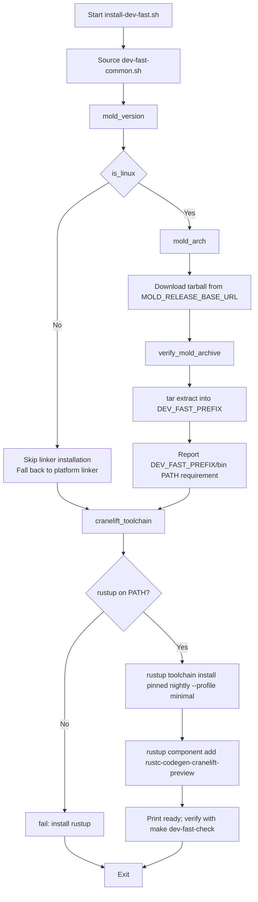
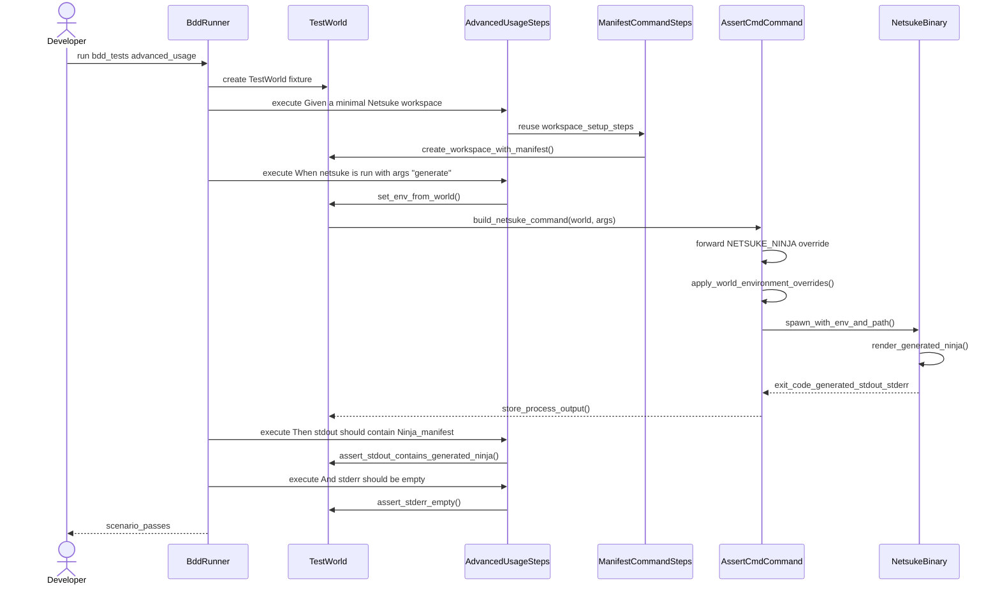

# Developer guide

This guide describes the day-to-day engineering workflow for Netsuke, with a
focus on writing and maintaining tests. It is the source of truth for how the
test suite is expected to be used by contributors.

## Command-line interface architecture

The governing command-line interface (CLI) architecture record is ADR-003,
[`Agent-consistent human-first CLI`][adr-003-cli]. It defines the pre-0.1.0
contract: keep the terminal experience human-first, make names and outputs
consistent enough for agents and automation, remove legacy aliases instead of
preserving inconsistent vocabulary, use `--json` as the only structured result
mode, keep subprocess output out of JSON stdout, and require explicit `--force`
or `--dry-run` controls for consequential operations.

The architectural source of truth for CLI behaviour is
[`docs/netsuke-cli-design-document.md`](netsuke-cli-design-document.md). Use
that document when changing command grammar, output modes, diagnostics,
localization, accessibility behaviour, configuration precedence, or planned
product surfaces such as `context`, `skill-path`, `runs`, `profile`, delivery,
and feedback commands. The overhaul execution plan in
[`docs/execplans/netsuke-cli-overhaul.md`](execplans/netsuke-cli-overhaul.md)
tracks sequencing only; it must not replace ADR-003 or the CLI design document
as the durable architecture record.

[adr-003-cli]: adr-003-agent-consistent-human-first-cli.md

## Localization

`src/locale_catalogues.rs` is the authoritative registry of shipped catalogues.
It sits at the crate root, not under `localization/`, because `localization`
builds its default localizer through `cli_localization`, and `cli_localization`
reads the registry; a registry inside `localization` would close that into a
module cycle. `localization::locales` re-exports it, so the older path still
resolves for callers. `define_locales!` declares the tags and embeds
`locales/<tag>/messages.ftl` for each, so a tag without a catalogue on disk
fails to compile. Read the registry rather than writing a separate locale list;
the build audit, the `rerun-if-changed` directives, and the packaging smoke
test all do. `tests/locale_registry_tests.rs` is the deliberate exception: its
`EXPECTED_SHIPPED_TAGS` constant writes out every shipped tag by hand rather
than reading the registry, and asserts the registry matches it. A test that
reads the registry could only confirm the registry agrees with itself, so this
list stands as an independent oracle — adding or dropping a catalogue has to be
a conscious edit to it as well as to the registry.

`Cargo.toml`'s `package.metadata.ortho_config.locales` is the one unavoidable
duplicate, because Cargo metadata cannot call into Rust. The build audit
compares it against the registry and fails on drift.

Adding a locale therefore means: create `locales/<tag>/messages.ftl` with every
declared key translated, add the tag to `define_locales!`, add it to the
`package.metadata.ortho_config.locales` array, and add it to
`EXPECTED_SHIPPED_TAGS` in `tests/locale_registry_tests.rs`. If the language
already ships a catalogue, add a `LANGUAGE_FALLBACKS` rule too, so the new tag
and the existing one resolve as intended rather than one of them capturing the
other.

Each omission is caught, but not all by the same gate. A missing catalogue file
fails compilation, because `define_locales!` embeds it with `include_str!`. A
missing `Cargo.toml` entry fails the build-time audit. A missing
`EXPECTED_SHIPPED_TAGS` entry fails `make test` rather than the build, since
the oracle is a test: that is the cost of its independence, and the reason to
run the suite before assuming a locale is wired up. The `LANGUAGE_FALLBACKS`
rule is the exception with no gate at all — it is a judgement about which
variants are interchangeable, and nothing can infer it.

Table 1: The locale API surface

| Item                                     | Purpose                                                                                       |
| ---------------------------------------- | --------------------------------------------------------------------------------------------- |
| `locales::SUPPORTED_LOCALES`             | Every shipped catalogue, ordered by tag                                                       |
| `locales::catalogue(tag)`                | Exact lookup; `None` when the tag ships no catalogue                                          |
| `locales::resolve_catalogue(identifier)` | Exact match, then the fallback rules, then the sole catalogue for that language, then `en-US` |
| `locales::source_catalogue()`            | The `en-US` catalogue every locale falls back to                                              |
| `cli_localization::build_localizer(tag)` | The runtime entry point: resolves, then layers over `en-US`                                   |

Selection matches the exact BCP 47 tag first. A tag with no catalogue resolves
through the per-language rules in `LANGUAGE_FALLBACKS`, then the sole catalogue
for that language, then `en-US`. The rules keep variants that differ in
substance apart — `es-419` from `es-ES`, `pt-BR` from `pt-PT`, `zh-Hans` from
`zh-Hant` — so a new locale whose language already ships a catalogue needs a
rule rather than the unique-language step. The
[translator guide](translators-guide.md) states the same policy for
translators, and the users' guide lists the tags.

Netsuke resolves the locale twice: `startup_localizer` before the configuration
merge, for help and usage errors, and `configure_runtime` afterwards, for
diagnostics and progress. Only the second sees a configuration file's `locale`,
because `--help` must render before Netsuke knows which configuration file to
read.

### Startup diagnostics buffering

Locale resolution happens before the command line is parsed, so a fallback
warning can be emitted before the effective diagnostic mode — human or JSON —
is known, yet the JSON diagnostic document is also written to stderr: an
eagerly emitted warning could corrupt it. `StartupWriter` in
`src/startup_tracing.rs` closes that window. It implements
`tracing_subscriber`'s `MakeWriter` and is installed by `init_tracing` in
`src/main.rs` before locale resolution runs, so every startup event is held
rather than written. The buffer is bounded at `MAX_BUFFERED_BYTES` (64 KiB): it
keeps the earliest bytes, appends a truncation marker once if the bound is
reached, and drops the remainder, so its size never depends on how much a run
emits.

`settle_startup_diagnostics` in `src/main.rs` decides where the buffer goes
once the effective mode is known: human mode releases it to stderr, JSON mode
discards it so stderr carries only the diagnostic document. In `run_with_args`,
settlement happens after the JSON mode is resolved but before the configuration
merge, so a human-mode warning still precedes any configuration processing. On
the paths where `clap` calls `Error::exit` and never returns —
`parse_cli_or_exit` — settlement happens first, because nothing after that call
would otherwise run.

Unit tests in `src/main_tests.rs` drive `startup_filter` and the real
`startup_localizer` to check the buffered warning and the level it is gated by.
`tests/startup_diagnostics_tests.rs` runs the built binary end to end,
including the configuration-driven JSON path, because the behaviour under test
spans the whole startup sequence and covers paths that terminate inside `clap`
before returning to `run_with_args`.

**Cross-references:** `docs/netsuke-design.md` §8.4, for the rationale behind
buffering rather than gating output on the resolved mode.

### Adding or changing messages

Every user-facing string is a Fluent message keyed from
`src/localization/keys.rs`. Adding one means adding the constant, adding the
message to all 35 catalogues, and keeping its `{ $variables }` identical across
them: the build audit rejects a missing key, an orphaned key, or a variable set
that differs from `en-US`. The audit lives in `build_l10n_audit/`, split into
`keys.rs` and `scanner.rs` (the `define_keys!` scanner, with `byte_index.rs`
for its byte-position bookkeeping), `ftl.rs` (catalogues), `metadata.rs` (the
Cargo metadata), and `compare.rs` (the rules). Because build scripts are not
test targets, those modules are included by path from four test files:
`tests/build_l10n_keys_tests.rs` exercises the `define_keys!` scanner
(`keys.rs`, `scanner.rs`, `byte_index.rs`); `tests/build_l10n_parser_tests.rs`
exercises the catalogue and metadata parsers (`ftl.rs`, `metadata.rs`);
`tests/build_l10n_audit_rules_tests.rs` exercises the comparison rules
(`compare.rs`, alongside `ftl.rs`); and `tests/build_l10n_audit_tests.rs` runs
the orchestration end to end, both over the checked-in tree and over
deliberately corrupted copies of it.

## Graph view projection and renderer adapters

The `graph` subcommand renders the build dependency graph in-process. Its
domain projection lives in [`src/graph_view`](../src/graph_view) and follows
the hexagonal port/adapter pattern:

- [`GraphView`](../src/graph_view/mod.rs) is the deterministic projection of
  [`BuildGraph`](../src/ir/graph.rs). It is constructed once, sorts every
  collection (nodes, edges, default targets), and is invariant under `HashMap`
  insertion order. The shuffled-insertion proptest in
  [`src/graph_view/tests.rs`](../src/graph_view/tests.rs) covers this invariant.
- `NodePathRegistry` owns graph-path deduplication. Its borrowed `entry_ref`
  lookup avoids cloning existing paths; conversion to `BTreeMap` at the
  projection boundary restores deterministic ordering. This registry is
  internal to graph projection and must not become a general application map.
- [`GraphRenderer`](../src/graph_view/render.rs) is the trait every renderer
  adapter implements. The contract is intentionally minimal:
  `render(&self, view: &GraphView, sink: &mut dyn io::Write) -> Result<(), GraphRenderError>`.
  Adapters consume `GraphView` only — they never touch `BuildGraph` directly.
- [`DotRenderer`](../src/graph_view/render_dot.rs) emits Graphviz DOT.
- [`HtmlRenderer`](../src/graph_view/render_html.rs) emits a self-contained
  HTML page (server-rendered SVG, accessible textual outline, and a
  `<noscript>` fallback containing the DOT source verbatim).

`EdgeView::class` mirrors the four Ninja dependency relations so that renderers
can style each one distinctly:

| Variant          | Ninja separator           | DOT style       | SVG class              |
| ---------------- | ------------------------- | --------------- | ---------------------- |
| `Explicit`       | none (input in `$in`)     | solid (no attr) | `edge`                 |
| `ImplicitDep`    | single pipe (`\|`)        | `style=bold`    | `edge implicit-dep`    |
| `ImplicitOutput` | single pipe on LHS (`\|`) | `style=dotted`  | `edge implicit-output` |
| `OrderOnly`      | double pipe (`\|\|`)      | `style=dashed`  | `edge order-only`      |

`ImplicitDep` carries Ninja's single-pipe implicit inputs — header files or
schemas that trigger a rebuild without appearing in `$in`. The bold stroke
reads as "rebuild-triggering hidden input," distinguishing it from the dashed
order-only stroke (no rebuild trigger) and the dotted implicit-output stroke
(auxiliary output side).

A new renderer — for example the `--json` view planned for roadmap item
`3.15.6` — should be added as a sibling module under `src/graph_view/` that
implements `GraphRenderer`. The runner dispatch in
[`src/runner/mod.rs`](../src/runner/mod.rs) picks the appropriate renderer
based on `GraphArgs` and writes through the shared `write_text_file`/
`write_text_stdout` sink helpers. The `-` sentinel for `--output` is recognized
by `process::is_stdout_path`.

`--html` and `--output` are explicitly excluded from `OrthoConfig` layering:
they are per-invocation arguments tagged `#[serde(skip)]` on
[`GraphArgs`](../src/cli/mod.rs). Layering `--output` through a config file
would silently change the artefact destination — a footgun the design avoids by
construction.

## Package and target naming

The crates.io package is `netsuke-build`; the library target, the binary
target, and the command are all `netsuke`. The names diverge because `netsuke`
is taken on crates.io. [ADR-007](adr-007-publish-as-netsuke-build.md) records
the decision and [repository layout](repository-layout.md) states the rule.

The practical consequence is that **no user-facing name may be derived from
Cargo package metadata**. Derive from the command-line interface (CLI) name, or
from the `bin-name` field that
`leynos/shared-actions/.github/actions/export-cargo-metadata` reads out of
`[[bin]]`:

- `build.rs` names the manual page `<CLI name>.1` and stamps its `.TH` source
  as `<CLI name> <version>`, taking the name from `Cli::command()`. It reads
  neither `CARGO_PKG_NAME` nor `CARGO_BIN_NAME`. The build script publishes the
  path it wrote through `cargo:rustc-env=NETSUKE_GENERATED_MAN_PAGE`, and
  `tests/man_page_contract_tests.rs` asserts the file is `netsuke.1`, is staged
  under `target/generated-man/<target>/<profile>/`, and carries a title that
  never mentions `netsuke-build`.
- Release packaging takes `bin-name` from the `metadata` job in
  `.github/workflows/release.yml`, so `.github/release-staging.toml`, the
  Debian and RPM payloads, the Windows Installer product, and the macOS
  installer package all stay named `netsuke`.
- `[package.metadata.binstall]` in `Cargo.toml` overrides `cargo binstall`'s
  default asset resolution, whose patterns place the target before the version
  and so match no released asset, leaving a fallback to a source build on the
  pinned nightly. A single template resolves a
  `{ name }-{ version }-{ target }.tar.gz` archive (`pkg-fmt = "tgz"`) for
  every released target, named after the Cargo package rather than the binary.
  `stage-release-artefacts` stages each target's archive, plus a `.sha256`
  sidecar, per `[common.binstall]` in `.github/release-staging.toml`, and the
  "Hoist cargo-binstall archives" step in `.github/workflows/release.yml` runs
  `scripts/hoist_binstall_archives.py` under a pinned Python 3.13 installed by
  `setup-uv`. The script validates that every target's archive and checksum
  are present, are regular files rather than symlinks, and have a free
  destination before moving them to the release root for upload; the read-only
  discovery and validation half lives in `scripts/hoist_binstall_discovery.py`.
  `tests/binstall_metadata_tests.rs` and
  `tests/workflow_contracts/hoist_binstall_archives_test.py` hold this
  contract.

Only the two registry installation commands name `netsuke-build`, and
`tests/documentation_installation_tests.rs` pins both. When adding a release
target, a packaging format, or an artefact name, add the target to
`.github/release-staging.toml`'s `[targets.*]` table and to the release
workflow's target matrices; the single `pkg-url` template in `Cargo.toml`
(`{ name }-{ version }-{ target }.tar.gz`) resolves new targets automatically,
with no per-target edit. `tests/binstall_metadata_tests.rs` and
`tests/workflow_contracts/hoist_binstall_archives_test.py` hold that contract,
and fail if per-target overrides reappear or the staged and expected archive
names diverge.

## Toolchain and borrow checker

Netsuke builds on the dated nightly toolchain pinned in `rust-toolchain.toml`
with the Polonius alpha borrow-checking analysis (`-Zpolonius=next`) enabled.
`rustup` provisions the toolchain automatically, and `.cargo/config.toml`
supplies the flag by default, covering Cargo invocations such as rust-analyzer
that run without `RUSTFLAGS` in the environment. Makefile recipes that set
`RUSTFLAGS` re-state the flag through the `POLONIUS_FLAGS` variable because an
inherited `RUSTFLAGS` environment variable overrides `.cargo/config.toml`. The
recipes that add `-D warnings` and `$(POLONIUS_FLAGS)` build the value as
`RUSTFLAGS="$${RUSTFLAGS:+$$RUSTFLAGS }-D warnings $(POLONIUS_FLAGS)"`; the
`$${RUSTFLAGS:+$$RUSTFLAGS }` expansion prepends any `RUSTFLAGS` already set by
the caller (for example a CI wrapper), so those flags survive rather than being
silently discarded. `cargo kani` sets `CARGO_ENCODED_RUSTFLAGS` itself, which
also overrides the table, so `make kani-full` passes the flag through
`RUSTFLAGS` as well.

[ADR-006](adr-006-adopt-polonius-nightly-toolchain.md) records the policy
decision, and the [polonius migration notes](polonius.md) track every site
whose design depends on the analysis. Sites tagged `POLONIUS(...)` fail to
compile under plain non-lexical lifetimes (NLL); do not rewrite them into
double lookups, unconditional key clones, or id indirection, and do not pad new
code with defensive clones that only NLL required. When a borrow-centric form
fails to compile, consult the migration notes before restructuring.

### Polonius CI shared-action contract

GitHub Actions jobs do not read `.cargo/config.toml` for every build they
launch, and the shared Rust setup actions export their own `RUSTFLAGS`. The
Polonius flags therefore travel as *action inputs*, not as job environment
variables: each affected workflow passes them through the relevant shared
action's `with.rustflags` input, and none of them may set a job-level
`env.RUSTFLAGS`. A job-level override would win over the action's exported
value and silently drop the flag, so the tree would fail to borrow-check with a
confusing `E0499` rather than an obvious configuration error.

Four workflows carry the contract:

| Workflow | Job | Shared action | `with.rustflags` |
| --- | --- | --- | --- |
| [`ci.yml`](../.github/workflows/ci.yml) | `build-test` | `setup-rust` | `-D warnings -Zpolonius=next` |
| [`coverage-main.yml`](../.github/workflows/coverage-main.yml) | `coverage-upload` | `setup-rust` | `-D warnings -Zpolonius=next` |
| [`netsukefile-test.yml`](../.github/workflows/netsukefile-test.yml) | `netsukefile` | `setup-rust` | `-Zpolonius=next` |
| [`build-and-package.yml`](../.github/workflows/build-and-package.yml) | `build` | `rust-build-release` | `-Zpolonius=next` |

CI and coverage add `-D warnings` because those jobs gate on a warning-free
build; the Netsukefile and packaging jobs carry the Polonius flag alone, so a
new upstream warning cannot break a release build. The coverage action's
`cargo-llvm-cov` invocation inherits the flags `setup-rust` exports and appends
its own instrumentation flags.

`NETSUKE_RUST_TOOLCHAIN` follows a separate rule. CI and Netsukefile pin it to
the channel in `rust-toolchain.toml` so those jobs provision the dated nightly
explicitly; coverage and packaging must leave it unset, because they select
their toolchain through the action's own `toolchain` input and a second,
independently edited pin would let the two disagree.

[`tests/polonius_toolchain_contract.rs`](../tests/polonius_toolchain_contract.rs)
enforces all four callers. For each one it asserts:

- the job uses the expected shared-action reference — path *and* pinned
  revision, the latter derived from the checked workflows themselves rather
  than restated in the test (see "Workflow pins and Dependabot" below for why
  the revision is asserted here);
- the `with.rustflags` value matches the table above in full, not merely that
  it contains `-Zpolonius=next`, so a dropped `-D warnings` is caught too;
- the job declares no `env.RUSTFLAGS`;
- the `NETSUKE_RUST_TOOLCHAIN` policy above — pinned to the
  `rust-toolchain.toml` channel for CI and Netsukefile, absent for coverage and
  packaging.

Run it with:

```bash
cargo nextest run --test polonius_toolchain_contract
```

Keep this section and the [Polonius migration notes](polonius.md) in step: both
describe the same contract, and the notes list every remaining harness that
must propagate the flag.

## Quality gates

Run these commands before finalizing any change:

- `make check-fmt`
- `make lint`
- `make test`

When the change touches any Markdown file — documentation, ADRs, execplans, or
the README — also run:

- `make fmt`
- `make markdownlint`
- `make nixie`

`make test` runs the non-doctest suite through
[cargo-nextest](https://nexte.st/) and then runs the doctests separately. CI
pins the runner version in `NEXTEST_VERSION` in `.github/workflows/ci.yml`.
Install that same version locally so local runs match CI; read the pin from the
workflow rather than copying the number, so the two cannot drift:

```bash
NEXTEST_VERSION="$(sed -n "s/.*NEXTEST_VERSION: '\(.*\)'.*/\1/p" \
  .github/workflows/ci.yml)"
cargo install cargo-nextest --locked --version "$NEXTEST_VERSION"
# or, for a prebuilt binary:
cargo binstall --no-confirm "cargo-nextest@$NEXTEST_VERSION"
```

See [Test execution](#test-execution) for what the checked-in nextest
configuration does and does not cover.

`make lint` starts with workspace-wide rustdoc through
`RUSTDOCFLAGS="$(RUSTDOC_FLAGS)"` and
`RUSTFLAGS="$${RUSTFLAGS:+$$RUSTFLAGS }-D warnings $(POLONIUS_FLAGS)"`. This
denies warnings, enables Polonius, and preserves any `RUSTFLAGS` supplied by
the caller. It then runs workspace-wide
`cargo clippy --workspace --all-targets --all-features` and the
[Whitaker](whitaker-users-guide.md) Dylint suite
(`whitaker --all -- --all-targets --all-features`). Install Whitaker through
the standalone installer described in the
[Whitaker user's guide](whitaker-users-guide.md) so local linting matches
continuous integration (CI); `make lint-clippy` runs the Clippy-only subset. CI
pins the installer version in `WHITAKER_INSTALLER_VERSION` in
`.github/workflows/ci.yml`. Install that same version locally so local runs
match CI; read the pin from the workflow rather than copying the number, so the
two cannot drift:

```bash
WHITAKER_INSTALLER_VERSION="$(sed -n \
  "s/.*WHITAKER_INSTALLER_VERSION: '\(.*\)'.*/\1/p" \
  .github/workflows/ci.yml)"
cargo install --locked whitaker-installer \
  --version "$WHITAKER_INSTALLER_VERSION"
# or, for a prebuilt binary:
cargo binstall --no-confirm --locked \
  "whitaker-installer@$WHITAKER_INSTALLER_VERSION"
```

`whitaker-installer` and the lint libraries are separate artefacts with
separate versions. `WHITAKER_INSTALLER_VERSION` pins the installer — the tool
that stages libraries — and nothing else. The installer keeps its own checkout
of the Whitaker repository under `~/.local/share/whitaker`, updates it with
`git pull`, and stages the libraries from its default branch. Lint behaviour
therefore tracks Whitaker HEAD.

**Running the lint libraries at HEAD is deliberate.** Netsuke follows the suite
as it develops, so new lints and fixes arrive without a version bump here. Do
not add a `[workspace.metadata.dylint]` block pinning `whitaker_suite` to a
`tag` or `rev`. The [Whitaker user's guide](whitaker-users-guide.md) documents
that form, and it is the right answer for a project wanting reproducible lint
results, but adopting it here would reverse a standing decision rather than fix
a defect.

The cost is worth stating plainly: a change upstream can alter lint results
between two runs with no change in this repository, and a local checkout that
has not been restaged will disagree with CI, which stages fresh on every job.
Restaging is what reconciles them.

What the module-scoped exemptions in `dylint.toml` actually depend on is
[Whitaker PR #315][whitaker-pr-315], which added the `excluded_paths` option,
so the staged libraries must be recent enough to include it. Libraries staged
from an older checkout ignore `excluded_paths` silently — the exemptions stop
applying with no error, and the lint reports the modules they covered. Re-run
`whitaker-installer` to restage from HEAD. If that checkout has been left on a
detached HEAD, the install fails at its `git pull`; put it back on the default
branch and re-run.

[whitaker-pr-315]: https://github.com/leynos/whitaker/pull/315

Whitaker is configured by `dylint.toml` at the repository root, where each
sanctioned ambient-filesystem scope for `no_std_fs_operations` carries a
documented rationale. `docs/whitaker-users-guide.md` is a near-verbatim import
of the [upstream Whitaker user's guide][whitaker-upstream-guide]; refresh it
from that URL rather than editing it in place, preserving the "Netsuke
deviation from upstream" callout, and record Netsuke-specific policy here and in
`dylint.toml`.

[whitaker-upstream-guide]: https://raw.githubusercontent.com/leynos/whitaker/refs/heads/main/docs/users-guide.md

Prefer `excluded_paths` over `excluded_crates`: a path entry exempts one module
and its descendants, whereas a crate entry exempts a whole compilation unit.
The application crate is scoped this way — only
`netsuke::stdlib::which::lookup` (executable discovery through `PATH` and
cross-directory symlink canonicalization, which `cap_std` cannot express) and
`netsuke::runner::process::file_io::ambient_sync` (temporary-file
synchronization, scoped to the submodule holding only that `sync_all` so the
rest of `file_io` keeps writing through `cap_std` handles), and
`netsuke::cli::discovery::paths` (canonicalizing an ambient `--directory` to
match OrthoConfig's layer paths) are exempt; the rest of `netsuke` stays under
the capability policy. The behavioural step definitions, CLI integration tests,
and shared workflow-reading helper that stage fixtures ambiently are scoped the
same way. A crate-level entry is justified only when the ambient access lives
in the crate root itself, where a path entry would be no narrower — that covers
the Cargo build script and the enumerated integration-test crates. The
`test_support` crate uses capability-backed fixture helpers and remains linted
by Whitaker under its own narrow policy.

`test_support` is a workspace member, but the root Whitaker invocation selects
only the `netsuke-build` package (the Cargo package name behind the `netsuke`
targets; see ADR-007) and disables Dylint dependency checks. It therefore
compiles `test_support` as a dependency without applying the root
`dylint.toml`. Its one sanctioned ambient boundary is configured per crate.
Workspace membership makes Dylint discover the root configuration even when
launched from `test_support/`, so the scoped recipe supplies the contents of
`test_support/dylint.toml` explicitly through `DYLINT_TOML`. The second pass
also uses `--package test_support` and `--no-deps`, because running from a
member directory alone would otherwise check the parent workspace. That
configuration names only `test_support::fs` in `excluded_paths`. The root
`excluded_crates` must not contain `test_support`: every other module in the
crate remains subject to the filesystem policy.

Permanent exceptions belong in `dylint.toml`, scoped as narrowly as the lint
allows. The lint does honour in-source lint attributes, but this repository
denies `clippy::allow_attributes`, so `#[allow(no_std_fs_operations)]` will not
compile here; an in-source exemption must be a *temporary*, item-level
`#[expect(no_std_fs_operations, reason = "…")]` that states the reason and the
route back to compliance. Prefer migrating to `cap_std` over any of these;
reach for an exclusion only when the operation is irreducibly ambient.

To confirm the exclusions have not silently widened, add a temporary
`std::fs::metadata` call to an unexcluded module — for example
`src/stdlib/which/cache.rs`, a sibling of the excluded `lookup` module, or the
body of `src/runner/process/file_io.rs` outside `ambient_sync` — then run
`make lint-whitaker`. Both sites must still be reported; revert the probe
afterwards. The same check applies to `test_support`: a `std::fs` call in, say,
`test_support/src/exec.rs` must be reported even though `test_support::fs` is
exempt.

When command output is long, preserve exit codes and logs:

```bash
set -o pipefail
make test 2>&1 | tee /tmp/netsuke-make-test.log
```

These gates always use the repository toolchain and the default codegen
backend. For a faster inner loop between gate runs, see
[local build acceleration](#local-build-acceleration).

For documentation changes, also run `make fmt`, `make markdownlint`, and
`make nixie`.

### Workflow pins and Dependabot

Dependabot owns the upgrade of GitHub Actions and reusable workflows, including
calls into `leynos/shared-actions`. Contract tests that assert a caller's exact
commit SHA create a lockstep dependency: every time Dependabot opens a bump PR,
the test fails until a human edits the pinned constant to match. That defeats
the purpose of automated dependency updates and turns a routine bump into a
manual chore.

The default, therefore, is shape-only: contract tests verify the *shape* of a
shared-action caller and not the specific SHA value. This covers both forms of
call into `shared-actions` — a step that `uses:` a composite action with a
`with:` block, and a job that `uses:` a reusable workflow. The one sanctioned
departure is a caller whose behaviour depends on a feature the shared action
gained at a known revision; the Polonius exception below is the only current
instance. The bullets that follow state the default; they do not apply to a
caller covered by that exception.

- Do assert the caller references the correct shared-action or
  reusable-workflow path.
- Do assert the ref is pinned to a full 40-character commit SHA, not a
  mutable branch such as `main` or `rolling`.
- Do assert the expected `on:` triggers, least-privilege `permissions:`, and
  the inputs the caller relies on.
- Do not hard-code the current SHA value as an expected string. Match it with
  a pattern instead.
- Do not fail a test purely because Dependabot bumped the pinned SHA.

```python
import re

SHA_RE = re.compile(r"^[0-9a-f]{40}$")

def test_uses_pinned_full_sha(caller_step):
    ref = caller_step["uses"].split("@")[-1]
    assert SHA_RE.match(ref), f"expected a 40-hex commit SHA, got {ref!r}"
```

The policy above governs callers whose behaviour does not depend on a specific
shared-action revision: the caller would keep working across any upstream bump,
so pinning the SHA in a test buys nothing and costs a manual edit per bump.
`tests/workflow_contracts/mutation_testing_test.py` is the canonical example.

#### Exception: the Polonius shared-action contract

The four workflows described under [Polonius CI shared-action
contract](#polonius-ci-shared-action-contract) do depend on a specific
revision. The `rustflags` input they rely on was introduced at a known commit
in `leynos/shared-actions`. A revision that predates it does not fail the run —
an unrecognized `with:` key on a composite action is a warning, not an error —
it simply never exports the flag, so the build fails later as a borrow-check
error rather than as a configuration error.

`tests/polonius_toolchain_contract.rs` therefore requires the four workflows'
shared-action references to agree, rather than restating the expected pin as a
constant. It extracts every `leynos/shared-actions` reference from the checked
workflows with the shared YAML-parsing helper in
`tests/support/shared_actions.rs`, validates that each is a full
40-character lowercase-hex commit SHA, and derives the pin the workflows must
share from that set. A complete bump — Dependabot's or a manual one — moves
every reference together and passes with no test edit. A partial bump, where
some workflows move and others are left behind, fails on the disagreement
between references: the same failure that previously broke `main` when a bump
missed the hand-maintained constants this contract used to hold. The
revision-level dependency on the `rustflags` input is now protected by that
agreement requirement together with `shared-actions`' own contract tests
upstream, rather than by a constant edited by hand here. Restrict this
exception to callers with a genuine revision-level dependency; everywhere
else, the shape-only policy applies.

If a workflow's behaviour does not depend on a feature from a particular commit
onwards, do not assert its SHA — express any advisory note as a comment or a
changelog entry instead.

## Mutation-testing workflow contract tests

This repository runs scheduled, informational mutation testing through a thin
caller workflow,
[`.github/workflows/mutation-testing.yml`](../.github/workflows/mutation-testing.yml),
which delegates to the shared reusable workflow
`leynos/shared-actions/.github/workflows/mutation-cargo.yml`. The heavy lifting
— running `cargo-mutants` and summarizing survivors — lives in
`shared-actions`; this repository carries only declarative configuration. The
run is **informational only**: it never gates a pull request. Survivors are
reported through the job summary and downloadable artefacts so they can be
triaged into tests, not enforced as a blocking check.

The workflow runs in two modes. A **daily schedule** (03:05 UTC) fires a
change-scoped run that mutates only the source files touched within the
detection window, so quiet days are cheap no-ops. A **manual dispatch** (the
Actions "Run workflow" control) mutates every target, fanned out across shards;
select a branch in that control to exercise a feature branch.

The caller passes two configuration inputs, each carrying intent:

- `exclude-globs` — `src/ir/cycle_verification.rs`,
  `src/ir/from_manifest_verification.rs`, and `src/ir/graph_kani_map.rs`:
  modules gated behind `#[cfg(kani)]` mod declarations. `cargo-mutants` does
  not evaluate that cfg, so mutants inserted there would compile to nothing and
  survive as noise rather than genuine test gaps.
- `extra-args` — `--all-features`, so the mutation run matches the `make test`
  CI baseline; a mismatch would report feature-gated code (the `legacy-digests`
  feature) as untested.

The caller does not set `extra-crate-dirs`, the input reserved for crate
directories outside the Cargo workspace. Netsuke is the only publishable crate,
while `test_support` is a workspace member so the ordinary documentation,
Clippy, and Whitaker gates cover its code alongside the application crate.

The `uses:` reference pins the shared workflow to a full 40-character commit
SHA rather than a branch or tag, so a force-push upstream cannot silently
change what runs here. The contract test asserts only that the pin is a full
lowercase-hex commit SHA, not a particular value — the shape-only pinning
policy described above in "Workflow pins and Dependabot" — so Dependabot bumps
it automatically without any accompanying test edit.

Because the caller is configuration rather than code, a contract test,
[`tests/workflow_contracts/mutation_testing_test.py`](../tests/workflow_contracts/mutation_testing_test.py),
pins the shape it must uphold, failing the pull request when the caller drifts
— repointing the pin at a branch, widening the token scope, or dropping a
configuration input — rather than letting the breakage surface only in a
scheduled run. Run it locally with `make test-workflow-contracts`. The test
validates:

- the `uses:` reference targets `mutation-cargo.yml` pinned to a full,
  lowercase-hex commit SHA;
- the `with:` block carries exactly the expected configuration (the
  `#[cfg(kani)]` module excludes and `--all-features`);
- job permissions are least-privilege (`contents: read`, `id-token: write`)
  and the workflow-level default token scope is empty;
- `concurrency` serializes runs per ref without cancelling one in progress;
  and
- the triggers keep the daily schedule and a plain `workflow_dispatch` with
  no legacy branch input.

Before merging this mutation-testing workflow documentation change, follow the
authoritative [Quality gates](#quality-gates) guidance and record the output of
every command in this completion checklist:

- `make fmt`
- `make markdownlint`
- `make nixie`
- `make check-fmt`
- `make lint`
- `make test`

## Spelling enforcement

`make markdownlint` enforces en-GB-oxendict (Oxford) spelling over the
repository's Markdown prose with [`typos`](https://github.com/crate-ci/typos),
as required by the [documentation style guide](documentation-style-guide.md).
The repository-root `typos.toml` is deterministically generated output
assembled from two policy layers:

1. The shared estate dictionary in `leynos/agent-helper-scripts` supplies
   generally valid Oxford forms, accepted technical terms, corrections, and
   exclusions. The generator conditionally refreshes this authority into an
   untracked local cache and reuses a valid cache when working offline.
2. `typos.local.toml` contains only Netsuke-specific names, identifiers,
   fixtures, and exclusions. It cannot replace a conflicting shared correction.

`scripts/typos_rollout_http.py` owns shared-cache freshness, HTTPS transport
security and persistence coordination. Only `scripts/typos_rollout.py` may
compose it with dictionary validation; application and release code must not
reuse these spelling-policy internals.

Pull-request CI restores the untracked dictionary and metadata before the
spelling gate. The helper still performs a conditional freshness check, then
saves refreshed state for later runs; a transient outage can therefore reuse a
validated stale cache.

The generated policy sets the `en-gb` locale to correct American spellings
(`color` to `colour`, `behavior` to `behaviour`, `analyzed` to `analysed`). It
also restores Oxford spelling through generated entries that accept `-ize`
inflections and correct their plain-British `-ise` equivalents. Stems taking
`-yse` (`analyse`, `paralyse`) remain governed by the locale.

Never edit `typos.toml` by hand. Change `typos.local.toml` and regenerate:

```bash
uv run scripts/generate_typos_config.py
```

If a legitimate Oxford form is missing estate-wide, update the shared
dictionary rather than duplicating it locally. Keep proper names and deliberate
fixtures in `typos.local.toml`. Quoted APIs keep upstream spelling, so put them
in backticks rather than adding accepted words.

`make markdownlint` runs the gate with `--force-exclude`, so the `typos.toml`
excludes also apply to explicitly passed paths. To fix findings mechanically,
rerun `typos` with `--write-changes` at the pinned version printed by
`make markdownlint`:

```bash
uv tool run typos@<TYPOS_VERSION> --config typos.toml --force-exclude \
  --write-changes <files>
```

Review automated rewrites before committing; spelling corrections must not
touch code samples, API names, or quoted material.

The `typos` version is pinned once in the Makefile `TYPOS_VERSION` variable and
run through `uv tool run typos@$(TYPOS_VERSION)`, so the local gate and CI
cannot drift. `make spelling` validates the helper implementation, regenerates
the policy, rejects tracked drift, and scans every tracked Markdown file.
`make test-typos-config` remains an alias for the focused helper tests.

## Release help tooling

Release builds generate help artefacts explicitly with `cargo-orthohelp`,
rather than from `build.rs`. The build script remains responsible for the
localization key audit only. Release automation installs the pinned tool with:

```bash
cargo install cargo-orthohelp --version 0.8.0 --locked
```

The workflow then calls:

```bash
scripts/generate-release-help.sh <target> <bin-name> <out-dir> <ps-module-name>
```

The script writes manual pages under
`target/orthohelp/<target>/release/man/man1/` and, for Windows targets,
PowerShell external help under
`target/orthohelp/<target>/release/powershell/Netsuke/`. It computes the manual
date from `SOURCE_DATE_EPOCH`, falling back to `1970-01-01` when unset or
invalid.

Keep `[package.metadata.ortho_config]` in `Cargo.toml` aligned with the CLI
when adding, renaming, or removing user-facing options. Changes to CLI
documentation metadata should be covered by `rstest` workflow/script contract
tests, plain `#[rstest]` parametrized cases for exhaustive state-enumeration
unit tests, and `rstest-bdd` release-help scenarios.
`src/cli/config_path_precedence_tests.rs` is the canonical exhaustive
state-enumeration example.

## Local build acceleration

Debug builds and tests can optionally use the [`mold`] linker and the Cranelift
`rustc` codegen backend to shorten the local edit-compile-test loop. This is a
developer convenience only. It is opt-in, it is never used for release
artefacts, and it changes nothing about what CI builds.

[`mold`]: https://github.com/rui314/mold

The canonical commands are:

```bash
make install-dev-fast   # install the pinned mold release and Cranelift backend
make dev-fast-check     # verify the prerequisites are present
make dev-build          # debug binary via Cranelift and mold
make dev-test           # the nextest pass via Cranelift and mold
```

`make dev-build` and `make dev-test` both depend on `make dev-fast-check`, so a
missing tool reports an installation hint before Cargo is invoked rather than
surfacing as an opaque codegen-backend or linker error.

### Toolchain contract

Two pins fix the linker; the toolchain is not pinned separately. Change the
pins together, never individually.

The scripts locate these files relative to their own path, so `make dev-*`, a
direct `scripts/dev-fast-check.sh`, and a run from any working directory all
resolve the same committed pins. Setting `MOLD_VERSION_FILE`,
`MOLD_SHA256SUMS_FILE`, or `RUST_TOOLCHAIN_FILE` overrides the corresponding
default; the tests use that to point the scripts at fixtures. Either way a
missing or empty file is reported as `dev-fast: missing version pin: <path>`
rather than silently becoming an empty version.

- `rust-toolchain.toml` supplies the toolchain. dev-fast deliberately shares
  the repository's own dated nightly rather than pinning a second one: the tree
  borrow-checks only under Polonius on that nightly (ADR-006), so a separate
  pin would let the accelerated loop and the gates disagree about which borrows
  are legal. `make install-dev-fast` adds `rustc-codegen-cranelift-preview` to
  that toolchain.
- `tools/mold/VERSION` holds the `mold` release tag.
- `tools/mold/SHA256SUMS` holds the SHA-256 checksum of each supported `mold`
  release artefact. `make install-dev-fast` refuses to install an artefact that
  is absent from this file or whose checksum does not match.

`make install-dev-fast` unpacks `mold` under `~/.local` by default; override
the location with `DEV_FAST_PREFIX`. Every `dev-*` recipe prepends
`$(DEV_FAST_PREFIX)/bin` to `PATH`, so an overridden prefix is the one actually
selected — `-fuse-ld=mold` resolves by `PATH` order, and the Makefile otherwise
puts `~/.local/bin` first unconditionally. Invoking the scripts directly rather
than through `make` means arranging that `PATH` order manually.

`make dev-fast-check` prints the resolved `mold` path alongside its version, so
an unexpected pick is visible. A version that differs from the pin fails the
check, as does a missing `mold` or one that cannot report its version; run
`make install-dev-fast` to install the pinned release ahead of any distribution
`mold` on `PATH`. An advisory pin is not a pin: tolerating drift would let the
linker actually in use stop matching what the repository claims.

For screen readers: the following flowchart traces `make install-dev-fast` from
start to exit. It reads the pinned linker version, then branches on the host
platform. On Linux it selects the architecture, downloads the release tarball,
verifies its checksum, unpacks it into the install prefix, and reports the
`PATH` requirement; on other platforms it skips the linker entirely and falls
back to the platform default. Both branches then converge on the toolchain
half, which reads the pinned nightly, fails early if `rustup` is absent, and
otherwise installs the toolchain and the Cranelift backend component before
printing a readiness message.


```mermaid
flowchart TD
  A["Start install-dev-fast.sh"] --> B["Source dev-fast-common.sh"]
  B --> C["mold_version"]
  C --> D{"is_linux"}
  D -- No --> E["Skip linker installation<br/>Fall back to platform linker"]
  D -- Yes --> F["mold_arch"]
  F --> G["Download tarball from MOLD_RELEASE_BASE_URL"]
  G --> H["verify_mold_archive"]
  H --> I["tar extract into DEV_FAST_PREFIX"]
  I --> J["Report DEV_FAST_PREFIX/bin PATH requirement"]

  E --> K["cranelift_toolchain"]
  J --> K
  K --> L{"rustup on PATH?"}
  L -- No --> M["fail: install rustup"]
  L -- Yes --> N["rustup toolchain install pinned nightly --profile minimal"]
  N --> O["rustup component add rustc-codegen-cranelift-preview"]
  O --> P["Print ready; verify with make dev-fast-check"]
  M --> Q["Exit"]
  P --> Q
```

**Figure**: `make install-dev-fast` control flow. The `is_linux` branch is what
keeps macOS and Windows on the platform linker while still installing
Cranelift, and `verify_mold_archive` is the point at which an artefact absent
from `tools/mold/SHA256SUMS`, or one whose checksum does not match, aborts the
installation. The final node only reports the `PATH` requirement for direct
script invocation; the `dev-*` recipes prepend `$(DEV_FAST_PREFIX)/bin`
themselves.

### Ownership boundary

The accelerated configuration lives in `tools/dev-fast/config.toml`, which is
deliberately *not* `.cargo/config.toml`. Cargo auto-discovers the latter, so
placing Cranelift and the Linux-only `mold` linker there would silently apply
them to every build in the repository, including release, packaging, coverage,
and formal-verification builds. The fragment is instead passed explicitly with
`cargo --config tools/dev-fast/config.toml` from the `make dev-*` targets, and
must not be sourced from any target that CI invokes.

A repository-root `.cargo/config.toml` does exist, and legitimately so: it
carries the Polonius flag (`[build] rustflags = ["-Zpolonius=next"]`, see
Polonius under Composition rules) needed by every build in the repository. The
rule is about what belongs in that file, not about whether it may exist:
settings needed everywhere may go there; settings that are only safe for the
accelerated dev loop must not.

The fragment sets the `codegen-backend` unstable flag,
`codegen-backend = "cranelift"` on the `dev` profile, and a
`cfg(target_os = "linux")`-gated rustflags list carrying both `-Zpolonius=next`
and `-Clink-arg=-fuse-ld=mold`.

### Composition rules

- **Quality gates.** `make check-fmt`, `make lint`, `make lint-clippy`,
  `make test`, and `make typecheck` are unchanged and remain on the
  repository's pinned nightly toolchain from `rust-toolchain.toml` with the
  default LLVM backend. The `dev-*` targets are not part of `make test`,
  `make lint`, `make check-fmt`, or `make all`, mirroring the Kani boundary
  described below. Run the ordinary gates before proposing a change;
  `make dev-test` is a faster inner-loop proxy, not a substitute.
- **`RUSTFLAGS`.** `make test-nextest`, `make doctest`, `make typecheck`, and
  the rustdoc stage of `make lint` append `-D warnings` and `$(POLONIUS_FLAGS)`
  to any flags inherited from the caller. An externally set `RUSTFLAGS`
  overrides the `[target.*]` `rustflags` in a Cargo configuration file, so the
  `dev-*` targets deliberately do not set it. Exporting `RUSTFLAGS` in the
  shell silently disables `mold` for these targets.
- **Release and packaging.** `make release` and everything under
  `.github/workflows/build-and-package.yml` use the release profile, the LLVM
  backend, and the platform linker. Cranelift is applied to the `dev` profile
  only, so it cannot reach a shipped artefact even if the fragment were loaded.
  `make build` produces a debug binary, but through the default backend and
  linker; `make dev-build` is the accelerated counterpart.
- **Coverage.** Coverage is generated through LLVM source-based instrumentation
  in `.github/workflows/ci.yml` and `coverage-main.yml`. Cranelift does not
  emit that instrumentation. Never combine the `dev-fast` fragment with a
  coverage run.
- **Formal verification.** Kani manages its own supporting nightly toolchain
  during `cargo kani setup`. That nightly is unrelated to the repository's
  Polonius nightly and must not be conflated with it; verification must run on
  Kani's own toolchain and the LLVM backend. The same applies to Verus.
- **Test runner.** `make dev-test` is the accelerated counterpart of
  `make test-nextest`, not of `make test`: it runs the same
  `cargo nextest run --workspace --all-targets --all-features`, and so is
  governed by the same [`.config/nextest.toml`](#nextest-configuration). It
  omits the `doctest` pass, because `cargo test --doc` is a separate and
  comparatively quick runner; run `make test` before proposing a change. The
  acceleration is applied through `RUSTUP_TOOLCHAIN` and `cargo --config`, both
  Cargo-level rather than runner-level, which is why they compose with nextest
  unchanged. Note the target uses `NEXTEST_BUILD_JOBS`, not `BUILD_JOBS`:
  nextest reserves `-j` for test concurrency, so a Cargo-shaped `-j` would
  silently become a thread count.
- **rust-analyzer.** No rust-analyzer configuration is committed, so the
  language server uses the repository toolchain and the default backend. Opting
  rust-analyzer into Cranelift is a personal, machine-local choice; it needs a
  separate target directory to avoid thrashing the cache shared with
  `make test`.
- **Polonius.** `.cargo/config.toml` applies `-Zpolonius=next` to every Cargo
  invocation, and the tree does not borrow-check without it (ADR-006). Cargo
  picks a single rustflags source rather than merging them, and a `[target.*]`
  table outranks that `[build]` table, so the dev-fast fragment restates the
  flag alongside the `mold` link argument. Anything that adds a rustflag there
  must restate it too: omitting it does not merely diverge from the gate, it
  stops the tree compiling.

### Fallback behaviour

- **Non-Linux hosts.** `mold` ships for Linux only, so on macOS and Windows
  `make install-dev-fast` skips the linker installation, the
  `cfg(target_os = "linux")` gate keeps the link argument inert, and
  `make dev-fast-check` prints the fallback to the platform linker explicitly.
  Cranelift still applies.
- **Unsupported architecture.** `make install-dev-fast` fails with a clear
  message rather than guessing when `uname -m` is not one of the architectures
  recorded in `tools/mold/SHA256SUMS`.
- **Missing tools.** `make dev-fast-check` names the absent component — `mold`,
  `rustup`, the pinned toolchain, or the Cranelift backend — and points at
  `make install-dev-fast`. It exits non-zero, so `make dev-build` and
  `make dev-test` stop before Cargo runs.

### Testing the tooling

Six suites cover the tooling's observable behaviour. All are hermetic — no
network, and no real `mold`, `rustup`, or Cargo — so they run as part of
`make test` on any Linux host.

- `tests/dev_fast_check_tests.rs`: the capability gate. Which diagnostic each
  failure mode emits, exit status, pin resolution, and refusal of a malformed
  pin.
- `tests/dev_fast_install_tests.rs`: the installer's happy path and its
  refusals, plus the benchmark script's Markdown output.
- `tests/dev_fast_checksum_tests.rs`: property coverage for checksum
  verification against a model.
- `tests/dev_fast_make_target_tests.rs`: the Make recipes. Toolchain and
  fragment selection; that a failed gate reaches zero Cargo invocations
  (`dev-build` and `dev-test` stop before Cargo runs); the fragment's contents;
  and `install-dev-fast` forwarding.
- `tests/dev_fast_bench_tests.rs`: `make bench-build`. Per-variant target
  directories, the clean/incremental cycle, and both variant rows.
- `tests/dev_fast_bench_lock_tests.rs`: the benchmark's exclusion lock. That a
  held lock rejects a second run before it mutates anything, that the lock is
  released however a run ends, and that a later run can take it after an
  aborted one.

The fixtures live in `test_support::dev_fast`:

- `Sandbox` builds `PATH` from nothing — an explicit allowlist of ordinary
  utilities symlinked into a temporary directory, plus whichever fakes a case
  installs — and redirects `HOME` so the Makefile's `$(HOME)/.local/bin` export
  cannot reach outside it. Prepending fakes would not do: on a machine with a
  real `mold` installed, a test could not then express "the tool is absent".
  Add to `SANDBOX_UTILITIES` when a script gains a dependency; a missing entry
  surfaces as a test failure rather than as a silent fallback to the
  developer's own tools. Every allowlisted utility must also be provisioned on
  CI's host `PATH`; `.github/workflows/ci.yml` installs GNU Awk through the
  `gawk` package and exposes its binary directly as `awk` for the sandbox's
  capability-backed executable probe. Its `write_fake` is the domain helper
  described under
  [temporary executable test helpers](#temporary-executable-test-helpers): it
  composes `write_exec_with_content`, supplying the shebang so call sites carry
  only the behaviour being faked.
- `FakeRelease` publishes a tarball under the `v<version>` path the installer
  requests and serves it over a `file://` URL, exercising the real URL layout,
  checksum verification, and strip depth. Each release owns its version, so no
  caller threads a version string around.
- `RecordingCargo` is a fake `cargo` that logs the arguments,
  `RUSTUP_TOOLCHAIN`, and `PATH` of every invocation, turning a recipe's
  command line into a checkable fact. It also records the target directory and
  whether that directory already existed, which makes a benchmark's
  clean-then-incremental cycle observable: the clean pass sees
  `TargetState::Absent` because the harness wiped the directory, and the
  incremental pass that follows sees `Present`. Seed a stale target directory
  before asserting on that, or the wipe is indistinguishable from doing
  nothing. It records the benchmark touch file's timestamp too, compared
  against a backdated baseline rather than between passes so the assertion does
  not depend on filesystem timestamp granularity.
- `PinOverrides` selects whether a script run supplies the pin-file variables.
  `Omitted` is how a test proves the scripts fall back to the committed pins.
- `MakeInvocation` describes a Make run. Variable overrides and environment
  entries are kept apart deliberately: a command-line variable outranks a `?=`
  default, whereas an environment entry is the only channel for a setting a
  script reads without the Makefile naming it.
- `test_support::dev_fast::scenario` builds on the fixtures above to assemble
  two starting points. `BuildScenario` is a sandbox where `make dev-fast-check`
  passes — pinned `mold` on the install prefix, a `rustup` reporting the
  Cranelift component, and a `RecordingCargo` installed — and is shared by the
  Make-target and benchmark suites. `BuildScenario::run(target)` returns the
  single Cargo invocation a target must produce. The scenario is shared by both
  suites so each can inspect that invocation without relying on process-global
  state. `InstallerScenario` is a sandbox with a published `FakeRelease` and a
  usable `rustup`, letting a test concentrate on the linker half of the
  installer; the installer and checksum suites share it. The module also exports
  `TEST_MOLD_VERSION`, deliberately not a real `mold` version so a test that
  accidentally reaches the network fails rather than silently succeeding
  against an upstream artefact, and `WRONG_SHA256`. `InstallerFixture` groups
  the installer's pin path, checksum path, and release URL, and renders them via
  `script_env()`.

A scenario earns its place here once a second suite needs it, and not before;
suite-specific conveniences stay with their suite — the installer tests keep
their own `ChecksumFailure` enum and `with_failure` helper, because a fixture
encoding one suite's failure taxonomy is not shared ground. Scenario
constructors stay free of assertions, so a scenario cannot decide on a caller's
behalf what counts as correct.

Assert on the shape of a timing cell, never on a duration. Reuse the sandbox
for any future target with the same shape. These tests spawn children with a
bespoke environment rather than mutating the parent's, which is what keeps them
safe to run in parallel.

Three invariants carry property coverage rather than fixed examples, because
each ranges over inputs an enumerated list tends to under-sample:

- **Checksum verification.** The strategy ranges over the structural
  relationships a checksum row can have to the artefact — right digest, wrong,
  truncated, re-cased, another artefact's, duplicated, whitespace-padded —
  rather than over random digests, which never match and so explore a single
  equivalence class. A model predicts the verdict, and the installer must agree
  with it. That model found a real defect: several rows for one artefact made
  the shell's `expected` multi-line, which silently reduced verification to
  whichever digest came last. The installer now refuses an ambiguous file.
- **Clean and incremental passes.** The strategy ranges over what each
  variant's target directory held beforehand — absent, empty, populated — and
  asserts every variant still records a clean pass then an incremental one.
  That is what the benchmark's `rm -rf` exists to guarantee; without ranging
  over prior states, the assertion holds vacuously on a fresh sandbox.
- **Timing-cell format**, as above.

Prefer a model that predicts an outcome over a table that restates one. Where
an invariant lives in a shell script, the cost is a process per case, so keep
the corpus small and the strategy structural.

`test_support` is a workspace member, so `make test` (whose nextest command uses
`--workspace`), rustdoc, Clippy, and Whitaker visit its unit tests and library
code. Keep fixture tests beside the fixture when they exercise a local
invariant; use the `tests/dev_fast_*.rs` integration crates when the assertion
spans the application-facing sandbox or Makefile contract.

### Benchmark evidence

`make bench-build` measures both paths with one repeatable command. It builds
the `netsuke` binary from an empty target directory, touches `src/main.rs`, and
rebuilds. Each variant uses its own target directory under `target/bench/`, so
neither warms the other's cache nor disturbs the working `target/` tree. The
timer reads `EPOCHREALTIME`, so this target needs Bash 5.0 or newer; it fails
with a named prerequisite on older shells rather than reporting zeroes.

`BENCH_ROOT` and `BENCH_TOUCH_FILE` default to the shared `target/bench`
directory and the tracked `src/main.rs`, so two runs in one checkout would
delete each other's caches mid-measurement and leave the touched source
permanently newer. Rather than leave that to convention, the benchmark takes
`$BENCH_ROOT.lock` exclusively for the duration of a run. A second run refuses
immediately, naming the lock and the remedy, and does so before touching
anything, so the holder's state is unaffected. The lock is released however the
run ends, including on interrupt. To benchmark two things at once, override
`BENCH_ROOT` and `BENCH_TOUCH_FILE` per run; the lock path follows
`BENCH_ROOT`, so distinct roots do not contend. If a killed run ever leaves the
directory behind, remove it.

Results below were recorded on a 24-core x86_64 Linux host, with both variants
on the repository's own `nightly-2026-06-25` supplying Cranelift 0.132.0, and
`mold` 2.41.0. Regenerate the table verbatim with `make bench-build`. Absolute
figures move with machine load, so the ratio between the two rows is the
durable signal, not the seconds; the run below is representative of three
consecutive runs that agreed to within 0.4 s.

| Variant                         | Clean build (s) | Incremental build (s) |
| ------------------------------- | --------------- | --------------------- |
| Default (LLVM, platform linker) | 11.6            | 0.8                   |
| dev-fast (Cranelift, `mold`)    | 10.7            | 0.6                   |

Table: Debug build wall-clock time for the default and accelerated paths.

Be realistic about the size of this: roughly 8% off a clean build and a quarter
off an incremental one, which on this host is a few hundred milliseconds. Two
things bound it. Both variants now share one nightly, so the comparison
isolates Cranelift and `mold` rather than also capturing a toolchain change —
earlier figures in this document did not, and overstated the gain. And the
benchmark builds only `--bin netsuke`, the smallest useful target, so it
under-represents what `make dev-test` sees, where Cranelift has every test
binary's codegen to save on. Measure the actual workload before concluding the
acceleration is or is not worth the setup.

## Formal-verification tooling

Kani is the repository-supported bounded model checker for local
formal-verification smoke checks. The supported version is pinned in
`tools/kani/VERSION`; do not install an unpinned `latest` Kani when validating
repository work.

Install or refresh the pinned Kani tool with:

```bash
make install-kani
```

`make install-kani` delegates to the pinned `rust-prover-tools` CLI through
`uv tool run`. The prover tool reads `tools/kani/VERSION`, runs
`cargo install --locked kani-verifier --version <version>`, runs
`cargo kani setup`, and verifies that `cargo kani` is callable. Kani may manage
its own supporting Rust nightly toolchain during setup. That toolchain must not
replace the repository's pinned nightly workflow (see
[ADR-006](adr-006-adopt-polonius-nightly-toolchain.md)). Kani builds pick up
`-Zpolonius=next` from `.cargo/config.toml`, so Polonius-dependent code
verifies unchanged.

Delegated prover targets print maintainer diagnostics to standard error before
invoking `rust-prover-tools`. Expect `prover-tools:` lines containing the
pinned source, Make target, redacted command shape, relevant Kani version, and
non-zero exit status on failure.

Use the Make targets for day-to-day formal-verification checks:

- `make kani-check` runs the fast local version check used by `formal-pr`.
  This check verifies the installed `cargo kani` command matches
  `tools/kani/VERSION`.
- `make kani-full` runs the complete Kani proof suite through `cargo kani`.
- `make kani-ir` is the Intermediate Representation (IR) proof-suite alias.
  It currently delegates to `make kani-full` because all Kani harnesses are IR
  harnesses.
- `make formal-pr` aliases the pull-request formal-verification smoke path.
- `make install-verus` and `make verus` delegate to `rust-prover-tools` for
  the optional Verus installer and proof runner. These targets are not part of
  the ordinary pull-request gate.

Kani is intentionally not part of `make test`, `make lint`, `make check-fmt`, or
`make all`. `Cargo.toml` declares `cfg(kani)` under
`[lints.rust] unexpected_cfgs` and sets
`[package.metadata.kani.flags] default-unwind = "6"`; both settings are part of
the harness contract and must move in lockstep with new Kani-only modules.

### Kani harness inventory

The IR harnesses are declared by the modules they verify, under
`#[cfg(kani)] mod verification`, with harness bodies stored in sibling
`*_verification.rs` files. They are private to those modules unless a future
proof genuinely needs a wider helper. This keeps production modules below the
400-line source-file limit while preserving access to private helpers.

The manifest harnesses drive production helpers rather than constructing
expected errors by hand. The cycle-detection harnesses drive
`cycle::contains_cycle`, a `cfg(kani)` production entry point that shares
`CycleDetector` traversal with `cycle::analyse` and skips only report-path
allocation and canonicalization. The cycle-canonicalization harnesses drive the
private production-owned `canonicalize_cycle_by` kernel over `u8` cycles for
N=2, N=3, and N=4, plus one direct adapter harness that checks
`canonicalize_cycle(Vec<Utf8PathBuf>)` agrees with that kernel for a two-node
path cycle. Larger path-bearing canonicalization coverage remains owned by the
`cycle_property_tests.rs` Proptest suite.

| Harness                                                     | Module                                 | Property                                                                                                | Bound                 | Notes                                                                                                                                                                     |
| ----------------------------------------------------------- | -------------------------------------- | ------------------------------------------------------------------------------------------------------- | --------------------- | ------------------------------------------------------------------------------------------------------------------------------------------------------------------------- |
| `duplicate_output_always_rejected`                          | `src/ir/from_manifest_verification.rs` | A duplicate path in one target is detected and the reported duplicate path is preserved.                | `#[kani::unwind(12)]` | Drives production `find_duplicates` with symbolic duplicate names. Full manifest lowering reaches action hashing before duplicate assertions become tractable under Kani. |
| `empty_rule_shape_is_rejected`                              | `src/ir/from_manifest_verification.rs` | An empty rule selector reaches `IrGenError::EmptyRule` and preserves the target name.                   | `#[kani::unwind(6)]`  | Drives production `resolve_rule` with a symbolic target name and a minimal rule map.                                                                                      |
| `multiple_rule_shape_is_rejected`                           | `src/ir/from_manifest_verification.rs` | A multi-rule selector reaches `IrGenError::MultipleRules` and preserves sorted rule names.              | `#[kani::unwind(8)]`  | Drives production `resolve_rule` with symbolic rule ordering over short bounded names.                                                                                    |
| `missing_rule_shape_is_rejected`                            | `src/ir/from_manifest_verification.rs` | A missing single rule reaches `IrGenError::RuleNotFound` and preserves target and rule names.           | `#[kani::unwind(6)]`  | Drives production `resolve_rule` with symbolic target and rule names and an empty rule map.                                                                               |
| `self_dependency_reports_cycle`                             | `src/ir/cycle_verification.rs`         | A self-dependency is reported as a cycle by production traversal.                                       | `#[kani::unwind(5)]`  | Drives production `contains_cycle`, which reuses `CycleDetector::visit` in boolean mode.                                                                                  |
| `two_node_cycle_reports_cycle_a_first`                      | `src/ir/cycle_verification.rs`         | A two-node cycle is reported when the `a` node is inserted first.                                       | `#[kani::unwind(5)]`  | Drives production `contains_cycle`; the separate insertion-order harnesses cover deterministic map-entry traversal under the Kani map.                                    |
| `two_node_cycle_reports_cycle_b_first`                      | `src/ir/cycle_verification.rs`         | A two-node cycle is reported when the `b` node is inserted first.                                       | `#[kani::unwind(5)]`  | Drives production `contains_cycle`; this complements the `a`-first harness, so the proof is not tied to one insertion order.                                              |
| `direct_missing_dependency_does_not_report_cycle`           | `src/ir/cycle_verification.rs`         | A single target with an absent dependency is not reported as a cycle.                                   | `#[kani::unwind(6)]`  | Drives production `contains_cycle` and proves that a missing direct dependency does not enter the cycle branch.                                                           |
| `transitive_missing_dependency_does_not_report_cycle`       | `src/ir/cycle_verification.rs`         | A two-target chain whose deeper dependency is absent is not reported as a cycle.                        | `#[kani::unwind(6)]`  | Drives production `contains_cycle` and proves that an absent dependency below another target does not synthesize a false cycle.                                           |
| `canonicalize_two_node_cycle_is_canonical`                  | `src/ir/cycle_verification.rs`         | Two-node canonicalization preserves length, closure, interior multiset, smallest start, and rotation.   | `#[kani::unwind(6)]`  | Drives private production `canonicalize_cycle_by` over distinct symbolic `u8` interior IDs. Direct `Utf8PathBuf` proof attempts exceeded the local 8 GiB cap.             |
| `canonicalize_three_node_cycle_is_canonical`                | `src/ir/cycle_verification.rs`         | Three-node canonicalization preserves length, closure, interior multiset, smallest start, and rotation. | `#[kani::unwind(6)]`  | Drives private production `canonicalize_cycle_by` over distinct symbolic `u8` interior IDs.                                                                               |
| `canonicalize_four_node_cycle_is_canonical`                 | `src/ir/cycle_verification.rs`         | Four-node canonicalization preserves length, closure, interior multiset, smallest start, and rotation.  | `#[kani::unwind(6)]`  | Drives private production `canonicalize_cycle_by` over distinct symbolic `u8` interior IDs.                                                                               |
| `canonicalize_path_wrapper_matches_u8_kernel_for_two_nodes` | `src/ir/cycle_verification.rs`         | The path-bearing wrapper agrees with the `u8` kernel for both two-node path orderings.                  | `#[kani::unwind(6)]`  | Drives production `canonicalize_cycle(Vec<Utf8PathBuf>)` once per concrete two-node ordering and compares the result with the kernel's `u8` output.                       |

Under `cfg(kani)`, `src/ir/graph.rs::IrHashMap` is a fixed-capacity
deterministic compatibility layer used by production IR code under proof. Under
ordinary builds it is a type alias to `std::collections::HashMap`, so the public
`netsuke::ir` API remains unchanged.

Mutation evidence for these harnesses lives under
`docs/verification/mutations/`. File names use the harness path with `::`
replaced by `__`, for example
`ir__cycle__verification__self_dependency_reports_cycle.patch`.

### Kani cfg compile-time checks

`tests/kani_cfg_ui_tests.rs` keeps the Cargo-side `cfg(kani)` contract covered
outside the Kani runner. The trybuild case `tests/ui/cfg_kani_policy_pass.rs`
checks that `Cargo.toml` still declares `[package.metadata.kani.flags]`,
`unexpected_cfgs`, and `check-cfg = ["cfg(kani)"]`, and that the Makefile still
provides the `kani-ir` alias.

The same test module invokes `rustc` directly for two small UI snippets:

- `tests/ui/cfg_kani_compile_pass.rs` must compile with
  `--check-cfg=cfg(kani) -Dunexpected-cfgs`.
- `tests/ui/unknown_cfg_compile_fail.rs` must fail under the same flags and
  name the rejected cfg in stderr.

Do not mutate `RUSTFLAGS` in these tests. Trybuild removes ordinary `RUSTFLAGS`
when it creates its temporary project, and repository tests avoid global
environment mutation unless a guarded helper is already in place.

Phase 1 keeps the rest of the formal-verification surface deliberately narrow.
Kani is the only supported and gated formal-verification tool today. Verus is
optional, proof-kernel-only, and not installed or run by default; any first
Verus work must stay outside ordinary Cargo and focus on a small cycle
canonicalization model. Stateright is deferred entirely until Netsuke gains an
accepted stateful concurrent subsystem such as a daemon, watch service,
remote-execution coordinator, actor protocol, or internal scheduler with
long-lived mutable control-plane state. See
[`docs/formal-verification-methods-in-netsuke.md`](formal-verification-methods-in-netsuke.md)
for the design rationale and re-entry criteria.

Pull requests run a dedicated `kani-smoke` CI job alongside the ordinary
`build-test` job. The job installs `uv`, installs the pinned Kani version
through `make install-kani`, runs `make kani-check` as a version-drift guard,
and then runs the bounded harness suite through `make kani-ir` under a
20-minute job timeout; it does not run `make verus`, coverage, CodeScene
upload, or the normal build matrix. Its cache is intentionally separate from
ordinary Cargo build artefacts: the job uses a Kani-specific cache key derived
from `tools/kani/VERSION` and the Makefile, then caches the job-local Kani
Cargo home plus Kani support-file home.

## Test execution

`make test` is the canonical entry point and composes two passes:

- `make test-nextest` —
  `cargo nextest run --workspace --all-targets --all-features`, with
  `RUSTFLAGS="$${RUSTFLAGS:+$$RUSTFLAGS }-D warnings $(POLONIUS_FLAGS)"` (the
    Makefile re-states the Polonius flag because a set `RUSTFLAGS` overrides
    `.cargo/config.toml`, and the `$${RUSTFLAGS:+$$RUSTFLAGS }` prefix preserves
  any `RUSTFLAGS` inherited from the caller). This runs every unit, integration,
  `rstest`, and `rstest-bdd` test.
- `make doctest` — `cargo test --workspace --doc --all-features`, with
  `RUSTFLAGS="$${RUSTFLAGS:+$$RUSTFLAGS }-D warnings $(POLONIUS_FLAGS)"`. This
  preserves flags inherited from the caller and restores Polonius while denying
  warnings. nextest cannot execute doctests, so they need their own pass; the
  separate target is what makes a broken documentation example fail the gate.

If either pass fails, `make test` fails. Run the individual targets when
iterating, but treat `make test` as the gate.

Cargo spells build parallelism `-j`; nextest reserves `-j` for test concurrency
and spells build parallelism `--build-jobs`. The Makefile therefore keeps
`BUILD_JOBS` (Cargo flags) and `NEXTEST_BUILD_JOBS` (nextest flags) as separate
variables rather than reinterpreting one as the other.

### nextest configuration

The runner is configured by `.config/nextest.toml` at the workspace root. It
governs the non-doctest pass only, and deliberately stays small:

- **No serialized environment group.** Environment-dependent tests inject
  readers or configure child processes, so all test binaries can run in
  parallel without mutating the harness environment.
- **No blanket retries.** A test that fails intermittently is a defect to
  diagnose. Add a targeted override with a written rationale only when a
  genuine external-resource constraint requires one.
- **A conservative slow timeout** (warn after 60s, terminate after five
  warning periods) so a hung test surfaces without failing the legitimately
  slow documentation end-to-end suites, which shell out to real Ninja.

### How this relates to the isolation utilities

nextest runs each test in its own process, but the codebase does not rely on
that isolation for environment safety. Tests pass environment values through
explicit configuration seams or configure a child with `env_clear()` followed by
`Command::env`. `EnvLock` and `CwdGuard` remain only for the few tests that
exercise process working-directory behaviour, because the in-process coverage
runner shares that state.

### Runners not covered by this configuration

- **Coverage** (`.github/workflows/coverage-main.yml`, and the coverage step in
  `ci.yml`) delegates to the `generate-coverage` shared action, which drives
  its own `cargo llvm-cov` invocation. It does not call `make test` and is
  unaffected by `.config/nextest.toml`.
- **Mutation testing** (`.github/workflows/mutation-testing.yml`) calls the
  shared `mutation-cargo.yml` reusable workflow with `--all-features`, matching
  the feature set `make test` uses. Its runner is owned by that workflow.

Changing either to use nextest is a deliberate decision, not something that
should follow implicitly from this file.

## Test suite map

Netsuke uses a mixed strategy:

- Unit and integration tests live under `tests/` as ordinary Rust test files.
- Behavioural tests use Gherkin feature files in `tests/features/` and
  `tests/features_unix/`.
- Behavioural step definitions and fixtures live in `tests/bdd/`.
- Behavioural test discovery is defined in `tests/bdd_tests.rs`.
- Dependabot configuration lives in `.github/dependabot.yml`, with coverage
  tests in `tests/dependabot_config_tests.rs`.
- **Property-based tests** use `proptest` and live in `*_tests.rs` modules
  adjacent to the code under test, included via
  `#[cfg(test)] #[path = "..."] mod ...;` declarations.

The Dependabot integration tests parse the checked-in configuration and verify
that repository dependency manifests remain covered as the tree changes. They
assert the Cargo and GitHub Actions update policies, the configured schedules,
open pull request limits, and labels. They use `git ls-files` to compare the
Cargo directories against tracked `Cargo.toml` manifests, so the test runner
requires the Git command-line client. The comparison skips source trees that
are not Git checkouts, because tracked-manifest hygiene cannot be determined
there. The tests require workflow YAML files under `.github/workflows` and
ensure local composite action manifests under `.github/actions` are covered by
the configured Dependabot directory patterns.

`tests/packaging_smoke_tests.rs` runs `cargo publish --dry-run` to verify the
packaged crate builds successfully for release. It then uses
`cargo package --list` to confirm that the packaged manifest retains
build-script sources, including the `build_l10n_audit/` modules, and rejects
stale `ninja_env/` paths. It also asserts that every catalogue named by the
locale registry ships in the package, so adding a locale cannot silently omit
its `messages.ftl` from a release. Package `include` patterns are anchored to
the crate root so similarly named files below local caches cannot leak into the
archive. The smoke test also confirms that `.uv-cache/` and the workspace-only
`test_support/` crate are absent from the netsuke package.

`tests/man_page_contract_tests.rs` and `tests/binstall_metadata_tests.rs` guard
the package-versus-target naming split described in
[package and target naming](#package-and-target-naming). The first asserts the
manual page `build.rs` generates; the second pins the single
`[package.metadata.binstall]` `pkg-url` template against the release staging
configuration and the workflow target matrix, and fails if per-target
overrides reappear.

The hoist step that makes that template resolvable is covered by
`tests/workflow_contracts/hoist_binstall_archives_test.py`, which combines
example-based cases with Hypothesis property tests over generated target sets
and staging states. Run it with `make test-workflow-contracts`; the target
provisions `pytest`, `pyyaml`, and `hypothesis` through `uv run --with`, so
`uv` is the only prerequisite and no virtual environment needs creating by
hand.

### Temporary executable test helpers

The low-level executable-stub primitive is owned by
[`test_support::exec`](../test_support/src/exec.rs). Use
`write_exec_with_content` only from test-support or test code that needs a
temporary executable with controlled script content; production code must not
call it. Prefer higher-level domain helpers, such as the fake-Ninja factories,
when they fit. The caller composes the primitive with a temporary directory and
retains that directory for as long as the executable is needed.

Callers supply a platform-appropriate filename and script body. The helper
writes that content and applies executable permissions only on Unix.
`write_exec` is the minimal-script convenience wrapper;
`write_exec_with_content` is the shared primitive for custom behaviour.

The helpers take `&Utf8Path` and return `Utf8PathBuf`, matching the camino
types used throughout Netsuke. Callers that already hold camino paths pass them
directly. `tempfile::TempDir::path()` still yields an OS-native `&Path`, so
callers convert at that boundary with `exec::utf8_path`, the single conversion
point. `utf8_path` returns a `Result` rather than panicking: it names the
offending path in the error (`path is not valid UTF-8: {path}`), and callers
propagate it with their own context, as `fake_ninja` and
`fake_ninja_check_build_file` do.

```rust
let temp = TempDir::new()?;
let root = exec::utf8_path(temp.path()).context("temporary directory")?;
let stub = write_exec(root, "tool")?;
```

Because a camino path cannot represent a non-UTF-8 path, the fake-executable
factories now fail on a temporary directory whose path is not valid UTF-8,
rather than succeeding as they previously did. The `test_support` test
`fake_ninja_helpers_reject_non_utf8_temp_directories` pins this behaviour.

### User-facing documentation examples

Every fenced example in `README.md`, `docs/users-guide.md`, and
`docs/stdlib-yaml-and-jinja-guide.md` has a stable `tested-example` marker
immediately before its opening fence. The shared
`tests/documentation_examples/mod.rs` loader owns this marker format and may be
called only by documentation-focused integration or behavioural tests. It
rejects unmarked fences, duplicate identifiers and unterminated examples.

`tests/documentation_examples_tests.rs` loads the exact fenced text, generates
Ninja for every manifest fence and each complete manifest linked from the
user's guide, and checks selected command and output contracts against the
current binary. On Unix, `tests/documentation_examples_e2e_tests.rs` uses real
Ninja to execute the documented first-run build and `cat hello.txt`, exercise
the configured default target, verify the photo-edit and writing outputs, and
run the standard-library manifests in isolated workspaces with controlled
fixtures, environment variables, and stub executables. The registered `fetch`
expression is intentionally checked without execution so this suite never makes
a network request. `tests/documentation_examples_loader_tests.rs` covers
concrete malformed-fence and non-YAML failure cases.

The first-run README and user's guide examples also run through the
`rstest-bdd` scenarios in `tests/features/documentation_examples.feature`.
These reuse the novice smoke tests' fake-Ninja flow to verify the Netsuke
invocation and status output. Tests must load fenced text through the shared
helper instead of maintaining copied fixtures.

### Property-based testing with proptest

`proptest` generates randomized inputs to verify invariants that must hold for
all valid inputs.

- Use the `proptest!` macro; write assertions with `prop_assert_eq!` /
  `prop_assert!` rather than `assert_eq!` / `assert!` inside proptest bodies.
- Environment-dependent properties must use injected providers. When the
  contract itself requires ambient discovery, configure a child process with
  `env_clear()` followed by `Command::env`; do not mutate the harness process.
- Canonical example: `src/cli/config_path_precedence_tests.rs` -
  `resolve_config_path_obeys_precedence_invariant` asserts the
  `explicit_config_path` selector-precedence invariant for generated optional
  paths.

### Parametrized unit tests with rstest

Plain `#[rstest]` (not rstest-bdd) is used for exhaustive state-enumeration
unit tests where a small fixed set of cases must all be verified.

- Annotate the test function with `#[rstest]` and supply cases via
  `#[case(...)]` parameters.
- Canonical example: `src/cli/config_path_precedence_tests.rs` -
  `resolve_config_path_precedence` enumerates all four combinations of
  `--config` and `NETSUKE_CONFIG` presence.

## IR dependency classes

`src/ir/from_manifest.rs` lowers manifest `sources` into `BuildEdge.inputs`,
manifest `deps` into `BuildEdge.implicit_deps`, and manifest `order_only_deps`
into `BuildEdge.order_only_deps`. Keep those classes separate: recipe
interpolation (`$in` and `{{ ins }}`) receives only `BuildEdge.inputs`, while
`src/ninja_gen.rs` renders implicit deps with Ninja's single-pipe separator.

`src/ir/cycle.rs::CycleDetector::visit` traverses `inputs` and `implicit_deps`
when detecting cycles. It intentionally does not traverse `order_only_deps`,
because order-only dependencies express scheduling order rather than rebuild
freshness.

### Recipe placeholder ownership

`src/ir/cmd_interpolate.rs` owns the private `INS_TOKEN` and `OUTS_TOKEN`
constants used between manifest rendering and IR command interpolation.
`src/manifest/render.rs` may emit these tokens while rendering `{{ ins }}` and
`{{ outs }}`, and the interpolation module must consume them alongside `$in` and
`$out`. Keep the constants private to the crate and use them only for this
two-stage recipe pipeline; they are implementation markers, not manifest or
Ninja syntax and not a general token registry.

Generated strategies that are reusable across crate boundaries belong in
`test_support`. Because `test_support` is compiled as a library, dependencies
used in those strategy signatures, including `proptest`, must be regular
`test_support` dependencies. Property tests local to the main crate continue to
use the root crate's development dependency.

## Behavioural testing strategy

Behavioural tests use `rstest-bdd`, not a bespoke runner, and are executed by
cargo-nextest alongside every other test (see
[Test execution](#test-execution)). The `scenarios!` macro in
`tests/bdd_tests.rs` discovers feature files and binds a shared fixture entry
point (`world: TestWorld`) to each generated scenario test.

nextest runs each generated scenario in its own process. That reinforces the
per-scenario isolation policy below rather than conflicting with it: scenario
state cannot leak across process boundaries, so the policy's requirement to
recreate state per test is enforced by the runner as well as by convention.

### State and isolation policy

- Scenario isolation is the default: scenario state must be recreated per test.
- Shared process-wide state is avoided unless infrastructure cost requires
  controlled reuse.
- Use `Slot<T>` for optional or replaceable scenario values.
- Use typed wrappers in `tests/bdd/types.rs` for step parameters to avoid
  ambiguous string-heavy signatures.

### Step authoring policy

- Keep `Given` steps for context and setup.
- Keep `When` steps for one observable action.
- Keep `Then` steps for user-visible outcomes, not internal implementation
  details.
- Prefer explicit, domain-focused helper functions over large step bodies.
- Keep step modules cohesive by domain (`cli`, `manifest`, `ir`, `stdlib`,
  `process`, `locale_resolution`).

### Compile-time safety

`rstest-bdd-macros` is configured with `strict-compile-time-validation`, so
missing or ambiguous step bindings should be treated as compile-time failures.

## rstest-bdd v0.5.0 usage

The migration plan and implementation record are tracked in
`docs/execplans/rstest-bdd-v0-5-0-behavioural-suite-migration.md`.

Current usage in this repository is:

- `rstest-bdd` and `rstest-bdd-macros` pinned to `0.5.0`.
- Step parameters favour typed wrappers from `tests/bdd/types.rs`; wrappers
  implement `FromStr` so step signatures can use domain types directly.
- Prefer inferred step patterns for simple, no-argument steps when this
  reduces duplication and keeps feature wording clear.
- Use `rstest_bdd::async_step::sync_to_async` for manual sync-to-async wrappers
  and the concise wrapper aliases (`StepCtx`, `StepTextRef`, `StepDoc`,
  `StepTable`) where required.
- Introduce async step definitions only where asynchronous behaviour is natural
  and improves coverage.
- Keep async execution on Tokio current-thread runtime for behavioural tests.
- Restrict `#[once]` fixtures to expensive, effectively read-only
  infrastructure.

These points are strategy rules, not optional style guidance.

## How to add or update behavioural tests

1. Add or update the feature text in `tests/features/` or
   `tests/features_unix/`.
2. Implement or update matching steps under `tests/bdd/steps/`.
3. Reuse existing fixtures/helpers before adding new world state.
4. Add typed parameter wrappers in `tests/bdd/types.rs` when step arguments
   represent distinct domain concepts.
5. Run `cargo nextest run --test bdd_tests` and then the full quality gates.

## Manifest `foreach` expansion

Manifest collection expansion is implemented by `expand_foreach` in
`src/manifest/expand.rs`. It processes collection-valued manifest entries such
as `targets` and `actions`: each item may define `foreach` to create one
concrete item per value, and may define `when` to filter generated or static
items before later manifest stages run.

The pipeline is:

1. Manifest parsing produces a mutable `ManifestValue` document.
2. The manifest expansion stage passes that document and the configured
   MiniJinja `Environment` to `expand_foreach`.
3. `expand_foreach` reads `targets` and `actions`, evaluates each item's
   `foreach` expression or literal sequence, evaluates any `when` guard, injects
   `vars.item` and `vars.index` for generated items, and replaces each
   original collection with the expanded concrete list.
4. Downstream deserialization and rendering consume the expanded
   `ManifestValue`; they should not see the `foreach` or `when` control keys.

Callers must treat expansion as fallible. Errors can come from malformed item
metadata, such as a non-object `vars` value, expression parse or evaluation
failures in `foreach` or `when`, and serialization failures while copying the
MiniJinja item value into manifest `vars`. Propagate these errors with context
rather than defaulting to a partially expanded `ManifestValue`.

Minimal target-level example:

```yaml
targets:
  - name: "lint-{{ item }}"
    foreach:
      - src
      - tests
    when: "item != 'tests' or env.CI == 'true'"
    command: "cargo clippy --manifest-path {{ item }}/Cargo.toml"
```

## Test isolation utilities

Environment variable mutations and working-directory changes are process-global
side effects that can cause data races when tests run in parallel. Tests inject
environment readers where the API supports them, and configure child processes
with `env_clear()` followed by `Command::env` where ambient discovery is part
of the contract. `CwdGuard` is the RAII utility for restoring a process working
directory after the few tests that exercise it. For locale-sensitive snapshot
tests, use the `EnLocalizer` scoped pattern documented in the
[snapshot testing guide](snapshot-testing-in-netsuke-using-insta.md#locale-pinned-snapshot-tests).

`src/snapshot_test_support.rs` owns output-oriented unit-test fixtures;
`no_color_env` is shared across output-preference and theme tests that exercise
optional `NO_COLOR` lookup behaviour.

### `test_support::fs`

`test_support::fs` (`test_support/src/fs.rs`) is the crate's single
ambient-filesystem boundary. Fixture code routes filesystem access through it
rather than reaching for `std::fs` directly; Whitaker enforces this (see
[Quality gates](#quality-gates)) for every other module in the crate.

Most wrappers forward to their `std::fs` namesake unchanged. These are worth
calling out because their behaviour, platform support, or reason for existing
is not obvious from the name:

- `is_dir(path) -> bool` mirrors `Path::is_dir`: it follows symlinks, and an
  absent or unreadable path returns `false` rather than surfacing the
  underlying metadata error. Fixture code must use this wrapper for directory
  predicates rather than calling `std::fs::metadata(...).is_dir()` or
  `Path::is_dir` directly. `test_support/src/manifest.rs` is an existing caller:
  `ensure_manifest_exists` uses it both to reject a directory where a manifest
  file is expected, and to accept a destination directory that is already
  present.
- `try_is_file(path) -> io::Result<bool>` is the fallible counterpart to the
  boolean predicates: `Ok(true)` when the path is a regular file, `Ok(false)`
  when it is absent (`NotFound` is folded into the boolean result), and `Err`
  for any other metadata failure, so callers can distinguish absence from
  inaccessibility. The binary locator in `test_support/src/netsuke.rs`
  (`netsuke_executable_from`, see
  [Locating the netsuke binary](#locating-the-netsuke-binary)) relies on it to
  surface unexpected filesystem errors while probing candidate paths.
- `is_executable_file(path) -> bool` (Unix only) is `true` when the path is a
  regular file with any execute bit set, and `false` for an absent or
  unreadable path. It is the inverse of `set_mode`, and exists for probing a
  sandbox `PATH` the way an executable lookup would.
- `copy(from, to) -> io::Result<u64>` forwards to `std::fs::copy`, returning
  the number of bytes copied and propagating its failure. The `dev_fast`
  release fixtures use it to place a built archive under its versioned name.
- `modified(path) -> io::Result<SystemTime>` returns the file's modification
  time. It propagates both the metadata failure and the platform's failure to
  report a timestamp, so it is `io::Result` rather than an `Option`. The
  `dev_fast` staging fixtures use it to assert a file was or was not rebuilt.
- `write_with_mtime(path, contents, mtime) -> io::Result<()>` (Unix only)
  creates or truncates `path`, writes `contents`, and sets the modification
  time to `mtime`, propagating whichever step fails. The staging fixtures use
  it to backdate a file so a later build sees it as stale.

`write_with_mtime` is the reason `test_support/dylint.toml` carries no
`dev_fast` exemption. Backdating a fixture needs one open file for both the
write and the timestamp, which reads like an irreducibly ambient operation that
has to happen at the call site. Taking the timestamp as an argument keeps the
handle inside this module instead: the caller never sees a `File`, so the
ambient boundary stays where the lint expects it. Prefer that shape — pass in
what the operation needs and keep the handle here — over widening an exclusion
to a module that wants a raw `File`.

### Shared Makefile contract helpers

`tests/support/makefile.rs` is a shared module for integration tests that
assert facts about the repository's `Makefile` — for example, that a target
declares a given prerequisite or recipe. It provides five helpers:

- `repo_root() -> Result<cap_std::fs_utf8::Dir>` opens the repository root
  through `cap_std::fs_utf8::Dir` and `ambient_authority()`, so a contract test
  cannot read outside the checkout.
- `read_repo_file(relative: &Utf8Path) -> Result<String>` reads a file under
  the repository root via that capability-scoped directory.
- `parse_rule(line: &str) -> Option<(&str, Vec<&str>)>` parses a single
  `target: prerequisites` line. It returns `None` for recipe or continuation
  lines, comments, `.PHONY`-style directives, and variable assignments (`:=` is
  caught by testing whether the text after the colon starts with `=`). It
  strips trailing `##` help comments from the prerequisite list.
- `target_prerequisites(contents: &str, target: &str) -> Option<Vec<String>>`
  finds a target's rule line and returns its prerequisites.
- `target_recipe(contents: &str, target: &str) -> Option<String>` returns
  `Some("")` for a target with no recipe and `None` for an absent target. Blank
  lines inside a recipe are traversed but dropped, so a recipe split by a blank
  line is returned whole.

Because every file under `tests/` compiles as an independent crate, there is no
library through which to share this module, and `tests/support/` is a
subdirectory that Cargo does not auto-discover as a test target. Consumers
include it with:

```rust
#[path = "support/makefile.rs"]
mod makefile;
```

This mirrors the shape of `tests/common/mod.rs`, which the workflow-contract
crates include with `mod common;`. The module carries its own `#[cfg(test)]`
unit tests covering every helper, so a consumer that needs only part of the
surface does not trip `dead_code`; these tests run once per including crate.

Scope and reuse policy: this module exists only for static Makefile contract
tests and capability-scoped reads from the repository root. It must not grow
into a general test-utility bag — fixture construction, process invocation, and
environment control belong in the `test_support` crate, which is versioned,
linted, and documented as such. A helper earns a place here only when more than
one contract test needs the same reading or parsing behaviour. Nothing in it
runs Make, runs Cargo, or writes anything.

### The Makefile `RUSTFLAGS` contract tests

`tests/makefile_test_target.rs` is the crate root for the Makefile contract
tests. It includes `tests/support/makefile.rs` for the capability-scoped read
and recipe-lookup helpers, pins the `make test` runner contract, and declares
two child modules that together own the `RUSTFLAGS` contract:

- `tests/makefile_test_target/rustflags.rs` models every recipe line that
  assigns `RUSTFLAGS` as a `RustflagsCase` — the Make target, the substring
  selecting the line, and the warning and inheritance policies the line must
  uphold.
- `tests/makefile_test_target/rustflags_polonius_tests.rs` covers the
  `POLONIUS_FLAGS` resolution guard directly, against synthetic Makefile text.

The tests assert on what a shell would produce, not on recipe text. For each
case, `rustflags.rs` extracts the double-quoted assignment, resolves
`$(POLONIUS_FLAGS)`, reduces Make's `$$` escape to the single `$` the shell
receives, and — on Unix only — expands the resulting expression with
`printf '%s'` under `sh`. Only the assignment is expanded; the command the
recipe would run is never executed, so no test here invokes Cargo, Kani,
nextest, or Dylint. Expansion needs a shell, so the behavioural tests and the
policy fields they read are gated on `#[cfg(unix)]`; the parsing tests are not.
Two guards keep the model honest: `shell_expression` refuses an expression
still naming an unresolved Make variable or embedding a shell command
substitution, and a completeness test walks the Makefile and fails when a line
sets `RUSTFLAGS` without a matching case, so a new recipe joins the contract or
breaks the build.

`polonius_flags(makefile) -> Result<String>` is the crate-visible resolver both
modules share. It reads the `POLONIUS_FLAGS` variable and rejects two states:

- **Missing** — no `POLONIUS_FLAGS ?= …` or `POLONIUS_FLAGS = …` line, reported
  as "Makefile should define POLONIUS_FLAGS".
- **Empty after trimming** — a definition whose value is blank or whitespace
  only, reported as "POLONIUS_FLAGS should not be empty".

The rejection matters because every assertion built on the resolved value uses
`contains`, which an empty needle satisfies vacuously. Returning an empty string
would silently void the Polonius contract instead of failing it. On success the
resolver returns the trimmed value, and a bounded proptest in
`rustflags_polonius_tests` pins that acceptance invariant: resolution succeeds
exactly when a definition exists whose value is non-empty after trimming, and
the resolved text is the trimmed value. Its generator emits absent,
whitespace-only, and whitespace-padded flag tokens, so an untrimmed return fails
the property rather than slipping past.

Because `rustflags.rs` and `rustflags_polonius_tests.rs` are children of the
`makefile_test_target` test binary rather than files under `tests/`, Cargo does
not compile them as separate targets. The root declares them, and they reach the
shared helpers through `use super::{read_repo_file, target_recipe}`. Keep this
shape for further Makefile contract work: general parsing helpers belong in
`tests/support/makefile.rs` once a second contract test needs them, whereas
model types such as `RustflagsCase` stay private to the contract they describe.

### `EnLocalizer` field ordering

`EnLocalizer` (`test_support/src/localizer.rs`) holds both the localizer
override guard and the global localizer mutex guard:

```rust
pub struct EnLocalizer {
    _guard: LocalizerGuard,
    _lock: MutexGuard<'static, ()>,
}
```

The declaration order is load-bearing: struct fields drop in declaration order,
so `LocalizerGuard` must be declared before the mutex guard. That keeps the
mutex held while `LocalizerGuard` restores the process-global localizer, so a
test waiting on the lock cannot acquire it, install its own override, and
capture this test's override as its "previous" state.

`en_localizer()` recovers a poisoned `LOCALIZER_TEST_LOCK` with
`PoisonError::into_inner` rather than propagating the poison: a poisoned lock
only means an earlier test panicked while holding it, and `set_en_localizer`
re-establishes the global state unconditionally, so the recovered guard is
still safe to use. See the
[locale-pinned snapshot tests](snapshot-testing-in-netsuke-using-insta.md#locale-pinned-snapshot-tests)
section for the fixture's intended usage.

### Enforcing the environment mandate

`clippy.toml` disallows the six process-environment entry points, so
`make lint` rejects a new one:

```toml
disallowed-methods = [
  { path = "std::env::var", reason = "inject an environment reader" },
  { path = "std::env::set_var", reason = "use a stub environment in tests" },
  # ... var_os, vars, vars_os, remove_var
]
```

The reason string appears in the diagnostic, so a contributor who trips the
lint is told what to do instead, not merely that they may not. `test_support`
is a workspace member and carries its own Clippy configuration file because
Clippy configuration is discovered per crate, even when `make lint` invokes
Clippy once with `--workspace`. The root and `test_support/clippy.toml` files
therefore intentionally repeat the CodeScene complexity and size ceilings,
`allow-expect-in-tests`, and the environment-method restrictions. Keep these
shared settings synchronized: `[workspace.lints]` shares lint levels, but not
the values in `clippy.toml`.

Dylint resolves configuration differently. A workspace member discovers the
workspace-root configuration, so `test_support` needs the separate Whitaker
invocation and `DYLINT_TOML` override described in
[Quality gates](#quality-gates) to load its narrow `test_support/dylint.toml`
boundary policy.

### Environment and template ports

The seams described in this section follow one of three sanctioned shapes —
narrow closures, `mockable::Env`, or `EnvReader` — chosen by call-site count,
expected growth, and `Send + Sync` registration requirements: use
`mockable::Env` when a boundary is expected to acquire more inputs, even
before its call-site count grows. See
[ADR-008](adr-008-environment-seam-taxonomy.md) for the taxonomy.

`manifest::EnvReader` owns environment lookup for the manifest `env()` helper.
Production constructs the process-backed adapter at the manifest loading
boundary; tests pass an `Arc`-backed reader directly. The port is only for
manifest template lookup and must not become a general configuration service.

Manifest macro registration stores import declarations in the Jinja
environment. Each invocation captures the macro from the active template state
and immediately evaluates it; callers must use the shared manifest rendering
helper so caller blocks retain their template context. This adapter belongs to
manifest rendering and must not be reused as a general MiniJinja cache.

The stdlib's `HomeDirectory` value keeps `expanduser` deterministic: the
`Ambient` variant reads the process-backed home at the composition boundary,
`Explicit` supplies a test or caller-selected value, and `Missing` makes a
missing-home error observable. `path::register_filters` receives this value
when it installs path filters; `collections::register_filters` installs the
pure collection filters without environment state. Keep these registration
functions as feature-local wiring points rather than calling them independently
from manifest code.

`CommandConfigInit` is the internal hand-off from `StdlibConfig` to command
helpers. It carries the capability-scoped workspace root, output limits, and an
optional `PATH` override. `CommandConfig::new` consumes the owned bundle, and
the resulting configuration applies the override only when a child command is
spawned; callers should configure this through `StdlibConfig` rather than
constructing the internal value directly.

The `test_support::dev_fast` sandbox reuses `mockable::Env` only while locating
the host utilities it explicitly links into its hermetic `PATH`.
`real_utility_with_env` is the test seam for that lookup; it is not a general
executable-discovery API and must not be used outside dev-fast test scaffolding.

#### Annotating a sanctioned site

Use `#[expect]`, never `allow`:

```rust
#[expect(
    clippy::disallowed_methods,
    reason = "composition root: supplies the process environment to the read_env seam"
)]
pub fn resolve(no_emoji: Option<bool>) -> OutputPrefs {
    resolve_with(no_emoji, |key| env::var(key).ok())
}
```

`expect` becomes *unfulfilled* — and warns — once the site stops tripping the
lint. A migrated file therefore fails the gate until its annotation is removed,
so the backlog cannot rot silently. `allow` would go stale invisibly.

Three dispositions are in use:

- **Composition roots** in `src/` keep a permanent site-level expectation naming
  the seam they supply. These are the sanctioned ambient boundary.
- **Build scripts and artefact discovery** keep a permanent module-level
  expectation: they read what Cargo reports, and there is no seam to inject.
- **Pending migrations** in `tests/` carry a module-level expectation naming the
  tracking issue, removed as each file migrates.

Scope an expectation as tightly as the site allows — a function where one call
is involved, a module only where the whole file is pending migration.

### `LocaleLocalizer`

`test_support::localizer::locale_localizer` installs a test locale under
`LOCALIZER_TEST_LOCK`, the same lock the `en_localizer` fixture uses, so tests
that mutate the process-global localizer run in sequence rather than racing.

Dropping the returned `LocaleLocalizer` restores the previously installed
localizer and *then* releases the lock, in that order. The ordering is the
field declaration order, since Rust drops fields in the order they are
declared, and it is the whole point of the type: releasing first would admit
another test into the window between the two, where its localizer would be
installed and then overwritten by the restore.

That ordering has no behavioural signature under normal scheduling — a waiting
thread almost never lands inside a window a few instructions wide — so a
contention test cannot detect the wrong order. `RestoreProbe` wraps the
localizer guard and records, at the instant restoration begins, whether the
lock is still held; `try_lock` from the owning thread returns `WouldBlock`, so
"blocked" means the bundle still holds it. Reverting the field order turns that
assertion red deterministically.

### `StubEnv` strictness

`test_support::locale_stubs::StubEnv` is the environment-variable test double
used by locale-resolution tests. It answers only the keys a test declares, and
**panics**, naming the key, on any other read. The permissive alternative —
returning `None` for anything unrecognized — hides exactly the regression a
test double should catch: if the code under test starts reading a differently
named variable, through a rename, a typo, or a new precedence rung, a
permissive stub answers `None` and the test still passes, asserting nothing
about the new read. Recognize the panic message, `"which the test did not
declare"`, when a test starts failing after a rename; it means the test's
declarations need updating, not that the stub is broken.

Three distinct states are representable for a key: **declared with a value**
(`with_var`), **declared but unset** (`allowing`, which reports `None`), and
**undeclared** (any other key, which panics). The middle case matters because
an unset variable is a legitimate scenario to exercise, and it must be
distinguishable from a variable the test never expected to be read at all.
`StubEnv::with_locale` and `StubEnv::without_locale` are the common
constructors for `NETSUKE_LOCALE`; `strict()` starts from nothing declared.

Declaring the same key twice is well-defined: the most recent declaration
wins, in either order. `allowing` after `with_var` clears the value; `with_var`
after `allowing` restores one. Were `allowing` merely to append to the
permitted-keys list rather than clearing the stored value, it would read as
declaring the key unset while still answering with the earlier value.

`Default` is deliberately **not** implemented for `StubEnv`. On a strict stub,
"default" would have to mean "deny every read", so `StubEnv::default()` would
compile and then panic at run time for the common "no locale set" case;
requiring `StubEnv::without_locale()` instead makes that intent explicit at
compile time. This refusal is itself a tested contract:
`tests/locale_stub_ui_tests.rs` compiles a fixture calling
`StubEnv::default()` directly with `rustc` and asserts the compile fails with
`E0599` naming the missing `default` item, guarding against the constraint
regressing to a doc-comment promise. `tests/locale_stub_strictness_tests.rs`
covers the panic, the trichotomy, and the last-declaration-wins rule with
both example-based and property tests.

#### Locale-stub UI harness and split build directories

`tests/locale_stub_ui_tests.rs` builds `test_support` with `cargo build
--message-format=json` and parses the resulting Cargo JSON messages rather
than assuming its dependencies sit beside the uplifted `test_support` rlib.
For every `compiler-artifact` message it records the parent directory of each
rlib the message names, and passes the whole set to `rustc` as `-L
dependency=` directories when compiling the UI fixtures. This keeps the
harness correct when Cargo's `build.build-dir` setting splits intermediate
artefacts — where dependency rlibs live — from the final, uplifted ones;
deriving the directories from what Cargo actually reports, rather than from a
single assumed location, means the harness does not need to special-case that
split.

`harness_compiles_under_a_split_build_dir` is the regression test for this:
it forces a split layout with its own private `CARGO_TARGET_DIR` and
`CARGO_BUILD_BUILD_DIR` roots, confirms the collected dependency directories
span the split, and then compiles a fixture against them. The roots are
private to the test rather than the ambient target directory because the
`#[once]` `test_support_rlib` fixture builds concurrently in the other test;
sharing a target directory between the two races on the uplifted rlibs and
fails with version-skew errors (`E0460`).

### Manifest `env()` reader

The `env()` Jinja helper reads through an injected [`EnvReader`], a shared
`Fn(&str) -> Result<String, VarError>`. `minijinja` requires registered
functions to be `Send + Sync`, so the reader is an `Arc` captured by the
registered closure rather than a borrowed parameter.

`manifest::from_str` supplies `process_env_reader()`; `from_str_with_env` takes
one explicitly, so a test can drive the **real registration path** — the same
`Environment`, the same `add_function("env", ..)` call — without touching the
process.

#### Ownership and permitted call sites

- The caller owns the reader. `from_str` constructs `process_env_reader()`
  and `from_str_with_env` borrows the caller's reader; both pass it to
  `from_str_named`, which receives it as `&EnvReader` and `Arc::clone`s it into
  the registered closure, so the closure co-owns the `Arc` alongside the caller.
  `from_str_named` remains the only place the `env()` function is registered.
  In production nothing else constructs a reader; tests build their own with
  `Arc::new`, which is the point of the seam.
- `process_env_reader()` is the sole production supplier and the only place
  `std::env::var` appears in the module.
- The two test layers cover different things, and both are needed:
  - **Integration tests use `from_str_with_env`.** Only they exercise
    registration — that the reader actually reaches the `env()` function
    Jinja calls. Covering the leaf mapper alone would leave that untested,
    which is the gap the earlier process-mutating tests existed to fill.
  - **Unit tests may call `env_var_with` directly** to cover error mapping.
    `src/manifest/tests/env_function.rs` does so deliberately: the
    present, absent, and non-UTF-8 branches are cheaper to drive at the leaf,
    and the non-UTF-8 case is unreachable through a real environment without
    platform-specific `OsString` surgery.

#### Reader composition rules

- One reader serves an entire parse. A manifest reading several variables
  passes one reader consulted repeatedly, never a per-variable registry.
- The reader answers by name only. It must not enumerate, and it must not
  mutate.

### `EnvLock`

`test_support::env_lock::EnvLock` serializes the few tests that change the
process working directory. Acquire it before `CwdGuard` so restoration occurs
before the lock is released:

```rust
use test_support::env_lock::EnvLock;

let _env_lock = EnvLock::acquire();
```

Do not use this lock to justify process-environment mutation. Environment
access must remain injected, or confined to a spawned child process.

### `CwdGuard`

Tests that call `std::env::set_current_dir` must restore the original working
directory after the test. `CwdGuard` is available from `test_support`; it
captures the current directory on construction and restores it on drop:

```rust
use test_support::CwdGuard;
use test_support::env_lock::EnvLock;

let _env_lock = EnvLock::acquire();
let _cwd_guard = CwdGuard::acquire()?;
std::env::set_current_dir(temp.path())?;
```

Acquire `EnvLock` and then `CwdGuard` so Rust drops them in reverse declaration
order: `CwdGuard` restores the CWD first, and `EnvLock` releases second.

### Injected and child-process environments

`mutate_env_var` in `tests/bdd/helpers/env_mutation.rs` is the canonical way to
set or remove a variable for a BDD child process. It validates and records the
value in `TestWorld::env_vars_forward`; it never changes the harness process:

```rust
use crate::bdd::helpers::env_mutation::mutate_env_var;
use crate::bdd::types::EnvVarKey;

// Set a variable
mutate_env_var(world, EnvVarKey::from("NETSUKE_COLOR"), Some("never"))?;

// Remove a variable
mutate_env_var(world, EnvVarKey::from("NETSUKE_EMOJI"), None)?;
```

Production-facing unit and integration tests follow the same rule. Use the
appropriate injected seam, such as `run_with_ninja_program`,
`from_path_with_policy_and_env`, `StdlibConfig::with_path_override`,
`StdlibConfig::with_home_override`, or
`StdlibConfig::with_command_path_override`. End-to-end tests may call
`env_clear()` and then apply values with `Command::env`, because the mutation
is confined to the child.

### Ordering rules

1. Inject environment-dependent inputs whenever the API supports them.
2. Use an isolated child process for APIs whose contract is ambient discovery.
3. Acquire `EnvLock` and then `CwdGuard` only for CWD-specific tests.
4. Never mutate the harness process environment.

### `tracing_capture`

Production tracing has one process-wide subscriber, installed by `init_tracing`
in `src/main.rs` with a reloadable filter starting at `WARN`. Events are
written through `StartupWriter`, which buffers startup tracing until the
effective diagnostic mode is known — no startup tracing reaches stdout. The
buffer is bounded (64 KiB), with a truncation policy documented in the "Startup
diagnostics buffering" subsection above. `settle_startup_diagnostics` then
releases the buffer to stderr in human mode, or discards it in JSON mode. Once
the mode is resolved, `set_tracing_filter` adjusts the level to the one
`startup_filter` chooses for the mode, with a fallback filter on the paths
where resolution itself fails. No library module installs a global subscriber.

Tests use a separate capture boundary:

`src/test_tracing_capture.rs` (`crate::test_tracing_capture`) is the
workspace's single implementation for capturing structured tracing events in
tests. `with_test_subscriber` installs a capturing `Layer` as the default
subscriber for the duration of a closure, then returns the closure's result.
Each event's fields are rendered as a space-separated list of `name=value`
pairs — strings and `Debug` values are quoted — and appended to a shared buffer:

```rust
use crate::test_tracing_capture::with_test_subscriber;
use tracing_subscriber::filter::LevelFilter;

with_test_subscriber(LevelFilter::TRACE, |captured| {
    do_something_that_traces();
    let events = captured.snapshot();
    let field = "selector=\"cli_flag\"";
    assert!(events.iter().any(|event| event.contains(field)));
});
```

`with_test_subscriber` installs the subscriber through
[`tracing::subscriber::with_default`], which registers a *thread-local*
default. Only events emitted on the calling thread are captured; events emitted
from threads spawned inside the closure are silently dropped.

The module is `#[cfg(test)]` in the root crate, so it is available to unit
tests only; integration tests under `tests/` compile as separate crates and
cannot reach it. Coverage that needs the real binary's tracing output instead
asserts on the process's stderr — see `tests/logging_stderr/config_tracing.rs`.

`CapturedEvents` has no `Default` implementation — obtain it only from the
handle passed into the `with_test_subscriber` closure. `snapshot()` recovers a
poisoned lock rather than panicking, so a panic on another test thread cannot
cascade into a snapshot assertion.

Tests that snapshot tracing output with `insta` should normalize
runtime-dependent fields, such as the bounded `path_hash` correlation
identifier, to a stable placeholder before asserting the snapshot, and assert
the real value separately with its own check. See
`src/cli/discovery_tracing_tests.rs` for this pattern.

## `TestWorld` field groups

`TestWorld` (`tests/bdd/fixtures/mod.rs`) is the shared fixture for all BDD
scenarios. Its fields are organized by domain:

### Scenario state groups

State fields organized by concern to facilitate scenario authoring and
maintenance.

Table: Scenario state groups and fields

| Group              | Fields                                                                                                                                                                                                                                   | Purpose                                                    |
| :----------------- | :--------------------------------------------------------------------------------------------------------------------------------------------------------------------------------------------------------------------------------------- | :--------------------------------------------------------- |
| CLI state          | `cli`, `cli_error`                                                                                                                                                                                                                       | Parsed CLI configuration and parse error capture.          |
| Manifest state     | `manifest`, `manifest_error`                                                                                                                                                                                                             | Parsed manifest and error capture.                         |
| IR state           | `build_graph`, `removed_action_id`, `generation_error`                                                                                                                                                                                   | Build graph, negative-test identifiers, generation errors. |
| Ninja state        | `ninja_content`, `ninja_error`                                                                                                                                                                                                           | Generated Ninja file content and errors.                   |
| Process state      | `run_status`, `run_error`, `command_stdout`, `command_stderr`, `temp_dir`, `workspace_path`, `command_env`                                                                                                                               | Process results, workspace paths, child environment.       |
| Stdlib state       | `stdlib_root`, `stdlib_output`, `stdlib_error`, `stdlib_state`, `stdlib_command`, `stdlib_policy`, `stdlib_path_override`, `stdlib_fetch_max_bytes`, `stdlib_command_max_output_bytes`, `stdlib_command_stream_max_bytes`, `stdlib_text` | Stdlib rendering, network policy, and size constraints.    |
| Localization state | `localization_lock`, `localization_guard`, `locale_config`, `locale_env`, `locale_cli_override`, `locale_system`, `resolved_locale`, `locale_message`                                                                                    | Scenario-level localizer overrides and resolution state.   |
| HTTP server state  | `http_server`, `stdlib_url`                                                                                                                                                                                                              | Test HTTP server fixture for fetch scenarios.              |
| Output state       | `output_mode`, `simulated_no_color`, `simulated_term`, `output_prefs`, `simulated_no_emoji`, `rendered_prefix`                                                                                                                           | Accessibility and output preference resolution.            |
| Environment state  | `env_vars_forward`, `global_state_lock`                                                                                                                                                                                                  | Child environment map and the CWD-only scenario lock.      |

### Key `TestWorld` methods

- `track_env_var(key, new_value)` — update `env_vars_forward` so
  `build_netsuke_command` can configure the scenario's child process.
- `ensure_global_state_lock()` — acquire the scenario-scoped CWD lock on first
  use; subsequent calls are no-ops.

## Configuration merge architecture

Configuration merging lives in `src/cli/merge.rs`. The module keeps
config-layer plumbing separate from the public CLI surface in `cli::mod`.

### Two-pass file discovery

OrthoConfig's `ConfigDiscovery::compose_layers()` returns only the **first**
matching config file it finds. Because user-scope locations (XDG Base
Directory, HOME) are checked before the project root, a user config can shadow
a project config.

To enforce **project scope > user scope** precedence, `merge_with_config` uses
a two-pass approach when no explicit config path is provided:

1. **First pass** — run `config_discovery()` to find whatever file exists
   first (typically user-scope).
2. **Second pass** — if the first pass did not find the project-scope file
   and there is no explicit config path (`--config` or `NETSUKE_CONFIG`), load
   `.netsuke.toml` from the project root directly via
   `load_config_file_as_chain` and push its layers last.

Because `MergeComposer` uses last-wins semantics, pushing the project layers
after user layers gives them higher precedence.

Early JSON resolution reuses this logic through
`collect_diag_file_layers_with_env`, before full configuration merging.

### Layer precedence

The final merge order is:

1. **Defaults** — `Cli::default()` serialized as a base layer.
2. **File layers** — discovered config files in the two-pass order above.
3. **Environment** — `NETSUKE_*` environment variables via the Figment Env
   provider.
4. **CLI flags** — values explicitly passed on the command line.

### Configuration merge helper functions

Private helper functions for config discovery and JSON-output resolution.

Configuration merge helpers:

- `config_discovery(directory: Option<&PathBuf>) -> ConfigDiscovery` builds
  the single-pass OrthoConfig discovery scanner with an optional project-root
  anchor.
- `project_scope_file_str(directory: Option<&Path>) -> Option<String>`
  resolves the expected project `.netsuke.toml` path for project-layer
  detection.
- `project_scope_layers(directory)` loads the project-scope config directly,
  bypassing automatic discovery, and returns
  `OrthoResult<Vec<MergeLayer<'static>>>`.
- `env_config_path(env, var_name) -> Option<PathBuf>` reads one config
  environment variable, ignores empty values, and converts the value into a
  `PathBuf`.
- `explicit_config_path_with_env(cli, env) -> Option<PathBuf>` resolves explicit
  config selection from `--config` and `NETSUKE_CONFIG`.
- `push_file_layers(cli, composer, errors) -> ()` pushes explicit or discovered
  file layers onto a `MergeComposer`. Explicit load errors are pushed into
  `errors`, and automatic discovery is not attempted after an explicit selector
  fails.
- `collect_diag_file_layers_with_env(cli, env)` reuses the same file-layer
  precedence for early JSON resolution.
- `collect_file_layers(directory)` builds the fallback discovery layer chain,
  applies the project-layer second pass, and returns
  `OrthoResult<Vec<MergeLayer<'static>>>`.
- `is_empty_value(value: &serde_json::Value) -> bool` detects an empty CLI
  override object.
- `json_from_layer(value: &serde_json::Value) -> Option<bool>` extracts `json`
  from a configuration value.
- `json_from_matches(cli, matches, discovered) -> bool` applies an explicit
  root `--json` override to the discovered value.
- `cli_overrides_from_matches(matches: &ArgMatches) -> OrthoValue` extracts
  CLI-supplied fields, stripping defaults and non-CLI sources.
- `EnvironmentLayer` converts an injected snapshot of `NETSUKE_*` values into
  the same nested Figment shape used by the ambient merge path.

### Environment lookup seams

`cli::discovery::EnvProvider` is the port for raw environment access during
early CLI configuration resolution; `src/cli/mod.rs` re-exports it as
`ConfigEnvProvider` (and `StdEnvProvider` as `ConfigStdEnvProvider`), so
external callers see only the `Config*` names below. The production
`StdEnvProvider` adapter delegates to the process environment; tests can inject
map-backed providers without mutating process-global state.

```rust
pub trait ConfigEnvProvider {
    fn get(&self, key: &str) -> Option<std::ffi::OsString>;
    fn entries(&self) -> Vec<(std::ffi::OsString, std::ffi::OsString)>;
}
```

`get` owns selector lookup, while `entries` supplies the complete snapshot for
the layered `NETSUKE_*` merge. A selector-only provider may retain the empty
default for `entries`. Full-merge adapters must return a stable owned snapshot
so discovery and value merging observe one environment. Keep this port scoped
to CLI configuration; runner, manifest, locale, and stdlib environment seams
remain separate because their input and lifetime contracts differ.

`explicit_config_path_with_env` is the crate-internal seam for explicit
config-file selection. It evaluates the precedence chain in this order:

1. `cli.config`
2. `NETSUKE_CONFIG`

`env_config_path(env, var_name)` discards empty values and converts a provided
environment value into `PathBuf`. Both full merging and early JSON resolution
use the same injected selector and file-layer implementation.

The ambient public APIs `merge_with_config` and `resolve_merged_json` each
accept two arguments. Their injected counterparts accept a `ConfigEnvProvider`:

```rust
pub fn merge_with_config(cli: &Cli, matches: &ArgMatches) -> OrthoResult<Cli>;
pub fn merge_with_config_and_env(
    cli: &Cli,
    matches: &ArgMatches,
    env: &impl ConfigEnvProvider,
) -> OrthoResult<Cli>;
pub fn resolve_merged_json(cli: &Cli, matches: &ArgMatches) -> OrthoResult<bool>;
pub fn resolve_merged_json_with_env(
    cli: &Cli,
    matches: &ArgMatches,
    env: &impl ConfigEnvProvider,
) -> OrthoResult<bool>;
```

The `cli` module re-exports this trait publicly as `ConfigEnvProvider` (and
`StdEnvProvider` as `ConfigStdEnvProvider`) to keep the CLI seam distinct from
the unrelated `LocaleEnvProvider` in `locale_resolution`; crate-internal code
uses the bare `EnvProvider` name.

Discovery tests that exercise OrthoConfig's `ConfigDiscovery` must run the
ambient adapter in an isolated child configured with `env_clear()` followed by
`Command::env`. Tests for Netsuke's own environment port should inject a
provider directly. `EnvLock` is reserved for tests that change the process
working directory alongside `CwdGuard`; it does not justify environment
mutation.

Unit tests that only need to verify explicit config path precedence should test
`explicit_config_path_with_env` with an injected provider instead of mutating
the process environment.

Config selector resolution remains a pure query: `resolve_config_selector`
records the winning selector, its optional path, and every environment lookup
evaluated, and emits no tracing itself. Structured diagnostics are emitted only
at the file-layer boundary, where `collect_file_layers_with_env` calls
`trace_config_path_resolution` after resolution completes.

Tracing never logs full paths or formatted parser errors. Path values are
bounded to a `path_hash` correlation identifier plus `path_file_name`, and load
failures are classified with the `ConfigLoadFailureKind` enum instead of the
formatted error text. `path_hash` is a bounded identifier for correlating
events, not a cryptographic guarantee.

#### `json` contract

Early JSON resolution reads only the boolean `json` field from each
configuration layer. File layers are applied in merge order, followed by
`NETSUKE_JSON`; an explicit root `--json` flag has the highest precedence.
Selected file-load errors and malformed `NETSUKE_JSON` values are returned to
the caller. Accepted environment values are `true`, `false`, `1`, and `0`. An
explicit root `--json` flag bypasses environment parsing.

#### Workspace fallback switch seam

`src/stdlib/which/workspace_switch.rs` is a leaf module holding the
`NETSUKE_WHICH_WORKSPACE` name and the domain state `WorkspaceSwitch`
(`Value`, `Absent`, `NotUnicode`) with its `enabled()` decision. The variable
is read by `EnvSnapshot::capture` through the injected `mockable::Env`
provider and stored as snapshot data; the enable/disable decision is derived
from that snapshot on demand. The cache fingerprint hashes the state —
`WorkspaceSwitch` derives `Hash` for exactly that purpose — so two resolutions
differing only in this switch never share a cache entry.

The adapter owns everything platform-specific. `env.rs` holds the
`From<Result<String, std::env::VarError>>` conversion, the single point at
which the platform error becomes a domain state, and emits the non-UTF-8
warning once per capture immediately after the read. Only the variable's name
is logged, never its value. The leaf module therefore names neither `VarError`
nor `tracing`, and consulting the switch afterwards is silent. See
[ADR-008](adr-008-environment-seam-taxonomy.md) for the seam taxonomy.

#### Ninja program resolver seam

`resolve_ninja_program_utf8_with` in `src/runner/process/ninja_program.rs`
takes `&impl mockable::Env`, with `mockable::DefaultEnv` as the production
adapter supplied by the ambient `resolve_ninja_program_utf8` wrapper. The unit
tests inject a `MockEnv` that pins the `NETSUKE_NINJA` key, so every override
branch runs without process mutation.

`resolve_ninja_program_with`, in the same module, takes the identical `&impl
mockable::Env` seam and converts the UTF-8 result into a general platform
`PathBuf`. It is compiled only under `#[cfg(test)]`: production reaches the
platform-path form through `resolve_ninja_program`, which itself calls the
UTF-8 resolver and converts its result, so no production path constructs a
platform `PathBuf` independently of `resolve_ninja_program_utf8_with`.

### Configuration discovery module layout

`src/cli/discovery.rs` attaches several small `#[path = "..."]` modules that
split diagnostics, path comparison, and tests out of the main discovery flow:

- `discovery_diagnostics.rs` — bounded tracing helpers (`path_hash`,
  `short_hash`, `debug_config_path`, `debug_optional_config_path`,
  `warn_explicit_config_load_failed`) and the `ConfigLoadFailureKind` enum used
  to classify a load failure without retaining error text.
- `discovery_paths.rs` — `normalized_path_key` resolves a path to a
  comparable, canonicalized form and returns canonicalization errors to its
  caller. The discovery-side `comparison_key` fallback uses the original path
  literally when resolution fails, continues discovery, and emits only the
  normal append debug event. This lets relative or symlinked `--directory`
  values match OrthoConfig's canonicalized layer paths without making an
  unresolved path fatal. `FsPathNormalizer` is confined to this comparison
  boundary: selectors remain pure path queries, OrthoConfig supplies the layer
  path, and tracing remains at the orchestration boundary.
- `discovery_event_assertions.rs` — shared test-only helpers:
  `capture_events` runs a closure under a TRACE capturing subscriber,
  `find_event` locates one emitted event by substring, and `EventAssertion`
  bundles an event with its path to assert bounded `path_hash`/`path_file_name`
  fields, the absence of the raw path or formatted error text, and to normalize
  the hash before an `insta` snapshot.
- `discovery_tracing_tests.rs` — tests selector precedence
  (`--config` versus `NETSUKE_CONFIG`), the removed legacy
  `NETSUKE_CONFIG_PATH` alias, and event-schema snapshots for both selection
  and explicit load failures.
- `discovery_layer_tests.rs` — tests which branch
  `collect_diag_file_layers_with_env` takes (explicit path versus automatic
  discovery) and the project-scope second pass in `collect_file_layers`.

Both test modules import `capture_events`, `find_event`, and `EventAssertion`
from `discovery_event_assertions` rather than duplicating them. The `insta`
snapshot calls themselves stay in the test modules because snapshot names bind
to the test module's path, not to a shared helper module.

## BDD command helpers and environment handling

The BDD step module `tests/bdd/steps/manifest_command_helpers.rs` provides
three helpers that launch the netsuke binary in a controlled environment:

- **`netsuke_executable()`** — locates the compiled netsuke binary using
  `assert_cmd::cargo::cargo_bin!("netsuke")`. Returns the resolved `PathBuf` or
  an error if the binary is not found.
- **`build_netsuke_command(world, args)`** — constructs an
  `assert_cmd::Command` with a sanitized environment. The helper:
  1. Calls `env_clear()` to strip the inherited environment for test
     isolation.
  2. Uses a scenario-provided `PATH` when present; otherwise it captures the
     host value through `mockable::DefaultEnv` and applies it only to the
     child.
  3. Forwards all scenario-tracked environment variables from
     `world.env_vars_forward` (including `NETSUKE_NINJA` and any variables set
     by BDD steps) without reading the process environment, eliminating data
     races.
- **`run_netsuke_and_store(world, args)`** — calls `build_netsuke_command`,
  runs the command, and stores stdout, stderr, and exit status in the
  `TestWorld` fixture for subsequent `Then` step assertions.

### Environment contract

After `env_clear()`, only these variables are present in the spawned command:

| Variable     | Source                       | Purpose                       |
| ------------ | ---------------------------- | ----------------------------- |
| `PATH`       | Scenario map or host adapter | Locate Ninja and subprocesses |
| Scenario env | `world.env_vars_forward`     | BDD-step-configured overrides |

`world.env_vars_forward` is a `HashMap<String, OsString>` containing the
*current* values that BDD steps intend to pass to child processes, including
`NETSUKE_NINJA` when a fake ninja is installed. The helper iterates
`env_vars_forward` and calls `cmd.env(key, value)` for each entry, so the child
process receives exactly the variables that steps have configured without
reading the process environment.

### `given_config_file_with_setting` step (`tests/bdd/steps/advanced_usage.rs`)

The Gherkin step `a workspace with config file setting {key} to {value}` writes
a `.netsuke.toml` file to the scenario's temp directory with the given key set
to a TOML value derived from `{value}`:

- `"true"` and `"false"` are parsed as TOML booleans.
- All other values are written as TOML strings.

This step uses the `toml = "0.8"` dev-dependency added to `Cargo.toml` for
serialization.  Do not add further crate dependencies to support this step; the
existing `toml` crate is sufficient for key/value configuration files of this
kind.  The step is intentionally limited to scalar types: extend it only when a
concrete BDD scenario requires numeric or array values.

### BDD test execution flow (e2e behavioural tests)

The following diagram illustrates how a BDD scenario flows through the test
infrastructure, from scenario invocation through workspace setup, command
execution, and assertion validation. This applies to **end-to-end behavioural
tests** defined in Gherkin feature files, not unit or code-level integration
tests:


```mermaid
sequenceDiagram
    actor Developer
    participant BddRunner
    participant TestWorld
    participant AdvancedUsageSteps
    participant ManifestCommandSteps
    participant AssertCmdCommand
    participant NetsukeBinary

    Developer->>BddRunner: run bdd_tests advanced_usage
    BddRunner->>TestWorld: create TestWorld fixture

    BddRunner->>AdvancedUsageSteps: execute Given a minimal Netsuke workspace
    AdvancedUsageSteps->>ManifestCommandSteps: reuse workspace_setup_steps
    ManifestCommandSteps->>TestWorld: create_workspace_with_manifest()

    BddRunner->>AdvancedUsageSteps: execute When netsuke is run with args "generate"
    AdvancedUsageSteps->>TestWorld: set_env_from_world()
    TestWorld->>AssertCmdCommand: build_netsuke_command(world, args)
    AssertCmdCommand->>AssertCmdCommand: forward NETSUKE_NINJA override
    AssertCmdCommand->>AssertCmdCommand: apply_world_environment_overrides()
    AssertCmdCommand->>NetsukeBinary: spawn_with_env_and_path()
    NetsukeBinary->>NetsukeBinary: render_generated_ninja()
    NetsukeBinary-->>AssertCmdCommand: exit_code_generated_stdout_stderr
    AssertCmdCommand-->>TestWorld: store_process_output()

    BddRunner->>AdvancedUsageSteps: execute Then stdout should contain Ninja_manifest
    AdvancedUsageSteps->>TestWorld: assert_stdout_contains_generated_ninja()

    BddRunner->>AdvancedUsageSteps: execute And stderr should be empty
    AdvancedUsageSteps->>TestWorld: assert_stderr_empty()

    BddRunner-->>Developer: scenario_passes
```

**Figure**: End-to-end BDD test execution sequence showing how workspace setup,
environment isolation, command invocation, and assertions flow through the test
infrastructure. The `TestWorld` fixture coordinates state across steps, while
`build_netsuke_command` ensures environment isolation via `env_clear()` and
explicit forwarding of scenario-configured variables. This flow applies to
feature-file-based behavioural tests, not code-level unit or integration tests.

### Integration test helper

`test_support::netsuke::run_netsuke_in(current_dir, args)` provides a simpler
interface for integration tests outside the BDD framework. It supplies an empty
`PATH`, an isolated `HOME`, and an isolated `XDG_CONFIG_HOME`, while removing
Netsuke's explicit configuration selectors.

For tests that need **deterministic, isolated** child-process environments, use
`test_support::netsuke::run_netsuke_in_with_env(current_dir, args, extra_env)`.
Unlike `run_netsuke_in`, this variant calls `env_clear()` so the child receives
only an empty `PATH`, isolated `HOME` and `XDG_CONFIG_HOME` values, plus the
variables supplied in `extra_env`. Use it for configuration-layering tests or
any scenario that requires a hermetic child environment.

#### Locating the netsuke binary

Both `run_netsuke_in` and `run_netsuke_in_with_env` depend on a private locator,
`netsuke_executable()`, to find the built `netsuke` binary.
`netsuke_executable()` converts `std::env::current_exe()` to a
`camino::Utf8PathBuf` and delegates to `netsuke_executable_from`, which takes
an injected `mockable::Env` — the same injectable-environment pattern used by
`compile_rust_helper_with_env` in `command_helper.rs` — so the lookup logic is
unit-testable with `MockEnv` rather than depending on the real process
environment.

The locator checks candidate paths in order:

1. beside the test executable, using its directory with any trailing `deps`
   component stripped;
2. `CARGO_TARGET_DIR/<profile>/`, needed when Cargo's `build.build-dir`
   configuration splits intermediate artefacts — where test executables run —
   from the uplifted binary, which lands under the target directory;
3. `CARGO_TARGET_DIR/<triple>/<profile>/`, for `--target` builds where the
   profile directory nests under the target triple.

Filesystem errors other than "not found" are surfaced rather than treated as a
missing candidate, via the [`test_support::fs`](#test_supportfs) wrapper
`try_is_file`. When every candidate misses, the resulting error lists all
attempted paths.

The locator's unit tests live in `test_support/src/netsuke.rs` and cover the
primary lookup, both fallback paths, and the missing-binary case.

## Digest rendering

`src/hex.rs` (`netsuke::hex`) is the single owner of lowercase hexadecimal
rendering for the whole workspace, including the `test_support` crate. It
exposes two functions:

- `to_lower_hex(bytes: &[u8]) -> String` — encode a whole digest.
- `push_lower_hex_byte(output: &mut String, byte: u8)` — append one byte, for
  callers such as `manifest::expand` that need only a short prefix and should
  not allocate the full encoding.

**Re-use policy:** every digest call site must render through this module. Do
not reimplement an encoder, and do not format a digest with `{:x}`. Rendered
digests are persisted build identities — action hashes feed build-graph action
identity, and fetch cache keys name files on disk — so any divergence in casing
or zero-padding silently invalidates caches and forces rebuilds. Routing
`test_support` through the same helper keeps test expectations from drifting
from production output.

The module is unit-tested across the full `u8` range rather than with a handful
of vectors, because leading-zero and casing regressions are exactly what
example-based tests miss. A per-byte sweep cannot see faults that need more
than one byte to appear, so `src/hex_property_tests.rs` adds `proptest`
coverage over arbitrary slices: two digits per byte, lowercase output, a decode
round trip, agreement with `push_lower_hex_byte`, and distribution over
concatenation. That last property is what pins each byte's encoding as
independent of its neighbours and its position — reversing the byte order
leaves the per-byte sweep green but fails the round-trip and concatenation
properties.

### RustCrypto 0.11 constraint

`sha2`, `digest`, `sha1`, and `md-5` are pinned to the 0.11 family and move in
lockstep; the sibling Message Authentication Code (MAC) and Key Derivation
Function (KDF) crates (`hmac`, `hkdf`, `pbkdf2`) are on 0.13 should they ever
be needed. Two 0.11 API removals shape the code here:

- `finalize()` returns `hybrid_array::Array<u8, _>`, which derefs to `[u8]` but
  does not implement `core::fmt::LowerHex`. This is why `{:x}` is banned and
  `netsuke::hex` exists.
- The hashers no longer implement `std::io::Write`, so `io::copy` into a hasher
  will not compile. `hasher::DigestWriter` is the sanctioned adapter: a newtype
  that implements `io::Write` by forwarding to `Digest::update`. Use it, or a
  bounded buffered read loop as in `stdlib::path::hash_utils::hash_stream`,
  rather than relying on a blanket `Write` impl.

The 0.11 crates also dropped the `std` feature; `alloc` is the equivalent
minimal feature for returning an owned digest.

Because these crates share their breaking changes, `.github/dependabot.yml`
collects them into a `rustcrypto` group for the `cargo` ecosystem, so the next
major arrives as one buildable pull request rather than several that cannot
compile individually. Add any new RustCrypto crate to that group's `patterns`
list at the same time as the dependency itself. Never work around a lockstep
break by pinning one member to an exact version: that blocks the whole family,
which is what issue #477 had to undo.

Both removals are pinned by `tests/sha2_migration_guard_tests.rs`, which
asserts at compile time that the digest type does not implement
`core::fmt::LowerHex` and that the hasher does not implement `std::io::Write`.
Rust has no stable negative trait bound, so each assertion uses an
inherent-versus-trait probe: an inherent associated constant is resolved ahead
of a trait one, but only when the inherent impl's bound is satisfied, so
`Probe::<T>::IMPLEMENTED` reads `true` when the impl exists and `false`
otherwise. Each assertion is paired with a positive control (`u8: LowerHex`,
`Vec<u8>: io::Write`) so the probe cannot pass by reporting `false` for
everything. Runtime tests confirm the replacements produce correct digests, but
they cannot notice the pre-0.11 patterns becoming available again — for example
if `sha2` were downgraded. A silent downgrade to 0.10 would not fail the
ordinary build, because 0.10's `GenericArray` also derefs to `[u8]`, so
`to_lower_hex` and `DigestWriter` keep compiling; the absence of the two impls
is what distinguishes the versions, and it is what these guards check.

This guard replaced an earlier `trybuild` compile-fail harness. Trybuild always
builds the host crate as a fixture dependency while discarding workspace
`build.rustflags`, so once `main` adopted the Polonius nightly toolchain it
rebuilt `netsuke` without `-Zpolonius=next`; see the "Harness consequences"
section of `docs/polonius.md`, which asks that trybuild cases depending on the
`netsuke` crate not be reintroduced while the tree is Polonius-only. The
compile-time probe is also strictly better on its own merits: no subprocess, no
scratch project, and no toolchain-sensitive `.stderr` snapshot to re-bless on
every compiler bump.

`stdlib::path::hash_utils` unit-tests the chunked streaming loop against a
one-shot digest for inputs that span more than one 8192-byte read, plus a
published `"abc"` vector so the cross-check cannot pass by agreeing on a wrong
value. Those sizes are chosen to straddle the buffer boundary; a `proptest`
alongside them generates the length instead, so the chunk partition varies
freely and the awkward remainders either side of a boundary are covered too.
`test_support::hash::sha256_hex` is likewise pinned to the published
empty-input and `"abc"` vectors, since behavioural tests use it as the
yardstick for production cache keys.

## Manifest processing helpers

### Template rendering and macro registration

`manifest::jinja_macros::render_template` is the shared rendering boundary for
manifest strings. It prepends the import declarations registered in the
MiniJinja environment, then renders the caller's template and context. This
keeps manifest-defined macros available to target, rule, and variable
rendering, including caller-block context; use the higher-level
`manifest::render_manifest` entry point unless a lower-level expression must be
rendered directly.

`register_manifest_macros` parses the manifest `macros` section and delegates
each definition to `register_macro`. Registration validates the compiled
template and installs both the import declaration used by `render_template` and
the fallback function built by `make_macro_fn` for compiled expressions.
`make_macro_fn` captures a macro reference and resolves it against the active
MiniJinja state on each invocation, so it must not be treated as a reusable
global template cache. Errors remain at the manifest boundary and retain their
localized failure category.

### Expansion helpers

#### expand_foreach

`src/manifest/expand.rs` exposes
`expand_foreach(doc: &mut ManifestValue, env: &Environment) -> Result<FilteringStats>`.

**Purpose:** expands `foreach`/`when` directives in both `targets` and
`actions` top-level arrays before the manifest is deserialized into the AST.
This is the manifest-time boundary for conditional planning. Downstream layers
receive only selected entries and must not reinterpret manifest condition keys.
The returned `FilteringStats` records how many target and action entries were
filtered during expansion.

**Inputs:**

- `doc: &mut ManifestValue`: the raw parsed YAML/JSON value.
- `env: &Environment`: a Minijinja `Environment` used to evaluate bare Jinja
  expressions.

**Behaviour:**

- Iterates over both `targets` and `actions` top-level arrays via a shared
  `expand_section` helper.
- For each object entry that contains a `foreach` key, evaluates the
  expression, emits one expanded copy per item with `item` and `index`
  (0-based) injected into `vars`, and removes `foreach` from each result.
- Evaluates the optional `when` key: rejects empty or whitespace-only values as
  invalid; drops entries that evaluate to falsy; removes `when` from kept
  entries.
- Non-object entries and entries without `foreach` are passed through
  unchanged.
- Action entries retain their implicit `phony: true` default after expansion.
- Filtered entries are absent before IR generation, Ninja generation, and
  process execution. Build-time branching belongs inside the recipe command or
  script until a separately designed runtime-condition feature exists.

### Executable availability predicate

`command_available(...)` is a stdlib predicate registered beside the `which`
filter/function. It stays at the resolver boundary, reuses `WhichResolver` and
`WhichOptions`, and delegates absence coercion to `is_command_available`.

Absence detection lives in the resolver port and never in manifest, AST, IR,
Ninja, or CLI code. The predicate returns `false` only for typed search misses
and direct-path misses; invalid arguments, canonicalization failures, workspace
encoding failures, and current-directory failures remain hard manifest errors.

The `ResolveError` to `minijinja::Error` boundary and the
`trace_span!("stdlib.<helper>.resolve", ...)` instrumentation are the template
for future stdlib helpers such as `env` (roadmap 3.14.8) and `shell_join`;
mirror the conversion boundary and absence-coercion helper.

**Error conditions:** returns `Err` on malformed Jinja expressions,
whitespace-only `when` values, or type mismatches in the iterable.

**Cross-references:** `docs/netsuke-design.md` §2.5 and roadmap task 3.14.2.

## Runner process execution

`src/runner/dispatch.rs` is private to `runner::run` and owns command routing
plus successful JSON-result emission. `src/result_json.rs` owns only the
success envelope; diagnostic serialization remains in `src/diagnostic_json.rs`.
Both modules reuse only schema-version and generator metadata from the private
`src/json_envelope.rs` module. Within process execution, `forward_stdout` is
the single composition point for choosing status-aware or plain child-output
draining, and its callers select either the terminal or a JSON-mode sink.

`ExecutionContext` is the private dispatch context shared by build and clean
handlers. `run_with_ninja_program` constructs it after resolving output mode
and reporter settings, then passes the reporter, progress decision, and
selected Ninja program through `dispatch::execute`. Handlers consume the
context rather than resolving output or process configuration again; tests
should inject the program through `run_with_ninja_program` when they need a
deterministic child executable.

### Module: `runner::process::ninja_program`

`src/runner/process/ninja_program.rs` owns the executable-resolution boundary.
It is the only runner adapter that reads `NETSUKE_NINJA`, validates empty and
non-UTF-8 values, selects the default `ninja` fallback, and records the
selected source at debug level. Process construction uses the resolved path
exported by this module and must not interpret the environment override
independently.

### Module: `runner::process::command_logging`

`src/runner/process/command_logging.rs` owns the structured logging contract
for all internal Ninja process invocations. `CommandLogContext` is the shared
log payload builder for a prepared `Command`; it records `program_display` for
the `ninja_program` field and `arg_count` for stable argument cardinality.
`from_command` normalizes non-UTF-8 program paths through lossy UTF-8
conversion, replacing invalid byte sequences with Unicode replacement
characters in `program_display`. It redacts sensitive arguments and stores the
redacted command string for the human-readable `"Executing command: {}"`
message in the informational execution event. Open
[issue #384](https://github.com/leynos/netsuke/issues/384) tracks moving this
high-cardinality payload to a debug companion event.

All command events share these structured fields:

- `operation`: caller-provided operation label such as `"build"` or tool name.
- `ninja_program`: command program after UTF-8 normalization.
- `suppress_stderr`: derived from `cli.json`, true when JSON output suppresses
  direct child-process streams.

Phase-specific fields supplement that shared set. The informational execution
event includes `arg_count`. Spawn- and exit-failure events instead set
`failure_category` to `"spawn"` or `"exit_status"` for alert bucketing; the
argument count remains available on the enclosing `ninja_subprocess` span.

Use the logging helpers according to failure phase:

- `log_command_execution` for the spawn attempt.
- `log_command_spawn_failure` for `io::Error` during process creation.
- `log_command_exit_failure` for non-zero child exit status.

`check_exit_status_with_context` records `failure_category` before logging
exits, which lets downstream filtering distinguish spawn failures from
exit-status failures.

`run_ninja_internal` is the shared execution pattern used by build and tool
paths:

1. Create `Command` with `Command::new(request.program)`.
2. Pass it into a closure that applies operation-specific configuration.
3. Call `run_command_and_stream_with_context` with optional status observer,
   `cli.json` as `suppress_stderr`, and the chosen `operation`.
4. Let `run_command_and_stream_with_context` handle span creation, execution
   logging, failure logging, and exit-status enforcement via context helpers.

### Module: `runner::process::redaction`

`src/runner/process/redaction.rs` owns the argument-redaction boundary that
`command_logging` consumes. `CommandArg` is a newtype over a single
command-line argument string; it gives the redaction helpers a dedicated type
to operate on instead of passing bare `String` values around.

`CommandArg` carries no redaction guarantee of its own. The same type holds
both the raw arguments read from `Command::get_args` and the values returned
by the redaction helpers, and `as_str` is available on either. The invariant
is therefore a discipline on the call site, not a property of the type:
logging paths must render only what `redact_argument` or
`redact_sensitive_args` returned. `CommandLogContext::from_command` is the
one place that observes this, redacting the collected arguments before it
builds `redacted_command`.

An argument is treated as sensitive when it is a `key=value` pair whose
trimmed key case-insensitively matches `password`, `token`, `secret`,
`api_key`, `apikey`, `auth`, or `authorization`. Matching arguments keep the
key and replace the value with `***REDACTED***`; positional arguments with no
`=` are passed through unchanged, so a path such as `secrets.yml` is not
mangled. Widen the keyword list rather than adding a second redaction path if
new sensitive arguments appear.

The module's doc examples are marked `ignore`. `CommandArg` and the helpers
are crate-private, and the `cfg(doctest)` re-export in `runner::process::doc`
is compiled out of the library that doctests link against, so no doctest can
import them. Behaviour is covered by the unit tests in the module instead.

### Module: `runner` target selection

`BuildTargets<'a>` is a borrowing newtype over the requested target list,
constructed by `BuildTargets::new` and read through `as_slice`. It exposes no
`is_empty`: the accessor existed but had no callers anywhere in the
workspace, so it was removed; call `as_slice().is_empty()` where that
question needs asking.

### Module: `runner::process::command_env`

`src/runner/process/command_env.rs` composes the environment applied to a
spawned Ninja command as data, rather than by mutating the parent process.

`CommandEnv` carries overrides as a list of key/value pairs:

- `CommandEnv::inherit()` sets no overrides, which is production behaviour:
  the child receives the parent's environment unchanged.
- `with_var(key, value)` and the `with_path(path)` convenience it is built on
  are last-write-wins per key, so composing an environment twice for the same
  key cannot leave it carrying two values.
- `get(key)` reports only what this `CommandEnv` overrides, never the
  parent's value, so `None` means "inherited", not "unset".
- `apply` writes each override onto the `Command` with `Command::env`,
  deliberately additive rather than `env_clear`: Ninja needs the ambient
  environment to function, and clearing it would make a test environment
  diverge from production in ways unrelated to what the test is pinning.

`PATH` values are composed with `test_support::env::prepend_path_value`, a
pure function that places a directory ahead of an explicitly supplied prior
value. It takes the starting value rather than reading the process, so the
result depends only on its inputs. An absent prior value yields just the new
directory, and — by the helper's contract, which its tests pin — a wholly
empty prior value is treated the same way; empty entries inside a non-empty
value survive composition. It returns an error when an entry contains the
platform path separator, which `std::env::join_paths` itself reports.

Nothing in this seam reads or writes the process `PATH`. The guarantee that
an injected `PATH` cannot select Ninja itself holds only when
`NinjaBuildRequest.program`/`NinjaToolRequest.program` is an absolute or
otherwise resolved path: `program` is handed to `Command::new` as given, so a
bare relative name such as `ninja` is looked up in the child's `PATH` on
Unix, injected directories included. Callers that must not let the injected
`PATH` select the executable therefore pass an absolute or otherwise resolved
program path; when that isolation does not matter, a relative name resolving
through the child `PATH` is acceptable. What the injected `PATH` always
governs is the environment Ninja's own child commands see when it shells out.

The explicit request APIs compose on top of `CommandEnv`: `NinjaBuildRequest`/
`NinjaToolRequest` carry an `env: &CommandEnv` field alongside the program, CLI
settings, and build file, and are consumed by `run_ninja_with`/
`run_ninja_tool_with`. The convenience wrappers `run_ninja`/`run_ninja_tool`
call these with `CommandEnv::inherit()`, reproducing production behaviour;
tests reach for `run_ninja_with`/`run_ninja_tool_with` directly to supply a
`CommandEnv` built with `with_path` instead.

## IR cycle detection

### Module: `ir::cycle`

`src/ir/cycle.rs` provides cycle detection for the IR target graph.

**Entry point:**
`analyse(targets: &HashMap<Utf8PathBuf, BuildEdge>) -> CycleDetectionReport`

Accepts the target map produced by IR lowering and returns a
`CycleDetectionReport` containing:

- `cycle: Option<Vec<Utf8PathBuf>>` — the first dependency cycle found, in
  canonical order (smallest node first, first node repeated last), or `None`
  for acyclic graphs.
- `missing_dependencies: Vec<(Utf8PathBuf, Utf8PathBuf)>` —
  `(dependent, missing_dep)` pairs encountered before the first detected cycle.

**`CycleDetector`**

Traversal state is managed by the private `CycleDetector` struct, which owns
the DFS recursion stack and per-node `VisitState` map. The API surface for
callers within the `ir` module is:

- `CycleDetector::new(targets)` — borrows the target map for the lifetime of
  the traversal.
- `CycleDetector::detect()` — iterates over all nodes in sorted order and
  returns the first detected cycle, or `None`.

`CycleDetector` is a deliberate struct rather than a closure or group of free
functions:

- **Reset semantics:** `detect()` clears the recursion stack, visitation map,
  and missing-dependency buffer before each run. Repeated calls on the same
  detector therefore behave like fresh traversals.
- **State isolation:** the detector owns traversal state, keeping `visit` and
  `visit_dependency` focused on graph walking without lengthening every helper
  signature.
- **Testability:** detector property tests can call `detect()` directly and
  inspect the stack to verify clean unwinding without widening the public
  `analyse` return type.

Detected cycles are normalized by `canonicalize_cycle` so that error messages
are deterministic regardless of hash-map iteration order. The wrapper delegates
rotation and closure to the private `canonicalize_cycle_by` kernel with the
production path comparator. Kani proves that kernel exhaustively for distinct
small integer cycles of length two through four; a direct adapter harness and
the Proptest suite keep the `Utf8PathBuf` instantiation tied to production.

**Cross-references:** `docs/netsuke-design.md` §5.3.

## Documentation upkeep

When test strategy or behavioural test usage changes, update this file in the
same change-set, so the documented approach remains aligned with the codebase.
