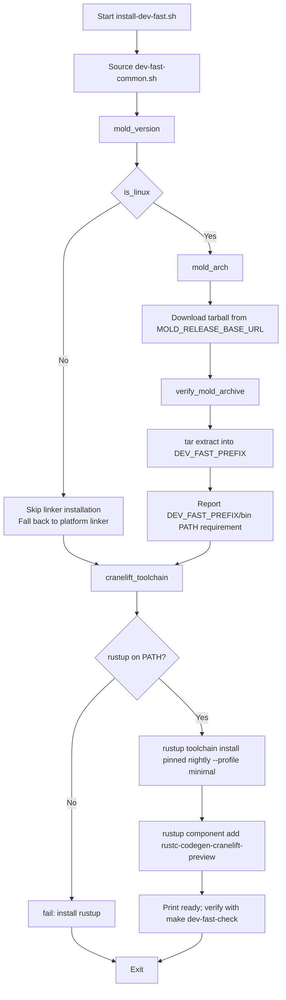
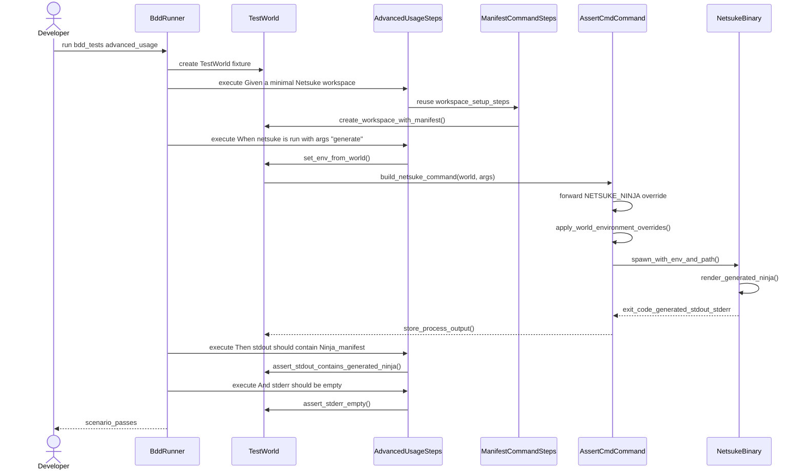

# Developer guide

This guide describes the day-to-day engineering workflow for Netsuke, with a
focus on writing and maintaining tests. It is the source of truth for how the
test suite is expected to be used by contributors.

## Command-line interface architecture

The governing command-line interface (CLI) architecture record is ADR-003,
[`Agent-consistent human-first CLI`][adr-003-cli]. It defines the pre-0.1.0
contract: keep the terminal experience human-first, make names and outputs
consistent enough for agents and automation, remove legacy aliases instead of
preserving inconsistent vocabulary, use `--json` as the only structured result
mode, keep subprocess output out of JSON stdout, and require explicit `--force`
or `--dry-run` controls for consequential operations.

The architectural source of truth for CLI behaviour is
[`docs/netsuke-cli-design-document.md`](netsuke-cli-design-document.md). Use
that document when changing command grammar, output modes, diagnostics,
localization, accessibility behaviour, configuration precedence, or planned
product surfaces such as `context`, `skill-path`, `runs`, `profile`, delivery,
and feedback commands. The overhaul execution plan in
[`docs/execplans/netsuke-cli-overhaul.md`](execplans/netsuke-cli-overhaul.md)
tracks sequencing only; it must not replace ADR-003 or the CLI design document
as the durable architecture record.

[adr-003-cli]: adr-003-agent-consistent-human-first-cli.md

### CLI parsing and command-composition boundary

`src/cli/value_parser.rs` owns `LocalizedValueParser`. This type is a private
Clap adapter: it wraps a localization-aware validation closure and can carry
optional `PossibleValue` help metadata. Its `with_possible_values` constructor
is the adapter API for attaching the values and descriptions shown in command
help; it does not make domain policy types depend on Clap.

Only the CLI command-composition path may construct `LocalizedValueParser`.
Production construction currently belongs to
`src/cli/parser.rs::configure_validation_parsers`, which attaches the
localization-aware validators and their policy metadata to one command tree.
The shared command factory is the composition path for runtime parsing, help,
man pages, and shell completions: it starts with `Cli::command()`, applies
localization when a `Localizer` is available, and then configures validation
parsers. Build scripts call the same factory without a `Localizer`, retaining
the source `en-US` wording while still installing parser metadata. They do not
perform runtime configuration discovery, so generated artefacts remain
deterministic.

`parse_with_localizer_from` must call `configured_command`. That factory
localizes `Cli::command()`, calls `configure_validation_parsers`, and returns
the configured command before `parse_with_localizer_from` calls
`ortho_config::parse_localized_command`. This ordering preserves localized
parse errors and keeps possible-value metadata on every rendered command tree.
The `src/cli/parsing.rs` helpers and the domain policy types remain
Clap-independent. Do not move Clap types or `TypedValueParser` implementations
into domain configuration types. The `src/cli/policy_values.rs` module owns the
Clap-only conversion from the canonical policy definitions to `PossibleValue`
metadata; it must not become a second source of policy names or descriptions.

When a new typed CLI argument needs localized validation, add its parser through
`configure_validation_parsers`. Do not construct a second command tree or
bypass the configured command path. This keeps `--help`, `netsuke help`, man
pages, and completions aligned with the parser used for actual invocations.

## Ninja child-process APIs and help-runner boundary

The public Ninja process helpers are re-exported from `netsuke::runner`.
`CommandEnv` is an explicit, composable set of child-process overrides:
`CommandEnv::inherit()` leaves the parent environment in place, `with_var`
overrides one variable, and `with_path` replaces the child's `PATH`. The parent
process is never mutated. `NinjaBuildRequest` and `NinjaToolRequest` borrow the
program, `NinjaProcessOptions` (`working_dir` and `jobs`), generated build
file, target list or tool name, and `CommandEnv` needed for one invocation. The
process boundary is parser-independent; callers without CLI state construct
`NinjaProcessOptions` directly.

The legacy `run_ninja` and `run_ninja_tool` helpers retain their existing
signatures and inherit the parent environment. Callers that need an isolated
child use `run_ninja_with` or `run_ninja_tool_with` with one of the request
types. Keep environment selection at this process boundary: do not add
process-wide environment mutation to callers or tests.

`netsuke help targets` is deliberately a different runner path. The dispatch
layer routes `HelpTopic::Targets` to `src/runner/help.rs`, which resolves and
runs the manifest loading, expansion, and rendering stages, then always builds
and validates a `BuildGraph` before rendering the deterministic
action-then-target catalogue. An invalid graph aborts before the catalogue is
rendered. It must not generate a Ninja file, call a Ninja subprocess, execute a
recipe, or create build outputs. Its Jinja environment is a restricted,
side-effect-free query surface. It allowlists only the lexical path filters
`basename`, `dirname`, `with_suffix`, and `relative_to`, the collection filters
`uniq`, `flatten`, and `group_by`, and the clock-independent `timedelta`
function. It rejects `env()` and `glob()`, file tests, filesystem metadata
filters such as `size` and `linecount`, `hash`, `digest`, `contents`,
`realpath`, and `expanduser`, executable discovery through `which` and
`command_available`, network and command helpers (`fetch`, `shell`, and
`grep`), and the clock-dependent `now()` function. Normal build manifest
rendering still registers the full standard library; this restriction applies
only to query rendering.

The query allowlist has one owner: `register_manifest_query`. Query loading
does not construct `StdlibConfig`; the registration function composes the
allowlist directly. Reuse its lexical path, collection, and time registration
helpers only when a helper's result depends on template inputs rather than the
host. Do not add a host-observing helper to the shared query registration path;
assess and record any future allowlist change here. The no-topic and
named-command help paths render clap help directly and do not load a manifest.
Keep future help topics within this boundary rather than coupling read-only
inspection to `runner::process`.

Manifest rendering has two caller-selected modes. Full rendering evaluates all
manifest fields, including recipe bodies, for build, generate, and manifest
output. Manifest-query rendering evaluates discovery metadata and the
structural selectors needed to validate the graph, but leaves command and
script recipe bodies untouched. This boundary is what permits a recipe to
contain a build-only helper without causing `help targets` to execute or
otherwise evaluate that helper; it does not alter full-render behaviour.

The standard-library registration boundary owns MiniJinja's value formatter. It
preserves the historical lowercase `true` and `false` spelling when a Boolean
helper result is interpolated into a string field, while delegating all
non-Boolean values to MiniJinja's `escape_formatter`. Keep this as one
registration-wide policy: do not add per-helper or per-call formatter variants.

Helpers excluded from the query allowlist are registered as deliberate
query-disabled stubs by the standard-library adapter. The stubs return a
stable, classified MiniJinja operation error. Manifest expansion recognizes
that classification only while evaluating a query `when` expression: the result
is a conditional entry when the helper prevents evaluation, whereas a
successfully evaluated false expression still excludes the entry. Unrelated
template errors continue to propagate normally.

Expansion records the conditional outcome as internal `Target::conditional`
metadata, which defaults to `false` for ordinary manifest data. Help-query
cataloguing copies that flag to every resolved name, and the text and JSON
renderers expose it as the localized conditional marker and the JSON
`conditional` boolean. The flag is discovery metadata only and must not change
which recipe a normal build executes.

### Help-target query telemetry

`src/runner/help_telemetry.rs` is the observability boundary around the pure
manifest and catalogue query within `netsuke help targets`.
`instrument_help_targets` wraps that query and records the fixed metrics
`netsuke_runner_help_targets_total` and
`netsuke_runner_help_targets_duration_seconds`. It also opens the
`runner.help_targets` span and emits a bounded `Completed help targets query`
event when the query finishes. The command boundary in `src/runner/help.rs`
owns status reporting and rendering after the query succeeds.

Telemetry labels use only the fixed `outcome` values `success` and `error`, and
the fixed `error_category` values `none`, `manifest_not_found`, and `other`.
The wrapper never records manifest-controlled names, descriptions, paths, or
other details. Metric descriptions are registered once per process, through a
`Once`, so repeated queries do not re-register them.

Telemetry tests use `metrics::with_local_recorder` with a
`metrics_util::DebuggingRecorder`, together with the local tracing subscriber
capture helper. They assert the counter, duration sample, and completion event
for a successful fixture query, a missing-manifest failure, and an invalid
manifest failure classified as the non-`RunnerError` `other` category.

## Localization

`src/locale_catalogues.rs` is the authoritative registry of shipped catalogues.
It sits at the crate root, not under `localization/`, because `localization`
builds its default localizer through `cli_localization`, and `cli_localization`
reads the registry; a registry inside `localization` would close that into a
module cycle. `localization::locales` re-exports it, so the older path still
resolves for callers. `define_locales!` declares the tags and embeds
`locales/<tag>/messages.ftl` for each, so a tag without a catalogue on disk
fails to compile. Read the registry rather than writing a separate locale list;
the build audit, the `rerun-if-changed` directives, and the packaging smoke
test all do. `tests/locale_registry_tests.rs` is the deliberate exception: its
`EXPECTED_SHIPPED_TAGS` constant writes out every shipped tag by hand rather
than reading the registry, and asserts the registry matches it. A test that
reads the registry could only confirm the registry agrees with itself, so this
list stands as an independent oracle — adding or dropping a catalogue has to be
a conscious edit to it as well as to the registry.

`Cargo.toml`'s `package.metadata.ortho_config.locales` is the one unavoidable
duplicate, because Cargo metadata cannot call into Rust. The build audit
compares it against the registry and fails on drift.

Adding a locale therefore means: create `locales/<tag>/messages.ftl` with every
declared key translated, add the tag to `define_locales!`, add it to the
`package.metadata.ortho_config.locales` array, and add it to
`EXPECTED_SHIPPED_TAGS` in `tests/locale_registry_tests.rs`. If the language
already ships a catalogue, add a `LANGUAGE_FALLBACKS` rule too, so the new tag
and the existing one resolve as intended rather than one of them capturing the
other.

Each omission is caught, but not all by the same gate. A missing catalogue file
fails compilation, because `define_locales!` embeds it with `include_str!`. A
missing `Cargo.toml` entry fails the build-time audit. A missing
`EXPECTED_SHIPPED_TAGS` entry fails `make test` rather than the build, since
the oracle is a test: that is the cost of its independence, and the reason to
run the suite before assuming a locale is wired up. The `LANGUAGE_FALLBACKS`
rule is the exception with no gate at all — it is a judgement about which
variants are interchangeable, and nothing can infer it.

Table 1: The locale API surface

| Item                                     | Purpose                                                                                       |
| ---------------------------------------- | --------------------------------------------------------------------------------------------- |
| `locales::SUPPORTED_LOCALES`             | Every shipped catalogue, ordered by tag                                                       |
| `locales::catalogue(tag)`                | Exact lookup; `None` when the tag ships no catalogue                                          |
| `locales::resolve_catalogue(identifier)` | Exact match, then the fallback rules, then the sole catalogue for that language, then `en-US` |
| `locales::source_catalogue()`            | The `en-US` catalogue every locale falls back to                                              |
| `cli_localization::build_localizer(tag)` | The runtime entry point: resolves, then layers over `en-US`                                   |

Selection matches the exact BCP 47 tag first. A tag with no catalogue resolves
through the per-language rules in `LANGUAGE_FALLBACKS`, then the sole catalogue
for that language, then `en-US`. The rules keep variants that differ in
substance apart — `es-419` from `es-ES`, `pt-BR` from `pt-PT`, `zh-Hans` from
`zh-Hant` — so a new locale whose language already ships a catalogue needs a
rule rather than the unique-language step. The
[translator guide](translators-guide.md) states the same policy for
translators, and the users' guide lists the tags.

Netsuke resolves the locale twice: `startup_localizer` before the configuration
merge, for help and usage errors, and `configure_runtime` afterwards, for
diagnostics and progress. Only the second sees a configuration file's `locale`,
because `--help` must render before Netsuke knows which configuration file to
read.

### Startup diagnostics buffering

Locale resolution happens before the command line is parsed, so a fallback
warning can be emitted before the effective diagnostic mode — human or JSON —
is known, yet the JSON diagnostic document is also written to stderr: an
eagerly emitted warning could corrupt it. `StartupWriter` in
`src/startup_tracing.rs` closes that window. It implements
`tracing_subscriber`'s `MakeWriter` and is installed by `init_tracing` in
`src/main.rs` before locale resolution runs, so every startup event is held
rather than written. The buffer is bounded at `MAX_BUFFERED_BYTES` (64 KiB): it
keeps the earliest bytes, appends a truncation marker once if the bound is
reached, and drops the remainder, so its size never depends on how much a run
emits.

`settle_startup_diagnostics` in `src/main.rs` decides where the buffer goes
once the effective mode is known: human mode releases it to stderr, JSON mode
discards it so stderr carries only the diagnostic document. In `run_with_args`,
settlement happens after the JSON mode is resolved but before the configuration
merge, so a human-mode warning still precedes any configuration processing. On
the paths where `clap` calls `Error::exit` and never returns —
`parse_cli_or_exit` — settlement happens first, because nothing after that call
would otherwise run.

Unit tests in `src/main_tests.rs` drive `startup_filter` and the real
`startup_localizer` to check the buffered warning and the level it is gated by.
`tests/startup_diagnostics_tests.rs` runs the built binary end to end,
including the configuration-driven JSON path, because the behaviour under test
spans the whole startup sequence and covers paths that terminate inside `clap`
before returning to `run_with_args`.

**Cross-references:** `docs/netsuke-design.md` §8.4, for the rationale behind
buffering rather than gating output on the resolved mode.

### Adding or changing messages

Every user-facing string is a Fluent message keyed from
`src/localization/keys.rs`. Adding one means adding the constant, adding the
message to all 35 catalogues, and keeping its `{ $variables }` identical across
them: the build audit rejects a missing key, an orphaned key, or a variable set
that differs from `en-US`. The audit lives in `build_l10n_audit/`, split into
`keys.rs` and `scanner.rs` (the `define_keys!` scanner, with `byte_index.rs`
for its byte-position bookkeeping), `ftl.rs` (catalogues), `metadata.rs` (the
Cargo metadata), and `compare.rs` (the rules). Because build scripts are not
test targets, those modules are included by path from four test files:
`tests/build_l10n_keys_tests.rs` exercises the `define_keys!` scanner
(`keys.rs`, `scanner.rs`, `byte_index.rs`); `tests/build_l10n_parser_tests.rs`
exercises the catalogue and metadata parsers (`ftl.rs`, `metadata.rs`);
`tests/build_l10n_audit_rules_tests.rs` exercises the comparison rules
(`compare.rs`, alongside `ftl.rs`); and `tests/build_l10n_audit_tests.rs` runs
the orchestration end to end, both over the checked-in tree and over
deliberately corrupted copies of it.

## Graph view projection and renderer adapters

The `graph` subcommand renders the build dependency graph in-process. Its
domain projection lives in [`src/graph_view`](../src/graph_view) and follows
the hexagonal port/adapter pattern:

- [`GraphView`](../src/graph_view/mod.rs) is the deterministic projection of
  [`BuildGraph`](../src/ir/graph.rs). It is constructed once, sorts every
  collection (nodes, edges, default targets), and is invariant under `HashMap`
  insertion order. The shuffled-insertion proptest in
  [`src/graph_view/tests.rs`](../src/graph_view/tests.rs) covers this invariant.
- `NodePathRegistry` owns graph-path deduplication. Its borrowed `entry_ref`
  lookup avoids cloning existing paths; conversion to `BTreeMap` at the
  projection boundary restores deterministic ordering. This registry is
  internal to graph projection and must not become a general application map.
- [`GraphRenderer`](../src/graph_view/render.rs) is the trait every renderer
  adapter implements. The contract is intentionally minimal:
  `render(&self, view: &GraphView, sink: &mut dyn io::Write) -> Result<(), GraphRenderError>`.
  Adapters consume `GraphView` only — they never touch `BuildGraph` directly.
- [`DotRenderer`](../src/graph_view/render_dot.rs) emits Graphviz DOT.
- [`HtmlRenderer`](../src/graph_view/render_html.rs) emits a self-contained
  HTML page (server-rendered SVG, accessible textual outline, and a
  `<noscript>` fallback containing the DOT source verbatim).

`EdgeView::class` mirrors the four Ninja dependency relations so that renderers
can style each one distinctly:

| Variant          | Ninja separator           | DOT style       | SVG class              |
| ---------------- | ------------------------- | --------------- | ---------------------- |
| `Explicit`       | none (input in `$in`)     | solid (no attr) | `edge`                 |
| `ImplicitDep`    | single pipe (`\|`)        | `style=bold`    | `edge implicit-dep`    |
| `ImplicitOutput` | single pipe on LHS (`\|`) | `style=dotted`  | `edge implicit-output` |
| `OrderOnly`      | double pipe (`\|\|`)      | `style=dashed`  | `edge order-only`      |

`ImplicitDep` carries Ninja's single-pipe implicit inputs — header files or
schemas that trigger a rebuild without appearing in `$in`. The bold stroke
reads as "rebuild-triggering hidden input," distinguishing it from the dashed
order-only stroke (no rebuild trigger) and the dotted implicit-output stroke
(auxiliary output side).

A new renderer — for example the `--json` view planned for roadmap item
`3.15.6` — should be added as a sibling module under `src/graph_view/` that
implements `GraphRenderer`. The runner dispatch in
[`src/runner/mod.rs`](../src/runner/mod.rs) picks the appropriate renderer
based on `GraphArgs` and writes through the shared `write_text_file`/
`write_text_stdout` sink helpers. The `-` sentinel for `--output` is recognized
by `process::is_stdout_path`.

`--html` and `--output` are explicitly excluded from `OrthoConfig` layering:
they are per-invocation arguments tagged `#[serde(skip)]` on
[`GraphArgs`](../src/cli/mod.rs). Layering `--output` through a config file
would silently change the artefact destination — a footgun the design avoids by
construction.

## Command and recipe lowering

Command recipes use the `StringOrList` AST type. A scalar command remains one
shell-text value; a YAML sequence is an ordered list of entries. The same
recipe path handles commands declared on reusable rules, direct targets, and
actions. Manifest deserialization rejects an explicitly empty command list. The
internal `StringOrList::Empty` marker is valid for an action or target when its
rendered `deps` list is non-empty, forming a dependency-only aggregate. Code
that constructs the IR directly must reject an empty
`StringOrList::List(Vec::new())` during Ninja generation rather than emitting
an unusable rule.

### Dependency-only actions and targets

The manifest's internal dependency-only marker represents an action or target
whose non-empty `deps` list is its complete operation. Manifest loading renders
`deps` before validating recipes, then rejects dependency-only rules and
actions or targets whose rendered dependencies are absent. Entries with
executable work continue to require exactly one of `command`, `script`, or
`rule`.

Manifest-to-IR lowering keeps the dependency list as `BuildEdge::implicit_deps`
and registers the dependency-only action without a command. The shared action
rule emission in `src/ninja_gen/mod.rs` omits that action from the generated
Ninja `rule` blocks; its edge selects Ninja's built-in `phony` rule instead.
The direct generator and the serial-dependency bundle use this same path, so a
dependency-only aggregate does not need a synthetic `command: ":"` recipe.

The lowering stages have deliberately separate responsibilities:

- `src/manifest/render.rs` renders a scalar or each list entry independently.
  Every entry sees the same cloned recipe context, including target variables
  and delayed `ins`/`outs` markers. A rendering error for a list includes its
  one-based entry position.
- `src/ir/from_manifest_support.rs` prepares one shell-quoted input/output
  binding set for the recipe, then interpolates every scalar or list entry with
  that set. `{{ ins }}` and `{{ outs }}` markers and standalone `$in` and
  `$out` tokens are resolved per entry. A placeholder within backticks is
  rejected because Netsuke cannot lower it safely; scripts use substitution
  without command-shaped parsing, so heredocs and comments remain valid. The
  resulting action contains ordinary command text and no Ninja placeholders.
- `src/ninja_gen/mod.rs` delegates completed recipe text to
  `src/ninja_gen_recipe_shell.rs`. On Unix, and for the explicit Windows Bash
  compatibility route, a scalar remains POSIX shell text. A list puts each
  entry in a brace group and joins the groups with `&&`; `eval` receives a
  shell-quoted payload, which keeps inline comments and trailing control
  operators inside the entry boundary. Braces preserve current-shell state and
  the chain remains fail-fast. The existing background-job and `exec`
  validation rules apply to this POSIX route.
- On Windows, `RecipeShell::PowerShell` renders scalar commands and scripts as
  encoded `powershell.exe` invocations while they fit the Windows command-line
  limit. Recipes up to 1 MiB use Ninja's per-edge `rspfile` and
  `rspfile_content` bindings; larger recipes are rejected before Netsuke
  allocates UTF-16LE and Base64 payloads. Ninja derives a unique `$out`-based
  `.ps1` response-file name, creates it in the edge's working directory with an
  ASCII PowerShell bootstrap containing the Base64 UTF-16LE payload, and
  invokes it with `powershell.exe -File "$rspfile"`. The bootstrap removes its
  own `$PSCommandPath` in a `finally` block after the recipe succeeds or fails;
  query-only generation emits the bindings without creating files. An ordered
  list becomes one PowerShell script that checks `$LASTEXITCODE` immediately
  after each generated list entry, preserving PowerShell state while stopping
  before a later entry can overwrite a non-zero status. Multiple native
  commands inside one entry are not individually instrumented. Terminating
  PowerShell errors also stop the list. The POSIX command-list analyser is
  deliberately not applied to this route. The runner resolves
  `NETSUKE_WINDOWS_SHELL` and preflights `bash.exe` only when the optional
  compatibility route is selected; `help targets` stays outside this execution
  boundary.
- The brace-group, `eval`, background-job, and `exec` validation rules described
  above apply only to Unix and the explicit Windows Bash compatibility route.
  PowerShell uses its per-entry `$LASTEXITCODE` and terminating-error checks
  instead. In shell-dollar documentation, `$$` therefore means a process
  identifier only for POSIX/Bash; PowerShell's `$$` automatic variable contains
  the last token received by the session.
- `src/runner/process` forwards the command's output and recognizes the
  bounded `netsuke command-list failure: action HASH, entry M` marker. A failed
  list therefore retains the original exit status while adding the fixed-width
  hashed action fingerprint and one-based entry index to the Ninja failure
  error.

Failure attribution is private to Ninja process execution:
`FailureAttributionWriter` parses only Ninja's stderr. Because Ninja relays a
failed subcommand's stderr on its own stdout, build runs retain only a fixed
512-byte stdout tail and use its parsed marker only after a non-zero exit.
Ordinary child stdout streams forward directly and must not use this tail.

The lowest-layer POSIX shell-word quoting used for input/output paths during IR
lowering is `shell_quote::QuoteRefExt::quoted(Sh)`. It performs minimal,
fragmented shell quoting, which is appropriate for a literal shell word but not
for the command-list `eval` payload. That renderer requires a canonical
single-quoted payload so existing generated Ninja list text remains
byte-for-byte stable, and the delimiter/boundary tests continue to hold. Keep
that quoting in the deliberately local `shell_single_quote` function; it is not
a general-purpose helper. Neither quoting path is the platform-specific
`src/stdlib/command/quote.rs` implementation behind the `command.quote`
template wrapper, which must retain its `cmd.exe` quoting behaviour on Windows.

Attributed list failures emit the bounded tracing fields `command_list_action`
(a fixed-width action fingerprint) and `command_list_entry` (the one-based
entry index), plus the matching `command_list_failure` marker. The process
boundary records `netsuke_ninja_command_list_failures_total` and
`netsuke_ninja_command_list_failure_duration_seconds`, with an `outcome` label
of `failure`. Elapsed failure duration is measured through the injected
`monotony::MonotonicClock`; production uses `StdMonotonicClock`, while tests
use deterministic test clocks. These diagnostics and metrics contain no command
text.

Changes to this pipeline must preserve the scalar/list distinction, per-entry
rendering, current-shell state sharing, and failure attribution. The focused
rendering, lowering, Ninja-generation, and real-Ninja integration tests are the
behavioural contract for these boundaries.

### Ninja text-escaping seam

The seam is owned by `src/ninja_gen_escape.rs`. The Ninja action writer may
compose a completed command and hand it to the selected renderer. POSIX and
Bash routes convert `ShellText` through `escape_ninja_value`; the encoded
PowerShell transport returns a private `NinjaValue` without exposing its
payload to Ninja parsing. No IR or manifest lowering may call either route.
Descriptions, `depfile`, `deps`, and `pool` retain their existing raw emission
semantics because they are not shell text, although metadata is still checked
for control characters. Add a separate, explicitly documented conversion for
any new Ninja grammar position rather than reusing command escaping.

## Package and target naming

The crates.io package is `netsuke-build`; the library target, the binary
target, and the command are all `netsuke`. The names diverge because `netsuke`
is taken on crates.io. [ADR-007](adr-007-publish-as-netsuke-build.md) records
the decision and [repository layout](repository-layout.md) states the rule.

The practical consequence is that **no user-facing name may be derived from
Cargo package metadata**. Derive from the command-line interface (CLI) name, or
from the `bin-name` field that
`leynos/shared-actions/.github/actions/export-cargo-metadata` reads out of
`[[bin]]`:

- `build.rs` names the manual page `<CLI name>.1` and stamps its `.TH` source
  as `<CLI name> <version>`, taking the name from `Cli::command()`. It reads
  neither `CARGO_PKG_NAME` nor `CARGO_BIN_NAME`. The build script publishes the
  path it wrote through `cargo:rustc-env=NETSUKE_GENERATED_MAN_PAGE`, and
  `tests/man_page_contract_tests.rs` asserts the file is `netsuke.1`, is staged
  under `target/generated-man/<target>/<profile>/`, and carries a title that
  never mentions `netsuke-build`.
- Release packaging takes `bin-name` from the `metadata` job in
  `.github/workflows/release.yml`, so `.github/release-staging.toml`, the
  Debian and RPM payloads, the Windows Installer product, and the macOS
  installer package all stay named `netsuke`.
- `[package.metadata.binstall]` in `Cargo.toml` overrides `cargo binstall`'s
  default asset resolution, whose patterns place the target before the version
  and so match no released asset, leaving a fallback to a source build on the
  pinned nightly. A single template resolves a
  `{ name }-{ version }-{ target }.tar.gz` archive (`pkg-fmt = "tgz"`) for
  every released target, named after the Cargo package rather than the binary.
  `stage-release-artefacts` stages each target's archive, plus a `.sha256`
  sidecar, per `[common.binstall]` in `.github/release-staging.toml`, and the
  "Hoist cargo-binstall archives" step in `.github/workflows/release.yml` runs
  `scripts/hoist_binstall_archives.py` under a pinned Python 3.14 installed by
  `setup-uv`. The script validates that every target's archive and checksum are
  present, are regular files rather than symlinks, and have a free destination
  before moving them to the release root for upload; the read-only discovery
  and validation half lives in `scripts/hoist_binstall_discovery.py`. The move
  is transactional: a forward failure rolls completed pairs back to their
  nested paths and re-raises the original failure after a successful rollback.
  If an `OSError` prevents rollback, the original and rollback failures are
  combined in a `BaseExceptionGroup`; another rollback exception propagates
  unchanged. `tests/binstall_metadata_tests.rs` and
  `tests/workflow_contracts/hoist_binstall_archives_test.py` hold this contract.

Only the two registry installation commands name `netsuke-build`, and
`tests/documentation_installation_tests.rs` pins both. When adding a release
target, a packaging format, or an artefact name, add the target to
`.github/release-staging.toml`'s `[targets.*]` table and to the release
workflow's target matrices; the single `pkg-url` template in `Cargo.toml`
(`{ name }-{ version }-{ target }.tar.gz`) resolves new targets automatically,
with no per-target edit. `tests/binstall_metadata_tests.rs` and
`tests/workflow_contracts/hoist_binstall_archives_test.py` hold that contract,
and fail if per-target overrides reappear or the staged and expected archive
names diverge.

## Release-admission tooling

The [install-release-candidate action][release-candidate-action] is the shared
bootstrap for downstream release-admission canaries. Callers must provide
`revision`, the full Git revision of the proposed candidate, and
`expected-version`, the version that `netsuke --version` must report. The
action fetches and checks out that exact revision, verifies the resolved
commit, and runs `cargo build --locked --release --bin netsuke` before exposing
the candidate binary.

The action outputs the absolute `binary` path, the resolved `revision`, and the
resolved `version`. It selects `netsuke.exe` on Windows and `netsuke` on other
platforms, so callers can invoke the same outputs in platform-specific jobs.
Each downstream canary must pin its migration revision, run the selected
Netsukefile targets with this action, and publish a bounded provenance record;
the release workflow admits a candidate only when the required downstream
revisions have successful, identity-bound canary runs. It reads each pinned
workflow source and requires the installer reference and `revision` input to
match the published `GITHUB_SHA`, then checks the configured workflow ID and
path, `push` event, branch, migration head SHA, candidate name, completed
status, and successful conclusion. A changed candidate SHA therefore requires
fresh downstream evidence.

`run-release-admission` is a reusable-workflow boolean input with a default of
`true`. A tag-triggered release always runs admission because it is not a
reusable-workflow call. A trusted reusable caller may set
`run-release-admission: false` for a dry run that must not execute admission.
When publication is enabled, the `release` job still depends on a successful
`release-admission-canaries` job.

## Toolchain and borrow checker

Netsuke builds on the dated nightly toolchain pinned in `rust-toolchain.toml`
with the Polonius alpha borrow-checking analysis enabled. Nightly toolchains
dated 2026-08-04 and later run Polonius by default, so the pin carries the
requirement on its own: **no `-Zpolonius` directive is passed anywhere, and
none should be added.** The directive is being retired upstream, and a build
that restates it is a build that can silently drop it. A contract test
(described below) fails if one reappears.

`rustup` provisions the toolchain automatically inside a checkout, which covers
every checkout consumer — plain Cargo invocations, rust-analyzer, Clippy, and
Whitaker — without any Cargo configuration. `cargo kani setup` is a separate
boundary: Kani 0.67.0 installs and uses its bundled `nightly-2025-11-21`
toolchain rather than the checkout toolchain. The repository has no
`.cargo/config.toml`; carrying the flag was that file's only purpose, and it
was deleted when the pin moved past 2026-08-04.

Makefile recipes still set `RUSTFLAGS`, but only to deny warnings. Each builds
the value as `RUSTFLAGS="$${RUSTFLAGS:+$$RUSTFLAGS }-D warnings"`; the
`$${RUSTFLAGS:+$$RUSTFLAGS }` expansion prepends any `RUSTFLAGS` already set by
the caller (for example a CI wrapper), so those flags survive rather than being
silently discarded. `make kani-full` and the binary-build recipe set no
`RUSTFLAGS` at all: Kani compiles third-party crates the workspace lint policy
does not govern, and a plain binary build is not a lint gate.

[ADR-006](adr-006-adopt-polonius-nightly-toolchain.md) records the policy
decision, and the [polonius migration notes](polonius.md) track every site
whose design depends on the analysis. Sites tagged `POLONIUS(...)` fail to
compile under plain non-lexical lifetimes (NLL); do not rewrite them into
double lookups, unconditional key clones, or id indirection, and do not pad new
code with defensive clones that only NLL required. When a borrow-centric form
fails to compile, consult the migration notes before restructuring.

### Polonius CI shared-action contract

Continuous integration gets Polonius the same way a checkout does: from the
pinned toolchain. What the shared-action contract still governs is the
*toolchain selection* and the warning policy that travels beside it.

The shared Rust setup actions export their own `RUSTFLAGS`, so anything a job
needs travels as an *action input*, not as a job environment variable: each
affected workflow passes it through the relevant shared action's
`with.rustflags` input, and none of them may set a job-level `env.RUSTFLAGS`. A
job-level override would win over the action's exported value and silently drop
whatever the action set.

Five CI jobs across four workflows carry the contract.

Table: CI jobs and their shared Rust setup.

| Workflow                                                              | Job                  | Shared action        | `with.rustflags`            |
| --------------------------------------------------------------------- | -------------------- | -------------------- | --------------------------- |
| [`ci.yml`](../.github/workflows/ci.yml)                               | `build-test`         | `setup-rust`         | `-D warnings`               |
| [`ci.yml`](../.github/workflows/ci.yml)                               | `build-test-windows` | `setup-rust`         | `-D warnings`               |
| [`coverage-main.yml`](../.github/workflows/coverage-main.yml)         | `coverage-upload`    | `setup-rust`         | `-D warnings`               |
| [`netsukefile-test.yml`](../.github/workflows/netsukefile-test.yml)   | `netsukefile`        | `setup-rust`         | *(omitted; action default)* |
| [`build-and-package.yml`](../.github/workflows/build-and-package.yml) | `build`              | `rust-build-release` | *(omitted; action default)* |

The CI jobs and coverage pass `-D warnings` explicitly because those jobs gate
on a warning-free build — on Windows that is what surfaces findings in the
`#[cfg(windows)]` tree at all. The pinned shared actions also apply
`-D warnings` by default when `with.rustflags` is omitted, so an upstream
compiler warning can fail both the Netsukefile and packaging jobs. Their
omitted inputs are intentional and remain distinct from jobs that explicitly
pass `with.rustflags: -D warnings`; neither job supplies an explicit empty
value. The coverage action's `cargo-llvm-cov` invocation inherits the flags
`setup-rust` exports and appends its own instrumentation flags.

No `setup-rust` call passes a `components` input. The shared action is not
declared to accept one and installs rustfmt and clippy itself, so passing it
only emitted an "Unexpected input(s)" warning on every run;
`tests/workflow_contracts/ci_lint_test.py` holds that.

`NETSUKE_RUST_TOOLCHAIN` follows a separate rule. The CI jobs and Netsukefile
pin it to the channel in `rust-toolchain.toml` so those jobs provision the
dated nightly explicitly; coverage and packaging must leave it unset, because
they select their toolchain through the action's own `toolchain` input and a
second, independently edited pin would let the two disagree.

[`tests/polonius_toolchain_contract.rs`](../tests/polonius_toolchain_contract.rs)
enforces all five callers. For each one it asserts:

- the job uses the expected shared-action reference — path *and* pinned
  revision, the latter derived from the checked workflows themselves rather
  than restated in the test (see "Workflow pins and Dependabot" below for why
  the revision is asserted here);
- the `with.rustflags` value matches the table above exactly, including the
  two jobs that must pass no `rustflags` input at all;
- the job declares no `env.RUSTFLAGS`;
- the `NETSUKE_RUST_TOOLCHAIN` policy above — pinned to the
  `rust-toolchain.toml` channel for the CI jobs and Netsukefile, absent for
  coverage and packaging.

The same test carries the two toolchain-level assertions: that the pinned
channel is a dated nightly at or after 2026-08-04, the first nightly on which
Polonius is the default analysis, and that no build configuration — the
Makefile, a Cargo configuration fragment, a workflow, or a recreated
`.cargo/config.toml` — passes a `-Zpolonius` directive.

Run it with:

```bash
cargo nextest run --test polonius_toolchain_contract
```

Keep this section and the [Polonius migration notes](polonius.md) in step: both
describe the same no-directive, pinned-toolchain contract, and the notes record
the remaining harness consequences of that policy.

### Windows native recipe smoke workflow

The pull-request `windows-native-recipe-smoke` job in
[`ci.yml`](../.github/workflows/ci.yml) is the native Windows execution gate.
It waits for the successful `build-test-windows` job, then runs on
`windows-latest` with `pwsh` as the shell for every `run` step. It checks out
the pull request source, installs the pinned nightly from `rust-toolchain.toml`
through the shared Rust setup action, installs Ninja, and builds the `netsuke`
binary from that checkout. The job then invokes:

```powershell
./scripts/windows-recipe-smoke.ps1 `
  -Netsuke ./target/debug/netsuke.exe `
  -Manifest ./tests/data/windows-recipe-smoke.yml
```

The fixture exercises the Windows PowerShell legacy-recipe contract, including
target discovery, scalar and script recipes, ordered-list state and failure,
path quoting, and the large-recipe response-file transport. The job
deliberately does not set `SHELL=bash` or use Git Bash for its invocation, so
the launch boundary remains an ordinary PowerShell session.
`build-test-windows` continues to use Git Bash only for the repository's POSIX
Makefile quality gates.

The release workflow has a second `windows-native-recipe-smoke` job for the
tagged source. It uses the same `pwsh` defaults, pinned Rust toolchain, Ninja
installation, binary build, smoke script, and
`tests/data/windows-recipe-smoke.yml` fixture. The smoke job builds the tagged
source itself; the release publication job separately requires both this smoke
job and the platform package jobs in its `needs` list. Consequently, release
publication cannot proceed unless the native Windows smoke test passes.

## Quality gates

Run these commands before finalizing any change:

- `make check-fmt`
- `make lint`
- `make typecheck`
- `make doc-coverage`
- `make test`

When the change touches any Markdown file — documentation, ADRs, execplans, or
the README — also run:

- `make fmt`
- `make markdownlint`
- `make nixie`

`make doc-coverage` verifies the aggregate Rustdoc doc-comment coverage of
every workspace library and binary target, counting private items, and fails
when the documented share drops below `DOC_COVERAGE_THRESHOLD` (default 80%).
The toolchain the metric measures with is `DOC_COVERAGE_TOOLCHAIN`, defaulting
to the channel pinned in `rust-toolchain.toml`. See *Doc-comment coverage* in
`AGENTS.md` for the counting rules and the exemptions (Rustdoc excludes
trait-implementation overrides, and `cfg(test)` items are not compiled into the
doc build). Rustdoc writes the coverage JSON to its reported generated file,
which the script reads immediately after each successful invocation. That
path-extraction helper belongs only to the
`--show-coverage --output-format json` collector; do not reuse it for general
Rustdoc output. `scripts/doc_coverage_model.py` defines the shared `Coverage`/
`DocTarget` values. `scripts/doc_coverage_runner.py` owns toolchain pin
parsing, Cargo metadata validation, target selection, and measurement
orchestration; its `ToolchainPinError` and `WorkspaceMetadataError` preserve
those input-validation boundaries. `scripts/doc_coverage_cargo.py` owns Cargo
and Rustdoc process handling, generated-path extraction, and coverage-payload
validation; its shape and count errors are translated to `CoverageOutputError`
at that boundary. The executable retains argument parsing, reporting, and
user-facing error translation.

The workflow contract suites share the YAML 1.2-aware loader and common
workflow, job, and step helpers in
`tests/workflow_contracts/workflow_loading.py`. Each suite keeps its own
workflow-specific projections and assertions, so parsing and structural
validation remain consistent across the workflows under test.

`make test` runs the non-doctest suite through
[cargo-nextest](https://nexte.st/) and the doctests separately. CI pins the
runner version in `NEXTEST_VERSION` in `.github/workflows/ci.yml`. Install that
same version locally, so local runs match CI; read the pin from the workflow
rather than copying the number, so the two cannot drift:

```bash
NEXTEST_VERSION="$(sed -n "s/.*NEXTEST_VERSION: '\(.*\)'.*/\1/p" \
  .github/workflows/ci.yml)"
cargo install cargo-nextest --locked --version "$NEXTEST_VERSION"
# or, for a prebuilt binary:
cargo binstall --no-confirm --locked \
  "cargo-nextest@$NEXTEST_VERSION"
```

`make check-fmt` verifies Markdown formatting as well as Rust formatting, and
needs `mdtablefix` on `PATH`. CI pins the version in `MDTABLEFIX_VERSION` in
`.github/workflows/ci.yml`. Install that same version locally, so local runs
match CI; read the pin from the workflow rather than copying the number, so the
two cannot drift:

```bash
MDTABLEFIX_VERSION="$(sed -n "s/.*MDTABLEFIX_VERSION: '\(.*\)'.*/\1/p" \
  .github/workflows/ci.yml)"
cargo install --locked mdtablefix --version "$MDTABLEFIX_VERSION"
# or, for a prebuilt binary:
cargo binstall --no-confirm --locked \
  "mdtablefix@$MDTABLEFIX_VERSION"
```

Version drift matters here beyond reproducibility: a different `mdtablefix`
version may reflow prose differently, which would make `make check-fmt` fail on
an otherwise clean tree.

Install the separately versioned Whitaker installer with:

CI installs Whitaker through the SHA-pinned
`leynos/shared-actions/.github/actions/install-whitaker` action. Both build
jobs pass its required `installer-version: '0.2.7'` input; there is no
`WHITAKER_INSTALLER_VERSION` workflow variable. Read that action input before
installing locally so the local installer matches CI:

```bash
INSTALLER_VERSION='0.2.7' # Read from the Install Whitaker action input in CI.
cargo install --locked whitaker-installer \
  --version "$INSTALLER_VERSION"
# or, for a prebuilt binary:
cargo binstall --no-confirm --locked \
  "whitaker-installer@$INSTALLER_VERSION"
```

`whitaker-installer` and the lint libraries are separate artefacts with
separate versions. The shared action's `installer-version` input pins the
installer — the tool that stages libraries — and nothing else. The installer
keeps its own checkout of the Whitaker repository under
`~/.local/share/whitaker`, updates it with `git pull`, and stages the libraries
from its default branch. Lint behaviour therefore tracks Whitaker HEAD.

The Linux build job installs Nixie through the similarly SHA-pinned
`leynos/shared-actions/.github/actions/install-nixie` action. Its required
`python-version: '3.14'` input satisfies Nixie CLI's Python 3.14-or-newer
requirement. `Install Nixie` follows `Setup uv` and precedes
`Validate Mermaid diagrams`, which runs `make nixie`; preserve that order when
maintaining the workflow so Mermaid validation always has the installed CLI
available.

**Running the lint libraries at HEAD is deliberate.** Netsuke follows the suite
as it develops, so new lints and fixes arrive without a version bump here. Do
not add a `[workspace.metadata.dylint]` block pinning `whitaker_suite` to a
`tag` or `rev`. The [Whitaker user's guide](whitaker-users-guide.md) documents
that form, and it is the right answer for a project wanting reproducible lint
results, but adopting it here would reverse a standing decision rather than fix
a defect.

The cost is worth stating plainly: a change upstream can alter lint results
between two runs with no change in this repository, and a local checkout that
has not been restaged will disagree with CI, which stages fresh on every job.
Restaging is what reconciles them.

What the module-scoped exemptions in `dylint.toml` actually depend on is
[Whitaker PR #315][whitaker-pr-315], which added the `excluded_paths` option,
so the staged libraries must be recent enough to include it. Libraries staged
from an older checkout ignore `excluded_paths` silently — the exemptions stop
applying with no error, and the lint reports the modules they covered. Re-run
`whitaker-installer` to restage from HEAD. If that checkout has been left on a
detached HEAD, the installation fails during its `git pull`; put it back on the
default branch and re-run.

[whitaker-pr-315]: https://github.com/leynos/whitaker/pull/315

Whitaker is configured by `dylint.toml` at the repository root, where each
sanctioned ambient-filesystem scope for `no_std_fs_operations` carries a
documented rationale. `docs/whitaker-users-guide.md` is a near-verbatim import
of the [upstream Whitaker user's guide][whitaker-upstream-guide]; refresh it
from that URL rather than editing it in place, preserving the "Netsuke
deviation from upstream" callout, and record Netsuke-specific policy here and in
`dylint.toml`.

[whitaker-upstream-guide]: https://raw.githubusercontent.com/leynos/whitaker/refs/heads/main/docs/users-guide.md

Prefer `excluded_paths` over `excluded_crates`: a path entry exempts one module
and its descendants, whereas a crate entry exempts a whole compilation unit.
The application crate's module-scoped exemptions include
`netsuke::stdlib::which::lookup` (executable discovery through `PATH` and
cross-directory symlink canonicalization, which `cap_std` cannot express) and
`netsuke::runner::process::file_io::ambient_sync` (temporary-file
synchronization, scoped to the submodule holding only that `sync_all` so the
rest of `file_io` keeps writing through `cap_std` handles). Configuration
discovery otherwise uses capability-scoped canonicalization. Its small,
dedicated path-normalization module, `netsuke::cli::discovery::paths`, remains
narrowly excluded because `std::fs::canonicalize` preserves the absolute
comparison keys and cross-directory symlink behaviour that `cap_std` rejects.
For ordinary man-page and completion generation, the build script compiles its
inline `cli` facade: the four-file slice containing `src/cli/command.rs`,
`src/cli/config.rs`, `src/cli/help.rs`, and `src/cli/validation.rs`. The
`command.rs` module owns the Clap command schema and default-command behaviour,
including `Cli::with_default_command()`, while runtime discovery remains
deliberately outside the slice. The broader `netsuke::cli::discovery` module
remains under the capability policy; no `build_script_build` exception is
required. The behavioural step definitions, CLI integration tests, and shared
workflow-reading helper that stage fixtures ambiently are scoped the same way.
A crate-level entry is justified only when the ambient access lives in the
crate root itself, where a path entry would be no narrower — that covers the
enumerated integration-test crates. The `test_support` crate uses
capability-backed fixture helpers and remains linted by Whitaker under its own
narrow policy.

The root Whitaker invocation selects only the `netsuke-build` package (the
Cargo package name behind the `netsuke` targets; see ADR-007) and disables
Dylint dependency checks. It supplies the root `dylint.toml` contents
explicitly through `DYLINT_TOML`, so every invocation receives the same
capability-boundary policy regardless of how Dylint resolves the current crate.
`test_support` is a workspace member with one sanctioned ambient boundary
configured per crate. Its second, scoped invocation supplies
`test_support/dylint.toml` through `DYLINT_TOML`, and uses
`--package test_support` and `--no-deps` because running from a member
directory alone would otherwise check the parent workspace. That configuration
names only `test_support::fs` in `excluded_paths`. The root `excluded_crates`
must not contain `test_support`: every other module in the crate remains
subject to the filesystem policy.

Permanent exceptions belong in `dylint.toml`, scoped as narrowly as the lint
allows. Do not use Rust `#[allow]` or `#[expect]` for `no_std_fs_operations`:
this Dylint lint is not known to `rustc`, so its exclusions must be configured
there. Prefer migrating to `cap_std` over any of these; reach for an exclusion
only when the operation is irreducibly ambient.

To confirm the exclusions have not silently widened, add a temporary
`std::fs::metadata` call to an unexcluded module — for example
`src/stdlib/which/cache.rs`, a sibling of the excluded `lookup` module, or the
body of `src/runner/process/file_io.rs` outside `ambient_sync` — then run
`make lint-whitaker`. Both sites must still be reported; revert the probe
afterwards. The same check applies to `test_support`: a `std::fs` call in, say,
`test_support/src/exec.rs` must be reported even though `test_support::fs` is
exempt.

When command output is long, preserve exit codes and logs:

```bash
set -o pipefail
make test 2>&1 | tee /tmp/netsuke-make-test.log
```

These gates always use the repository toolchain and the default codegen
backend. For a faster inner loop between gate runs, see
[local build acceleration](#local-build-acceleration).

For documentation changes, also run `make fmt`, `make markdownlint`, and
`make nixie`.

## Workflow pins and Dependabot

Dependabot owns the upgrade of GitHub Actions and reusable workflows, including
calls into `leynos/shared-actions`. Contract tests that assert a caller's exact
commit SHA create a lockstep dependency: every time Dependabot opens a bump PR,
the test fails until a human edits the pinned constant to match. That defeats
the purpose of automated dependency updates and turns a routine bump into a
manual chore.

The default, therefore, is shape-only: contract tests verify the *shape* of a
shared-action caller and not the specific SHA value. This covers both forms of
call into `shared-actions` — a step that `uses:` a composite action with a
`with:` block, and a job that `uses:` a reusable workflow. The one sanctioned
departure is a caller whose behaviour depends on a feature the shared action
gained at a known revision; the Polonius exception below is the only current
instance. The bullets that follow state the default; they do not apply to a
caller covered by that exception.

- Do assert the caller references the correct shared-action or
  reusable-workflow path.
- Do assert the ref is pinned to a full 40-character commit SHA, not a
  mutable branch such as `main` or `rolling`.
- Do assert the expected `on:` triggers, least-privilege `permissions:`, and
  the inputs the caller relies on.
- Do not hard-code the current SHA value as an expected string. Match it with
  a pattern instead.
- Do not fail a test purely because Dependabot bumped the pinned SHA.

```python
import re

SHA_RE = re.compile(r"^[0-9a-f]{40}$")

def test_uses_pinned_full_sha(caller_step):
    ref = caller_step["uses"].split("@")[-1]
    assert SHA_RE.match(ref), f"expected a 40-hex commit SHA, got {ref!r}"
```

The policy above governs callers whose behaviour does not depend on a specific
shared-action revision: the caller would keep working across any upstream bump,
so pinning the SHA in a test buys nothing and costs a manual edit per bump.
`tests/workflow_contracts/mutation_testing_test.py` is the canonical example.

### Exception: the Polonius shared-action contract

The four workflows described under
[Polonius CI shared-action contract](#polonius-ci-shared-action-contract) do
depend on a specific revision. The `rustflags` input they rely on was
introduced at a known commit in `leynos/shared-actions`. A revision that
predates it does not fail the run — an unrecognized `with:` key on a composite
action is a warning, not an error — it simply never exports the flag, so the
build fails later as a borrow-check error rather than as a configuration error.

`tests/polonius_toolchain_contract.rs` therefore requires the four workflows'
shared-action references to agree, rather than restating the expected pin as a
constant. It extracts every `leynos/shared-actions` reference from the checked
workflows with the shared YAML-parsing helper in
`tests/support/shared_actions.rs`, validates that each is a full 40-character
lowercase-hex commit SHA, and derives the pin the workflows must share from
that set. A complete bump — Dependabot's or a manual one — moves every
reference together and passes with no test edit. A partial bump, where some
workflows move and others are left behind, fails on the disagreement between
references: the same failure that previously broke `main` when a bump missed
the hand-maintained constants this contract used to hold. The revision-level
dependency on the `rustflags` input is now protected by that agreement
requirement together with `shared-actions`' own contract tests upstream, rather
than by a constant edited by hand here. Restrict this exception to callers with
a genuine revision-level dependency; everywhere else, the shape-only policy
applies.

If a workflow's behaviour does not depend on a feature from a particular commit
onwards, do not assert its SHA — express any advisory note as a comment or a
changelog entry instead.

## Python tooling and baseline

Every Python source the repository owns — the helper scripts under `scripts/`,
their test suites under `scripts/tests/`, and the workflow contract tests under
`tests/workflow_contracts/` — targets a **Python 3.14 baseline**. The Makefile
pins the interpreter in `PYTHON_BASELINE`, `pyproject.toml` sets
`target-version = "py314"` for Ruff and `py-version = "3.14"` for Pylint, and
the CI and release workflows install the same version through `setup-uv`. Write
to the baseline: deferred annotation evaluation is the default, so
`from __future__ import annotations` must not appear, and PEP 758
unparenthesized `except` clauses and PEP 695 `type` statements are the
preferred forms.

The Python gates run inside the ordinary quality-gate targets:

- `make check-fmt` runs `ruff format --check` over the Python sources.
- `make fmt` applies `ruff format` and Ruff's import sorting.
- `make lint` runs `make lint-python`: `ruff check`, a Pylint pass, the
  df12 house lints, and the `ambrleaks` snapshot scanner.
- `make typecheck` runs `make typecheck-python`: the
  [ty](https://github.com/astral-sh/ty) typechecker over the Python sources.

The configuration in `pyproject.toml` mirrors the df12 estate policy in
[episodic](https://github.com/leynos/episodic); only path-shaped settings are
local. The file deliberately declares no `[project]` table, so `uv` never
treats this Rust workspace as a Python project. The Pylint command from
`pylint-pypy-shim` runs on CPython 3.14 so it parses every repository-owned
source, with the message set enabled in `pyproject.toml`; the
[df12-python-lints](https://github.com/leynos/df12-python-lints) messages
(structural pattern matching, assert messages, suppression hygiene, snapshot
discipline, and the baseline-gated R9112/C9112 checks) need CPython 3.14 and
run as a second pass pinned to `DF12_PYTHON_LINTS_REF`.

Tool versions are pinned twice by design: the Makefile defaults (`RUFF_VERSION`,
`TY_VERSION`, `PYTHON_BASELINE`) drive local runs, and the `env` block of
`.github/workflows/ci.yml` re-declares the same values, which override the
Makefile's `?=` assignments in CI.
`tests/workflow_contracts/python_toolchain_sync_test.py` asserts the pairs
agree — without asserting any specific version — so a bump must land in both
files in the same commit.

The shared spelling-policy rollout helpers (`scripts/generate_typos_config.py`
and the `typos_rollout*` modules and tests) are estate-synchronized and keep
their own pinned, isolated Ruff policy enforced by `make spelling-helper-test`;
they are excluded from the repository-wide Ruff and Pylint configuration so the
two policies cannot disagree about the same file.

Lint and typecheck suppressions are a last resort, tightly scoped, and every
one must carry a reason on the line — the df12 messages C9106 and C9107 fail any
`noqa`, `pylint: disable`, or `type: ignore` pragma that does not.

## Mutation-testing workflow contract tests

This repository runs scheduled, informational mutation testing through a thin
caller workflow,
[`.github/workflows/mutation-testing.yml`](../.github/workflows/mutation-testing.yml),
which delegates to the shared reusable workflow
`leynos/shared-actions/.github/workflows/mutation-cargo.yml`. The heavy lifting
— running `cargo-mutants` and summarizing survivors — lives in
`shared-actions`; this repository carries only declarative configuration. The
run is **informational only**: it never gates a pull request. Survivors are
reported through the job summary and downloadable artefacts so they can be
triaged into tests, not enforced as a blocking check.

The workflow runs in two modes. A **daily schedule** (03:05 UTC) fires a
change-scoped run that mutates only the source files touched within the
detection window, so quiet days are cheap no-ops. A **manual dispatch** (the
Actions "Run workflow" control) mutates every target, fanned out across shards;
select a branch in that control to exercise a feature branch.

The caller passes two configuration inputs, each carrying intent:

- `exclude-globs` — `src/ir/cycle_verification.rs`,
  `src/ir/from_manifest_verification.rs`, and `src/ir/graph_kani_map.rs`:
  modules gated behind `#[cfg(kani)]` mod declarations. `cargo-mutants` does
  not evaluate that cfg, so mutants inserted there would compile to nothing and
  survive as noise rather than genuine test gaps.
- `extra-args` — `--all-features`, so the mutation run matches the `make test`
  CI baseline; a mismatch would report feature-gated code (the `legacy-digests`
  feature) as untested.

The caller does not set `extra-crate-dirs`, the input reserved for crate
directories outside the Cargo workspace. Netsuke is the only publishable crate,
while `test_support` is a workspace member so the ordinary documentation,
Clippy, and Whitaker gates cover its code alongside the application crate.

The `uses:` reference pins the shared workflow to a full 40-character commit
SHA rather than a branch or tag, so a force-push upstream cannot silently
change what runs here. The contract test asserts only that the pin is a full
lowercase-hex commit SHA, not a particular value — the shape-only pinning
policy described above in "Workflow pins and Dependabot" — so Dependabot bumps
it automatically without any accompanying test edit.

Because the caller is configuration rather than code, a contract test,
[`tests/workflow_contracts/mutation_testing_test.py`](../tests/workflow_contracts/mutation_testing_test.py),
pins the shape it must uphold, failing the pull request when the caller drifts
— repointing the pin at a branch, widening the token scope, or dropping a
configuration input — rather than letting the breakage surface only in a
scheduled run. Run it locally with `make test-workflow-contracts`. The test
validates:

- the `uses:` reference targets `mutation-cargo.yml` pinned to a full,
  lowercase-hex commit SHA;
- the `with:` block carries exactly the expected configuration (the
  `#[cfg(kani)]` module excludes and `--all-features`);
- job permissions are least-privilege (`contents: read`, `id-token: write`)
  and the workflow-level default token scope is empty;
- `concurrency` serializes runs per ref without cancelling one in progress;
  and
- the triggers keep the daily schedule and a plain `workflow_dispatch` with
  no legacy branch input.

Before merging this mutation-testing workflow documentation change, follow the
authoritative [Quality gates](#quality-gates) guidance and record the output of
every command in this completion checklist:

- `make fmt`
- `make markdownlint`
- `make nixie`
- `make check-fmt`
- `make lint`
- `make typecheck`
- `make test`

## Markdown formatting and table alignment

`make fmt` runs `mdformat-all`, which runs `mdtablefix` (with
`--wrap --renumber --breaks --ellipsis --fences --in-place`) and then
`markdownlint-cli2 --fix`. `mdtablefix` owns table padding and paragraph
wrapping; `make markdownlint` then verifies the result.

`make check-fmt` runs the Rust and Python formatter checks, then passes tracked
Markdown files to `scripts/check-markdown-format.sh`. The wrapper skips the
Markdown check when the file list is empty, so the command remains portable
across hosts. The checker requires `mdtablefix` version `0.5.0`, the version
pinned by `MDTABLEFIX_VERSION` in the CI workflow; verify an installation with
`mdtablefix --version`. Run `make test-markdown-format` to exercise the
checker, including its empty-input behaviour, before changing the wrapper.

markdownlint's `MD060` (table-column-style) checks that table pipes align using
a display-width model that treats CJK characters and emoji as double-width.
That model disagrees with `mdtablefix`'s padding for right-to-left scripts,
Indic scripts, and combining marks, so for tables containing those scripts the
formatter and the rule cannot both be satisfied.

Because of this, `MD060` is suppressed in `docs/localization-glossary.md` only,
via a `<!-- markdownlint-disable-file MD060 -->` directive at the top of that
file with an explanatory comment. The rule remains enabled for every other
Markdown file, and the repository-level `.markdownlint-cli2.jsonc` does not
disable it.

Contributors should prefer a file-scoped `markdownlint-disable-file` directive
(or a narrower `markdownlint-disable-next-line`) over disabling a rule
repository-wide, and should record the reason in a comment beside the directive.

Note that `mdformat-all` rewraps every Markdown file it finds, not only the
files a change touches. Revert the unrelated reflow before committing so a
change stays reviewable.

## Spelling enforcement

`make markdownlint` enforces en-GB-oxendict (Oxford) spelling over the
repository's Markdown prose with [`typos`](https://github.com/crate-ci/typos),
as required by the [documentation style guide](documentation-style-guide.md).
The repository-root `typos.toml` is deterministically generated output
assembled from two policy layers:

1. The shared estate dictionary in `leynos/agent-helper-scripts` supplies
   generally valid Oxford forms, accepted technical terms, corrections, and
   exclusions. The generator conditionally refreshes this authority into an
   untracked local cache and reuses a valid cache when working offline.
2. `typos.local.toml` contains only Netsuke-specific names, identifiers,
   fixtures, and exclusions. It cannot replace a conflicting shared correction.

`scripts/typos_rollout_http.py` owns shared-cache freshness, HTTPS transport
security and persistence coordination. Only `scripts/typos_rollout.py` may
compose it with dictionary validation; application and release code must not
reuse these spelling-policy internals.

The `RemoteResponse` protocol is a context-managed response boundary: callers
read the body within the context and exit it to release the underlying response.
`atomic_write` writes complete content to a temporary file beside the
destination, atomically replaces the destination on the same filesystem, and
removes the temporary file when writing or replacement fails. The existing
destination is therefore left intact unless replacement succeeds.

Pull-request CI restores the untracked dictionary and metadata before the
spelling gate. The helper still performs a conditional freshness check, then
saves refreshed state for later runs; a transient outage can therefore reuse a
validated stale cache.

The generated policy sets the `en-gb` locale to correct American spellings
(`color` to `colour`, `behavior` to `behaviour`, `analyzed` to `analysed`). It
also restores Oxford spelling through generated entries that accept `-ize`
inflections and correct their plain-British `-ise` equivalents. Stems taking
`-yse` (`analyse`, `paralyse`) remain governed by the locale.

Never edit `typos.toml` by hand. Change `typos.local.toml` and regenerate:

```bash
uv run scripts/generate_typos_config.py
```

If a legitimate Oxford form is missing estate-wide, update the shared
dictionary rather than duplicating it locally. Keep proper names and deliberate
fixtures in `typos.local.toml`. Quoted APIs keep upstream spelling, so put them
in backticks rather than adding accepted words.

`make markdownlint` runs the gate with `--force-exclude`, so the `typos.toml`
excludes also apply to explicitly passed paths. To fix findings mechanically,
rerun `typos` with `--write-changes` at the pinned version printed by
`make markdownlint`:

```bash
uv tool run typos@<TYPOS_VERSION> --config typos.toml --force-exclude \
  --write-changes <files>
```

Review automated rewrites before committing; spelling corrections must not
touch code samples, API names, or quoted material.

The `typos` version is pinned once in the Makefile `TYPOS_VERSION` variable and
run through `uv tool run typos@$(TYPOS_VERSION)`, so the local gate and CI
cannot drift. `make spelling` validates the helper implementation, regenerates
the policy, rejects tracked drift, and scans every tracked Markdown file.
`make test-typos-config` remains an alias for the focused helper tests.

## Release help tooling

Release builds generate their manual and PowerShell help explicitly with
`cargo-orthohelp`, rather than consuming the ordinary-build help artefacts from
`build.rs`. The metadata root is `netsuke::cli::ReleaseHelpCli`, the sole
permitted composition site for release help. `CliConfig` supplies only layered
configuration fields; `Cli::command()` supplies parser-only flags such as
`-C/--directory` and `--config`, plus documented subcommands, including
`help targets`. The adapter projects existing CLI Fluent keys onto published
configuration fields and adds parser-only help metadata without adding an
environment or file source. It omits the structural `cmds` container. Keep
`--config` selector precedence and fail-closed loading in
`src/cli/discovery.rs`, as required by [ADR 004]. Keep `-C/--directory`
project-discovery rooting and manifest lookup in that discovery boundary, as
required by [ADR 014]. During ordinary Cargo builds, `build.rs` generates the
local manual page and shell completions, and audits the localization keys.
Release automation installs the pinned tool with:

```bash
cargo install cargo-orthohelp --version 0.9.0 --locked
```

The workflow then calls:

```bash
scripts/generate-release-help.sh <target> <bin-name> <out-dir> <ps-module-name>
```

The script invokes `cargo-orthohelp orthohelp`; v0.9.0 reserves direct
generator options for that subcommand. Keep its `rstest` script contract and
the real Unix and Windows generation smoke aligned with this invocation.

The script writes manual pages under
`target/orthohelp/<target>/release/man/man1/` and, for Windows targets,
PowerShell external help under
`target/orthohelp/<target>/release/powershell/Netsuke/`. It computes the manual
date from `SOURCE_DATE_EPOCH`, falling back to `1970-01-01` when unset or
invalid.

Shell completions are generated separately by `build.rs` through the shared
configured command factory for Bash, Elvish, Fish, PowerShell, and Zsh. Release
staging copies these portable completion sidecars into each standalone archive
under `completions/<shell>/`. They remain separate files for users to copy into
the completion location documented by their shell; package installation does
not claim to install them.

Keep `[package.metadata.ortho_config]` in `Cargo.toml` aligned with the CLI
when adding, renaming, or removing user-facing options. Changes to CLI
documentation metadata should be covered by `rstest` workflow/script contract
tests, plain `#[rstest]` parametrized cases for exhaustive state-enumeration
unit tests, and `rstest-bdd` release-help scenarios.
`src/cli/config_path_precedence_tests.rs` is the canonical exhaustive
state-enumeration example.

When a future parser-only flag needs generated help, inject it through
`ReleaseHelpCli`; do not add it to `CliConfig` or create another parser
metadata model. Declare its Fluent key with `define_keys!` in
`src/localization/keys.rs`, then add in-process, snapshot, and release-help
artefact coverage for the composed surface.

[ADR 004]: adr-004-explicit-config-selection-outside-orthoconfig.md
[ADR 014]: adr-014-base-directory-seam-and-dir-anchoring.md

Use `googletest` matchers for structural or diagnostic assertions and
`pretty_assertions` for ordered collection equality where its diff is useful.
Do not rewrite established tests only to introduce either library.

## Lading configuration

`lading.toml` at the repository root configures
[Lading](https://github.com/leynos/lading), the configuration-driven release
tool for Rust workspaces. Its `[preflight]` configuration sets
`unit_tests_only = true`, so release validation runs unit tests.

The `[bump.documentation].globs` configuration targets `README.md` and
`docs/users-guide.md`. It directs Lading to update workspace-crate version
references inside TOML code fences in those files during a version bump.

When release-validation requirements or documentation paths change, update
`lading.toml` and this section in the same change-set.

## The build script's module slice

`build.rs` recompiles part of the library as its own crate: it needs
`cli::Cli::command()` for man-page generation and the key registry in
`src/localization/keys.rs` for the Fluent audit. Rather than declaring
`src/cli/mod.rs` and inheriting the whole subtree, it declares an inline `cli`
module naming exactly four files — `src/cli/command.rs`, `src/cli/config.rs`,
`src/cli/help.rs`, and `src/cli/validation.rs`.

That slice is a maintained boundary, not an accident:

- `src/cli/command.rs` holds the Clap command schema and default-command
  behaviour, including `Cli::with_default_command()`. Runtime behaviour on
  `Cli` belongs in `src/cli/preferences.rs`, and the localisation-aware parsing
  entry point belongs in `src/cli/parser.rs`.
- `src/cli/validation.rs` holds the shared limits and error constructor that
  `src/cli/config.rs` needs, so neither file has to reach up into
  `src/cli/mod.rs`.
- `src/cli/help.rs` holds the `help` subcommand's data types, which are part of
  the Clap schema but do not need the runtime help renderer.
- `src/host_pattern.rs` covers pattern syntax; matching a concrete hostname
  against a parsed pattern lives in `src/host_matching.rs`, which the build
  script does not compile.

Keeping the slice narrow is what lets rustc's unused-item analysis run normally
inside the build-script crate. Widening it — for example by making
`src/cli/command.rs` depend on the merge or discovery layers — reintroduces
unreachable items and, with them, the module-wide `#[expect(dead_code)]`
suppressions that issue #513 removed. Those suppressions also masked genuinely
dead code: an unused `pub` item in `src/cli/config.rs` is reported by the
build-script crate but not by the library because the library exports that
module publicly.

A dependency added outside the slice surfaces as a build-script compile error.
Prefer moving the new code into a sibling module over widening the slice.

`tests/build_module_slice_ui_tests.rs` makes that boundary a direct-`rustc`
contract. Its fixtures compile the production module paths selected by
`build.rs`; the positive fixture mirrors the four declared modules, while the
negative fixture imports `cli::discovery` and must fail with an unresolved
module diagnostic. Update the fixtures whenever the build-script slice changes.

## Local build acceleration

Debug builds and tests can optionally use the [`mold`] linker and the Cranelift
`rustc` codegen backend to shorten the local edit-compile-test loop. This is a
developer convenience only. It is opt-in, it is never used for release
artefacts, and it changes nothing about what CI builds.

[`mold`]: https://github.com/rui314/mold

The canonical commands are:

```bash
make install-dev-fast   # install the pinned mold release and Cranelift backend
make dev-fast-check     # verify the prerequisites are present
make dev-build          # debug binary via Cranelift and mold
make dev-test           # the nextest pass via Cranelift and mold
```

`make dev-build` and `make dev-test` both depend on `make dev-fast-check`, so a
missing tool reports an installation hint before Cargo is invoked rather than
surfacing as an opaque codegen-backend or linker error.

### Toolchain contract

Two pins fix the linker; the toolchain is not pinned separately. Change the
pins together, never individually.

The scripts locate these files relative to their own path, so `make dev-*`, a
direct `scripts/dev-fast-check.sh`, and a run from any working directory all
resolve the same committed pins. Setting `MOLD_VERSION_FILE`,
`MOLD_SHA256SUMS_FILE`, or `RUST_TOOLCHAIN_FILE` overrides the corresponding
default; the tests use that to point the scripts at fixtures. Either way a
missing or empty file is reported as `dev-fast: missing version pin: <path>`
rather than silently becoming an empty version.

- `rust-toolchain.toml` supplies the toolchain. dev-fast deliberately shares
  the repository's own dated nightly rather than pinning a second one, keeping
  the accelerated loop and the gates on the same toolchain. The
  `make install-dev-fast` target adds `rustc-codegen-cranelift-preview` to that
  toolchain.
- `tools/mold/VERSION` holds the `mold` release tag.
- `tools/mold/SHA256SUMS` holds the SHA-256 checksum of each supported `mold`
  release artefact. `make install-dev-fast` refuses to install an artefact that
  is absent from this file or whose checksum does not match.

`make install-dev-fast` unpacks `mold` under `~/.local` by default; override
the location with `DEV_FAST_PREFIX`. Every `dev-*` recipe prepends
`$(DEV_FAST_PREFIX)/bin` to `PATH`, so an overridden prefix is the one actually
selected — `-fuse-ld=mold` resolves by `PATH` order, and the Makefile otherwise
puts `~/.local/bin` first unconditionally. Invoking the scripts directly rather
than through `make` means arranging that `PATH` order manually.

`make dev-fast-check` prints the resolved `mold` path alongside its version, so
an unexpected pick is visible. A version that differs from the pin fails the
check, as does a missing `mold` or one that cannot report its version; run
`make install-dev-fast` to install the pinned release ahead of any distribution
`mold` on `PATH`. An advisory pin is not a pin: tolerating drift would let the
linker actually in use stop matching what the repository claims.

For screen readers: the following flowchart traces `make install-dev-fast` from
start to exit. It reads the pinned linker version, then branches on the host
platform. On Linux it selects the architecture, downloads the release tarball,
verifies its checksum, unpacks it into the install prefix, and reports the
`PATH` requirement; on other platforms it skips the linker entirely and falls
back to the platform default. Both branches then converge on the toolchain
half, which reads the pinned nightly, fails early if `rustup` is absent, and
otherwise installs the toolchain and the Cranelift backend component before
printing a readiness message.


```mermaid
flowchart TD
  A["Start install-dev-fast.sh"] --> B["Source dev-fast-common.sh"]
  B --> C["mold_version"]
  C --> D{"is_linux"}
  D -- No --> E["Skip linker installation<br/>Fall back to platform linker"]
  D -- Yes --> F["mold_arch"]
  F --> G["Download tarball from MOLD_RELEASE_BASE_URL"]
  G --> H["verify_mold_archive"]
  H --> I["tar extract into DEV_FAST_PREFIX"]
  I --> J["Report DEV_FAST_PREFIX/bin PATH requirement"]

  E --> K["cranelift_toolchain"]
  J --> K
  K --> L{"rustup on PATH?"}
  L -- No --> M["fail: install rustup"]
  L -- Yes --> N["rustup toolchain install pinned nightly --profile minimal"]
  N --> O["rustup component add rustc-codegen-cranelift-preview"]
  O --> P["Print ready; verify with make dev-fast-check"]
  M --> Q["Exit"]
  P --> Q
```

**Figure**: `make install-dev-fast` control flow. The `is_linux` branch is what
keeps macOS and Windows on the platform linker while still installing
Cranelift, and `verify_mold_archive` is the point at which an artefact absent
from `tools/mold/SHA256SUMS`, or one whose checksum does not match, aborts the
installation. The final node only reports the `PATH` requirement for direct
script invocation; the `dev-*` recipes prepend `$(DEV_FAST_PREFIX)/bin`
themselves.

### Ownership boundary

The accelerated configuration lives in `tools/dev-fast/config.toml`, which is
deliberately *not* `.cargo/config.toml`. Cargo auto-discovers the latter, so
placing Cranelift and the Linux-only `mold` linker there would silently apply
them to every build in the repository, including release, packaging, coverage,
and formal-verification builds. The fragment is instead passed explicitly with
`cargo --config tools/dev-fast/config.toml` from the `make dev-*` targets, and
must not be sourced from any target that CI invokes.

No repository-root `.cargo/config.toml` exists any more. It once carried the
Polonius flag, and was deleted when the pinned nightly began enabling the
analysis by default. The rule is about what would belong in that file if it
returned, not about whether it may exist: settings needed everywhere may go
there; settings that are only safe for the accelerated dev loop must not.

The fragment sets the `codegen-backend` unstable flag,
`codegen-backend = "cranelift"` on the `dev` profile, and a
`cfg(target_os = "linux")`-gated rustflags list carrying
`-Clink-arg=-fuse-ld=mold`.

### Composition rules

- **Quality gates.** `make check-fmt`, `make lint`, `make lint-clippy`,
  `make test`, and `make typecheck` are unchanged and remain on the
  repository's pinned nightly toolchain from `rust-toolchain.toml` with the
  default LLVM backend. The `dev-*` targets are not part of `make test`,
  `make lint`, `make check-fmt`, or `make all`, mirroring the Kani boundary
  described below. Run the ordinary gates before proposing a change;
  `make dev-test` is a faster inner-loop proxy, not a substitute.
- **`RUSTFLAGS`.** `make test-nextest`, `make doctest`, `make typecheck`, and
  the rustdoc stage of `make lint` append `-D warnings` to any flags inherited
  from the caller. An externally set `RUSTFLAGS` overrides the `[target.*]`
  `rustflags` in a Cargo configuration file, so the `dev-*` targets
  deliberately do not set it. Exporting `RUSTFLAGS` in the shell silently
  disables `mold` for these targets.
- **Release and packaging.** `make release` and everything under
  `.github/workflows/build-and-package.yml` use the release profile, the LLVM
  backend, and the platform linker. Cranelift is applied to the `dev` profile
  only, so it cannot reach a shipped artefact even if the fragment were loaded.
  `make build` produces a debug binary, but through the default backend and
  linker; `make dev-build` is the accelerated counterpart.
- **Coverage.** Coverage is generated through LLVM source-based instrumentation
  in `.github/workflows/ci.yml` and `coverage-main.yml`. Cranelift does not
  emit that instrumentation. Never combine the `dev-fast` fragment with a
  coverage run.
- **Formal verification.** Kani manages its own supporting nightly toolchain
  during `cargo kani setup`. That nightly is unrelated to the repository's
  Polonius nightly and must not be conflated with it; verification must run on
  Kani's own toolchain and the LLVM backend. The same applies to Verus.
- **Test runner.** `make dev-test` is the accelerated counterpart of
  `make test-nextest`, not of `make test`: it runs the same
  `cargo nextest run --workspace --all-targets --all-features`, and so is
  governed by the same [`.config/nextest.toml`](#nextest-configuration). It
  omits the `doctest` pass, because `cargo test --doc` is a separate and
  comparatively quick runner; run `make test` before proposing a change. The
  acceleration is applied through `RUSTUP_TOOLCHAIN` and `cargo --config`, both
  Cargo-level rather than runner-level, which is why they compose with nextest
  unchanged. Note the target uses `NEXTEST_BUILD_JOBS`, not `BUILD_JOBS`:
  nextest reserves `-j` for test concurrency, so a Cargo-shaped `-j` would
  silently become a thread count.
- **rust-analyzer.** No rust-analyzer configuration is committed, so the
  language server uses the repository toolchain and the default backend. Opting
  rust-analyzer into Cranelift is a personal, machine-local choice; it needs a
  separate target directory to avoid thrashing the cache shared with
  `make test`.
- **Polonius.** The analysis comes from the pinned nightly (ADR-006), and the
  `dev-*` targets use that same toolchain, so the fragment needs no
  Polonius-specific cooperation and must not add a `-Zpolonius` directive.
  Cargo does still pick a single rustflags source rather than merging them, so
  anything the fragment's `[target.*]` table must carry has to be named there
  in full.

### Fallback behaviour

- **Non-Linux hosts.** `mold` ships for Linux only, so on macOS and Windows
  `make install-dev-fast` skips the linker installation, the
  `cfg(target_os = "linux")` gate keeps the link argument inert, and
  `make dev-fast-check` prints the fallback to the platform linker explicitly.
  Cranelift still applies.
- **Unsupported architecture.** `make install-dev-fast` fails with a clear
  message rather than guessing when `uname -m` is not one of the architectures
  recorded in `tools/mold/SHA256SUMS`.
- **Missing tools.** `make dev-fast-check` names the absent component — `mold`,
  `rustup`, the pinned toolchain, or the Cranelift backend — and points at
  `make install-dev-fast`. It exits non-zero, so `make dev-build` and
  `make dev-test` stop before Cargo runs.

### Testing the tooling

Six suites cover the tooling's observable behaviour. All are hermetic — no
network, and no real `mold`, `rustup`, or Cargo — so they run as part of
`make test` on any Linux host.

- `tests/dev_fast_check_tests.rs`: the capability gate. Which diagnostic each
  failure mode emits, exit status, pin resolution, and refusal of a malformed
  pin.
- `tests/dev_fast_install_tests.rs`: the installer's happy path and its
  refusals, plus the benchmark script's Markdown output.
- `tests/dev_fast_checksum_tests.rs`: property coverage for checksum
  verification against a model.
- `tests/dev_fast_make_target_tests.rs`: the Make recipes. Toolchain and
  fragment selection; that a failed gate reaches zero Cargo invocations
  (`dev-build` and `dev-test` stop before Cargo runs); the fragment's contents;
  and `install-dev-fast` forwarding.
- `tests/dev_fast_bench_tests.rs`: `make bench-build`. Per-variant target
  directories, the clean/incremental cycle, and both variant rows.
- `tests/dev_fast_bench_lock_tests.rs`: the benchmark's exclusion lock. That a
  held lock rejects a second run before it mutates anything, that the lock is
  released however a run ends, and that a later run can take it after an
  aborted one.

The fixtures live in `test_support::dev_fast`:

- `Sandbox` builds `PATH` from nothing — an explicit allowlist of ordinary
  utilities symlinked into a temporary directory, plus whichever fakes a case
  installs — and redirects `HOME` so the Makefile's `$(HOME)/.local/bin` export
  cannot reach outside it. Prepending fakes would not do: on a machine with a
  real `mold` installed, a test could not then express "the tool is absent".
  Add to `SANDBOX_UTILITIES` when a script gains a dependency; a missing entry
  surfaces as a test failure rather than as a silent fallback to the
  developer's own tools. Every allowlisted utility must also be provisioned on
  CI's host `PATH`; `.github/workflows/ci.yml` installs GNU Awk through the
  `gawk` package and exposes its binary directly as `awk` for the sandbox's
  capability-backed executable probe. Its `write_fake` is the domain helper
  described under
  [temporary executable test helpers](#temporary-executable-test-helpers): it
  composes `write_exec_with_content`, supplying the shebang so call sites carry
  only the behaviour being faked.
- `FakeRelease` publishes a tarball under the `v<version>` path the installer
  requests and serves it over a `file://` URL, exercising the real URL layout,
  checksum verification, and strip depth. Each release owns its version, so no
  caller threads a version string around.
- `RecordingCargo` is a fake `cargo` that logs the arguments,
  `RUSTUP_TOOLCHAIN`, and `PATH` of every invocation, turning a recipe's
  command line into a checkable fact. It also records the target directory and
  whether that directory already existed, which makes a benchmark's
  clean-then-incremental cycle observable: the clean pass sees
  `TargetState::Absent` because the harness wiped the directory, and the
  incremental pass that follows sees `Present`. Seed a stale target directory
  before asserting on that, or the wipe is indistinguishable from doing
  nothing. It records the benchmark touch file's timestamp too, compared
  against a backdated baseline rather than between passes so the assertion does
  not depend on filesystem timestamp granularity.
- `PinOverrides` selects whether a script run supplies the pin-file variables.
  `Omitted` is how a test proves the scripts fall back to the committed pins.
- `MakeInvocation` describes a Make run. Variable overrides and environment
  entries are kept apart deliberately: a command-line variable outranks a `?=`
  default, whereas an environment entry is the only channel for a setting a
  script reads without the Makefile naming it.
- `test_support::dev_fast::scenario` builds on the fixtures above to assemble
  two starting points. `BuildScenario` is a sandbox where `make dev-fast-check`
  passes — pinned `mold` on the install prefix, a `rustup` reporting the
  Cranelift component, and a `RecordingCargo` installed — and is shared by the
  Make-target and benchmark suites. `BuildScenario::run(target)` returns the
  single Cargo invocation a target must produce. The scenario is shared by both
  suites so each can inspect that invocation without relying on process-global
  state. `InstallerScenario` is a sandbox with a published `FakeRelease` and a
  usable `rustup`, letting a test concentrate on the linker half of the
  installer; the installer and checksum suites share it. The module also exports
  `TEST_MOLD_VERSION`, deliberately not a real `mold` version so a test that
  accidentally reaches the network fails rather than silently succeeding
  against an upstream artefact, and `WRONG_SHA256`. `InstallerFixture` groups
  the installer's pin path, checksum path, and release URL, and renders them via
  `script_env()`.

A scenario earns its place here once a second suite needs it, and not before;
suite-specific conveniences stay with their suite — the installer tests keep
their own `ChecksumFailure` enum and `with_failure` helper, because a fixture
encoding one suite's failure taxonomy is not shared ground. Scenario
constructors stay free of assertions, so a scenario cannot decide on a caller's
behalf what counts as correct.

Assert on the shape of a timing cell, never on a duration. Reuse the sandbox
for any future target with the same shape. These tests spawn children with a
bespoke environment rather than mutating the parent's, which is what keeps them
safe to run in parallel.

Three invariants carry property coverage rather than fixed examples, because
each ranges over inputs an enumerated list tends to under-sample:

- **Checksum verification.** The strategy ranges over the structural
  relationships a checksum row can have to the artefact — right digest, wrong,
  truncated, re-cased, another artefact's, duplicated, whitespace-padded —
  rather than over random digests, which never match and so explore a single
  equivalence class. A model predicts the verdict, and the installer must agree
  with it. That model found a real defect: several rows for one artefact made
  the shell's `expected` multi-line, which silently reduced verification to
  whichever digest came last. The installer now refuses an ambiguous file.
- **Clean and incremental passes.** The strategy ranges over what each
  variant's target directory held beforehand — absent, empty, populated — and
  asserts every variant still records a clean pass then an incremental one.
  That is what the benchmark's `rm -rf` exists to guarantee; without ranging
  over prior states, the assertion holds vacuously on a fresh sandbox.
- **Timing-cell format**, as above.

Prefer a model that predicts an outcome over a table that restates one. Where
an invariant lives in a shell script, the cost is a process per case, so keep
the corpus small and the strategy structural.

`test_support` is a workspace member, so `make test` (whose nextest command uses
`--workspace`), rustdoc, Clippy, and Whitaker visit its unit tests and library
code. Keep fixture tests beside the fixture when they exercise a local
invariant; use the `tests/dev_fast_*.rs` integration crates when the assertion
spans the application-facing sandbox or Makefile contract.

### Benchmark evidence

`make bench-build` measures both paths with one repeatable command. It builds
the `netsuke` binary from an empty target directory, touches `src/main.rs`, and
rebuilds. Each variant uses its own target directory under `target/bench/`, so
neither warms the other's cache nor disturbs the working `target/` tree. The
timer reads `EPOCHREALTIME`, so this target needs Bash 5.0 or newer; it fails
with a named prerequisite on older shells rather than reporting zeroes.

`BENCH_ROOT` and `BENCH_TOUCH_FILE` default to the shared `target/bench`
directory and the tracked `src/main.rs`, so two runs in one checkout would
delete each other's caches mid-measurement and leave the touched source
permanently newer. Rather than leave that to convention, the benchmark takes
`$BENCH_ROOT.lock` exclusively for the duration of a run. A second run refuses
immediately, naming the lock and the remedy, and does so before touching
anything, so the holder's state is unaffected. The lock is released however the
run ends, including on interrupt. To benchmark two things at once, override
`BENCH_ROOT` and `BENCH_TOUCH_FILE` per run; the lock path follows
`BENCH_ROOT`, so distinct roots do not contend. If a killed run ever leaves the
directory behind, remove it.

Results below were recorded on a 24-core x86_64 Linux host, with both variants
on the repository's then-pinned `nightly-2026-06-25` supplying Cranelift
0.132.0, and `mold` 2.41.0. Regenerate the table verbatim with
`make bench-build`. Absolute figures move with machine load, so the ratio
between the two rows is the durable signal, not the seconds; the run below is
representative of three consecutive runs that agreed to within 0.4 s.

`make bench-glob-expansion` measures `glob_paths("**/*.txt", Some(base))`
against its equivalent absolute, unbased pattern. Its deterministic fixture is
created before timing starts and each result is passed to `test::black_box`, so
the benchmark measures expansion rather than fixture construction or an
optimized-away query. Use it when changing glob-base preparation, path
rebasing, or separator formatting; compare the two cases on the same machine,
not their absolute timings across hosts.

| Variant                         | Clean build (s) | Incremental build (s) |
| ------------------------------- | --------------- | --------------------- |
| Default (LLVM, platform linker) | 11.6            | 0.8                   |
| dev-fast (Cranelift, `mold`)    | 10.7            | 0.6                   |

Table: Debug build wall-clock time for the default and accelerated paths.

Be realistic about the size of this: roughly 8% off a clean build and a quarter
off an incremental one, which on this host is a few hundred milliseconds. Two
things bound it. Both variants now share one nightly, so the comparison
isolates Cranelift and `mold` rather than also capturing a toolchain change —
earlier figures in this document did not, and overstated the gain. And the
benchmark builds only `--bin netsuke`, the smallest useful target, so it
under-represents what `make dev-test` sees, where Cranelift has every test
binary's codegen to save on. Measure the actual workload before concluding the
acceleration is or is not worth the setup.

## Formal-verification tooling

Kani is the repository-supported bounded model checker for local
formal-verification smoke checks. The supported version is pinned in
`tools/kani/VERSION`; do not install an unpinned `latest` Kani when validating
repository work.

Install or refresh the pinned Kani tool with:

```bash
make install-kani
```

`make install-kani` delegates to the pinned `rust-prover-tools` CLI through
`uv tool run`. The prover tool reads `tools/kani/VERSION`, runs
`cargo install --locked kani-verifier --version <version>`, runs
`cargo kani setup`, and verifies that `cargo kani` is callable. Kani may manage
its own supporting Rust nightly toolchain during setup. That toolchain must not
replace the repository's pinned nightly workflow (see
[ADR-006](adr-006-adopt-polonius-nightly-toolchain.md)). Kani 0.67.0's
supporting nightly is `nightly-2025-11-21`, which predates the Polonius
default, so Kani borrow-checks under NLL. That is currently harmless — the tree
has no `POLONIUS(...)`-tagged sites — but a future tagged site could fail to
verify under Kani while compiling everywhere else. If that happens, move Kani
to a build whose nightly is 2026-08-04 or later rather than reinstating a
`-Zpolonius` directive.

Delegated prover targets print maintainer diagnostics to standard error before
invoking `rust-prover-tools`. Expect `prover-tools:` lines containing the
pinned source, Make target, redacted command shape, relevant Kani version, and
non-zero exit status on failure.

Use the Make targets for day-to-day formal-verification checks:

- `make kani-check` runs the fast local version check used by `formal-pr`.
  This check verifies the installed `cargo kani` command matches
  `tools/kani/VERSION`.
- `make kani-full` runs the complete Kani proof suite through `cargo kani`.
- `make kani-ir` is the Intermediate Representation (IR) proof-suite alias.
  It currently delegates to `make kani-full` because all Kani harnesses are IR
  harnesses.
- `make formal-pr` aliases the pull-request formal-verification smoke path.
- `make install-verus` and `make verus` delegate to `rust-prover-tools` for
  the optional Verus installer and proof runner. These targets are not part of
  the ordinary pull-request gate.

Kani is intentionally not part of `make test`, `make lint`, `make check-fmt`, or
`make all`. `Cargo.toml` declares `cfg(kani)` under
`[lints.rust] unexpected_cfgs` and sets
`[package.metadata.kani.flags] default-unwind = "6"`; both settings are part of
the harness contract and must move in lockstep with new Kani-only modules.

### Kani harness inventory

The IR harnesses are declared by the modules they verify, under
`#[cfg(kani)] mod verification`, with harness bodies stored in sibling
`*_verification.rs` files. They are private to those modules unless a future
proof genuinely needs a wider helper. This keeps production modules below the
400-line source-file limit while preserving access to private helpers.

The manifest harnesses drive production helpers rather than constructing
expected errors by hand. The cycle-detection harnesses drive
`cycle::contains_cycle`, a `cfg(kani)` production entry point that shares
`CycleDetector` traversal with `cycle::analyse` and skips only report-path
allocation and canonicalization. The cycle-canonicalization harnesses drive the
private production-owned `canonicalize_cycle_by` kernel over `u8` cycles for
N=2, N=3, and N=4, plus one direct adapter harness that checks
`canonicalize_cycle(Vec<Utf8PathBuf>)` agrees with that kernel for a two-node
path cycle. Larger path-bearing canonicalization coverage remains owned by the
`cycle_property_tests.rs` Proptest suite.

| Harness                                                     | Module                                 | Property                                                                                                | Bound                 | Notes                                                                                                                                                                     |
| ----------------------------------------------------------- | -------------------------------------- | ------------------------------------------------------------------------------------------------------- | --------------------- | ------------------------------------------------------------------------------------------------------------------------------------------------------------------------- |
| `duplicate_output_always_rejected`                          | `src/ir/from_manifest_verification.rs` | A duplicate path in one target is detected and the reported duplicate path is preserved.                | `#[kani::unwind(12)]` | Drives production `find_duplicates` with symbolic duplicate names. Full manifest lowering reaches action hashing before duplicate assertions become tractable under Kani. |
| `empty_rule_shape_is_rejected`                              | `src/ir/from_manifest_verification.rs` | An empty rule selector reaches `IrGenError::EmptyRule` and preserves the target name.                   | `#[kani::unwind(6)]`  | Drives production `resolve_rule` with a symbolic target name and a minimal rule map.                                                                                      |
| `multiple_rule_shape_is_rejected`                           | `src/ir/from_manifest_verification.rs` | A multi-rule selector reaches `IrGenError::MultipleRules` and preserves sorted rule names.              | `#[kani::unwind(8)]`  | Drives production `resolve_rule` with symbolic rule ordering over short bounded names.                                                                                    |
| `missing_rule_shape_is_rejected`                            | `src/ir/from_manifest_verification.rs` | A missing single rule reaches `IrGenError::RuleNotFound` and preserves target and rule names.           | `#[kani::unwind(6)]`  | Drives production `resolve_rule` with symbolic target and rule names and an empty rule map.                                                                               |
| `self_dependency_reports_cycle`                             | `src/ir/cycle_verification.rs`         | A self-dependency is reported as a cycle by production traversal.                                       | `#[kani::unwind(5)]`  | Drives production `contains_cycle`, which reuses `CycleDetector::visit` in boolean mode.                                                                                  |
| `two_node_cycle_reports_cycle_a_first`                      | `src/ir/cycle_verification.rs`         | A two-node cycle is reported when the `a` node is inserted first.                                       | `#[kani::unwind(5)]`  | Drives production `contains_cycle`; the separate insertion-order harnesses cover deterministic map-entry traversal under the Kani map.                                    |
| `two_node_cycle_reports_cycle_b_first`                      | `src/ir/cycle_verification.rs`         | A two-node cycle is reported when the `b` node is inserted first.                                       | `#[kani::unwind(5)]`  | Drives production `contains_cycle`; this complements the `a`-first harness, so the proof is not tied to one insertion order.                                              |
| `direct_missing_dependency_does_not_report_cycle`           | `src/ir/cycle_verification.rs`         | A single target with an absent dependency is not reported as a cycle.                                   | `#[kani::unwind(6)]`  | Drives production `contains_cycle` and proves that a missing direct dependency does not enter the cycle branch.                                                           |
| `transitive_missing_dependency_does_not_report_cycle`       | `src/ir/cycle_verification.rs`         | A two-target chain whose deeper dependency is absent is not reported as a cycle.                        | `#[kani::unwind(6)]`  | Drives production `contains_cycle` and proves that an absent dependency below another target does not synthesize a false cycle.                                           |
| `canonicalize_two_node_cycle_is_canonical`                  | `src/ir/cycle_verification.rs`         | Two-node canonicalization preserves length, closure, interior multiset, smallest start, and rotation.   | `#[kani::unwind(6)]`  | Drives private production `canonicalize_cycle_by` over distinct symbolic `u8` interior IDs. Direct `Utf8PathBuf` proof attempts exceeded the local 8 GiB cap.             |
| `canonicalize_three_node_cycle_is_canonical`                | `src/ir/cycle_verification.rs`         | Three-node canonicalization preserves length, closure, interior multiset, smallest start, and rotation. | `#[kani::unwind(6)]`  | Drives private production `canonicalize_cycle_by` over distinct symbolic `u8` interior IDs.                                                                               |
| `canonicalize_four_node_cycle_is_canonical`                 | `src/ir/cycle_verification.rs`         | Four-node canonicalization preserves length, closure, interior multiset, smallest start, and rotation.  | `#[kani::unwind(6)]`  | Drives private production `canonicalize_cycle_by` over distinct symbolic `u8` interior IDs.                                                                               |
| `canonicalize_path_wrapper_matches_u8_kernel_for_two_nodes` | `src/ir/cycle_verification.rs`         | The path-bearing wrapper agrees with the `u8` kernel for both two-node path orderings.                  | `#[kani::unwind(6)]`  | Drives production `canonicalize_cycle(Vec<Utf8PathBuf>)` once per concrete two-node ordering and compares the result with the kernel's `u8` output.                       |

Under `cfg(kani)`, `src/ir/graph.rs::IrHashMap` is a fixed-capacity
deterministic compatibility layer used by production IR code under proof. Under
ordinary builds it is a type alias to `std::collections::HashMap`, so the public
`netsuke::ir` API remains unchanged.

Mutation evidence for these harnesses lives under
`docs/verification/mutations/`. File names use the harness path with `::`
replaced by `__`, for example
`ir__cycle__verification__self_dependency_reports_cycle.patch`. Each patch
seeds one realistic fault into the production code its harness drives, and each
was validated by applying the patch and watching the harness fail under
`cargo kani --harness <name>`.

`tests/kani_mutation_evidence_tests.rs` keeps that evidence in lockstep with
the harnesses as part of `make test`:

- every patch must still apply cleanly to the current tree
  (`git apply --check`), catching silent rot when production code near a
  patched hunk moves — skipped when the source tree is not a git checkout,
  because `cargo-mutants` tests each mutant in a copy without `.git` and a
  mutant overlapping a patch hunk would otherwise be reported as killed without
  any behavioural assertion detecting it;
- every `#[kani::proof]` harness under `src/` must own a correspondingly
  named patch, or appear in the test's exemption list with a stated reason; and
- every patch must correspond to a live harness, catching renames.

When the gate reports a rotted patch, regenerate it against the moved
production code and re-validate it by applying the patch and running its
harness under the mutation before committing the regenerated file.

### Kani cfg compile-time checks

`tests/kani_cfg_ui_tests.rs` keeps the Cargo-side `cfg(kani)` contract covered
outside the Kani runner. The trybuild case `tests/ui/cfg_kani_policy_pass.rs`
checks that `Cargo.toml` still declares `[package.metadata.kani.flags]`,
`unexpected_cfgs`, and `check-cfg = ["cfg(kani)"]`, and that the Makefile still
provides the `kani-ir` alias.

The same test module invokes `rustc` directly for two small UI snippets:

- `tests/ui/cfg_kani_compile_pass.rs` must compile with
  `--check-cfg=cfg(kani) -Dunexpected-cfgs`.
- `tests/ui/unknown_cfg_compile_fail.rs` must fail under the same flags and
  name the rejected cfg in stderr.

Do not mutate `RUSTFLAGS` in these tests. Trybuild removes ordinary `RUSTFLAGS`
when it creates its temporary project, and repository tests avoid global
environment mutation unless a guarded helper is already in place.

Phase 1 keeps the rest of the formal-verification surface deliberately narrow.
Kani is the only supported and gated formal-verification tool today. Verus is
optional, proof-kernel-only, and not installed or run by default; any first
Verus work must stay outside ordinary Cargo and focus on a small cycle
canonicalization model. Stateright is deferred entirely until Netsuke gains an
accepted stateful concurrent subsystem such as a daemon, watch service,
remote-execution coordinator, actor protocol, or internal scheduler with
long-lived mutable control-plane state. See
[`docs/formal-verification-methods-in-netsuke.md`](formal-verification-methods-in-netsuke.md)
for the design rationale and re-entry criteria.

Pull requests run a dedicated `kani-smoke` CI job alongside the ordinary
`build-test` job. The job installs `uv`, installs the pinned Kani version
through `make install-kani`, runs `make kani-check` as a version-drift guard,
and then runs the bounded harness suite through `make kani-ir` under a
20-minute job timeout; it does not run `make verus`, coverage, CodeScene
upload, or the normal build matrix. Its cache is intentionally separate from
ordinary Cargo build artefacts: the job uses a Kani-specific cache key derived
from `tools/kani/VERSION` and the Makefile, then caches the job-local Kani
Cargo home plus Kani support-file home.

## Test execution

`make test` is the canonical entry point and composes two stages:

- `make test-nextest` —
  `cargo nextest run --workspace --all-targets --all-features`, with
  `RUSTFLAGS="$${RUSTFLAGS:+$$RUSTFLAGS }-D warnings"` (the
  `$${RUSTFLAGS:+$$RUSTFLAGS }` prefix preserves any `RUSTFLAGS` inherited from
  the caller). This runs every unit, integration, `rstest`, and `rstest-bdd`
  test.
- `make doctest` — `cargo test --workspace --doc --all-features`, with
  `RUSTFLAGS="$${RUSTFLAGS:+$$RUSTFLAGS }-D warnings"`. This preserves flags
  inherited from the caller while denying warnings. nextest cannot execute
  doctests, so they need their own pass; the separate target is what makes a
  broken documentation example fail the gate.

If any stage fails, `make test` fails. Run the individual targets when
iterating, but treat `make test` as the gate.

### Required real-Ninja coverage

Real-Ninja integration tests skip when `ninja` is unavailable locally. Set
`NETSUKE_REQUIRE_NINJA=1` to turn that skip into a failure; CI sets this
variable for the jobs that exercise Ninja. Run the required local subset with:

```sh
NETSUKE_REQUIRE_NINJA=1 cargo nextest run -E 'test(ninja)'
```

Cargo spells build parallelism `-j`; nextest reserves `-j` for test concurrency
and spells build parallelism `--build-jobs`. The Makefile therefore keeps
`BUILD_JOBS` (Cargo flags) and `NEXTEST_BUILD_JOBS` (nextest flags) as separate
variables rather than reinterpreting one as the other.

### nextest configuration

The runner is configured by `.config/nextest.toml` at the workspace root. It
governs the non-doctest pass only, and deliberately stays small:

- **No serialized environment group.** Environment-dependent tests inject
  readers or configure child processes, so all test binaries can run in
  parallel without mutating the harness environment.
- **No blanket retries.** A test that fails intermittently is a defect to
  diagnose. Add a targeted override with a written rationale only when a
  genuine external-resource constraint requires one.
- **A conservative slow timeout** (warn after 60s, terminate after five
  warning periods) so a hung test surfaces without failing the legitimately
  slow documentation end-to-end suites, which shell out to real Ninja.
- **Scoped subprocess timings.** The split-build locale harness and packaging
  smoke test emit their Cargo subprocess durations after each Cargo subprocess
  returns. They intentionally use private Cargo directories to preserve
  isolation and publication-boundary coverage; their diagnostics distinguish
  that work from future regressions without raising the slow-test threshold.

### How this relates to the isolation utilities

nextest runs each test in its own process, but the codebase does not rely on
that isolation for environment safety. Tests pass environment values through
explicit configuration seams or configure a child with `env_clear()` followed by
`Command::env`. Working-directory behaviour is exercised by injecting a base
directory through the manifest and discovery seams rather than changing the
process working directory, because the in-process coverage runner shares that
state.

### Runners not covered by this configuration

- **Coverage** (`.github/workflows/coverage-main.yml`, and the coverage step in
  `ci.yml`) delegates to the `generate-coverage` shared action, which drives
  its own `cargo llvm-cov` invocation. It does not call `make test` and is
  unaffected by `.config/nextest.toml`.
- **Mutation testing** (`.github/workflows/mutation-testing.yml`) calls the
  shared `mutation-cargo.yml` reusable workflow with `--all-features`, matching
  the feature set `make test` uses. Its runner is owned by that workflow.

Changing either to use nextest is a deliberate decision, not something that
should follow implicitly from this file.

## Test suite map

Netsuke uses a mixed strategy:

- Unit and integration tests live under `tests/` as ordinary Rust test files.
- Behavioural tests use Gherkin feature files in `tests/features/` and
  `tests/features_unix/`.
- Behavioural step definitions and fixtures live in `tests/bdd/`.
- Behavioural test discovery is defined in `tests/bdd_tests.rs`.
- Dependabot configuration lives in `.github/dependabot.yml`, with coverage
  tests in `tests/dependabot_config_tests.rs`.
- **Property-based tests** use `proptest` and take two shapes: some live in
  `*_tests.rs` modules adjacent to the code under test, included via
  `#[cfg(test)] #[path = "..."] mod ...;` declarations; others are standalone
  files directly under `tests/`, each its own Cargo integration-test target
  with its `.proptest-regressions` seed file kept beside it.

Cargo discovers integration-test binaries only from Rust files directly below
`tests/`. Module trees rooted at `tests/*/mod.rs` must therefore be declared by
at least one top-level integration-test source, either with `mod name;` or an
explicit `#[path = "name/mod.rs"]` attribute. The narrowly scoped discovery
helpers in `tests/integration_test_wiring_tests.rs` own this structural check;
reuse them only for the immediate integration-test tree rather than as a
general Rust source parser.

The `std_filter_tests` target owns its command fixtures within
`tests/std_filter_tests/command_filters/`. `CommandFixture` provides the
capability-scoped temporary workspace, while `ShellCase` groups each
parameterized shell scenario. Keep both private to that test feature; shared
integration-test facilities belong in `test_support` instead.

The Dependabot integration tests parse the checked-in configuration and verify
that repository dependency manifests remain covered as the tree changes. They
assert the Cargo and GitHub Actions update policies, the configured schedules,
open pull request limits, and labels. They use `git ls-files` to compare the
Cargo directories against tracked `Cargo.toml` manifests, so the test runner
requires the Git command-line client. The comparison skips source trees that
are not Git checkouts, because tracked-manifest hygiene cannot be determined
there. The tests require workflow YAML files under `.github/workflows` and
ensure local composite action manifests under `.github/actions` are covered by
the configured Dependabot directory patterns.

`tests/packaging_smoke_tests.rs` runs `cargo publish --dry-run` to verify the
packaged crate builds successfully for release. It then uses
`cargo package --list` to confirm that the packaged manifest retains
build-script sources, including the `build_l10n_audit/` modules, and rejects
stale `ninja_env/` paths. It also asserts that every catalogue named by the
locale registry ships in the package, so adding a locale cannot silently omit
its `messages.ftl` from a release. Package `include` patterns are anchored to
the crate root so similarly named files below local caches cannot leak into the
archive. The smoke test also confirms that `.uv-cache/` and the workspace-only
`test_support/` crate are absent from the netsuke package.

`tests/man_page_contract_tests.rs` and `tests/binstall_metadata_tests.rs` guard
the package-versus-target naming split described in
[package and target naming](#package-and-target-naming). The first asserts the
manual page `build.rs` generates; the second pins the single
`[package.metadata.binstall]` `pkg-url` template against the release staging
configuration and the workflow target matrix, and fails if per-target overrides
reappear.

The hoist step that makes that template resolvable is covered by
`tests/workflow_contracts/hoist_binstall_archives_test.py`, which combines
example-based cases with Hypothesis property tests over generated target sets
and staging states. Run it with `make test-workflow-contracts`; the target
provisions `pytest`, `pyyaml`, and `hypothesis` through `uv run --with`, so
`uv` is the only prerequisite and no virtual environment needs creating by hand.

### Configuration-precedence regression tests

The config-precedence ladder and display-policy domain are covered by three
modules under `tests/cli_tests/`:

- `config_precedence_ladder.rs` pins the closed selector model (`--config` >
  `NETSUKE_CONFIG` > automatic discovery) end to end and checks that the merged
  scalar fields follow CLI > environment > project > discovered (user/system) >
  defaults. It includes an explicit guard that the removed
  `NETSUKE_CONFIG_PATH` alias is not a selector, even when it names an existing
  file with distinct values.
- `display_policy_domain.rs` exhaustively verifies the consolidated
  display-policy resolution (`EmojiPolicy`, `ColourPolicy`, `ProgressPolicy`,
  `AccessibilityPolicy`, `json`, `NO_COLOR`, and `TERM`/output mode) against a
  handwritten truth model, using one flat Cartesian-product sweep plus a
  proptest. It adds coverage only; the production resolution in `src/theme.rs`
  and `src/output_prefs.rs` is not changed.
- `merge_targets_proptests.rs` holds the handwritten proptest strategies (no
  `#[derive(Arbitrary)]`) for the `default_targets` append-in-discovery-order
  invariant and scalar merge ordering (defaults → file → environment → CLI).

These tests drive a re-executed worker process through
`tests/cli_tests/merge_probe.rs`. `merge_probe` builds an isolated environment
(`HOME`, `XDG_CONFIG_HOME`, `XDG_CONFIG_DIRS`, and, for the system-scope
variants, a redirectable `XDG_CONFIG_DIRS`) and `merge_in_child` runs the real
ambient adapters in a child process, so the parent harness never mutates the
process environment. The XDG system/user scope scenarios are Unix-only: Windows
discovers configuration through `APPDATA`/`LOCALAPPDATA` rather than the XDG
variables these tests inject.

### Temporary executable test helpers

The low-level executable-stub primitive is owned by
[`test_support::exec`](../test_support/src/exec.rs). Use
`write_exec_with_content` only from test-support or test code that needs a
temporary executable with controlled script content; production code must not
call it. Prefer higher-level domain helpers, such as the fake-Ninja factories,
when they fit. The caller composes the primitive with a temporary directory and
retains that directory for as long as the executable is needed.

Callers supply a platform-appropriate filename and script body. The helper
writes that content and applies executable permissions only on Unix.
`write_exec` is the minimal-script convenience wrapper;
`write_exec_with_content` is the shared primitive for custom behaviour.

The helpers take `&Path` and return `PathBuf`, the OS-native types that
`tempfile::TempDir::path()` already yields. Because the helpers sit at the
`tempfile`/OS boundary, there is no conversion step: callers pass the temporary
directory's path straight through.

```rust
let temp = TempDir::new()?;
let stub = write_exec(temp.path(), "tool")?;
```

Because `write_exec` and `write_exec_with_content` operate on OS-native paths
directly, the fake-executable factories accept a temporary directory whose path
is not valid UTF-8. The `test_support` test
`fake_ninja_helpers_support_non_utf8_temp_directories` pins this behaviour.

### User-facing documentation examples

Every fenced example in `README.md`, `docs/users-guide.md`, and
`docs/stdlib-yaml-and-jinja-guide.md` has a stable `tested-example` marker
immediately before its opening fence. The shared
`tests/documentation_examples/mod.rs` loader owns this marker format and may be
called only by documentation-focused integration or behavioural tests. It
rejects unmarked fences, duplicate identifiers and unterminated examples.

`tests/documentation_examples_tests.rs` loads the exact fenced text, generates
Ninja for every manifest fence and each complete manifest linked from the
user's guide, and checks selected command and output contracts against the
current binary. On Unix, `tests/documentation_examples_e2e_tests.rs` uses real
Ninja to execute the documented first-run build and `cat hello.txt`, exercise
the configured default target, verify the photo-edit and writing outputs, and
run the standard-library manifests in isolated workspaces with controlled
fixtures, environment variables, and stub executables. The registered `fetch`
expression is intentionally checked without execution so this suite never makes
a network request. `tests/documentation_examples_loader_tests.rs` covers
concrete malformed-fence and non-YAML failure cases.

The first-run README and user's guide examples also run through the
`rstest-bdd` scenarios in `tests/features/documentation_examples.feature`.
These reuse the novice smoke tests' fake-Ninja flow to verify the Netsuke
invocation and status output. Tests must load fenced text through the shared
helper instead of maintaining copied fixtures.

### Property-based testing with proptest

`proptest` generates randomized inputs to verify invariants that must hold for
all valid inputs.

- Use the `proptest!` macro; write assertions with `prop_assert_eq!` /
  `prop_assert!` rather than `assert_eq!` / `assert!` inside proptest bodies.
- Environment-dependent properties must use injected providers. When the
  contract itself requires ambient discovery, configure a child process with
  `env_clear()` followed by `Command::env`; do not mutate the harness process.
- Canonical example: `src/cli/config_path_precedence_tests.rs` -
  `resolve_config_path_obeys_precedence_invariant` asserts the
  `explicit_config_path` selector-precedence invariant for generated optional
  paths.
- Layer-precedence and replay transitions are also property-tested:
  `tests/cli_tests/merge_precedence_proptests.rs` asserts scalar precedence and
  list appending for arbitrary file, environment, and CLI layer combinations,
  and `src/cli/discovery_replay_proptests.rs` proves repeated
  discovery-diagnostic replays stay identical without re-reading the
  environment.

### Parametrized unit tests with rstest

Plain `#[rstest]` (not rstest-bdd) is used for exhaustive state-enumeration
unit tests where a small fixed set of cases must all be verified.

- Annotate the test function with `#[rstest]` and supply cases via
  `#[case(...)]` parameters.
- Canonical example: `src/cli/config_path_precedence_tests.rs` -
  `resolve_config_path_precedence` enumerates all four combinations of
  `--config` and `NETSUKE_CONFIG` presence.

## IR dependency classes

`src/ir/from_manifest.rs` lowers manifest `sources` into `BuildEdge.inputs`,
manifest `deps` into `BuildEdge.implicit_deps`, and manifest `order_only_deps`
into `BuildEdge.order_only_deps`. Keep those classes separate: recipe
interpolation (`$in` and `{{ ins }}`) receives only `BuildEdge.inputs`, while
`src/ninja_gen/mod.rs` renders implicit deps with Ninja's single-pipe separator.

`ast::DependencyOrder` is the closed manifest enum responsible for YAML and
Serde. `src/ir/from_manifest.rs` explicitly converts it to the
serialization-free `ir::DependencyOrder` stored in
`BuildEdge::dependency_order`; both types have matching `Parallel` and `Serial`
variants, and `parallel` remains the default. The ordering policy applies only
to a manifest `deps` list; never infer it from the number or shape of graph
edges, and do not apply it to inputs or order-only dependencies.

`src/ir/cycle.rs::CycleDetector::visit` traverses `inputs` and `implicit_deps`
when detecting cycles. It intentionally does not traverse `order_only_deps`,
because order-only dependencies express scheduling order rather than rebuild
freshness.

### Serial dependency bundles

`src/ninja_gen/dyndep.rs` owns the Ninja-specific lowering for a serial list
with more than one dependency. It produces a `GeneratedNinja` bundle: the main
build-file text plus immutable, content-addressed `GeneratedDyndep` sidecars.
The generated phony gates live under `.netsuke/serial`; sidecars live under
`.netsuke/dyndep`. Those are reserved graph namespaces, validated before
generation. User graph paths in outputs, inputs, implicit dependencies, and
order-only dependencies cannot use either namespace. A string-only generator
must return `DyndepFilesRequired` for a graph that needs sidecars rather than
returning an incomplete build file.

Generated bundles need Ninja 1.10 or newer only when a serial direct-dependency
list has at least two items and therefore needs staged ordering; parallel lists
and serial lists with zero or one item retain the existing Ninja requirement.

Each gate reveals one real dependency through a pre-materialized Ninja dyndep
file. The gate edge associated with the next sidecar depends on the preceding
gate, which keeps later direct dependencies unavailable to the scheduler until
earlier work succeeds. The runner materializes every sidecar file before Ninja
starts; no Ninja edge produces sidecar content. This is not an order-only chain
or a Ninja pool: both leave the real dependencies visible to Ninja too early.
Preserve one top-level Ninja invocation so shared nodes keep Ninja's normal
execute-once memoization.

`GeneratedNinja` is the query-command boundary: generation may construct and
return it, but it must not publish any filesystem state.
`src/runner/dyndep_publication.rs` owns the `materialize_dyndep_bundle`
command, which every `build`, `clean`, and `generate` boundary must call before
writing or invoking the main file. That command opens the effective
working-directory capability and injects it into
`src/runner/process/dyndep_files.rs`, which owns atomic sidecar writes and
content verification. The materializer may only use that injected `Dir`; it
must not inspect CLI state or reopen ambient authority. It verifies existing
content, then uses a same-directory temporary file plus atomic rename. Keep
generated sidecars content-addressed and idempotent; corruption is an error,
not a reason to overwrite an unknown file.

`src/runner/process/dyndep_retention.rs` owns the publication lease and
retention cleanup. The command-boundary module invokes it after materialization
or successful clean while retaining the lease through bundle consumption.

`DyndepPublicationLease` also coordinates retention. Sidecar-capable `build`,
`generate`, and `clean` commands hold the capability-scoped exclusive
`.netsuke/dyndep` directory lease through Ninja or generated-output
consumption. While the lease is held, stale `.tmp` files are removed and
obsolete `.dd` files are retained in deterministic path order up to 32 files
and 1 MiB. The current bundle is always retained. `build` and `generate` prune
after materialization; `clean` prunes only after successful `ninja -t clean`,
never after a failed clean. Do not introduce age-based cleanup or mutate an
existing content-addressed sidecar. See
[ADR-012](adr-012-bound-dyndep-sidecar-retention.md) for the durable policy.

`src/runner/dyndep_generation_telemetry.rs` owns runner-boundary generation
telemetry, and `src/runner/process/dyndep_telemetry.rs` owns publication
telemetry. They may wrap their respective boundaries with bounded
outcome-and-duration metrics and spans. Do not put manifest paths, action IDs,
sidecar names, or content in those fields; `src/ninja_gen` generation and
rendering must remain telemetry-free so their query responsibilities stay
explicit.

The intended serial guarantee is path-scoped. A later dependency that is
independently reachable elsewhere in the requested graph may start via that
other path. Do not broaden the implementation with a global lock, pool, or new
scheduler without an approved design change. See
[ADR-011](adr-011-use-ninja-dyndep-for-serial-dependency-ordering.md) for the
durable decision and its alternatives.

### Recipe placeholder ownership

`src/ir/cmd_interpolate.rs` owns the private `INS_TOKEN` and `OUTS_TOKEN`
constants used between manifest rendering and IR command interpolation.
`src/manifest/render.rs` may emit these tokens while rendering `{{ ins }}` and
`{{ outs }}`, and the interpolation module must consume them alongside `$in` and
`$out`. Keep the constants private to the crate and use them only for this
two-stage recipe pipeline; they are implementation markers, not manifest or
Ninja syntax and not a general token registry.

Generated strategies that are reusable across crate boundaries belong in
`test_support`. Because `test_support` is compiled as a library, dependencies
used in those strategy signatures, including `proptest`, must be regular
`test_support` dependencies. Property tests local to the main crate continue to
use the root crate's development dependency.

## Internal support module boundaries

The repository caps every source file at 400 lines (Whitaker's
`module_max_lines`, see `docs/whitaker-users-guide.md`). When a production
module approaches that cap, the established pattern is to split its private
helpers into a sibling `#[path]` module rather than restructure the public
surface. Each such module is a pure implementation seam: it keeps the parent
below the cap while preserving `pub(super)` visibility for the helpers the
parent needs, and nothing outside the parent module may reach it. A helper may
use `pub(in crate::ir)` only when a sibling IR support module needs it; that is
still an internal boundary, not a public API. These split modules record their
ownership and caller contract in their `//!` header; the following list is the
authoritative indexing of the current ones.

### `src/ir/cycle_support.rs`

`src/ir/cycle.rs` owns this support module and declares it `pub(super)`, so it
is nameable only within `ir`. Its `pub(in crate::ir)` comparisons are likewise
limited to the IR implementation; they must not be re-exported from the crate
or used by non-IR modules.

`first_byte_cmp` owns the bounded string-comparison semantics for Kani builds.
Under `cfg(kani)`, it orders non-empty strings by their first UTF-8 byte,
orders an empty string before a non-empty string, and treats two empty strings
as equal. Its only direct consumers are `path_cmp`, which adapts cycle paths
with `Utf8Path::as_str`, and `sort_utils::string_cmp`, which adapts manifest
rule names. Future IR code may reuse it only when its symbolic inputs have that
same single-byte contract; ordinary builds must keep their full lexical
comparison, and a caller with different semantics must own a separate local
comparator.

This composition keeps the Kani approximation in one owner while leaving the
cycle and manifest modules responsible for adapting their domain values. It is
not a general-purpose string-sorting utility.

### `src/ir/sort_utils.rs`

Kani-friendly deterministic sorting and comparison helpers, owned by
`src/ir/from_manifest_support.rs` (which declares
`#[path = "sort_utils.rs"] mod sort_utils;`). It provides `insertion_sort_by`,
`sort_strings`, `sort_paths`, and `has_seen_output`, which the manifest-to-IR
rule-resolution and duplicate-output detection paths consume. Its Kani
`string_cmp` adapts rule names to the `cycle::support::first_byte_cmp`
contract; it must not duplicate or redefine that byte-ordering semantics. Keep
the local sorting algorithms dependency-free and deterministic so the Kani
harnesses in `src/ir/from_manifest_verification.rs` can verify bounded symbolic
input, and do not move them out to a shared utility crate.

### `src/ir/cycle_detector.rs`

The depth-first traversal state machine, owned by `src/ir/cycle.rs` through its
private `#[path = "cycle_detector.rs"] mod detector;` declaration. It provides
`CycleDetector`, `VisitState`, and traversal result types used by the production
`analyse` entry point and its Kani presence-only variant. The module is
private to `ir::cycle`; its test and verification children reach the types
through the parent module's private re-exports. Keep graph traversal state
here, while path comparison and cycle canonicalization remain owned by
`cycle_support.rs`.

### `src/diagnostic_json_support.rs`

Private helpers for the machine-readable diagnostic document in
`src/diagnostic_json.rs`. It owns the span extraction, cause collection, help
and URL rendering, and fallback-payload machinery, exposing them as
`pub(super)` items re-imported by the parent. Only `src/diagnostic_json.rs` may
call into it. The schema remains defined by the parent module; this file is a
size split, not a second schema owner.

### `src/stdlib/command/error_support.rs`

Detail types and message-append helpers for command-failure rendering in
`src/stdlib/command/error.rs`, which declares
`#[path = "error_support.rs"] mod support;`. It owns `ExitDetails`,
`LimitExceeded`, `append_exit_status`, and `append_stderr`, and is reachable
only from that error module. Keep the localized-message keys it uses alongside
the other stdlib command keys rather than introducing a separate key namespace.

### `src/stdlib/time/format.rs`

ISO-8601 rendering for the standard-library time values, owned by
`src/stdlib/time/mod.rs` (which declares `mod format;`). It renders offset
datetimes and UTC offsets to ISO-8601 while stripping the zero fractional part,
and exposes the `TimeDeltaValue` and `TimestampValue` MiniJinja object types
the parent predicates downcast. Only the time module may import it.

### `src/status_indicatif.rs`

The `indicatif`-backed progress reporter and rendering helpers, owned by
`src/status.rs` through its private
`#[path = "status_indicatif.rs"] mod indicatif;` declaration. It provides the
crate's `IndicatifReporter` export and the shared stage/completion rendering
helpers used by the accessible reporter. Only `status.rs` and its test module
may reach this private support module; callers use the reporter re-export from
`status`.

### `src/stdlib/which/env_path_support.rs`

Path parsing and Windows executable-candidate construction, owned by
`src/stdlib/which/env.rs`, which declares it through a `#[path]` attribute. It
owns `PathEntry`, `PATH` and `PATHEXT` normalization, UTF-8 current-directory
conversion, and Windows candidate generation. Only `which::env` imports it;
lookup modules retain their existing access through `which::env`'s narrow
`pub(super)` re-exports. The split is purely to keep the environment snapshot
adapter below the 400-line cap, not a new resolution boundary.

### `test_support/src/check_ninja_tests.rs`

Unix-only unit coverage for the fake-Ninja factories, owned by
`test_support/src/check_ninja.rs` through a test-gated `#[path]` declaration.
It exercises the `-C` directory argument contract through the public factory
only. Keep fixture assertions here and production test-helper behaviour in
`check_ninja.rs`; this split keeps the public helper below the 400-line cap.

When adding a new `#[path]` support module, follow the same shape: keep it
private to its parent, give it a `//!` header stating the split reason and
ownership, cap its public surface at `pub(super)`, and document it here so the
boundary inventory stays complete.

## Behavioural testing strategy

Behavioural tests use `rstest-bdd`, not a bespoke runner, and are executed by
cargo-nextest alongside every other test (see
[Test execution](#test-execution)). The `scenarios!` macro in
`tests/bdd_tests.rs` discovers feature files and binds a shared fixture entry
point (`world: TestWorld`) to each generated scenario test.

nextest runs each generated scenario in its own process. That reinforces the
per-scenario isolation policy below rather than conflicting with it: scenario
state cannot leak across process boundaries, so the policy's requirement to
recreate state per test is enforced by the runner as well as by convention.

### State and isolation policy

- Scenario isolation is the default: scenario state must be recreated per test.
- Shared process-wide state is avoided unless infrastructure cost requires
  controlled reuse.
- Use `Slot<T>` for optional or replaceable scenario values.
- Use typed wrappers in `tests/bdd/types.rs` for step parameters to avoid
  ambiguous string-heavy signatures.

### Step authoring policy

- Keep `Given` steps for context and setup.
- Keep `When` steps for one observable action.
- Keep `Then` steps for user-visible outcomes, not internal implementation
  details.
- Prefer explicit, domain-focused helper functions over large step bodies.
- Keep step modules cohesive by domain (`cli`, `manifest`, `ir`, `stdlib`,
  `process`, `locale_resolution`).

### Compile-time safety

`rstest-bdd-macros` is configured with `strict-compile-time-validation`, so
missing or ambiguous step bindings should be treated as compile-time failures.

## rstest-bdd v0.5.0 usage

The migration plan and implementation record are tracked in
`docs/execplans/rstest-bdd-v0-5-0-behavioural-suite-migration.md`.

Current usage in this repository is:

- `rstest-bdd` and `rstest-bdd-macros` pinned to `0.5.0`.
- Step parameters favour typed wrappers from `tests/bdd/types.rs`; wrappers
  implement `FromStr` so step signatures can use domain types directly.
- Prefer inferred step patterns for simple, no-argument steps when this
  reduces duplication and keeps feature wording clear.
- Use `rstest_bdd::async_step::sync_to_async` for manual sync-to-async wrappers
  and the concise wrapper aliases (`StepCtx`, `StepTextRef`, `StepDoc`,
  `StepTable`) where required.
- Introduce async step definitions only where asynchronous behaviour is natural
  and improves coverage.
- Keep async execution on Tokio current-thread runtime for behavioural tests.
- Restrict `#[once]` fixtures to expensive, effectively read-only
  infrastructure.

These points are strategy rules, not optional style guidance.

## How to add or update behavioural tests

1. Add or update the feature text in `tests/features/` or
   `tests/features_unix/`.
2. Implement or update matching steps under `tests/bdd/steps/`.
3. Reuse existing fixtures/helpers before adding new world state.
4. Add typed parameter wrappers in `tests/bdd/types.rs` when step arguments
   represent distinct domain concepts.
5. Run `cargo nextest run --test bdd_tests` and then the full quality gates.

## Manifest `foreach` expansion

Manifest collection expansion is implemented by `expand_foreach` in
`src/manifest/expand.rs`. It processes collection-valued manifest entries such
as `targets` and `actions`: each item may define `foreach` to create one
concrete item per value, and may define `when` to filter generated or static
items before later manifest stages run.

The pipeline is:

1. Manifest parsing produces a mutable `ManifestValue` document.
2. The manifest expansion stage passes that document and the configured
   MiniJinja `Environment` to `expand_foreach`.
3. `expand_foreach` reads `targets` and `actions`, evaluates each item's
   `foreach` expression or literal sequence, evaluates any `when` guard, injects
   `vars.item` and `vars.index` for generated items, and replaces each
   original collection with the expanded concrete list.
4. Downstream deserialization and rendering consume the expanded
   `ManifestValue`; they should not see the `foreach` or `when` control keys.

Callers must treat expansion as fallible. Errors can come from malformed item
metadata, such as a non-object `vars` value, expression parse or evaluation
failures in `foreach` or `when`, and serialization failures while copying the
MiniJinja item value into manifest `vars`. Propagate these errors with context
rather than defaulting to a partially expanded `ManifestValue`.

Minimal target-level example:

```yaml
targets:
  - name: "lint-{{ item }}"
    foreach:
      - src
      - tests
    when: "item != 'tests' or env.CI == 'true'"
    command: "cargo clippy --manifest-path {{ item }}/Cargo.toml"
```

### Testing conditional manifest boundaries

Keep command-availability tests deterministic and at the narrowest useful
boundary:

- For a present bare command, create a fake cross-platform executable in a
  temporary directory and inject that directory with
  `StdlibConfig::with_path_override`.
- For an absent bare command, combine an empty `path_override`, a
  guaranteed-absent name, and `cwd_mode="never"`. The empty override alone is
  insufficient because an empty PATH entry can resolve to the current directory.
- External integration tests cannot inject a `StdlibConfig` through the public
  manifest loader. Use a guaranteed-absent direct path containing a separator
  in those fixtures; direct resolution bypasses PATH traversal. Do not mutate
  process PATH to simulate absence.

Use `googletest` only for the in-crate white-box conditional-expansion tests.
When combining it with `rstest`, place `#[googletest::test]` before `#[rstest]`
so each generated case is registered once. Return `googletest::Result<()>`, use
matchers for the behavioural assertions, and convert fallible fixture setup with
`.or_fail()?`. Existing integration and behavioural tests retain the
`anyhow::ensure!` convention; use `pretty_assertions` only where an ordinary
value-equality diff is materially clearer, never for snapshot comparison.

`StdlibState::is_impure()` is the observable for selection-time boundary tests.
An absent `command_available` branch should leave it `false`; a control that
invokes `shell` from a `when` expression should make it `true`. This flag
covers all impure stdlib helpers (`shell`, `grep`, and `fetch`), so fixtures
must avoid the latter two and describe the assertion as "no impure helper ran",
not as a shell-specific counter.

## Manifest glob module boundary

Glob expansion lives in `src/manifest/glob/`, and `glob_paths` is its only
public boundary. `src/manifest/mod.rs` declares `mod glob;` privately and
re-exports just that function, so nothing else in the module — `GlobPattern`,
the error helpers in `glob/errors.rs`, the `walk` submodule, or the
`GlobEntryResult` alias — is reachable from the crate root. `GlobEntryResult`
in particular stays private to `manifest::glob`: only `glob_paths` and `walk`
consume it, and it names a `glob` crate type that callers should never have to
depend on.

Two compile-time guards hold that boundary:

- `#[deny(unreachable_pub)]` on the `mod glob;` declaration. The lint rejects
  `pub` items that are still unreachable from the crate root, which is what
  catches an accidental `pub type GlobEntryResult`. `glob_paths` is exempt only
  because `src/manifest/mod.rs` deliberately re-exports it, making it genuinely
  reachable; every item here that is not re-exported stays guarded.
- A pair of doctests attached to the public `glob_paths` documentation: a
  `compile_fail,E0603` block importing
  `netsuke::manifest::glob::GlobEntryResult` and a passing block importing
  `netsuke::manifest::glob_paths`. Together they validate the downstream view —
  the alias has no public path, while the entry point does. The passing block
  is the control: if the rustdoc harness wiring breaks, it fails rather than
  letting the rejection pass vacuously. Both are attached to `glob_paths`
  rather than to the private items they describe because rustdoc renders and
  runs the examples of public items, which also makes the boundary discoverable
  from the published API documentation.

When adding to this module, keep new items private, or `pub(super)` when a
sibling submodule needs them; widen the boundary only by adding a deliberate
re-export in `src/manifest/mod.rs`. The comments in the source are supporting
detail for these rules, not a substitute for them.

The private `GlobExpansion::into_template_paths` method is the adapter between
the filesystem query and Jinja values that may later be interpolated into shell
commands. It accepts only non-empty paths made from ASCII letters, digits, `/`,
`:`, comma, full stop, underscore, and hyphen. Any whitespace, control
character, non-ASCII byte, or other punctuation returns a MiniJinja
`InvalidOperation` error before `foreach` receives the value. This policy is
Jinja-specific: `glob_paths` retains its filesystem-query contract and returns
all matching UTF-8 file paths without applying shell-safety validation.

### Base-directory seam

`glob_paths(pattern, base)` and the internal `expand_glob(pattern, base)` take
an optional injected `Utf8Path` base. The manifest parse boundary owns the
workspace-root decision and passes that root to the query closure; a
manifest-rooted parse therefore neither reads nor mutates process-global
working-directory state during glob expansion.

- A relative pattern, including a parent-relative pattern, resolves from the
  manifest directory or workspace root. The resolved base is stripped only
  after matching, so results retain the spelling relative to the original
  pattern (`../shared/file.txt` remains parent-relative).
- An absolute pattern does not use or strip the injected base.
- `PreparedGlob` canonicalizes a valid relative base to preserve symlinked
  workspace behaviour, escapes that base as a literal for glob compilation, and
  retains the unescaped path for result rebasing. `open_root_dir` receives
  `None` for this prepared search because the base is already embedded.

The focused base and property tests cover no-double-base, symlinked base,
base-path metacharacters, canonicalization failure, nested and parent-relative
results, absolute patterns, and forward-slash output. Run
`make bench-glob-expansion` alongside the relevant tests when changing this hot
path.

The adjacent configuration-discovery seam keeps its ownership boundary clear:
`-C/--directory` anchors manifest lookup and automatic project discovery.
Explicit `--config` and `NETSUKE_CONFIG` selectors remain independent. Their
relative paths resolve from the process working directory and their absolute
paths are unchanged.

### Capability scope

The metadata check that filters directories out of a glob's results goes
through a `cap_std::fs::Dir` handle rather than a raw filesystem call.
`walk::open_root_dir` opens that handle at the pattern's longest literal
directory prefix, computed by `walk::literal_dir_prefix`: the pattern text up
to the first `*`, `?`, `[`, or `{`, trimmed back to the last path separator. For
`src/**/*.c` that prefix is `src/`.

`walk::open_literal_prefix` owns the opening policy: it opens the lexical root
or current directory ambiently once, then opens each normal literal component
without following symbolic links. It is used only to establish `GlobRoot`;
metadata lookups remain the responsibility of that root.

- **Bracketed literal escapes do not stop the scan.** The `[*]`, `[?]`,
  `[[]`, `[]]`, `[{]`, and `[}]` forms that `normalize::force_literal_escapes`
  produces from `\*`, `\?`, and the like name a literal character rather than a
  wildcard, so `src/[*]x/generated/*.c` reaches `src/[*]x/generated/`, not
  `src/`. A genuine character class such as `[ab]` is still a wildcard and
  still stops the scan. The resulting prefix is still pattern text, so
  `walk::unescape_literal_escapes` resolves it to the path it names
  (`src/[*]x/` becomes the directory `src/*x/`) before the capability is opened
  and before any match is stripped of it.
- **`GlobRoot` couples the handle with the prefix.** Matches keep the
  pattern's own rooting as they arrive from the `glob` crate's walker — an
  absolute pattern yields absolute matches, while a parent-relative pattern
  such as `../*.txt` yields matches like `../out.txt` — so
  `GlobRoot::relativise` rebases each one onto the prefix before the metadata
  lookup. A path that does not start with the prefix is rejected outright
  rather than resolved through a wider capability.
- **No literal directory component falls back to the working directory.** A
  pattern such as `*.c` yields a prefix of `.`. `walk::prefix_is_unopenable`
  treats a missing prefix, and a prefix that names something other than a
  directory, as no capability at all; `glob_paths` then returns an empty match
  set rather than an error. Any other failure to open the prefix propagates.
- **`walk::is_unresolvable_link` governs which failed lookups are skipped
  rather than fatal.** Only `io::ErrorKind::PermissionDenied` (an escape from
  the capability's tree, or a genuine permission failure the capability cannot
  distinguish from one) and `io::ErrorKind::NotFound` (a dangling link) count,
  and only when some component of the matched path is actually a symbolic link.
  A `FilesystemLoop` is a broken tree rather than an absent file, so it
  propagates instead of being skipped.
- **The boundary that remains.** The match walk itself is the `glob` crate's,
  and that crate traverses the filesystem ambiently. Only the metadata check is
  capability-scoped, so narrowing the capability's opening point narrows what
  the metadata check can resolve, not what the walk itself can see on disk.

[ADR-010](adr-010-scope-glob-capability-to-literal-prefix.md) records the
decision to scope the capability this way and the alternatives it rejected.

### Glob expansion observability

`src/manifest/glob::expand_glob` returns bounded observations for two outcomes
of the capability-scoped walk that are expected rather than erroneous, so
neither reaches the top-level diagnostics: a literal prefix that names no
directory, and matches dropped because a symbolic link cannot be resolved
through the capability, including an unreadable link within the prefix. It
aggregates every skipped entry while retaining at most the first four
unreachable-symlink paths as a trace sample. The `src/manifest/mod.rs` adapter
records those observations and the whole expansion duration at the Jinja `glob`
helper's orchestration boundary, via `glob::expand_manifest_template_glob`.
Keeping recording there leaves the expansion query free of metrics and tracing
side effects while keeping a degraded or failed template expansion visible
without having to reproduce it.

- **Metrics** — `netsuke_manifest_glob_expansions_total`, labelled
  `outcome` (`matched`, `unopenable_prefix`), and
  `netsuke_manifest_glob_entries_skipped_total`, labelled `reason`
  (`unreachable_symlink`, `not_a_file`). The skipped-entry counter includes
  every skipped entry, not only the sampled paths. Labels carry only these
  closed sets, never the pattern or a path, in line with the low-cardinality
  rule in `AGENTS.md`. The Jinja adapter additionally records
  `netsuke_manifest_glob_rejections_total` with `outcome=unsafe_path` and
  `error_category=shell_quoting_required` when its shell-safety boundary
  rejects a match. It also records
  `netsuke_manifest_template_glob_expansions_total`, labelled with the closed
  `base_mode` (`absolute_pattern`, `relative_without_base`,
  `relative_with_base`) and `outcome` (`matched`, `unopenable_prefix`,
  `invalid_pattern`, `base_canonicalization_failure`, `utf8_conversion_failure`,
  `capability_root_io_failure`, `glob_entry_processing_failure`) sets, plus
  the unlabelled `netsuke_manifest_template_glob_expansion_duration_seconds`
  histogram. The base mode classifies the pattern and manifest-root context;
  absolute patterns bypass the configured root without resolving it. Direct
  `glob_paths` queries remain pure and emit no metrics or tracing.
  Template-boundary tracing uses the same bounded mode and outcome fields, with
  caller-controlled paths and error text redacted.
- **Tracing** — every caller-controlled path field is replaced with the stable
  `<redacted>` marker: patterns, prefixes, and sampled relative matches. A
  skipped unreachable-symlink event is emitted only for the retained sample,
  with no more than four such events per expansion. Metrics retain only bounded
  aggregate status and reason data; errors may retain the caller's original
  pattern so invalid input can be explained precisely. Adapter rejection events
  use the same `<redacted>` path marker and carry only the bounded outcome and
  error category. Template-expansion success, unopenable prefix, and error
  events carry only the same bounded mode and outcome fields; failures use the
  closed outcome set documented above.

## Test isolation utilities

Environment variable mutations and working-directory changes are process-global
side effects that can cause data races when tests run in parallel. Tests inject
environment readers where the API supports them, and configure child processes
with `env_clear()` followed by `Command::env` where ambient discovery is part
of the contract. Working-directory behaviour is exercised by injecting a base
directory (the manifest glob base, or `project_scope_file`'s directory) rather
than changing the process working directory. For locale-sensitive snapshot
tests, use the `EnLocalizer` scoped pattern documented in the
[snapshot testing guide](snapshot-testing-in-netsuke-using-insta.md#locale-pinned-snapshot-tests).

`src/snapshot_test_support.rs` owns output-oriented unit-test fixtures;
`no_color_env` is shared across output-preference and theme tests that exercise
optional `NO_COLOR` lookup behaviour.

### JSON snapshot version redaction

`src/snapshot_test_support.rs` owns the snapshot settings for versioned JSON
output. Its private `add_generator_version_filter` helper is composed only by
`diagnostic_json_snapshot_settings()` and
`help_targets_json_snapshot_settings()`; individual tests must use those
specialized builders rather than adding the filter themselves. JSON diagnostic
snapshots must bind through the diagnostic builder, and JSON help-target
catalogue snapshots must bind through the help-target builder.

Text catalogue snapshots must continue to use the unfiltered
`snapshot_settings("help_targets")` builder. The filter is anchored on the
Netsuke generator object, so unrelated `version` fields remain asserted in
every snapshot.

### `test_support::fs`

`test_support::fs` (`test_support/src/fs.rs`) is the crate's single
ambient-filesystem boundary. Fixture code routes filesystem access through it
rather than reaching for `std::fs` directly; Whitaker enforces this (see
[Quality gates](#quality-gates)) for every other module in the crate.

Most wrappers forward to their `std::fs` namesake unchanged. These are worth
calling out because their behaviour, platform support, or reason for existing
is not obvious from the name:

- `is_dir(path) -> bool` mirrors `Path::is_dir`: it follows symlinks, and an
  absent or unreadable path returns `false` rather than surfacing the
  underlying metadata error. Fixture code must use this wrapper for directory
  predicates rather than calling `std::fs::metadata(...).is_dir()` or
  `Path::is_dir` directly.
- `PathState` and `inspect_path(path) -> io::Result<PathState>` provide a
  fallible target-state probe. `PathState::Absent` means metadata returned
  `NotFound`, `PathState::Directory` means the target is a directory, and
  `PathState::NonDirectory` means it exists but is not a directory. The probe
  follows symlinks, so a dangling symlink is `Absent` even when its directory
  entry exists; metadata errors other than `NotFound` are propagated.
- `try_is_file(path) -> io::Result<bool>` is the fallible counterpart to the
  boolean predicates: `Ok(true)` when the path is a regular file, `Ok(false)`
  when it is absent (`NotFound` is folded into the boolean result), and `Err`
  for any other metadata failure, so callers can distinguish absence from
  inaccessibility. The binary locator in `test_support/src/netsuke/locator.rs`
  (`netsuke_executable_from`, see
  [Locating the netsuke binary](#locating-the-netsuke-binary)) relies on it to
  surface unexpected filesystem errors while probing candidate paths.
- `is_executable_file(path) -> bool` (Unix only) is `true` when the path is a
  regular file with any execute bit set, and `false` for an absent or
  unreadable path. It is the inverse of `set_mode`, and exists for probing a
  sandbox `PATH` the way an executable lookup would.
- `canonicalize(path: &Utf8Path) -> io::Result<Utf8PathBuf>` is the deliberate
  ambient boundary for fixture paths. It delegates to `std::fs::canonicalize`:
  `cap_std::fs::Dir::canonicalize` is scoped to a directory handle and returns
  a relative path, so it cannot provide the absolute canonical spelling needed
  for fixtures in an ambient temporary directory. The helper propagates the
  underlying I/O error and returns `io::ErrorKind::InvalidData` when the
  canonical path cannot be represented as UTF-8; callers must not hide that
  failure with lossy conversion. Because the operation is host-native, tests
  that compare native path identity should use this helper, including when
  Windows short-name and long-name spellings refer to the same file; identity
  follows the filesystem's canonical form rather than handwritten separator or
  string normalization. Keep this exception in `test_support::fs`; production
  code remains capability-scoped or uses its dedicated normalizer.
- `copy(from, to) -> io::Result<u64>` forwards to `std::fs::copy`, returning
  the number of bytes copied and propagating its failure. The `dev_fast`
  release fixtures use it to place a built archive under its versioned name.
- `modified(path) -> io::Result<SystemTime>` returns the file's modification
  time. It propagates both the metadata failure and the platform's failure to
  report a timestamp, so it is `io::Result` rather than an `Option`. The
  `dev_fast` staging fixtures use it to assert a file was or was not rebuilt.
- `write_with_mtime(path, contents, mtime) -> io::Result<()>` (Unix only)
  creates or truncates `path`, writes `contents`, and sets the modification
  time to `mtime`, propagating whichever step fails. The staging fixtures use
  it to backdate a file so a later build sees it as stale.

`write_with_mtime` is the reason `test_support/dylint.toml` carries no
`dev_fast` exemption. Backdating a fixture needs one open file for both the
write and the timestamp, which reads like an irreducibly ambient operation that
has to happen at the call site. Taking the timestamp as an argument keeps the
handle inside this module instead: the caller never sees a `File`, so the
ambient boundary stays where the lint expects it. Prefer that shape — pass in
what the operation needs and keep the handle here — over widening an exclusion
to a module that wants a raw `File`.

### `test_support::ensure_manifest_exists`

`test_support::ensure_manifest_exists` (`test_support/src/manifest.rs`) never
overwrites an existing non-directory target. If another actor creates a
non-directory target after the initial existence check but before persistence,
no-clobber persistence leaves that target unchanged and returns its path, which
satisfies the existence contract. An existing directory, including one created
at the controlled pre-persist point, returns `io::ErrorKind::IsADirectory`.

When a manifest is missing, its generated contents are written to a temporary
file staged in the destination directory before persistence. The tests inject
the pre-persist action to cover controlled creation orderings; they do not
claim to model arbitrary scheduler or filesystem interleavings. The fallible
`test_support::fs::inspect_path` probe treats `NotFound` as absence and
propagates every other metadata error.

### Temporary Ninja build files

`runner::process::create_temp_ninja_file` writes, flushes, and synchronizes a
generated Ninja file, then converts the `NamedTempFile` into a
`tempfile::TempPath`. Returning `TempPath` is deliberate: it retains automatic
cleanup while releasing the writer before Ninja reopens the file by path. On
Windows, leaving the original writer open can make Ninja's read fail. Keep the
returned `TempPath` alive until the Ninja invocation completes; dropping it
removes the temporary file.

The regression test
`create_temp_ninja_file_releases_writer_before_external_read` is the lifecycle
contract. It opens the returned path through an independent handle, reads it
back, and checks its contents, length, and `.ninja` suffix. Changes to the
helper must preserve that writer-release and path-lifetime behaviour.

### Shared Makefile contract helpers

`tests/support/makefile.rs` is a shared module for integration tests that
assert facts about the repository's `Makefile` — for example, that a target
declares a given prerequisite or recipe. It provides five helpers:

- `repo_root() -> Result<cap_std::fs_utf8::Dir>` opens the repository root
  through `cap_std::fs_utf8::Dir` and `ambient_authority()`, so a contract test
  cannot read outside the checkout.
- `read_repo_file(relative: &Utf8Path) -> Result<String>` reads a file under
  the repository root via that capability-scoped directory.
- `parse_rule(line: &str) -> Option<(&str, Vec<&str>)>` parses a single
  `target: prerequisites` line. It returns `None` for recipe or continuation
  lines, comments, `.PHONY`-style directives, and variable assignments (`:=` is
  caught by testing whether the text after the colon starts with `=`). It
  strips trailing `##` help comments from the prerequisite list.
- `target_prerequisites(contents: &str, target: &str) -> Option<Vec<String>>`
  finds a target's rule line and returns its prerequisites.
- `target_recipe(contents: &str, target: &str) -> Option<String>` returns
  `Some("")` for a target with no recipe and `None` for an absent target. Blank
  lines inside a recipe are traversed but dropped, so a recipe split by a blank
  line is returned whole.

Because every file under `tests/` compiles as an independent crate, there is no
library through which to share this module, and `tests/support/` is a
subdirectory that Cargo does not auto-discover as a test target. Consumers
include it with:

```rust
#[path = "support/makefile.rs"]
mod makefile;
```

This mirrors the shape of `tests/common/mod.rs`, which the workflow-contract
crates include with `mod common;`. The module carries its own `#[cfg(test)]`
unit tests covering every helper, so a consumer that needs only part of the
surface does not trip `dead_code`; these tests run once per including crate.

Scope and reuse policy: this module exists only for static Makefile contract
tests and capability-scoped reads from the repository root. It must not grow
into a general test-utility bag — fixture construction, process invocation, and
environment control belong in the `test_support` crate, which is versioned,
linted, and documented as such. A helper earns a place here only when more than
one contract test needs the same reading or parsing behaviour. Nothing in it
runs Make, runs Cargo, or writes anything.

### The Makefile `RUSTFLAGS` contract tests

`tests/makefile_test_target.rs` is the crate root for the Makefile contract
tests. It includes `tests/support/makefile.rs` for the capability-scoped read
and recipe-lookup helpers, pins the `make test` runner contract, and declares
one child module that owns the `RUSTFLAGS` contract:
`tests/makefile_test_target/rustflags.rs` models every recipe line that assigns
`RUSTFLAGS` as a `RustflagsCase` — the Make target and the substring selecting
the line.

Every recipe that sets `RUSTFLAGS` now does so for the same reason: to deny
warnings while conditionally preserving an inherited value. Both contracts are
therefore asserted for every case rather than being carried as per-case policy
fields. A recipe needing a different policy fails the assertions instead of
slipping through, which is the signal to reintroduce a policy field rather than
to relax the test.

The tests assert on what a shell would produce, not on recipe text. For each
case, `rustflags.rs` extracts the double-quoted assignment, reduces Make's `$$`
escape to the single `$` the shell receives, and — on Unix only — expands the
resulting expression with `printf '%s'` under `sh`. Only the assignment is
expanded; the command the recipe would run is never executed, so no test here
invokes Cargo, Kani, nextest, or Dylint. Expansion needs a shell, so the
behavioural tests are gated on `#[cfg(unix)]`; the parsing tests are not. Two
guards keep the model honest: `shell_expression` refuses an expression still
naming an unresolved Make variable or embedding a shell command substitution,
and a completeness test walks the Makefile and fails when a line sets
`RUSTFLAGS` without a matching case, so a new recipe joins the contract or
breaks the build.

Because `rustflags.rs` is a child of the `makefile_test_target` test binary
rather than a file under `tests/`, Cargo does not compile it as a separate
target. The root declares it, and it reaches the shared helpers through
`use super::{read_repo_file, target_recipe}`. Keep this shape for further
Makefile contract work: general parsing helpers belong in
`tests/support/makefile.rs` once a second contract test needs them, whereas
model types such as `RustflagsCase` stay private to the contract they describe.

### `EnLocalizer` field ordering

`EnLocalizer` (`test_support/src/localizer.rs`) holds both the localizer
override guard and the global localizer mutex guard:

```rust
pub struct EnLocalizer {
    _guard: LocalizerGuard,
    _lock: MutexGuard<'static, ()>,
}
```

The declaration order is load-bearing: struct fields drop in declaration order,
so `LocalizerGuard` must be declared before the mutex guard. That keeps the
mutex held while `LocalizerGuard` restores the process-global localizer, so a
test waiting on the lock cannot acquire it, install its own override, and
capture this test's override as its "previous" state.

`en_localizer()` recovers a poisoned `LOCALIZER_TEST_LOCK` with
`PoisonError::into_inner` rather than propagating the poison: a poisoned lock
only means an earlier test panicked while holding it, and `set_en_localizer`
re-establishes the global state unconditionally, so the recovered guard is
still safe to use. See the
[locale-pinned snapshot tests](snapshot-testing-in-netsuke-using-insta.md#locale-pinned-snapshot-tests)
section for the fixture's intended usage.

### Enforcing the environment mandate

`clippy.toml` disallows the seven process-environment entry points, so
`make lint` rejects a new one:

```toml
disallowed-methods = [
  { path = "std::env::var", reason = "inject an environment reader" },
  { path = "std::env::var_os", reason = "inject an environment reader" },
  { path = "std::env::vars", reason = "inject an environment reader" },
  { path = "std::env::vars_os", reason = "inject an environment reader" },
  { path = "std::env::set_var", reason = "use a stub environment in tests" },
  { path = "std::env::remove_var", reason = "use a stub environment in tests" },
  { path = "std::env::set_current_dir", reason = "inject a base-directory seam" },
]
```

The reason string appears in the diagnostic, so a contributor who trips the
lint is told what to do instead, not merely that they may not. `test_support`
is a workspace member and carries its own Clippy configuration file because
Clippy configuration is discovered per crate, even when `make lint` invokes
Clippy once with `--workspace`. The root and `test_support/clippy.toml` files
therefore intentionally repeat the CodeScene complexity and size ceilings,
`allow-expect-in-tests`, and the environment-method restrictions. Keep these
shared settings synchronized: `[workspace.lints]` shares lint levels, but not
the values in `clippy.toml`.

Dylint resolves configuration differently. A workspace member discovers the
workspace-root configuration, so `test_support` needs the separate Whitaker
invocation and `DYLINT_TOML` override described in
[Quality gates](#quality-gates) to load its narrow `test_support/dylint.toml`
boundary policy.

### Environment and template ports

The seams described in this section follow one of three sanctioned shapes —
narrow closures, `mockable::Env`, or `EnvReader` — chosen by call-site count,
expected growth, and `Send + Sync` registration requirements: use
`mockable::Env` when a boundary is expected to acquire more inputs, even before
its call-site count grows. See [ADR-008](adr-008-environment-seam-taxonomy.md)
for the taxonomy.

`manifest::EnvReader` owns environment lookup for the manifest `env()` helper.
Production constructs the process-backed adapter at the manifest loading
boundary; tests pass an `Arc`-backed reader directly. The port is only for
manifest template lookup and must not become a general configuration service.

Manifest macro registration stores import declarations in the Jinja
environment. Each invocation captures the macro from the active template state
and immediately evaluates it; callers must use the shared manifest rendering
helper so caller blocks retain their template context. This adapter belongs to
manifest rendering and must not be reused as a general MiniJinja cache.

The stdlib's `HomeDirectory` value keeps `expanduser` deterministic: the
`Ambient` variant reads the process-backed home at the composition boundary,
`Explicit` supplies a test or caller-selected value, and `Missing` makes a
missing-home error observable. `path::register_filters` receives this value
when it installs path filters; `collections::register_filters` installs the
pure collection filters without environment state. Keep these registration
functions as feature-local wiring points rather than calling them independently
from manifest code.

`CommandConfigInit` is the internal hand-off from `StdlibConfig` to command
helpers. It carries the capability-scoped workspace root, output limits, and an
optional `PATH` override. `CommandConfig::new` consumes the owned bundle, and
the resulting configuration applies the override only when a child command is
spawned; callers should configure this through `StdlibConfig` rather than
constructing the internal value directly.

The `test_support::dev_fast` sandbox reuses `mockable::Env` only while locating
the host utilities it explicitly links into its hermetic `PATH`.
`real_utility_with_env` is the test seam for that lookup; it is not a general
executable-discovery API and must not be used outside dev-fast test scaffolding.

#### Annotating a sanctioned site

Use `#[expect]`, never `allow`:

```rust
#[expect(
    clippy::disallowed_methods,
    reason = "composition root: supplies the process environment to the read_env seam"
)]
pub fn resolve(no_emoji: Option<bool>) -> OutputPrefs {
    resolve_with(no_emoji, |key| env::var(key).ok())
}
```

`expect` becomes *unfulfilled* — and warns — once the site stops tripping the
lint. A migrated file therefore fails the gate until its annotation is removed,
so the backlog cannot rot silently. `allow` would go stale invisibly.

Three dispositions are in use:

- **Composition roots** in `src/` keep a permanent site-level expectation naming
  the seam they supply. These are the sanctioned ambient boundary.
- **Build scripts and artefact discovery** keep a permanent module-level
  expectation: they read what Cargo reports, and there is no seam to inject.
- **Pending migrations** in `tests/` carry a module-level expectation naming the
  tracking issue, removed as each file migrates.

Scope an expectation as tightly as the site allows — a function where one call
is involved, a module only where the whole file is pending migration.

### `LocaleLocalizer`

`test_support::localizer::locale_localizer` installs a test locale under
`LOCALIZER_TEST_LOCK`, the same lock the `en_localizer` fixture uses, so tests
that mutate the process-global localizer run in sequence rather than racing.

Dropping the returned `LocaleLocalizer` restores the previously installed
localizer and *then* releases the lock, in that order. The ordering is the
field declaration order, since Rust drops fields in the order they are
declared, and it is the whole point of the type: releasing first would admit
another test into the window between the two, where its localizer would be
installed and then overwritten by the restore.

That ordering has no behavioural signature under normal scheduling — a waiting
thread almost never lands inside a window a few instructions wide — so a
contention test cannot detect the wrong order. `RestoreProbe` wraps the
localizer guard and records, at the instant restoration begins, whether the
lock is still held; `try_lock` from the owning thread returns `WouldBlock`, so
"blocked" means the bundle still holds it. Reverting the field order turns that
assertion red deterministically.

### `StubEnv` strictness

`test_support::locale_stubs::StubEnv` is the environment-variable test double
used by locale-resolution tests. It answers only the keys a test declares, and
**panics**, naming the key, on any other read. The permissive alternative —
returning `None` for anything unrecognized — hides exactly the regression a
test double should catch: if the code under test starts reading a differently
named variable, through a rename, a typo, or a new precedence rung, a
permissive stub answers `None` and the test still passes, asserting nothing
about the new read. Recognize the panic message,
`"which the test did not declare"`, when a test starts failing after a rename;
it means the test's declarations need updating, not that the stub is broken.

Three distinct states are representable for a key: **declared with a value**
(`with_var`), **declared but unset** (`allowing`, which reports `None`), and
**undeclared** (any other key, which panics). The middle case matters because
an unset variable is a legitimate scenario to exercise, and it must be
distinguishable from a variable the test never expected to be read at all.
`StubEnv::with_locale` and `StubEnv::without_locale` are the common
constructors for `NETSUKE_LOCALE`; `strict()` starts from nothing declared.

Declaring the same key twice is well-defined: the most recent declaration wins,
in either order. `allowing` after `with_var` clears the value; `with_var` after
`allowing` restores one. Were `allowing` merely to append to the permitted-keys
list rather than clearing the stored value, it would read as declaring the key
unset while still answering with the earlier value.

`Default` is deliberately **not** implemented for `StubEnv`. On a strict stub,
"default" would have to mean "deny every read", so `StubEnv::default()` would
compile and then panic at run time for the common "no locale set" case;
requiring `StubEnv::without_locale()` instead makes that intent explicit at
compile time. This refusal is itself a tested contract:
`tests/locale_stub_ui_tests.rs` compiles a fixture calling `StubEnv::default()`
directly with `rustc` and asserts the compile fails with `E0599` naming the
missing `default` item, guarding against the constraint regressing to a
doc-comment promise. `tests/locale_stub_strictness_tests.rs` covers the panic,
the trichotomy, and the last-declaration-wins rule with both example-based and
property tests.

#### Locale-stub UI harness and split build directories

`tests/locale_stub_ui_tests.rs` builds `test_support` with
`cargo build --message-format=json` and parses the resulting Cargo JSON
messages rather than assuming its dependencies sit beside the uplifted
`test_support` rlib. For every `compiler-artifact` message it records the
parent directory of each loadable artefact the message names, and passes the
whole set to `rustc` as `-L dependency=` directories when compiling the UI
fixtures. This keeps the harness correct when Cargo's `build.build-dir` setting
splits intermediate artefacts — where dependency rlibs live — from the final,
uplifted ones, and when Cargo gives each crate its own build directory instead
of one shared `deps/`, as the Cargo shipped with the 1.99 nightlies does.
Deriving the directories from what Cargo actually reports, rather than from a
single assumed location, means the harness does not need to special-case either
layout.

"Loadable artefact" means an rlib, an `.rmeta` metadata file, or a file with
the platform's dynamic-library extension. The `.rmeta` file is needed for the
metadata-only direct-`rustc` checks because Cargo builds with
`-Zembed-metadata=no`; the parser prefers it while retaining an rlib fallback
for older layouts. The dynamic-library case matters too: proc-macro crates emit
a host dynamic library rather than an rlib. A shared `deps/` directory used to
pick them up for free, so an rlib-only filter went unnoticed; once each crate
has its own directory, a filtered-out proc macro is simply absent from the
search path and its dependents fail with `E0463`. The same rule and the same
reasoning apply to `tests/command_env_ui_tests.rs`, which builds the `netsuke`
rlib and derives its search path the same way.

The shared `tests/support/cargo_artifacts.rs` module owns parsing Cargo
`compiler-artifact` messages and extracting loadable artefact directories. It
may be included only by these direct-`rustc` UI harnesses; the callers retain
build and process-spawn orchestration.

Those arguments reach `rustc` through a **response file**, not the command
line. One `-L dependency=` pair per crate, over the long unique roots the
split-build test creates, pushed the Windows `CreateProcessW` command line past
its 32,767-character limit; the spawn then failed with
`Os { code: 206, kind: InvalidFilename }` before `rustc` ran at all. Every
directory is required to avoid `E0463`, so the list had to move off the command
line rather than be shortened or deduplicated further. `rustc` reads arguments
from `@<path>` — UTF-8, one argument per line, no quoting — which leaves each
harness passing exactly one argument, so command-line length no longer scales
with the dependency count.

`tests/support/rustc_response_file.rs` owns that rendering and is included by
both harnesses through the usual `#[path = …] mod …;` pattern. Its scope is
deliberately narrow: it renders an argument vector and writes it, and knows
nothing about what a compilation needs. Reach for it from a `tests/*.rs` binary
that invokes `rustc` directly with an argument list whose length is not bounded
by the source; a harness passing a fixed handful of arguments does not need it.
Its unit tests assert the file's shape — one argument per line, spaces
preserved without quoting, newlines rejected, and every source, `--extern`,
dependency-search, and output argument retained — because the failure it
prevents is Windows-specific and cannot be reproduced on the hosts that run
most of this suite.

`harness_compiles_under_a_split_build_dir` is the regression test for this: it
forces a split layout with its own private `CARGO_TARGET_DIR` and
`CARGO_BUILD_BUILD_DIR` roots, confirms the collected dependency directories
span the split, and then compiles a fixture against them. The roots are private
to the test rather than the ambient target directory because the `#[once]`
`test_support_rlib` fixture builds concurrently for
`stub_env_default_does_not_compile` and
`stub_env_builders_compile_under_the_same_harness`. Sharing a target directory
would make `harness_compiles_under_a_split_build_dir` race that build on the
uplifted rlibs and fail with version-skew errors (`E0460`).

### Manifest `env()` reader

The `env()` Jinja helper reads through an injected [`EnvReader`], a shared
`Fn(&str) -> Result<String, VarError>`. `minijinja` requires registered
functions to be `Send + Sync`, so the reader is an `Arc` captured by the
registered closure rather than a borrowed parameter.

`manifest::from_str` supplies `process_env_reader()`; `from_str_with_env` takes
one explicitly, so a test can drive the **real registration path** — the same
`Environment`, the same `add_function("env", ..)` call — without touching the
process.

#### Ownership and permitted call sites

- The caller owns the reader. `from_str` constructs `process_env_reader()`
  and `from_str_with_env` borrows the caller's reader; both pass it to
  `from_str_named`, which receives it as `&EnvReader` and `Arc::clone`s it into
  the registered closure, so the closure co-owns the `Arc` alongside the caller.
  `from_str_named` remains the only place the `env()` function is registered.
  In production nothing else constructs a reader; tests build their own with
  `Arc::new`, which is the point of the seam.
- `process_env_reader()` is the sole production supplier and the only place
  `std::env::var` appears in the module.
- The two test layers cover different things, and both are needed:
  - **Integration tests use `from_str_with_env`.** Only they exercise
    registration — that the reader actually reaches the `env()` function
    Jinja calls. Covering the leaf mapper alone would leave that untested,
    which is the gap the earlier process-mutating tests existed to fill.
  - **Unit tests may call `env_var_with` directly** to cover error mapping.
    `src/manifest/tests/env_function.rs` does so deliberately: the
    present, absent, and non-UTF-8 branches are cheaper to drive at the leaf,
    and the non-UTF-8 case is unreachable through a real environment without
    platform-specific `OsString` surgery.

#### Reader composition rules

- One reader serves an entire parse. A manifest reading several variables
  passes one reader consulted repeatedly, never a per-variable registry.
- The reader answers by name only. It must not enumerate, and it must not
  mutate.

### Retired process-environment mutation utilities

The `EnvLock`, `CwdGuard`, and `EnvVarGuard` utilities that once serialized
process working-directory and environment mutation were retired from
`test_support`. Tests and harnesses inject data through seams instead: the
manifest glob base directory anchors relative globs, `project_scope_file`
accepts an explicit directory for configuration discovery, and environment
readers are injected into the functions that need them. None of these depend on
the process working directory or process-global environment state.

`make lint` runs rustdoc, Clippy, and Whitaker. Clippy's workspace-wide
`disallowed-methods` configuration rejects `std::env::set_var`,
`std::env::remove_var`, and `std::env::set_current_dir` in every target kind
with warnings denied. Child-process configuration stays confined to the
`Command` builders: `Command::env`, `Command::env_clear`, and
`Command::current_dir`.

### Scripting standards for automation scripts

Python scripts under `scripts/` follow the repository's
[scripting standards](scripting-standards.md): a `uv` script block with a
Python 3.14 floor, Cyclopts for parameterized CLIs, `cuprum` for subprocess
execution, `pathlib` for filesystem access, and pytest coverage in
`scripts/tests/` mirroring each script's name. The house Python style rules in
`.rules/` (naming, typing, exception design, context managers, generators, and
returns) apply to every script and its tests. Refer to
[`docs/scripting-standards.md`](scripting-standards.md) before introducing or
changing an automation script.

### Injected and child-process environments

`mutate_env_var` in `tests/bdd/helpers/env_mutation.rs` is the canonical way to
set or remove a variable for a BDD child process. It validates and records the
value in `TestWorld::env_vars_forward`; it never changes the harness process:

```rust
use crate::bdd::helpers::env_mutation::mutate_env_var;
use crate::bdd::types::EnvVarKey;

// Set a variable
mutate_env_var(world, EnvVarKey::from("NETSUKE_COLOR"), Some("never"))?;

// Remove a variable
mutate_env_var(world, EnvVarKey::from("NETSUKE_EMOJI"), None)?;
```

Production-facing unit and integration tests follow the same rule. Use the
appropriate injected seam, such as `run_with_ninja_program`,
`from_path_with_policy_and_env`, `manifest::from_str_with_env_and_config`,
`StdlibConfig::with_path_override`, `StdlibConfig::with_home_override`, or
`StdlibConfig::with_command_path_override`. End-to-end tests may call
`env_clear()` and then apply values with `Command::env`, because the mutation
is confined to the child.

### Ordering rules

1. Inject environment-dependent inputs whenever the API supports them.
2. Use an isolated child process for APIs whose contract is ambient discovery.
3. Inject a base directory through the manifest/glob seams for
   working-directory-sensitive tests.
4. Never mutate the harness process environment.

### `tracing_capture`

Production tracing has one process-wide subscriber, installed by `init_tracing`
in `src/main.rs` with a reloadable filter starting at `WARN`. Events are
written through `StartupWriter`, which buffers startup tracing until the
effective diagnostic mode is known — no startup tracing reaches stdout. The
buffer is bounded (64 KiB), with a truncation policy documented in the "Startup
diagnostics buffering" subsection above. `settle_startup_diagnostics` then
releases the buffer to stderr in human mode, or discards it in JSON mode. Once
the mode is resolved, `set_tracing_filter` adjusts the level to the one
`startup_filter` chooses for the mode, with a fallback filter on the paths
where resolution itself fails. No library module installs a global subscriber.

Tests use a separate capture boundary:

`src/test_tracing_capture.rs` (`crate::test_tracing_capture`) is the root
crate's `#[cfg(test)]` capture boundary for unit tests. `with_test_subscriber`
installs a capturing `Layer` as the default subscriber for the duration of a
closure, then returns the closure's result. Each event's fields are rendered as
a space-separated list of `name=value` pairs — strings and `Debug` values are
quoted — and appended to a shared buffer:

```rust
use crate::test_tracing_capture::with_test_subscriber;
use tracing_subscriber::filter::LevelFilter;

with_test_subscriber(LevelFilter::TRACE, |captured| {
    do_something_that_traces();
    let events = captured.snapshot();
    let field = "selector=\"cli_flag\"";
    assert!(events.iter().any(|event| event.contains(field)));
});
```

`with_test_subscriber` installs the subscriber through
[`tracing::subscriber::with_default`], which registers a *thread-local*
default. Only events emitted on the calling thread are captured; events emitted
from threads spawned inside the closure are silently dropped.

The root-crate module is `#[cfg(test)]`, so it is available to unit tests only;
integration tests under `tests/` compile as separate crates and cannot reach it.
`test_support::tracing_capture` is the public, reusable capture boundary for
integration tests. It is limited to test code: callers choose the
`LevelFilter`, capture events only inside the supplied closure, and must not
install a global subscriber or use it from production modules. Reuse it for
in-process observability assertions such as configuration merging. Coverage
that needs the real binary's tracing output continues to assert on the
process's stderr — see `tests/logging_stderr/config_tracing.rs`.

`CapturedEvents` has no `Default` implementation — obtain it only from the
handle passed into the `with_test_subscriber` closure. `snapshot()` recovers a
poisoned lock rather than panicking, so a panic on another test thread cannot
cascade into a snapshot assertion.

Tests that snapshot tracing output with `insta` should normalize
runtime-dependent fields, such as the bounded `path_hash` correlation
identifier, to a stable placeholder before asserting the snapshot, and assert
the real value separately with its own check. See
`src/cli/discovery_tracing_tests.rs` for this pattern.

## `TestWorld` field groups

`TestWorld` (`tests/bdd/fixtures/mod.rs`) is the shared fixture for all BDD
scenarios. Its fields are organized by domain:

### Scenario state groups

State fields organized by concern to facilitate scenario authoring and
maintenance.

Table: Scenario state groups and fields

| Group              | Fields                                                                                                                                                                                                                                   | Purpose                                                      |
| :----------------- | :--------------------------------------------------------------------------------------------------------------------------------------------------------------------------------------------------------------------------------------- | :----------------------------------------------------------- |
| CLI state          | `cli`, `cli_error`                                                                                                                                                                                                                       | Parsed CLI configuration and parse error capture.            |
| Manifest state     | `manifest`, `manifest_error`                                                                                                                                                                                                             | Parsed manifest and error capture.                           |
| IR state           | `build_graph`, `removed_action_id`, `generation_error`                                                                                                                                                                                   | Build graph, negative-test identifiers, generation errors.   |
| Ninja state        | `ninja_content`, `ninja_error`                                                                                                                                                                                                           | Generated Ninja file content and errors.                     |
| Process state      | `run_status`, `run_error`, `command_stdout`, `command_stderr`, `temp_dir`, `workspace_path`, `command_env`                                                                                                                               | Process results, workspace paths, child environment.         |
| Stdlib state       | `stdlib_root`, `stdlib_output`, `stdlib_error`, `stdlib_state`, `stdlib_command`, `stdlib_policy`, `stdlib_path_override`, `stdlib_fetch_max_bytes`, `stdlib_command_max_output_bytes`, `stdlib_command_stream_max_bytes`, `stdlib_text` | Stdlib rendering, network policy, and size constraints.      |
| Localization state | `localization_lock`, `localization_guard`, `locale_config`, `locale_env`, `locale_cli_override`, `locale_system`, `resolved_locale`, `locale_message`                                                                                    | Scenario-level localizer overrides and resolution state.     |
| HTTP server state  | `http_server`, `stdlib_url`                                                                                                                                                                                                              | Test HTTP server fixture for fetch scenarios.                |
| Output state       | `output_mode`, `simulated_no_color`, `simulated_term`, `output_prefs`, `simulated_no_emoji`, `rendered_prefix`                                                                                                                           | Accessibility and output preference resolution.              |
| Environment state  | `env_vars_forward`                                                                                                                                                                                                                       | Child process environment map forwarded to spawned commands. |

### Key `TestWorld` methods

- `track_env_var(key, new_value)` — update `env_vars_forward` so
  `build_netsuke_command` can configure the scenario's child process.

## Configuration merge architecture

Configuration merging lives in `src/cli/merge.rs`. The module keeps
config-layer plumbing separate from the public CLI surface in `cli::mod`.

### Cached configuration discovery

`discover_file_layers` performs one discovery pass through the injected
environment and returns a `DiscoveryOutcome`. The outcome retains a
`DiscoveredLayers` value that owns the discovered layers, discovery errors and
bounded deferred diagnostics. The diagnostic-mode resolver,
`resolve_json_and_layers_outcome_with_env`, returns
`(OrthoResult<bool>, DiscoveryOutcome)` without emitting diagnostics; it
resolves the JSON preference from those discovered layers and preserves the
outcome for the startup boundary.

Normal command-line use requires no change. The Rust API remains an unstable
beta surface, but callers that compose configuration themselves can avoid
discovering and loading the same configuration files more than once. At the
application composition boundary, call `DiscoveryOutcome::emit_diagnostics()`
after tracing is configured, then consume the outcome with `into_layers()` and
construct a `CachedMergeInput`. Pass that input to
`merge_with_cached_file_layers_with_observer` for the full merge; it returns
bounded events alongside the result. Replay those events through a
`MergeObserver`, such as `TracingMergeObserver`. This preserves diagnostics
from the same discovery pass while avoiding repeated file loading and keeps
observation outside the merge query.

#### Cached merge API (unstable)

Programs using Netsuke's unstable Rust API can retain the layers from one
discovery pass and observe the subsequent merge. Construct
`CachedMergeInput::new(cli, matches, env, discovered)` with the parsed CLI
values, an injected `ConfigEnvProvider`, and `DiscoveryOutcome::into_layers()`;
then pass it to `cli::merge_with_cached_file_layers_with_observer(input)`. The
function returns the merge result alongside bounded events; replay those events
through `MergeObserver`, such as `TracingMergeObserver`. Another caller can
provide its own `MergeObserver` implementation. Observers receive bounded
`MergeEvent` values: layer application and failure states, file `path_hash` and
layer counts, CLI override leaf keys, and validation `key`/`reason` fields.
Configuration values and raw paths are never included. Ordinary
`merge_with_config*` and `merge_with_cached_file_layers` calls use no-op
observation and do not emit merge tracing.

If the composition boundary times discovery itself, call the public
`record_discovery_outcome(&clock, started, &outcome)` after the pass completes.
`started` is the `std::time::Instant` captured from the same injected
`monotony::MonotonicClock` immediately before discovery; the function records
the elapsed duration and retained outcome without rediscovering. It also
recreates the bounded `collect_diag_file_layers` tracing span, recording
`outcome=success` or `outcome=error`; a discovery failure records
`error_category=file` for an `OrthoError::File` error.

`DiscoveryOutcome::emit_diagnostics` replays the retained bounded diagnostics
after the composition boundary configures tracing. Callers must explicitly
replay diagnostics there; the method does not repeat environment or filesystem
access. `DiscoveryOutcome::into_layers` transfers the same `DiscoveredLayers` to
`merge_with_cached_file_layers`, which consumes the cached layers for the full
merge and prevents a second discovery pass.

`make bench-config-load` exercises early JSON resolution and the cached merge
with a large nested configuration payload. It protects the ownership transfer
that avoids copying complete `MergeLayer` values before the cached merge.

The standalone `merge_with_config_and_env` path performs discovery and
delegates to the ordinary merge query, which discards its collected events. It
does not replay retained discovery diagnostics or emit merge tracing.
`merge_with_config` is the process-environment wrapper around that path. The
application startup path replays discovery diagnostics and returned merge
events through `TracingMergeObserver` explicitly.

Deferred bounded discovery diagnostics are replay metadata only. Discovery
errors remain owned by `DiscoveredLayers` and are handled by the diagnostic
JSON resolver and the full-merge caller according to their respective error
policies.

### Layer precedence

The final merge order is:

1. **Defaults** — `Cli::default()` serialized as a base layer.
2. **File layers** — discovered config files in discovery order, with project
   scope taking precedence over user and system scope.
3. **Environment** — `NETSUKE_*` environment variables via the Figment Env
   provider.
4. **CLI flags** — values explicitly passed on the command line.

### Configuration merge helper functions

Private helper functions for config discovery and JSON-output resolution.

Configuration merge helpers:

- `config_discovery(directory: Option<&PathBuf>, env_source: SharedEnvSource)`
  builds the single-pass OrthoConfig discovery scanner with an optional
  project-root anchor and the injected environment source.
- `project_scope_file(directory: Option<&Path>) -> Option<PathBuf>` resolves
  the expected project `.netsuke.toml` path for project-layer detection.
- `project_scope_layers(project_file: Option<&Path>)` loads the project-scope
  config directly, bypassing automatic discovery, and returns
  `OrthoResult<Vec<MergeLayer<'static>>>`.
- `env_config_path(env, var_name) -> Option<PathBuf>` reads one config
  environment variable, ignores empty values, and converts the value into a
  `PathBuf`.
- `explicit_config_path_with_env(cli, env) -> Option<PathBuf>` resolves explicit
  config selection from `--config` and `NETSUKE_CONFIG`.
- `discover_file_layers(cli, env) -> DiscoveryOutcome` performs one discovery
  pass and retains the discovered layers, discovery errors and bounded deferred
  diagnostics for the diagnostic and merge callers.
- `push_discovered_file_layers(composer, errors, discovered, events) -> ()`
  transfers the retained layers and discovery errors into the full merge
  composition while collecting bounded file-layer events for replay.
- `collect_file_layers_with_normalizer_and_trace(directory, normalizer, env_source)`
  runs the one discovery pass with the injected path normalizer and environment
  source, and retains bounded project-scope trace metadata for deferred
  diagnostics. The normalizer canonicalizes comparison keys so project layers
  are de-duplicated across equivalent path spellings;
  `DiscoveryOutcome::emit_diagnostics()` is the production emission boundary.

- `resolve_json_and_layers_outcome_with_env(cli, matches, env)` retains the
  `DiscoveryOutcome` so startup can emit diagnostics after tracing setup and
  then call `into_layers()`.
- `merge_with_cached_file_layers(cli, matches, env, discovered)` consumes the
  discovered layers without rediscovery and uses no-op observation.
- `CachedMergeInput::new(cli, matches, env, discovered)` packages parsed input
  and cached layers for the bounded-event merge query.
- `merge_with_cached_file_layers_with_observer(input)` consumes the cached input
  and returns the merge result alongside bounded `MergeEvent` values for
  application-side replay.
- `is_empty_value(value: &serde_json::Value) -> bool` detects an empty CLI
  override object.
- `retain_layers_and_resolve_json(layers)` transfers each owned file-layer
  value into the cached layer while recording the last valid `json` value,
  avoiding complete layer or JSON-value copies before the full merge.
- `cli_overrides_from_matches(matches: &ArgMatches) -> OrthoValue` extracts
  CLI-supplied fields, stripping defaults and non-CLI sources.
- `EnvironmentLayer` converts an injected snapshot of `NETSUKE_*` values into
  the same nested Figment shape used by the ambient merge path.

### Environment lookup seams

`cli::discovery::EnvProvider` is the port for raw environment access during
early CLI configuration resolution; `src/cli/mod.rs` re-exports it as
`ConfigEnvProvider` (and `StdEnvProvider` as `ConfigStdEnvProvider`), so
external callers see only the `Config*` names below. The production
`StdEnvProvider` adapter delegates to the process environment; tests can inject
map-backed providers without mutating process-global state.

```rust
pub trait ConfigEnvProvider {
    fn get(&self, key: &str) -> Option<std::ffi::OsString>;
    fn entries(&self) -> Vec<(std::ffi::OsString, std::ffi::OsString)>;
}
```

`get` owns selector lookup, while `entries` supplies the complete snapshot for
the layered `NETSUKE_*` merge. A selector-only provider may return an empty
vector from `entries`; full-merge adapters must return a stable owned snapshot
so discovery and value merging observe one environment. Keep this port scoped
to CLI configuration; runner, manifest, locale, and stdlib environment seams
remain separate because their input and lifetime contracts differ.

`discovery_env_source(env)` is the crate-private adapter that projects Netsuke's
`ConfigEnvProvider` port into the `SharedEnvSource` OrthoConfig discovery
accepts. Ambient and injected entry points alike pass through this one adapter:
`ConfigStdEnvProvider` backs ambient runs, while injected entry points pass the
same `ConfigEnvProvider` value that drives selector and `NETSUKE_*` lookups.
The projection is closed — only `NETSUKE_CONFIG`, `HOME`, `USERPROFILE`,
`XDG_CONFIG_HOME`, `XDG_CONFIG_DIRS`, `APPDATA`, and `LOCALAPPDATA` appear — so
it is not a general environment-copy helper; `EnvironmentLayer` alone
enumerates the full `NETSUKE_*` value environment.

`explicit_config_path_with_env` is the crate-internal seam for explicit
config-file selection. It evaluates the precedence chain in this order:

1. `cli.config`
2. `NETSUKE_CONFIG`

`env_config_path(env, var_name)` discards empty values and converts a provided
environment value into `PathBuf`. Both full merging and early JSON resolution
use the same injected selector and file-layer implementation.

The ambient public APIs `merge_with_config` and `resolve_merged_json` each
accept two arguments. Their injected counterparts accept a `ConfigEnvProvider`:

```rust
pub fn merge_with_config(cli: &Cli, matches: &ArgMatches) -> OrthoResult<Cli>;
pub fn merge_with_config_and_env(
    cli: &Cli,
    matches: &ArgMatches,
    env: &impl ConfigEnvProvider,
) -> OrthoResult<Cli>;
pub fn resolve_merged_json(cli: &Cli, matches: &ArgMatches) -> OrthoResult<bool>;
pub fn resolve_merged_json_with_env(
    cli: &Cli,
    matches: &ArgMatches,
    env: &impl ConfigEnvProvider,
) -> OrthoResult<bool>;
```

These ordinary merge and JSON-resolution queries have no tracing side effects.
The startup boundary obtains the cached layers, replays their deferred
discovery diagnostics, and uses `CachedMergeInput::new` with
`merge_with_cached_file_layers_with_observer` when it needs the bounded merge
events. A caller supplying its own `MergeObserver` can replay those events
without installing a global subscriber.

The `cli` module re-exports this trait publicly as `ConfigEnvProvider` (and
`StdEnvProvider` as `ConfigStdEnvProvider`) to keep the CLI seam distinct from
the unrelated `LocaleEnvProvider` in `locale_resolution`; crate-internal code
uses the bare `EnvProvider` name.

Tests for injected configuration discovery should provide a map-backed
`ConfigEnvProvider`. End-to-end tests of the ambient `ConfigStdEnvProvider`
adapter must run in an isolated child configured with `env_clear()` followed by
`Command::env`. The retired `EnvLock`/`CwdGuard` utilities are gone;
working-directory-dependent config tests inject the anchor directory (for
example `project_scope_file` with an explicit directory) instead of changing
the process environment.

Unit tests that only need to verify explicit config path precedence should test
`explicit_config_path_with_env` with an injected provider instead of mutating
the process environment.

Config selector resolution remains a pure query: `resolve_config_selector`
records the winning selector, its optional path, and every environment lookup
evaluated, and emits no tracing itself. `discover_file_layers` retains the
bounded diagnostics produced by that resolution and by layer loading;
`DiscoveryOutcome::emit_diagnostics` replays them after tracing is configured.

#### Discovery pass telemetry

The composition boundary records each file-layer discovery pass after the pure
query returns. `DISCOVERY_TOTAL` has a bounded `outcome` label of `success` or
`error`, and `DISCOVERY_DURATION` records the elapsed duration. A failed pass
also emits a bounded `error_category` from the closed set `file`, `validation`,
`cyclic_extends`, `cli_parsing`, `gathering`, `merge`, `aggregate`, and
`other`. These metrics and events never include selectors, paths, or
configuration values.

The workspace's recorder-backed tests exercise both outcomes, the bounded
failure classification, and the single duration sample through local
`metrics_util::DebuggingRecorder` instances.

Deferred configuration-discovery diagnostics never log full paths, file names,
or formatted parser errors. Path values in those events are bounded to a
`path_hash` correlation identifier plus a presence indicator. Load failures are
classified with the `ConfigLoadFailureKind` enum instead of the formatted error
text. The terminal human-mode `configuration load failed` event emitted by
`config_err_to_exit` is separate: it emits bounded `operation` and
`error_category` fields. It does not emit formatted error text or paths.
`path_hash` is a bounded identifier for correlating events, not a cryptographic
guarantee.

This deferred contract is distinct from terminal `configuration load failed`
records emitted by `config_load::config_err_to_exit`. Those terminal records
identify the failed operation and coarse error category without rendering the
source error.

#### `json` contract

Early JSON resolution reads only the boolean `json` field from each
configuration layer. File layers are applied in merge order, followed by
`NETSUKE_JSON`; an explicit root `--json` flag has the highest precedence.
Selected file-load errors and malformed `NETSUKE_JSON` values are returned to
the caller. Accepted environment values are `true`, `false`, `1`, and `0`. An
explicit root `--json` flag bypasses environment parsing.

#### Workspace fallback switch seam

`src/stdlib/which/workspace_switch.rs` is a leaf module holding the
`NETSUKE_WHICH_WORKSPACE` name and the domain state `WorkspaceSwitch` (`Value`,
`Absent`, `NotUnicode`) with its `enabled()` decision. The variable is read by
`EnvSnapshot::capture` through the injected `mockable::Env` provider and stored
as snapshot data; the enable/disable decision is derived from that snapshot on
demand. The cache fingerprint hashes the state — `WorkspaceSwitch` derives
`Hash` for exactly that purpose — so two resolutions differing only in this
switch never share a cache entry.

The adapter owns everything platform-specific. `env.rs` holds the
`From<Result<String, std::env::VarError>>` conversion, the single point at
which the platform error becomes a domain state, and emits the non-UTF-8
warning once per capture immediately after the read. Only the variable's name
is logged, never its value. The leaf module therefore names neither `VarError`
nor `tracing`, and consulting the switch afterwards is silent. See
[ADR-008](adr-008-environment-seam-taxonomy.md) for the seam taxonomy.

#### Ninja program resolver seam

`resolve_ninja_program_utf8_with` in `src/runner/process/ninja_program.rs` takes
`&impl mockable::Env`, with `mockable::DefaultEnv` as the production adapter
supplied by the ambient `resolve_ninja_program_utf8` wrapper. The unit tests
inject a `MockEnv` that pins the `NETSUKE_NINJA` key, so every override branch
runs without process mutation.

`resolve_ninja_program_with`, in the same module, takes the identical
`&impl mockable::Env` seam and converts the UTF-8 result into a general platform
`PathBuf`. It is compiled only under `#[cfg(test)]`: production reaches the
platform-path form through `resolve_ninja_program`, which itself calls the
UTF-8 resolver and converts its result, so no production path constructs a
platform `PathBuf` independently of `resolve_ninja_program_utf8_with`.

#### `which` environment capture

`EnvSnapshot::capture` (`stdlib::which::env`) reads `PATH` on every platform,
and `PATHEXT` on Windows only, through an injected `mockable::Env` provider
rather than straight from the process:

- `capture` is the production entry point. It delegates to `capture_with_env`
  with `mockable::DefaultEnv`, so it is the single site that binds the
  resolver's lookups to the live process environment.
- `capture_with_env` takes `&impl mockable::Env`, so tests drive the whole
  capture with a `MockEnv` without mutating process-global state.
- An optional `path_override` parameter shadows `PATH` while leaving `PATHEXT`
  to the provider. `capture_with_pathext` additionally shadows `PATHEXT`; it is
  defined on every platform so the resolver has one capture entry point, and
  the override is accepted and discarded off Windows, where nothing consults
  the extension list.
- `capture_common` owns the shared working-directory and `PATH` handling, so
  the platform-specific `capture_impl` variants differ only in how they obtain
  `PATHEXT`.

Keep the ambient read at that boundary. Adding a `std::env` call elsewhere in
`env.rs` would put it back where no test can reach it, and the module is where
the clippy `disallowed-methods` gate would then fire.

Both overrides reach the snapshot from configuration rather than from the
process: `StdlibConfig::with_path_override` and
`StdlibConfig::with_pathext_override` are copied into `WhichConfig`, which
`WhichResolver::new` consumes whole — the resolver takes the configuration
rather than its fields so a new environment seam does not lengthen the
signature again. Pinning both is what lets a behavioural test drive `which` and
`command_available` over a temporary directory with a chosen extension list; see
`tests/stdlib_which_pathext_tests.rs`, which is gated to Windows because
`PATHEXT` governs resolution only there.

That gating has a cost worth stating: the Windows-gated suite runs only on
`build-test-windows`, so keep host-independent rules — normalization, the
fallback — in the `#[cfg(any(windows, test))]` unit tests that every host
executes, and reserve the Windows-gated suite for behaviour that genuinely
cannot run elsewhere.

The `build-test-windows` job in `.github/workflows/ci.yml` is a merge gate: it
compiles, lints (Clippy and Whitaker), and tests the `#[cfg(windows)]` suite on
`windows-latest` under `-D warnings`, so a Windows-gated test or lint finding
blocks a merge. The split still stands: host-independent rules stay in the
`#[cfg(any(windows, test))]` unit tests so every host — including a developer
on Unix — exercises them, while the Windows-gated suite covers the behaviour
that only exists there.

The Windows job installs GNU Make through Chocolatey and Ninja through the
setup action, then runs its Makefile gates through Git Bash with `SHELL=bash`.
That override is required because GNU Make otherwise selects `cmd.exe` on
Windows, while Netsuke's recipes use POSIX shell syntax. It installs the
workflow-pinned `cargo-nextest`; the shared Rust setup action supplies
`rustfmt` and Clippy. The SHA-pinned shared Whitaker installer receives the same
`installer-version: '0.2.7'` input as Linux and produces a PowerShell wrapper
on Windows, so `Lint (Whitaker)` invokes that wrapper directly rather than
through a Bash shim or `make SHELL=bash lint-whitaker`.

To reproduce the platform gate, use a Windows environment with those tools
provisioned and run the following in order:

1. In Git Bash, run `make SHELL=bash check-fmt`.
2. In Git Bash, run `make SHELL=bash lint-clippy`.
3. In PowerShell, run:

   ```powershell
   $whitaker = Join-Path $HOME '.local\bin\whitaker.ps1'
   $env:RUSTFLAGS = "$env:RUSTFLAGS -D warnings"
   $env:DYLINT_TOML = Get-Content dylint.toml -Raw
   & $whitaker --all --no-deps --package netsuke-build '--' --all-targets --all-features
   if ($LASTEXITCODE -ne 0) {
     exit $LASTEXITCODE
   }
   Push-Location test_support
   try {
     $env:DYLINT_TOML = Get-Content dylint.toml -Raw
     & $whitaker --all --no-deps --package test_support '--' --all-targets --all-features
     if ($LASTEXITCODE -ne 0) {
       exit $LASTEXITCODE
     }
   } finally {
     Pop-Location
   }
   ```

4. In Git Bash, run `make SHELL=bash test`.

#### `PATHEXT` normalization

`stdlib::which::env::parse_pathext` turns a raw `PATHEXT` value into lowercase,
dot-prefixed extensions. It is pure string handling, consulted only by the
Windows snapshot, and compiled under `#[cfg(any(windows, test))]`.

Ownership and permitted call sites:

- Owned by `stdlib::which::env` and `pub(super)`. The Windows
  `EnvSnapshot::capture_impl` is its only production caller.
- `DEFAULT_PATHEXT` is the single source of the built-in fallback and shares
  the same gating.

Composition rules:

- Gate platform-only pure logic `#[cfg(any(windows, test))]` rather than
  `#[cfg(windows)]`. The latter hides it from the CI host, so its rules go
  unverified *and* unlinted. Compiling it unconditionally would instead leave
  it dead in a Unix release build, which `-D warnings` rejects.
- A value yielding no usable extension falls back to the built-in list. An
  empty result would mean Windows treats nothing as executable, so `which`
  would report every command missing.

The widening was reassessed when `build-test-windows` began compiling and
testing the `#[cfg(windows)]` arm directly (#518): the original motivation for
`#[cfg(any(windows, test))]` — reaching the pure string logic from a CI host
that never compiled Windows — is gone, but reverting to `#[cfg(windows)]` would
drop Unix-host coverage of `parse_pathext`'s normalization, de-duplication, and
fallback rules, which `src/stdlib/which/pathext_tests.rs` pins on every host.
There is no equivalent Unix-side test for a Windows-only function, so the
widening stays: the pure string logic is exercised on both Linux and Windows,
and a Windows-gated regression cannot hide from the Unix suite.

The full normalization contract, which the property tests in
`src/stdlib/which/pathext_tests.rs` pin:

- **Split on `;`.** That is the `PATHEXT` separator on Windows, and unlike
  `PATH` it is not the platform path-list separator, so `split_paths` is the
  wrong tool here.
- **Trim whitespace** from each segment, then discard the segment if nothing
  remains. `".COM; .EXE"` and `".COM;.EXE"` are the same list.
- **Lowercase, then dot-prefix.** Comparison is case-insensitive, and a
  segment written without its dot (`COM`) means the same extension as `.com`.
- **First occurrence wins.** De-duplication is by the *normalized* form, so
  `.EXE;.exe` yields one entry, positioned where the first appeared. Order is
  significant: it is the order `which` tries extensions in.
- **Fall back when nothing usable remains**, including for an absent value —
  `parse_pathext(None)` and `parse_pathext(Some(";  ;"))` both yield
  `DEFAULT_PATHEXT`.

### Home-directory resolution ladders

`stdlib::path::path_utils` resolves the user's home through two precedence
ladders — POSIX (`HOME`, then `USERPROFILE`) and Windows (those two, then the
`HOMEDRIVE`/`HOMEPATH` pair, then `HOMESHARE`). Both take an injected
`read_env` closure. `home_from_env` remains the sole platform-*selection*
point, and each ladder is gated to its own platform plus `test`
(`posix_home_from` is `#[cfg(any(not(windows), test))]`, `windows_home_from` is
`#[cfg(any(windows, test))]`), so a release build compiles only the ladder it
uses while the `test` arm keeps both reachable from any host.

#### Ladder ownership and call sites

- The ladders are `pub(super)` and owned by `stdlib::path`. They are not a
  general home-directory utility: callers elsewhere use `expanduser`.
- `expanduser` resolves the home through the injected `HomeDirectory` value
  and an injected `read_env` reader: `Explicit` and `Missing` never touch the
  environment, and `Ambient` drives `home_from_env` with whatever reader the
  caller supplied. The composition root lives at the registration boundary —
  filter registration in `stdlib::path::filters` captures the process-backed
  reader once, carrying the sanctioned site-level expectation — so `path_utils`
  holds no process access at all. Tests inject their own reader, covering the
  `Ambient` path without touching the process environment.

#### Ladder composition rules

- Keep each ladder free of platform *selection logic*, leaving that to
  `home_from_env`. Gating decides only whether a ladder compiles, never which
  one applies — that separation is what lets the `test` arm expose both ladders
  to the CI host.
- Gate each ladder `#[cfg(any(windows, test))]` or its inverse, and have
  `home_from_env` name only the ladder it selects. Compiling both
  unconditionally would leave the inapplicable one dead in a release build,
  which `-D warnings` rejects; the previous workaround — binding both as a
  `(posix, windows)` function-pointer pair so the unused one counted as
  referenced — was an artificial dead-code anchor and has been removed. Bounded
  constants used by only one ladder (`HOME_SOURCE_DRIVE_PATH` and
  `HOME_SOURCE_HOMESHARE`, both Windows-only) carry the same gate as the ladder
  that reads them.
- The ladders report what the environment says. An empty value is passed
  through rather than treated as unset for the single-variable readings (`HOME`,
  `USERPROFILE`, `HOMESHARE`), and interpreting that is `expanduser`'s
  concern, not theirs. The `HOMEDRIVE`/`HOMEPATH` pair is the exception: it
  counts only when both halves are non-empty, since a bare drive or a bare
  relative path is not a home directory; an incomplete pair falls through to
  `HOMESHARE`.

#### Home-resolution telemetry

The ladders stay pure: each *returns* the resolved home paired with a bounded
`&'static str` label naming the rung that supplied it, and emits nothing.
`resolve_home` is the sole telemetry boundary, emitting a `tracing::debug!`
event for every resolution, plus an additional `tracing::debug!` failure event
when no home was available, with these fields:

Table: Home-resolution telemetry fields.

| Field     | Meaning                                                        |
| --------- | -------------------------------------------------------------- |
| `event`   | Always `stdlib.expanduser.home`, so the events are filterable. |
| `source`  | The bounded label naming what supplied the home.               |
| `found`   | Whether a home was resolved at all.                            |
| `outcome` | Present only on the failure event: `home_unavailable`.         |

`source` is drawn from a closed set and is never derived from a value:

- `home` — `HOME`.
- `userprofile` — `USERPROFILE`.
- `drive_path` — the `HOMEDRIVE`/`HOMEPATH` pair, both halves non-empty.
- `homeshare` — `HOMESHARE`.
- `explicit` — a configured `HomeDirectory::Explicit` value.
- `missing` — no source supplied a home.

`resolve_home` also increments a counter,
`netsuke_stdlib_expanduser_home_total`, described once per process via a
`Once`-guarded `describe_counter!`, matching the pattern in
`stdlib::which::cache`. It carries two labels, both drawn from closed sets so
the series count is fixed by the code, never by the environment: `outcome` is
`found` or `home_unavailable`; `source` is the same bounded label set listed
above. It increments exactly once per resolution whatever the outcome, so the
counter totals resolutions rather than events — the failure path emits a second
*debug event* but no second sample. Both the success and failure cases are
pinned by tests in `src/stdlib/path/home_tests.rs`, which capture samples
through a local `metrics_util` `DebuggingRecorder` rather than the global one.

The events carry no paths and no environment values: neither the resolved home,
nor a variable's contents, nor the expanded result. Adding a rung means adding
a label to the closed set above and pinning it in the ladder tests, not
recording the value that distinguished it.

### Configuration discovery module layout

`src/cli/discovery.rs` attaches several small `#[path = "..."]` modules that
split diagnostics, path comparison, and tests out of the main discovery flow:

- `discovery_diagnostics.rs` — bounded tracing helpers (`path_hash`,
  `short_hash`, `debug_config_path`, `debug_optional_config_path`,
  `debug_project_layer_deduplication`, `warn_explicit_config_load_failed`) and
  the `ConfigLoadFailureKind` enum used to classify a load failure without
  retaining error text. The de-duplication event records discovered, project,
  and appended layer counts after filtering without exposing paths.
- `discovery_paths.rs` — `normalized_path_key` resolves a path to a
  comparable, canonicalized form and returns canonicalization errors to its
  caller. The discovery-side `comparison_key` fallback uses the original path
  literally when resolution fails, continues discovery, and emits a bounded
  post-filter layer-count event. This lets relative or symlinked `--directory`
  values match OrthoConfig's canonicalized layer paths without making an
  unresolved path fatal. `FsPathNormalizer` uses `dunce::canonicalize` to
  mirror OrthoConfig's native Windows identity (without UNC-prefix or
  short-name divergence); on other platforms it follows
  `std::fs::canonicalize`. Keep it confined to this comparison boundary:
  selectors remain pure path queries, OrthoConfig supplies the layer path, and
  tracing remains at the orchestration boundary.
- `discovery_event_assertions.rs` — shared test-only helpers:
  `capture_events` runs a closure under a TRACE capturing subscriber,
  `find_event` locates one emitted event by substring, and `EventAssertion`
  bundles an event with its path to assert bounded `path_hash` and presence
  fields, the absence of raw paths, file names and formatted error text, and to
  normalize the hash before an `insta` snapshot.
- `discovery_tracing_tests.rs` — tests selector precedence
  (`--config` versus `NETSUKE_CONFIG`), the removed legacy
  `NETSUKE_CONFIG_PATH` alias, and event-schema snapshots for both selection
  and explicit load failures.
- `discovery_layer_tests.rs` — tests the explicit-path versus automatic
  discovery branches and project-scope handling in the one discovery pass.

Both test modules import `capture_events`, `find_event`, and `EventAssertion`
from `discovery_event_assertions` rather than duplicating them. The `insta`
snapshot calls themselves stay in the test modules because snapshot names bind
to the test module's path, not to a shared helper module.

### Configuration-load observability

Startup configuration loading is instrumented through the
[`metrics`](https://docs.rs/metrics) façade so operators can detect failure
trends and startup-latency regressions in production. Overall startup-attempt
metrics are recorded by `config_load::resolve_configuration`, which receives a
`ConfigurationLoadContext` and measures one attempt across
`resolve_json_mode_or_exit` and `merge_cli_or_exit`. The diagnostic-mode helper
resolves and caches discovered layers with
`cli::resolve_json_and_layers_outcome_with_env`; the merge helper passes those
cached layers to `cli::merge_with_cached_file_layers_with_observer`, then
replays the returned merge events through `cli::TracingMergeObserver`. The
boundary replays deferred discovery diagnostics before that merge; the ordinary
query helpers do not emit tracing themselves. Phase-level metrics are composed
in `src/observability.rs` around those two operations.

Both aggregate and phase-level configuration-load timing use the same injected
elapsed-time seam: each boundary receives `&impl monotony::MonotonicClock`.
Production supplies `monotony::StdMonotonicClock`; tests use deterministic
clocks from `monotony::test_util`, such as `FixedMonotonicClock` and
`QueuedMonotonicClock`. Do not add a local `ConfigurationLoadClock` or
`SystemConfigurationLoadClock`, or call `Instant::now` directly at these
boundaries. Whenever a mockable monotonic clock is introduced, use `monotony`
as the repository-approved mechanism. The dependency choice is
`monotony = "0.1.0"`; its public contract keeps the production clock
abstraction dependency-free while its `test-util` feature provides
deterministic test clocks.

By default, Netsuke installs its in-process `DebuggingRecorder`; verbose runs
can emit its snapshot through the debug log.

Instruments emitted by `record_config_load_metrics`:

- `netsuke_config_load_total` — a counter incremented once per startup
  configuration-load attempt. It carries a single label `outcome` with values
  `success` or `failure`, where `failure` corresponds to diagnostic-mode
  resolution or a `merge_with_cached_file_layers` error. Use it to compute the
  configuration-load failure rate.
- `netsuke_config_load_duration_seconds` — a histogram recording the
  elapsed duration of the configuration-load phase in seconds (one sample per
  startup that reaches configuration resolution). Suggested operator bucket
  boundaries: `0.001, 0.005, 0.01, 0.05, 0.1, 0.5, 1.0` seconds; configuration
  loading is expected to complete in single-digit milliseconds, so buckets
  above one second exist only to catch pathological filesystem or environment
  stalls.

Naming convention: metric names use the `netsuke_` prefix and a `snake_case`
unit suffix (`_total` for counters, `_seconds` for duration histograms),
matching Prometheus conventions. Label values are bounded constant strings
(`success`/`failure`) to keep cardinality fixed.

## BDD command helpers and environment handling

The BDD step module `tests/bdd/steps/manifest_command_helpers.rs` provides
three helpers that launch the netsuke binary in a controlled environment:

- **`netsuke_executable()`** — locates the compiled netsuke binary using
  `assert_cmd::cargo::cargo_bin!("netsuke")`. Returns the resolved `PathBuf` or
  an error if the binary is not found.
- **`build_netsuke_command(world, args)`** — constructs an
  `assert_cmd::Command` with a sanitized environment. The helper:
  1. Calls `env_clear()` to strip the inherited environment for test
     isolation.
  2. Uses a scenario-provided `PATH` when present; otherwise it captures the
     host value through `mockable::DefaultEnv` and applies it only to the
     child.
  3. Forwards all scenario-tracked environment variables from
     `world.env_vars_forward` (including `NETSUKE_NINJA` and any variables set
     by BDD steps) without reading the process environment, eliminating data
     races.
- **`run_netsuke_and_store(world, args)`** — calls `build_netsuke_command`,
  runs the command, and stores stdout, stderr, and exit status in the
  `TestWorld` fixture for subsequent `Then` step assertions.

### Environment contract

After `env_clear()`, only these variables are present in the spawned command:

| Variable     | Source                       | Purpose                       |
| ------------ | ---------------------------- | ----------------------------- |
| `PATH`       | Scenario map or host adapter | Locate Ninja and subprocesses |
| Scenario env | `world.env_vars_forward`     | BDD-step-configured overrides |

`world.env_vars_forward` is a `HashMap<String, OsString>` containing the
*current* values that BDD steps intend to pass to child processes, including
`NETSUKE_NINJA` when a fake ninja is installed. The helper iterates
`env_vars_forward` and calls `cmd.env(key, value)` for each entry, so the child
process receives exactly the variables that steps have configured without
reading the process environment.

### `given_config_file_with_setting` step (`tests/bdd/steps/advanced_usage.rs`)

The Gherkin step `a workspace with config file setting {key} to {value}` writes
a `.netsuke.toml` file to the scenario's temp directory with the given key set
to a TOML value derived from `{value}`:

- `"true"` and `"false"` are parsed as TOML booleans.
- All other values are written as TOML strings.

This step uses the `toml = "0.8"` dev-dependency added to `Cargo.toml` for
serialization.  Do not add further crate dependencies to support this step; the
existing `toml` crate is sufficient for key/value configuration files of this
kind.  The step is intentionally limited to scalar types: extend it only when a
concrete BDD scenario requires numeric or array values.

### BDD test execution flow (e2e behavioural tests)

The following diagram illustrates how a BDD scenario flows through the test
infrastructure, from scenario invocation through workspace setup, command
execution, and assertion validation. This applies to **end-to-end behavioural
tests** defined in Gherkin feature files, not unit or code-level integration
tests:


```mermaid
sequenceDiagram
    actor Developer
    participant BddRunner
    participant TestWorld
    participant AdvancedUsageSteps
    participant ManifestCommandSteps
    participant AssertCmdCommand
    participant NetsukeBinary

    Developer->>BddRunner: run bdd_tests advanced_usage
    BddRunner->>TestWorld: create TestWorld fixture

    BddRunner->>AdvancedUsageSteps: execute Given a minimal Netsuke workspace
    AdvancedUsageSteps->>ManifestCommandSteps: reuse workspace_setup_steps
    ManifestCommandSteps->>TestWorld: create_workspace_with_manifest()

    BddRunner->>AdvancedUsageSteps: execute When netsuke is run with args "generate"
    AdvancedUsageSteps->>TestWorld: set_env_from_world()
    TestWorld->>AssertCmdCommand: build_netsuke_command(world, args)
    AssertCmdCommand->>AssertCmdCommand: forward NETSUKE_NINJA override
    AssertCmdCommand->>AssertCmdCommand: apply_world_environment_overrides()
    AssertCmdCommand->>NetsukeBinary: spawn_with_env_and_path()
    NetsukeBinary->>NetsukeBinary: render_generated_ninja()
    NetsukeBinary-->>AssertCmdCommand: exit_code_generated_stdout_stderr
    AssertCmdCommand-->>TestWorld: store_process_output()

    BddRunner->>AdvancedUsageSteps: execute Then stdout should contain Ninja_manifest
    AdvancedUsageSteps->>TestWorld: assert_stdout_contains_generated_ninja()

    BddRunner->>AdvancedUsageSteps: execute And stderr should be empty
    AdvancedUsageSteps->>TestWorld: assert_stderr_empty()

    BddRunner-->>Developer: scenario_passes
```

**Figure**: End-to-end BDD test execution sequence showing how workspace setup,
environment isolation, command invocation, and assertions flow through the test
infrastructure. The `TestWorld` fixture coordinates state across steps, while
`build_netsuke_command` ensures environment isolation via `env_clear()` and
explicit forwarding of scenario-configured variables. This flow applies to
feature-file-based behavioural tests, not code-level unit or integration tests.

### Integration test helper

`test_support::netsuke::run_netsuke_in(current_dir, args)` provides a simpler
interface for integration tests outside the BDD framework. It supplies an empty
`PATH`, an isolated `HOME`, and an isolated `XDG_CONFIG_HOME`, while removing
Netsuke's explicit configuration selectors.

For tests that need **deterministic, isolated** child-process environments, use
`test_support::netsuke::run_netsuke_in_with_env(current_dir, args, extra_env)`.
Unlike `run_netsuke_in`, this variant calls `env_clear()` so the child receives
only an empty `PATH`, isolated `HOME` and `XDG_CONFIG_HOME` values, plus the
variables supplied in `extra_env`. Use it for configuration-layering tests or
any scenario that requires a hermetic child environment.

#### Locating the netsuke binary

Both `run_netsuke_in` and `run_netsuke_in_with_env` depend on a private locator,
`netsuke_executable()`, to find the built `netsuke` binary. It lives in
`test_support/src/netsuke/locator.rs`, separate from the parent
`test_support::netsuke` module that runs the binary: the locator is pure path
reasoning over an injected environment, with a single existence probe as its
only filesystem contact, whereas the parent spawns processes.
`netsuke_executable()` converts `std::env::current_exe()` to a
`camino::Utf8PathBuf` and delegates to `netsuke_executable_from`, which takes
an injected `mockable::Env` — the same injectable-environment pattern used by
`compile_rust_helper_with_env` in `command_helper.rs` — so the lookup logic is
unit-testable with `MockEnv` rather than depending on the real process
environment.

The locator checks candidate paths in order:

1. the profile directory above the test executable, derived by `profile_dir`;
2. `CARGO_TARGET_DIR/<profile>/`, needed when Cargo's `build.build-dir`
   configuration splits intermediate artefacts — where test executables run —
   from the uplifted binary, which lands under the target directory;
3. `CARGO_TARGET_DIR/<triple>/<profile>/`, for `--target` builds where the
   profile directory nests under the target triple.

`profile_dir` exists because Cargo has moved integration-test executables
between two layouts, and the binary is uplifted to the profile directory in
both. It strips a trailing `deps` component, the long-standing layout; or a
trailing `build/<package>/<hash>/out`, the layout used by the Cargo shipped
with the 1.99 nightlies, which has no `deps` directory at all. Any other shape
is left alone, so an unrecognized layout degrades to looking beside the
executable rather than failing outright. The same derived directory supplies the
`<profile>` component of the two fallbacks, so both layouts spell them
identically.

Filesystem errors other than "not found" are surfaced rather than treated as a
missing candidate, via the [`test_support::fs`](#test_supportfs) wrapper
`try_is_file`. When every candidate misses, the resulting error lists all
attempted paths.

The locator's unit tests live beside it in
`test_support/src/netsuke/locator.rs` and cover the primary lookup under both
executable layouts, an `out` directory that is *not* the Cargo build layout,
both fallback paths, and the missing-binary case.

The private, test-only child module
`test_support/src/netsuke/locator/tests/locator_property_tests.rs` owns the
generated property coverage. `locator.rs` retains the fixed Cargo-layout and
named presence-mask regression tests, while the child verifies candidate-list
content and order, first-present lookup selection across optional
`CARGO_TARGET_DIR`/profile/target-triple layouts, and missing-candidate
diagnostics.

## Digest rendering

`src/hex.rs` (`netsuke::hex`) is the single owner of lowercase hexadecimal
rendering for the whole workspace, including the `test_support` crate. It
exposes two functions:

- `to_lower_hex(bytes: &[u8]) -> String` — encode a whole digest.
- `push_lower_hex_byte(output: &mut String, byte: u8)` — append one byte, for
  callers such as `manifest::expand` that need only a short prefix and should
  not allocate the full encoding.

**Re-use policy:** every digest call site must render through this module. Do
not reimplement an encoder, and do not format a digest with `{:x}`. Rendered
digests are persisted build identities — action hashes feed build-graph action
identity, and fetch cache keys name files on disk — so any divergence in casing
or zero-padding silently invalidates caches and forces rebuilds. Routing
`test_support` through the same helper keeps test expectations from drifting
from production output.

The module is unit-tested across the full `u8` range rather than with a handful
of vectors, because leading-zero and casing regressions are exactly what
example-based tests miss. A per-byte sweep cannot see faults that need more
than one byte to appear, so `src/hex_property_tests.rs` adds `proptest`
coverage over arbitrary slices: two digits per byte, lowercase output, a decode
round trip, agreement with `push_lower_hex_byte`, and distribution over
concatenation. That last property is what pins each byte's encoding as
independent of its neighbours and its position — reversing the byte order
leaves the per-byte sweep green but fails the round-trip and concatenation
properties.

### RustCrypto 0.11 constraint

`sha2`, `digest`, `sha1`, and `md-5` are pinned to the 0.11 family and move in
lockstep; the sibling Message Authentication Code (MAC) and Key Derivation
Function (KDF) crates (`hmac`, `hkdf`, `pbkdf2`) are on 0.13 should they ever
be needed. Two 0.11 API removals shape the code here:

- `finalize()` returns `hybrid_array::Array<u8, _>`, which derefs to `[u8]` but
  does not implement `core::fmt::LowerHex`. This is why `{:x}` is banned and
  `netsuke::hex` exists.
- The hashers no longer implement `std::io::Write`, so `io::copy` into a hasher
  will not compile. `hasher::DigestWriter` is the sanctioned adapter: a newtype
  that implements `io::Write` by forwarding to `Digest::update`. Use it, or a
  bounded buffered read loop as in `stdlib::path::hash_utils::hash_stream`,
  rather than relying on a blanket `Write` impl.

The 0.11 crates also dropped the `std` feature; `alloc` is the equivalent
minimal feature for returning an owned digest.

Because these crates share their breaking changes, `.github/dependabot.yml`
collects them into a `rustcrypto` group for the `cargo` ecosystem, so the next
major arrives as one buildable pull request rather than several that cannot
compile individually. Add any new RustCrypto crate to that group's `patterns`
list at the same time as the dependency itself. Never work around a lockstep
break by pinning one member to an exact version: that blocks the whole family,
which is what issue #477 had to undo.

Both removals are pinned by `tests/sha2_migration_guard_tests.rs`, which
asserts at compile time that the digest type does not implement
`core::fmt::LowerHex` and that the hasher does not implement `std::io::Write`.
Rust has no stable negative trait bound, so each assertion uses an
inherent-versus-trait probe: an inherent associated constant is resolved ahead
of a trait one, but only when the inherent impl's bound is satisfied, so
`Probe::<T>::IMPLEMENTED` reads `true` when the impl exists and `false`
otherwise. Each assertion is paired with a positive control (`u8: LowerHex`,
`Vec<u8>: io::Write`) so the probe cannot pass by reporting `false` for
everything. Runtime tests confirm the replacements produce correct digests, but
they cannot notice the pre-0.11 patterns becoming available again — for example
if `sha2` were downgraded. A silent downgrade to 0.10 would not fail the
ordinary build, because 0.10's `GenericArray` also derefs to `[u8]`, so
`to_lower_hex` and `DigestWriter` keep compiling; the absence of the two impls
is what distinguishes the versions, and it is what these guards check.

This guard replaced an earlier `trybuild` compile-fail harness. Trybuild always
builds the host crate as a fixture dependency while discarding workspace
`build.rustflags`, so while Polonius was flag-gated it rebuilt `netsuke`
without the analysis; see the "Harness consequences" section of
`docs/polonius.md`. The pinned nightly now enables Polonius by default, so that
specific hazard is gone, but the compile-time probe is better on its own
merits: no subprocess, no scratch project, and no toolchain-sensitive `.stderr`
snapshot to re-bless on every compiler bump.

`stdlib::path::hash_utils` unit-tests the chunked streaming loop against a
one-shot digest for inputs that span more than one 8192-byte read, plus a
published `"abc"` vector so the cross-check cannot pass by agreeing on a wrong
value. Those sizes are chosen to straddle the buffer boundary; a `proptest`
alongside them generates the length instead, so the chunk partition varies
freely and the awkward remainders either side of a boundary are covered too.
`test_support::hash::sha256_hex` is likewise pinned to the published
empty-input and `"abc"` vectors, since behavioural tests use it as the
yardstick for production cache keys.

## Manifest processing helpers

### Variable registration

`register_manifest_vars` runs inside `from_str_named` immediately after the
stdlib is installed in the MiniJinja environment and before
`register_manifest_macros` and `expand_foreach`. Registering the manifest's
`vars` first is what makes those variables visible to macro bodies, to
`foreach` and `when` expressions, and to every string field rendered later by
`render_manifest`.

The helper is a no-op when the manifest omits `vars`. When the key is present
it must deserialize to a JSON object; a list or a scalar produces a localized
`ManifestError::Parse` carrying the `manifest.vars.not_object` message, so the
failure reaches the user in their own language rather than as a raw serde
diagnostic. A YAML mapping with non-string or composite keys cannot reach this
check at all: `ManifestValue` is `serde_json::Value`, whose object variant only
admits string keys, so such a mapping fails earlier, inside
`serde_saphyr::from_str`, and surfaces as the YAML parse diagnostic rather than
the `vars` one.

`register_manifest_vars` also rejects a key that collides with `env` or `glob`,
the two helper functions the manifest loader registers directly (the
`RESERVED_VAR_NAMES` constant), with the localized
`manifest.vars.reserved_name` message. This check is necessary because
MiniJinja keeps functions and global variables in a single namespace —
`Environment::add_function` is implemented as `add_global` — so a `vars` entry
named `env` or `glob` would otherwise silently replace the helper. The
collision check runs before any entry is installed with
`Environment::add_global`, so a rejected manifest never leaves the environment
half-populated. Stdlib functions registered separately via `stdlib::register`
are not currently guarded against this collision.

The map is borrowed rather than cloned. Only the key is copied, because
`add_global` stores the name as a `Cow<'source, str>` that cannot borrow from
the caller's document; values are handed to `Value::from_serialize` by
reference. Keep that shape when editing the helper — cloning the whole object
reintroduces a deep copy of every nested value on each manifest parse.

### Template rendering and macro registration

`manifest::jinja_macros::render_template` is the shared rendering boundary for
manifest strings. It prepends the import declarations registered in the
MiniJinja environment, then renders the caller's template and context. This
keeps manifest-defined macros available to target, rule, and variable
rendering, including caller-block context; use the higher-level
`manifest::render_manifest` entry point unless a lower-level expression must be
rendered directly.

`register_manifest_macros` parses the manifest `macros` section and delegates
each definition to `register_macro`. Registration validates the compiled
template and installs both the import declaration used by `render_template` and
the fallback function built by `make_macro_fn` for compiled expressions.
`make_macro_fn` captures a macro reference and resolves it against the active
MiniJinja state on each invocation, so it must not be treated as a reusable
global template cache. Errors remain at the manifest boundary and retain their
localized failure category.

### Manifest telemetry: template render and macro invocation

`src/manifest/jinja_macros/telemetry.rs` instruments the two boundaries above
with `tracing` spans and `metrics` counters/histograms, kept out of the
evaluation code so `render_template` and the macro-invocation callback stay
plain queries. See [ADR-009](adr-009-bounded-redacted-manifest-telemetry.md)
for the decision to separate observability from evaluation this way, and for
the alternatives it rejected.

There are two independent boundaries, because template rendering and macro
invocation are different operations with different failure shapes:

- **Template render.** `render_template` composes
  `telemetry::instrument_template_render` around the render. It opens the
  `manifest.template.render` span, increments the
  `netsuke_manifest_template_renders_total` counter, and records the
  `netsuke_manifest_template_render_duration_seconds` histogram.
- **Macro invocation.** `make_macro_fn`'s compiled-expression fallback
  composes `telemetry::instrument_macro_invocation` around the invocation. It
  opens the `manifest.macro.invoke` span, increments the
  `netsuke_manifest_macro_invocations_total` counter, and records the
  `netsuke_manifest_macro_invocation_duration_seconds` histogram.

Macros reached through a template import run inside the render call and never
reach `make_macro_fn`, so they are metered at the render boundary only; the
macro-invocation counter covers the compiled-expression fallback. The test
`imported_macro_render_does_not_emit_invocation_metrics` in
`src/manifest/tests/macro_invocation_telemetry.rs` pins this split.

The label and field vocabulary is bounded by construction, never echoing
manifest content into a span or a metric dimension:

- `outcome` is always `"success"` or `"error"`.
- The render boundary adds `has_macro_imports`, `"true"` or `"false"`,
  distinguishing the import-prefixed render path from the plain one without
  revealing which macros a manifest defines.
- On failure, both boundaries add `error_category`, the `Debug` form of
  `minijinja::ErrorKind` — never the error's `Display` text, which can embed
  manifest content.

**Redaction rule.** Template text, macro names, macro arguments, context
values, and environment variable names must never reach telemetry. Manifest
content is caller-controlled and unbounded, so recording it in a metric label
would make the metric series unbounded, and recording it in a span or event
risks leaking secrets — environment variable names routinely identify
credentials. This mirrors the redaction rule `env_var_with` already applies to
`env()` lookup failures; see [Manifest `env()` reader](#manifest-env-reader).

`describe_macro_metrics` and `describe_render_metrics` register each metric's
description exactly once, guarded by `std::sync::Once`. Neither is called from
a query function: `describe_macro_metrics` runs when `make_macro_fn` builds a
macro's registration, which is setup rather than evaluation, so the guard never
sits on the invocation hot path; `describe_render_metrics` runs inside
`instrument_template_render`, so `render_template` names only the
instrumentation boundary it composes with and never reaches for the metric
registry itself.

Per `AGENTS.md`, this module emits through `metrics` and `tracing` but must not
install a global recorder or subscriber; only the application does that, at
startup. Tests follow the same rule: `src/manifest/tests/macros_telemetry.rs`
(the render boundary) and `src/manifest/tests/macro_invocation_telemetry.rs`
(the macro-invocation boundary) each drive a local
`metrics_util::debugging::DebuggingRecorder` through
`metrics::with_local_recorder`, and capture tracing events with the workspace's
`with_test_subscriber` helper (see [`tracing_capture`](#tracing_capture)), so
neither test touches process-wide state. Extend `macros_telemetry.rs` for
render-boundary coverage and `macro_invocation_telemetry.rs` for
invocation-boundary coverage. The latter also runs a proptest,
`macro_telemetry_stays_bounded_for_arbitrary_macros`, which asserts the
redaction contract holds for arbitrary generated macro names, arguments, and
undefined-variable names, not just the fixed sentinel cases used by the other
tests.

### Expansion helpers

#### expand_foreach

`src/manifest/expand.rs` exposes
`expand_foreach(doc: &mut ManifestValue, env: &Environment) -> Result<FilteringStats>`.

**Purpose:** expands `foreach`/`when` directives in both `targets` and
`actions` top-level arrays before the manifest is deserialized into the AST.
This is the manifest-time boundary for conditional planning. Downstream layers
receive only selected entries and must not reinterpret manifest condition keys.
The returned `FilteringStats` records how many target and action entries were
filtered during expansion.

**Inputs:**

- `doc: &mut ManifestValue`: the raw parsed YAML/JSON value.
- `env: &Environment`: a Minijinja `Environment` used to evaluate bare Jinja
  expressions.

**Behaviour:**

- Iterates over both `targets` and `actions` top-level arrays via a shared
  `expand_section` helper.
- For each object entry that contains a `foreach` key, evaluates the
  expression, emits one expanded copy per item with `item` and `index`
  (0-based) injected into `vars`, and removes `foreach` from each result.
- Evaluates the optional `when` key: rejects empty or whitespace-only values as
  invalid; drops entries that evaluate to falsy; removes `when` from kept
  entries.
- Non-object entries and entries without `foreach` are passed through
  unchanged.
- Action entries retain their implicit `phony: true` default after expansion.
- Filtered entries are absent before IR generation, Ninja generation, and
  process execution. Build-time branching belongs inside the recipe command or
  script until a separately designed runtime-condition feature exists.

### Executable availability predicate

`command_available(...)` is a stdlib predicate registered beside the `which`
filter/function. It stays at the resolver boundary, reuses `WhichResolver` and
`WhichOptions`, and delegates absence coercion to `is_command_available`.

Absence detection lives in the resolver port and never in manifest, AST, IR,
Ninja, or CLI code. The predicate returns `false` only for typed search misses
and direct-path misses; invalid arguments, canonicalization failures, workspace
encoding failures, and current-directory failures remain hard manifest errors.

The `ResolveError` to `minijinja::Error` boundary and the
`trace_span!("stdlib.<helper>.resolve", ...)` instrumentation are the template
for future stdlib helpers such as `env` (roadmap 3.14.8) and `shell_join`;
mirror the conversion boundary and absence-coercion helper.

**Error conditions:** returns `Err` on malformed Jinja expressions,
whitespace-only `when` values, or type mismatches in the iterable.

**Cross-references:** `docs/netsuke-design.md` §2.5 and roadmap task 3.14.2.

## Runner process execution

`src/runner/dispatch.rs` is private to `runner::run` and owns command routing
plus successful JSON-result emission. `src/result_json.rs` owns only the
success envelope; diagnostic serialization remains in `src/diagnostic_json.rs`.
Both modules reuse only schema-version and generator metadata from the private
`src/json_envelope.rs` module. Within process execution, `forward_stdout` is
the single composition point for choosing status-aware or plain child-output
draining, and its callers select either the terminal or a JSON-mode sink.

`ExecutionContext` is the private dispatch context shared by build and clean
handlers. `run_with_ninja_program` constructs it after resolving output mode
and reporter settings, then passes the reporter, progress decision, and
selected Ninja program through `dispatch::execute`. Handlers consume the
context rather than resolving output or process configuration again; tests
should inject the program through `run_with_ninja_program` when they need a
deterministic child executable.

### Module: `runner::generation`

`src/runner/generation.rs` owns the runner's reusable, in-memory generation
pipeline. It separates manifest loading, IR construction, and Ninja bundle
synthesis from command reporting and process execution. The read-only pipeline
is `load_manifest` (optionally observing manifest stages), then
`build_graph_for_shell`, then `ninja_text_for_shell`. Its final value is
`GeneratedNinja`, including any dyndep sidecars, rather than a materialized
file or a running Ninja process. `generate_ninja_with_shell` is the
orchestration boundary: it selects the legacy `RecipeShell`, performs the shell
preflight, and carries the same selection through graph lowering and Ninja
synthesis.

`load_manifest` uses the manifest-query registration: it permits only its
read-only helpers and rejects template access to the environment, filesystem,
network, clock, and shell. `load_manifest_for_build` is a separate, explicitly
effectful loader for build, clean, generate, and graph commands. It receives a
network policy and enables the full build stdlib; it is not a dry-run or
background-query primitive.

#### Generation reuse boundary

- **Ownership:** `runner::generation` is a private runner submodule. It owns
  the three read-only generation steps, the explicitly effectful build loader,
  their input/output hand-offs, and the manifest and IR error contexts. It does
  not own `StatusReporter` updates, command dispatch, dyndep publication, or
  Ninja execution.
- **Permitted call-sites:** `runner::generate_ninja_with_shell` composes the
  complete shell-aware build pipeline through `load_manifest_for_build` for
  build, clean, and generate commands. `runner::graph::handle_graph` may stop
  after the backend-neutral `build_graph` to render the graph, and
  `runner::help_query` uses `load_manifest` for its read-only target catalogue.
  Runner unit tests may compose the read-only steps directly. New dry-run or
  background-generation work may use `load_manifest`, `build_graph_for_shell`,
  and `ninja_text_for_shell` only within the runner boundary; a public or
  cross-subsystem consumer requires an explicit application boundary rather
  than widening these internal helpers.
- **Composition rules:** command adapters report stages before or after the
  relevant step and wrap `ninja_text_for_shell` with runner-owned, shell-aware
  generation telemetry. Only `load_manifest_with_stage_reporting` translates
  `StageObserver` events into status updates and selects the effectful build
  loader. Consumers must not call manifest parsing, IR generation, or
  `ninja_gen::generate_bundle_for_shell` directly in parallel with this
  pipeline. Before an adapter writes or executes a returned bundle, it must use
  the existing capability-injected dyndep-publication path to materialize its
  sidecars; the read-only steps never write files, start processes, or invoke
  effectful template helpers.

### Module: `runner::reporter`

`src/runner/reporter.rs` owns construction of the run's `StatusReporter` from
resolved output settings. `ReporterOptions` bundles the resolved output mode,
progress preference, verbose preference, output preferences, and whether
standard output is a TTY. `make_reporter(options)` selects the base reporter,
`AccessibleReporter` or `IndicatifReporter` when progress is enabled and
`SilentReporter` otherwise, then wraps it in `VerboseTimingReporter` when
verbose mode is active. `should_force_text_task_updates` decides whether the
indicatif reporter emits textual task updates, forcing them for accessible mode
or non-TTY standard output.

`AccessibleReporter` and `VerboseTimingReporter` are each generic over a
`Write + Send` output sink that defaults to `io::Stderr`; tests inject a
`Vec<u8>` writer to capture status and timing lines without a global stderr
sink. `VerboseTimingReporter` writes its timing summary to that injected sink
while the wrapped reporter continues to own stage, task, and completion lines.

External embedders construct the generic form with
`VerboseTimingReporter::with_writer`; `VerboseTimingReporter::new` retains the
default stderr sink. The wrapper marks completion before it forwards the inner
completion, then takes the owned writer from its mutex and writes the timing
lines synchronously without holding a reporter mutex. Therefore, a blocking
writer blocks that caller's `report_complete` operation but cannot re-enable
stage, task, or duplicate completion forwarding. Re-entrant writer calls see
the completed state and return without taking the writer again. Summary lines
retain their rendered order, write errors remain ignored as they are for
`AccessibleReporter`, and no background worker requires shutdown or delivery
draining. The deterministic clock constructor is private and test-only.

`run_with_ninja_program` (in `src/runner/mod.rs`) constructs the run's
`StatusReporter` through `reporter::make_reporter` after resolving output mode
and reporter settings, then shares it via the `ExecutionContext` it passes to
`dispatch::execute`.

`StatusReporter` is a `Send + Sync` contract. The runner constructs one
reporter per run and shares a `&dyn StatusReporter` across execution threads
through `ExecutionContext` to the dispatch handlers, so implementations must
protect mutable state for calls that the execution path may overlap. This
requirement applies to built-in and external implementations, including custom
writers and reporter wrappers. It does not imply that every reporter call is
made concurrently; it requires each implementation to remain safe when it is.

The timing-summary sink has bounded observability at its synchronous write
boundary. A completed, non-empty summary is one delivery attempt, counted once
by `netsuke_status_timing_summary_writes_total` with the closed `outcome` values
`success` or `write_error`. The same attempt records one sample in the
unlabelled `netsuke_status_timing_summary_write_duration_seconds` histogram;
the sample covers only the loop that writes the summary to its owned sink.
Write failures additionally emit the bounded debug event
`timing summary sink write failed` with `operation=timing_summary_sink_write`,
`outcome=write_error`, and `error_category=io`. No error text, sink contents,
writer type, or stage description is included in telemetry. These write errors
remain non-fatal and are ignored by the reporter API. JSON mode keeps tracing
disabled, so this event cannot corrupt its diagnostic output.

#### Reuse boundary

- **Ownership:** `runner::reporter` is an internal, non-public submodule of
  the runner; it owns all `StatusReporter` construction and the
  concrete-reporter selection rules. Nothing outside it builds the run's
  reporter, and it is not part of the crate's public API.
- **Permitted call-sites:** only the runner boundary in `src/runner/mod.rs`
  may call `make_reporter` — today solely `run_with_ninja_program`.
  `runner::process`, dispatch handlers, and external embedders never construct
  reporters; handlers consume the already-built reporter through the
  `ExecutionContext`/`&dyn StatusReporter` only.
- **Composition rules:** the caller must resolve all `ReporterOptions` inputs
  (output mode, progress, verbose, output prefs, stdout TTY) from
  CLI/environment state before calling `make_reporter`; the module performs no
  such resolution itself. The reporter is composed once per run and shared
  immutably. New reporter kinds or selection policies belong in this module
  beside the mode-selection logic, colocated with the output-mode policy.

### Module: `runner::process::ninja_program`

`src/runner/process/ninja_program.rs` owns the executable-resolution boundary.
It is the only runner adapter that reads `NETSUKE_NINJA`, validates empty and
non-UTF-8 values, selects the default `ninja` fallback, and records the
selected source at debug level. Process construction uses the resolved path
exported by this module and must not interpret the environment override
independently.

`src/runner/ninja_process_adapter.rs` owns the one-way translation from `Cli` to
`NinjaProcessOptions` and the public CLI-facing wrappers. It converts
`Cli::directory` to the options' UTF-8 `working_dir`, returning
`io::ErrorKind::InvalidData` for a non-UTF-8 path. The process module remains
parser-independent; callers without CLI state construct `NinjaProcessOptions`
directly.

### Module: `runner::process::command_logging`

`src/runner/process/command_logging.rs` owns the structured logging contract
for all internal Ninja process invocations. `CommandLogContext` is the shared
log payload builder for a prepared `Command`; it records `program_display` for
the `ninja_program` field and `arg_count` for stable argument cardinality.
`from_command` normalizes non-UTF-8 program paths through lossy UTF-8
conversion, replacing invalid byte sequences with Unicode replacement
characters in `program_display`. It redacts sensitive arguments and stores the
redacted command string for a debug companion event. The informational
execution event uses the static `"Executing Ninja subprocess"` message and only
stable low-cardinality fields; the debug event retains the human-readable
`"Executing command: {}"` message for verbose diagnostics.

All command events share these structured fields:

- `operation`: `run_ninja_build_internal` supplies the fixed label `"build"`
  before command configuration, while `run_ninja_tool_internal` supplies the
  label from `NinjaToolRequest::tool`.
- `ninja_program`: command program after UTF-8 normalization.
- `suppress_stderr`: bool derived from the `StderrMode` policy via
  `stderr_mode.is_suppress()`, true when the policy suppresses direct
  child-process streams.

Phase-specific fields supplement that shared set. The informational execution
event includes `arg_count`. Spawn- and exit-failure events instead set
`failure_category` to `"spawn"` or `"exit_status"` for alert bucketing; the
argument count remains available on the enclosing `ninja_subprocess` span.

Use the logging helpers according to failure phase:

- `log_command_execution` for the spawn attempt.
- `log_command_spawn_failure` for `io::Error` during process creation.
- `log_command_exit_failure` for non-zero child exit status.

`check_exit_status_with_context` records `failure_category` before logging
exits, which lets downstream filtering distinguish spawn failures from
exit-status failures.

`run_ninja_internal` is the shared execution pattern used by build and tool
paths. It takes a `NinjaInternalRequest`, a clock, and a configuration closure;
the request groups the execution fields:

1. Create `Command` with `Command::new(request.program)`.
2. Pass it into a closure that applies operation-specific configuration.
3. Call `run_command_and_stream_with_context` with the request's optional
   status observer and execution context.
4. Let `run_command_and_stream_with_context` handle span creation, execution
   logging, failure logging, and exit-status enforcement via context helpers.

The `StderrMode` policy type is independent of `Cli`; the runner derives the
policy at request-build time with `StderrMode::from_json_enabled(cli.json)`,
while the process layer consumes the request's `stderr_mode` field and never
reads `cli.json` itself.

### Module: `runner::process::redaction`

`src/runner/process/redaction.rs` owns the argument-redaction boundary that
`command_logging` consumes. `CommandArg` is a newtype over a single
command-line argument string; it gives the redaction helpers a dedicated type
to operate on instead of passing bare `String` values around.

`CommandArg` carries no redaction guarantee of its own. The same type holds
both the raw arguments read from `Command::get_args` and the values returned by
the redaction helpers, and `as_str` is available on either. The invariant is
therefore a discipline on the call site, not a property of the type: logging
paths must render only what `redact_argument` or `redact_sensitive_args`
returned. `CommandLogContext::from_command` is the one place that observes
this, redacting the collected arguments before it builds `redacted_command`.

An argument is treated as sensitive when it is a `key=value` pair whose trimmed
key case-insensitively matches `password`, `token`, `secret`, `api_key`,
`apikey`, `auth`, or `authorization`. Matching arguments keep the key and
replace the value with `***REDACTED***`; positional arguments with no `=` are
passed through unchanged, so a path such as `secrets.yml` is not mangled. Widen
the keyword list rather than adding a second redaction path if new sensitive
arguments appear.

The module's doc examples are marked `ignore`. `CommandArg` and the helpers are
crate-private, and the `cfg(doctest)` re-export in `runner::process::doc` is
compiled out of the library that doctests link against, so no doctest can
import them. Behaviour is covered by the unit tests in the module instead.

### Module: `runner` target selection

`BuildTargets<'a>` is a borrowing newtype over the requested target list,
constructed by `BuildTargets::new` and read through `as_slice`. It exposes no
`is_empty`: the accessor existed but had no callers anywhere in the workspace,
so it was removed; call `as_slice().is_empty()` where that question needs
asking.

### Module: `runner::process::command_env`

`src/runner/process/command_env.rs` composes the environment applied to a
spawned Ninja command as data, rather than by mutating the parent process.

`CommandEnv` carries overrides as a list of key/value pairs:

- `CommandEnv::inherit()` sets no overrides, which is production behaviour:
  the child receives the parent's environment unchanged.
- `with_var(key, value)` and the `with_path(path)` convenience it is built on
  are last-write-wins per key, so composing an environment twice for the same
  key cannot leave it carrying two values.
- "The same key" follows the target's own rule, via the module-private
  `env_names_eq`: exact on Unix, where `Path` and `PATH` are two different
  variables, and ASCII case-insensitive on Windows, where they are one. Match
  Unix's rule on Windows and a `CommandEnv` would hold two entries the child
  collapses into one, with `std` rather than the last `with_var` call choosing
  the survivor; match Windows's rule on Unix and naming `Path` would silently
  rewrite `PATH`. Replacement keeps the casing first recorded, as the
  platform's own environment block does.
- `get(key)` reports only what this `CommandEnv` overrides, never the
  parent's value, so `None` means "inherited", not "unset". It matches keys by
  the same rule, so a lookup answers with the value the child would receive.
- `Debug` is implemented by hand rather than derived, and prints only
  `override_count` and `path_overridden`. Override names and values may hold
  secrets, and a `CommandEnv` reaches a log by any route that formats a struct
  containing one — not only through the runner's own logging — so the derived
  form would defeat the redaction contract the span fields keep.
- `apply` writes each override onto the `Command` with `Command::env`,
  deliberately additive rather than `env_clear`: Ninja needs the ambient
  environment to function, and clearing it would make a test environment
  diverge from production in ways unrelated to what the test is pinning.

The `ninja_subprocess` span and its spawn/exit events carry
`env_override_count` and `path_overridden`, derived from the prepared `Command`
rather than from `CommandEnv`, so an environment-caused failure is diagnosable
from the logs alone. Both fields are bounded and carry no variable name or
value: override names and values may hold secrets, and a count plus a `PATH`
flag is the most that can be logged safely. The flag uses the same target-aware
name comparison, so a Unix variable merely named `Path` does not raise it.
Production runs use `CommandEnv::inherit()`, so they report `0` and `false`.

`PATH` values are composed with `test_support::env::prepend_path_value`, a pure
function that places a directory ahead of an explicitly supplied prior value.
It takes the starting value rather than reading the process, so the result
depends only on its inputs. An absent prior value yields just the new
directory, and — by the helper's contract, which its tests pin — a wholly empty
prior value is treated the same way; empty entries inside a non-empty value
survive composition. It returns an error when an entry cannot be represented in
a `PATH`, which `std::env::join_paths` itself reports: Unix rejects an entry
containing `:` because entries cannot be quoted, whereas Windows can quote `;`
and instead rejects the quoting character `"`.

Nothing in this seam reads or writes the process `PATH`. The guarantee that an
injected `PATH` cannot select Ninja itself holds only when
`NinjaBuildRequest.program`/`NinjaToolRequest.program` is an absolute or
otherwise resolved path: `program` is handed to `Command::new` as given, so a
bare relative name such as `ninja` is looked up in the child's `PATH` on Unix,
injected directories included. Callers that must not let the injected `PATH`
select the executable therefore pass an absolute or otherwise resolved program
path; when that isolation does not matter, a relative name resolving through
the child `PATH` is acceptable. What the injected `PATH` always governs is the
environment Ninja's own child commands see when it shells out.

The explicit request APIs compose on top of `CommandEnv`: `NinjaBuildRequest`/
`NinjaToolRequest` carry `env: &CommandEnv` and `stderr_mode: StderrMode`
fields alongside the program, `NinjaProcessOptions`, and build file, and are
consumed by `run_ninja_with`/`run_ninja_tool_with`. The convenience wrappers
`run_ninja`/`run_ninja_tool` live in `src/runner/ninja_process_adapter.rs`,
call these with `CommandEnv::inherit()`, and derive the `stderr_mode` policy
from the CLI via `StderrMode::from_json_enabled(cli.json)`, reproducing
production behaviour; tests reach for `run_ninja_with`/`run_ninja_tool_with`
directly to supply a `CommandEnv` built with `with_path` instead. Section 6.1
of the [design document](netsuke-design.md) records the same architecture from
the process-management side.

Property coverage for this seam lives in `tests/env_path_property_tests.rs`,
which Cargo builds as its own integration-test target; Proptest therefore
persists its failing seeds to `env_path_property_tests.proptest-regressions`
beside it. The named cases sit in `tests/env_path_tests.rs`.

## IR cycle detection

### Module: `ir::cycle`

`src/ir/cycle.rs` provides the cycle-detection entry point for the IR target
graph. It delegates depth-first traversal to the private sibling
`src/ir/cycle_detector.rs` and path lookup/canonicalization helpers to
`src/ir/cycle_support.rs`.

**Entry point:**
`analyse(targets: &HashMap<Utf8PathBuf, BuildEdge>) -> CycleDetectionReport`

Accepts the target map produced by IR lowering and returns a
`CycleDetectionReport` containing:

- `cycle: Option<Vec<Utf8PathBuf>>` — the first dependency cycle found, in
  canonical order (smallest node first, first node repeated last), or `None`
  for acyclic graphs.
- `missing_dependencies: Vec<(Utf8PathBuf, Utf8PathBuf)>` —
  `(dependent, missing_dep)` pairs encountered before the first detected cycle.

**`CycleDetector`**

Traversal state is managed by the private `CycleDetector` struct, which owns
the DFS recursion stack and per-node `VisitState` map. The API surface for
callers within the `ir` module is:

- `CycleDetector::new(targets)` — borrows the target map for the lifetime of
  the traversal.
- `CycleDetector::detect()` — iterates over all nodes in sorted order and
  returns the first detected cycle, or `None`.

`CycleDetector` is a deliberate struct rather than a closure or group of free
functions:

- **Reset semantics:** `detect()` clears the recursion stack, visitation map,
  and missing-dependency buffer before each run. Repeated calls on the same
  detector therefore behave like fresh traversals.
- **State isolation:** the detector owns traversal state, keeping `visit` and
  `visit_dependency` focused on graph walking without lengthening every helper
  signature.
- **Testability:** detector property tests can call `detect()` directly and
  inspect the stack to verify clean unwinding without widening the public
  `analyse` return type.

Detected cycles are normalized by `canonicalize_cycle` so that error messages
are deterministic regardless of hash-map iteration order. The wrapper delegates
rotation and closure to the private `canonicalize_cycle_by` kernel with the
production path comparator. Kani proves that kernel exhaustively for distinct
small integer cycles of length two through four; a direct adapter harness and
the Proptest suite keep the `Utf8PathBuf` instantiation tied to production.

**Cross-references:** `docs/netsuke-design.md` §5.3.

## Configuration observability

**Cross-references:** [CLI design](netsuke-design.md) §8.4, for the
application-owned recorder boundary and end-of-run snapshot policy.

### Configuration-load boundary contract

`ConfigurationLoadContext` in `src/config_load.rs` is the private
startup-orchestration input bundle: parsed `cli::Cli`, parsed `ArgMatches`,
fallback `DiagMode`, and `StartupWriter`. `resolve_configuration` owns one
configuration-load attempt. It starts the injected clock immediately before
diagnostic-mode resolution, measures through cached-layer merging, and records
one startup-attempt success or failure when the attempt ends. A diagnostic
resolution or merge failure returns the `ExitCode` selected by
`config_err_to_exit`: JSON mode emits the structured diagnostic, while human
mode logs bounded operation and error-category fields and writes the
user-facing error.

The boundary receives `&impl monotony::MonotonicClock`. Production passes
`StdMonotonicClock`; tests pass deterministic clocks from
`monotony::test_util`. Keep elapsed-time measurement on this injected contract;
do not call `Instant::now` or introduce a configuration-specific clock
abstraction.

`src/observability.rs` owns the phase-level instrumentation for the two
configuration-loading boundaries in `src/main.rs`. Keep configuration loading
itself as a plain query: compose this instrumentation only at the CLI
composition root. Other subsystem boundaries retain their local telemetry
modules and must not add unbounded configuration detail to these series.

The public `cli::MergeObserver` seam carries bounded `cli::MergeEvent` values
from `merge_with_cached_file_layers_with_observer`. The application supplies
`cli::TracingMergeObserver` from `config_load::resolve_configuration`; direct
callers of the ordinary merge queries discard their collected events and emit
no tracing. Custom observers may consume the bounded events, which exclude raw
configuration values and paths. Keep observer ownership at the application
boundary rather than installing a subscriber in a query.

The phase-level metric contract is:

- Counter `config_load_total` records exactly one outcome for each logical
  configuration-load phase. Its `phase` label is `diag_mode` for early
  diagnostic-mode resolution or `merge` for the full configuration merge. Its
  `outcome` label is `success` or `failure`.
- Histogram `config_load_duration_seconds` records one duration for each of
  those phases and carries only the same bounded `phase` label.

These internal phase metrics are separate from the operator-facing
startup-attempt metrics documented above: `netsuke_config_load_total` carries
only the `outcome` label, and `netsuke_config_load_duration_seconds` has no
labels. The `netsuke_` prefix identifies the public startup-attempt family.

`init_metrics()` installs an application-owned filtering recorder around the
process-wide `metrics_util::debugging::DebuggingRecorder` after tracing starts.
It retains only the bounded configuration-load series above (phase-level and
startup-attempt), so unrelated workload histograms cannot accumulate samples
until shutdown. Tests must use `metrics::with_local_recorder` with a local
recorder instead. `emit_metrics_snapshot()` drains and logs that
configuration-load aggregate at command completion. After a successful
configuration merge, `finish_run` gates it on merged `verbose`; if
diagnostic-mode resolution or the full merge fails before a merged
configuration exists, it uses parsed CLI `verbose` instead. JSON sets tracing to
`OFF`, so JSON runs suppress this snapshot.

The lifecycle is exactly-once: a `Once` guards global recorder installation and
a `OnceLock` stores the snapshotter, so a second `init_metrics()` call is a
no-op. If `set_global_recorder` fails — it can be called once per process — the
recorder is dropped, the snapshotter stays unset, and `emit_metrics_snapshot()`
becomes a no-op. `snapshot()` drains: counters swap to zero and histogram
samples clear while the bounded series remain, so a snapshot taken while work
is still recording would lose those samples. `finish_run` returns on every exit
path, so the audit snapshot is emitted once per process. The in-crate unit
tests cover draining and concurrent recording against local recorders, and the
binary-level suite exercises the process-wide install through the compiled
executable.

The debugging recorder preserves raw histogram observations rather than
aggregating them into buckets. Netsuke configures no custom buckets; a future
exporter may choose its own bucket policy without changing this metric name or
label contract.

Human-readable `configuration load failed` events include two bounded
structured fields:

- `operation`: `diag_mode_resolution` or `config_merge`.
- `error_category`: `io`, `parse`, or `validation`.

For human and JSON output, detailed source error text remains in the
user-facing diagnostic path (stderr for human output and structured JSON for
JSON output), not in a structured tracing field or metric label. Do not add
paths, configuration values, or error text as metric labels.

## Documentation upkeep

When test strategy or behavioural test usage changes, update this file in the
same change-set, so the documented approach remains aligned with the codebase.

[release-candidate-action]: ../.github/actions/install-release-candidate/action.yml
