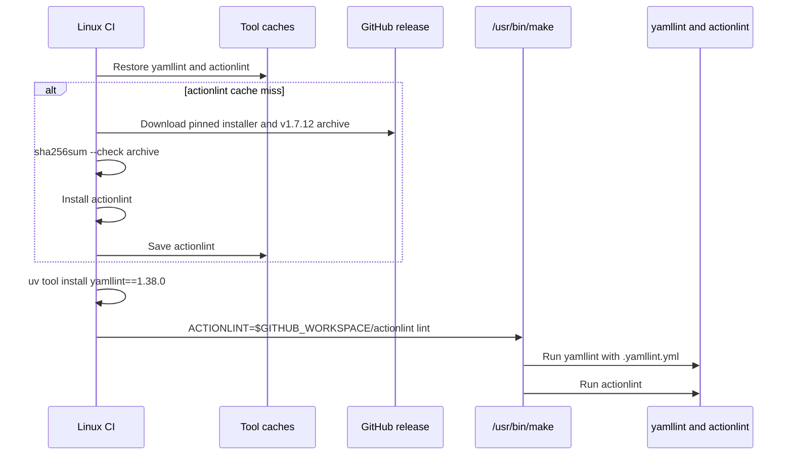
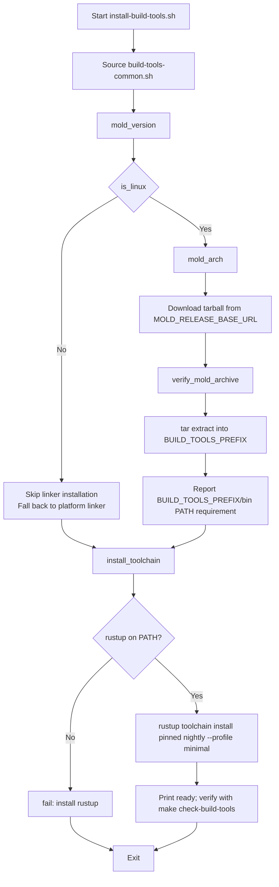
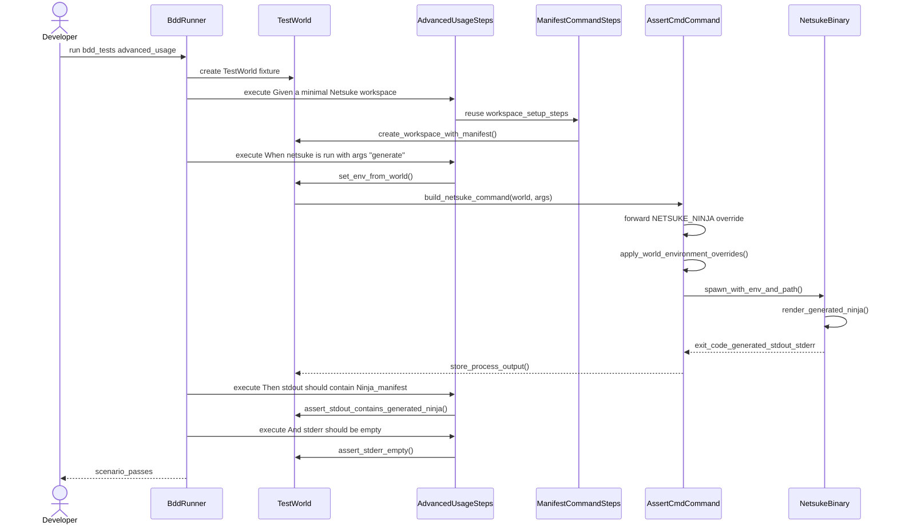

# Developer guide

This guide describes the day-to-day engineering workflow for Netsuke, with a
focus on writing and maintaining tests. It is the source of truth for how the
test suite is expected to be used by contributors. The normative architecture
reference for bounded release-admission observability is
[ADR-020](adr-020-release-admission-observability.md).

## Command-line interface architecture

The governing command-line interface (CLI) architecture record is ADR-003,
[`Agent-consistent human-first CLI`][adr-003-cli]. It defines the pre-0.1.0
contract: keep the terminal experience human-first, make names and outputs
consistent enough for agents and automation, remove legacy aliases instead of
preserving inconsistent vocabulary, use `--json` as the only structured result
mode, keep subprocess output out of JSON stdout, and require explicit `--force`
or `--dry-run` controls for consequential operations.

The architectural source of truth for CLI behaviour is
[`docs/netsuke-cli-design-document.md`](netsuke-cli-design-document.md). Use
that document when changing command grammar, output modes, diagnostics,
localization, accessibility behaviour, configuration precedence, or planned
product surfaces such as `context`, `skill-path`, `runs`, `profile`, delivery,
and feedback commands. The overhaul execution plan in
[`docs/execplans/netsuke-cli-overhaul.md`](execplans/netsuke-cli-overhaul.md)
tracks sequencing only; it must not replace ADR-003 or the CLI design document
as the durable architecture record.

[adr-003-cli]: adr-003-agent-consistent-human-first-cli.md
[reconciliation-module]: ../src/stdlib/network/policy/reconciliation.rs

### CLI parsing and command-composition boundary

`src/cli/value_parser.rs` owns `LocalizedValueParser`. This type is a private
Clap adapter: it wraps a localization-aware validation closure and can carry
optional `PossibleValue` help metadata. Its `with_possible_values` constructor
is the adapter API for attaching the values and descriptions shown in command
help; it does not make domain policy types depend on Clap.

Only the CLI command-composition path may construct `LocalizedValueParser`.
Production construction currently belongs to
`src/cli/parser.rs::configure_validation_parsers`, which attaches the
localization-aware validators and their policy metadata to one command tree.
The shared command factory is the composition path for runtime parsing, help,
man pages, and shell completions: it starts with `Cli::command()`, applies
localization when a `Localizer` is available, and then configures validation
parsers. Build scripts call the same factory without a `Localizer`, retaining
the source `en-US` wording while still installing parser metadata. They do not
perform runtime configuration discovery, so generated artefacts remain
deterministic.

`parse_with_localizer_from` must call `configured_command`. That factory
localizes `Cli::command()`, calls `configure_validation_parsers`, and returns
the configured command before `parse_with_localizer_from` calls
`ortho_config::parse_localized_command`. This ordering preserves localized
parse errors and keeps possible-value metadata on every rendered command tree.
The `src/cli/parsing.rs` helpers and the domain policy types remain
Clap-independent. Do not move Clap types or `TypedValueParser` implementations
into domain configuration types. The `src/cli/policy_values.rs` module owns the
Clap-only conversion from the canonical policy definitions to `PossibleValue`
metadata; it must not become a second source of policy names or descriptions.

When a new typed CLI argument needs localized validation, add its parser through
`configure_validation_parsers`. Do not construct a second command tree or
bypass the configured command path. This keeps `--help`, `netsuke help`, man
pages, and completions aligned with the parser used for actual invocations.

## Ninja child-process APIs and help-runner boundary

The public Ninja process helpers are re-exported from `netsuke::runner`.
`CommandEnv` is an explicit, composable set of child-process overrides:
`CommandEnv::inherit()` leaves the parent environment in place, `with_var`
overrides one variable, and `with_path` replaces the child's `PATH`. The parent
process is never mutated. `NinjaBuildRequest` and `NinjaToolRequest` borrow the
program, `NinjaProcessOptions` (`working_dir` and `jobs`), generated build
file, target list or tool name, and `CommandEnv` needed for one invocation. The
`program` and `build_file` fields on both request types are `&Utf8Path`, while
`NinjaProcessOptions::working_dir` is an `Option<Utf8PathBuf>`. `Cli::file` and
`Cli::directory` use the corresponding owned `Utf8PathBuf` values. The process
layer converts these paths to `std::path::Path` only at the lossless
`std::process::Command` boundary.

The public runner signatures preserve that path vocabulary:

- `run_ninja(program: &Utf8Path, cli: &Cli, build_file: &Utf8Path, targets: &BuildTargets)`
  invokes a build with the CLI's process options.
- `run_ninja_tool(program: &Utf8Path, cli: &Cli, build_file: &Utf8Path, tool: &str)`
  invokes a Ninja tool with the CLI's process options.
- `run_with_ninja_program(cli: &Cli, prefs: OutputPrefs, program: &Utf8Path)`
  runs the selected command with a caller-supplied Ninja executable.

The process boundary is parser-independent; callers without CLI state construct
`NinjaProcessOptions` directly.

Build command shaping places a literal Ninja `--` after all Netsuke-owned
options and before the selected targets whenever the target list is non-empty.
The same boundary applies to explicit CLI targets and configured
`default_targets`, because both use `BuildTargets`. Thus option-like values
such as `-f` and `-C` remain target operands. An empty target list preserves
the no-terminator shape, and Ninja tool invocations are unchanged because their
operands are fixed by Netsuke.

The `run_ninja` and `run_ninja_tool` helpers inherit the parent environment;
their program and build-file parameters use `&Utf8Path`. Callers that need an
isolated child use `run_ninja_with` or `run_ninja_tool_with` with one of the
request types. Keep environment selection at this process boundary: do not add
process-wide environment mutation to callers or tests.

`netsuke help targets` is deliberately a different runner path. The dispatch
layer routes `HelpTopic::Targets` to `src/runner/help.rs`, which resolves and
runs the manifest loading, expansion, and rendering stages, then always builds
and validates a `BuildGraph` before rendering the deterministic
action-then-target catalogue. An invalid graph aborts before the catalogue is
rendered. It must not generate a Ninja file, call a Ninja subprocess, execute a
recipe, or create build outputs. Its Jinja environment is a restricted,
side-effect-free query surface. It allowlists only the lexical path filters
`basename`, `dirname`, `with_suffix`, and `relative_to`, the collection filters
`uniq`, `flatten`, and `group_by`, and the clock-independent `timedelta`
function. It rejects `env()` and `glob()`, file tests, filesystem metadata
filters such as `size` and `linecount`, `hash`, `digest`, `contents`,
`realpath`, and `expanduser`, executable discovery through `which` and
`command_available`, network and command helpers (`fetch`, `shell`, and
`grep`), and the clock-dependent `now()` function. Normal build manifest
rendering still registers the full standard library; this restriction applies
only to query rendering.

The query allowlist has one owner: `register_manifest_query`. Query loading
does not construct `StdlibConfig`; the registration function composes the
allowlist directly. Reuse its lexical path, collection, and time registration
helpers only when a helper's result depends on template inputs rather than the
host. Do not add a host-observing helper to the shared query registration path;
assess and record any future allowlist change here. The no-topic and
named-command help paths render clap help directly and do not load a manifest.
Keep future help topics within this boundary rather than coupling read-only
inspection to `runner::process`.

Manifest rendering has two caller-selected modes. Full rendering evaluates all
manifest fields, including recipe bodies, for build, generate, and manifest
output. Manifest-query rendering evaluates discovery metadata and the
structural selectors needed to validate the graph, but leaves command and
script recipe bodies untouched. This boundary is what permits a recipe to
contain a build-only helper without causing `help targets` to execute or
otherwise evaluate that helper; it does not alter full-render behaviour.

The standard-library registration boundary owns MiniJinja's value formatter. It
preserves the historical lowercase `true` and `false` spelling when a Boolean
helper result is interpolated into a string field, while delegating all
non-Boolean values to MiniJinja's `escape_formatter`. Keep this as one
registration-wide policy: do not add per-helper or per-call formatter variants.

Helpers excluded from the query allowlist are registered as deliberate
query-disabled stubs by the standard-library adapter. The stubs return a
stable, classified MiniJinja operation error. Manifest expansion recognizes
that classification only while evaluating a query `when` expression: the result
is a conditional entry when the helper prevents evaluation, whereas a
successfully evaluated false expression still excludes the entry. Unrelated
template errors continue to propagate normally.

Expansion records the conditional outcome as internal `Target::conditional`
metadata, which defaults to `false` for ordinary manifest data. Help-query
cataloguing copies that flag to every resolved name, and the text and JSON
renderers expose it as the localized conditional marker and the JSON
`conditional` boolean. The flag is discovery metadata only and must not change
which recipe a normal build executes.

### Help-target query telemetry

`src/runner/help_telemetry.rs` is the observability boundary around the pure
manifest and catalogue query within `netsuke help targets`.
`instrument_help_targets` wraps that query and records the fixed metrics
`netsuke_runner_help_targets_total` and
`netsuke_runner_help_targets_duration_seconds`. It also opens the
`runner.help_targets` span and emits a bounded `Completed help targets query`
event when the query finishes. The command boundary in `src/runner/help.rs`
owns status reporting and rendering after the query succeeds.

Telemetry labels use only the fixed `outcome` values `success` and `error`, and
the fixed `error_category` values `none`, `manifest_not_found`, and `other`.
The wrapper never records manifest-controlled names, descriptions, paths, or
other details. Metric descriptions are registered once per process, through a
`Once`, so repeated queries do not re-register them.

Telemetry tests use `metrics::with_local_recorder` with a
`metrics_util::DebuggingRecorder`, together with the local tracing subscriber
capture helper. They assert the counter, duration sample, and completion event
for a successful fixture query, a missing-manifest failure, and an invalid
manifest failure classified as the non-`RunnerError` `other` category.

## Localization

`src/locale_catalogues.rs` is the authoritative registry of shipped catalogues.
It sits at the crate root, not under `localization/`, because `localization`
builds its default localizer through `cli_localization`, and `cli_localization`
reads the registry; a registry inside `localization` would close that into a
module cycle. `localization::locales` re-exports it, so the older path still
resolves for callers. `define_locales!` declares the tags and embeds
`locales/<tag>/messages.ftl` for each, so a tag without a catalogue on disk
fails to compile. Read the registry rather than writing a separate locale list;
the build audit, the `rerun-if-changed` directives, and the packaging smoke
test all do. `tests/locale_registry_tests.rs` is the deliberate exception: its
`EXPECTED_SHIPPED_TAGS` constant writes out every shipped tag by hand rather
than reading the registry, and asserts the registry matches it. A test that
reads the registry could only confirm the registry agrees with itself, so this
list stands as an independent oracle — adding or dropping a catalogue has to be
a conscious edit to it as well as to the registry.

`Cargo.toml`'s `package.metadata.ortho_config.locales` is the one unavoidable
duplicate, because Cargo metadata cannot call into Rust. The build audit
compares it against the registry and fails on drift.

Adding a locale therefore means: create `locales/<tag>/messages.ftl` with every
declared key translated, add the tag to `define_locales!`, add it to the
`package.metadata.ortho_config.locales` array, and add it to
`EXPECTED_SHIPPED_TAGS` in `tests/locale_registry_tests.rs`. If the language
already ships a catalogue, add a `LANGUAGE_FALLBACKS` rule too, so the new tag
and the existing one resolve as intended rather than one of them capturing the
other.

Each omission is caught, but not all by the same gate. A missing catalogue file
fails compilation, because `define_locales!` embeds it with `include_str!`. A
missing `Cargo.toml` entry fails the build-time audit. A missing
`EXPECTED_SHIPPED_TAGS` entry fails `make test` rather than the build, since
the oracle is a test: that is the cost of its independence, and the reason to
run the suite before assuming a locale is wired up. The `LANGUAGE_FALLBACKS`
rule is the exception with no gate at all — it is a judgement about which
variants are interchangeable, and nothing can infer it.

Table 1: The locale API surface

| Item                                     | Purpose                                                                                       |
| ---------------------------------------- | --------------------------------------------------------------------------------------------- |
| `locales::SUPPORTED_LOCALES`             | Every shipped catalogue, ordered by tag                                                       |
| `locales::catalogue(tag)`                | Exact lookup; `None` when the tag ships no catalogue                                          |
| `locales::resolve_catalogue(identifier)` | Exact match, then the fallback rules, then the sole catalogue for that language, then `en-US` |
| `locales::source_catalogue()`            | The `en-US` catalogue every locale falls back to                                              |
| `cli_localization::build_localizer(tag)` | The runtime entry point: resolves, then layers over `en-US`                                   |

Selection matches the exact BCP 47 tag first. A tag with no catalogue resolves
through the per-language rules in `LANGUAGE_FALLBACKS`, then the sole catalogue
for that language, then `en-US`. The rules keep variants that differ in
substance apart — `es-419` from `es-ES`, `pt-BR` from `pt-PT`, `zh-Hans` from
`zh-Hant` — so a new locale whose language already ships a catalogue needs a
rule rather than the unique-language step. The
[translator guide](translators-guide.md) states the same policy for
translators, and the users' guide lists the tags.

Netsuke resolves the locale twice: `startup_localizer` before the configuration
merge, for help and usage errors, and `configure_runtime` afterwards, for
diagnostics and progress. Only the second sees a configuration file's `locale`,
because `--help` must render before Netsuke knows which configuration file to
read.

### Startup diagnostics buffering

Locale resolution happens before the command line is parsed, so a fallback
warning can be emitted before the effective diagnostic mode — human or JSON —
is known, yet the JSON diagnostic document is also written to stderr: an
eagerly emitted warning could corrupt it. `StartupWriter` in
`src/startup_tracing.rs` closes that window. It implements
`tracing_subscriber`'s `MakeWriter` and is installed by `init_tracing` in
`src/main.rs` before locale resolution runs, so every startup event is held
rather than written. The buffer is bounded at `MAX_BUFFERED_BYTES` (64 KiB): it
keeps the earliest bytes, appends a truncation marker once if the bound is
reached, and drops the remainder, so its size never depends on how much a run
emits.

`settle_startup_diagnostics` in `src/main.rs` decides where the buffer goes
once the effective mode is known: human mode releases it to stderr, JSON mode
discards it so stderr carries only the diagnostic document. In `run_with_args`,
settlement happens after the JSON mode is resolved but before the configuration
merge, so a human-mode warning still precedes any configuration processing. On
the paths where `clap` calls `Error::exit` and never returns —
`parse_cli_or_exit` — settlement happens first, because nothing after that call
would otherwise run.

Unit tests in `src/main_tests.rs` drive `startup_filter` and the real
`startup_localizer` to check the buffered warning and the level it is gated by.
`tests/startup_diagnostics_tests.rs` runs the built binary end to end,
including the configuration-driven JSON path, because the behaviour under test
spans the whole startup sequence and covers paths that terminate inside `clap`
before returning to `run_with_args`.

**Cross-references:** `docs/netsuke-design.md` §8.4, for the rationale behind
buffering rather than gating output on the resolved mode.

### Adding or changing messages

Every user-facing string is a Fluent message keyed from
`src/localization/keys.rs`. Adding one means adding the constant, adding the
message to all 35 catalogues, and keeping its `{ $variables }` identical across
them: the build audit rejects a missing key, an orphaned key, or a variable set
that differs from `en-US`. The audit lives in `build_l10n_audit/`, split into
`keys.rs` and `scanner.rs` (the `define_keys!` scanner, with `byte_index.rs`
for its byte-position bookkeeping), `ftl.rs` (catalogues), `metadata.rs` (the
Cargo metadata), and `compare.rs` (the rules). Because build scripts are not
test targets, those modules are included by path from four test files:
`tests/build_l10n_keys_tests.rs` exercises the `define_keys!` scanner
(`keys.rs`, `scanner.rs`, `byte_index.rs`); `tests/build_l10n_parser_tests.rs`
exercises the catalogue and metadata parsers (`ftl.rs`, `metadata.rs`);
`tests/build_l10n_audit_rules_tests.rs` exercises the comparison rules
(`compare.rs`, alongside `ftl.rs`); and `tests/build_l10n_audit_tests.rs` runs
the orchestration end to end, both over the checked-in tree and over
deliberately corrupted copies of it.

## Graph view projection and renderer adapters

The `graph` subcommand renders the build dependency graph in-process. Its
domain projection lives in [`src/graph_view`](../src/graph_view) and follows
the hexagonal port/adapter pattern:

- [`GraphView`](../src/graph_view/mod.rs) is the deterministic projection of
  [`BuildGraph`](../src/ir/graph.rs). It is constructed once, sorts every
  collection (nodes, edges, default targets), and is invariant under `HashMap`
  insertion order. The shuffled-insertion proptest in
  [`src/graph_view/tests.rs`](../src/graph_view/tests.rs) covers this invariant.
- `NodePathRegistry` owns graph-path deduplication. Its borrowed `entry_ref`
  lookup avoids cloning existing paths; conversion to `BTreeMap` at the
  projection boundary restores deterministic ordering. This registry is
  internal to graph projection and must not become a general application map.
- [`GraphRenderer`](../src/graph_view/render.rs) is the trait every renderer
  adapter implements. The contract is intentionally minimal:
  `render(&self, view: &GraphView, sink: &mut dyn io::Write) -> Result<(), GraphRenderError>`.
  Adapters consume `GraphView` only — they never touch `BuildGraph` directly.
- [`DotRenderer`](../src/graph_view/render_dot.rs) emits Graphviz DOT.
- [`HtmlRenderer`](../src/graph_view/render_html/mod.rs) emits a self-contained
  HTML page (server-rendered SVG, accessible textual outline, and a
  `<noscript>` fallback containing the DOT source verbatim).

`EdgeView::class` mirrors the four Ninja dependency relations so that renderers
can style each one distinctly:

| Variant          | Ninja separator           | DOT style       | SVG class              |
| ---------------- | ------------------------- | --------------- | ---------------------- |
| `Explicit`       | none (input in `$in`)     | solid (no attr) | `edge`                 |
| `ImplicitDep`    | single pipe (`\|`)        | `style=bold`    | `edge implicit-dep`    |
| `ImplicitOutput` | single pipe on LHS (`\|`) | `style=dotted`  | `edge implicit-output` |
| `OrderOnly`      | double pipe (`\|\|`)      | `style=dashed`  | `edge order-only`      |

`ImplicitDep` carries Ninja's single-pipe implicit inputs — header files or
schemas that trigger a rebuild without appearing in `$in`. The bold stroke
reads as "rebuild-triggering hidden input," distinguishing it from the dashed
order-only stroke (no rebuild trigger) and the dotted implicit-output stroke
(auxiliary output side).

A new renderer — for example the `--json` view planned for roadmap item
`3.15.6` — should be added as a sibling module under `src/graph_view/` that
implements `GraphRenderer`. The runner dispatch in
[`src/runner/mod.rs`](../src/runner/mod.rs) picks the appropriate renderer
based on `GraphArgs` and writes through the shared `write_text_file`/
`write_text_stdout` sink helpers. The `-` sentinel for `--output` is recognized
by `process::is_stdout_path`.

`--html` and `--output` are explicitly excluded from `OrthoConfig` layering:
they are per-invocation arguments tagged `#[serde(skip)]` on
[`GraphArgs`](../src/cli/mod.rs). Layering `--output` through a config file
would silently change the artefact destination — a footgun the design avoids by
construction.

## Command and recipe lowering

Command recipes use the `StringOrList` AST type. A scalar command remains one
shell-text value; a YAML sequence is an ordered list of entries. The same
recipe path handles commands declared on reusable rules, direct targets, and
actions. Manifest deserialization rejects an explicitly empty command list. The
internal `StringOrList::Empty` marker is valid for an action or target when its
rendered `deps` list is non-empty, forming a dependency-only aggregate. Code
that constructs the IR directly must reject an empty
`StringOrList::List(Vec::new())` during Ninja generation rather than emitting
an unusable rule.

### Dependency-only actions and targets

The manifest's internal dependency-only marker represents an action or target
whose non-empty `deps` list is its complete operation. Manifest loading renders
`deps` before validating recipes, then rejects dependency-only rules and
actions or targets whose rendered dependencies are absent. Entries with
executable work continue to require exactly one of `command`, `script`, or
`rule`.

Manifest-to-IR lowering keeps the dependency list as `BuildEdge::implicit_deps`
and registers the dependency-only action without a command. The shared action
rule emission in `src/ninja_gen/mod.rs` omits that action from the generated
Ninja `rule` blocks; its edge selects Ninja's built-in `phony` rule instead.
The direct generator and the serial-dependency bundle use this same path, so a
dependency-only aggregate does not need a synthetic `command: ":"` recipe.

The lowering stages have deliberately separate responsibilities:

- `src/manifest/render.rs` renders a scalar or each list entry independently.
  Every entry sees the same cloned recipe context, including target variables
  and delayed `ins`/`outs` markers. A rendering error for a list includes its
  one-based entry position.
- `src/ir/from_manifest_support.rs` prepares one shell-quoted input/output
  binding set for the recipe, then interpolates every scalar or list entry with
  that set. Only `{{ ins }}` and `{{ outs }}` markers are resolved per entry.
  Literal `$ins` and `$outs` remain shell variables and are escaped for Ninja
  pass-through. POSIX lowering tracks unquoted, single-quoted, and
  double-quoted text, and rejects markers within command substitutions because
  it cannot lower them safely; scripts therefore retain heredocs and comments
  without accepting an unsafe marker context. The resulting action contains
  ordinary command text and no Ninja placeholders.
- `src/ninja_gen/mod.rs` delegates completed recipe text to
  `src/ninja_gen_recipe_shell.rs`. On Unix, and for the explicit Windows Bash
  compatibility route, a scalar remains POSIX shell text. A list puts each
  entry in a brace group and joins the groups with `&&`; `eval` receives a
  shell-quoted payload, which keeps inline comments and trailing control
  operators inside the entry boundary. Braces preserve current-shell state and
  the chain remains fail-fast. The existing background-job and `exec`
  validation rules apply to this POSIX route.
- On Windows, `RecipeShell::PowerShell` renders scalar commands and scripts as
  encoded `powershell.exe` invocations while they fit the Windows command-line
  limit. Recipes up to 1 MiB use Ninja's per-edge `rspfile` and
  `rspfile_content` bindings; larger recipes are rejected before Netsuke
  allocates UTF-16LE and Base64 payloads. Ninja derives a unique `$out`-based
  `.ps1` response-file name, creates it in the edge's working directory with an
  ASCII PowerShell bootstrap containing the Base64 UTF-16LE payload, and
  invokes it with `powershell.exe -File "$rspfile"`. The bootstrap removes its
  own `$PSCommandPath` in a `finally` block after the recipe succeeds or fails;
  query-only generation emits the bindings without creating files. An ordered
  list becomes one PowerShell script that checks `$LASTEXITCODE` immediately
  after each generated list entry, preserving PowerShell state while stopping
  before a later entry can overwrite a non-zero status. Multiple native
  commands inside one entry are not individually instrumented. Terminating
  PowerShell errors also stop the list. The POSIX command-list analyser is
  deliberately not applied to this route. The runner resolves
  `NETSUKE_WINDOWS_SHELL` and preflights `bash.exe` only when the optional
  compatibility route is selected; `help targets` stays outside this execution
  boundary.
- The brace-group, `eval`, background-job, and `exec` validation rules described
  above apply only to Unix and the explicit Windows Bash compatibility route.
  PowerShell uses its per-entry `$LASTEXITCODE` and terminating-error checks
  instead. In shell-dollar documentation, `$$` therefore means a process
  identifier only for POSIX/Bash; PowerShell's `$$` automatic variable contains
  the last token received by the session.
- `src/runner/process` forwards the command's output and recognizes the
  bounded `netsuke command-list failure: action HASH, entry M` marker. A failed
  list therefore retains the original exit status while adding the fixed-width
  hashed action fingerprint and one-based entry index to the Ninja failure
  error.

Failure attribution is private to Ninja process execution:
`FailureAttributionWriter` parses only Ninja's stderr. Because Ninja relays a
failed subcommand's stderr on its own stdout, build runs retain only a fixed
512-byte stdout tail and use its parsed marker only after a non-zero exit.
Ordinary child stdout streams forward directly and must not use this tail.

The lowest-layer POSIX shell-word quoting used for input/output paths during IR
lowering is `shell_quote::QuoteRefExt::quoted(Sh)`. It performs minimal,
fragmented shell quoting, which is appropriate for a literal shell word but not
for the command-list `eval` payload. That renderer requires a canonical
single-quoted payload so existing generated Ninja list text remains
byte-for-byte stable, and the delimiter/boundary tests continue to hold. Keep
that quoting in the deliberately local `shell_single_quote` function; it is not
a general-purpose helper. Neither quoting path is the platform-specific
`src/stdlib/command/quote.rs` implementation behind the `command.quote`
template wrapper, which must retain its `cmd.exe` quoting behaviour on Windows.

Attributed list failures emit the bounded tracing fields `command_list_action`
(a fixed-width action fingerprint) and `command_list_entry` (the one-based
entry index), plus the matching `command_list_failure` marker. The process
boundary records `netsuke_ninja_command_list_failures_total` and
`netsuke_ninja_command_list_failure_duration_seconds`, with an `outcome` label
of `failure`. Elapsed failure duration is measured through the injected
`monotony::MonotonicClock`; production uses `StdMonotonicClock`, while tests
use deterministic test clocks. These diagnostics and metrics contain no command
text.

Changes to this pipeline must preserve the scalar/list distinction, per-entry
rendering, current-shell state sharing, and failure attribution. The focused
rendering, lowering, Ninja-generation, and real-Ninja integration tests are the
behavioural contract for these boundaries.

### Ninja text-escaping seam

The seam is owned by `src/ninja_gen_escape.rs`. The Ninja action writer may
compose a completed command and hand it to the selected renderer. POSIX and
Bash routes convert `ShellText` through `escape_ninja_value`; the encoded
PowerShell transport returns a private `NinjaValue` without exposing its
payload to Ninja parsing. No IR or manifest lowering may call either route.
Descriptions, `depfile`, `deps`, and `pool` keep their backend-neutral IR text
and are converted only at their Ninja emission boundary, where literal dollars
are doubled and newline, carriage-return, and NUL characters are rejected. Add
a separate, explicitly documented conversion for any new Ninja grammar position
rather than reusing command escaping.

## Package and target naming

The crates.io package is `netsuke-build`; the library target, the binary
target, and the command are all `netsuke`. The names diverge because `netsuke`
is taken on crates.io. [ADR-007](adr-007-publish-as-netsuke-build.md) records
the decision and [repository layout](repository-layout.md) states the rule.

The practical consequence is that **no user-facing name may be derived from
Cargo package metadata**. Derive from the command-line interface (CLI) name, or
from the `bin-name` field that
`leynos/shared-actions/.github/actions/export-cargo-metadata` reads out of
`[[bin]]`:

- `build.rs` names the manual page `<CLI name>.1` and stamps its `.TH` source
  as `<CLI name> <version>`, taking the name from `Cli::command()`. It reads
  neither `CARGO_PKG_NAME` nor `CARGO_BIN_NAME`. The build script publishes the
  path it wrote through `cargo:rustc-env=NETSUKE_GENERATED_MAN_PAGE`, and
  `tests/man_page_contract_tests.rs` asserts the file is `netsuke.1`, is staged
  under `target/generated-man/<target>/<profile>/`, and carries a title that
  never mentions `netsuke-build`.
- Release packaging takes `bin-name` from the `metadata` job in
  `.github/workflows/release.yml`, so `.github/release-staging.toml`, the
  Debian and RPM payloads, the Windows Installer product, and the macOS
  installer package all stay named `netsuke`.
- `[package.metadata.binstall]` in `Cargo.toml` overrides `cargo binstall`'s
  default asset resolution, whose patterns place the target before the version
  and so match no released asset, leaving a fallback to a source build on the
  pinned nightly. A single template resolves a
  `{ name }-{ version }-{ target }.tar.gz` archive (`pkg-fmt = "tgz"`) for
  every released target, named after the Cargo package rather than the binary.
  `stage-release-artefacts` stages each target's archive, plus a `.sha256`
  sidecar, per `[common.binstall]` in `.github/release-staging.toml`, and the
  "Hoist cargo-binstall archives" step in `.github/workflows/release.yml` runs
  `scripts/hoist_binstall_archives.py` under a pinned Python 3.14 installed by
  `setup-uv`. The script validates that every target's archive and checksum are
  present, are regular files rather than symlinks, and have a free destination
  before moving them to the release root for upload; the read-only discovery
  and validation half lives in `scripts/hoist_binstall_discovery.py`. The move
  is transactional: a forward failure rolls completed pairs back to their
  nested paths and re-raises the original failure after a successful rollback.
  If an `OSError` prevents rollback, the original and rollback failures are
  combined in a `BaseExceptionGroup`; another rollback exception propagates
  unchanged. `tests/binstall_metadata_tests.rs` and
  `tests/workflow_contracts/hoist_binstall_archives_test.py` hold this contract.

Only the two registry installation commands name `netsuke-build`, and
`tests/documentation_installation_tests.rs` pins both. When adding a release
target, a packaging format, or an artefact name, add the target to
`.github/release-staging.toml`'s `[targets.*]` table and to the release
workflow's target matrices; the single `pkg-url` template in `Cargo.toml`
(`{ name }-{ version }-{ target }.tar.gz`) resolves new targets automatically,
with no per-target edit. `tests/binstall_metadata_tests.rs` and
`tests/workflow_contracts/hoist_binstall_archives_test.py` hold that contract,
and fail if per-target overrides reappear or the staged and expected archive
names diverge.

## Toolchain and borrow checker

Netsuke builds on the dated nightly toolchain pinned in `rust-toolchain.toml`
with the Polonius alpha borrow-checking analysis enabled. Nightly toolchains
dated 2026-08-04 and later run Polonius by default, so the pin carries the
requirement on its own: **no `-Zpolonius` directive is passed anywhere, and
none should be added.** The directive is being retired upstream, and a build
that restates it is a build that can silently drop it. A contract test
(described below) fails if one reappears.

`rustup` provisions the toolchain automatically inside a checkout, which covers
every checkout consumer — plain Cargo invocations, rust-analyzer, Clippy, and
Whitaker — without any Cargo configuration. `cargo kani setup` is a separate
boundary: Kani 0.67.0 installs and uses its bundled `nightly-2025-11-21`
toolchain rather than the checkout toolchain. `.cargo/config.toml` carried the
Polonius flag until the pin moved past 2026-08-04; that file was deleted then
and has since returned for the build standard alone, so look to *The build
standard* above for what it holds now.

Makefile recipes set `RUSTFLAGS` through a small set of named variables rather
than spelling a value out, and the variable a recipe composes states its policy.
`GATE_RUSTFLAGS` appends `-D warnings` and the standard's flags, and every
lint or test gate takes it. `DEBUG_RUSTFLAGS` takes the standard but leaves the
caller's warning policy alone, so `make build` is not a gate. `KANI_RUSTFLAGS`
denies warnings but takes none of the standard: Kani drives `rustc` through
`kani-compiler` on its own bundled toolchain, where neither flag applies.
`RELEASE_RUSTFLAGS` assigns an empty inherited value, which is what holds the
config file's `rustflags` tables off a shipped artefact; see *Exclusions* under
*The build standard*. Every one of them builds its value as
`RUSTFLAGS="$${RUSTFLAGS:+$$RUSTFLAGS }…"`, whose `$${RUSTFLAGS:+$$RUSTFLAGS }`
expansion prepends any `RUSTFLAGS` already set by the caller (for example a CI
wrapper), so those flags survive rather than being silently discarded.
`tests/makefile_test_target/rustflags.rs` holds all four to that composition
and to their individual policies.

[ADR-006](adr-006-adopt-polonius-nightly-toolchain.md) records the policy
decision, and the [polonius migration notes](polonius.md) track every site
whose design depends on the analysis. Sites tagged `POLONIUS(...)` fail to
compile under plain non-lexical lifetimes (NLL); do not rewrite them into
double lookups, unconditional key clones, or id indirection, and do not pad new
code with defensive clones that only NLL required. When a borrow-centric form
fails to compile, consult the migration notes before restructuring.

### Polonius CI shared-action contract

Continuous integration gets Polonius the same way a checkout does: from the
pinned toolchain. What the shared-action contract still governs is the
*toolchain selection* and the warning policy that travels beside it.

The shared Rust setup actions export their own `RUSTFLAGS`, so anything a job
needs travels as an *action input*, not as a job environment variable: each
affected workflow passes it through the relevant shared action's
`with.rustflags` input, and none of them may set a job-level `env.RUSTFLAGS`. A
job-level override would win over the action's exported value and silently drop
whatever the action set.

Six CI jobs across five workflows carry the contract.

Table: CI jobs and their shared Rust setup.

| Workflow                                                              | Job                  | Shared action        | `with.rustflags`            |
| --------------------------------------------------------------------- | -------------------- | -------------------- | --------------------------- |
| [`ci.yml`](../.github/workflows/ci.yml)                               | `build-test`         | `setup-rust`         | `-D warnings`               |
| [`ci-windows.yml`](../.github/workflows/ci-windows.yml)               | `lint-windows`       | `setup-rust`         | `-D warnings`               |
| [`ci-windows.yml`](../.github/workflows/ci-windows.yml)               | `build-test-windows` | `setup-rust`         | `-D warnings`               |
| [`coverage-main.yml`](../.github/workflows/coverage-main.yml)         | `coverage-upload`    | `setup-rust`         | `-D warnings`               |
| [`netsukefile-test.yml`](../.github/workflows/netsukefile-test.yml)   | `netsukefile`        | `setup-rust`         | *(omitted; action default)* |
| [`build-and-package.yml`](../.github/workflows/build-and-package.yml) | `build`              | `rust-build-release` | *(omitted; action default)* |

The CI jobs and coverage pass `-D warnings` explicitly because those jobs gate
on a warning-free build — on Windows that is what surfaces findings in the
`#[cfg(windows)]` tree at all. The pinned shared actions also apply
`-D warnings` by default when `with.rustflags` is omitted, so an upstream
compiler warning can fail both the Netsukefile and packaging jobs. Their
omitted inputs are intentional and remain distinct from jobs that explicitly
pass `with.rustflags: -D warnings`; neither job supplies an explicit empty
value. The coverage action's `cargo-llvm-cov` invocation inherits the flags
`setup-rust` exports and appends its own instrumentation flags.

No `setup-rust` call passes a `components` input. The shared action is not
declared to accept one and installs rustfmt and clippy itself, so passing it
only emitted an "Unexpected input(s)" warning on every run;
`tests/workflow_contracts/ci_lint_test.py` holds that.

### Where the CI workflow lives

The merge gate spans two files. [`ci.yml`](../.github/workflows/ci.yml) holds
the Linux gate and the Kani smoke job;
[`ci-windows.yml`](../.github/workflows/ci-windows.yml) holds `lint-windows` and
`build-test-windows`, the two concurrent halves of the Windows gate, and
`ci.yml` invokes both through a single `windows` job. The split exists to keep
both files inside the 400-line limit that AGENTS.md sets for every file in the
repository; adding a Windows step therefore goes in `ci-windows.yml`.

GitHub does not expose the `env` context to a reusable workflow's `with` block,
so `ci.yml` repeats its `NEXTEST_VERSION`, `MDTABLEFIX_VERSION`, and
`PYTHON_BASELINE` pins as literal inputs, and `ci-windows.yml` re-exports them
as workflow-level `env`. Each pin is still declared once at workflow scope in
`ci.yml`, so the `sed` extraction AGENTS.md documents still yields exactly one
value. `tests/workflow_contracts/ci_windows_job_test.py` holds the caller's
literals equal to those pins, so the two copies cannot drift.

### Windows MSI packaging and upgrade validation

The Windows packaging workflow passes the repository-owned authoring file as
`wxs-path: installer/Package.wxs` to the pinned
`leynos/shared-actions/.github/actions/windows-package` action. Keep that input
when changing the packaging action: the caller owns the WiX v4 authoring and
the shared action passes it to the pinned WiX compiler unchanged.

The merge gate's dedicated `windows-msi-upgrade` job runs on `windows-latest`.
It uses the local `.github/actions/windows-msi-upgrade-validation` adapter for
fixture creation, package builds, and the install-transition checks. Keep the
adapter scoped to this repository's deterministic MSI fixtures; it must not
replace or rewrite caller-provided WiX authoring.

The MSI `UpgradeCode` in `installer/Package.wxs` is a stable upgrade-family
identifier and must not change between releases. The `ProductCode` is not
authored explicitly; WiX generates a new product identity for each package
build. This combination lets Windows Installer treat a new package as a major
upgrade while retaining one upgrade family.

The packaging workflow derives `NETSUKE_RELEASE_RANK` with the repository's
release-rank helper before invoking the action. The accepted version formats are
`MAJOR.MINOR.PATCH` for a final release and `MAJOR.MINOR.PATCH-betaN` for a
beta release. Beta sequence `N` is an integer in `1..=65534`; the final release
has rank `65535`. Empty, non-numeric, zero, and out-of-range beta sequences,
malformed numeric versions, and unsupported prerelease suffixes are rejected
before an MSI is built.

The rank preserves release ordering that MSI's numeric version comparison
cannot represent when prerelease suffixes share the same numeric version. A
later beta replaces an earlier beta, and the final release replaces betas in
the same release line. An older beta is rejected after a later beta or the
final release has been installed. The stable `UpgradeCode`, generated
`ProductCode`, `MajorUpgrade` metadata, and release-rank launch condition are
one contract; change them together and update the tests.

Validation has deliberately separate responsibilities:

- `tests/installer_package_wxs_tests.rs` parses the XML and checks the stable
  WiX structure and upgrade metadata. XML parsing does not validate WiX schema
  compatibility.
- The release-rank example and property tests execute the repository-owned
  parser without GitHub Actions or Windows environment state.
- The `windows-msi-upgrade` job and its local adapter compile
  `installer/Package.wxs` with the pinned WiX CLI and UI extension while
  building beta1, beta2, and final fixtures. They use temporary executable and
  RTF fixtures and do not compile the Rust application, so WiX schema or
  extension incompatibilities fail the merge gate.
- The same adapter then uses quiet `msiexec` installs and preserved logs to
  verify replacement, registry `ReleaseRank`, product identity, and refused
  downgrades. An unconditional cleanup step removes every fixture installation,
  including the final release.

Only the `msiexec` phase exercises Windows Installer's actual install,
replacement, and downgrade behaviour; passing the XML and compiler checks alone
does not prove the upgrade path.

### Why the two Windows Rust/cache jobs are split

`lint-windows` and `build-test-windows` run concurrently on `windows-latest`.
They used to be one job, in which formatting, Clippy and Whitaker ran in series
ahead of the test step for no reason: neither half consumes the other's output.
Two different measurements are quoted below and they are not interchangeable,
so each is labelled.

**Per-step medians, single job, 57 successful runs of
`Windows / build-test-windows` between run 33890685806 and run 34064668331.**
The lint series cost 19s of `Format`, 114s of `Lint (Clippy)`, 40s installing
Whitaker and 385s of `Lint (Whitaker)`, ahead of a 471s `Test` step, in a job
whose median total was 1191s.

**End to end, whole Windows lane.** Before the split this was the gate job plus
the queue and duration of the native-recipe smoke job that depended on it, a
median of 1468s over the same runs. After the split it is the slower of the two
concurrent jobs, measured at 848s, 816s and 877s on runs 34090304160,
34098601536 and 34164600713.

The two figures answer different questions. The 1191s is what one job took; the
1468s is what a contributor waited for. Only the second is comparable with the
post-split numbers, and it is the one to quote.

The cost of the split is a second hosted Windows runner and a second cache
restore per pull request, which is accepted where it speeds development. Which
job leads has already changed once, from `Test` to `Lint (Whitaker)`, as
sccache warmed; the lane tracks the slower half rather than their sum, so the
useful question after a change is which half now leads.

`tests/workflow_contracts/ci_windows_job_test.py` holds the shape: each Git
Bash Makefile gate runs exactly once across the lane, each runs in the job that
owns it, and neither job declares `needs`. Putting the lints back in series, or
making either job wait for the other, fails there.

### Cache ownership and bounded CI resources

Ubicloud destroys the runner VM at the end of every job, so warm state reaches
the next run only through a cache archive. Ownership is therefore the whole
design: every mutable path has exactly one cache step, every key has exactly
one writer, and pull requests restore without publishing.

Lanes do not share one shape. Each declares its vCPU count once and derives
every worker bound from that single number, and
`tests/workflow_contracts/runner_placement_test.py` holds the flags equal to
the declared count, so a shape change cannot leave an oversubscribed job behind.

Table: CI lane runner shapes and concurrency settings.

| Lane                                  | Runner                            | Concurrency configuration                                                        |
| ------------------------------------- | --------------------------------- | -------------------------------------------------------------------------------- |
| `ci.yml` `build-test`                 | `ubicloud-standard-4-ubuntu-2404` | `BUILD_JOBS=-j 4`, `CARGO_BUILD_JOBS=4`, `NEXTEST_TEST_THREADS=4`                |
| `coverage-main.yml` `coverage-upload` | `ubicloud-standard-4-ubuntu-2404` | `CARGO_BUILD_JOBS=4`, `NEXTEST_TEST_THREADS=4`                                   |
| `ci.yml` `kani-smoke`                 | `ubicloud-standard-2-ubuntu-2404` | no Cargo or nextest worker variables                                             |
| `netsukefile-test.yml` `netsukefile`  | `ubicloud-standard-2-ubuntu-2204` | `BUILD_JOBS=-j 2`                                                                |
| `release.yml` `build-linux`           | `ubicloud-standard-2-ubuntu-2404` | caller-selected packaging runner; no sccache                                     |
| `ci-windows.yml` `lint-windows`       | `windows-latest`                  | `BUILD_JOBS=-j 4`, `NEXTEST_BUILD_JOBS=--build-jobs 4`, `NEXTEST_TEST_JOBS=-j 4` |
| `ci-windows.yml` `build-test-windows` | `windows-latest`                  | `BUILD_JOBS=-j 4`, `NEXTEST_BUILD_JOBS=--build-jobs 4`, `NEXTEST_TEST_JOBS=-j 4` |

`build-test` and `coverage-upload` are the two instrumented lanes and both run
on `ubicloud-standard-4-ubuntu-2404`, declaring `LINUX_LANE_VCPUS: '4'`. The
merge gate sets `BUILD_JOBS: -j 4`, `CARGO_BUILD_JOBS: '4'` and
`NEXTEST_TEST_THREADS: '4'`; the coverage lane sets the latter two, since it
runs no separate `make` build.

The escalation to four vCPUs rests on measurement, not on the memory inference
that first prompted it. On the smaller shape the gate lost its runner sixteen
minutes into the instrumented build with no log. The sampler added to both
lanes shows disk, not memory, is the constraint: across three runs the peak
volume usage was 82,523, 82,563 and 82,431 MiB, about 80.6 GiB, which exceeds
`ubicloud-standard-2`'s entire 75 GB volume, while memory peaked at 2,668 MiB
of 16 GB. Discarding the instrumented tree before any cache save returns
roughly 13 GB.

The other Linux lanes stay on two vCPUs, because none of them runs the
instrumented build: `kani-smoke`, whose payloads are prebuilt and which
declares no worker variables at all; `netsukefile`, on
`ubicloud-standard-2-ubuntu-2204` with `BUILD_JOBS: -j 2`, deliberately pinned
to the older image so the lane exercises the glibc it exists to test; and Linux
release packaging, whose runner the caller selects.

The Windows lane declares `WINDOWS_LANE_VCPUS` for the four vCPUs a
GitHub-hosted `windows-latest` runner supplies, and bounds compilation and test
execution separately: `NEXTEST_BUILD_JOBS=--build-jobs 4` limits the compile
that precedes the run, and `NEXTEST_TEST_JOBS=-j 4` limits nextest's test
processes. Two variables rather than one, so a lane can bound each without
oversubscribing the other.

Table: cache owners, their paths, and the key inputs that invalidate them.

| Step | Owner                         | Paths                                                                                         | Key inputs                             |
| ---- | ----------------------------- | --------------------------------------------------------------------------------------------- | -------------------------------------- |
| A    | `linux-gate-cache`            | `~/.cargo/registry`, `~/.cargo/git`                                                           | lockfile, toolchain, OS/arch/env/image |
| B    | `linux-gate-cache` (disabled) | `SCCACHE_DIR`                                                                                 | toolchain, profile, commit             |
| C+D  | `linux-gate-cache`            | `~/.cargo/bin`, `~/.local/bin`, `.uv-bin`, `.uv-cache`, `.uv-tools`, `actionlint`, typos base | tool pins, OS/arch/env/image           |
| E    | `linux-gate-cache`            | `~/.local/share`                                                                              | `dylint.toml`, installer pin           |
| Kani | `kani-cache`                  | `.kani-cargo`, `.kani-home`, `.kani-rustup`                                                   | `tools/kani/VERSION`                   |
| A    | `netsukefile-test.yml`        | `~/.cargo/registry`, `~/.cargo/git`                                                           | as step A, on the 22.04 image          |
| C    | `netsukefile-test.yml`        | `~/.cargo/bin`                                                                                | workflow pins, 22.04 image             |
| A    | `windows-gate-cache`          | `~/.cargo/registry`, `~/.cargo/git`                                                           | lockfile, toolchain, `runner.os`/arch  |
| C+D  | `windows-gate-cache`          | `~/.cargo/bin`, `~/.local/bin`, `.chocolatey-cache`                                           | workflow pins, `runner.os`/arch        |
| E    | `windows-gate-cache`          | `~/AppData/Roaming/github`                                                                    | `dylint.toml`, workflow pins           |

Every key carries an explicit `v1` generation so the whole family can be
invalidated deliberately, and `runner.os`, `runner.arch`, `runner.environment`,
and the Ubuntu release, so a 24.04 archive can never restore onto the 22.04
lane and a Linux archive can never restore onto Windows.

Each lane's cache steps live in a composite action rather than inline, because
the workflow files must stay inside the repository's 400-line limit and because
one file per lane makes the ownership rule visible in one place: the Linux gate
uses [`linux-gate-cache`](../.github/actions/linux-gate-cache), the Kani job
uses [`kani-cache`](../.github/actions/kani-cache), and the Windows jobs use
[`windows-gate-cache`](../.github/actions/windows-gate-cache). Each action
renders its keys once, so restore, save, and the observation summary cannot
drift apart. The Windows action takes a `profile` input naming which job is
calling and therefore which keys it may publish. Every key still has exactly
one writer, but the Windows gate is two concurrent jobs, so the four families
are split between them: `lint` is `lint-windows`, which owns `tools` and
`whitaker`, the paths it installs into; `gate` is `build-test-windows`, which
owns `registry` and `sccache`, the two its compile fills. Both restore all four.
`smoke` is the release native-recipe job, which restores the gate's generation
by prefix and declares no save step at all.
`tests/workflow_contracts/windows_cache_writers_test.py` evaluates the action's
save conditions against the profiles the two jobs pass, so widening one by a
token gives a key two writers and fails there.

One cache action serves every lane: `actions/cache/restore` and
`actions/cache/save` at `55cc8345863c7cc4c66a329aec7e433d2d1c52a9` (v6.1.0).
Ubicloud's transparent cache intercepts that version, confirmed on 2026-09-03
by finding another repository's Linux keys from it in the Ubicloud console
listing while its Windows keys landed on GitHub; v4.3.0 left nothing in the
Ubicloud store. The deprecated `ubicloud/cache` fork is therefore not used,
which also removes the rule that it may never appear in a job that can run on a
GitHub-hosted label.

Cargo's `target` tree is archived nowhere, on any lane, Windows included.
sccache is the single owner of compiler output for every build shape this
repository produces, and the shapes coexist in one store because sccache hashes
the flags that distinguish them: ordinary debug objects and the `llvm-cov`
instrumented objects the coverage job builds. A `target` archive would be a
second owner of the same bytes, invalidated far more often than it helped.
`setup-rust` caches `target/${BUILD_PROFILE}` and `generate-coverage` caches
the whole tree whenever their `cache-provider` is `github`, so every caller
passes `external`. The reusable packaging workflow forwards the same input to
the nested `setup-rust` inside `rust-build-release`, which is what closed the
last lane that still archived a build tree.

Restores run immediately after checkout and before every package, tool, or
toolchain install, so a warm run reuses work an earlier run completed. Saves
run only on a push to `main`, and only when that key's restore missed. One job
writes each key family: `build-test` owns the Ubuntu 24.04 Cargo, tool, and
Whitaker keys; `netsukefile` owns the Ubuntu 22.04 family; `kani-smoke` owns
the Kani key and nothing else. The Windows family has two owners because the
gate is two jobs: `lint-windows` owns `tools` and `whitaker`, the two paths it
installs into, and `build-test-windows` owns `registry` and `sccache`, the two
its compile fills. Both restore all four, so neither key has two writers. The
coverage job and the release native-recipe smoke job restore only. `ci.yml`
therefore carries a `push` trigger on `main`: without a trunk run, no
generation would ever be written.

Every cache-bearing job publishes a `Record cache observations` step under
`if: always()` that names the rendered key and its hit result, so a cold run
reports its miss rather than staying silent and an operator can explain every
miss from the run evidence alone. The Linux release packaging lane is the one
intentional exception: its `cargo-orthohelp` entry is content-addressed by the
tool version and the pinned `rust-build-release` revision, and it is reached
only by tag pushes and the pull-request dry run, so there is no
warm-versus-cold trend for an observation step to report.

Do not add `actions/cache` or a setup-action cache to a job that already has an
owner: two writers make cache warmth, eviction, and storage cost unknowable.
All direct callers set `cache-provider: external` so `setup-rust` creates no
duplicate GitHub cache; `install-whitaker` and `generate-coverage` take the
same input for the same reason. `setup-uv` runs with `enable-cache: false`
because the gate cache already owns the uv download store, tool store, and shim
directory.

Two paths are deliberately uncached, and both are recorded here rather than
left to be rediscovered. The reusable packaging workflow
[`build-and-package.yml`](../.github/workflows/build-and-package.yml) has no
cache at all: it builds a release profile for a cross-compiled target, so it
shares no key family with the debug gate, and making it a second writer of the
Cargo download store would break the single-owner rule. The coverage job does
not cache its uv stores, because they live under `~/.local/share`, which the
merge gate's Whitaker cache owns.

The compiler cache is sccache 0.16.0, installed as a checksum-verified prebuilt
binary through the pinned `taiki-e/install-action` with `fallback: none`,
including on the packaging lane: a `RUSTC_WRAPPER` naming a binary nobody
installed is what produced "sccache: error: failed to spawn Command" there.

The Ubicloud and macOS lanes use sccache's GitHub Actions backend, which needs
no archive of its own. The GitHub-hosted Windows lanes do not: on that backend
the Windows gate recorded 643 failed writes out of 643, and the packaging build
68, which is GitHub rate limiting. Those lanes keep `SCCACHE_DIR` in a
workspace directory that the cache action owns, under a rolling key with a
prefix restore-key, and set no `SCCACHE_GHA_ENABLED` at all. On a Ubicloud
runner those objects land in Ubicloud's own store, confirmed on 2026-09-03 by
finding `sccache/...` keys from another repository's Ubicloud run in the
console listing; an earlier reading that the backend wrote to GitHub was a
misattribution of a Windows lane's objects. Setting the repository variable
`NETSUKE_SCCACHE_LOCAL_DIR` to `true` switches the Linux gate to the
local-directory backend and enables cache step B instead. Exactly one backend
is ever active. `SCCACHE_CACHE_SIZE` is 4 GB rather than the usual 2 GB,
because one store now holds two build shapes.

Every lane on the GitHub Actions backend exports `ACTIONS_RESULTS_URL` and
`ACTIONS_RUNTIME_TOKEN` through
[`sccache-gha-credentials`](../.github/actions/sccache-gha-credentials)
immediately after checkout. `use-sccache: false` stops the shared Rust setup
action that would otherwise publish them: `mozilla-actions/sccache-action`
re-exports `ACTIONS_CACHE_SERVICE_V2` and GitHub's own results address to
`GITHUB_ENV` as its last act, clobbering this export and sending the server
past Ubicloud's proxy to GitHub, where writes are rate-limited. A composite
`run` step does see the reserved variables; an earlier reading that the runner
withholds them from shell steps was a misattribution, corrected against
shared-actions runs 33854048777 and 33854213968. The ordering matters as much
as the export: `--zero-stats`, `--start-server`, and the first wrapped `rustc`
all start the server, and a server started without those variables stays in
local-disk mode for the whole job and reports zero compile requests. That
symptom has bitten this repository before, so a contract test asserts the
export runs immediately after checkout and before anything that could start the
server.

Both instrumented lanes set `RUN_RUST_CARGO_WAIT_TIMEOUT` to `1800`. The shared
coverage action wraps `cargo llvm-cov nextest` in a watchdog which defaulted to
600 seconds when this was written, a budget sized against a lane that restored a
`target` archive and so never paid for a cold compile. That default is now
1,800 seconds, the same figure these lanes set, which makes writing it down
more important rather than less: an accidental deletion would change nothing
observable until the run it killed. Nothing here archives a build tree, so a
cold sccache store leaves the whole instrumented build to do inside that
budget. The first trunk run after the Ubicloud migration failed exactly there:
all 2,790 tests passed, taking about 512 seconds at 19.42% sccache hits, and
the watchdog killed cargo 88 seconds later during report generation.

The value is roughly three times the observed cold cost and still far inside
each job's `timeout-minutes`, which is 90 on both instrumented lanes, so a
genuine hang is caught long before the runner is abandoned. Keep the two lanes
equal: `build-test` runs the same action on pull requests and meets the same
wall whenever its store is cold, which is the case a green trunk run hides.
`tests/workflow_contracts/test_execution_coverage_test.py` holds both to the
same value, parametrized over `COVERAGE_PRODUCERS`, so a producer added there
is covered without being listed again. The upstream default is reported as
[leynos/shared-actions#451](https://github.com/leynos/shared-actions/issues/451).

Every merge-gate job that compiles Rust sets `RUSTC_WRAPPER=sccache`, including
the coverage job and the Netsukefile compatibility build. The release packaging
lanes are the exception and run uncached, for two independent reasons: on
Windows sccache re-spawns rustc with the aarch64 target's `--extern` and `-L`
list and exceeds the operating system's command-line limit, and elsewhere the
lane's server would be started inside the nested setup action, which is exactly
the clobber described above. Reproducing the gate's export, install and
run-step start sequence for a lane that runs only on tag pushes and the dry run
would not pay back. That lane must therefore stay free of `RUSTC_WRAPPER`,
`SCCACHE_GHA_ENABLED` and `SCCACHE_DIR` entirely, and
`tests/workflow_contracts/sccache_contract_test.py` requires all three to be
absent rather than merely empty. Every compiling job that does use the compiler
cache resets the counters with `sccache --zero-stats` before building and emits
both human-readable and JSON statistics afterwards under `if: always()`; zero
compile requests is a failed integration, not a quiet no-op. Kani is the one
exception, because its verifier bundle ships prebuilt.

After the first run on `main`, confirm the generation reached Ubicloud rather
than GitHub with `ubi gh leynos/netsuke list-cache-entries`. That command only
works once the Ubicloud GitHub App covers this repository; see "GitHub Actions
runner placement" for that prerequisite.

Most `leynos/shared-actions` references are pinned to
`e041cb75c35c3524201a32d5e57c87408fbd5874`. That revision introduces
`cache-provider: external`; installs `whitaker-installer` and `cargo-nextest`
from checksum-verified official releases with no source fallback; adds the
`all-features`, `all-targets`, and `doctests` inputs the single-execution rule
depends on; forwards `cache-provider` and `use-sccache` through
`rust-build-release` to its nested `setup-rust`; hashes the Whitaker archive
from standard input rather than by name, so a path containing backslashes no
longer makes a correct archive fail its digest; converts the staging directory
with `cygpath`, so GNU tar in Git Bash stops reading the drive-letter colon as
a remote host; chooses the Whitaker archive's extractor by the asset's
extension rather than by probing what `tar` is, which is what makes the Windows
gate work on a GitHub-hosted runner (leynos/shared-actions#446); and restores
the cache service variables that `mozilla-actions/sccache-action` overwrites.

`generate-coverage` is deliberately ahead, at
`a5765019912a8ab6882b12db049c7cde635f3a85`. From an earlier revision the
ratchet baseline is published only on a push to `refs/heads/main`; before that
every run that reached the save step published, so each pull request advanced
the baseline it was then measured against, and a warm-run dispatch of
`coverage-main.yml` replaced the generation it was measuring. The revision
above adds the `publish-artefact` input the pull-request lane uses to suppress
the action's own archive. A contract in
`tests/workflow_contracts/ratchet_publication_test.py` asserts that pin by
value, so a bump that moved it backwards would fail rather than quietly
returning the old behaviour.

One SHA across the rest, so a future bump moves them together, and it should
bring them up to meet `generate-coverage` rather than pulling it back.

CI installs tools from trusted prebuilt releases only, with **no exceptions**.
`setup-rust` verifies the `cargo-binstall` installer checksum, and every
`cargo binstall` call refuses to compile, so a missing prebuilt release fails
the job instead of quietly building the tool.

That rule became absolute with mdtablefix 0.5.1. Until then, this repository
carried its own `install-mdtablefix` action because the crate's binstall
metadata set `bin-dir = "."`, which cargo-binstall rejects
([leynos/mdtablefix#458](https://github.com/leynos/mdtablefix/issues/458)),
and because no Windows archive was published at all
([leynos/mdtablefix#459](https://github.com/leynos/mdtablefix/issues/459)).
The Linux lane took the release tarball against a pinned SHA-256 and the
Windows lane compiled the tool once per cache generation into
`.mdtablefix-build`.

0.5.1 publishes archives for Linux and macOS on both architectures and for
Windows on `x86_64`, with correct metadata, so both formatter lanes now use the
shared
[`install-mdtablefix`](https://github.com/leynos/shared-actions/tree/main/.github/actions/install-mdtablefix)
action and the local one is gone along with its build directory. The shared
action refuses anything earlier than 0.5.1, so an accidental downgrade fails
with a message naming the reason rather than reintroducing source compilation.

`cargo-orthohelp` was the second such exception and is no longer one.
`ortho-config` published no binaries until 0.9.1
([leynos/ortho-config#479](https://github.com/leynos/ortho-config/issues/479)),
which is why the packaging lane once fell back to a guarded source build.
0.9.1 ships five checksum-verified archives with working binstall metadata
([leynos/ortho-config#480](https://github.com/leynos/ortho-config/issues/480)),
so the lane now installs a prebuilt binary and cannot compile the tool at all.
Only 0.9.1 and later carry assets: pinning below that would reintroduce
compilation. The `~/.cargo/bin` entry remains the owner of the installed
binary, and this is still the one lane whose save is not restricted to a push on
`main`, because no trunk event reaches the release workflow at all, so the run
that installs the tool must be the run that publishes it; the key is
content-addressed by version, so concurrent writers produce identical archives.

With both exceptions retired, the rule is absolute, and three contracts enforce
it. `tests/workflow_contracts/cache_ownership_test.py` asserts the permitted
set is empty, so reinstating an exception is a deliberate policy change rather
than an edit; it lists both retired tools in `FORBIDDEN_SOURCE_BUILDS`, checked
by name because a count of permitted builds is satisfied by adding a tool back
as a newly permitted entry; and it rejects `cargo install` anywhere in any
workflow or composite action. `tests/workflow_orthohelp_install.rs` requires
the release lane to disable binstall's compile strategy, and
`tests/workflow_contracts/ci_mdtablefix_installer_test.py` requires both
formatter lanes to use the shared action at a version no earlier than 0.6.0
(the first with the `--check --git` modes `make check-fmt` runs), and the
retired local action and its build directory to be absent rather than merely
unused.

The detector behind both parses the command rather than matching its shape. An
option's value is indistinguishable from a crate name without knowing which
options take one, so `cargo install --version 0.9.1 cargo-orthohelp` would slip
past a pattern that skipped tokens beginning with a dash. It compares the crate
argument exactly, so `cargo-orthohelp-extra` is correctly a different crate;
`tests/workflow_contracts/source_build_detector_test.py` pins both directions.

Kani's Cargo front-end and verifier payload are separate artefacts: the Kani
job verifies the Cargo QuickInstall front-end archive and the upstream 0.67.0
Linux verifier bundle against pinned SHA-256 values, and each archive's
verification gates that same archive's use. The front-end, bundle installation,
and Kani-managed Rust toolchain live under version-qualified directories inside
the three cached homes, so raising the pin in `tools/kani/VERSION` cannot be
satisfied by a binary an earlier run left behind. A missing binary is a CI
failure, not permission to compile a tool from source.

`NETSUKE_RUST_TOOLCHAIN` follows a separate rule. The CI jobs and Netsukefile
pin it to the channel in `rust-toolchain.toml` so those jobs provision the
dated nightly explicitly; coverage and packaging must leave it unset, because
they select their toolchain through the action's own `toolchain` input and a
second, independently edited pin would let the two disagree.

[`tests/polonius_toolchain_contract.rs`](../tests/polonius_toolchain_contract.rs)
enforces all five callers. For each one it asserts:

- the job uses the expected shared-action reference — path *and* pinned
  revision, the latter derived from the checked workflows themselves rather
  than restated in the test (see "Workflow pins and Dependabot" below for why
  the revision is asserted here);
- the `with.rustflags` value matches the table above exactly, including the
  two jobs that must pass no `rustflags` input at all;
- the job declares no `env.RUSTFLAGS`;
- the `NETSUKE_RUST_TOOLCHAIN` policy above — pinned to the
  `rust-toolchain.toml` channel for the CI jobs and Netsukefile, absent for
  coverage and packaging.

The same test carries the two toolchain-level assertions: that the pinned
channel is a dated nightly at or after 2026-08-04, the first nightly on which
Polonius is the default analysis, and that no build configuration — the
Makefile, the committed `.cargo/config.toml`, a workflow, or a helper script —
passes a `-Zpolonius` directive.

Run it with:

```bash
cargo nextest run --test polonius_toolchain_contract
```

Keep this section and the [Polonius migration notes](polonius.md) in step: both
describe the same no-directive, pinned-toolchain contract, and the notes record
the remaining harness consequences of that policy.

### Windows MSI authoring validation

`installer/Package.wxs` uses WiX v4 authoring. The installer contract tests
parse it as XML, which verifies structure and attributes as text but cannot
detect WiX schema errors such as an attribute that the compiler no longer
supports. The `build-test-windows` job therefore performs compiler-backed
validation with disposable executable and licence fixtures through the same
SHA-pinned `windows-package` action and WiX/UI-extension versions used by
release packaging. This validation does not build the Rust application.

### Windows native recipe smoke workflow

Two steps at the end of `build-test-windows` in
[`ci-windows.yml`](../.github/workflows/ci-windows.yml) are the native Windows
execution gate. `Build Netsuke` builds the default-feature binary and
`Exercise native Windows recipes` runs the fixture. Both declare `shell: pwsh`
rather than inheriting the job's Git Bash default, so the process that launches
Netsuke is PowerShell. The second step invokes:

```powershell
./scripts/windows-recipe-smoke.ps1 `
  -Netsuke ./target/debug/netsuke.exe `
  -Manifest ./tests/data/windows-recipe-smoke.yml
```

The fixture exercises the Windows PowerShell legacy-recipe contract, including
target discovery, scalar and script recipes, ordered-list state and failure,
path quoting, and the large-recipe response-file transport. Neither step sets
`SHELL=bash` or uses Git Bash for its invocation, so the launch boundary
remains an ordinary PowerShell session. The rest of `build-test-windows`
continues to use Git Bash only for the repository's POSIX Makefile quality
gates, exactly as `Lint (Whitaker)` already overrides the default to `pwsh`.

These steps were in a second job, `windows-native-recipe-smoke`, that `needs`-ed
`build-test-windows`. That made it a strict serial tail on every pull request:
a median of 236s plus queue, measured over the 57 Windows runs between run
33890685806 and run 34064668331, of which 8s checked out, 72s restored caches,
20s set up Rust, 109s built the binary and 7s ran the fixture. The dependency
bought cache warmth rather than correctness, since the job was restore-only and
a pull request saves nothing for it to read, so folding the two steps in
removes the tail and a runner without weakening the contract.

The build itself did not get cheaper, and it is worth being exact about why.
`make test` compiles with `--all-features`, while the smoke test needs the
default-feature binary users actually get, so Cargo's fingerprints differ and
the graph is rebuilt through the compiler cache: 107s on run 34085924383
against the 109s median for the same build in the job it replaces. What the
fold removes is the checkout, cache restore, Rust setup and job overhead around
it, about 127s per run and one hosted runner. Passing `--all-features` here
would reuse the artefacts and take the step close to zero, at the cost of
smoke-testing a binary carrying `legacy-digests` rather than the shipped
default; that trade has not been made.
`tests/workflow_contracts/ci_windows_job_test.py` holds both halves of that:
the steps must declare `pwsh` and invoke the smoke script with its binary and
manifest, and `ci-windows.yml` must declare no second job.

The release workflow keeps a standalone `windows-native-recipe-smoke` job for
the tagged source, where there is no gate build to share. It uses the same
`pwsh` defaults, pinned Rust toolchain, Ninja installation, binary build, smoke
script, and `tests/data/windows-recipe-smoke.yml` fixture. The smoke job builds
the tagged source itself; the release publication job separately requires both
this smoke job and the platform package jobs in its `needs` list. Consequently,
release publication cannot proceed unless the native Windows smoke test passes.

## Release-admission observability

The release workflow runs a read-only release-admission canary scaffold before
publication. The gate's GitHub API requests and Git fetches emit bounded JSON
Lines (JSONL) metrics to a runner-local file. Each fixed operation emits its
counter and duration at the operation boundary; the final gate boundary emits
the overall counter, including early failures. The scaffold is currently
non-blocking for publication; the publication dependency is enabled once a real
RFC 0005 evidence producer is connected. The workflow uploads the completed
JSONL file as a workflow artefact and writes one concise outcome line to
`GITHUB_STEP_SUMMARY`. In the release workflow,
`NETSUKE_RELEASE_ADMISSION_METRICS_FILE` points to
`${runner.temp}/release-admission-metrics.jsonl`, and the file is uploaded
under the `release-admission-metrics` artefact name. The summary and upload
steps retain the result on failure; dry-run policy still controls whether an
artefact is uploaded. The workflow provisions Python before running the gate's
monotonic duration timing helpers, using Python 3.14 through the SHA-pinned
`astral-sh/setup-uv` action.

The admission mode is a closed configuration vocabulary. The
`NETSUKE_RELEASE_ADMISSION_ENFORCE` value is either `false` (observation) or
`true` (enforcement), and an unset value defaults to `false`. The current
release workflow explicitly selects `false` because no RFC 0005 evidence
producer is connected. Observation mode records the fail-closed admission
result, including `outcome=failure` and `error_category=missing_evidence` when
the producer has not supplied evidence, writes the gate outputs and summary,
and then exits successfully so the canary does not block publication.
Enforcement mode preserves fail-closed behaviour: missing, stale, malformed,
unknown, or mismatched evidence exits non-zero after recording its bounded
result. An environment value such as `fresh` is not evidence and must never
substitute for a real evidence producer. Any other mode value is an invalid
configuration and fails closed as an unknown gate result.

The script keeps fallible boundaries behind explicit Bash adapters. Set
`NETSUKE_RELEASE_ADMISSION_GH_ADAPTER` for GitHub API requests,
`NETSUKE_RELEASE_ADMISSION_GIT_ADAPTER` for Git fetches,
`NETSUKE_RELEASE_ADMISSION_CLOCK_ADAPTER` for monotonic clock readings,
`NETSUKE_RELEASE_ADMISSION_METRICS_SINK` for metric records,
`NETSUKE_RELEASE_ADMISSION_OUTPUT_SINK` for `GITHUB_OUTPUT`, or
`NETSUKE_RELEASE_ADMISSION_TRACE_SINK` for trace records. The defaults are `gh`,
`git`, `python3`, and direct file or output appends. Adapters must retain the
fixed, bounded contracts; they must not add identifiers or raw data.

The internal script boundaries are deliberately narrow:
`require-release-admission-canaries.sh` is the composition and reporting entry
point, `release-admission-adapters.sh` owns external-effect adapters, and
`release-admission-policy.sh` owns pure bounded classifications. These scripts
are internal implementation details and are sourced only by the gate entry
point.

The metric contract is deliberately closed. The only label names are `canary`,
`operation`, `outcome`, and `error_category`, and the only values are:

- `canary=history_scan|release_candidate|none`;
- `operation=resolve_tag_commit|fetch_candidate_revision|fetch_workflow_run|`
  `check_scan_freshness|verify_evidence`;
- `outcome=success|failure|unknown`; and
- `error_category=none|api_error|fetch_error|stale_evidence|missing_evidence|`
  `mismatch|timeout|unknown`.

The duration instrument carries only the fixed `operation` label. Never add a
revision, run ID, path, URL, workflow content, or other identifier-derived
value to a metric label. A successful operation or gate uses
`error_category=none`. An operation failure maps to its fixed category; an
unclassified failure maps to `outcome=unknown` and `error_category=unknown`,
and metric classification remains fail-closed.

Each operation has a 30-second timeout by default. Set
`NETSUKE_RELEASE_ADMISSION_OPERATION_TIMEOUT_SECONDS` only to an integer from 1
through 300 seconds, inclusive. The timeout terminates the command and gives
descendants a one-second termination grace period. A timed-out operation emits
`outcome=failure` with `error_category=timeout`; invalid timeout configuration
fails closed as `outcome=failure` with `error_category=unknown` before any
admission operation runs.

Instruments emitted by the gate are:

- `netsuke_release_admission_gate_total` — counter. Records the final canary
  outcome with `outcome` and `error_category` labels. Operators use it to
  identify a successful, failed, or unknown canary result. It does not gate
  publication until a real evidence producer is connected.
- `netsuke_release_admission_operation_total` — counter. Records one result
  for each fixed GitHub API request or Git fetch, with `canary`, `operation`,
  `outcome`, and `error_category` labels. Operators use it to locate the
  failing admission boundary and its classified cause.
- `netsuke_release_admission_operation_duration_seconds` — histogram. Records
  the elapsed seconds for each fixed operation with only the `operation` label.
  Operators use it to compare operation latency across runs without exposing
  request or repository identifiers.

Metrics are not tracing. The gate separately emits runner-local trace JSONL
records with the ordered fields `event`, `operation`, `outcome`,
`error_category`, and `duration_seconds`. Events are limited to
`operation_complete|gate_complete|workflow_output_delivery|trace_delivery`; the
operation, outcome, and error-category values use the same fixed vocabularies
as the metrics. Traces contain no revisions, run IDs, paths, URLs, workflow
content, raw errors, or other identifiers. The workflow uploads the trace file
under the separate `release-admission-traces` artefact name, using the same
failure-retention and dry-run condition as the metrics artefact. Trace delivery
is fail-open: a trace-sink failure preserves the admission metrics and gate
outcome and reports a bounded `trace_delivery` failure with
`error_category=unknown` when a final trace record can still be written. The
job summary remains the gate outcome, independent of trace delivery; the
observation/enforcement mode controls publication gating, not collection.

To investigate a failed canary, read the job-summary outcome first, then
download the `release-admission-metrics` and `release-admission-traces`
artefacts. Inspect operation counter records alongside duration observations,
then use the trace records to distinguish operation, gate, output, and trace
delivery boundaries. A missing artefact is not evidence of a successful canary.
GitHub Actions applies the repository or workflow's configured
artefact-retention period. These exports are intentionally not a Prometheus,
OpenTelemetry Protocol (OTLP), or statsd endpoint; no scrape or push service is
implied. Metric or label renames are breaking contract changes and require an
ADR and updated workflow-contract tests. See
[ADR-020](adr-020-release-admission-observability.md) for the durable decision.

## GitHub Actions runner placement

Ubicloud offers Linux runners only. The estate therefore splits along one line:
the Linux jobs that block a developer run on Ubicloud, and everything else runs
on a GitHub-hosted runner. Windows and macOS have no Ubicloud image at all;
scheduled, delayed-comment, and administrative jobs are API-bound, so a build
shape would buy nothing and Ubicloud has no single-vCPU option to buy it with.

Table: runner placement for every repository-owned job.

| Workflow and job                             | Runner                            | Reason                                  |
| -------------------------------------------- | --------------------------------- | --------------------------------------- |
| `ci.yml` `build-test`                        | `ubicloud-standard-4-ubuntu-2404` | Linux merge gate, escalated on evidence |
| `ci.yml` `kani-smoke`                        | `ubicloud-standard-2-ubuntu-2404` | Linux merge gate                        |
| `coverage-main.yml` `coverage-upload`        | `ubicloud-standard-4-ubuntu-2404` | Same instrumented workload as the gate  |
| `netsukefile-test.yml` `netsukefile`         | `ubicloud-standard-2-ubuntu-2204` | Deliberate Ubuntu 22.04 compatibility   |
| `release.yml` `build-linux`                  | `ubicloud-standard-2-ubuntu-2404` | Linux packaging and the dry-run gate    |
| `ci-windows.yml` `lint-windows`              | `windows-latest`                  | No Ubicloud Windows image               |
| `ci-windows.yml` `build-test-windows`        | `windows-latest`                  | No Ubicloud Windows image               |
| `release.yml` `build-windows`                | `windows-latest`                  | No Ubicloud Windows image               |
| `release.yml` `windows-native-recipe-smoke`  | `windows-latest`                  | No Ubicloud Windows image               |
| `release.yml` `build-macos` (x86_64)         | `macos-15-intel`                  | No Ubicloud macOS image                 |
| `release.yml` `build-macos` (aarch64)        | `macos-15`                        | No Ubicloud macOS image                 |
| `release.yml` `metadata`                     | `ubuntu-latest`                   | API-bound administrative job            |
| `release.yml` `release`                      | `ubuntu-latest`                   | API-bound publication job               |
| `delayed-pr-comment.yml` `delay_and_comment` | `ubuntu-latest`                   | Not developer-blocking                  |

`ubicloud-standard-2` alone would also select Ubuntu 24.04 today, but naming
the image keeps a change to Ubicloud's default from silently moving compiled
tools onto another glibc. `ubicloud-standard-4` is the ceiling, not the
default: escalate to it only on the recipe's evidence, which is peak memory
above roughly 6 GB, a halving of wall time that offsets the doubled per-minute
rate, or a job removed from the critical path.

Two jobs are escalated, and for one reason. On the two-vCPU, 8 GB shape
`build-test` lost its runner 16 minutes into the instrumented build: every
later step reported a null conclusion and GitHub served no log, which is a VM
disappearing rather than a step failing (run 33804092672). The instrumented run
compiles the whole workspace with every feature and every target, so memory is
the plausible cause, but it was inferred rather than measured.

`coverage-upload` runs that identical workload and is the trunk cache writer,
so a runner lost there would leave every warm run cold. It is escalated on the
same evidence rather than waiting to reproduce the failure on `main`. Both jobs
share one lane size, and a contract holds them equal so a later change cannot
move one without the other.

Both sample memory and disk every 15 seconds through
[`memory-sampler`](../.github/actions/memory-sampler) and print both peaks to
the log as well as the summary, since the jobs API exposes no summary.

Disk is the binding constraint, not memory. `ubicloud-standard-2` carries a 75
GB volume with roughly 31 GB free at job start, against 150 GB on
`ubicloud-standard-4`, and a sibling repository's silent death on the smaller
shape was disk exhaustion from a second target tree built after the
instrumented one, with memory peaking at 2.8 GB of 8. Netsuke's gate measured
3,640 MiB of memory on the larger shape, nowhere near its 16 GB, so **the
return to `-2` turns on the disk figures, not the memory one**.

Both jobs therefore delete the instrumented tree once the report exists, before
any cache save, printing `df -h` either side. That tree has no later consumer,
and leaving it would both inflate the archive and hide the job's real
high-water mark. Every other Linux job stays at `-2`.

The Ubicloud GitHub App must cover this repository before any Ubicloud job can
be admitted. The installation is granted across the account, so this is a
standing prerequisite rather than an outstanding task. Do not read the Ubicloud
repository listing as evidence either way: it names only repositories that have
already run a job, so a repository awaiting its first Ubicloud run is absent
from it whether or not the grant exists. If a job on a `ubicloud-*` label has
no runner after about five minutes, the grant is worth rechecking in the
console before anything else.

Register every intentional Ubicloud label in
[`.github/actionlint.yaml`](../.github/actionlint.yaml). actionlint rejects an
unregistered self-hosted label, so a typo or an unreviewed shape fails the lint
gate rather than queueing forever. The contract tests hold the registered set
equal to the set actually in use.

Runner labels appear in no job name, so the required status-check contexts
`build-test`, `kani-smoke`, `netsukefile`, and `release / metadata` are
unaffected by placement changes. Audit the repository ruleset whenever a runner
label does reach a matrix job name: GitHub embeds matrix values in the emitted
context, and a ruleset can otherwise wait forever for a context no workflow
emits.

The mutation-testing and Dependabot auto-merge callers retain the runners
selected by their SHA-pinned reusable workflows in `leynos/shared-actions`; a
caller cannot override a reusable workflow's `runs-on` value. Every Ubicloud
job declares `timeout-minutes`, because a stuck VM bills for its whole lifetime.

Ubicloud base images do not promise the same preinstalled tool inventory as
GitHub-hosted runner images. The Linux CI and Ubuntu 22.04 Netsukefile
compatibility jobs therefore install Ninja through the same SHA-pinned
`seanmiddleditch/gha-setup-ninja` action as the Windows jobs. Keep that setup
before the first Ninja invocation; `NETSUKE_REQUIRE_NINJA=1` intentionally
turns a missing backend into a CI failure rather than silently reducing test
coverage.

The shared `rust-build-release-v1` action nests a Node 20 `setup-uv` action,
and the promoted Node 24 runtime aborts inside libuv on Windows. The reusable
packaging workflow therefore sets
`ACTIONS_ALLOW_USE_UNSECURE_NODE_VERSION=true` only when `platform` is
`windows`; the expression yields an empty value on Linux and macOS. The switch
predates the move to GitHub-hosted Windows runners and is retained unchanged so
the packaging lane's behaviour is attributable to the runner move alone; drop
it once a Windows release run without it succeeds.

Windows exposes a different environment-derived profile from the known folder
used by `dotnet tool --global`. Before the shared packaging action installs
WiX, the reusable workflow appends the known-folder `.dotnet\tools` directory to
`GITHUB_PATH`. Keep this lookup on `Environment.SpecialFolder.UserProfile`;
`$HOME` and `USERPROFILE` can name a different profile and leave an installed
`wix` executable invisible to the next action step. The same rule governs the
Whitaker lint step, which resolves the installer's own profile rather than
PowerShell's `$HOME`.

The workflow contract tests in `tests/workflow_contracts/` hold these
placement, ownership, and setup-order boundaries. Test-only pure validators
live in `runner_placement_invariants.py`; checked-in workflow tests and bounded
Hypothesis properties share them, and production code must not import them.
Placement lives in `runner_placement_test.py` and the shapes jobs are sized to
in `runner_shape_test.py`, which also holds the memory measurement that lets an
escalation be reviewed.

## Quality gates

Run these commands before finalizing any change:

- `make check-fmt`
- `make lint`
- `make typecheck`
- `make doc-coverage`
- `make test`

When the change touches the standalone coverage artefact validators under
`scripts/`, also run:

- `make test-coverage-artifact`
- `make validate-coverage-artifact`

This suite is the pytest module under `scripts/tests/`; `make test` runs only
the Rust suite and never executes it, so a validator change is untested unless
these commands run. Two entry points form the boundary.
`scripts/validate_coverage_artifact.py` owns the outer-directory checks and the
recognized-LCOV text contract, and exposes its own narrow command line.
`scripts/validate_coverage_archive.py` is the composition entry point; it runs
those outer checks and then validates ZIP metadata before materializing the sole
`lcov.info` member. `make validate-coverage-artifact` runs that composition
entry point over the raw ZIP under inspection, with `COVERAGE_ARTIFACT_DIR`
selecting the input directory and `validated-coverage` receiving the output. It
treats the archive as hostile data and does not execute, import, or resolve
paths recorded in the report.

When the change touches any Markdown file — documentation, ADRs, execplans, or
the README — also run:

- `make fmt`
- `make markdownlint`
- `make nixie`

`make doc-coverage` verifies the aggregate Rustdoc doc-comment coverage of
every workspace library and binary target, counting private items, and fails
when the documented share drops below `DOC_COVERAGE_THRESHOLD` (default 80%).
The toolchain the metric measures with is `DOC_COVERAGE_TOOLCHAIN`, defaulting
to the channel pinned in `rust-toolchain.toml`. See *Doc-comment coverage* in
`AGENTS.md` for the counting rules and the exemptions (Rustdoc excludes
trait-implementation overrides, and `cfg(test)` items are not compiled into the
doc build). Rustdoc writes the coverage JSON to its reported generated file,
which the script reads immediately after each successful invocation. That
path-extraction helper belongs only to the
`--show-coverage --output-format json` collector; do not reuse it for general
Rustdoc output. `scripts/doc_coverage_model.py` defines the shared `Coverage`/
`DocTarget` values. `scripts/doc_coverage_runner.py` owns toolchain pin
parsing, Cargo metadata validation, target selection, and measurement
orchestration; its `ToolchainPinError` and `WorkspaceMetadataError` preserve
those input-validation boundaries. `scripts/doc_coverage_cargo.py` owns Cargo
and Rustdoc process handling, generated-path extraction, and coverage-payload
validation; its shape and count errors are translated to `CoverageOutputError`
at that boundary. The executable retains argument parsing, reporting, and
user-facing error translation.

The workflow contract suites share the YAML 1.2-aware loader and common
workflow, job, and step helpers in
`tests/workflow_contracts/workflow_loading.py`. Each suite keeps its own
workflow-specific projections and assertions, so parsing and structural
validation remain consistent across the workflows under test.

### Coverage ratchet and CodeScene publication

The accepted architecture is recorded in
[ADR-025](adr-025-main-owned-coverage-publication.md), which supersedes the
trusted pull-request submission design in
[ADR-022](adr-022-pr-coverage-trust-boundary.md).

Pull-request CI generates `lcov.info` and runs the shared coverage action with
ratchet mode enabled. The ratchet compares changed-line coverage with the
baseline written from `main`. Pull requests do not upload the report as an
artefact, receive `CS_ACCESS_TOKEN`, invoke CodeScene, or create a CodeScene
Check Run. The pull-request lane also tells the action not to archive its own
report, by passing `publish-artefact: 'false'`; the main workflow leaves that
input unset, so the archive its upload reads is still produced.

The `coverage-main.yml` workflow owns persistent coverage data. A push to
`main` runs the same coverage workload, advances the ratchet baseline, and
uploads that run's LCOV report to CodeScene. The upload therefore describes the
branch and commit that CodeScene analyses. Manual dispatches remain read-only
warm-run diagnostics and do not replace the ratchet baseline.

The CodeScene analysis schedule and the setting that suppresses its coverage
gate when data is unavailable live in CodeScene's project configuration, not in
this repository. A main upload can appear in CodeScene only after the service
analyses that commit; re-running a pull-request workflow is neither a baseline
refresh nor a substitute for that analysis.

Workflow contract tests keep the boundary explicit: the pull-request coverage
step must retain ratchet mode and pass the publication opt-out, the artefact
upload and privileged submission workflow must remain absent, and the main
workflow must upload the report generated earlier in its job without setting
that opt-out. The standalone hostile-artefact validators under `scripts/`
remain available for maintenance use, but no active workflow downloads
pull-request coverage.

`make test` runs the non-doctest suite through
[cargo-nextest](https://nexte.st/) and the doctests separately. CI pins the
runner version in `NEXTEST_VERSION` in `.github/workflows/ci.yml`. Install that
same version locally, so local runs match CI; read the pin from the workflow
rather than copying the number, so the two cannot drift:

```bash
NEXTEST_VERSION="$(sed -n "s/.*NEXTEST_VERSION: '\(.*\)'.*/\1/p" \
  .github/workflows/ci.yml)"
cargo binstall --no-confirm --locked \
  "cargo-nextest@$NEXTEST_VERSION"
```

`make check-fmt` verifies Markdown formatting as well as Rust formatting, and
needs `mdtablefix` 0.6.0 or later on `PATH`, because it runs the `--check` and
`--git` modes that release introduced. CI pins the version in
`MDTABLEFIX_VERSION` in `.github/workflows/ci.yml`. Install that same version
locally, so local runs match CI; read the pin from the workflow rather than
copying the number, so the two cannot drift:

```bash
MDTABLEFIX_VERSION="$(sed -n "s/.*MDTABLEFIX_VERSION: '\(.*\)'.*/\1/p" \
  .github/workflows/ci.yml)"
cargo binstall --no-confirm --locked --disable-strategies compile \
  "mdtablefix@$MDTABLEFIX_VERSION"
```

Version drift matters here beyond reproducibility: a different `mdtablefix`
version may reflow prose differently, which would make `make check-fmt` fail on
an otherwise clean tree.

Install the separately versioned Whitaker installer with:

CI installs Whitaker through the SHA-pinned
`leynos/shared-actions/.github/actions/install-whitaker` action. Two jobs
invoke it, and each passes its required `installer-version: '0.2.7'` input:
`build-test` in `ci.yml`, and `lint-windows` in `ci-windows.yml`.
`build-test-windows` neither installs nor runs Whitaker; it compiles, tests,
and runs the native Windows recipe smoke steps. There is no
`WHITAKER_INSTALLER_VERSION` workflow variable. Read that action input before
installing locally so the local installer matches CI:

```bash
INSTALLER_VERSION='0.2.7' # Read from the Install Whitaker action input in CI.
cargo binstall --no-confirm --locked \
  "whitaker-installer@$INSTALLER_VERSION"
```

`whitaker-installer` and the lint libraries are separate artefacts with
separate versions. The shared action's `installer-version` input pins the
installer — the tool that stages libraries — and nothing else. The installer
keeps its own checkout of the Whitaker repository under
`~/.local/share/whitaker`, updates it with `git pull`, and stages the libraries
from its default branch. Lint behaviour therefore tracks Whitaker HEAD.

The Linux build job installs Nixie through the similarly SHA-pinned
`leynos/shared-actions/.github/actions/install-nixie` action. Its required
`python-version: '3.14'` input satisfies Nixie CLI's Python 3.14-or-newer
requirement. `Install Nixie` follows `Setup uv` and precedes
`Validate Mermaid diagrams`, which runs `make nixie`; preserve that order when
maintaining the workflow so Mermaid validation always has the installed CLI
available.

**Running the lint libraries at HEAD is deliberate.** Netsuke follows the suite
as it develops, so new lints and fixes arrive without a version bump here. Do
not add a `[workspace.metadata.dylint]` block pinning `whitaker_suite` to a
`tag` or `rev`. The [Whitaker user's guide](whitaker-users-guide.md) documents
that form, and it is the right answer for a project wanting reproducible lint
results, but adopting it here would reverse a standing decision rather than fix
a defect.

The cost is worth stating plainly: a change upstream can alter lint results
between two runs with no change in this repository, and a local checkout that
has not been restaged will disagree with CI, which stages fresh on every job.
Restaging is what reconciles them.

What the module-scoped exemptions in `dylint.toml` actually depend on is
[Whitaker PR #315][whitaker-pr-315], which added the `excluded_paths` option,
so the staged libraries must be recent enough to include it. Libraries staged
from an older checkout ignore `excluded_paths` silently — the exemptions stop
applying with no error, and the lint reports the modules they covered. Re-run
`whitaker-installer` to restage from HEAD. If that checkout has been left on a
detached HEAD, the installation fails during its `git pull`; put it back on the
default branch and re-run.

[whitaker-pr-315]: https://github.com/leynos/whitaker/pull/315

Whitaker is configured by `dylint.toml` at the repository root, where each
sanctioned ambient-filesystem scope for `no_std_fs_operations` carries a
documented rationale. `docs/whitaker-users-guide.md` is a near-verbatim import
of the [upstream Whitaker user's guide][whitaker-upstream-guide]; refresh it
from that URL rather than editing it in place, preserving the "Netsuke
deviation from upstream" callout, and record Netsuke-specific policy here and in
`dylint.toml`.

[whitaker-upstream-guide]: https://raw.githubusercontent.com/leynos/whitaker/refs/heads/main/docs/users-guide.md

Prefer `excluded_paths` over `excluded_crates`: a path entry exempts one module
and its descendants, whereas a crate entry exempts a whole compilation unit.
The application crate's module-scoped exemptions include
`netsuke::stdlib::which::lookup` (executable discovery through `PATH` and
cross-directory symlink canonicalization, which `cap_std` cannot express) and
`netsuke::runner::process::file_io::ambient_sync` (temporary-file
synchronization, scoped to the submodule holding only that `sync_all` so the
rest of `file_io` keeps writing through `cap_std` handles). Configuration
discovery otherwise uses capability-scoped canonicalization. Its small,
dedicated path-normalization module, `netsuke::cli::discovery::paths`, remains
narrowly excluded because `std::fs::canonicalize` preserves the absolute
comparison keys and cross-directory symlink behaviour that `cap_std` rejects.
For ordinary man-page and completion generation, the build script compiles its
inline `cli` facade: the four-file slice containing `src/cli/command.rs`,
`src/cli/config.rs`, `src/cli/help.rs`, and `src/cli/validation.rs`. The
`command.rs` module owns the Clap command schema and default-command behaviour,
including `Cli::with_default_command()`, while runtime discovery remains
deliberately outside the slice. The broader `netsuke::cli::discovery` module
remains under the capability policy; no `build_script_build` exception is
required. The behavioural step definitions, CLI integration tests, and shared
workflow-reading helper that stage fixtures ambiently are scoped the same way.
A crate-level entry is justified only when the ambient access lives in the
crate root itself, where a path entry would be no narrower — that covers the
enumerated integration-test crates. The `test_support` crate uses
capability-backed fixture helpers and remains linted by Whitaker under its own
narrow policy.

The root Whitaker invocation selects only the `netsuke-build` package (the
Cargo package name behind the `netsuke` targets; see ADR-007) and disables
Dylint dependency checks. It supplies the root `dylint.toml` contents
explicitly through `DYLINT_TOML`, so every invocation receives the same
capability-boundary policy regardless of how Dylint resolves the current crate.
`test_support` is a workspace member with one sanctioned ambient boundary
configured per crate. Its second, scoped invocation supplies
`test_support/dylint.toml` through `DYLINT_TOML`, and uses
`--package test_support` and `--no-deps` because running from a member
directory alone would otherwise check the parent workspace. That configuration
names only `test_support::fs` in `excluded_paths`. The root `excluded_crates`
must not contain `test_support`: every other module in the crate remains
subject to the filesystem policy.

Permanent exceptions belong in `dylint.toml`, scoped as narrowly as the lint
allows. Do not use Rust `#[allow]` or `#[expect]` for `no_std_fs_operations`:
this Dylint lint is not known to `rustc`, so its exclusions must be configured
there. Prefer migrating to `cap_std` over any of these; reach for an exclusion
only when the operation is irreducibly ambient.

To confirm the exclusions have not silently widened, add a temporary
`std::fs::metadata` call to an unexcluded module — for example
`src/stdlib/which/cache.rs`, a sibling of the excluded `lookup` module, or the
body of `src/runner/process/file_io.rs` outside `ambient_sync` — then run
`make lint-whitaker`. Both sites must still be reported; revert the probe
afterwards. The same check applies to `test_support`: a `std::fs` call in, say,
`test_support/src/exec.rs` must be reported even though `test_support::fs` is
exempt.

When command output is long, preserve exit codes and logs:

```bash
set -o pipefail
make test 2>&1 | tee /tmp/netsuke-make-test.log
```

These gates run on the repository toolchain and on the codegen backend, linker,
and frontend the repository has chosen as its defaults; there is no separate
faster path to switch to. See [the build standard](#the-build-standard) for
what they apply and why release and coverage builds are held out of it.

For documentation changes, also run `make fmt`, `make markdownlint`, and
`make nixie`.

### GitHub Actions validation

`make lint` includes `make github-actions-lint`, which runs `yamllint` against
the checked GitHub Actions workflows and then runs `actionlint`. The
repository's [`.yamllint.yml`](../.yamllint.yml) accepts GitHub's unquoted `on`
key and caps workflow lines at 120 columns.

Install the pinned YAML linter locally with
`uv tool install "yamllint==1.38.0"`. CI caches the `uv` tool directories and
installs that exact version. Run the workflow checks with
`make github-actions-lint` after installing both linters.

The Makefile resolves `actionlint` in the recipe shell, using the `PATH` it
curates for its recipes, which includes the Go tool directory: `$GOBIN` when
set, otherwise the `bin` subdirectory of the first `$GOPATH` entry (`GOPATH`
entries are `;`-separated on Windows and `:` elsewhere), otherwise
`$HOME/go/bin`. Nothing is resolved while Make parses the file, so the curated
`PATH`, not the caller's, decides which binary runs, and a failed lookup names
both the configured `ACTIONLINT` value and `$GO_BIN/actionlint` on standard
error. A binary installed with `go install` therefore needs no further setup,
and the same curated `PATH` carries `~/.cargo/bin`, `~/.local/bin`, and
`~/.bun/bin` regardless of the calling shell. Override `GO_BIN` to name a
different directory, or pass `ACTIONLINT=/path/to/actionlint` to use a binary
elsewhere; CI does exactly that with its checked-out copy.

The following shell commands reproduce CI's actionlint v1.7.12 setup. They
download the installer at its pinned commit and the Linux `x86_64` release
archive, verify the archive's SHA-256, and feed that verified archive to the
installer so it cannot download a different artefact. The installer writes
`actionlint` into the current directory, and the final command hands that copy
to the Makefile through `ACTIONLINT`, as CI does:

```bash
ACTIONLINT_VERSION='1.7.12'
ACTIONLINT_SHA256='8aca8db96f1b94770f1b0d72b6dddcb1ebb8123cb3712530b08cc387b349a3d8'
ACTIONLINT_INSTALLER_COMMIT='914e7df21a07ef503a81201c76d2b11c789d3fca'
ACTIONLINT_ARCHIVE="actionlint_${ACTIONLINT_VERSION}_linux_amd64.tar.gz"
ACTIONLINT_RAW_BASE='https://raw.githubusercontent.com/rhysd/actionlint'
ACTIONLINT_RELEASE_ROOT='https://github.com/rhysd/actionlint/releases/download'
ACTIONLINT_INSTALLER_URL="${ACTIONLINT_RAW_BASE}/${ACTIONLINT_INSTALLER_COMMIT}/scripts"
ACTIONLINT_INSTALLER_URL+='/download-actionlint.bash'
ACTIONLINT_RELEASE_URL="${ACTIONLINT_RELEASE_ROOT}/v${ACTIONLINT_VERSION}/${ACTIONLINT_ARCHIVE}"
ACTIONLINT_INSTALLER_PATH="$(mktemp)"
ACTIONLINT_ARCHIVE_PATH="$(mktemp)"
trap 'rm -f "${ACTIONLINT_INSTALLER_PATH}" "${ACTIONLINT_ARCHIVE_PATH}"' EXIT
curl --fail --location --show-error --output "${ACTIONLINT_INSTALLER_PATH}" \
  "${ACTIONLINT_INSTALLER_URL}"
curl --fail --location --show-error --output "${ACTIONLINT_ARCHIVE_PATH}" \
  "${ACTIONLINT_RELEASE_URL}"
printf '%s  %s\n' "${ACTIONLINT_SHA256}" "${ACTIONLINT_ARCHIVE_PATH}" \
  | sha256sum --check --
curl() {
  if [[ "${*: -1}" == "${ACTIONLINT_RELEASE_URL}" ]]; then
    cat "${ACTIONLINT_ARCHIVE_PATH}"
  else
    command curl "$@"
  fi
}
export -f curl
bash "${ACTIONLINT_INSTALLER_PATH}" "${ACTIONLINT_VERSION}"
ACTIONLINT="$PWD/actionlint" make github-actions-lint
```

[`tests/workflow_contracts/github_actions_validation_test.py`][github-actions-validation-test]
verifies the Makefile delegation, YAML policy, tool pins, and trusted CI
invocation.

[github-actions-validation-test]:
  ../tests/workflow_contracts/github_actions_validation_test.py

For screen readers: the following sequence shows how CI restores or builds the
pinned linting tools, verifies actionlint before installation, and passes the
checked-out binary to the Makefile workflow-lint target.


```mermaid
sequenceDiagram
    participant CI as Linux CI
    participant Cache as Tool caches
    participant GitHub as GitHub release
    participant Make as /usr/bin/make
    participant Linters as yamllint and actionlint

    CI->>Cache: Restore yamllint and actionlint
    alt actionlint cache miss
        CI->>GitHub: Download pinned installer and v1.7.12 archive
        CI->>CI: sha256sum --check archive
        CI->>CI: Install actionlint
        CI->>Cache: Save actionlint
    end
    CI->>CI: uv tool install yamllint==1.38.0
    CI->>Make: ACTIONLINT=$GITHUB_WORKSPACE/actionlint lint
    Make->>Linters: Run yamllint with .yamllint.yml
    Make->>Linters: Run actionlint
```

**Figure**: GitHub Actions lint-tool setup and invocation sequence, including
cache restoration, archive verification, and the delegated Makefile checks.

CI installs Whitaker through the SHA-pinned
`leynos/shared-actions/.github/actions/install-whitaker` action. Two jobs
invoke it, and each passes its required `installer-version: '0.2.7'` input:
`build-test` in `ci.yml`, and `lint-windows` in `ci-windows.yml`.
`build-test-windows` neither installs nor runs Whitaker; it compiles, tests,
and runs the native Windows recipe smoke steps. There is no
`WHITAKER_INSTALLER_VERSION` workflow variable. Read that action input before
installing locally so the local installer matches CI:

```bash
INSTALLER_VERSION='0.2.7' # Read from the Install Whitaker action input in CI.
cargo install --locked whitaker-installer \
  --version "$INSTALLER_VERSION"
```

## Workflow pins and Dependabot

Dependabot owns the upgrade of GitHub Actions and reusable workflows, including
calls into `leynos/shared-actions`. Contract tests that assert a caller's exact
commit SHA create a lockstep dependency: every time Dependabot opens a bump PR,
the test fails until a human edits the pinned constant to match. That defeats
the purpose of automated dependency updates and turns a routine bump into a
manual chore.

The default, therefore, is shape-only: contract tests verify the *shape* of a
shared-action caller and not the specific SHA value. This covers both forms of
call into `shared-actions` — a step that `uses:` a composite action with a
`with:` block, and a job that `uses:` a reusable workflow. The one sanctioned
departure is a caller whose behaviour depends on a feature the shared action
gained at a known revision; the Polonius exception below is the only current
instance. The bullets that follow state the default; they do not apply to a
caller covered by that exception.

- Do assert the caller references the correct shared-action or
  reusable-workflow path.
- Do assert the ref is pinned to a full 40-character commit SHA, not a
  mutable branch such as `main` or `rolling`.
- Do assert the expected `on:` triggers, least-privilege `permissions:`, and
  the inputs the caller relies on.
- Do not hard-code the current SHA value as an expected string. Match it with
  a pattern instead.
- Do not fail a test purely because Dependabot bumped the pinned SHA.

```python
import re

SHA_RE = re.compile(r"^[0-9a-f]{40}$")

def test_uses_pinned_full_sha(caller_step):
    ref = caller_step["uses"].split("@")[-1]
    assert SHA_RE.match(ref), f"expected a 40-hex commit SHA, got {ref!r}"
```

The policy above governs callers whose behaviour does not depend on a specific
shared-action revision: the caller would keep working across any upstream bump,
so pinning the SHA in a test buys nothing and costs a manual edit per bump.
`tests/workflow_contracts/mutation_testing_test.py` is the canonical example.

### Exception: the Polonius shared-action contract

The four workflows described under
[Polonius CI shared-action contract](#polonius-ci-shared-action-contract) do
depend on a specific revision. The `rustflags` input they rely on was
introduced at a known commit in `leynos/shared-actions`. A revision that
predates it does not fail the run — an unrecognized `with:` key on a composite
action is a warning, not an error — it simply never exports the flag, so the
build fails later as a borrow-check error rather than as a configuration error.

`tests/polonius_toolchain_contract.rs` therefore requires the four workflows'
shared-action references to agree, rather than restating the expected pin as a
constant. It extracts every `leynos/shared-actions` reference from the checked
workflows with the shared YAML-parsing helper in
`tests/support/shared_actions.rs`, validates that each is a full 40-character
lowercase-hex commit SHA, and derives the pin the workflows must share from
that set. A complete bump — Dependabot's or a manual one — moves every
reference together and passes with no test edit. A partial bump, where some
workflows move and others are left behind, fails on the disagreement between
references: the same failure that previously broke `main` when a bump missed
the hand-maintained constants this contract used to hold. The revision-level
dependency on the `rustflags` input is now protected by that agreement
requirement together with `shared-actions`' own contract tests upstream, rather
than by a constant edited by hand here. Restrict this exception to callers with
a genuine revision-level dependency; everywhere else, the shape-only policy
applies.

If a workflow's behaviour does not depend on a feature from a particular commit
onwards, do not assert its SHA — express any advisory note as a comment or a
changelog entry instead.

### Rust toolchain updates

The `rust-toolchain` ecosystem block updates the checked-in Rust toolchain
declaration in `rust-toolchain.toml`. It targets the repository root (`/`),
runs weekly, permits five open pull requests, and applies the `dependencies` and
`rust-toolchain` labels. The declaration remains pinned to a dated nightly;
each Dependabot pull request still requires normal human review and the
repository quality gates. Kani's separately managed toolchain is outside this
policy.

## Python tooling and baseline

Every Python source the repository owns — the workflow helpers under
`.github/scripts/`, the helper scripts under `scripts/`, their test suites under
`scripts/tests/`, and the workflow contract tests under
`tests/workflow_contracts/` — targets a **Python 3.14 baseline**. The Makefile
pins the interpreter in `PYTHON_BASELINE`, `pyproject.toml` sets
`target-version = "py314"` for Ruff and `py-version = "3.14"` for Pylint, and
the CI and release workflows install the same version through `setup-uv`. Write
to the baseline: deferred annotation evaluation is the default, so
`from __future__ import annotations` must not appear, and PEP 758
unparenthesized `except` clauses and PEP 695 `type` statements are the
preferred forms.

The Python gates run inside the ordinary quality-gate targets:

- `make check-fmt` runs `ruff format --check` over the Python sources.
- `make fmt` applies `ruff format` and Ruff's import sorting.
- `make lint` runs `make lint-python`: `ruff check`, a Pylint pass, the
  df12 house lints, the `ambrleaks` snapshot scanner, and Interrogate docstring
  coverage. Interrogate runs through `uv tool run --python $(PYTHON_BASELINE)`
  so local tool environments parse the same supported Python syntax as CI.
- `make typecheck` runs `make typecheck-python`: the
  [ty](https://github.com/astral-sh/ty) typechecker over the Python sources.

The Makefile's `PYTHON_SOURCES` includes `.github/scripts`, so the normal
formatting, lint, and type-check targets cover the trusted workflow helpers as
well as `scripts/` and the test sources. The validator target reads
`COVERAGE_ARTIFACT_DIR`, which defaults to `coverage-artifact` and can be
overridden for a downloaded artefact in another directory.

The configuration in `pyproject.toml` mirrors the df12 estate policy in
[episodic](https://github.com/leynos/episodic); only path-shaped settings are
local. The file deliberately declares no `[project]` table, so `uv` never
treats this Rust workspace as a Python project. The Pylint command from
`pylint-pypy-shim` runs on CPython 3.14 so it parses every repository-owned
source, with the message set enabled in `pyproject.toml`; the
[df12-python-lints](https://github.com/leynos/df12-python-lints) messages
(structural pattern matching, assert messages, suppression hygiene, snapshot
discipline, and the baseline-gated R9112/C9112 checks) need CPython 3.14 and
run as a second pass pinned to `DF12_PYTHON_LINTS_REF`.

Tool versions are pinned twice by design: the Makefile defaults (`RUFF_VERSION`,
`INTERROGATE_VERSION`, `TY_VERSION`, `PYTHON_BASELINE`) drive local runs, and
the `env` block of `.github/workflows/ci.yml` re-declares the same values,
which override the Makefile's `?=` assignments in CI. CI runs Interrogate
through that same pinned Makefile command rather than carrying a second
workflow-only pin. `tests/workflow_contracts/python_toolchain_sync_test.py`
asserts the pairs agree — without asserting any specific version — so a bump
must land in both files in the same commit.

The shared spelling-policy rollout helpers (`scripts/generate_typos_config.py`
and the `typos_rollout*` modules and tests) are estate-synchronized and keep
their own pinned, isolated Ruff policy enforced by `make spelling-helper-test`;
they are excluded from the repository-wide Ruff and Pylint configuration so the
two policies cannot disagree about the same file. Interrogate uses the same
explicit file list as an exclusion, so it measures every remaining definition
under `PYTHON_SOURCES` (`.github/scripts`, `scripts`, and
`tests/workflow_contracts`) at 100%. The skipped spelling helpers remain
covered by their dedicated policy; no broader path or nested-function exemption
applies. There are no `typ.overload` stubs in this scope. If one is introduced,
add a targeted `--ignore-regex` for that stub only because Interrogate 1.7.0
cannot recognize the configured `typ.overload` spelling; leave Ruff's
real-implementation docstring rule enabled.

### Release-admission runtime tests

`make test-release-admission` is the runtime gate for the release-admission
shell script. It uses the repository's Python 3.14 baseline and provisions
`pytest==9.0.2` and `hypothesis==6.151.9` explicitly. The target runs the three
runtime modules with `python -m pytest`, `-c /dev/null`, `--rootdir=.`, and
`-p no:cacheprovider`, so the test run is isolated from repository-local pytest
configuration and cache state:

- `scripts/tests/test_release_admission_metrics.py`
- `scripts/tests/test_release_admission_metric_failures.py`
- `scripts/tests/test_release_admission_metric_boundedness.py`

Pull-request CI invokes this target separately from the workflow-contract
tests. Keep both gates: the runtime suite exercises the Bash boundary, while
the workflow suite validates YAML and delivery structure.

Lint and typecheck suppressions are a last resort, tightly scoped, and every
one must carry a reason on the line — the df12 messages C9106 and C9107 fail any
`noqa`, `pylint: disable`, or `type: ignore` pragma that does not.

## Mutation-testing workflow contract tests

This repository runs scheduled, informational mutation testing through a thin
caller workflow,
[`.github/workflows/mutation-testing.yml`](../.github/workflows/mutation-testing.yml),
which delegates to the shared reusable workflow
`leynos/shared-actions/.github/workflows/mutation-cargo.yml`. The heavy lifting
— running `cargo-mutants` and summarizing survivors — lives in
`shared-actions`; this repository carries only declarative configuration. The
run is **informational only**: it never gates a pull request. Survivors are
reported through the job summary and downloadable artefacts so they can be
triaged into tests, not enforced as a blocking check.

The workflow runs in two modes. A **daily schedule** (03:05 UTC) fires a
change-scoped run that mutates only the source files touched within the
detection window, so quiet days are cheap no-ops. A **manual dispatch** (the
Actions "Run workflow" control) mutates every target, fanned out across shards;
select a branch in that control to exercise a feature branch.

The caller passes two configuration inputs, each carrying intent:

- `exclude-globs` — `src/ir/cycle_verification.rs`,
  `src/ir/from_manifest_verification.rs`, `src/ir/graph_kani_map.rs`, and
  `src/ir/cmd_interpolate/verification.rs`: modules gated behind
  `#[cfg(kani)] mod` declarations. `cargo-mutants` does not evaluate that cfg,
  so mutants inserted there would compile to nothing and survive as noise
  rather than genuine test gaps.
- `extra-args` — `--all-features`, so the mutation run matches the `make test`
  CI baseline; a mismatch would report feature-gated code (the `legacy-digests`
  feature) as untested.

The caller does not set `extra-crate-dirs`, the input reserved for crate
directories outside the Cargo workspace. Netsuke is the only publishable crate,
while `test_support` is a workspace member so the ordinary documentation,
Clippy, and Whitaker gates cover its code alongside the application crate.

The `uses:` reference pins the shared workflow to a full 40-character commit
SHA rather than a branch or tag, so a force-push upstream cannot silently
change what runs here. The contract test asserts only that the pin is a full
lowercase-hex commit SHA, not a particular value — the shape-only pinning
policy described above in "Workflow pins and Dependabot" — so Dependabot bumps
it automatically without any accompanying test edit.

Because the caller is configuration rather than code, a contract test,
[`tests/workflow_contracts/mutation_testing_test.py`](../tests/workflow_contracts/mutation_testing_test.py),
pins the shape it must uphold, failing the pull request when the caller drifts
— repointing the pin at a branch, widening the token scope, or dropping a
configuration input — rather than letting the breakage surface only in a
scheduled run. Run it locally with `make test-workflow-contracts`. The test
validates:

- the `uses:` reference targets `mutation-cargo.yml` pinned to a full,
  lowercase-hex commit SHA;
- the `with:` block carries exactly the expected configuration (the
  `#[cfg(kani)]` module excludes and `--all-features`);
- job permissions are least-privilege (`contents: read`, `id-token: write`)
  and the workflow-level default token scope is empty;
- `concurrency` serializes runs per ref without cancelling one in progress;
  and
- the triggers keep the daily schedule and a plain `workflow_dispatch` with
  no legacy branch input.

Before merging this mutation-testing workflow documentation change, follow the
authoritative [Quality gates](#quality-gates) guidance and record the output of
every command in this completion checklist:

- `make fmt`
- `make markdownlint`
- `make nixie`
- `make check-fmt`
- `make lint`
- `make typecheck`
- `make test`

## Markdown formatting and table alignment

`make fmt` calls both Markdown tools directly. It first runs
`mdtablefix --in-place --git --include-untracked` with the rule flags
`--wrap --renumber --breaks --ellipsis --fences`, and then
`markdownlint-cli2 --fix "**/*.md"`. `mdtablefix` owns table padding and
paragraph wrapping; `make markdownlint` then verifies the result. `--git`
selects the Markdown files in Git's index and `--include-untracked` adds the
untracked files Git does not ignore, so a new document is formatted before it
is staged and `.gitignore` is respected exactly as Git respects it. Symbolic
links are skipped, so `CRUSH.md` (a link to `AGENTS.md`) is never rewritten
twice. The Makefile declares the selection in `MDTABLEFIX_SELECT` and the rules
in `MDTABLEFIX_RULES`, and `tests/workflow_contracts/markdown_gates_test.py`
holds both recipes to them.

`make check-fmt` runs the Rust and Python formatter checks, then
`mdtablefix --check` over the same selection and rules. `--check` is read-only:
it names each file that would be reformatted with its line delta and exits `1`
when the tree drifts, and `2` when a file cannot be read, so a usage or I/O
failure is never mistaken for drift. Selecting nothing is a success, so the
command remains portable across hosts. Both recipes require `mdtablefix` 0.6.0
or later, the version pinned by `MDTABLEFIX_VERSION` in the CI workflow; verify
an installation with `mdtablefix --version`.

In CI, Markdown linting runs through the SHA-pinned upstream
`DavidAnson/markdownlint-cli2-action` step in `ci.yml` rather than through
`make markdownlint`. The action's release carries the linter's whole dependency
graph, so nothing is resolved from the registry at run time, and Dependabot
manages the pin alongside the other actions. It reads
`.markdownlint-cli2.jsonc` from the workspace and lints the same `**/*.md`
globs as the Makefile, so the local and CI gates agree on rules and coverage.
Spelling stays in `make spelling`, which CI runs as its own step.

### Markdown lint ignore baseline

`.markdownlint-cli2.jsonc` is JSONC, and it is the single configuration both
`make markdownlint` and the SHA-pinned `DavidAnson/markdownlint-cli2-action`
step read, so the two agree on rules and ignores. Its `ignores` list must
retain eight baseline globs, present verbatim:

```text
**/.venv/**
.vtcode/**
**/node_modules/**
**/target/**
.terraform/**
.uv-cache/**
memories/**
CRUSH.md
```

Those globs mirror the estate's canonical baseline,
`platform-standards/canon/lint/markdown/.markdownlint-cli2.jsonc` in the
`leynos/concordat` repository. The baseline is a floor rather than the whole
list: a repository may ignore more, and this one does. Only the absence of a
baseline entry is a failure; an extra entry is not.

`make test-workflow-contracts` enforces the floor:
`test_the_linter_configuration_keeps_every_baseline_ignore` in
`tests/workflow_contracts/markdown_gates_test.py` fails when any baseline glob
is missing.

The list is written out in the test rather than fetched, because a contract
that read the canon over the network would be a gate on somebody else's
availability. The cost is that a canon change needs this list changed with it,
and that cost is the point at which somebody decides whether to adopt the
change.

`.uv-cache/**` is the entry this repository had narrowed rather than lost: it
carried `**/.uv-cache/**` alone, and the canon form was simply absent. The two
forms differ in scope, and the doubled-star form is the wider of them, since
`**/` matches zero directories as readily as several and so also covers a cache
at the repository root. Restoring the canon entry is therefore a conformance
fix, not a coverage fix: dropping it again changes nothing about which files
`markdownlint-cli2` lints, as verified against markdownlint-cli2 0.22.1 by
measuring the linted file set with each form in place.

markdownlint's `MD060` (table-column-style) checks that table pipes align using
a display-width model that treats CJK characters and emoji as double-width.
That model disagrees with `mdtablefix`'s padding for right-to-left scripts,
Indic scripts, and combining marks, so for tables containing those scripts the
formatter and the rule cannot both be satisfied.

Because of this, `MD060` is suppressed in `docs/localization-glossary.md` only,
via a `<!-- markdownlint-disable-file MD060 -->` directive at the top of that
file with an explanatory comment. The rule remains enabled for every other
Markdown file, and the repository-level `.markdownlint-cli2.jsonc` does not
disable it.

Contributors should prefer a file-scoped `markdownlint-disable-file` directive
(or a narrower `markdownlint-disable-next-line`) over disabling a rule
repository-wide, and should record the reason in a comment beside the directive.

Note that `make fmt` rewraps every Markdown file Git selects, not only the
files a change touches. Revert the unrelated reflow before committing so a
change stays reviewable.

## Spelling enforcement

`make markdownlint` enforces en-GB-oxendict (Oxford) spelling over the
repository's Markdown prose with [`typos`](https://github.com/crate-ci/typos),
as required by the [documentation style guide](documentation-style-guide.md).
The repository-root `typos.toml` is deterministically generated output. The
shared `typos-config-builder` gate rebuilds it on every run from two policy
layers:

1. The live shared estate dictionary in `leynos/agent-helper-scripts` supplies
   generally valid Oxford forms, accepted technical terms, corrections, and
   exclusions. The gate conditionally refreshes this authority into an
   untracked local cache, reuses a valid cache when the authority is
   unreachable, and falls back to its bundled snapshot when no cache exists.
2. `typos.local.toml` contains only Netsuke-specific names, identifiers,
   fixtures, and exclusions. It cannot replace a conflicting shared correction.

Because the dictionary is live, `typos.toml` regenerates on every run and must
never be drift checked in continuous integration. A word added to the shared
dictionary therefore needs no change here.

The generated policy sets the `en-gb` locale to correct American spellings
(`color` to `colour`, `behavior` to `behaviour`, `analyzed` to `analysed`). It
also restores Oxford spelling through generated entries that accept `-ize`
inflections and correct their plain-British `-ise` equivalents. Stems taking
`-yse` (`analyse`, `paralyse`) remain governed by the locale. The gate also
rejects the prohibited phrases the shared dictionary lists, across every
tracked text file.

Never edit `typos.toml` by hand. Change `typos.local.toml` and rerun the gate:

```bash
make spelling
```

If a legitimate Oxford form is missing estate-wide, update the shared
dictionary rather than duplicating it locally. Keep proper names and deliberate
fixtures in `typos.local.toml`. Quoted APIs keep upstream spelling, so put them
in backticks rather than adding accepted words.

The gate runs Typos with `--force-exclude`, so the `typos.toml` excludes also
apply to explicitly passed paths. To fix findings mechanically, rerun `typos`
over the generated configuration with `--write-changes`:

```bash
uv tool run typos --config typos.toml --force-exclude --write-changes <files>
```

Review automated rewrites before committing; spelling corrections must not
touch code samples, API names, or quoted material.

The builder is pinned once in the Makefile `TYPOS_CONFIG_BUILDER_VERSION`
variable, so the local gate and CI cannot drift. `make spelling` regenerates
the policy, scans every tracked Markdown file, and runs the prohibited-phrase
check.

## Release help tooling

Release builds generate their manual and PowerShell help explicitly with
`cargo-orthohelp`, rather than consuming the ordinary-build help artefacts from
`build.rs`. The metadata root is `netsuke::cli::ReleaseHelpCli`, the sole
permitted composition site for release help. `CliConfig` supplies only layered
configuration fields; `Cli::command()` supplies parser-only flags such as
`-C/--directory` and `--config`, plus documented subcommands, including
`help targets`. The adapter projects existing CLI Fluent keys onto published
configuration fields and adds parser-only help metadata without adding an
environment or file source. It omits the structural `cmds` container. Keep
`--config` selector precedence and fail-closed loading in
`src/cli/discovery.rs`, as required by [ADR 004]. Keep `-C/--directory`
project-discovery rooting and manifest lookup in that discovery boundary, as
required by [ADR 014]. During ordinary Cargo builds, `build.rs` generates the
local manual page and shell completions, and audits the localization keys.
Release automation installs the pinned tool in two stages, neither of which can
compile it.

The lane first probes for an already-installed tool at the pinned version,
which is the warm path: the `cargo-orthohelp` cache entry owns `~/.cargo/bin`,
and an install refuses to overwrite a binary that is already present, so a warm
run must not reach the installer.

```bash
cargo-orthohelp --version | grep -Eq '(^|[[:space:]])0\.9\.1([[:space:]]|$)'
```

On a miss it installs the published archive:

```bash
cargo binstall --no-confirm --locked \
  --disable-strategies compile cargo-orthohelp@0.9.1
```

`--disable-strategies compile` is what makes the no-source-build rule
structural here rather than hopeful. This lane once carried a documented
exception: `ortho-config` published no binaries until 0.9.1 (
[leynos/ortho-config#479][ortho-config-479]), so the step listed the
binary-only strategies it preferred and fell through to `cargo install` when
they missed. 0.9.1 ships five checksum-verified archives with working binstall
metadata ([leynos/ortho-config#480][ortho-config-480]), so the fallback is gone
and the tool cannot be compiled at all. A release that stopped publishing
assets would now fail the lane rather than quietly building from source, which
is the behaviour worth having. **Only 0.9.1 and later carry assets**, so
pinning below that reintroduces the compile.

Three contracts hold this: `workflow_orthohelp_install.rs` requires the
disabling flag and rejects any `cargo install` naming the tool,
`cache_ownership_test.py` lists `cargo-orthohelp` in `FORBIDDEN_SOURCE_BUILDS`
so a retired exception cannot return as a new one, and
`sccache_contract_test.py` holds the probe before the installer.

The version is then validated unconditionally, so a stale binary restored from
the cache cannot pass as the pinned one. The cache key carries both the tool
version and the pinned `rust-build-release` revision: that action provisions
`cargo-binstall` into the same `~/.cargo/bin` the entry owns, so a bump to
either must turn the entry over. The key's generation moved to `v2` when the
source build's dedicated target directory left the entry.

[ortho-config-479]: https://github.com/leynos/ortho-config/issues/479
[ortho-config-480]: https://github.com/leynos/ortho-config/issues/480

The workflow then calls:

```bash
scripts/generate-release-help.sh <target> <bin-name> <out-dir> <ps-module-name>
```

The script invokes `cargo-orthohelp orthohelp`; from v0.9.0 onwards, 0.9.1
included, direct generator options are reserved for that subcommand. Keep its
`rstest` script contract and the real Unix and Windows generation smoke aligned
with this invocation.

The script writes manual pages under
`target/orthohelp/<target>/release/man/man1/` and, for Windows targets,
PowerShell external help under
`target/orthohelp/<target>/release/powershell/Netsuke/`. It computes the manual
date from `SOURCE_DATE_EPOCH`, falling back to `1970-01-01` when unset or
invalid.

Shell completions are generated separately by `build.rs` through the shared
configured command factory for Bash, Elvish, Fish, PowerShell, and Zsh. Release
staging copies these portable completion sidecars into each standalone archive
under `completions/<shell>/`. They remain separate files for users to copy into
the completion location documented by their shell; package installation does
not claim to install them.

Keep `[package.metadata.ortho_config]` in `Cargo.toml` aligned with the CLI
when adding, renaming, or removing user-facing options. Changes to CLI
documentation metadata should be covered by `rstest` workflow/script contract
tests, plain `#[rstest]` parametrized cases for exhaustive state-enumeration
unit tests, and `rstest-bdd` release-help scenarios.
`src/cli/config_path_precedence_tests.rs` is the canonical exhaustive
state-enumeration example.

When a future parser-only flag needs generated help, inject it through
`ReleaseHelpCli`; do not add it to `CliConfig` or create another parser
metadata model. Declare its Fluent key with `define_keys!` in
`src/localization/keys.rs`, then add in-process, snapshot, and release-help
artefact coverage for the composed surface.

[ADR 004]: adr-004-explicit-config-selection-outside-orthoconfig.md
[ADR 014]: adr-014-base-directory-seam-and-dir-anchoring.md

Use `googletest` matchers for structural or diagnostic assertions and
`pretty_assertions` for ordered collection equality where its diff is useful.
Do not rewrite established tests only to introduce either library.

## Lading configuration

`lading.toml` at the repository root configures
[Lading](https://github.com/leynos/lading), the configuration-driven release
tool for Rust workspaces. Its `[preflight]` configuration sets
`unit_tests_only = true`, so release validation runs unit tests.

The `[bump.documentation].globs` configuration targets `README.md` and
`docs/users-guide.md`. It directs Lading to update workspace-crate version
references inside TOML code fences in those files during a version bump.

When release-validation requirements or documentation paths change, update
`lading.toml` and this section in the same change-set.

## The build script's module slice

`build.rs` recompiles part of the library as its own crate: it needs
`cli::Cli::command()` for man-page generation and the key registry in
`src/localization/keys.rs` for the Fluent audit. Rather than declaring
`src/cli/mod.rs` and inheriting the whole subtree, it declares an inline `cli`
module naming exactly four files — `src/cli/command.rs`, `src/cli/config.rs`,
`src/cli/help.rs`, and `src/cli/validation.rs`.

That slice is a maintained boundary, not an accident:

- `src/cli/command.rs` holds the Clap command schema and default-command
  behaviour, including `Cli::with_default_command()`. Runtime behaviour on
  `Cli` belongs in `src/cli/preferences.rs`, and the localisation-aware parsing
  entry point belongs in `src/cli/parser.rs`.
- `src/cli/no_input.rs` owns the existing `NoInput` configuration value;
  `src/cli/config.rs` re-exports it so the public configuration shape and the
  build-script schema remain unchanged.
- `src/cli/validation.rs` holds the shared limits and error constructor that
  `src/cli/config.rs` needs, so neither file has to reach up into
  `src/cli/mod.rs`.
- `src/cli/help.rs` holds the `help` subcommand's data types, which are part of
  the Clap schema but do not need the runtime help renderer.
- `src/host_pattern.rs` covers pattern syntax; matching a concrete hostname
  against a parsed pattern lives in `src/host_matching.rs`, which the build
  script does not compile.

Keeping the slice narrow is what lets rustc's unused-item analysis run normally
inside the build-script crate. Widening it — for example by making
`src/cli/command.rs` depend on the merge or discovery layers — reintroduces
unreachable items and, with them, the module-wide `#[expect(dead_code)]`
suppressions that issue #513 removed. Those suppressions also masked genuinely
dead code: an unused `pub` item in `src/cli/config.rs` is reported by the
build-script crate but not by the library because the library exports that
module publicly.

A dependency added outside the slice surfaces as a build-script compile error.
Prefer moving the new code into a sibling module over widening the slice.

Manifest resource-budget code remains on the runtime side of this boundary.
`src/cli/command.rs` and the private `manifest_budget_config` submodule
included through `src/cli/config.rs` contribute the CLI schema, defaults, and
validation needed by the build script's generated help artefacts. `build.rs`
directly declares only the four root files named above; the budget-config path
is an included submodule of `config.rs`, not a fifth directly declared
build-script source. The runtime `ManifestBudgetLimits`, `ManifestBudget`, and
manifest-loading adapters are library code and are deliberately not imported by
`build.rs`; adding a runtime budget dependency must not widen the build
script's module slice.

`tests/build_module_slice_ui_tests.rs` makes that boundary a direct-`rustc`
contract. Its fixtures compile the production module paths selected by
`build.rs`; the positive fixture mirrors the four declared modules, while the
negative fixture imports `cli::discovery` and must fail with an unresolved
module diagnostic. Update the fixtures whenever the build-script slice changes.

## The build standard

The [`mold`] linker and the parallel `rustc` frontend (`-Zthreads=8`) are the
**defaults** for development, test, lint, and typecheck builds. They are
committed to `.cargo/config.toml`, which Cargo auto-discovers, so a bare
`cargo build` in the repository gets them as well as every Make target. Release
and coverage builds are excluded, and the exclusions are enforced rather than
assumed; see *Exclusions* below.

The Cranelift codegen backend is deliberately **not** part of the standard, and
a contract refuses one. See *Why Cranelift is not part of the standard* below
for the evidence.

The decision, the exclusions it carries, and the evidence behind the Cranelift
refusal are recorded in
[ADR-029](adr-029-mold-and-parallel-frontend-as-build-defaults.md). This
section is the working reference; that record is why the standard takes this
shape.

[`mold`]: https://github.com/rui314/mold

The canonical commands are:

```bash
make install-build-tools  # install the pinned mold release and the toolchain
make check-build-tools    # verify the prerequisites are present
make build                # debug binary on the standard
make test                 # the full gate on the standard
```

`make build`, `make test-nextest`, `make doctest`, `make lint-clippy`,
`make lint-whitaker`, and `make typecheck` all depend on
`make check-build-tools`, so a missing tool reports an installation hint before
Cargo is invoked rather than surfacing as an opaque codegen-backend or linker
error. There is no separate accelerated target: `make build`, `make test`,
`make lint`, and `make typecheck` are the build targets, and every one of them
runs on the standard.

Every lane in continuous integration whose builds take the linker flag runs
`make install-build-tools` before its first build. The Windows jobs do not:
`mold` is Linux-only, so the `cfg` gate leaves the flag inert there and an
install step would provision nothing. A contract test asserts that command lane
by lane, and names the Windows omission as intended rather than missing.

`CARGO_LOCKED` defaults to empty. Set `CARGO_LOCKED=--locked` to enable
repository lockfile verification.

### Why the flags are written down twice

Cargo selects a single `rustflags` source rather than merging them. A matching
`[target.*]` table replaces `[build] rustflags` outright, and an externally set
`RUSTFLAGS` environment variable replaces both. Every gate recipe assigns
`RUSTFLAGS` to deny warnings, and CI's `setup-rust` action exports the same
value for a whole job, so a repository that named the flags only in
`.cargo/config.toml` would link with the platform linker and a single-threaded
frontend during exactly the builds it most wanted accelerated — and report
success while doing it.

The flags are therefore restated in the Makefile, in `STANDARD_THREADS_FLAG` and
`STANDARD_MOLD_FLAG`, and composed into the `RUSTFLAGS` each gate builds.
`tests/build_tools_make_target_tests.rs` and
`tests/build_tools_cargo_config_tests.rs` hold the sources equal in both
directions: a flag the Makefile passes but the configuration omits fails one
test, and a flag named in `[build] rustflags` but missing from the Linux table
fails another. Do not consolidate them.

Whether a build actually linked with `mold` is checkable after the fact, not
only inferable from the command line:

```console
$ strings target/debug/netsuke | grep '^mold '
mold 2.41.0 (7c4c0addcb833120bf41cc3db7b2652694e0d814; compatible with GNU ld)
```

The linker writes its own version into the artefact, so a build that silently
fell back to the platform linker carries no such line. That is worth checking
after any change to how `RUSTFLAGS` is composed, because the fallback is
otherwise completely silent.

### Toolchain contract

Two pins fix the linker; the toolchain is not pinned separately. Change the
pins together, never individually.

The scripts locate these files relative to their own path, so the Make targets,
a direct `scripts/check-build-tools.sh`, and a run from any working directory
all resolve the same committed pins. Setting `MOLD_VERSION_FILE`,
`MOLD_SHA256SUMS_FILE`, or `RUST_TOOLCHAIN_FILE` overrides the corresponding
default; the tests use that to point the scripts at fixtures. Either way a
missing or empty file is reported as `build-tools: missing version pin: <path>`
rather than silently becoming an empty version.

- `rust-toolchain.toml` supplies the toolchain. The build standard deliberately
  shares the repository's own dated nightly rather than pinning a second one,
  keeping the accelerated loop and the gates on the same toolchain.
  `make install-build-tools` installs that toolchain and adds no component to
  it: the standard needs none, because it names no codegen backend.
- `tools/mold/VERSION` holds the `mold` release tag.
- `tools/mold/SHA256SUMS` holds the SHA-256 checksum of each supported `mold`
  release artefact. `make install-build-tools` refuses to install an artefact
  that is absent from this file or whose checksum does not match.

`make install-build-tools` unpacks `mold` under `~/.local` by default; override
the location with `BUILD_TOOLS_PREFIX`. The Makefile prepends
`$(BUILD_TOOLS_PREFIX)/bin` to `PATH`, so an overridden prefix is the one
actually selected — `-fuse-ld=mold` resolves by `PATH` order, and the Makefile
otherwise puts `~/.local/bin` first unconditionally. Invoking the scripts
directly rather than through `make` means arranging that `PATH` order manually.

`make check-build-tools` prints the resolved `mold` path alongside its version,
so an unexpected pick is visible. A version that differs from the pin fails the
check, as does a missing `mold` or one that cannot report its version; run
`make install-build-tools` to install the pinned release ahead of any
distribution `mold` on `PATH`. An advisory pin is not a pin: tolerating drift
would let the linker actually in use stop matching what the repository claims.

For screen readers: the following flowchart traces `make install-build-tools`
from start to exit. It reads the pinned linker version, then branches on the
host platform. On Linux it selects the architecture, downloads the release
tarball, verifies its checksum, unpacks it into the install prefix, and reports
the `PATH` requirement; on other platforms it skips the linker entirely and
falls back to the platform default. Both branches then converge on the
toolchain half, which reads the pinned nightly, fails early if `rustup` is
absent, and otherwise installs the toolchain before printing a readiness
message.


```mermaid
flowchart TD
  A["Start install-build-tools.sh"] --> B["Source build-tools-common.sh"]
  B --> C["mold_version"]
  C --> D{"is_linux"}
  D -- No --> E["Skip linker installation<br/>Fall back to platform linker"]
  D -- Yes --> F["mold_arch"]
  F --> G["Download tarball from MOLD_RELEASE_BASE_URL"]
  G --> H["verify_mold_archive"]
  H --> I["tar extract into BUILD_TOOLS_PREFIX"]
  I --> J["Report BUILD_TOOLS_PREFIX/bin PATH requirement"]

  E --> K["install_toolchain"]
  J --> K
  K --> L{"rustup on PATH?"}
  L -- No --> M["fail: install rustup"]
  L -- Yes --> N["rustup toolchain install pinned nightly --profile minimal"]
  N --> P["Print ready; verify with make check-build-tools"]
  M --> Q["Exit"]
  P --> Q
```

**Figure**: `make install-build-tools` control flow. The `is_linux` branch is
what keeps macOS and Windows on the platform linker while still installing the
toolchain, and `verify_mold_archive` is the point at which an artefact absent
from `tools/mold/SHA256SUMS`, or one whose checksum does not match, aborts the
installation. The final node only reports the `PATH` requirement for direct
script invocation; the Makefile prepends `$(BUILD_TOOLS_PREFIX)/bin` itself.

### Ownership boundary

The configuration lives in `.cargo/config.toml`, the file Cargo auto-discovers.
That placement is the mechanism: the standard applies to every build in the
repository whether or not it went through a Make target, which is what makes it
a default rather than an opt-in.

The file carries two settings and nothing else:

- `-Zthreads=8` in `[build] rustflags`;
- the same flag repeated in a `cfg(target_os = "linux")` table, beside
  `-Clink-arg=-fuse-ld=mold`. The repetition is required, not redundant: see
  *Why the flags are written down twice* above.

It names no codegen backend, for any profile, and a contract refuses one. That
is a refusal rather than an omission; see *Why Cranelift is not part of the
standard* below.

Adding anything else to that file applies it to release and coverage builds
too. A setting that is only safe for the development loop does not belong
there; put it in the Makefile's composed `RUSTFLAGS` instead, where a target
chooses whether to take it.

The file once carried the Polonius flag and was deleted when the pinned nightly
began enabling the analysis by default. It must not carry one now: the analysis
still comes from the pin, and `tests/polonius_toolchain_contract.rs` reads this
file among others to keep the directive from returning.

### Exclusions

Two build shapes are excluded from the standard, and each exclusion works by a
different mechanism.

**Release and packaging.** A `[target.*]` table applies to every profile, so
`make release` assigns `RUSTFLAGS` — to the caller's inherited value, or to
nothing — because *assigning it at all* is what displaces the configuration's
tables. A recipe that left the variable unset would ship an artefact built with
the parallel frontend and `mold`. On CI the release lanes are already covered,
because `setup-rust` exports `RUSTFLAGS` for the whole job.

**Coverage.** A build whose output is a measurement is a reproducibility claim,
so it takes neither the parallel frontend nor the linker change. Both coverage
steps assign `RUSTFLAGS` at the step itself rather than inheriting it from the
toolchain action, so the exclusion is visible where it applies and a contract
has something to read. `tests/workflow_contracts/build_standard_wiring_test.py`
asserts the assignment and, separately, that no excluded flag appears; the two
fail to different edits.

### Why Cranelift is not part of the standard

The Cranelift codegen backend is the obvious third member of this set, and it
is deliberately absent. A Cranelift-compiled panic does not find the unwind
handler it should. The wording matters, because a probe that only checks
whether a panic unwinds at all reads as a pass: what fails is every handler
other than the outermost one.

Measured on 2026-09-18 on `nightly-2026-08-23`, whose Cranelift is
`librustc_codegen_cranelift-1.100.0-nightly.so`, in a crate with no
dependencies at all, with `[profile.dev] codegen-backend = "cranelift"` and the
standard's `-Zthreads=8` and `mold` flags:

```rust
/// A panic raised on the main thread, caught by `catch_unwind`.
#[test]
fn main_thread_catch_unwind() {
    let caught = std::panic::catch_unwind(|| panic!("boom"));
    assert!(caught.is_err(), "catch_unwind should report the panic");
}

/// A panic raised on a thread this test spawned.
#[test]
fn spawned_thread_panic_unwinds() {
    let handle = std::thread::spawn(|| panic!("boom"));
    assert!(handle.join().is_err());
}

/// A panic raised on the test's own thread, caught by libtest.
#[test]
#[should_panic(expected = "boom")]
fn should_panic_attribute() {
    panic!("boom");
}
```

```sh
cargo test --lib -- --nocapture --test-threads=1
```

| Case                      | Cranelift                  | LLVM control |
| ------------------------- | -------------------------- | ------------ |
| `#[should_panic]`         | passes                     | passes       |
| `catch_unwind`            | does not catch; test fails | passes       |
| Panic on a spawned thread | aborts the process         | passes       |

The control is the same crate and the same flags with the backend key removed;
it passes all three, so the backend is the cause and neither the linker nor the
parallel frontend is.

The `#[should_panic]` row is why the reason has to be stated this narrowly. It
passes because libtest's own outermost handler catches the panic, and nothing
between the panic and that handler has to work for it to do so. `catch_unwind`
sits between, and the unwinder walks straight past it. A spawned thread has no
handler above it at all, so the unwinder reaches the end of the stack:

```text
fatal runtime error: failed to initiate panic, error 5, aborting
```

Error 5 is exactly that, the end of the stack with no handler found, and the
process leaves on SIGABRT. The reach is therefore every `catch_unwind` in the
tree, every test that asserts a spawned thread panicked, and a debug binary
that would abort with 134 where it now exits 101 — but not, on this nightly, a
bare `#[should_panic]`.

What was ruled out, each by its own run: it is not the linker, because it
aborts with the platform linker too; not the parallel frontend, because LLVM
with `-Zthreads=8` passes; not a compiler-cache wrapper, because it aborts with
`RUSTC_WRAPPER` unset; and not a missing flag, because
`-Cforce-unwind-tables=yes` and an explicit `-Cpanic=unwind` both still abort.
It is not the pinned toolchain either: the same crate aborts on the newest
upstream nightly, where the LLVM control passes.

Scoping it to a profile does not rescue it.
`[profile.test] codegen-backend = "llvm"` makes the suite pass, but reading the
compiler invocations of a clean `cargo test` under that setting shows every
crate built on LLVM, dependencies included. `cargo check` and Clippy generate
no code, so `make typecheck` and `make lint` would gain nothing either. That
leaves `make build` as the only beneficiary — the one artefact that would then
abort on a panic and so behave differently from the binary the tests exercise.

`tests/build_tools_cargo_config_tests.rs` therefore refuses a `codegen-backend`
key under any profile. Re-test on a toolchain bump with the crate above before
relaxing it; the environment override `CARGO_PROFILE_DEV_CODEGEN_BACKEND`
remains available for a single scoped experiment.

### Composition rules

- **Quality gates.** `make lint`, `make lint-clippy`, `make lint-whitaker`,
  `make test`, and `make typecheck` run on the standard, on the repository's
  pinned nightly from `rust-toolchain.toml`. They are gated on
  `make check-build-tools`, so they stop with an installation hint rather than
  a codegen-backend error. `make check-fmt` compiles nothing and is unaffected.
- **`RUSTFLAGS`.** `make test-nextest`, `make doctest`, `make typecheck`, and
  the rustdoc and Clippy stages of `make lint` append `-D warnings` *and* the
  standard's flags to whatever the caller set. An externally set `RUSTFLAGS`
  overrides every `rustflags` table in a Cargo configuration file, which is
  precisely why the Makefile restates the flags rather than relying on the
  file. Exporting `RUSTFLAGS` in the shell no longer silences the linker for
  these targets, because they compose rather than replace; it does still
  silence it for a bare `cargo build`.
- **`RUSTDOC_FLAGS`.** Make defaults this caller-overridable variable to
  `--cfg docsrs -D warnings` and exports it as Cargo's supported `RUSTDOCFLAGS`
  environment variable for `make doctest`, the rustdoc stage of
  `make lint-clippy`, and `make doc-coverage`. The unsupported `RUSTDOC_FLAGS`
  name is not exported, so Cargo cannot warn about it. Caller overrides retain
  their literal contents, including quotes in Rust `--cfg` values.
- **Release, packaging, and coverage.** See *Exclusions* above. These are the
  two shapes the standard must not reach, and each is held out by a different
  mechanism.
- **Formal verification.** Kani manages its own supporting nightly toolchain
  during `cargo kani setup`, and drives `rustc` through `kani-compiler`.
  Reading the compiler invocations a `cargo kani` run produces shows
  `-Zthreads` never reaching `kani-compiler`, so the harnesses need no override
  and none is added; CI's `kani-smoke` job runs `make kani-ir` on every pull
  request, which is where that continues to be checked. Verus drives its own
  toolchain the same way. If a proof tool ever does inherit a flag it cannot
  take, the remedy is an override scoped to that one target with the reason
  recorded, not a change to the shared configuration.
- **Dylint and Whitaker.** `make lint-whitaker` execs `cargo dylint`, which
  re-invokes Cargo under Whitaker's own pinned nightly with a driver as
  `RUSTC_WORKSPACE_WRAPPER`. That older Cargo reads this configuration without
  complaint, and dylint drives `cargo check`, so nothing here reaches code
  generation. It would only need revisiting if dylint moved to a
  codegen-producing command.
- **Test runner.** The standard is applied at the Cargo level, through
  `RUSTFLAGS` and the profile, rather than at the runner level, which is why it
  composes with nextest unchanged; `make test-nextest` is governed by the same
  [`.config/nextest.toml`](#nextest-configuration) as before. Note the target
  uses `NEXTEST_BUILD_JOBS`, not `BUILD_JOBS`: nextest reserves `-j` for test
  concurrency, so a Cargo-shaped `-j` would silently become a thread count.
- **rust-analyzer.** No rust-analyzer configuration is committed, so the
  language server picks up `.cargo/config.toml` like any other Cargo caller and
  takes the standard. Give it a separate target directory to avoid thrashing
  the cache shared with `make test`.
- **Polonius.** The analysis comes from the pinned nightly (ADR-006), so the
  configuration needs no Polonius-specific cooperation and must not add a
  `-Zpolonius` directive; `tests/polonius_toolchain_contract.rs` reads
  `.cargo/config.toml` to keep it out.

### Fallback behaviour

- **Non-Linux hosts.** `mold` ships for Linux only, so on macOS and Windows
  `make install-build-tools` skips the linker installation, the
  `cfg(target_os = "linux")` gate keeps the link argument inert, the Makefile
  omits it from the composed `RUSTFLAGS`, and `make check-build-tools` prints
  the fallback to the platform linker explicitly. The parallel frontend still
  applies on every platform, being a compiler flag rather than a tool that has
  to be installed.
- **Unsupported architecture.** `make install-build-tools` fails with a clear
  message rather than guessing when `uname -m` is not one of the architectures
  recorded in `tools/mold/SHA256SUMS`.
- **Missing tools.** `make check-build-tools` names the absent component —
  `mold`, `rustup`, or the pinned toolchain — and points at
  `make install-build-tools`. It exits non-zero, so `make build`, `make test`,
  `make lint`, and `make typecheck` stop before Cargo runs.

### Testing the tooling

Eight suites cover the tooling's observable behaviour. All are hermetic — no
network, and no real `mold`, `rustup`, or Cargo — so they run as part of
`make test` on any Linux host.

- `tests/build_tools_check_tests.rs`: the capability gate. Which diagnostic each
  failure mode emits, exit status, and the non-Linux path, where the linker is
  skipped and the toolchain half still runs `rustup toolchain install`.
- `tests/build_tools_pin_tests.rs`: pin resolution. Which file each pin is read
  from, that boundary whitespace is trimmed, that an explicit override wins,
  that the committed pins are the fallback rather than an empty string, and
  that a malformed pin is refused rather than rewritten.
- `tests/build_tools_install_tests.rs`: the installer's happy path and its
  refusals, `make install-build-tools` forwarding, and the benchmark script's
  Markdown output.
- `tests/build_tools_checksum_tests.rs`: property coverage for checksum
  verification against a model.
- `tests/build_tools_make_target_tests.rs`: the Make recipes. That each gate
  composes the standard's flags *and* the warning policy into `RUSTFLAGS`, that
  the debug build takes the standard without the warning policy, that the
  release build assigns `RUSTFLAGS` and carries neither flag, and that a failed
  capability check reaches zero Cargo invocations.
- `tests/build_tools_cargo_config_tests.rs`: the committed `.cargo/config.toml`.
  That both `rustflags` sources repeat the shared flags, that no profile names
  a codegen backend, and that Cargo itself resolves the keys —
  `cargo config get` reports Cargo's own view, so a key nested under the wrong
  table shows up as a missing value rather than parsing cleanly and being
  ignored.
- `tests/build_tools_bench_tests.rs`: `make bench-build`. Per-variant target
  directories, the clean/incremental cycle, all three variant rows, and that
  every pass clears both compiler wrappers so a measurement cannot be a cache
  read.
- `tests/build_tools_bench_lock_tests.rs`: the benchmark's exclusion lock. That
  a held lock rejects a second run before it mutates anything, that the lock is
  released however a run ends, and that a later run can take it after an
  aborted one.

The fixtures live in `test_support::build_tools`:

- `Sandbox` builds `PATH` from nothing — an explicit allowlist of ordinary
  utilities symlinked into a temporary directory, plus whichever fakes a case
  installs — and redirects `HOME` so the Makefile's `$(HOME)/.local/bin` export
  cannot reach outside it. Prepending fakes would not do: on a machine with a
  real `mold` installed, a test could not then express "the tool is absent".
  Add to `SANDBOX_UTILITIES` when a script gains a dependency; a missing entry
  surfaces as a test failure rather than as a silent fallback to the
  developer's own tools. Every allowlisted utility must also be provisioned on
  CI's host `PATH`; `.github/workflows/ci.yml` installs GNU Awk through the
  `gawk` package and exposes its binary directly as `awk` for the sandbox's
  capability-backed executable probe. Its `write_fake` is the domain helper
  described under
  [temporary executable test helpers](#temporary-executable-test-helpers): it
  composes `write_exec_with_content`, supplying the shebang so call sites carry
  only the behaviour being faked.
- `FakeRelease` publishes a tarball under the `v<version>` path the installer
  requests and serves it over a `file://` URL, exercising the real URL layout,
  checksum verification, and strip depth. Each release owns its version, so no
  caller threads a version string around.
- `RecordingCargo` is a fake `cargo` that logs the arguments,
  `RUSTUP_TOOLCHAIN`, `PATH`, and `RUSTFLAGS` of every invocation, turning a
  recipe's command line and environment into checkable facts. It records whether
  `RUSTFLAGS` was assigned separately from its value, because unset and empty
  are different facts: an empty assignment still displaces the configuration
  file's tables, which is exactly what the release exclusion relies on. It also
  records the target directory and whether that directory already existed,
  which makes a benchmark's clean-then-incremental cycle observable: the clean
  pass sees `TargetState::Absent` because the harness wiped the directory, and
  the incremental pass that follows sees `Present`. Seed a stale target
  directory before asserting on that, or the wipe is indistinguishable from
  doing nothing. It records the benchmark touch file's timestamp too, compared
  against a backdated baseline rather than between passes so the assertion does
  not depend on filesystem timestamp granularity.
- `PinOverrides` selects whether a script run supplies the pin-file variables.
  `Omitted` is how a test proves the scripts fall back to the committed pins.
- `MakeInvocation` describes a Make run. Variable overrides and environment
  entries are kept apart deliberately: a command-line variable outranks a `?=`
  default, whereas an environment entry is the only channel for a setting a
  script reads without the Makefile naming it.
- `test_support::build_tools::scenario` builds on the fixtures above to assemble
  two starting points. `BuildScenario` is a sandbox where
  `make check-build-tools` passes — pinned `mold` on the install prefix, a
  `rustup` reporting the pinned toolchain, and a `RecordingCargo` installed —
  and is shared by the Make-target and benchmark suites.
  `BuildScenario::run(target)` returns the single Cargo invocation a target
  must produce. The scenario is shared by both suites so each can inspect that
  invocation without relying on process-global state. `InstallerScenario` is a
  sandbox with a published `FakeRelease` and a usable `rustup`, letting a test
  concentrate on the linker half of the installer; the installer and checksum
  suites share it. The module also exports `TEST_MOLD_VERSION`, deliberately
  not a real `mold` version so a test that accidentally reaches the network
  fails rather than silently succeeding against an upstream artefact, and
  `WRONG_SHA256`. `InstallerFixture` groups the installer's pin path, checksum
  path, and release URL, and renders them via `script_env()`.

A scenario earns its place here once a second suite needs it, and not before;
suite-specific conveniences stay with their suite — the installer tests keep
their own `ChecksumFailure` enum and `with_failure` helper, because a fixture
encoding one suite's failure taxonomy is not shared ground. Scenario
constructors stay free of assertions, so a scenario cannot decide on a caller's
behalf what counts as correct.

Assert on the shape of a timing cell, never on a duration. Reuse the sandbox
for any future target with the same shape. These tests spawn children with a
bespoke environment rather than mutating the parent's, which is what keeps them
safe to run in parallel.

Three invariants carry property coverage rather than fixed examples, because
each ranges over inputs an enumerated list tends to under-sample:

- **Checksum verification.** The strategy ranges over the structural
  relationships a checksum row can have to the artefact — right digest, wrong,
  truncated, re-cased, another artefact's, duplicated, whitespace-padded —
  rather than over random digests, which never match and so explore a single
  equivalence class. A model predicts the verdict, and the installer must agree
  with it. That model found a real defect: several rows for one artefact made
  the shell's `expected` multi-line, which silently reduced verification to
  whichever digest came last. The installer now refuses an ambiguous file.
- **Clean and incremental passes.** The strategy ranges over what each
  variant's target directory held beforehand — absent, empty, populated — and
  asserts every variant still records a clean pass then an incremental one.
  That is what the benchmark's `rm -rf` exists to guarantee; without ranging
  over prior states, the assertion holds vacuously on a fresh sandbox.
- **Timing-cell format**, as above.

Prefer a model that predicts an outcome over a table that restates one. Where
an invariant lives in a shell script, the cost is a process per case, so keep
the corpus small and the strategy structural.

`test_support` is a workspace member, so `make test` (whose nextest command uses
`--workspace`), rustdoc, Clippy, and Whitaker visit its unit tests and library
code. Keep fixture tests beside the fixture when they exercise a local
invariant; use the `tests/build_tools_*.rs` integration crates when the
assertion spans the application-facing sandbox or Makefile contract.

### Benchmark evidence

`make bench-build` measures three build shapes with one repeatable command: the
platform-linker baseline, the repository's `mold` default, and that default
with the parallel frontend added. The linker and the frontend get a row each
because they pay off at different points in a build, and one row for both would
hide which of them is earning its keep. Each variant builds the `netsuke`
binary from an empty target directory, touches `src/main.rs`, and rebuilds.
Each uses its own target directory under `target/bench/`, so none warms
another's cache nor disturbs the working `target/` tree. The timer reads
`EPOCHREALTIME`, so this target needs Bash 5.0 or newer; it fails with a named
prerequisite on older shells rather than reporting zeroes.

`mold` is Linux-only, so the benchmark drops its row elsewhere. On a non-Linux
host the threaded row keeps the parallel frontend and loses the linker flag,
and its caption reads "Platform linker, parallel frontend" so the table never
names a linker change it did not make. The capability check tolerates a
non-Linux host rather than aborting, which is what makes this path reachable.

Every measured build runs with `RUSTC_WRAPPER` and `RUSTC_WORKSPACE_WRAPPER`
assigned empty. This is not tidiness. A developer shell commonly exports a
compiler wrapper chaining to `sccache`, and with one in force a variant's first
clean pass fills the cache while every later pass reads it back, so the table
times cache retrieval under variant labels and the row order decides the
winner. The flags are part of the cache key, so the variants warm each other
unevenly and nothing in the output reveals it. Both variables are named because
Cargo honours them independently, and both are *assigned* rather than unset,
because only an assignment displaces an exported value.

`CARGO_ENCODED_RUSTFLAGS` is *removed* instead — `env -u`, not an empty
assignment. Cargo consults it before `RUSTFLAGS` and uses the first source it
finds, so an inherited value would leave every variant compiling with the same
flags while the table still showed three rows, and an empty encoded list is
still a source that would displace every variant's own `RUSTFLAGS`. Only
removing the variable leaves `RUSTFLAGS` to decide the build. A developer with
that variable exported — `cargo nextest` sets it, as do some wrapper setups —
would otherwise get a table that compares nothing. Removing it is an extension
to `env` rather than POSIX, but it is present in both GNU coreutils and the BSD
`env` the benchmark can reach on macOS.

`BENCH_ROOT` and `BENCH_TOUCH_FILE` default to the shared `target/bench`
directory and the tracked `src/main.rs`, so two runs in one checkout would
delete each other's caches mid-measurement and leave the touched source
permanently newer. Rather than leave that to convention, the benchmark takes
`$BENCH_ROOT.lock` exclusively for the duration of a run. A second run refuses
immediately, naming the lock and the remedy, and does so before touching
anything, so the holder's state is unaffected. The lock is released however the
run ends, including on interrupt. To benchmark two things at once, override
`BENCH_ROOT` and `BENCH_TOUCH_FILE` per run; the lock path follows
`BENCH_ROOT`, so distinct roots do not contend. If a killed run ever leaves the
directory behind, remove it.

The variants are measured in a shuffled order, redrawn for each of
`BENCH_REPEATS` samples (`2` by default). Separate target directories isolate
build artefacts and nothing else: page-cache warmth and other tenants on a
shared host are not isolated by any directory, and they are where the ordering
bias lives. Drawing a fresh order per sample spreads that bias across the
variants instead of pinning it to whichever ran first, and repeating turns it
into visible spread rather than one number. The script prints `order sample N:`
for each draw and `order measured:` for the run as a whole, because a shuffle
is not reconstructible after the fact — without the record, a table disagreeing
with an earlier one cannot be told apart from a run that measured the variants
in a different order, which is the exact confusion the shuffle exists to
remove. Paste that record with any table you record, so the next reader can
tell which it was.

No table is recorded here yet, and the reason is worth keeping. The figures
this section used to carry were taken before the wrapper defect above was
found, so they timed a mixture of compilation and cache retrieval. The attempt
to replace them on 2026-09-17 ran on a shared host whose load went from 0.7 to
117 during the round: across three runs the same variant's clean build ranged
from 37 s to 154 s, and reversing the row order reversed the verdict twice. A
number produced under those conditions is not a slower or faster reading of the
truth; it is a reading of the host.

A run worth recording therefore needs all of: a host doing nothing else, the
load average quoted beside the table, and samples that agree. Regenerate with
`make bench-build` and paste the table verbatim. Until then, treat the standard
as justified by what it does rather than by a figure — `mold` and the parallel
frontend cost nothing at runtime and are trivially reversible — and measure a
representative workload before concluding the acceleration is or is not worth
the setup.

Two limits bound whatever that run reports. The benchmark builds only
`--bin netsuke`, the smallest useful target, so it under-represents what
`make test` sees, where every test binary's link is also on the linker. And the
incremental row rebuilds a single crate and links once, which on any host is a
couple of seconds dominated by that link, so it discriminates far less between
variants than the clean row does.

`make bench-glob-expansion` measures `glob_paths("**/*.txt", Some(base))`
against its equivalent absolute, unbased pattern. Its deterministic fixture is
created before timing starts and each result is passed to `test::black_box`, so
the benchmark measures expansion rather than fixture construction or an
optimized-away query. Use it when changing glob-base preparation, path
rebasing, or separator formatting; compare the two cases on the same machine,
not their absolute timings across hosts.

## Formal-verification tooling

Kani is the repository-supported bounded model checker for local
formal-verification smoke checks. The supported version is pinned in
`tools/kani/VERSION`; do not install an unpinned `latest` Kani when validating
repository work.

Install or refresh the pinned Kani tool with:

```bash
make install-kani
```

Local `make install-kani` delegates to the pinned `rust-prover-tools` CLI
through `uv tool run`. Continuous integration instead downloads both the
prebuilt `cargo-kani` front-end and Kani's pinned release bundle, checks their
pinned SHA-256 values, and caches their installation directories. The CI job
therefore never compiles the verifier from source. Kani manages its own
supporting Rust nightly toolchain during setup; CI gives that toolchain a
separate cached `RUSTUP_HOME`. It must not replace the repository's pinned
nightly workflow (see [ADR-006](adr-006-adopt-polonius-nightly-toolchain.md)).
Kani 0.67.0's supporting nightly is `nightly-2025-11-21`, which predates the
Polonius default, so Kani borrow-checks under NLL. That is currently harmless —
the tree has no `POLONIUS(...)`-tagged sites — but a future tagged site could
fail to verify under Kani while compiling everywhere else. If that happens,
move Kani to a build whose nightly is 2026-08-04 or later rather than
reinstating a `-Zpolonius` directive.

Delegated prover targets print maintainer diagnostics to standard error before
invoking `rust-prover-tools`. Expect `prover-tools:` lines containing the
pinned source, Make target, redacted command shape, relevant Kani version, and
non-zero exit status on failure.

Use the Make targets for day-to-day formal-verification checks:

- `make kani-check` runs the fast local version check used by `formal-pr`.
  This check verifies the installed `cargo kani` command matches
  `tools/kani/VERSION`.
- `make kani-full` runs the complete Kani proof suite through `cargo kani`.
- `make kani-ir` is the Intermediate Representation (IR) proof-suite alias.
  It currently delegates to `make kani-full` because all Kani harnesses are IR
  harnesses.
- `make formal-pr` aliases the pull-request formal-verification smoke path.
- `make install-verus` and `make verus` delegate to `rust-prover-tools` for
  the optional Verus installer and proof runner. These targets are not part of
  the ordinary pull-request gate.

Kani is intentionally not part of `make test`, `make lint`, `make check-fmt`, or
`make all`. `Cargo.toml` declares `cfg(kani)` under
`[lints.rust] unexpected_cfgs` and sets
`[package.metadata.kani.flags] default-unwind = "6"`; both settings are part of
the harness contract and must move in lockstep with new Kani-only modules.

### Kani harness inventory

The IR harnesses are declared by the modules they verify, under
`#[cfg(kani)] mod verification`, with harness bodies stored in sibling
`*_verification.rs` files. They are private to those modules unless a future
proof genuinely needs a wider helper. This keeps production modules below the
400-line source-file limit while preserving access to private helpers.

The manifest harnesses drive production helpers rather than constructing
expected errors by hand. The cycle-detection harnesses drive
`cycle::contains_cycle`, a `cfg(kani)` production entry point that shares
`CycleDetector` traversal with `cycle::analyse` and skips only report-path
allocation and canonicalization. The cycle-canonicalization harnesses drive the
private production-owned `canonicalize_cycle_by` kernel over `u8` cycles for
N=2, N=3, and N=4, plus one direct adapter harness that checks
`canonicalize_cycle(Vec<Utf8PathBuf>)` agrees with that kernel for a two-node
path cycle. Larger path-bearing canonicalization coverage remains owned by the
`cycle_property_tests.rs` Proptest suite.

Command-interpolation Kani proofs drive the allocation-free marker-matching
helper, not the full scanner. The helper operates on the scanner's private
`&[char]` buffer and avoids symbolic UTF-8 encoding in the proof. A separate
proof verifies that literal shell-variable prefixes such as `$in` and `$out` do
not select a Netsuke marker. Scanner, protected-placeholder, and guard
behaviour remains covered by the adversarial Proptest suite over the documented
256-character, eight-placeholder range.

Table: Kani harnesses for Netsuke's intermediate-representation invariants.

| Harness                                                     | Module                                   | Property                                                                                                | Bound                 | Notes                                                                                                                                                                     |
| ----------------------------------------------------------- | ---------------------------------------- | ------------------------------------------------------------------------------------------------------- | --------------------- | ------------------------------------------------------------------------------------------------------------------------------------------------------------------------- |
| `duplicate_output_always_rejected`                          | `src/ir/from_manifest_verification.rs`   | A duplicate path in one target is detected and the reported duplicate path is preserved.                | `#[kani::unwind(12)]` | Drives production `find_duplicates` with symbolic duplicate names. Full manifest lowering reaches action hashing before duplicate assertions become tractable under Kani. |
| `empty_rule_shape_is_rejected`                              | `src/ir/from_manifest_verification.rs`   | An empty rule selector reaches `IrGenError::EmptyRule` and preserves the target name.                   | `#[kani::unwind(6)]`  | Drives production `resolve_rule` with a symbolic target name and a minimal rule map.                                                                                      |
| `multiple_rule_shape_is_rejected`                           | `src/ir/from_manifest_verification.rs`   | A multi-rule selector reaches `IrGenError::MultipleRules` and preserves sorted rule names.              | `#[kani::unwind(8)]`  | Drives production `resolve_rule` with symbolic rule ordering over short bounded names.                                                                                    |
| `missing_rule_shape_is_rejected`                            | `src/ir/from_manifest_verification.rs`   | A missing single rule reaches `IrGenError::RuleNotFound` and preserves target and rule names.           | `#[kani::unwind(6)]`  | Drives production `resolve_rule` with symbolic target and rule names and an empty rule map.                                                                               |
| `shell_variable_prefix_does_not_match`                      | `src/ir/cmd_interpolate/verification.rs` | Literal `$in` and `$out` prefixes remain shell text rather than selecting a Netsuke marker.             | `#[kani::unwind(32)]` | Covers every symbolic `$` position in the bounded window, including truncated starts.                                                                                     |
| `marker_token_match_is_exact`                               | `src/ir/cmd_interpolate/verification.rs` | The real `INS_TOKEN` and `OUTS_TOKEN` match exact text, irrespective of adjacent identifier characters. | `#[kani::unwind(34)]` | Drives both concrete marker constants through `find_substitution`, including prefix, suffix, near-miss, and truncation cases.                                             |
| `self_dependency_reports_cycle`                             | `src/ir/cycle_verification.rs`           | A self-dependency is reported as a cycle by production traversal.                                       | `#[kani::unwind(5)]`  | Drives production `contains_cycle`, which reuses `CycleDetector::visit` in boolean mode.                                                                                  |
| `two_node_cycle_reports_cycle_a_first`                      | `src/ir/cycle_verification.rs`           | A two-node cycle is reported when the `a` node is inserted first.                                       | `#[kani::unwind(5)]`  | Drives production `contains_cycle`; the separate insertion-order harnesses cover deterministic map-entry traversal under the Kani map.                                    |
| `two_node_cycle_reports_cycle_b_first`                      | `src/ir/cycle_verification.rs`           | A two-node cycle is reported when the `b` node is inserted first.                                       | `#[kani::unwind(5)]`  | Drives production `contains_cycle`; this complements the `a`-first harness, so the proof is not tied to one insertion order.                                              |
| `direct_missing_dependency_does_not_report_cycle`           | `src/ir/cycle_verification.rs`           | A single target with an absent dependency is not reported as a cycle.                                   | `#[kani::unwind(6)]`  | Drives production `contains_cycle` and proves that a missing direct dependency does not enter the cycle branch.                                                           |
| `transitive_missing_dependency_does_not_report_cycle`       | `src/ir/cycle_verification.rs`           | A two-target chain whose deeper dependency is absent is not reported as a cycle.                        | `#[kani::unwind(6)]`  | Drives production `contains_cycle` and proves that an absent dependency below another target does not synthesize a false cycle.                                           |
| `canonicalize_two_node_cycle_is_canonical`                  | `src/ir/cycle_verification.rs`           | Two-node canonicalization preserves length, closure, interior multiset, smallest start, and rotation.   | `#[kani::unwind(6)]`  | Drives private production `canonicalize_cycle_by` over distinct symbolic `u8` interior IDs. Direct `Utf8PathBuf` proof attempts exceeded the local 8 GiB cap.             |
| `canonicalize_three_node_cycle_is_canonical`                | `src/ir/cycle_verification.rs`           | Three-node canonicalization preserves length, closure, interior multiset, smallest start, and rotation. | `#[kani::unwind(6)]`  | Drives private production `canonicalize_cycle_by` over distinct symbolic `u8` interior IDs.                                                                               |
| `canonicalize_four_node_cycle_is_canonical`                 | `src/ir/cycle_verification.rs`           | Four-node canonicalization preserves length, closure, interior multiset, smallest start, and rotation.  | `#[kani::unwind(6)]`  | Drives private production `canonicalize_cycle_by` over distinct symbolic `u8` interior IDs.                                                                               |
| `canonicalize_path_wrapper_matches_u8_kernel_for_two_nodes` | `src/ir/cycle_verification.rs`           | The path-bearing wrapper agrees with the `u8` kernel for both two-node path orderings.                  | `#[kani::unwind(6)]`  | Drives production `canonicalize_cycle(Vec<Utf8PathBuf>)` once per concrete two-node ordering and compares the result with the kernel's `u8` output.                       |

Under `cfg(kani)`, `src/ir/graph.rs::IrHashMap` is a fixed-capacity
deterministic compatibility layer used by production IR code under proof. Under
ordinary builds it is a type alias to `std::collections::HashMap`, so the public
`netsuke::ir` API remains unchanged.

Mutation evidence for these harnesses lives under
`docs/verification/mutations/`. File names use the harness path with `::`
replaced by `__`, for example
`ir__cycle__verification__self_dependency_reports_cycle.patch`. Each patch
seeds one realistic fault into the production code its harness drives, and each
was validated by applying the patch and watching the harness fail under
`cargo kani --harness <name>`.

`tests/kani_mutation_evidence_tests.rs` keeps that evidence in lockstep with
the harnesses as part of `make test`:

- every patch must still apply cleanly to the current tree
  (`git apply --check`), catching silent rot when production code near a
  patched hunk moves — skipped when the source tree is not a git checkout,
  because `cargo-mutants` tests each mutant in a copy without `.git` and a
  mutant overlapping a patch hunk would otherwise be reported as killed without
  any behavioural assertion detecting it;
- every `#[kani::proof]` harness under `src/` must own a correspondingly
  named patch, or appear in the test's exemption list with a stated reason; and
- every patch must correspond to a live harness, catching renames.

When the gate reports a rotted patch, regenerate it against the moved
production code and re-validate it by applying the patch and running its
harness under the mutation before committing the regenerated file.

### Kani cfg compile-time checks

`tests/kani_cfg_ui_tests.rs` keeps the Cargo-side `cfg(kani)` contract covered
outside the Kani runner. The trybuild case `tests/ui/cfg_kani_policy_pass.rs`
checks that `Cargo.toml` still declares `[package.metadata.kani.flags]`,
`unexpected_cfgs`, and `check-cfg = ["cfg(kani)"]`, and that the Makefile still
provides the `kani-ir` alias.

The same test module invokes `rustc` directly for two small UI snippets:

- `tests/ui/cfg_kani_compile_pass.rs` must compile with
  `--check-cfg=cfg(kani) -Dunexpected-cfgs`.
- `tests/ui/unknown_cfg_compile_fail.rs` must fail under the same flags and
  name the rejected cfg in stderr.

Do not mutate `RUSTFLAGS` in these tests. Trybuild removes ordinary `RUSTFLAGS`
when it creates its temporary project, and repository tests avoid global
environment mutation unless a guarded helper is already in place.

Phase 1 keeps the rest of the formal-verification surface deliberately narrow.
Kani is the only supported and gated formal-verification tool today. Verus is
optional, proof-kernel-only, and not installed or run by default; any first
Verus work must stay outside ordinary Cargo and focus on a small cycle
canonicalization model. Stateright is deferred entirely until Netsuke gains an
accepted stateful concurrent subsystem such as a daemon, watch service,
remote-execution coordinator, actor protocol, or internal scheduler with
long-lived mutable control-plane state. See
[`docs/formal-verification-methods-in-netsuke.md`](formal-verification-methods-in-netsuke.md)
for the design rationale and re-entry criteria.

Pull requests run a dedicated `kani-smoke` CI job alongside the ordinary
`build-test` job. The job installs the pinned, checksummed `cargo-kani`
front-end and Kani release bundle, checks the reported version, and then runs
the bounded harness suite through `make kani-ir` under a 20-minute job timeout;
it does not run `make verus`, coverage, CodeScene upload, or the normal build
matrix. Its cache entry owns the job-local Kani Cargo, support-file, and Rust
toolchain homes separately from ordinary Cargo build artefacts.

## Test execution

### Which job executes which tests

One instrumented run measures coverage and executes the suite together, so a
pull request compiles the workspace once instead of twice. A separate
uninstrumented `cargo nextest` pass would have re-run the same tests for no
extra signal, so `build-test` no longer has one.

That trade is only honest while the instrumented invocation is as broad as the
uninstrumented one was. `generate-coverage` defaults to
`cargo llvm-cov nextest --workspace` with default features and default targets,
which would have retired real tests, so both coverage callers pass
`all-features` and `all-targets`. Without the first, the `legacy-digests` tests
in `src/stdlib/path/hash_utils.rs` and `tests/std_filter_tests/hash_filters.rs`
stop running; without the second, the two `benches/` targets stop compiling.
The ambient-target direct-`rustc` UI harness builds use the same
`--all-features` selection, through `tests/support/cargo_features.rs`, so Cargo
can reuse the gate's `netsuke-build` artefacts. `test_support` forwards
`legacy-digests` to `netsuke-build` for that purpose. Isolated fixture and
packaging builds retain default features because they validate the shipped
package rather than the gate's feature set. `-D warnings` is not set as
`env.RUSTFLAGS`, which `tests/polonius_toolchain_contract.rs` forbids;
`setup-rust` exports it from its `rustflags` input and `cargo llvm-cov` appends
its instrumentation to whatever it finds, so warnings stay denied.

Doctests are the one thing the instrumented run cannot do at all, so
`build-test` runs `make doctest` immediately afterwards, on every event.

Table: the executed test set of every job that runs tests.

| Job                        | Platform     | Command                                    | Features | Targets     | Warnings |
| -------------------------- | ------------ | ------------------------------------------ | -------- | ----------- | -------- |
| `build-test` coverage step | Ubuntu 24.04 | `cargo llvm-cov nextest --workspace`       | all      | all         | denied   |
| `build-test` doctest step  | Ubuntu 24.04 | `cargo test --doc`                         | all      | doctests    | denied   |
| `coverage-upload`          | Ubuntu 24.04 | `cargo llvm-cov nextest --workspace`       | all      | all         | denied   |
| `netsukefile`              | Ubuntu 22.04 | builds a manifest and runs Ninja           | default  | binary only | allowed  |
| `kani-smoke`               | Ubuntu 24.04 | `make kani-ir`                             | Kani cfg | harnesses   | allowed  |
| `build-test-windows`       | Windows      | `cargo nextest run` and `cargo test --doc` | all      | all         | denied   |

Coverage is measured once per commit. `build-test` measures it only on a pull
request, where the changed-line gate consumes `lcov.info`. On a push to `main`,
`coverage-upload` measures the same commit with the same flags, uploads it, and
is the sole writer of the ratchet baseline, so the baseline is comparable with
what the ratchet later checks against. A second instrumented build would pay
twice and give that baseline two writers.

`netsukefile` and `kani-smoke` differ in platform or in purpose, so neither is
a candidate for folding. The Windows gate keeps its own `cargo nextest` pass
because no coverage runs there; its native-recipe smoke steps are part of the
test job rather than a job of their own, and its lints run beside that job
rather than ahead of it.

One assertion is deliberately not run twice.
`packaged_manifest_retains_build_script_sources` skips Cargo's publish
verification build on Windows and keeps it on the Linux coverage lane, because
what Cargo puts in a package does not vary by platform and the verification
costs a median of 240.8s on `windows-latest` against about 25s on the cached
Linux runner. Both platforms still assert the packaged file list. See
[Windows budget for the isolated-Cargo-build tests][windows-test-budget].

[windows-test-budget]: #historical-windows-budget-for-the-isolated-cargo-build-tests
[fixture-constraints]: #historical-fixture-crate-replacement-constraints
[adr-028-trim]: adr-028-defer-split-build-dir-harness-trim.md
[adr-033-split-build]: adr-033-record-split-build-cargo-messages.md

`tests/workflow_contracts/test_execution_coverage_test.py` holds all of this:
the coverage inputs, the denied warnings, the doctest pass and its position,
one coverage producer per event, and the absence of any second Linux job running
`cargo nextest`, `cargo test`, or `make test`.

### Required real-Ninja coverage

Real-Ninja integration tests skip when `ninja` is unavailable locally. Set
`NETSUKE_REQUIRE_NINJA=1` to turn that skip into a failure; CI sets this
variable for the jobs that exercise Ninja. Run the required local subset with:

```sh
NETSUKE_REQUIRE_NINJA=1 cargo nextest run -E 'test(ninja)'
```

Cargo spells build parallelism `-j`; nextest reserves `-j` for test concurrency
and spells build parallelism `--build-jobs`. The Makefile therefore keeps
`BUILD_JOBS` (Cargo flags), `NEXTEST_BUILD_JOBS` (nextest build flags), and
`NEXTEST_TEST_JOBS` (nextest process-count flags) separate rather than
reinterpreting one as another.

### nextest configuration

The runner is configured by `.config/nextest.toml` at the workspace root. It
governs the non-doctest pass only, and deliberately stays small:

- **No serialized environment group.** Environment-dependent tests inject
  readers or configure child processes, so all test binaries can run in
  parallel without mutating the harness environment.
- **No blanket retries.** A test that fails intermittently is a defect to
  diagnose. Add a targeted override with a written rationale only when a
  genuine external-resource constraint requires one.
- **A conservative slow timeout** (warn after 60s, terminate after five
  warning periods) so a hung test surfaces without failing the legitimately
  slow documentation end-to-end suites, which shell out to real Ninja.
- **Scoped subprocess timings.** Packaging smoke tests emit their Cargo
  subprocess durations after each Cargo subprocess returns. The
  `harness_compiles_under_a_split_build_dir` parser test reads recorded Cargo
  JSON, so it has no child Cargo build, is not in `nested-cargo-builds`, and
  uses the default slow timeout on every platform. Its companion,
  `split_build_fixture_compiles_through_the_direct_rustc_harness`, runs a small
  isolated split-build Cargo and direct-`rustc` integration test and is grouped
  with the other child-Cargo tests.

#### Historical Windows budget for the isolated-Cargo-build tests

Before issue 732, two tests spawned a complete isolated Cargo build, and on the
four-vCPU GitHub-hosted `windows-latest` gate that build is 98.8% of each
test's wall time. Measured across the 58 Windows gate runs between run
33890685806, the merge of pull request 664, and run 34064668331:

Table: measured Windows durations for the isolated-Cargo-build tests.

| Test                                             | Min    | Median | Max                      |
| ------------------------------------------------ | ------ | ------ | ------------------------ |
| `harness_compiles_under_a_split_build_dir`       | 198.8s | 274.7s | 312.9s (run 33891104448) |
| `packaged_manifest_retains_build_script_sources` | 172.6s | 244.0s | 267.9s (run 33891104448) |

One run in 58 exceeded the 300s default, and it is the run whose sccache key
missed. Three facts shaped the response:

- **The compiler cache already reaches the spawned build.** `ci-windows.yml`
  sets `RUSTC_WRAPPER` and `SCCACHE_DIR` at job scope, and neither test clears
  the child environment, so the child inherits both. Warming it is worth about
  3%: the child build took 281.0s on the cold run against a 271.9s warm median.
  There is no reuse left to claim there.
- **No target-directory reuse is available.** Cargo's publish verification
  builds inside a nested target directory whatever `CARGO_TARGET_DIR` it is
  given, and the split-build harness needs private roots to avoid racing the
  `#[once]` fixture (`E0460`), so neither test can share artefacts with the
  lane or with the other.
- **The packaged content does not vary by platform.** So the verification build
  moved rather than being dropped:
  `packaged_manifest_retains_build_script_sources` passes `--no-verify` on
  Windows and runs the full verification on the Linux coverage lane, while
  `cargo package --list`, the assertion the test is named for, still runs
  everywhere. That returns it to the default budget.

Issue 732 replaced `harness_compiles_under_a_split_build_dir`'s full live build
with recorded Cargo JSON. That parser test continues to prove that dependency
directories span the split build directory and that `test_support` remains
uplifted under the target directory, without a child Cargo build or a
platform-specific timeout budget. The companion
`split_build_fixture_compiles_through_the_direct_rustc_harness` supplies the
end-to-end boundary with a small temporary two-crate workspace: it runs Cargo
under private split roots, collects the reported artefacts, and compiles a
fixture through the direct-`rustc` response-file harness.
[ADR-033][adr-033-split-build] records the replacement decision and these two
complementary coverage boundaries.

Removing the second Cargo build sped this one up as well. The two used to run
concurrently, each with four compile jobs on a four-vCPU runner, so each
roughly halved the other. Measured on runs 34075197897, 34079222917 and
34080385050, the first three under the new shape:

Table: Windows durations before and after the verification build moved.

| Measure                                          | Before (median) | Run 34075197897 | Run 34079222917 | Run 34080385050 |
| ------------------------------------------------ | --------------- | --------------- | --------------- | --------------- |
| `harness_compiles_under_a_split_build_dir`       | 274.7s          | 125.3s          | 170.6s          | 170.7s          |
| `packaged_manifest_retains_build_script_sources` | 244.0s          | 4.2s            | 7.6s            | 6.8s            |
| nextest run phase                                | 365s            | 185.5s          | 258.0s          | 253.8s          |
| `Test` step                                      | 471s            | 260s            | 368s            | 358s            |

The historical 420s budget was therefore sized against the older, contended
distribution and was deliberately conservative while the previous shape had
three samples. Issue 732 removed that platform-specific budget when it replaced
the live build; the current test uses the five-period, 300s default described
above. [ADR-028][adr-028-trim] remains the historical record of that former
budget and its revisit gate.

Those three samples predate the serialization group described below, which
lands the harness test in a group of one-at-a-time build-capable tests. Under
that group the test is a serial link rather than a slow finisher, and the trim
is worth more than the 85s this table supports.

#### Superseded split-build-dir harness decision

The decision below describes the pre-issue-732 live-build harness. Issue 732
superseded its full workspace build by driving the Cargo-message parser over
recorded split-layout JSON. The parser preserves the message-reading regression
without that expensive private build; the companion fixture test keeps a small
end-to-end split-layout Cargo and direct-`rustc` check.

A later change to `.config/nextest.toml` — `nested-cargo-builds`, a
`[test-groups]` entry with `max-threads = 1` — put this test in a group with
the other tests that spawn a build-capable child Cargo command, so only one of
them runs at a time. It landed for the coverage lane's benefit: four nextest
workers each starting a four-job child Cargo build on a four-vCPU runner is
what the group exists to prevent. The Windows lane runs `make test` with no
`NEXTEST_PROFILE`, so it selects `[profile.default]` and inherits the same
group. Under it the test is a serial link rather than a slow finisher, and a
trim returns its whole group occupancy rather than only the exclusive tail the
85s above measures. That raises the ceiling on the saving to the test's own
duration, and it makes the saving track the test's own cost rather than an
uncontended lane's tail.

The decision does not change with the number, and it is not the number that
settles it. The figure has moved twice already, both times because the lane
changed rather than the test, so a decision taken against it would be a
decision taken against the lane's current shape. The fidelity risk, by
contrast, is one-directional: the coverage a fixture crate would drop is
exactly the coverage that fails only on Windows, where it is least likely to be
noticed.

[ADR-028][adr-028-trim] holds the historical decision: the measurements, the
rule that a trim can never return more than the test's own duration, the
alternatives already measured and rejected (`cargo check` for `cargo build`,
warming the compiler cache, and sharing a target directory), and the ten-run
revisit gate. [ADR-033][adr-033-split-build] records the replacement decision:
the live build was removed in favour of recorded Cargo JSON, while the parser
boundary remains covered. Any future replacement inherits the constraints in
[what a fixture-crate replacement would have to preserve][fixture-constraints]
below.

### How this relates to the isolation utilities

nextest runs each test in its own process, but the codebase does not rely on
that isolation for environment safety. Tests pass environment values through
explicit configuration seams or configure a child with `env_clear()` followed by
`Command::env`. Working-directory behaviour is exercised by injecting a base
directory through the manifest and discovery seams rather than changing the
process working directory, because the in-process coverage runner shares that
state.

### Runners not covered by this configuration

- **Coverage** (`.github/workflows/coverage-main.yml`, and the coverage step in
  `ci.yml`) delegates to the `generate-coverage` shared action, which drives
  its own `cargo llvm-cov` invocation. It does not call `make test` and is
  unaffected by `.config/nextest.toml`.
- **Mutation testing** (`.github/workflows/mutation-testing.yml`) calls the
  shared `mutation-cargo.yml` reusable workflow with `--all-features`, matching
  the feature set `make test` uses. Its runner is owned by that workflow.

Changing either to use nextest is a deliberate decision, not something that
should follow implicitly from this file.

## Test suite map

Netsuke uses a mixed strategy:

- Unit and integration tests live under `tests/` as ordinary Rust test files.
- Behavioural tests use Gherkin feature files in `tests/features/` and
  `tests/features_unix/`.
- Behavioural step definitions and fixtures live in `tests/bdd/`.
- Behavioural test discovery is defined in `tests/bdd_tests.rs`.
- Dependabot configuration lives in `.github/dependabot.yml`, with
  `tests/dependabot_config_tests.rs` validating the Cargo, GitHub Actions, and
  `rust-toolchain` update policies, including their configured schedules,
  labels, directories, and open pull request limits where applicable.
- **Property-based tests** use `proptest` and take two shapes: some live in
  `*_tests.rs` modules adjacent to the code under test, included via
  `#[cfg(test)] #[path = "..."] mod ...;` declarations; others are standalone
  files directly under `tests/`, each its own Cargo integration-test target
  with its `.proptest-regressions` seed file kept beside it.

Cargo discovers integration-test binaries only from Rust files directly below
`tests/`. Module trees rooted at `tests/*/mod.rs` must therefore be declared by
at least one top-level integration-test source, either with `mod name;` or an
explicit `#[path = "name/mod.rs"]` attribute. The narrowly scoped discovery
helpers in `tests/integration_test_wiring_tests.rs` own this structural check;
reuse them only for the immediate integration-test tree rather than as a
general Rust source parser.

The `std_filter_tests` target owns its command fixtures within
`tests/std_filter_tests/command_filters/`. `CommandFixture` provides the
capability-scoped temporary workspace, while `ShellCase` groups each
parameterized shell scenario. Keep both private to that test feature; shared
integration-test facilities belong in `test_support` instead.

The Dependabot integration tests parse the checked-in configuration and verify
that repository dependency manifests remain covered as the tree changes. They
validate the Cargo, GitHub Actions, and `rust-toolchain` update policies,
checking schedules, labels, directories, and open pull request limits where
each policy defines them. They use `git ls-files` to compare the Cargo
directories against tracked `Cargo.toml` manifests, so the test runner requires
the Git command-line client. The comparison skips source trees that are not Git
checkouts, because tracked-manifest hygiene cannot be determined there. The
tests require workflow YAML files under `.github/workflows` and ensure local
composite action manifests under `.github/actions` are covered by the
configured Dependabot directory patterns.

`tests/packaging_smoke_tests.rs` runs `cargo publish --dry-run` to verify the
packaged crate builds successfully for release. It then uses
`cargo package --list` to confirm that the packaged manifest retains
build-script sources, including the `build_l10n_audit/` modules, and rejects
stale `ninja_env/` paths. It also asserts that every catalogue named by the
locale registry ships in the package, so adding a locale cannot silently omit
its `messages.ftl` from a release. Every `README*.md` in the crate root must
likewise ship, because the localization menu at the top of each edition links
its siblings by relative path; the expected set is read from the crate root, so
a new translation is required to be packaged without updating the test. Package
`include` patterns are anchored to the crate root so similarly named files
below local caches cannot leak into the archive. The smoke test also confirms
that `.uv-cache/` and the workspace-only `test_support/` crate are absent from
the netsuke package.

`tests/man_page_contract_tests.rs` and `tests/binstall_metadata_tests.rs` guard
the package-versus-target naming split described in
[package and target naming](#package-and-target-naming). The first asserts the
manual page `build.rs` generates; the second pins the single
`[package.metadata.binstall]` `pkg-url` template against the release staging
configuration and the workflow target matrix, and fails if per-target overrides
reappear.

The hoist step that makes that template resolvable is covered by
`tests/workflow_contracts/hoist_binstall_archives_test.py`, which combines
example-based cases with Hypothesis property tests over generated target sets
and staging states. Run it with `make test-workflow-contracts`; the target
provisions `pytest`, `pyyaml`, `hypothesis`, and `cmd-mox==0.2.0` through
`uv run --with`, so `uv` is the only prerequisite and no virtual environment
needs creating by hand.

### Configuration-precedence regression tests

The config-precedence ladder and display-policy domain are covered by three
modules under `tests/cli_tests/`:

- `config_precedence_ladder.rs` pins the closed selector model (`--config` >
  `NETSUKE_CONFIG` > automatic discovery) end to end and checks that the merged
  scalar fields follow CLI > environment > project > discovered (user/system) >
  defaults. It includes an explicit guard that the removed
  `NETSUKE_CONFIG_PATH` alias is not a selector, even when it names an existing
  file with distinct values.
- `display_policy_domain.rs` exhaustively verifies the consolidated
  display-policy resolution (`EmojiPolicy`, `ColourPolicy`, `ProgressPolicy`,
  `AccessibilityPolicy`, `json`, `NO_COLOR`, and `TERM`/output mode) against a
  handwritten truth model, using one flat Cartesian-product sweep plus a
  proptest. It adds coverage only; the production resolution in `src/theme.rs`
  and `src/output_prefs.rs` is not changed.
- `merge_targets_proptests.rs` holds the handwritten proptest strategies (no
  `#[derive(Arbitrary)]`) for the `default_targets` append-in-discovery-order
  invariant and scalar merge ordering (defaults → file → environment → CLI).

These tests drive a re-executed worker process through
`tests/cli_tests/merge_probe.rs`. `merge_probe` builds an isolated environment
(`HOME`, `XDG_CONFIG_HOME`, `XDG_CONFIG_DIRS`, and, for the system-scope
variants, a redirectable `XDG_CONFIG_DIRS`) and `merge_in_child` runs the real
ambient adapters in a child process, so the parent harness never mutates the
process environment. The XDG system/user scope scenarios are Unix-only: Windows
discovers configuration through `APPDATA`/`LOCALAPPDATA` rather than the XDG
variables these tests inject.

### Temporary executable test helpers

The low-level executable-stub primitive is owned by
[`test_support::exec`](../test_support/src/exec.rs). Use
`write_exec_with_content` only from test-support or test code that needs a
temporary executable with controlled script content; production code must not
call it. Prefer higher-level domain helpers, such as the fake-Ninja factories,
when they fit. The caller composes the primitive with a temporary directory and
retains that directory for as long as the executable is needed.

Callers supply a platform-appropriate filename and script body. The helper
writes that content and applies executable permissions only on Unix.
`write_exec` is the minimal-script convenience wrapper;
`write_exec_with_content` is the shared primitive for custom behaviour.

The helpers take `&Path` and return `PathBuf`, the OS-native types that
`tempfile::TempDir::path()` already yields. Because the helpers sit at the
`tempfile`/OS boundary, there is no conversion step: callers pass the temporary
directory's path straight through.

```rust
let temp = TempDir::new()?;
let stub = write_exec(temp.path(), "tool")?;
```

Because `write_exec` and `write_exec_with_content` operate on OS-native paths
directly, the fake-executable factories accept a temporary directory whose path
is not valid UTF-8. The `test_support` test
`fake_ninja_helpers_support_non_utf8_temp_directories` pins this behaviour.

### User-facing documentation examples

Every fenced example in `README.md`, `docs/users-guide.md`, and
`docs/stdlib-yaml-and-jinja-guide.md` has a stable `tested-example` marker
immediately before its opening fence. The shared
`tests/documentation_examples/mod.rs` loader owns this marker format and may be
called only by documentation-focused integration or behavioural tests. It
rejects unmarked fences, duplicate identifiers and unterminated examples.

`tests/documentation_examples_tests.rs` loads the exact fenced text, generates
Ninja for every manifest fence and each complete manifest linked from the
user's guide, and checks selected command and output contracts against the
current binary. On Unix, `tests/documentation_examples_e2e_tests.rs` uses real
Ninja to execute the documented first-run build and `cat hello.txt`, exercise
the configured default target, verify the photo-edit and writing outputs, and
run the standard-library manifests in isolated workspaces with controlled
fixtures, environment variables, and stub executables. The registered `fetch`
expression is intentionally checked without execution so this suite never makes
a network request. `tests/documentation_examples_loader_tests.rs` covers
concrete malformed-fence and non-YAML failure cases.

The first-run README and user's guide examples also run through the
`rstest-bdd` scenarios in `tests/features/documentation_examples.feature`.
These reuse the novice smoke tests' fake-Ninja flow to verify the Netsuke
invocation and status output. Tests must load fenced text through the shared
helper instead of maintaining copied fixtures.

### Property-based testing with proptest

`proptest` generates randomized inputs to verify invariants that must hold for
all valid inputs.

- Use the `proptest!` macro; write assertions with `prop_assert_eq!` /
  `prop_assert!` rather than `assert_eq!` / `assert!` inside proptest bodies.
- Environment-dependent properties must use injected providers. When the
  contract itself requires ambient discovery, configure a child process with
  `env_clear()` followed by `Command::env`; do not mutate the harness process.
- Canonical example: `src/cli/config_path_precedence_tests.rs` -
  `resolve_config_path_obeys_precedence_invariant` asserts the
  `explicit_config_path` selector-precedence invariant for generated optional
  paths.
- Layer-precedence and replay transitions are also property-tested:
  `tests/cli_tests/merge_precedence_proptests.rs` asserts scalar precedence and
  list appending for arbitrary file, environment, and CLI layer combinations,
  and `src/cli/discovery_replay_proptests.rs` proves repeated
  discovery-diagnostic replays stay identical without re-reading the
  environment.

### Parametrized unit tests with rstest

Plain `#[rstest]` (not rstest-bdd) is used for exhaustive state-enumeration
unit tests where a small fixed set of cases must all be verified.

- Annotate the test function with `#[rstest]` and supply cases via
  `#[case(...)]` parameters.
- Canonical example: `src/cli/config_path_precedence_tests.rs` -
  `resolve_config_path_precedence` enumerates all four combinations of
  `--config` and `NETSUKE_CONFIG` presence.

## IR dependency classes

`src/ir/from_manifest.rs` lowers manifest `sources` into `BuildEdge.inputs`,
manifest `deps` into `BuildEdge.implicit_deps`, and manifest `order_only_deps`
into `BuildEdge.order_only_deps`. Keep those classes separate: recipe
interpolation (`{{ ins }}`) receives only `BuildEdge.inputs`, while
`src/ninja_gen/mod.rs` renders implicit deps with Ninja's single-pipe separator.

`ast::DependencyOrder` is the closed manifest enum responsible for YAML and
Serde. `src/ir/from_manifest.rs` explicitly converts it to the
serialization-free `ir::DependencyOrder` stored in
`BuildEdge::dependency_order`; both types have matching `Parallel` and `Serial`
variants, and `parallel` remains the default. The ordering policy applies only
to a manifest `deps` list; never infer it from the number or shape of graph
edges, and do not apply it to inputs or order-only dependencies.

`src/ir/cycle.rs::CycleDetector::visit` traverses `inputs` and `implicit_deps`
when detecting cycles. It intentionally does not traverse `order_only_deps`,
because order-only dependencies express scheduling order rather than rebuild
freshness.

### Serial dependency bundles

`src/ninja_gen/dyndep.rs` owns the Ninja-specific lowering for a serial list
with more than one dependency. It produces a `GeneratedNinja` bundle: the main
build-file text plus immutable, content-addressed `GeneratedDyndep` sidecars.
The generated phony gates live under `.netsuke/serial`; sidecars live under
`.netsuke/dyndep`. Those are reserved graph namespaces, validated before
generation. User graph paths in outputs, inputs, implicit dependencies, and
order-only dependencies cannot use either namespace. A string-only generator
must return `DyndepFilesRequired` for a graph that needs sidecars rather than
returning an incomplete build file.

Generated bundles need Ninja 1.10 or newer only when a serial direct-dependency
list has at least two items and therefore needs staged ordering; parallel lists
and serial lists with zero or one item retain the existing Ninja requirement.

Each gate reveals one real dependency through a pre-materialized Ninja dyndep
file. The gate edge associated with the next sidecar depends on the preceding
gate, which keeps later direct dependencies unavailable to the scheduler until
earlier work succeeds. The runner materializes every sidecar file before Ninja
starts; no Ninja edge produces sidecar content. This is not an order-only chain
or a Ninja pool: both leave the real dependencies visible to Ninja too early.
Preserve one top-level Ninja invocation so shared nodes keep Ninja's normal
execute-once memoization.

`GeneratedNinja` is the query-command boundary: generation may construct and
return it, but it must not publish any filesystem state.
`src/runner/dyndep_publication.rs` owns the `materialize_dyndep_bundle`
command, which every `build`, `clean`, and `generate` boundary must call before
writing or invoking the main file. That command opens the effective
working-directory capability and injects it into
`src/runner/process/dyndep_files.rs`, which owns atomic sidecar writes and
content verification. The materializer may only use that injected `Dir`; it
must not inspect CLI state or reopen ambient authority. It verifies existing
content, then uses a same-directory temporary file plus atomic rename. Keep
generated sidecars content-addressed and idempotent; corruption is an error,
not a reason to overwrite an unknown file.

`src/runner/process/dyndep_retention.rs` owns the publication lease and
retention cleanup. The command-boundary module invokes it after materialization
or successful clean while retaining the lease through bundle consumption.

`DyndepPublicationLease` also coordinates retention. Sidecar-capable `build`,
`generate`, and `clean` commands hold the capability-scoped exclusive
`.netsuke/dyndep` directory lease through Ninja or generated-output
consumption. While the lease is held, stale `.tmp` files are removed and
obsolete `.dd` files are retained in deterministic path order up to 32 files
and 1 MiB. The current bundle is always retained. `build` and `generate` prune
after materialization; `clean` prunes only after successful `ninja -t clean`,
never after a failed clean. Do not introduce age-based cleanup or mutate an
existing content-addressed sidecar. See
[ADR-012](adr-012-bound-dyndep-sidecar-retention.md) for the durable policy.

`src/runner/graph_generation_telemetry.rs` owns runner-boundary manifest-to-IR
graph-generation telemetry, while `src/runner/dyndep_generation_telemetry.rs`
owns dyndep bundle-generation telemetry and
`src/runner/process/dyndep_telemetry.rs` owns publication telemetry. They may
wrap their respective boundaries with bounded outcome-and-duration metrics and
spans. Graph-generation outcomes include the fixed
`invalid_command_interpolation` category for `IrGenError::InvalidCommand`;
other failures use `other`. Do not put manifest paths, action IDs, sidecar
names, or content in those fields; `src/ninja_gen` generation and rendering
must remain telemetry-free so their query responsibilities stay explicit.

`instrument_graph_generation` is the graph-construction composition boundary.
It receives an injected `&impl monotony::MonotonicClock`, which production
supplies as `monotony::StdMonotonicClock` and tests replace with a
deterministic clock. The boundary records one
`netsuke_runner_graph_generations_total` counter increment and one
`netsuke_runner_graph_generation_duration_seconds` histogram sample for every
attempt, including failures. Its only labels are the bounded `recipe_shell`
values `posix`, `bash`, and `powershell`, the `outcome` values `success` and
`error`, and the `error_category` values `none`,
`invalid_command_interpolation`, and `other`. Keep clock access and metric
composition here; callers must not measure graph-generation time with `Instant`
or add manifest-controlled values to telemetry.

The runner-internal `GraphGenerationContext` in
`src/runner/graph_generation.rs` groups the selected `RecipeShell` and injected
monotonic clock solely for this graph-generation composition path. It is not a
general runner context, shared state container, or reusable public API; keep
unrelated runner inputs and concerns outside it.

The intended serial guarantee is path-scoped. A later dependency that is
independently reachable elsewhere in the requested graph may start via that
other path. Do not broaden the implementation with a global lock, pool, or new
scheduler without an approved design change. See
[ADR-011](adr-011-use-ninja-dyndep-for-serial-dependency-ordering.md) for the
durable decision and its alternatives.

### Recipe placeholder ownership

`src/ir/cmd_interpolate/mod.rs` owns the command-interpolation boundary. It
defines the internal `INS_TOKEN` and `OUTS_TOKEN` interpolation-marker
constants, which `src/ir/mod.rs` re-exports for runner-facing direct IR recipe
tests. The constants are not manifest markers, Ninja syntax, or a general token
registry. The module also defines the `CommandBindings` path encodings, the
`QuoteContext` classification, and the `find_substitution` marker recognizer.
The sibling `src/ir/cmd_interpolate/substitution.rs` owns
`SubstitutionTraversal`, which walks one recipe and applies those bindings only
after analysing its shell context. Keep this split private to `ir`; it is an
implementation boundary, not a public command-template API.

The private `src/ir/cmd_interpolate/posix_lexical.rs` helper owns the
single-pass recognition of POSIX comments and heredoc inert regions. It copies
those comments and heredoc bodies byte-for-byte, leaves markers in them
literal, and queues declarations FIFO, including quoted delimiters and `<<-`
tab-stripping delimiters, so their text cannot change the surrounding quote
context. This is a command-interpolation helper, not a general shell parser,
and is not intended for reuse outside that boundary. The sibling
`src/ir/cmd_interpolate/command_substitution.rs` owns the local quote and
parenthesis state needed to keep protected `$()` bodies isolated.

`src/manifest/render.rs` may emit the internal tokens while rendering the only
accepted manifest markers, `{{ ins }}` and `{{ outs }}`. Literal shell variables
`$ins` and `$outs` are not Netsuke markers and must pass through as shell text
for the backend to escape. Keep the constants and their recognition limited to
this two-stage recipe pipeline and its direct IR recipe tests.

### Command interpolation contract

The scanner recognizes only the internal `INS_TOKEN` and `OUTS_TOKEN` markers
emitted by manifest rendering. Literal shell variables such as `$in`, `$out`,
`$ins`, and `$outs` remain unchanged for the selected backend to interpret.

`INS_TOKEN` and `OUTS_TOKEN` are machine-generated markers. They match exact
text, so an adjacent identifier character does not suppress a marker
substitution. On POSIX-compatible routes, a placeholder inside a
backtick-delimited region is rejected before it can evade lowering. PowerShell
uses backticks as escapes and does not enter that protected region. The POSIX
scanner then validates the substituted command: odd backticks reject the
command, and the `shlex` guard also evaluates that substituted text. The
odd-backtick and guard properties are complementary: one proves rejection of
odd substituted backtick counts, while the other proves that the guard's
success or failure and returned command agree with the substituted command.

Generated strategies that are reusable across crate boundaries belong in
`test_support`. Because `test_support` is compiled as a library, dependencies
used in those strategy signatures, including `proptest`, must be regular
`test_support` dependencies. Property tests local to the main crate continue to
use the root crate's development dependency.

## Internal support module boundaries

The repository caps every source file at 400 lines (Whitaker's
`module_max_lines`, see `docs/whitaker-users-guide.md`). When a production
module approaches that cap, the established pattern is to split its private
helpers into a sibling `#[path]` module rather than restructure the public
surface. Each such module is a pure implementation seam: it keeps the parent
below the cap while preserving `pub(super)` visibility for the helpers the
parent needs, and nothing outside the parent module may reach it. A helper may
use `pub(in crate::ir)` only when a sibling IR support module needs it; that is
still an internal boundary, not a public API. These split modules record their
ownership and caller contract in their `//!` header; the following list is the
authoritative indexing of the current ones.

### `src/ir/cycle_support.rs`

`src/ir/cycle.rs` owns this support module and declares it `pub(super)`, so it
is nameable only within `ir`. Its `pub(in crate::ir)` comparisons are likewise
limited to the IR implementation; they must not be re-exported from the crate
or used by non-IR modules.

`first_byte_cmp` owns the bounded string-comparison semantics for Kani builds.
Under `cfg(kani)`, it orders non-empty strings by their first UTF-8 byte,
orders an empty string before a non-empty string, and treats two empty strings
as equal. Its only direct consumers are `path_cmp`, which adapts cycle paths
with `Utf8Path::as_str`, and `sort_utils::string_cmp`, which adapts manifest
rule names. Future IR code may reuse it only when its symbolic inputs have that
same single-byte contract; ordinary builds must keep their full lexical
comparison, and a caller with different semantics must own a separate local
comparator.

This composition keeps the Kani approximation in one owner while leaving the
cycle and manifest modules responsible for adapting their domain values. It is
not a general-purpose string-sorting utility.

### `src/ir/sort_utils.rs`

Kani-friendly deterministic sorting and comparison helpers, owned by
`src/ir/from_manifest_support.rs` (which declares
`#[path = "sort_utils.rs"] mod sort_utils;`). It provides `insertion_sort_by`,
`sort_strings`, `sort_paths`, and `has_seen_output`, which the manifest-to-IR
rule-resolution and duplicate-output detection paths consume. Its Kani
`string_cmp` adapts rule names to the `cycle::support::first_byte_cmp`
contract; it must not duplicate or redefine that byte-ordering semantics. Keep
the local sorting algorithms dependency-free and deterministic so the Kani
harnesses in `src/ir/from_manifest_verification.rs` can verify bounded symbolic
input, and do not move them out to a shared utility crate.

### `src/ir/cycle_detector.rs`

The depth-first traversal state machine, owned by `src/ir/cycle.rs` through its
private `#[path = "cycle_detector.rs"] mod detector;` declaration. It provides
`CycleDetector`, `VisitState`, and traversal result types used by the production
`analyse` entry point and its Kani presence-only variant. The module is
private to `ir::cycle`; its test and verification children reach the types
through the parent module's private re-exports. Keep graph traversal state
here, while path comparison and cycle canonicalization remain owned by
`cycle_support.rs`.

### `src/diagnostic_json_support.rs`

Private helpers for the machine-readable diagnostic document in
`src/diagnostic_json.rs`. It owns the span extraction, cause collection, help
and URL rendering, and fallback-payload machinery, exposing them as
`pub(super)` items re-imported by the parent. Only `src/diagnostic_json.rs` may
call into it. The schema remains defined by the parent module; this file is a
size split, not a second schema owner.

### `src/stdlib/command/error_support.rs`

Detail types and message-append helpers for command-failure rendering in
`src/stdlib/command/error.rs`, which declares
`#[path = "error_support.rs"] mod support;`. It owns `ExitDetails`,
`LimitExceeded`, `append_exit_status`, and `append_stderr`, and is reachable
only from that error module. Keep the localized-message keys it uses alongside
the other stdlib command keys rather than introducing a separate key namespace.

### `src/stdlib/time/format.rs`

ISO-8601 rendering for the standard-library time values, owned by
`src/stdlib/time/mod.rs` (which declares `mod format;`). It renders offset
datetimes and UTC offsets to ISO-8601 while stripping the zero fractional part,
and exposes the `TimeDeltaValue` and `TimestampValue` MiniJinja object types
the parent predicates downcast. Only the time module may import it.

### `src/status_indicatif.rs`

The `indicatif`-backed progress reporter and rendering helpers, owned by
`src/status.rs` through its private
`#[path = "status_indicatif.rs"] mod indicatif;` declaration. It provides the
crate's `IndicatifReporter` export and the shared stage/completion rendering
helpers used by the accessible reporter. Only `status.rs` and its test module
may reach this private support module; callers use the reporter re-export from
`status`.

### `src/stdlib/which/env_path_support.rs`

Path parsing and Windows executable-candidate construction, owned by
`src/stdlib/which/env.rs`, which declares it through a `#[path]` attribute. It
owns `PathEntry`, `PATH` and `PATHEXT` normalization, UTF-8 current-directory
conversion, and Windows candidate generation. Only `which::env` imports it;
lookup modules retain their existing access through `which::env`'s narrow
`pub(super)` re-exports. The split is purely to keep the environment snapshot
adapter below the 400-line cap, not a new resolution boundary.

### `src/stdlib/network/redirect_support.rs`

Localized diagnostics for failed and refused fetch hops, owned by
`src/stdlib/network/redirect.rs`, which declares it through a `#[path]`
attribute. It owns `fetch_failed_error`, `location_failure_error`,
`rejection_error`, and the `redacted_url` helper every diagnostic renders
through. Only `redirect` imports it. The split is purely to keep the redirect
adapter — the HTTP client, the chain budget, the bounded telemetry, and the
`Location` header parse — below the 400-line cap, not a new boundary: nothing
in it decides anything, and it must never grow a helper that inspects a header,
a status, or a chain, because those are the adapter's concerns.

### `src/stdlib/network/redirect_location_tests.rs`

Unit tests for the adapter's `Location` header parse and its diagnostics,
declared by `src/stdlib/network/redirect_adapter_tests.rs` through a `#[path]`
attribute. It pins the resolver, the closed `redirect_failure` reason each
header failure is counted under, the localized message it renders, and the four
bounded trace fields the refusal logs. The snapshot-producing cases stay in the
parent module: insta derives a snapshot's filename from the module path that
asserted it, and the files under `src/snapshots/network_redirect/` keep stable
names.

### `src/stdlib/network/tests_support.rs`

Shared support for the network tests, declared by `src/stdlib/network/mod.rs`
through `#[path = "tests_support.rs"]`. It owns the shared `REDIRECT_USER` and
`REDIRECT_SECRET` constants and the URL helpers that apply them.
`credentialed_url` preserves the caller's path; the current and target helpers,
`credentialed_current_url` and `credentialed_target_url`, use `/start` and
`/next`, respectively. `credentialed_loopback_url` preserves the fixture's host
and port but normalizes its path to `/start` so fixture-backed diagnostics
remain stable. Use `credentialed_url` when a loopback case needs a different
path. These helpers return errors for malformed URLs or URLs that do not accept
userinfo; redirect tests should use them instead of duplicating credential
literals.

### `test_support/src/check_ninja_tests.rs`

Unix-only unit coverage for the fake-Ninja factories, owned by
`test_support/src/check_ninja.rs` through a test-gated `#[path]` declaration.
It exercises the `-C` directory argument contract through the public factory
only. Keep fixture assertions here and production test-helper behaviour in
`check_ninja.rs`; this split keeps the public helper below the 400-line cap.

### `test_support/src/http/raw.rs`

The raw-response payload for the local HTTP fixture. `HttpResponse` composes a
response: a status line, a header block ending in a blank line, and a
`Content-Length` that matches the body it carries. It does not validate the
status or header values a caller supplies, so it is not a guard against a
status that is not three digits or a value containing a line break.
`RawHttpResponse` is the stronger separation: it emits bytes verbatim, so a
case can present a status line, header block, or framing no client accepts. The
two are separate types rather than one type with an escape hatch, so a case
that means to send malformed bytes cannot reach the composed path by accident.
Both implement the crate-private `FinishResponse` trait, which carries the
bytes, and `finish_response` performs the write and the write-side shutdown for
either. That trait exists so the two payloads share one completion contract; it
is not an extension point, and `raw`'s surface is crate-private except for
`RawHttpResponse` itself.

Completion is the reason this module exists. `finish_response` writes the whole
payload and then calls `shutdown(Shutdown::Write)`. Dropping the stream instead
closes both directions at once, and a server that closes while the client's
request bytes are still unread makes the platform answer with a reset, which
discards the response the client had not yet consumed. The client then reports
a transport failure, on Windows Winsock `WSAECONNABORTED` (10053), in place of
the wire-level fault the payload was written to provoke. Shutting down write
alone sends the end of the response as a FIN while the read side stays open to
drain the request, so the client sees exactly the configured bytes. This is
also why a test must not stand a bare `TcpListener` in place of the fixture:
such a listener closes without that shutdown and races the client, which is how
`stdlib::network::redirect::error_tests::protocol_failures_are_classified_from_a_live_response`
came to fail on Windows after the `ureq` 3 bump. The fixture still reads the
request's header block before it answers, so the request bytes are consumed
rather than left to force a reset. A request *body* is deliberately not
consumed: the fixture answers on the header block alone, so it is for bodyless
requests, which is what every fixture case sends.

The `#[cfg(test)] rendered_exchange` helper drives one request through the same
completion path a real client sees and returns both the client's bytes and the
request bytes the fixture consumed. It reads exactly and against no deadline,
so the fixture's lifecycle tests infer nothing from elapsed time.

`RawHttpResponse` is composed with `spawn_raw_http_server`, which follows the
same accept, read, and shutdown contract as the checked wrappers and returns
the same `(String, Arc<AtomicUsize>, HttpServer)` tuple so a case can assert
the malformed response was actually solicited. Keep a raw payload for a
deliberately malformed response; use `HttpResponse` for a valid one that merely
needs an unusual status.

`test_support/src/http/raw_tests.rs` is the fixture's own test-gated `#[path]`
child, declared by `mod.rs`. It pins the bytes each path emits, the end of the
connection after them, and the fixture's consumption of the request, and it
belongs to this fixture rather than to any production module.

### `test_support/src/http/accept.rs`

Connection acceptance for the local HTTP fixture, split out of
`test_support/src/http/mod.rs` to keep the fixture configuration below the
400-line cap. It owns `AcceptWait`, the retry rules that make polling a
non-blocking listener safe, and the accept loop itself. The parent module
declares it `mod accept;`, and its surface is `pub(super)`, so nothing outside
the fixture can reach it. The wait policy stays in `HttpServerConfig`; this
module only carries the wait out.

### `test_support/src/http/config.rs`

Timeout configuration for the local HTTP fixture, split out of
`test_support/src/http/mod.rs` for the same 400-line reason as `accept.rs`. It
owns `HttpServerConfig`, the three `NETSUKE_TEST_HTTP_*` override names, and
the duration parse that reads them. Its accessors are `pub(super)`, so the
fixture's own loops can ask it for a deadline or a poll interval while nothing
outside the fixture can configure one. `config_tests.rs` is its `#[path]`
child, declared by `config.rs`. `raw_tests.rs` is declared by `mod.rs`.

### `src/ir/cmd_interpolate_property_support.rs`

This test-only sibling module is owned by the command-interpolation property
tests. It may contain their generators, independent specifications, and shared
assertions, but it must not be used by production code or the Kani harnesses.
Keep those proof and production boundaries explicit; move a helper here only
when it serves more than one command-interpolation property test.

When adding a new `#[path]` support module, follow the same shape: keep it
private to its parent, give it a `//!` header stating the split reason and
ownership, cap its public surface at `pub(super)`, and document it here so the
boundary inventory stays complete.

The test-only sibling `src/ir/cmd_interpolate_power_shell_tests.rs` owns the
command-interpolation cases for protected PowerShell contexts. Keep those cases
in the sibling so the parent test module stays below the 400-line cap;
production code must not depend on this test module.

## Behavioural testing strategy

Behavioural tests use `rstest-bdd`, not a bespoke runner, and are executed by
cargo-nextest alongside every other test (see
[Test execution](#test-execution)). The `scenarios!` macro in
`tests/bdd_tests.rs` discovers feature files and binds a shared fixture entry
point (`world: TestWorld`) to each generated scenario test.

nextest runs each generated scenario in its own process. That reinforces the
per-scenario isolation policy below rather than conflicting with it: scenario
state cannot leak across process boundaries, so the policy's requirement to
recreate state per test is enforced by the runner as well as by convention.

### State and isolation policy

- Scenario isolation is the default: scenario state must be recreated per test.
- Shared process-wide state is avoided unless infrastructure cost requires
  controlled reuse.
- Use `Slot<T>` for optional or replaceable scenario values.
- Use typed wrappers in `tests/bdd/types.rs` for step parameters to avoid
  ambiguous string-heavy signatures.

### Step authoring policy

- Keep `Given` steps for context and setup.
- Keep `When` steps for one observable action.
- Keep `Then` steps for user-visible outcomes, not internal implementation
  details.
- Prefer explicit, domain-focused helper functions over large step bodies.
- Keep step modules cohesive by domain (`cli`, `manifest`, `ir`, `stdlib`,
  `process`, `locale_resolution`).

### Compile-time safety

`rstest-bdd-macros` is configured with `strict-compile-time-validation`, so
missing or ambiguous step bindings should be treated as compile-time failures.

## rstest-bdd v0.5.0 usage

The migration plan and implementation record are tracked in
`docs/execplans/rstest-bdd-v0-5-0-behavioural-suite-migration.md`.

Current usage in this repository is:

- `rstest-bdd` and `rstest-bdd-macros` pinned to `0.5.0`.
- Step parameters favour typed wrappers from `tests/bdd/types.rs`; wrappers
  implement `FromStr` so step signatures can use domain types directly.
- Prefer inferred step patterns for simple, no-argument steps when this
  reduces duplication and keeps feature wording clear.
- Use `rstest_bdd::async_step::sync_to_async` for manual sync-to-async wrappers
  and the concise wrapper aliases (`StepCtx`, `StepTextRef`, `StepDoc`,
  `StepTable`) where required.
- Introduce async step definitions only where asynchronous behaviour is natural
  and improves coverage.
- Keep async execution on Tokio current-thread runtime for behavioural tests.
- Restrict `#[once]` fixtures to expensive, effectively read-only
  infrastructure.

These points are strategy rules, not optional style guidance.

## How to add or update behavioural tests

1. Add or update the feature text in `tests/features/` or
   `tests/features_unix/`.
2. Implement or update matching steps under `tests/bdd/steps/`.
3. Reuse existing fixtures/helpers before adding new world state.
4. Add typed parameter wrappers in `tests/bdd/types.rs` when step arguments
   represent distinct domain concepts.
5. Run `cargo nextest run --test bdd_tests` and then the full quality gates.

## Manifest `foreach` expansion

Manifest collection expansion is implemented by the `src/manifest/expand/`
module. Its `expand_foreach_with_budget` boundary processes collection-valued
manifest entries such as `targets` and `actions`: each item may define
`foreach` to create one concrete item per value, and may define `when` to
filter generated or static items before later manifest stages run.

The pipeline is:

1. Manifest parsing produces a mutable `ManifestValue` document.
2. The manifest expansion stage passes that document, the configured
   MiniJinja `Environment`, and the shared `ManifestBudget` to
   `expand_foreach_with_budget`.
3. `expand_foreach_with_budget` reads `targets` and `actions`, evaluates each
   item's `foreach` expression or literal sequence, evaluates any `when` guard,
   injects `vars.item` and `vars.index` for generated items, and replaces each
   original collection with the expanded concrete list.
4. Downstream deserialization and rendering consume the expanded
   `ManifestValue`; they should not see the `foreach` or `when` control keys.

Callers must treat expansion as fallible. Errors can come from malformed item
metadata, such as a non-object `vars` value, expression parse or evaluation
failures in `foreach` or `when`, and serialization failures while copying the
MiniJinja item value into manifest `vars`. Propagate these errors with context
rather than defaulting to a partially expanded `ManifestValue`.

Minimal target-level example:

```yaml
targets:
  - name: "lint-{{ item }}"
    foreach:
      - src
      - tests
    when: "item != 'tests' or env.CI == 'true'"
    command: "cargo clippy --manifest-path {{ item }}/Cargo.toml"
```

### Testing conditional manifest boundaries

Keep command-availability tests deterministic and at the narrowest useful
boundary:

- For a present bare command, create a fake cross-platform executable in a
  temporary directory and inject that directory with
  `StdlibConfig::with_path_override`.
- For an absent bare command, combine an empty `path_override`, a
  guaranteed-absent name, and `cwd_mode="never"`. The empty override alone is
  insufficient because an empty PATH entry can resolve to the current directory.
- External integration tests cannot inject a `StdlibConfig` through the public
  manifest loader. Use a guaranteed-absent direct path containing a separator
  in those fixtures; direct resolution bypasses PATH traversal. Do not mutate
  process PATH to simulate absence.

Use `googletest` only for the in-crate white-box conditional-expansion tests.
When combining it with `rstest`, place `#[googletest::test]` before `#[rstest]`
so each generated case is registered once. Return `googletest::Result<()>`, use
matchers for the behavioural assertions, and convert fallible fixture setup with
`.or_fail()?`. Existing integration and behavioural tests retain the
`anyhow::ensure!` convention; use `pretty_assertions` only where an ordinary
value-equality diff is materially clearer, never for snapshot comparison.

`StdlibState::is_impure()` is the observable for selection-time boundary tests.
An absent `command_available` branch should leave it `false`; a control that
invokes `shell` from a `when` expression should make it `true`. This flag
covers all impure stdlib helpers (`shell`, `grep`, and `fetch`), so fixtures
must avoid the latter two and describe the assertion as "no impure helper ran",
not as a shell-specific counter.

## Manifest glob module boundary

Glob expansion lives in `src/manifest/glob/`, and `glob_paths` is its only
public boundary. `src/manifest/mod.rs` declares `mod glob;` privately and
re-exports just that function, so nothing else in the module — `GlobPattern`,
the error helpers in `glob/errors.rs`, the `walk` submodule, or the
`GlobEntryResult` alias — is reachable from the crate root. `GlobEntryResult`
in particular stays private to `manifest::glob`: only `glob_paths` and `walk`
consume it, and it names a `glob` crate type that callers should never have to
depend on.

Two compile-time guards hold that boundary:

- `#[deny(unreachable_pub)]` on the `mod glob;` declaration. The lint rejects
  `pub` items that are still unreachable from the crate root, which is what
  catches an accidental `pub type GlobEntryResult`. `glob_paths` is exempt only
  because `src/manifest/mod.rs` deliberately re-exports it, making it genuinely
  reachable; every item here that is not re-exported stays guarded.
- A pair of doctests attached to the public `glob_paths` documentation: a
  `compile_fail,E0603` block importing
  `netsuke::manifest::glob::GlobEntryResult` and a passing block importing
  `netsuke::manifest::glob_paths`. Together they validate the downstream view —
  the alias has no public path, while the entry point does. The passing block
  is the control: if the rustdoc harness wiring breaks, it fails rather than
  letting the rejection pass vacuously. Both are attached to `glob_paths`
  rather than to the private items they describe because rustdoc renders and
  runs the examples of public items, which also makes the boundary discoverable
  from the published API documentation.

When adding to this module, keep new items private, or `pub(super)` when a
sibling submodule needs them; widen the boundary only by adding a deliberate
re-export in `src/manifest/mod.rs`. The comments in the source are supporting
detail for these rules, not a substitute for them.

The private `GlobExpansion::into_template_paths` method is the adapter between
the filesystem query and Jinja values that may later be interpolated into shell
commands. It accepts only non-empty paths made from ASCII letters, digits, `/`,
`:`, comma, full stop, underscore, and hyphen. Any whitespace, control
character, non-ASCII byte, or other punctuation returns a MiniJinja
`InvalidOperation` error before `foreach` receives the value. This policy is
Jinja-specific: `glob_paths` retains its filesystem-query contract and returns
all matching UTF-8 file paths without applying shell-safety validation.

### Base-directory seam

`glob_paths(pattern, base)` and the internal `expand_glob(pattern, base)` take
an optional injected `Utf8Path` base. The manifest parse boundary owns the
workspace-root decision and passes that root to the query closure; a
manifest-rooted parse therefore neither reads nor mutates process-global
working-directory state during glob expansion.

- A relative pattern, including a parent-relative pattern, resolves from the
  manifest directory or workspace root. The resolved base is stripped only
  after matching, so results retain the spelling relative to the original
  pattern (`../shared/file.txt` remains parent-relative).
- An absolute pattern does not use or strip the injected base.
- `PreparedGlob` canonicalizes a valid relative base to preserve symlinked
  workspace behaviour, escapes that base as a literal for glob compilation, and
  retains the unescaped path for result rebasing. `open_root_dir` receives
  `None` for this prepared search because the base is already embedded.

The focused base and property tests cover no-double-base, symlinked base,
base-path metacharacters, canonicalization failure, nested and parent-relative
results, absolute patterns, and forward-slash output. Run
`make bench-glob-expansion` alongside the relevant tests when changing this hot
path.

The adjacent configuration-discovery seam keeps its ownership boundary clear:
`-C/--directory` anchors manifest lookup and automatic project discovery.
Explicit `--config` and `NETSUKE_CONFIG` selectors remain independent. Their
relative paths resolve from the process working directory and their absolute
paths are unchanged.

### Capability scope

The metadata check that filters directories out of a glob's results goes
through a `cap_std::fs::Dir` handle rather than a raw filesystem call.
`walk::open_root_dir` opens that handle at the pattern's longest literal
directory prefix, computed by `walk::literal_dir_prefix`: the pattern text up
to the first `*`, `?`, `[`, or `{`, trimmed back to the last path separator. For
`src/**/*.c` that prefix is `src/`.

`walk::open_literal_prefix` owns the opening policy: it opens the lexical root
or current directory ambiently once, then opens each normal literal component
without following symbolic links. It is used only to establish `GlobRoot`;
metadata lookups remain the responsibility of that root.

- **Bracketed literal escapes do not stop the scan.** The `[*]`, `[?]`,
  `[[]`, `[]]`, `[{]`, and `[}]` forms that `normalize::force_literal_escapes`
  produces from `\*`, `\?`, and the like name a literal character rather than a
  wildcard, so `src/[*]x/generated/*.c` reaches `src/[*]x/generated/`, not
  `src/`. A genuine character class such as `[ab]` is still a wildcard and
  still stops the scan. The resulting prefix is still pattern text, so
  `walk::unescape_literal_escapes` resolves it to the path it names
  (`src/[*]x/` becomes the directory `src/*x/`) before the capability is opened
  and before any match is stripped of it.
- **`GlobRoot` couples the handle with the prefix.** Matches keep the
  pattern's own rooting as they arrive from the `glob` crate's walker — an
  absolute pattern yields absolute matches, while a parent-relative pattern
  such as `../*.txt` yields matches like `../out.txt` — so
  `GlobRoot::relativise` rebases each one onto the prefix before the metadata
  lookup. A path that does not start with the prefix is rejected outright
  rather than resolved through a wider capability.
- **No literal directory component falls back to the working directory.** A
  pattern such as `*.c` yields a prefix of `.`. `walk::prefix_is_unopenable`
  treats a missing prefix, and a prefix that names something other than a
  directory, as no capability at all; `glob_paths` then returns an empty match
  set rather than an error. Any other failure to open the prefix propagates.
- **`walk::is_unresolvable_link` governs which failed lookups are skipped
  rather than fatal.** Only `io::ErrorKind::PermissionDenied` (an escape from
  the capability's tree, or a genuine permission failure the capability cannot
  distinguish from one) and `io::ErrorKind::NotFound` (a dangling link) count,
  and only when some component of the matched path is actually a symbolic link.
  A `FilesystemLoop` is a broken tree rather than an absent file, so it
  propagates instead of being skipped.
- **The boundary that remains.** The match walk itself is the `glob` crate's,
  and that crate traverses the filesystem ambiently. Only the metadata check is
  capability-scoped, so narrowing the capability's opening point narrows what
  the metadata check can resolve, not what the walk itself can see on disk.

[ADR-010](adr-010-scope-glob-capability-to-literal-prefix.md) records the
decision to scope the capability this way and the alternatives it rejected.

### Glob expansion observability

`src/manifest/glob::expand_glob` returns bounded observations for two outcomes
of the capability-scoped walk that are expected rather than erroneous, so
neither reaches the top-level diagnostics: a literal prefix that names no
directory, and matches dropped because a symbolic link cannot be resolved
through the capability, including an unreadable link within the prefix. It
aggregates every skipped entry while retaining at most the first four
unreachable-symlink paths as a trace sample. The `src/manifest/mod.rs` adapter
records those observations and the whole expansion duration at the Jinja `glob`
helper's orchestration boundary, via `glob::expand_manifest_template_glob`.
Keeping recording there leaves the expansion query free of metrics and tracing
side effects while keeping a degraded or failed template expansion visible
without having to reproduce it.

- **Metrics** — `netsuke_manifest_glob_expansions_total`, labelled
  `outcome` (`matched`, `unopenable_prefix`), and
  `netsuke_manifest_glob_entries_skipped_total`, labelled `reason`
  (`unreachable_symlink`, `not_a_file`). The skipped-entry counter includes
  every skipped entry, not only the sampled paths. Labels carry only these
  closed sets, never the pattern or a path, in line with the low-cardinality
  rule in `AGENTS.md`. The Jinja adapter additionally records
  `netsuke_manifest_glob_rejections_total` with `outcome=unsafe_path` and
  `error_category=shell_quoting_required` when its shell-safety boundary
  rejects a match. It also records
  `netsuke_manifest_template_glob_expansions_total`, labelled with the closed
  `base_mode` (`absolute_pattern`, `relative_without_base`,
  `relative_with_base`) and `outcome` (`matched`, `unopenable_prefix`,
  `invalid_pattern`, `base_canonicalization_failure`, `utf8_conversion_failure`,
  `capability_root_io_failure`, `glob_entry_processing_failure`) sets, plus
  the unlabelled `netsuke_manifest_template_glob_expansion_duration_seconds`
  histogram. The base mode classifies the pattern and manifest-root context;
  absolute patterns bypass the configured root without resolving it. Direct
  `glob_paths` queries remain pure and emit no metrics or tracing.
  Template-boundary tracing uses the same bounded mode and outcome fields, with
  caller-controlled paths and error text redacted.
- **Tracing** — every caller-controlled path field is replaced with the stable
  `<redacted>` marker: patterns, prefixes, and sampled relative matches. A
  skipped unreachable-symlink event is emitted only for the retained sample,
  with no more than four such events per expansion. Metrics retain only bounded
  aggregate status and reason data; errors may retain the caller's original
  pattern so invalid input can be explained precisely. Adapter rejection events
  use the same `<redacted>` path marker and carry only the bounded outcome and
  error category. Template-expansion success, unopenable prefix, and error
  events carry only the same bounded mode and outcome fields; failures use the
  closed outcome set documented above.

## Test isolation utilities

Environment variable mutations and working-directory changes are process-global
side effects that can cause data races when tests run in parallel. Tests inject
environment readers where the API supports them, and configure child processes
with `env_clear()` followed by `Command::env` where ambient discovery is part
of the contract. Working-directory behaviour is exercised by injecting a base
directory (the manifest glob base, or `project_scope_file`'s directory) rather
than changing the process working directory. For locale-sensitive snapshot
tests, use the `EnLocalizer` scoped pattern documented in the
[snapshot testing guide](snapshot-testing-in-netsuke-using-insta.md#locale-pinned-snapshot-tests).

`src/snapshot_test_support.rs` owns output-oriented unit-test fixtures;
`no_color_env` is shared across output-preference and theme tests that exercise
optional `NO_COLOR` lookup behaviour.

### Localized CLI help snapshot boundary

`src/cli/parser_tests.rs` exclusively owns the private
`render_localized_long_help` helper. It builds, localizes, renders, and
normalizes help as a pure CQRS query with no filesystem I/O. Its only permitted
callers are `localized_help_includes_config_flag`, `localized_help_snapshot`,
and `localized_help_topics_include_localized_descriptions`.

`localized_help_snapshot` is the sole command/acceptance layer. Only this test
may bind `snapshot_settings("cli")` and invoke `assert_snapshot!`, which may
read or write under `src/snapshots/cli`. Production code and unrelated test
modules must not use the helper. Broader reuse requires moving it into shared
test support, justified by new call sites.

### JSON snapshot version redaction

`src/snapshot_test_support.rs` owns the snapshot settings for versioned JSON
output. Its private `add_generator_version_filter` helper is composed only by
`diagnostic_json_snapshot_settings()` and
`help_targets_json_snapshot_settings()`; individual tests must use those
specialized builders rather than adding the filter themselves. JSON diagnostic
snapshots must bind through the diagnostic builder, and JSON help-target
catalogue snapshots must bind through the help-target builder.

Text catalogue snapshots must continue to use the unfiltered
`snapshot_settings("help_targets")` builder. The filter is anchored on the
Netsuke generator object, so unrelated `version` fields remain asserted in
every snapshot.

### `test_support::fs`

`test_support::fs` (`test_support/src/fs.rs`) is the crate's single
ambient-filesystem boundary. Fixture code routes filesystem access through it
rather than reaching for `std::fs` directly; Whitaker enforces this (see
[Quality gates](#quality-gates)) for every other module in the crate.

Most wrappers forward to their `std::fs` namesake unchanged. These are worth
calling out because their behaviour, platform support, or reason for existing
is not obvious from the name:

- `is_dir(path) -> bool` mirrors `Path::is_dir`: it follows symlinks, and an
  absent or unreadable path returns `false` rather than surfacing the
  underlying metadata error. Fixture code must use this wrapper for directory
  predicates rather than calling `std::fs::metadata(...).is_dir()` or
  `Path::is_dir` directly.
- `PathState` and `inspect_path(path) -> io::Result<PathState>` provide a
  fallible target-state probe. `PathState::Absent` means metadata returned
  `NotFound`, `PathState::Directory` means the target is a directory, and
  `PathState::NonDirectory` means it exists but is not a directory. The probe
  follows symlinks, so a dangling symlink is `Absent` even when its directory
  entry exists; metadata errors other than `NotFound` are propagated.
- `try_is_file(path) -> io::Result<bool>` is the fallible counterpart to the
  boolean predicates: `Ok(true)` when the path is a regular file, `Ok(false)`
  when it is absent (`NotFound` is folded into the boolean result), and `Err`
  for any other metadata failure, so callers can distinguish absence from
  inaccessibility. The binary locator in `test_support/src/netsuke/locator.rs`
  (`netsuke_executable_from`, see
  [Locating the netsuke binary](#locating-the-netsuke-binary)) relies on it to
  surface unexpected filesystem errors while probing candidate paths.
- `is_executable_file(path) -> bool` (Unix only) is `true` when the path is a
  regular file with any execute bit set, and `false` for an absent or
  unreadable path. It is the inverse of `set_mode`, and exists for probing a
  sandbox `PATH` the way an executable lookup would.
- `canonicalize(path: &Utf8Path) -> io::Result<Utf8PathBuf>` is the deliberate
  ambient boundary for fixture paths. It delegates to `std::fs::canonicalize`:
  `cap_std::fs::Dir::canonicalize` is scoped to a directory handle and returns
  a relative path, so it cannot provide the absolute canonical spelling needed
  for fixtures in an ambient temporary directory. The helper propagates the
  underlying I/O error and returns `io::ErrorKind::InvalidData` when the
  canonical path cannot be represented as UTF-8; callers must not hide that
  failure with lossy conversion. Because the operation is host-native, tests
  that compare native path identity should use this helper, including when
  Windows short-name and long-name spellings refer to the same file; identity
  follows the filesystem's canonical form rather than handwritten separator or
  string normalization. Keep this exception in `test_support::fs`; production
  code remains capability-scoped or uses its dedicated normalizer.
- `copy(from, to) -> io::Result<u64>` forwards to `std::fs::copy`, returning
  the number of bytes copied and propagating its failure. The `build_tools`
  release fixtures use it to place a built archive under its versioned name.
- `modified(path) -> io::Result<SystemTime>` returns the file's modification
  time. It propagates both the metadata failure and the platform's failure to
  report a timestamp, so it is `io::Result` rather than an `Option`. The
  `build_tools` staging fixtures use it to assert a file was or was not rebuilt.
- `write_with_mtime(path, contents, mtime) -> io::Result<()>` (Unix only)
  creates or truncates `path`, writes `contents`, and sets the modification
  time to `mtime`, propagating whichever step fails. The staging fixtures use
  it to backdate a file so a later build sees it as stale.

`write_with_mtime` is the reason `test_support/dylint.toml` carries no
`build_tools` exemption. Backdating a fixture needs one open file for both the
write and the timestamp, which reads like an irreducibly ambient operation that
has to happen at the call site. Taking the timestamp as an argument keeps the
handle inside this module instead: the caller never sees a `File`, so the
ambient boundary stays where the lint expects it. Prefer that shape — pass in
what the operation needs and keep the handle here — over widening an exclusion
to a module that wants a raw `File`.

### `test_support::http`

`test_support::http` owns the local HTTP server fixtures used by unit,
integration, and behavioural tests that exercise network-facing helpers. Its
public response model, `HttpResponse`, is composed with `spawn_http_server`,
`spawn_http_server_with_config`, `spawn_http_server_responses`,
`spawn_http_server_recording`, or `spawn_http_server_expecting_no_requests`.
The first two preserve the one-request fixture contract and emit `200 OK` by
default, and `spawn_http_server_responses` is the composition point for
redirect chains and returns a request counter for asserting which requests were
received. The last two return the same `(String, RequestLog, HttpServer)` tuple:
`spawn_http_server_recording` records the request line of every request the
fixture answers, while `spawn_http_server_expecting_no_requests` records any
request it receives for a hop or target that must receive none.

`spawn_raw_http_server` is the one entry point that does not take an
`HttpResponse`. It serves a `RawHttpResponse`, whose bytes the fixture emits
verbatim, for a case that needs a response no client accepts, such as a
malformed status line to pin how a client classifies a parse failure. Use the
checked `HttpResponse` for a valid response that merely needs an unusual
status, and keep a raw payload for a deliberately malformed one. See
`test_support/src/http/raw.rs` above for the payload type, the completion
contract both paths share, and why a bare `TcpListener` must not be used in
place of this fixture.

`RequestLog` is a shared handle over those recorded lines in arrival order.
`lines` returns a snapshot of them, and `len` and `is_empty` report how many
have been recorded. Use the lines to assert the method and target of each hop,
which a request counter alone cannot show.

Only test code may call these helpers. Use separate fixture instances for a
redirecting origin and its target, and use
`spawn_http_server_expecting_no_requests` when a policy decision must prove
that no connection was attempted: only the shutdown signal raised by
`HttpServer::join` or by dropping the handle ends that fixture's wait, because
a request counter read after the accept deadline cannot distinguish a refused
connection from a slow machine. `HttpServer::join` also propagates a fixture
thread panic that `Drop` suppresses, so join a fixture whose thread failure
should fail the test.

Configure response status, headers, and body through `HttpResponse`; do not add
protocol-specific server logic to individual tests when the response sequence
already expresses the scenario. Keep one-off fixtures for behaviour that cannot
be represented by this local server, and do not use the fixture as a production
HTTP adapter. The other fixtures keep their bounded accept and read waits, and
every fixture ends an accept wait when its handle is joined or dropped, so
expected zero-request cases do not stall the suite.

### `test_support::ensure_manifest_exists`

`test_support::ensure_manifest_exists` (`test_support/src/manifest.rs`) never
overwrites an existing non-directory target. If another actor creates a
non-directory target after the initial existence check but before persistence,
no-clobber persistence leaves that target unchanged and returns its path, which
satisfies the existence contract. An existing directory, including one created
at the controlled pre-persist point, returns `io::ErrorKind::IsADirectory`.

When a manifest is missing, its generated contents are written to a temporary
file staged in the destination directory before persistence. The tests inject
the pre-persist action to cover controlled creation orderings; they do not
claim to model arbitrary scheduler or filesystem interleavings. The fallible
`test_support::fs::inspect_path` probe treats `NotFound` as absence and
propagates every other metadata error.

### `test_support::ninja_semantics`

`test_support::ninja_semantics` (`test_support/src/ninja_semantics.rs`) is the
crate's single shared boundary for inspecting generated Ninja recipe text in
tests. Its ownership is representation-aware inspection: it locates encoded
recipe payloads, keeps them out of plaintext matching, and decodes them. The
module declares the `base64` crate directly in `test_support/Cargo.toml` and
uses its standard engine for the Base64 UTF-16LE payloads; this keeps the
decoder's dependency explicit for the support crate.

It exists because Netsuke lowers a completed legacy recipe through one of three
transports. The POSIX and Bash transports leave recipe text visible in a
plaintext Ninja binding; the Windows PowerShell transport hides it in a Base64
UTF-16LE `-EncodedCommand` argument, or — for recipes too large for a command
line — in Ninja's response-file bootstrap (an `rspfile` plus an
`rspfile_content` binding carrying a `netsukePayload = '` payload marker). A
plaintext scan of generated Ninja therefore misses recipe text on Windows even
when lowering worked correctly. The production transports this helper mirrors
are described under [Command and recipe lowering](#command-and-recipe-lowering).

The public surface is deliberately narrow:

- `GeneratedNinja` — wraps a whole generated manifest document.
  `GeneratedNinja::new` borrows the text; `detected_recipe_transports` reports
  how that document carries recipe text; `recipe_contains` searches plaintext
  bindings directly and decodes every PowerShell payload before matching, so
  encoded payload text never matches as plaintext.
- `RecipeNeedle` — wraps the text to search for, so a needle cannot be passed
  where a document is expected, or vice versa.
- `RecipeTransport` — the transport detected in a document (`Plaintext`,
  `PowerShellEncodedCommand`, `PowerShellResponseFile`);
  `RecipeTransport::description` gives the wording used in test failure
  messages.
- `ResponseFileContent` — wraps the extracted `rspfile_content` binding text;
  `ResponseFileContent::decode_power_shell_payload` decodes the recipe that
  binding embeds.

The payload markers and the Base64/UTF-16LE decoding rules live in this module
alone. Call sites must not re-implement the decoding or repeat the renderer's
marker constants; they must go through these types. `GeneratedNinja` owns
payload location, exclusion of encoded spans from plaintext matching, and
decoding, so text on opposite sides of a removed payload can never form a false
match.

Permitted call sites are test-support and test code only, in the same spirit as
`test_support::fs` and `test_support::tracing_capture`; production code must
not depend on `test_support`. Current call sites are
`src/ninja_gen_tests/power_shell.rs` and
`tests/logging_stderr/verbose_secret_absence.rs`, with unit coverage in
`test_support/src/ninja_semantics_tests.rs`.

To name the active representation in a failure-message diagnostic, call
`GeneratedNinja::detected_recipe_transports` and map the result through
`RecipeTransport::description`. Never interpolate the generated document, an
encoded payload, or decoded recipe text into a failure message: generated
recipes can contain rendered secret material interpolated through `env()`,
which the secret-absence regression test protects. Decoder errors likewise
never echo the payload.

The production generator has its own `netsuke::ninja_gen::GeneratedNinja`
output type; `test_support::ninja_semantics::GeneratedNinja` is the test-side
borrowed view of generated text.

### Temporary Ninja build files

`runner::process::create_temp_ninja_file` writes, flushes, and synchronizes a
generated Ninja file, then converts the `NamedTempFile` into a
`tempfile::TempPath`. Returning `TempPath` is deliberate: it retains automatic
cleanup while releasing the writer before Ninja reopens the file by path. On
Windows, leaving the original writer open can make Ninja's read fail. Keep the
returned `TempPath` alive until the Ninja invocation completes; dropping it
removes the temporary file.

The regression test
`create_temp_ninja_file_releases_writer_before_external_read` is the lifecycle
contract. It opens the returned path through an independent handle, reads it
back, and checks its contents, length, and `.ninja` suffix. Changes to the
helper must preserve that writer-release and path-lifetime behaviour.

### Shared Makefile contract helpers

`tests/support/makefile.rs` is a shared module for integration tests that
assert facts about the repository's `Makefile` — for example, that a target
declares a given prerequisite or recipe. It provides five helpers:

- `repo_root() -> Result<cap_std::fs_utf8::Dir>` opens the repository root
  through `cap_std::fs_utf8::Dir` and `ambient_authority()`, so a contract test
  cannot read outside the checkout.
- `read_repo_file(relative: &Utf8Path) -> Result<String>` reads a file under
  the repository root via that capability-scoped directory.
- `parse_rule(line: &str) -> Option<(&str, Vec<&str>)>` parses a single
  `target: prerequisites` line. It returns `None` for recipe or continuation
  lines, comments, `.PHONY`-style directives, and variable assignments (`:=` is
  caught by testing whether the text after the colon starts with `=`). It
  strips trailing `##` help comments from the prerequisite list.
- `target_prerequisites(contents: &str, target: &str) -> Option<Vec<String>>`
  finds a target's rule line and returns its prerequisites.
- `target_recipe(contents: &str, target: &str) -> Option<String>` returns
  `Some("")` for a target with no recipe and `None` for an absent target. Blank
  lines inside a recipe are traversed but dropped, so a recipe split by a blank
  line is returned whole.

Because every file under `tests/` compiles as an independent crate, there is no
library through which to share this module, and `tests/support/` is a
subdirectory that Cargo does not auto-discover as a test target. Consumers
include it with:

```rust
#[path = "support/makefile.rs"]
mod makefile;
```

This mirrors the shape of `tests/common/mod.rs`, which the workflow-contract
crates include with `mod common;`. The module carries its own `#[cfg(test)]`
unit tests covering every helper, so a consumer that needs only part of the
surface does not trip `dead_code`; these tests run once per including crate.

Scope and reuse policy: this module exists only for static Makefile contract
tests and capability-scoped reads from the repository root. It must not grow
into a general test-utility bag — fixture construction, process invocation, and
environment control belong in the `test_support` crate, which is versioned,
linted, and documented as such. A helper earns a place here only when more than
one contract test needs the same reading or parsing behaviour. Nothing in it
runs Make, runs Cargo, or writes anything.

### The Makefile `RUSTFLAGS` contract tests

`tests/makefile_test_target.rs` is the crate root for the Makefile contract
tests. It includes `tests/support/makefile.rs` for the capability-scoped read
and recipe-lookup helpers, pins the `make test` runner contract, and declares
one child module that owns the `RUSTFLAGS` contract:
`tests/makefile_test_target/rustflags.rs` models every recipe line that assigns
`RUSTFLAGS` as a `RustflagsCase` — the Make target and the substring selecting
the line.

Every recipe that sets `RUSTFLAGS` now does so for the same reason: to deny
warnings while conditionally preserving an inherited value. Both contracts are
therefore asserted for every case rather than being carried as per-case policy
fields. A recipe needing a different policy fails the assertions instead of
slipping through, which is the signal to reintroduce a policy field rather than
to relax the test.

The tests assert on what a shell would produce, not on recipe text. For each
case, `rustflags.rs` extracts the double-quoted assignment, reduces Make's `$$`
escape to the single `$` the shell receives, and — on Unix only — expands the
resulting expression with `printf '%s'` under `sh`. Only the assignment is
expanded; the command the recipe would run is never executed, so no test here
invokes Cargo, Kani, nextest, or Dylint. Expansion needs a shell, so the
behavioural tests are gated on `#[cfg(unix)]`; the parsing tests are not. Two
guards keep the model honest: `shell_expression` refuses an expression still
naming an unresolved Make variable or embedding a shell command substitution,
and a completeness test walks the Makefile and fails when a line sets
`RUSTFLAGS` without a matching case, so a new recipe joins the contract or
breaks the build.

Because `rustflags.rs` is a child of the `makefile_test_target` test binary
rather than a file under `tests/`, Cargo does not compile it as a separate
target. The root declares it, and it reaches the shared helpers through
`use super::{read_repo_file, target_recipe}`. Keep this shape for further
Makefile contract work: general parsing helpers belong in
`tests/support/makefile.rs` once a second contract test needs them, whereas
model types such as `RustflagsCase` stay private to the contract they describe.

### `EnLocalizer` field ordering

`EnLocalizer` (`test_support/src/localizer.rs`) holds both the localizer
override guard and the global localizer mutex guard:

```rust
pub struct EnLocalizer {
    _guard: LocalizerGuard,
    _lock: MutexGuard<'static, ()>,
}
```

The declaration order is load-bearing: struct fields drop in declaration order,
so `LocalizerGuard` must be declared before the mutex guard. That keeps the
mutex held while `LocalizerGuard` restores the process-global localizer, so a
test waiting on the lock cannot acquire it, install its own override, and
capture this test's override as its "previous" state.

`en_localizer()` recovers a poisoned `LOCALIZER_TEST_LOCK` with
`PoisonError::into_inner` rather than propagating the poison: a poisoned lock
only means an earlier test panicked while holding it, and `set_en_localizer`
re-establishes the global state unconditionally, so the recovered guard is
still safe to use. See the
[locale-pinned snapshot tests](snapshot-testing-in-netsuke-using-insta.md#locale-pinned-snapshot-tests)
section for the fixture's intended usage.

### Enforcing the environment mandate

`clippy.toml` disallows the seven process-environment entry points, so
`make lint` rejects a new one:

```toml
disallowed-methods = [
  { path = "std::env::var", reason = "inject an environment reader" },
  { path = "std::env::var_os", reason = "inject an environment reader" },
  { path = "std::env::vars", reason = "inject an environment reader" },
  { path = "std::env::vars_os", reason = "inject an environment reader" },
  { path = "std::env::set_var", reason = "use a stub environment in tests" },
  { path = "std::env::remove_var", reason = "use a stub environment in tests" },
  { path = "std::env::set_current_dir", reason = "inject a base-directory seam" },
]
```

The reason string appears in the diagnostic, so a contributor who trips the
lint is told what to do instead, not merely that they may not. `test_support`
is a workspace member and carries its own Clippy configuration file because
Clippy configuration is discovered per crate, even when `make lint` invokes
Clippy once with `--workspace`. The root and `test_support/clippy.toml` files
therefore intentionally repeat the CodeScene complexity and size ceilings,
`allow-expect-in-tests`, and the environment-method restrictions. Keep these
shared settings synchronized: `[workspace.lints]` shares lint levels, but not
the values in `clippy.toml`.

Dylint resolves configuration differently. A workspace member discovers the
workspace-root configuration, so `test_support` needs the separate Whitaker
invocation and `DYLINT_TOML` override described in
[Quality gates](#quality-gates) to load its narrow `test_support/dylint.toml`
boundary policy.

### Environment and template ports

The seams described in this section follow one of three sanctioned shapes —
narrow closures, `mockable::Env`, or `EnvReader` — chosen by call-site count,
expected growth, and `Send + Sync` registration requirements: use
`mockable::Env` when a boundary is expected to acquire more inputs, even before
its call-site count grows. See [ADR-008](adr-008-environment-seam-taxonomy.md)
for the taxonomy.

`manifest::EnvReader` owns environment lookup for the manifest `env()` helper.
Production constructs the process-backed adapter at the manifest loading
boundary; tests pass an `Arc`-backed reader directly. The port is only for
manifest template lookup and must not become a general configuration service.

Manifest macro registration stores import declarations in the Jinja
environment. Each invocation captures the macro from the active template state
and immediately evaluates it; callers must use the shared manifest rendering
helper so caller blocks retain their template context. This adapter belongs to
manifest rendering and must not be reused as a general MiniJinja cache.

The stdlib's `HomeDirectory` value keeps `expanduser` deterministic: the
`Ambient` variant reads the process-backed home at the composition boundary,
`Explicit` supplies a test or caller-selected value, and `Missing` makes a
missing-home error observable. `path::register_filters` receives this value
when it installs path filters; `collections::register_filters` installs the
pure collection filters without environment state. Keep these registration
functions as feature-local wiring points rather than calling them independently
from manifest code.

`CommandConfigInit` is the internal hand-off from `StdlibConfig` to command
helpers. It carries the capability-scoped workspace root, output limits, and an
optional `PATH` override. `CommandConfig::new` consumes the owned bundle, and
the resulting configuration applies the override only when a child command is
spawned; callers should configure this through `StdlibConfig` rather than
constructing the internal value directly.

The `test_support::build_tools` sandbox reuses `mockable::Env` only while
locating the host utilities it explicitly links into its hermetic `PATH`.
`real_utility_with_env` is the test seam for that lookup; it is not a general
executable-discovery API and must not be used outside build-tools test
scaffolding.

#### Annotating a sanctioned site

Use `#[expect]`, never `allow`:

```rust
#[expect(
    clippy::disallowed_methods,
    reason = "composition root: supplies the process environment to the read_env seam"
)]
pub fn resolve(no_emoji: Option<bool>) -> OutputPrefs {
    resolve_with(no_emoji, |key| env::var(key).ok())
}
```

`expect` becomes *unfulfilled* — and warns — once the site stops tripping the
lint. A migrated file therefore fails the gate until its annotation is removed,
so the backlog cannot rot silently. `allow` would go stale invisibly.

Three dispositions are in use:

- **Composition roots** in `src/` keep a permanent site-level expectation naming
  the seam they supply. These are the sanctioned ambient boundary.
- **Build scripts and artefact discovery** keep a permanent module-level
  expectation: they read what Cargo reports, and there is no seam to inject.
- **Pending migrations** in `tests/` carry a module-level expectation naming the
  tracking issue, removed as each file migrates.

Scope an expectation as tightly as the site allows — a function where one call
is involved, a module only where the whole file is pending migration.

#### The suppression contract that backs the rule

`expect`-not-`allow` is a convention the compiler enforces only on the outer
form. `clippy::allow_attributes` does not fire on an *inner* attribute, so

```rust
#![allow(clippy::disallowed_methods, reason = "escape hatch probe")]
```

at the top of a file switches the environment-access policy off for everything
below it and passes `make lint` with every other contract green: `clippy.toml`
still lists the methods, the workspace still denies the lint, and the lint
target still runs across the workspace. Each of those asserts a true statement
about a different thing, and none observes that a source has opted out.

`tests/env_access_suppressions.rs` closes that gap. It reads the compiled
sources — `src`, `build_l10n_audit`, `test_support/src`, `tests`, `benches`,
`examples`, and `build.rs` — and fails when an `#[allow(...)]` or
`#![allow(...)]` attribute names a lint that carries the policy. The roots are
the ones the workspace lints rather than the ones a convention calls source.
`tests`, `benches`, and `examples` are in scope because Cargo discovers targets
in all three and `--all-targets` compiles and lints them, and the modules they
wire in, exactly as it lints the library, so an inner attribute there silences
the policy for a whole test, benchmark, or example binary just the same.

Within a root the scan reads every file that is not dot-prefixed, rather than
only the `*.rs` files, because a `.rs` name is not something the compiler
requires. A module is read from whatever `#[path = "..."]` names —
`#[path = "suppressed.inc"] mod suppressed;` compiles — and such a file may
open with the innermost form of the policy suppression, which
`allow_attributes` does not report. Naming the compiled sources by an extension
the language does not require is therefore a filter the one reader who cares
about it would rather have on. The breadth errs towards reading too much on
purpose: a file read but never compiled costs a failure message naming a real
file, while a file compiled but not read hides a suppression. A file that will
not decode is declined rather than fatal, since Rust source is UTF-8 by
definition; every other read error still propagates, and that half is the
load-bearing one, because a file that is text and could not be read is a source
that went unscanned. A dot-file under a source root stays out, being tooling
state — `.gitignore`, `.editorconfig`, `.rustfmt.toml` — rather than anything a
`#[path]` names.

The root list is not trusted to stay complete on its own, because that is how a
scan silently stops covering something. A second test walks every Rust source
in the workspace, skipping only the named machine-local directories — `target`,
the tool caches, and the other entries `.gitignore` declares — and fails when
one of them is not in the scanned roots, naming each. So a root that is renamed
or misspelled, or a target location added later, reports itself instead of
quietly excusing its sources. Extending the roots stays safe: the invariant is
what says the set is complete, rather than a reviewer re-deriving it.

A root is a directory, and every directory name beneath it comes along, so a
cache can sit inside a scanned root: `tests/.uv-cache` is under `tests`. The
scan therefore skips the same machine-local names the workspace walk skips, at
any depth, rather than reading a cache as though it were repository content. It
did not always, and the gap was worth closing for a reason other than tidiness:
a vendored source under a scanned root that carried the banned `allow` failed
the gate on a machine where the tool had run and passed on a fresh clone. A
verdict that depends on a machine is worse than no verdict, and this one would
have been near-impossible to diagnose, because the name is git-ignored and so
appears in no diff and in no `git status`. Both walks skip by name now, and a
self-test pins that they agree on what is governed, since the coverage
invariant only means something while they do.

The skip list is named rather than "anything dot-prefixed", and the difference
matters. A dot-directory is not evidence of a cache: `.config`, `.github`, and
`.rules` are tracked repository content, and Cargo compiles a target declared
under any directory at all, hidden or not. A walk that skipped every
dot-prefixed name would neither scan a target sitting in one nor report it,
which is exactly the silent non-coverage the invariant exists to prevent. Where
the two rules could disagree, the tie breaks towards reporting: an entry
missing from the list costs a false failure naming a real file, while an entry
present but wrong hides a source.

The skip is justified by an appeal to `.gitignore` — a name git will not track
is not one a compiled source can live under — and that appeal is enforced
rather than trusted, because it stopped being true once. `.netsuke` is
netsuke's own runtime state, but it was skipped while `git check-ignore`
declined it; every sibling tool cache is listed and it had been missed. A `.rs`
file placed there would have been tracked, compiled, skipped by the walk, and
reported by nobody, which is the failure the invariant exists to catch arriving
through the list rather than the walk. The name is now in `.gitignore`, and the
walk's self-test requires each skipped name to be one git would not track.
`.git` is the single named exception: git refuses to track anything beneath it
whatever the ignore files say.

That self-test asks the *repository's* rules rather than the working tree,
because a working tree answers with more than those. Ruff writes a `.gitignore`
holding `*` into `.ruff_cache` as a side effect of running, so
`git check-ignore` in the live tree agreed that `.ruff_cache` was ignored while
the repository's own `.gitignore` said nothing about it — every sibling cache
has an entry and this one had been missed, the same defect as `.netsuke`
arriving one level down. A fresh clone, or a `coverage-main` lane that runs
`make test` without `make lint` first, has no such file, so the answer would
have depended on which tools had already run. The test therefore copies
`.gitignore` into a scratch repository and puts the question there: the rule
has to hold on every checkout, before any tool runs, and `.ruff_cache` is now in
`.gitignore` beside its siblings. Asking its own repository also means the
test needs no guard for the copies cargo-mutants makes, since it brings one.

The machine's git configuration is a third place an answer can come from, and
it is switched off for the same reason. A global ignore file naming one of
these directories would make the test pass while the repository said nothing
about the name — the original defect wearing a different hat, and just as
invisible. An empty `core.excludesFile` covers both spellings a global ignore
can take: it overrides a configured path and also suppresses the default
`~/.config/git/ignore`, measured against both. The value is empty rather than a
device path, since the test also runs on the Windows lane.

A template directory is a fourth, and it is closed at `git init` instead:
`--template=` keeps a template from seeding the scratch repository's
`info/exclude`, which `check-ignore` would otherwise read. That is the whole of
its job, and it is worth stating narrowly: a template can seed `.git/config`
too, but the empty `core.excludesFile` above already neutralizes an ignore file
configured there, measured with a template seeding only that. The flag has to
be on `git init` rather than on the `check-ignore` call, because `info/exclude`
is written at init time and no later call could unpin it. Note that
`-c init.templateDir=` on the same command does *not* close it:
`GIT_TEMPLATE_DIR` outranks it, measured, so the empty `--template` argument is
the form that works for a contributor with that variable set.

A fifth route does not go through a file at all: `GIT_DIR` repoints git at
another repository's metadata, so `check-ignore` answers from there. Measured
at a false pass, with the hostile repository's `info/exclude` holding `*` while
the honest answer for an unignored name was "not ignored". Both `git` calls
clear `GIT_DIR`, `GIT_WORK_TREE`, and `GIT_COMMON_DIR`. This one needed a
mutation to verify rather than a green suite, because a false pass is also a
pass: a name absent from `.gitignore` is added to the skip list, and the test
must fail naming it even under that environment, which it does only with the
pin in place.

It reads the attribute as source text, because that is what an attribute is:
there is no execution to model, and the assertion is exactly "this text does
not appear in an `allow` attribute". An attribute nested in a `cfg_attr` is
read too, since that is the same suppression written one token differently. The
scan first blanks comments and string and character literals, because that is
where quoted text lives — a byte or C string escapes like any other, so its
body ends at an unescaped quote, and reading one as raw would end it early at
an escaped quote and blank the code after it. Masking is what keeps the scan
off prose that quotes an attribute, including this section and the mutation
records that quote the form they prohibit: a quoted attribute never reaches the
matcher at all, whatever line it sits on. It then matches an attribute by its
tokens — `#`, an optional `!`, `[`, a name, `(` — with whitespace permitted
between them, and reads it to its matching parenthesis, so one that `rustfmt`
has wrapped across several lines is read whole rather than truncated. The
scanner lives beside the contract in `tests/env_access_suppressions/`
(`scanner.rs`, `mask.rs`, `policy.rs`), and its self-tests in
`scanner_tests.rs` and `spelling_tests.rs` pin each shape it must report and
each innocent source it must not.

Matching tokens rather than lines is the one design decision here that was
reached the hard way, and it is worth recording why the obvious alternative
fails. The scan once anchored at the start of a line, reasoning that `rustfmt`
normalizes an attribute's spelling and `make check-fmt` enforces that, so a
spelling the anchor declined to read could not reach the compiler. **That
reasoning is false.** Each of these compiles, silences the policy outright
(`clippy` exits 0 where the same file without the attribute exits 101), and
passed the anchored scan, and every one is pinned by a test in
`spelling_tests.rs` against a real probe file:

- `#[rustfmt::skip]` freezing a split marker: `#[allow` with its `(` on a later
  line, a newline between `#[allow(` and the lint list, a newline between the
  `#` and the `[`, or spaces around the `::` of the path. `rustfmt` would
  normally join or normalize all of these, which is the premise that failed —
  but a skip attribute is a request to be shown nothing, so the gate passes a
  spelling it never inspected.
- `r#allow(...)` and `r#clippy::disallowed_methods`, raw identifiers denoting
  exactly what the unprefixed names denote. These need no skip attribute at all:
  `rustfmt` leaves them byte-for-byte as written, so they were reachable on a
  clean `make check-fmt` run and are the more dangerous of the two groups.
- the deprecated bare `disallowed_methods` beside its enabler, likewise
  untouched by `rustfmt`.

A layout gate is not a proof about spelling — it normalizes what it is shown,
and it is not shown what a skip attribute covers — so the matcher tolerates
whitespace between tokens and reads the raw prefix instead of trusting a gate
to have removed them.

The banned set names lints rather than spelling one form, and it follows the
lint hierarchy where the hierarchy applies. `disallowed_methods` is declared in
Clippy's `style` group, so allowing that group silences the policy just as
naming the lint does, and `clippy::all` sits above it; both were measured at
exit 0 under the gate's own flags. `warnings` is banned as well, but not
because it sits above them — it does not. The `warnings` group is the set of
lints *currently at* `warn`, and Cargo passes `[workspace.lints]` as
command-line denies, so the policy lint is at `deny` and outside the group:
`#![allow(warnings)]` alone leaves it firing, measured at exit 101 bare and
gated. It stays in the set because it silences every warn-level lint under the
gate, because it silences `unfulfilled_lint_expectations` — the self-removal
mechanism `clippy.toml` relies on when it says the backlog "removes itself
instead of rotting" — and because it is half of the only measured way past the
gate's flags. The two guard lints are included because silencing the reporter
is the one suppression nothing else would report.

That second job sets the membership rule, and it is not "can this reach the
policy lint". `clippy::restriction` is in the set although it cannot reach the
policy lint at all — `disallowed_methods` sits in `all` and `style`, and
allowing `restriction` leaves the policy lint firing at exit 101. It is in the
set because it is the *group* of both guard lints, so a single crate-level
`#![allow(clippy::restriction, reason = "…")]` silences them together and an
item-level bare `allow` further down then passes unreported: measured at exit 0
where the same file without the crate attribute exits 101. That is the escape
hatch this module exists to close, since `allow_attributes` does not fire on
the inner form, and `blanket_clippy_restriction_lints` — denied in the
workspace — does not cover the attribute route either, firing only on a
group-level `-W clippy::restriction` and reporting nothing for an attribute
naming the group. So the rule is: a name is banned when a measurement shows it
silencing something this module protects, and that is decided per name.

A `warn` attribute is deliberately *not* matched, and the reason is measured
rather than assumed, because it is the obvious next question. A `warn` of the
policy lint does lower it — bare `cargo clippy` exits 0 where the same file
exits 101 — so it is a real suppression and not a no-op. It is not a *silent*
one: every lint and test target passes `-D warnings`, which re-promotes the
lint to an error and exits 101. Twelve spellings were probed (inner and outer,
`cfg_attr`-wrapped, group and alias names, the guard-lint forms) and every one
is caught by the gate while the bare run silences the same file. Reporting a
shape that cannot pass a gate would be a rule the code cannot justify, which is
the reasoning that also leaves `unknown_lints` out.

The one exception is the shape that pairs the two, and it is worth stating
because it is what makes the `warnings` entry load-bearing rather than
decorative. `#![warn(clippy::disallowed_methods)]` lowers the policy lint to
`warn`, which is precisely what puts it *into* the `warnings` group;
`#![allow(warnings)]` then suppresses that group. Measured at exit 0 under
`RUSTFLAGS=-D warnings`, in either order, where neither half escapes alone. The
scan catches it on the `allow` half, because that is the only half it matches.
Should the lint target ever stop passing `-D warnings`, re-measure the `warn`
family before trusting this reasoning: the re-promotion is the only thing
holding that side of the pair.

The set also bans a second route in, which is worth stating because it is not
obvious. Clippy keeps the old spelling of a renamed lint, and a renamed name
still selects the lint it was renamed to, so `clippy::disallowed_method` — the
alias of the policy lint — silences the policy exactly as the current name
does. On its own that is harmless: `renamed_and_removed_lints` is denied in
`[workspace.lints.rust]`, so the rename is reported and the alias is an error
rather than a suppression. Allow that lint as well and the rename goes
unreported, and the alias suppresses the policy in silence — measured at exit
0, where the same file without the attribute exits 101. The deprecated bare
`disallowed_methods` is the same alias under its shorter name, and measurement
says it behaves identically: it silences the policy beside the enabler, and
errors without it. Three entries close the class: `renamed_and_removed_lints`,
because no alias suppresses anything while the rename naming it is still
reported, plus `clippy::disallowed_method` and the bare `disallowed_methods`,
so the pair stays honest if a future Clippy stops reporting renames.

`unknown_lints` is deliberately *not* banned, though it looks as if it should
be: it hides the report that a name does not exist, which reads like the rename
mechanism above. It was measured and it is not one. A misspelled lint name is a
no-op whether or not the report is allowed, so suppressing `unknown_lints`
cannot silence the policy — `#![allow(unknown_lints, disallowed_methods)]`
without the rename enabler still exits 101 — and banning a name that cannot
suppress anything would be a rule the code cannot justify. The workspace denies
`unknown_lints` anyway, which is where that concern belongs. The lesson is the
one this section keeps relearning: measure the mechanism before writing the
rule, and do not add a name because it looks like it belongs.

The measurement has to be applied to the name and not to the category, or the
rule cuts the other way and takes out entries it should keep. "Cannot suppress
anything" is the test — not "cannot suppress the policy lint", which would also
excuse the two guard lints and `clippy::restriction`, all three of which
silence something. Reading the rule as the second form is what kept
`restriction` out of the set for a round of review, and it would have been a
real hole: it is the group of the guard lints, and nothing else reports a crate
that has silenced the reporter.

Three files are exempt, and only for those two guard lints:
`src/runner/error.rs`, `src/manifest/diagnostics/mod.rs`, and
`src/manifest/diagnostics/yaml.rs`. Each isolates `thiserror`/`miette` derive
expansions where `unused_assignments` fires on some Rust versions and not
others. `#[expect]` fails when the lint does not fire and
`unfulfilled_lint_expectations` cannot itself be expected, so the module must
carry an `allow` — which the guard lints then reject, leaving the module no way
to state the suppression they require it to state. The exemption is scoped to
those lints on those paths: an `allow` of `clippy::disallowed_methods`,
`clippy::style`, or `warnings` is a finding there too. Remove an entry from
`SCOPED_ALLOWLIST` when its workaround goes, or the exemption outlives its
reason. See <https://github.com/rust-lang/rust/issues/130021>.

### `LocaleLocalizer`

`test_support::localizer::locale_localizer` installs a test locale under
`LOCALIZER_TEST_LOCK`, the same lock the `en_localizer` fixture uses, so tests
that mutate the process-global localizer run in sequence rather than racing.

Dropping the returned `LocaleLocalizer` restores the previously installed
localizer and *then* releases the lock, in that order. The ordering is the
field declaration order, since Rust drops fields in the order they are
declared, and it is the whole point of the type: releasing first would admit
another test into the window between the two, where its localizer would be
installed and then overwritten by the restore.

That ordering has no behavioural signature under normal scheduling — a waiting
thread almost never lands inside a window a few instructions wide — so a
contention test cannot detect the wrong order. `RestoreProbe` wraps the
localizer guard and records, at the instant restoration begins, whether the
lock is still held; `try_lock` from the owning thread returns `WouldBlock`, so
"blocked" means the bundle still holds it. Reverting the field order turns that
assertion red deterministically.

### `StubEnv` strictness

`test_support::locale_stubs::StubEnv` is the environment-variable test double
used by locale-resolution tests. It answers only the keys a test declares, and
**panics**, naming the key, on any other read. The permissive alternative —
returning `None` for anything unrecognized — hides exactly the regression a
test double should catch: if the code under test starts reading a differently
named variable, through a rename, a typo, or a new precedence rung, a
permissive stub answers `None` and the test still passes, asserting nothing
about the new read. Recognize the panic message,
`"which the test did not declare"`, when a test starts failing after a rename;
it means the test's declarations need updating, not that the stub is broken.

Three distinct states are representable for a key: **declared with a value**
(`with_var`), **declared but unset** (`allowing`, which reports `None`), and
**undeclared** (any other key, which panics). The middle case matters because
an unset variable is a legitimate scenario to exercise, and it must be
distinguishable from a variable the test never expected to be read at all.
`StubEnv::with_locale` and `StubEnv::without_locale` are the common
constructors for `NETSUKE_LOCALE`; `strict()` starts from nothing declared.

Declaring the same key twice is well-defined: the most recent declaration wins,
in either order. `allowing` after `with_var` clears the value; `with_var` after
`allowing` restores one. Were `allowing` merely to append to the permitted-keys
list rather than clearing the stored value, it would read as declaring the key
unset while still answering with the earlier value.

`Default` is deliberately **not** implemented for `StubEnv`. On a strict stub,
"default" would have to mean "deny every read", so `StubEnv::default()` would
compile and then panic at run time for the common "no locale set" case;
requiring `StubEnv::without_locale()` instead makes that intent explicit at
compile time. This refusal is itself a tested contract:
`tests/locale_stub_ui_tests.rs` compiles a fixture calling `StubEnv::default()`
directly with `rustc` and asserts the compile fails with `E0599` naming the
missing `default` item, guarding against the constraint regressing to a
doc-comment promise. `tests/locale_stub_strictness_tests.rs` covers the panic,
the trichotomy, and the last-declaration-wins rule with both example-based and
property tests.

#### Direct-`rustc` UI harnesses and split build directories

`tests/support/test_support_rlib.rs` owns the direct-`rustc` preparation used by
`tests/locale_stub_ui_tests.rs` and `tests/ninja_semantics_ui_tests.rs`. Those
are its only permitted call sites: include it from a `tests/*.rs` UI harness
when a fixture must compile against `test_support`; a harness for the
production crate, or one needing no crate, must use its own narrow support code.

`TestSupportRlib::build` builds `test_support` with
`cargo build --message-format=json --all-features`. The shared feature
arguments in `tests/support/cargo_features.rs` match `make test-nextest`;
`test_support` forwards `legacy-digests` to `netsuke-build`, allowing Cargo to
reuse the gate's matching artefacts. It parses Cargo's `compiler-artifact`
messages, locating the uplifted metadata artefact and every dependency
directory from the paths Cargo actually reports. This avoids assuming
dependencies live beside the final `test_support` rlib when Cargo's
`build.build-dir` setting separates intermediate artefacts, or when the Cargo
shipped with the 1.99 nightlies gives each crate its own directory.

`TestSupportRlib::compile` then invokes the workspace `rustc` directly with the
discovered artefact as `--extern test_support=…`, every discovered
`-L dependency=` directory, and `--emit=metadata`. Cargo still builds the rlib
under the workspace toolchain; direct `rustc` is limited to the small UI
fixtures that prove compile-time contracts without a scratch project or a
toolchain-sensitive `.stderr` snapshot.

"Loadable artefact" means an rlib, an `.rmeta` metadata file, or a file with
the platform's dynamic-library extension. The `.rmeta` file is needed for the
metadata-only direct-`rustc` checks because Cargo builds with
`-Zembed-metadata=no`; the parser prefers it while retaining an rlib fallback
for older layouts. The dynamic-library case matters too: proc-macro crates emit
a host dynamic library rather than an rlib. A shared `deps/` directory used to
pick them up for free, so an rlib-only filter went unnoticed; once each crate
has its own directory, a filtered-out proc macro is simply absent from the
search path and its dependents fail with `E0463`. The same rule and the same
reasoning apply to `tests/command_env_ui_tests.rs`, which builds the `netsuke`
rlib and derives its search path the same way.

`TestSupportRlib` composes `tests/support/cargo_artifacts.rs`, which parses
Cargo `compiler-artifact` messages, with
`tests/support/rustc_response_file.rs`, which renders compiler arguments. The
UI harnesses retain their case assertions, while the shared support code owns
the Cargo build, artefact discovery, and direct-`rustc` invocation workflow.

Those arguments reach `rustc` through a **response file**, not the command
line. One `-L dependency=` pair per crate can push the Windows `CreateProcessW`
command line past its 32,767-character limit; the spawn then failed with
`Os { code: 206, kind: InvalidFilename }` before `rustc` ran at all. Every
directory is required to avoid `E0463`, so the list had to move off the command
line rather than be shortened or deduplicated further. `rustc` reads arguments
from `@<path>` — UTF-8, one argument per line, no quoting — which leaves each
harness passing exactly one argument, so command-line length no longer scales
with the dependency count.

`TestSupportRlib::compile` must use the response-file writer for every direct
`rustc` invocation. The writer renders one UTF-8 argument per line without
quoting, and its unit tests retain every source, `--extern`, dependency-search,
and output argument while rejecting newlines. This is mandatory because the
failure is Windows-specific and cannot be reproduced on most local hosts.

`harness_compiles_under_a_split_build_dir` is the parser regression test for
this. It feeds a recorded Cargo JSON fixture through the shared artefact parser
and asserts that dependency directories span the recorded split build directory
while the `test_support` artefact remains uplifted under the recorded target
directory. The parser regression is in interpreting Cargo messages, not running
Cargo, so this test pays no live build, is not a `nested-cargo-builds` member,
and uses the default slow timeout on every platform.

`split_build_fixture_compiles_through_the_direct_rustc_harness` is the
complementary integration test. It creates a temporary two-crate workspace,
runs Cargo with private split target and build roots, selects the
Cargo-reported fixture-support artefact, passes every discovered dependency
directory through a response file, and compiles a fixture with direct `rustc`.
It remains in `nested-cargo-builds` because it intentionally exercises that
live subprocess boundary.

#### Historical fixture-crate replacement constraints

This section records the constraints considered before issue 732 replaced the
live build with recorded Cargo JSON. It remains as historical context for the
response-file boundary; it is not a current implementation plan.

If the trim is taken up after that gate, the obvious shape is a minimal fixture
crate built under the split layout in place of `test_support`. It needs at
least one dependency, so that dependency rlibs land in the split build
directory while the fixture's own uplifted rlib lands in the target directory.
That is precisely the arrangement the regression exists to catch: a single
derived `-L dependency=` directory that missed the dependencies entirely. This
section records what such a replacement must carry; nothing here is built while
the trim is deferred.

**The fidelity argument.** The current test is a regression test for a defect
that was found once, and its subject is the real `test_support` build. Swapping
that subject for a stand-in weakens the test unless the argument for the swap
is explicit, in a doc comment beside the test, about exactly which regression
it still guards and what it no longer covers. A one-dependency fixture does
exercise the split-directory derivation — dependency artefacts in the build
directory, uplifted artefacts in the target directory — but it no longer covers
that derivation against the real crate's roughly 350-dependency scale, nor
against the proc-macro and dynamic-library artefacts described above. Those are
what makes the directory enumeration non-trivial, and the comment must say so
rather than let the coverage drop silently.

**The Windows response-file pressure.** `TestSupportRlib::compile` passes its
arguments through a `rustc` response file, and the reason is a Windows command
line limit rather than a style choice. Cargo 1.99 gives every crate its own
artefact directory, so the `-L dependency=` set holds one entry per dependency;
this test adds long temporary roots on top of that. Passed directly, the result
exceeds the Windows `CreateProcess` command-line limit and the spawn fails with
`Os { code: 206 }` before `rustc` runs at all. A fixture crate with one
dependency produces far fewer directories and would stop exercising that
pressure, which is a measurable loss of coverage however cheap the fixture
becomes. So a replacement must either generate enough search paths to keep the
`@file` path genuinely exercised, or move the response-file contract into its
own dedicated test. Either way the doc comment above the replacement must say
which of the two it does, because the failure it guards is Windows-specific and
cannot be reproduced on most local hosts.

### Manifest `env()` reader

The `env()` Jinja helper reads through an injected [`EnvReader`], a shared
`Fn(&str) -> Result<String, VarError>`. `minijinja` requires registered
functions to be `Send + Sync`, so the reader is an `Arc` captured by the
registered closure rather than a borrowed parameter.

`manifest::from_str` supplies `process_env_reader()`; `from_str_with_env` takes
one explicitly, so a test can drive the **real registration path** — the same
`Environment`, the same `add_function("env", ..)` call — without touching the
process.

`manifest::EnvAccessPolicy` is the manifest-domain policy for this port. It
stores exact variable names in separate allow and block collections. An empty
allowlist is default-allow; a non-empty allowlist activates default-deny, and
block entries take precedence over allow entries. Names are compared using the
host environment's semantics: case-sensitive on other platforms and
case-insensitive on Windows. The policy has no glob or pattern matching.

`manifest::ManifestEnvironment<'a>` bundles the caller-owned `EnvReader` with
the owned `EnvAccessPolicy` used for one manifest load. The on-disk loader's
process-backed compatibility wrapper constructs the process reader and a
policy, while `from_path_with_policy_and_env` retains the explicit reader
surface. `from_path_with_policy_and_environment` is the explicit bundle-based
entry point; use it when the reader and policy must travel together. The
string-loading `from_str_with_env_and_policy` variant exposes the same
composition for callers that already hold an input string.

The CLI composition root builds `EnvAccessPolicy` from the effective merged
`env_allow_var` and `env_block_var` fields, then passes it into manifest
loading. Primary-project allow entries are quarantined before this composition
so an untrusted manifest cannot grant itself access or activate default-deny;
primary-project block entries remain cumulative because they only restrict
access.

Policy enforcement belongs at the registered `env()` call boundary. The closure
evaluates the requested name before invoking `EnvReader`, so a blocked lookup
cannot obtain a process value. It returns the fixed, localized
`manifest.env.blocked` diagnostic and emits only the bounded
`failure_kind="blocked"` trace field. Neither the requested name nor its value
may appear in that diagnostic or trace.

#### Ownership and permitted call sites

- The caller owns the reader. `from_str` constructs `process_env_reader()`
  and `from_str_with_env` borrows the caller's reader. The path loaders that
  take only a reader, such as `from_path_with_policy_and_env`, build a
  `ManifestEnvironment` around that borrow and `EnvAccessPolicy::default()`,
  which is permissive for compatibility; the environment-aware entry points
  such as `from_path_with_policy_and_environment` carry the caller's policy
  instead. `from_str_named` then clones the reader into the registered closure,
  so the closure co-owns the `Arc` alongside the caller. `from_str_named`
  remains the only place the `env()` function is registered. In production
  nothing else constructs a reader; tests build their own with `Arc::new`,
  which is the point of the seam.
- `process_env_reader()` is the sole production supplier and the only place
  `std::env::var` appears in the module.
- The two test layers cover different things, and both are needed:
  - **Integration tests use `from_str_with_env`.** Only they exercise
    registration — that the reader actually reaches the `env()` function
    Jinja calls. Covering the leaf mapper alone would leave that untested,
    which is the gap the earlier process-mutating tests existed to fill.
  - **Unit tests may call `env_var_with` directly** to cover error mapping.
    `src/manifest/tests/env_function.rs` does so deliberately: the
    present, absent, and non-UTF-8 branches are cheaper to drive at the leaf,
    and the non-UTF-8 case is unreachable through a real environment without
    platform-specific `OsString` surgery.

#### Reader composition rules

- One reader serves an entire parse. A manifest reading several variables
  passes one reader consulted repeatedly, never a per-variable registry.
- The reader answers by name only. It must not enumerate, and it must not
  mutate.

### Environment isolation

Tests must inject environment-dependent input rather than mutate the harness
process. For a boundary exercised across several tests, use `mockable::Env`:
production supplies `mockable::DefaultEnv` at the composition boundary, and
tests supply `mockable::MockEnv`. The other sanctioned shapes — a narrow
closure for one small lookup and an `EnvReader` for registered `Send + Sync`
callbacks — are defined in [ADR-008](adr-008-environment-seam-taxonomy.md).

`EnvLock`, `CwdGuard`, and `EnvVarGuard` were retired from `test_support`. They
must not be restored, extended, or used as a migration path. A process-wide
lock only serializes access to mutable ambient state: it leaves the production
boundary implicit, prevents parallel test execution, and cannot make unrelated
code in the same process safe. Inject the value, environment reader, or
base-directory capability that the test needs instead.

`make lint` runs rustdoc, Clippy, and Whitaker. Clippy's workspace-wide
`disallowed-methods` configuration rejects `std::env::set_var`,
`std::env::remove_var`, and `std::env::set_current_dir` in every target kind
with warnings denied. The sole environment exception is a test that configures
an isolated child process with `Command::env_clear`, `Command::env`, and, when
needed, `Command::current_dir`. Those calls affect only the spawned process;
they do not mutate the test harness.

### Scripting standards for automation scripts

Python scripts under `scripts/` follow the repository's
[scripting standards](scripting-standards.md): a `uv` script block with a
Python 3.14 floor, Cyclopts for parameterized CLIs, `cuprum` for subprocess
execution, `pathlib` for filesystem access, and pytest coverage in
`scripts/tests/` mirroring each script's name. The house Python style rules in
`.rules/` (naming, typing, exception design, context managers, generators, and
returns) apply to every script and its tests. Refer to
[`docs/scripting-standards.md`](scripting-standards.md) before introducing or
changing an automation script.

### Injected and child-process environments

`mutate_env_var` in `tests/bdd/helpers/env_mutation.rs` is the canonical way to
set or remove a variable for a BDD child process. It validates and records the
value in `TestWorld::env_vars_forward`; it never changes the harness process:

```rust
use crate::bdd::helpers::env_mutation::mutate_env_var;
use crate::bdd::types::EnvVarKey;

// Set a variable
mutate_env_var(world, EnvVarKey::from("NETSUKE_COLOR"), Some("never"))?;

// Remove a variable
mutate_env_var(world, EnvVarKey::from("NETSUKE_EMOJI"), None)?;
```

Production-facing unit and integration tests follow the same rule. Use the
appropriate injected seam, such as `run_with_ninja_program`,
`from_path_with_policy_and_env`, `manifest::from_str_with_env_and_config`,
`StdlibConfig::with_path_override`, `StdlibConfig::with_home_override`, or
`StdlibConfig::with_command_path_override`. End-to-end tests may call
`env_clear()` and then apply values with `Command::env`, because the mutation
is confined to the child.

### Ordering rules

1. Inject environment-dependent inputs whenever the API supports them.
2. Use an isolated child process for APIs whose contract is ambient discovery.
3. Inject a base directory through the manifest/glob seams for
   working-directory-sensitive tests.
4. Never mutate the harness process environment.

### `tracing_capture`

Production tracing has one process-wide subscriber, installed by `init_tracing`
in `src/main.rs` with a reloadable filter starting at `WARN`. Events are
written through `StartupWriter`, which buffers startup tracing until the
effective diagnostic mode is known — no startup tracing reaches stdout. The
buffer is bounded (64 KiB), with a truncation policy documented in the "Startup
diagnostics buffering" subsection above. `settle_startup_diagnostics` then
releases the buffer to stderr in human mode, or discards it in JSON mode. Once
the mode is resolved, `set_tracing_filter` adjusts the level to the one
`startup_filter` chooses for the mode, with a fallback filter on the paths
where resolution itself fails. No library module installs a global subscriber.

Tests use a separate capture boundary:

`src/test_tracing_capture.rs` (`crate::test_tracing_capture`) is the root
crate's `#[cfg(test)]` capture boundary for unit tests. `with_test_subscriber`
installs a capturing `Layer` as the default subscriber for the duration of a
closure, then returns the closure's result. Each event's fields are rendered as
a space-separated list of `name=value` pairs — strings and `Debug` values are
quoted — and appended to a shared buffer:

```rust
use crate::test_tracing_capture::with_test_subscriber;
use tracing_subscriber::filter::LevelFilter;

with_test_subscriber(LevelFilter::TRACE, |captured| {
    do_something_that_traces();
    let events = captured.snapshot();
    let field = "selector=\"cli_flag\"";
    assert!(events.iter().any(|event| event.contains(field)));
});
```

`with_test_subscriber` installs the subscriber through
[`tracing::subscriber::with_default`], which registers a *thread-local*
default. Only events emitted on the calling thread are captured; events emitted
from threads spawned inside the closure are silently dropped.

The root-crate module is `#[cfg(test)]`, so it is available to unit tests only;
integration tests under `tests/` compile as separate crates and cannot reach it.
`test_support::tracing_capture` is the public, reusable capture boundary for
integration tests. It is limited to test code: callers choose the
`LevelFilter`, capture events only inside the supplied closure, and must not
install a global subscriber or use it from production modules. Reuse it for
in-process observability assertions such as configuration merging. Coverage
that needs the real binary's tracing output continues to assert on the
process's stderr — see `tests/logging_stderr/config_tracing.rs`.

`CapturedEvents` has no `Default` implementation — obtain it only from the
handle passed into the `with_test_subscriber` closure. `snapshot()` recovers a
poisoned lock rather than panicking, so a panic on another test thread cannot
cascade into a snapshot assertion.

Tests that snapshot tracing output with `insta` should normalize
runtime-dependent fields, such as the bounded `path_hash` correlation
identifier, to a stable placeholder before asserting the snapshot, and assert
the real value separately with its own check. See
`src/cli/discovery_tracing_tests.rs` for this pattern.

## `TestWorld` field groups

`TestWorld` (`tests/bdd/fixtures/mod.rs`) is the shared fixture for all BDD
scenarios. Its fields are organized by domain:

### Scenario state groups

State fields organized by concern to facilitate scenario authoring and
maintenance.

Table: Scenario state groups and fields

| Group              | Fields                                                                                                                                                                                                                                   | Purpose                                                      |
| :----------------- | :--------------------------------------------------------------------------------------------------------------------------------------------------------------------------------------------------------------------------------------- | :----------------------------------------------------------- |
| CLI state          | `cli`, `cli_error`                                                                                                                                                                                                                       | Parsed CLI configuration and parse error capture.            |
| Manifest state     | `manifest`, `manifest_error`                                                                                                                                                                                                             | Parsed manifest and error capture.                           |
| IR state           | `build_graph`, `removed_action_id`, `generation_error`                                                                                                                                                                                   | Build graph, negative-test identifiers, generation errors.   |
| Ninja state        | `ninja_content`, `ninja_error`                                                                                                                                                                                                           | Generated Ninja file content and errors.                     |
| Process state      | `run_status`, `run_error`, `command_stdout`, `command_stderr`, `temp_dir`, `workspace_path`, `command_env`                                                                                                                               | Process results, workspace paths, child environment.         |
| Stdlib state       | `stdlib_root`, `stdlib_output`, `stdlib_error`, `stdlib_state`, `stdlib_command`, `stdlib_policy`, `stdlib_path_override`, `stdlib_fetch_max_bytes`, `stdlib_command_max_output_bytes`, `stdlib_command_stream_max_bytes`, `stdlib_text` | Stdlib rendering, network policy, and size constraints.      |
| Localization state | `localization_lock`, `localization_guard`, `locale_config`, `locale_env`, `locale_cli_override`, `locale_system`, `resolved_locale`, `locale_message`                                                                                    | Scenario-level localizer overrides and resolution state.     |
| HTTP server state  | `http_server`, `stdlib_url`                                                                                                                                                                                                              | Test HTTP server fixture for fetch scenarios.                |
| Output state       | `output_mode`, `simulated_no_color`, `simulated_term`, `output_prefs`, `simulated_no_emoji`, `rendered_prefix`                                                                                                                           | Accessibility and output preference resolution.              |
| Environment state  | `env_vars_forward`                                                                                                                                                                                                                       | Child process environment map forwarded to spawned commands. |

### Key `TestWorld` methods

- `track_env_var(key, new_value)` — update `env_vars_forward` so
  `build_netsuke_command` can configure the scenario's child process.

## Configuration merge architecture

Configuration merging lives in `src/cli/merge.rs`. The module keeps
config-layer plumbing separate from the public CLI surface in `cli::mod`.

### Cached configuration discovery

`discover_file_layers` performs one discovery pass through the injected
environment and returns a `DiscoveryOutcome`. The outcome retains a
`DiscoveredLayers` value that owns the discovered layers, discovery errors and
bounded deferred diagnostics. The diagnostic-mode resolver,
`resolve_json_and_layers_outcome_with_env`, returns
`(OrthoResult<bool>, DiscoveryOutcome)` without emitting diagnostics; it
resolves the JSON preference from those discovered layers and preserves the
outcome for the startup boundary.

Normal command-line use requires no change. The Rust API remains an unstable
beta surface, but callers that compose configuration themselves can avoid
discovering and loading the same configuration files more than once. At the
application composition boundary, call `DiscoveryOutcome::emit_diagnostics()`
after tracing is configured, then consume the outcome with `into_layers()` and
construct a `CachedMergeInput`. Pass that input to
`merge_with_cached_file_layers_with_observer` for the full merge; it returns
bounded events alongside the result. Replay those events through a
`MergeObserver`, such as `TracingMergeObserver`. This preserves diagnostics
from the same discovery pass while avoiding repeated file loading and keeps
observation outside the merge query.

#### Cached merge API (unstable)

Programs using Netsuke's unstable Rust API can retain the layers from one
discovery pass and observe the subsequent merge. Construct
`CachedMergeInput::new(cli, matches, env, discovered)` with the parsed CLI
values, an injected `ConfigEnvProvider`, and `DiscoveryOutcome::into_layers()`;
then pass it to `cli::merge_with_cached_file_layers_with_observer(input)`. The
function returns the merge result alongside bounded events; replay those events
through `MergeObserver`, such as `TracingMergeObserver`. Another caller can
provide its own `MergeObserver` implementation. Observers receive bounded
`MergeEvent` values: layer application and failure states, file `path_hash` and
layer counts, CLI override leaf keys, validation `key`/`reason` fields, and one
bounded fetch-policy reconciliation outcome after a successful merge.
Configuration values and raw paths are never included. Ordinary
`merge_with_config*` and `merge_with_cached_file_layers` calls use no-op
observation and do not emit merge tracing.

If the composition boundary times discovery itself, call the public
`record_discovery_outcome(&clock, started, &outcome)` after the pass completes.
`started` is the `std::time::Instant` captured from the same injected
`monotony::MonotonicClock` immediately before discovery; the function records
the elapsed duration and retained outcome without rediscovering. It also
recreates the bounded `collect_diag_file_layers` tracing span, recording
`outcome=success` or `outcome=error`; a discovery failure records
`error_category=file` for an `OrthoError::File` error.

`DiscoveryOutcome::emit_diagnostics` replays the retained bounded diagnostics
after the composition boundary configures tracing. Callers must explicitly
replay diagnostics there; the method does not repeat environment or filesystem
access. `DiscoveryOutcome::into_layers` transfers the same `DiscoveredLayers` to
`merge_with_cached_file_layers`, which consumes the cached layers for the full
merge and prevents a second discovery pass.

`make bench-config-load` exercises early JSON resolution and the cached merge
with a large nested configuration payload. It protects the ownership transfer
that avoids copying complete `MergeLayer` values before the cached merge.

The standalone `merge_with_config_and_env` path performs discovery and
delegates to the ordinary merge query, which discards its collected events. It
does not replay retained discovery diagnostics or emit merge tracing.
`merge_with_config` is the process-environment wrapper around that path. The
application startup path replays discovery diagnostics and returned merge
events through `TracingMergeObserver` explicitly.

Deferred bounded discovery diagnostics are replay metadata only. Discovery
errors remain owned by `DiscoveredLayers` and are handled by the diagnostic
JSON resolver and the full-merge caller according to their respective error
policies.

### Fetch-policy trust boundary

Network-policy grants do not use the ordinary file-layer precedence contract.
Discovery preserves provenance for the exact primary project `.netsuke.toml`.
`FileScope::Operator` marks ordinary layers, including files loaded through
`extends`; `FileScope::Project` marks only the primary project file. Discovery
extracts that file's `fetch_default_deny`, `fetch_allow_scheme`,
`fetch_allow_host`, and `trust_project_fetch_policy` fields into a project
request before the generic merge. Those fields are removed only from the
primary file; `fetch_block_host` remains in all layers so blocklists continue
to accumulate.

`retain_layers_and_resolve_json` returns the retained layers, the JSON
preference, and the optional primary project request together.
`DiscoveredLayers` owns the request until `into_parts` transfers it with the
layers and discovery errors. `push_discovered_file_layers` places the layers
into `MergeComposition` and transfers the request for the same composition.
This preserves provenance at the discovery seam without a second discovery or
merge pass, and the primary project file cannot self-authorize the opt-in. If
the same file is reached through operator and project roots, both occurrences
retain their root authority: the operator occurrence remains an ordinary layer,
while the primary project occurrence is quarantined. The `extends` chain
remains outside this trust boundary. The internal quarantine helpers are
discovery-only composition points: they preserve each occurrence's authority
and accumulated validation errors while extracting primary-only fetch requests
and chain-wide budget narrowing requests.

The network-policy domain module
[`src/stdlib/network/policy/reconciliation.rs`][reconciliation-module] owns
reconciliation. It accepts domain-shaped operator inputs and a project request,
returns the reconciled policy and a bounded outcome, and has no tracing or
metrics side effects. The CLI adapter extracts fetch-policy fields from
`CliConfig`, calls the domain operation, writes those fields back, and leaves
unrelated configuration unchanged.

After the generic merge produces `CliConfig`, reconciliation runs before
`apply_config` copies values onto `Cli`. Without the operator opt-in, project
grants are discarded, any project `fetch_default_deny = true` tightens the
result, and `false` never weakens an operator or project restriction. With the
opt-in from a trusted system, user, environment, or CLI layer, project grants
append to operator grants; a present project default-deny value applies
directly. The merge composition boundary then emits exactly one
`FetchPolicyReconciled` observer event for a successful reconciliation. Its
fields are limited to the trust state, request presence, a fixed default-deny
decision, and requested, accepted, and ignored scheme and host grant counts. It
contains no schemes, hosts, configuration values, or paths, and no event is
emitted when generic merging fails first.

### Layer precedence

The final merge order is:

1. **Defaults** — `Cli::default()` serialized as a base layer.
2. **File layers** — discovered config files in discovery order, with project
   scope taking precedence over user and system scope for ordinary fields.
3. **Environment** — `NETSUKE_*` environment variables via the Figment Env
   provider.
4. **CLI flags** — values explicitly passed on the command line.

This order describes ordinary configuration fields. Fetch-policy grants use the
trust-aware reconciliation described above: only the primary project file is
project-scoped, while its `extends` layers, system, user, environment, and CLI
values remain subject to ordinary merging.

### Configuration merge helper functions

Private helper functions for config discovery and JSON-output resolution.

Configuration merge helpers:

- `config_discovery(directory: Option<&PathBuf>, env_source: SharedEnvSource)`
  builds the single-pass OrthoConfig discovery scanner with an optional
  project-root anchor and the injected environment source.
- `project_scope_file(directory: Option<&Path>) -> Option<PathBuf>` resolves
  the expected project `.netsuke.toml` path for project-layer detection.
- `project_scope_layers(project_file: Option<&Path>)` loads the project-scope
  config directly, bypassing automatic discovery, and returns the primary
  project layer plus its complete `extends` chain as
  `OrthoResult<Vec<MergeLayer<'static>>>`.
- `env_config_path(env, var_name) -> Option<PathBuf>` reads one config
  environment variable, ignores empty values, and converts the value into a
  `PathBuf`.
- `explicit_config_path_with_env(cli, env) -> Option<PathBuf>` resolves explicit
  config selection from `--config` and `NETSUKE_CONFIG`.
- `discover_file_layers(cli, env) -> DiscoveryOutcome` performs one discovery
  pass and retains the discovered layers, discovery errors and bounded deferred
  diagnostics for the diagnostic and merge callers.
- `push_discovered_file_layers(composer, errors, discovered, events)` transfers
  the retained layers, discovery errors, and ordered quarantined project
  requests into the full merge composition while collecting bounded file-layer
  events for replay.
- `collect_file_layers_with_normalizer_and_trace(directory, normalizer, env_source)`
  runs the one discovery pass with the injected path normalizer and environment
  source, and retains bounded project-scope trace metadata for deferred
  diagnostics. The normalizer canonicalizes comparison keys so project layers
  are de-duplicated across equivalent path spellings;
  `DiscoveryOutcome::emit_diagnostics()` is the production emission boundary.

- `resolve_json_and_layers_outcome_with_env(cli, matches, env)` retains the
  `DiscoveryOutcome` so startup can emit diagnostics after tracing setup and
  then call `into_layers()`.
- `merge_with_cached_file_layers(cli, matches, env, discovered)` consumes the
  discovered layers without rediscovery and uses no-op observation.
- `CachedMergeInput::new(cli, matches, env, discovered)` packages parsed input
  and cached layers for the bounded-event merge query.
- `merge_with_cached_file_layers_with_observer(input)` consumes the cached input
  and returns the merge result alongside bounded `MergeEvent` values for
  application-side replay.
- `is_empty_value(value: &serde_json::Value) -> bool` detects an empty CLI
  override object.
- `retain_layers_and_resolve_json(layers)` returns a `ResolvedFileLayers` value
  containing the retained layers, JSON preference, ordered project requests,
  and typed loading errors. It scans every layer, including layers after a
  malformed request, and keeps the original invalid JSON beside the error so
  diagnostic JSON preference is preserved. It extracts and validates all
  quarantined fetch-policy fields from the primary project file and every
  `extends` layer before generic merging, avoiding complete layer or JSON-value
  copies before the full merge.
- `cli_overrides_from_matches(matches: &ArgMatches) -> OrthoValue` extracts
  CLI-supplied fields, stripping defaults and non-CLI sources.
- `EnvironmentLayer` converts an injected snapshot of `NETSUKE_*` values into
  the same nested Figment shape used by the ambient merge path.

### Environment lookup seams

`cli::discovery::EnvProvider` is the port for raw environment access during
early CLI configuration resolution; `src/cli/mod.rs` re-exports it as
`ConfigEnvProvider` (and `StdEnvProvider` as `ConfigStdEnvProvider`), so
external callers see only the `Config*` names below. The production
`StdEnvProvider` adapter delegates to the process environment; tests can inject
map-backed providers without mutating process-global state.

```rust
pub trait ConfigEnvProvider {
    fn get(&self, key: &str) -> Option<std::ffi::OsString>;
    fn entries(&self) -> Vec<(std::ffi::OsString, std::ffi::OsString)>;
}
```

`get` owns selector lookup, while `entries` supplies the complete snapshot for
the layered `NETSUKE_*` merge. A selector-only provider may return an empty
vector from `entries`; full-merge adapters must return a stable owned snapshot
so discovery and value merging observe one environment. Keep this port scoped
to CLI configuration; runner, manifest, locale, and stdlib environment seams
remain separate because their input and lifetime contracts differ.

`discovery_env_source(env)` is the crate-private adapter that projects Netsuke's
`ConfigEnvProvider` port into the `SharedEnvSource` OrthoConfig discovery
accepts. Ambient and injected entry points alike pass through this one adapter:
`ConfigStdEnvProvider` backs ambient runs, while injected entry points pass the
same `ConfigEnvProvider` value that drives selector and `NETSUKE_*` lookups.
The projection is closed — only `NETSUKE_CONFIG`, `HOME`, `USERPROFILE`,
`XDG_CONFIG_HOME`, `XDG_CONFIG_DIRS`, `APPDATA`, and `LOCALAPPDATA` appear — so
it is not a general environment-copy helper; `EnvironmentLayer` alone
enumerates the full `NETSUKE_*` value environment.

`explicit_config_path_with_env` is the crate-internal seam for explicit
config-file selection. It evaluates the precedence chain in this order:

1. `cli.config`
2. `NETSUKE_CONFIG`

`env_config_path(env, var_name)` discards empty values and converts a provided
environment value into `PathBuf`. Both full merging and early JSON resolution
use the same injected selector and file-layer implementation.

The ambient public APIs `merge_with_config` and `resolve_merged_json` each
accept two arguments. Their injected counterparts accept a `ConfigEnvProvider`:

```rust
pub fn merge_with_config(cli: &Cli, matches: &ArgMatches) -> OrthoResult<Cli>;
pub fn merge_with_config_and_env(
    cli: &Cli,
    matches: &ArgMatches,
    env: &impl ConfigEnvProvider,
) -> OrthoResult<Cli>;
pub fn resolve_merged_json(cli: &Cli, matches: &ArgMatches) -> OrthoResult<bool>;
pub fn resolve_merged_json_with_env(
    cli: &Cli,
    matches: &ArgMatches,
    env: &impl ConfigEnvProvider,
) -> OrthoResult<bool>;
```

These ordinary merge and JSON-resolution queries have no tracing side effects.
The startup boundary obtains the cached layers, replays their deferred
discovery diagnostics, and uses `CachedMergeInput::new` with
`merge_with_cached_file_layers_with_observer` when it needs the bounded merge
events. A caller supplying its own `MergeObserver` can replay those events
without installing a global subscriber.

The `cli` module re-exports this trait publicly as `ConfigEnvProvider` (and
`StdEnvProvider` as `ConfigStdEnvProvider`) to keep the CLI seam distinct from
the unrelated `LocaleEnvProvider` in `locale_resolution`; crate-internal code
uses the bare `EnvProvider` name.

Tests for injected configuration discovery should provide a map-backed
`ConfigEnvProvider`. End-to-end tests of the ambient `ConfigStdEnvProvider`
adapter must run in an isolated child configured with `env_clear()` followed by
`Command::env`. The retired `EnvLock`/`CwdGuard` utilities are gone;
working-directory-dependent config tests inject the anchor directory (for
example `project_scope_file` with an explicit directory) instead of changing
the process environment.

Unit tests that only need to verify explicit config path precedence should test
`explicit_config_path_with_env` with an injected provider instead of mutating
the process environment.

Config selector resolution remains a pure query: `resolve_config_selector`
records the winning selector, its optional path, and every environment lookup
evaluated, and emits no tracing itself. `discover_file_layers` retains the
bounded diagnostics produced by that resolution and by layer loading;
`DiscoveryOutcome::emit_diagnostics` replays them after tracing is configured.

#### Discovery pass telemetry

The composition boundary records each file-layer discovery pass after the pure
query returns. `DISCOVERY_TOTAL` has a bounded `outcome` label of `success` or
`error`, and `DISCOVERY_DURATION` records the elapsed duration. A failed pass
also emits a bounded `error_category` from the closed set `file`, `validation`,
`cyclic_extends`, `cli_parsing`, `gathering`, `merge`, `aggregate`, and
`other`. These metrics and events never include selectors, paths, or
configuration values.

The workspace's recorder-backed tests exercise both outcomes, the bounded
failure classification, and the single duration sample through local
`metrics_util::DebuggingRecorder` instances.

Deferred configuration-discovery diagnostics never log full paths, file names,
or formatted parser errors. Path values in those events are bounded to a
`path_hash` correlation identifier plus a presence indicator. Load failures are
classified with the `ConfigLoadFailureKind` enum instead of the formatted error
text. The terminal human-mode `configuration load failed` event emitted by
`config_err_to_exit` is separate: it emits bounded `operation` and
`error_category` fields. It does not emit formatted error text or paths.
`path_hash` is a bounded identifier for correlating events, not a cryptographic
guarantee.

This deferred contract is distinct from terminal `configuration load failed`
records emitted by `config_load::config_err_to_exit`. Those terminal records
identify the failed operation and coarse error category without rendering the
source error.

#### `json` contract

Early JSON resolution reads only the boolean `json` field from each
configuration layer. File layers are applied in merge order, followed by
`NETSUKE_JSON`; an explicit root `--json` flag has the highest precedence.
Selected file-load errors and malformed `NETSUKE_JSON` values are returned to
the caller. Accepted environment values are `true`, `false`, `1`, and `0`. An
explicit root `--json` flag bypasses environment parsing.

#### Workspace fallback switch seam

`src/stdlib/which/workspace_switch.rs` is a leaf module holding the
`NETSUKE_WHICH_WORKSPACE` name and the domain state `WorkspaceSwitch` (`Value`,
`Absent`, `NotUnicode`) with its `enabled()` decision. The variable is read by
`EnvSnapshot::capture` through the injected `mockable::Env` provider and stored
as snapshot data; the enable/disable decision is derived from that snapshot on
demand. The cache fingerprint hashes the state — `WorkspaceSwitch` derives
`Hash` for exactly that purpose — so two resolutions differing only in this
switch never share a cache entry.

The adapter owns everything platform-specific. `env.rs` holds the
`From<Result<String, std::env::VarError>>` conversion, the single point at
which the platform error becomes a domain state, and emits the non-UTF-8
warning once per capture immediately after the read. Only the variable's name
is logged, never its value. The leaf module therefore names neither `VarError`
nor `tracing`, and consulting the switch afterwards is silent. See
[ADR-008](adr-008-environment-seam-taxonomy.md) for the seam taxonomy.

#### Ninja program resolver seam

`resolve_ninja_program` in `src/runner/process/ninja_program.rs` is the public
resolver and returns `Utf8PathBuf`. It supplies `mockable::DefaultEnv` to the
internal `resolve_ninja_program_utf8_with` seam. Unit tests inject a `MockEnv`
that pins the `NETSUKE_NINJA` key, so every override branch runs without
process mutation. A non-empty, valid UTF-8 override becomes the returned
`Utf8PathBuf`; empty and non-UTF-8 overrides use the default `ninja` path. No
general platform-path resolver is exposed by this module.

#### `which` environment capture

`EnvSnapshot::capture` (`stdlib::which::env`) reads `PATH` on every platform,
and `PATHEXT` on Windows only, through an injected `mockable::Env` provider
rather than straight from the process:

- `capture` is the production entry point. It delegates to `capture_with_env`
  with `mockable::DefaultEnv`, so it is the single site that binds the
  resolver's lookups to the live process environment.
- `capture_with_env` takes `&impl mockable::Env`, so tests drive the whole
  capture with a `MockEnv` without mutating process-global state.
- An optional `path_override` parameter shadows `PATH` while leaving `PATHEXT`
  to the provider. `capture_with_pathext` additionally shadows `PATHEXT`; it is
  defined on every platform so the resolver has one capture entry point, and
  the override is accepted and discarded off Windows, where nothing consults
  the extension list.
- `capture_common` owns the shared working-directory and `PATH` handling, so
  the platform-specific `capture_impl` variants differ only in how they obtain
  `PATHEXT`.

Keep the ambient read at that boundary. Adding a `std::env` call elsewhere in
`env.rs` would put it back where no test can reach it, and the module is where
the clippy `disallowed-methods` gate would then fire.

Both overrides reach the snapshot from configuration rather than from the
process: `StdlibConfig::with_path_override` and
`StdlibConfig::with_pathext_override` are copied into `WhichConfig`, which
`WhichResolver::new` consumes whole — the resolver takes the configuration
rather than its fields so a new environment seam does not lengthen the
signature again. Pinning both is what lets a behavioural test drive `which` and
`command_available` over a temporary directory with a chosen extension list; see
`tests/stdlib_which_pathext_tests.rs`, which is gated to Windows because
`PATHEXT` governs resolution only there.

#### `which` search-domain contract

`CwdMode` keeps flat PATH lookup, workspace-root lookup, and recursive
workspace discovery distinct. `Auto` searches only PATH entries; an empty or
unset PATH has no search directories. `Always` prepends only the workspace
root/current directory to the PATH pass. `Never` excludes the workspace root
and empty PATH components. `WorkspaceRecursive` performs the same flat pass as
`Auto`, then recursively walks the workspace only after that pass misses.

Recursive discovery crosses into checkout-controlled files. It therefore
requires the explicit `workspace-recursive` value and remains subject to the
`NETSUKE_WHICH_WORKSPACE` kill-switch. `WhichResolver` includes the selected
mode and captured switch state in its cache identity, so entries from search
domains with different trust boundaries cannot collide. The complete contract
is recorded in
[ADR-024](adr-024-require-explicit-recursive-workspace-which-search.md) and the
[executable-discovery design](netsuke-design.md#executable-discovery-filter-which).

Tests that inject `EnvSnapshot::capture_with_env` must use
`env::mock_env_for_capture`. The strict builder declares every documented read:
PATH and `NETSUKE_WHICH_WORKSPACE` on every platform, plus `PATHEXT` on
Windows. Exact `.once()` expectations intentionally fail when capture gains an
undeclared environment dependency.

That gating has a cost worth stating: the Windows-gated suite runs only on
`build-test-windows`, so keep host-independent rules — normalization, the
fallback — in the `#[cfg(any(windows, test))]` unit tests that every host
executes, and reserve the Windows-gated suite for behaviour that genuinely
cannot run elsewhere.

Two concurrent jobs in `.github/workflows/ci-windows.yml` form the Windows
merge gate, and a failure in either blocks a merge. `lint-windows` runs
formatting, Clippy and Whitaker; `build-test-windows` compiles and tests the
`#[cfg(windows)]` suite, then runs the native Windows recipe smoke steps. Both
run on GitHub-hosted `windows-latest` under `-D warnings`, so a Windows-gated
test or lint finding blocks a merge whichever half finds it. The split still
stands: host-independent rules stay in the `#[cfg(any(windows, test))]` unit
tests so every host — including a developer on Unix — exercises them, while the
Windows-gated suite covers the behaviour that only exists there.

The Windows job installs GNU Make through Chocolatey and Ninja through the
setup action, then runs its Makefile gates through Git Bash with `SHELL=bash`.
That override affects only GNU Make's command execution: GNU Make otherwise
selects `cmd.exe` on Windows. It does not select the interpreter for Netsuke
legacy recipes, which default to PowerShell; Git Bash is used for those recipes
only when the explicit compatibility selection is enabled. It installs the
workflow-pinned `cargo-nextest`; the shared Rust setup action supplies
`rustfmt` and Clippy. The SHA-pinned shared Whitaker installer receives the same
`installer-version: '0.2.7'` input as Linux and produces a PowerShell wrapper
on Windows, so `Lint (Whitaker)` invokes that wrapper directly rather than
through a Bash shim or `make SHELL=bash lint-whitaker`. The installer resolves
its home through Windows' `FOLDERID_Profile` known folder, not an environment
variable. The PowerShell step must therefore use
`Environment.SpecialFolder.UserProfile` as well. In particular, `$HOME` can
name a different profile when the Actions runner operates as a Windows service.

To reproduce the platform gate, use a Windows environment with those tools
provisioned and run the following in order:

1. In Git Bash, run `make SHELL=bash check-fmt`.
2. In Git Bash, run `make SHELL=bash lint-clippy`.
3. In PowerShell, run:

   ```powershell
   $profileHome = [Environment]::GetFolderPath([Environment+SpecialFolder]::UserProfile)
   $whitaker = Join-Path $profileHome '.local\bin\whitaker.ps1'
   $env:RUSTFLAGS = "$env:RUSTFLAGS -D warnings"
   $env:DYLINT_TOML = Get-Content dylint.toml -Raw
   & $whitaker --all --no-deps --package netsuke-build '--' --all-targets --all-features
   if ($LASTEXITCODE -ne 0) {
     exit $LASTEXITCODE
   }
   Push-Location test_support
   try {
     $env:DYLINT_TOML = Get-Content dylint.toml -Raw
     & $whitaker --all --no-deps --package test_support '--' --all-targets --all-features
     if ($LASTEXITCODE -ne 0) {
       exit $LASTEXITCODE
     }
   } finally {
     Pop-Location
   }
   ```

4. In Git Bash, run `make SHELL=bash test`.

#### `PATHEXT` normalization

`stdlib::which::env::parse_pathext` turns a raw `PATHEXT` value into lowercase,
dot-prefixed extensions. It is pure string handling, consulted only by the
Windows snapshot, and compiled under `#[cfg(any(windows, test))]`.

Ownership and permitted call sites:

- Owned by `stdlib::which::env` and `pub(super)`. The Windows
  `EnvSnapshot::capture_impl` is its only production caller.
- `DEFAULT_PATHEXT` is the single source of the built-in fallback and shares
  the same gating.

Composition rules:

- Gate platform-only pure logic `#[cfg(any(windows, test))]` rather than
  `#[cfg(windows)]`. The latter hides it from the CI host, so its rules go
  unverified *and* unlinted. Compiling it unconditionally would instead leave
  it dead in a Unix release build, which `-D warnings` rejects.
- A value yielding no usable extension falls back to the built-in list. An
  empty result would mean Windows treats nothing as executable, so `which`
  would report every command missing.

The widening was reassessed when `build-test-windows` began compiling and
testing the `#[cfg(windows)]` arm directly (#518): the original motivation for
`#[cfg(any(windows, test))]` — reaching the pure string logic from a CI host
that never compiled Windows — is gone, but reverting to `#[cfg(windows)]` would
drop Unix-host coverage of `parse_pathext`'s normalization, de-duplication, and
fallback rules, which `src/stdlib/which/pathext_tests.rs` pins on every host.
There is no equivalent Unix-side test for a Windows-only function, so the
widening stays: the pure string logic is exercised on both Linux and Windows,
and a Windows-gated regression cannot hide from the Unix suite.

The full normalization contract, which the property tests in
`src/stdlib/which/pathext_tests.rs` pin:

- **Split on `;`.** That is the `PATHEXT` separator on Windows, and unlike
  `PATH` it is not the platform path-list separator, so `split_paths` is the
  wrong tool here.
- **Trim whitespace** from each segment, then discard the segment if nothing
  remains. `".COM; .EXE"` and `".COM;.EXE"` are the same list.
- **Lowercase, then dot-prefix.** Comparison is case-insensitive, and a
  segment written without its dot (`COM`) means the same extension as `.com`.
- **First occurrence wins.** De-duplication is by the *normalized* form, so
  `.EXE;.exe` yields one entry, positioned where the first appeared. Order is
  significant: it is the order `which` tries extensions in.
- **Fall back when nothing usable remains**, including for an absent value —
  `parse_pathext(None)` and `parse_pathext(Some(";  ;"))` both yield
  `DEFAULT_PATHEXT`.

### Home-directory resolution ladders

`stdlib::path::path_utils` resolves the user's home through two precedence
ladders — POSIX (`HOME`, then `USERPROFILE`) and Windows (those two, then the
`HOMEDRIVE`/`HOMEPATH` pair, then `HOMESHARE`). Both take an injected
`read_env` closure. `home_from_env` remains the sole platform-*selection*
point, and each ladder is gated to its own platform plus `test`
(`posix_home_from` is `#[cfg(any(not(windows), test))]`, `windows_home_from` is
`#[cfg(any(windows, test))]`), so a release build compiles only the ladder it
uses while the `test` arm keeps both reachable from any host.

#### Ladder ownership and call sites

- The ladders are `pub(super)` and owned by `stdlib::path`. They are not a
  general home-directory utility: callers elsewhere use `expanduser`.
- `expanduser` resolves the home through the injected `HomeDirectory` value
  and an injected `read_env` reader: `Explicit` and `Missing` never touch the
  environment, and `Ambient` drives `home_from_env` with whatever reader the
  caller supplied. The composition root lives at the registration boundary —
  filter registration in `stdlib::path::filters` captures the process-backed
  reader once, carrying the sanctioned site-level expectation — so `path_utils`
  holds no process access at all. Tests inject their own reader, covering the
  `Ambient` path without touching the process environment.

#### Ladder composition rules

- Keep each ladder free of platform *selection logic*, leaving that to
  `home_from_env`. Gating decides only whether a ladder compiles, never which
  one applies — that separation is what lets the `test` arm expose both ladders
  to the CI host.
- Gate each ladder `#[cfg(any(windows, test))]` or its inverse, and have
  `home_from_env` name only the ladder it selects. Compiling both
  unconditionally would leave the inapplicable one dead in a release build,
  which `-D warnings` rejects; the previous workaround — binding both as a
  `(posix, windows)` function-pointer pair so the unused one counted as
  referenced — was an artificial dead-code anchor and has been removed. Bounded
  constants used by only one ladder (`HOME_SOURCE_DRIVE_PATH` and
  `HOME_SOURCE_HOMESHARE`, both Windows-only) carry the same gate as the ladder
  that reads them.
- The ladders report what the environment says. An empty value is passed
  through rather than treated as unset for the single-variable readings (`HOME`,
  `USERPROFILE`, `HOMESHARE`), and interpreting that is `expanduser`'s
  concern, not theirs. The `HOMEDRIVE`/`HOMEPATH` pair is the exception: it
  counts only when both halves are non-empty, since a bare drive or a bare
  relative path is not a home directory; an incomplete pair falls through to
  `HOMESHARE`.

#### Home-resolution telemetry

The ladders stay pure: each *returns* the resolved home paired with a bounded
`&'static str` label naming the rung that supplied it, and emits nothing.
`resolve_home` is the sole telemetry boundary, emitting a `tracing::debug!`
event for every resolution, plus an additional `tracing::debug!` failure event
when no home was available, with these fields:

Table: Home-resolution telemetry fields.

| Field     | Meaning                                                        |
| --------- | -------------------------------------------------------------- |
| `event`   | Always `stdlib.expanduser.home`, so the events are filterable. |
| `source`  | The bounded label naming what supplied the home.               |
| `found`   | Whether a home was resolved at all.                            |
| `outcome` | Present only on the failure event: `home_unavailable`.         |

`source` is drawn from a closed set and is never derived from a value:

- `home` — `HOME`.
- `userprofile` — `USERPROFILE`.
- `drive_path` — the `HOMEDRIVE`/`HOMEPATH` pair, both halves non-empty.
- `homeshare` — `HOMESHARE`.
- `explicit` — a configured `HomeDirectory::Explicit` value.
- `missing` — no source supplied a home.

`resolve_home` also increments a counter,
`netsuke_stdlib_expanduser_home_total`, described once per process via a
`Once`-guarded `describe_counter!`, matching the pattern in
`stdlib::which::cache`. It carries two labels, both drawn from closed sets so
the series count is fixed by the code, never by the environment: `outcome` is
`found` or `home_unavailable`; `source` is the same bounded label set listed
above. It increments exactly once per resolution whatever the outcome, so the
counter totals resolutions rather than events — the failure path emits a second
*debug event* but no second sample. Both the success and failure cases are
pinned by tests in `src/stdlib/path/home_tests.rs`, which capture samples
through a local `metrics_util` `DebuggingRecorder` rather than the global one.

The events carry no paths and no environment values: neither the resolved home,
nor a variable's contents, nor the expanded result. Adding a rung means adding
a label to the closed set above and pinning it in the ladder tests, not
recording the value that distinguished it.

### Fetch network telemetry

The fetch boundary emits four bounded metric families, described once per
process through `Once`-guarded `describe_counter!` and `describe_histogram!`
calls in `src/stdlib/network/telemetry.rs`, matching the pattern in
`stdlib::which::cache`:

- `netsuke_stdlib_fetch_total` — a counter labelled `outcome=success|failure`.
- `netsuke_stdlib_fetch_duration_seconds` — a histogram recording the call
  duration in seconds, with no labels.
- `netsuke_stdlib_fetch_policy_total` — a counter labelled
  `outcome=allowed|rejected`; its `policy_reason` label is one of `allowed`,
  `scheme_not_allowed`, `missing_host`, `host_not_allowlisted`, or
  `host_blocked`.
- `netsuke_stdlib_fetch_redirect_total` — a counter labelled
  `outcome=followed|rejected`; its `redirect_failure` label is one of `none`,
  `limit_exceeded`, `loop`, `location_missing`, `location_invalid`,
  `credentials_not_removable`, or `policy_rejected`.

Every label value is drawn from a closed set declared in the same module, so
the series count is fixed by the code and never by the manifest. No series
carries a URL, host, location, or userinfo, which keeps cardinality bounded; a
debug build panics on a label outside the declared sets, so a widened
vocabulary is a programming error rather than a new series.

The library only emits these series. Installing the recorder and deciding
retention remain the application's decision under ADR-013, so no stdlib fetch
series is added to the in-process recorder allowlist.

The tests in `src/stdlib/network/telemetry_tests.rs` capture samples through a
local `metrics_util` `DebuggingRecorder` rather than the global recorder,
following the home-resolution tests. Each series and its closed label set is
pinned in isolation, and the last two cases drive a real redirecting fetch, one
followed and one refused, so the wiring between the fetch boundary and the
emitters is covered.

### Fetch redirect architecture

Redirect handling splits along an ownership boundary.
[`src/stdlib/network/redirect_chain.rs`](../src/stdlib/network/redirect_chain.rs)
is a transport-independent state machine holding every pure decision: hop
accounting, loop detection, cross-origin credential stripping, and per-hop
network-policy evaluation. It performs no I/O and builds no user-facing text.
[`src/stdlib/network/redirect.rs`](../src/stdlib/network/redirect.rs) is the
thin adapter that owns the HTTP client, the bounded telemetry, the `Location`
header parse, and the localized diagnostics, and applies the chain's decisions.
A new redirect rule belongs in the chain module; a new transport, metric, or
message belongs in the adapter.

That boundary decides where a redirect fails. A `Location` header is an HTTP
response fact, so the adapter reads and resolves it and owns the "absent" and
"present but unparsable" diagnostics; the chain never sees a raw header, only
an already-resolved `Url`. Reading a header is transport work, and a chain that
parsed one would have to name a transport failure in its own vocabulary. So
`RedirectRejection` holds only the four redirect *decisions* the chain makes —
`CredentialsNotRemovable`, `LimitExceeded`, `Loop`, and `Policy` — while
`location_missing` and `location_invalid` are `redirect_failure` reasons the
adapter records. Both reasons stay in the closed vocabulary of
[`src/stdlib/network/telemetry.rs`](../src/stdlib/network/telemetry.rs) because
the adapter still emits them.

The per-hop ordering is the security-relevant part. The adapter dispatches a
GET, classifies the status, resolves the `Location` value against the URL whose
request produced the response, and only then asks the chain to judge the
resolved target. The chain applies, in order, the hop limit, cross-origin
credential removal, the loop check, and finally the policy evaluation, so the
target is checked against the configured `NetworkPolicy` before any request is
sent to it.

One `fetch` accepts at most five redirects (`FETCH_REDIRECT_LIMIT`); the
initial request is not a hop, and a target already requested in the same chain
is refused as a loop. Only statuses 301, 302, 303, 307, and 308 are followed,
and every hop is dispatched as GET. Userinfo is removed from a target before a
cross-origin hop, so credentials never cross an origin boundary; when removal
cannot be performed the redirect is refused rather than sent.

One wall-clock budget (`FETCH_CHAIN_BUDGET`, 60 seconds) covers the whole
chain, and each hop receives only the time still remaining, so a chain cannot
spend the budget once per hop. A failed hop is logged with the host only, never
the full URL, which may carry userinfo; diagnostics render their URLs through a
userinfo-stripping helper. The `dispatch_hop` warning also carries a closed
`error_category` drawn from exactly `http_status`, `connection`, `timeout`,
`io`, `protocol`, `invalid_url`, and `other`. `http_status` marks an
unsuccessful HTTP response, `connection` a DNS, connect, or proxy failure,
`timeout` a timeout the client raised or a timed-out I/O failure, `io` any
other I/O failure, `protocol` a malformed status line or header, `invalid_url`
a URL the client could not use, and `other` anything not otherwise classified.
The client reports a refused or reset connection as a plain I/O failure, so the
I/O terminal is classified by `io::ErrorKind`: `ConnectionRefused`,
`ConnectionReset`, and `ConnectionAborted` map to `connection`, `TimedOut` to
`timeout`, and every other kind to `io`.

Every refused redirect is logged, not only a policy rejection, because the
counter alone cannot show which hop of which fetch was refused. Each event
carries `operation`, an outcome, a closed reason, and `hop`, and never a
location, URL, host, or userinfo. Those four fields are the bound that ADR-023
sets for redirect decisions. Policy refusals emit `policy_outcome="rejected"`
with a `policy_reason` from `scheme_not_allowed`, `missing_host`,
`host_not_allowlisted`, and `host_blocked`. Every other refusal — a chain
decision or an unusable `Location` header — emits `redirect_outcome="rejected"`
with a `redirect_failure` drawn from `location_missing`, `location_invalid`,
`credentials_not_removable`, `limit_exceeded`, and `loop`. Both refusal paths
share one logging helper, so they are the same shape and differ only by that
closed reason.

[ADR-023](adr-023-revalidate-fetch-redirects.md) records the rationale for
revalidating every redirect against the policy.

### Configuration discovery module layout

`src/cli/discovery.rs` attaches several small `#[path = "..."]` modules that
split diagnostics, path comparison, and tests out of the main discovery flow:

- `discovery_diagnostics.rs` — bounded tracing helpers (`path_hash`,
  `short_hash`, `debug_config_path`, `debug_optional_config_path`,
  `debug_project_layer_deduplication`, `warn_explicit_config_load_failed`) and
  the `ConfigLoadFailureKind` enum used to classify a load failure without
  retaining error text. The de-duplication event records discovered, project,
  and appended layer counts after filtering without exposing paths.
- `discovery_paths.rs` — `normalized_path_key` resolves a path to a
  comparable, canonicalized form and returns canonicalization errors to its
  caller. The discovery-side `comparison_key` fallback uses the original path
  literally when resolution fails, continues discovery, and emits a bounded
  post-filter layer-count event. This lets relative or symlinked `--directory`
  values match OrthoConfig's canonicalized layer paths without making an
  unresolved path fatal. `FsPathNormalizer` uses `dunce::canonicalize` to
  mirror OrthoConfig's native Windows identity (without UNC-prefix or
  short-name divergence); on other platforms it follows
  `std::fs::canonicalize`. Keep it confined to this comparison boundary:
  selectors remain pure path queries, OrthoConfig supplies the layer path, and
  tracing remains at the orchestration boundary.
- `discovery_event_assertions.rs` — shared test-only helpers:
  `capture_events` runs a closure under a TRACE capturing subscriber,
  `find_event` locates one emitted event by substring, and `EventAssertion`
  bundles an event with its path to assert bounded `path_hash` and presence
  fields, the absence of raw paths, file names and formatted error text, and to
  normalize the hash before an `insta` snapshot.
- `discovery_tracing_tests.rs` — tests selector precedence
  (`--config` versus `NETSUKE_CONFIG`), the removed legacy
  `NETSUKE_CONFIG_PATH` alias, and event-schema snapshots for both selection
  and explicit load failures.
- `discovery_layer_tests.rs` — tests the explicit-path versus automatic
  discovery branches and project-scope handling in the one discovery pass.

Both test modules import `capture_events`, `find_event`, and `EventAssertion`
from `discovery_event_assertions` rather than duplicating them. The `insta`
snapshot calls themselves stay in the test modules because snapshot names bind
to the test module's path, not to a shared helper module.

### Configuration-load observability

Startup configuration loading is instrumented through the
[`metrics`](https://docs.rs/metrics) façade so operators can detect failure
trends and startup-latency regressions in production. Overall startup-attempt
metrics are recorded by `config_load::resolve_configuration`, which receives a
`ConfigurationLoadContext` and measures one attempt across
`resolve_json_mode_or_exit` and `merge_cli_or_exit`. The diagnostic-mode helper
resolves and caches discovered layers with
`cli::resolve_json_and_layers_outcome_with_env`; the merge helper passes those
cached layers to `cli::merge_with_cached_file_layers_with_observer`, then
replays the returned merge events through `cli::TracingMergeObserver`. The
boundary replays deferred discovery diagnostics before that merge; the ordinary
query helpers do not emit tracing themselves. Phase-level metrics are composed
in `src/observability.rs` around those two operations.

Both aggregate and phase-level configuration-load timing use the same injected
elapsed-time seam: each boundary receives `&impl monotony::MonotonicClock`.
Production supplies `monotony::StdMonotonicClock`; tests use deterministic
clocks from `monotony::test_util`, such as `FixedMonotonicClock` and
`QueuedMonotonicClock`. Do not add a local `ConfigurationLoadClock` or
`SystemConfigurationLoadClock`, or call `Instant::now` directly at these
boundaries. Whenever a mockable monotonic clock is introduced, use `monotony`
as the repository-approved mechanism. The dependency choice is
`monotony = "0.1.0"`; its public contract keeps the production clock
abstraction dependency-free while its `test-util` feature provides
deterministic test clocks.

By default, Netsuke installs its in-process `DebuggingRecorder`; verbose runs
can emit its snapshot through the debug log.

Instruments emitted by `record_config_load_metrics`:

- `netsuke_config_load_total` — a counter incremented once per startup
  configuration-load attempt. It carries a single label `outcome` with values
  `success` or `failure`, where `failure` corresponds to diagnostic-mode
  resolution or a `merge_with_cached_file_layers` error. Use it to compute the
  configuration-load failure rate.
- `netsuke_config_load_duration_seconds` — a histogram recording the
  elapsed duration of the configuration-load phase in seconds (one sample per
  startup that reaches configuration resolution). Suggested operator bucket
  boundaries: `0.001, 0.005, 0.01, 0.05, 0.1, 0.5, 1.0` seconds; configuration
  loading is expected to complete in single-digit milliseconds, so buckets
  above one second exist only to catch pathological filesystem or environment
  stalls.

Raw CLI path validation is a separate parser-boundary metric:
`netsuke_cli_path_validation_total` is a counter labelled with the bounded
`source` values `file` and `directory`, and the bounded `reason` value
`non_utf8`. It records rejected raw operating-system path arguments. Parsing
can exit before the observability shutdown path is initialized, so these early
rejections do not appear in a shutdown `metrics snapshot`.

Naming convention: metric names use the `netsuke_` prefix and a `snake_case`
unit suffix (`_total` for counters, `_seconds` for duration histograms),
matching Prometheus conventions. Label values are bounded constant strings
(`success`/`failure`) to keep cardinality fixed.

## BDD command helpers and environment handling

The BDD step module `tests/bdd/steps/manifest_command_helpers.rs` provides
three helpers that launch the netsuke binary in a controlled environment:

- **`netsuke_executable()`** — locates the compiled netsuke binary using
  `assert_cmd::cargo::cargo_bin!("netsuke")`. Returns the resolved `PathBuf` or
  an error if the binary is not found.
- **`build_netsuke_command(world, args)`** — constructs an
  `assert_cmd::Command` with a sanitized environment. The helper:
  1. Calls `env_clear()` to strip the inherited environment for test
     isolation.
  2. Uses a scenario-provided `PATH` when present; otherwise it captures the
     host value through `mockable::DefaultEnv` and applies it only to the
     child.
  3. Forwards all scenario-tracked environment variables from
     `world.env_vars_forward` (including `NETSUKE_NINJA` and any variables set
     by BDD steps) without reading the process environment, eliminating data
     races.
- **`run_netsuke_and_store(world, args)`** — calls `build_netsuke_command`,
  runs the command, and stores stdout, stderr, and exit status in the
  `TestWorld` fixture for subsequent `Then` step assertions.

### Environment contract

After `env_clear()`, only these variables are present in the spawned command:

| Variable     | Source                       | Purpose                       |
| ------------ | ---------------------------- | ----------------------------- |
| `PATH`       | Scenario map or host adapter | Locate Ninja and subprocesses |
| Scenario env | `world.env_vars_forward`     | BDD-step-configured overrides |

`world.env_vars_forward` is a `HashMap<String, OsString>` containing the
*current* values that BDD steps intend to pass to child processes, including
`NETSUKE_NINJA` when a fake ninja is installed. The helper iterates
`env_vars_forward` and calls `cmd.env(key, value)` for each entry, so the child
process receives exactly the variables that steps have configured without
reading the process environment.

### `given_config_file_with_setting` step (`tests/bdd/steps/advanced_usage.rs`)

The Gherkin step `a workspace with config file setting {key} to {value}` writes
a `.netsuke.toml` file to the scenario's temp directory with the given key set
to a TOML value derived from `{value}`:

- `"true"` and `"false"` are parsed as TOML booleans.
- All other values are written as TOML strings.

This step uses the `toml = "0.8"` dev-dependency added to `Cargo.toml` for
serialization.  Do not add further crate dependencies to support this step; the
existing `toml` crate is sufficient for key/value configuration files of this
kind.  The step is intentionally limited to scalar types: extend it only when a
concrete BDD scenario requires numeric or array values.

### BDD test execution flow (e2e behavioural tests)

The following diagram illustrates how a BDD scenario flows through the test
infrastructure, from scenario invocation through workspace setup, command
execution, and assertion validation. This applies to **end-to-end behavioural
tests** defined in Gherkin feature files, not unit or code-level integration
tests:


```mermaid
sequenceDiagram
    actor Developer
    participant BddRunner
    participant TestWorld
    participant AdvancedUsageSteps
    participant ManifestCommandSteps
    participant AssertCmdCommand
    participant NetsukeBinary

    Developer->>BddRunner: run bdd_tests advanced_usage
    BddRunner->>TestWorld: create TestWorld fixture

    BddRunner->>AdvancedUsageSteps: execute Given a minimal Netsuke workspace
    AdvancedUsageSteps->>ManifestCommandSteps: reuse workspace_setup_steps
    ManifestCommandSteps->>TestWorld: create_workspace_with_manifest()

    BddRunner->>AdvancedUsageSteps: execute When netsuke is run with args "generate"
    AdvancedUsageSteps->>TestWorld: set_env_from_world()
    TestWorld->>AssertCmdCommand: build_netsuke_command(world, args)
    AssertCmdCommand->>AssertCmdCommand: forward NETSUKE_NINJA override
    AssertCmdCommand->>AssertCmdCommand: apply_world_environment_overrides()
    AssertCmdCommand->>NetsukeBinary: spawn_with_env_and_path()
    NetsukeBinary->>NetsukeBinary: render_generated_ninja()
    NetsukeBinary-->>AssertCmdCommand: exit_code_generated_stdout_stderr
    AssertCmdCommand-->>TestWorld: store_process_output()

    BddRunner->>AdvancedUsageSteps: execute Then stdout should contain Ninja_manifest
    AdvancedUsageSteps->>TestWorld: assert_stdout_contains_generated_ninja()

    BddRunner->>AdvancedUsageSteps: execute And stderr should be empty
    AdvancedUsageSteps->>TestWorld: assert_stderr_empty()

    BddRunner-->>Developer: scenario_passes
```

**Figure**: End-to-end BDD test execution sequence showing how workspace setup,
environment isolation, command invocation, and assertions flow through the test
infrastructure. The `TestWorld` fixture coordinates state across steps, while
`build_netsuke_command` ensures environment isolation via `env_clear()` and
explicit forwarding of scenario-configured variables. This flow applies to
feature-file-based behavioural tests, not code-level unit or integration tests.

### Integration test helper

`test_support::netsuke::run_netsuke_in(current_dir, args)` provides a simpler
interface for integration tests outside the BDD framework. It supplies an empty
`PATH`, an isolated `HOME`, and an isolated `XDG_CONFIG_HOME`, while removing
Netsuke's explicit configuration selectors.

For tests that need **deterministic, isolated** child-process environments, use
`test_support::netsuke::run_netsuke_in_with_env(current_dir, args, extra_env)`.
Unlike `run_netsuke_in`, this variant calls `env_clear()` so the child receives
only an empty `PATH`, isolated `HOME` and `XDG_CONFIG_HOME` values, plus the
variables supplied in `extra_env`. Use it for configuration-layering tests or
any scenario that requires a hermetic child environment.

#### Locating the netsuke binary

Both `run_netsuke_in` and `run_netsuke_in_with_env` depend on a private locator,
`netsuke_executable()`, to find the built `netsuke` binary. It lives in
`test_support/src/netsuke/locator.rs`, separate from the parent
`test_support::netsuke` module that runs the binary: the locator is pure path
reasoning over an injected environment, with a single existence probe as its
only filesystem contact, whereas the parent spawns processes.
`netsuke_executable()` converts `std::env::current_exe()` to a
`camino::Utf8PathBuf` and delegates to `netsuke_executable_from`, which takes
an injected `mockable::Env` — the same injectable-environment pattern used by
`compile_rust_helper_with_env` in `command_helper.rs` — so the lookup logic is
unit-testable with `MockEnv` rather than depending on the real process
environment.

The locator checks candidate paths in order:

1. the profile directory above the test executable, derived by `profile_dir`;
2. `CARGO_TARGET_DIR/<profile>/`, needed when Cargo's `build.build-dir`
   configuration splits intermediate artefacts — where test executables run —
   from the uplifted binary, which lands under the target directory;
3. `CARGO_TARGET_DIR/<triple>/<profile>/`, for `--target` builds where the
   profile directory nests under the target triple.

`profile_dir` exists because Cargo has moved integration-test executables
between two layouts, and the binary is uplifted to the profile directory in
both. It strips a trailing `deps` component, the long-standing layout; or a
trailing `build/<package>/<hash>/out`, the layout used by the Cargo shipped
with the 1.99 nightlies, which has no `deps` directory at all. Any other shape
is left alone, so an unrecognized layout degrades to looking beside the
executable rather than failing outright. The same derived directory supplies the
`<profile>` component of the two fallbacks, so both layouts spell them
identically.

Filesystem errors other than "not found" are surfaced rather than treated as a
missing candidate, via the [`test_support::fs`](#test_supportfs) wrapper
`try_is_file`. When every candidate misses, the resulting error lists all
attempted paths.

The locator's unit tests live beside it in
`test_support/src/netsuke/locator.rs` and cover the primary lookup under both
executable layouts, an `out` directory that is *not* the Cargo build layout,
both fallback paths, and the missing-binary case.

The private, test-only child module
`test_support/src/netsuke/locator/tests/locator_property_tests.rs` owns the
generated property coverage. `locator.rs` retains the fixed Cargo-layout and
named presence-mask regression tests, while the child verifies candidate-list
content and order, first-present lookup selection across optional
`CARGO_TARGET_DIR`/profile/target-triple layouts, and missing-candidate
diagnostics.

## File-reading filter boundary

The four file-reading filters — `contents`, `linecount`, `hash`, and `digest` —
share one open-and-read policy under `src/stdlib/path/`:

- `fs_utils.rs` owns what may be opened: `FileReadLimits` carries the per-call
  `max_bytes` and `follow_symlinks` values, and `open_file_checked` resolves
  the parent directory, applies the platform open flags, and rejects anything
  that is not a regular file.
- `bounded_read.rs` owns the read boundary built on that open: `BoundedRead`
  tracks the running byte total, `read_bounded_chunk` reads through the budget,
  `read_utf8` reads `contents` as text, and `linecount` counts newlines in
  fixed chunks while validating UTF-8 incrementally.
- `hash_utils.rs` owns `hash_stream`, `compute_hash`, and `compute_digest`,
  which stream through the same `open_file_checked` and `BoundedRead` pair
  rather than reading the file whole.
- `filters.rs` owns registration and the kwarg contract: `path_call_limits`
  resolves `max_bytes` and `follow_symlinks`, and each filter then calls
  `kwargs.assert_all_used()` so an unrecognized keyword is an error.

The ceiling starts at `DEFAULT_FILE_MAX_READ_BYTES` (8 MiB) and is overridden
with the public `StdlibConfig::with_file_max_read_bytes`, which rejects zero.
`register_with_config` passes it through `register_read_only_helpers` into
`path::register_filters`, and each filter closure captures it. The same
accessor, `StdlibConfig::file_max_read_bytes`, supplies the value carried as
`FileConfig::max_read_bytes` (`src/stdlib/config_types.rs`), which
`StdlibConfig::into_components` splits out alongside the network and command
configurations; `path::register_filters` itself receives the plain `u64` from
the accessor. A per-call `max_bytes` may only narrow that ceiling: a value
below the configured budget is used, and a value at or above it is clamped to
the budget. A per-call `follow_symlinks` defaults to `false`, so the final path
component is opened without following symlinks unless the caller opts in.

On Unix, `apply_unix_open_flags` sets `O_NONBLOCK` unconditionally, so a FIFO
or device cannot block the open even on the opt-in path that follows a symlink
to one, and adds `O_NOFOLLOW` only while symlinks are not followed; the flags
and the `fcntl_getfl`/`fcntl_setfl` calls come from `rustix::fs::OFlags` and
`rustix::fs`, a production dependency (1.0.8, `fs` feature, per `Cargo.toml`)
used for this Unix flag handling. Once the opened handle is confirmed to be a
regular file, `restore_blocking` clears `O_NONBLOCK`. The regular-file check
runs on the opened handle, so devices and FIFOs are rejected race-free.

Windows has no `O_NOFOLLOW` through cap-std, but `windows_reparse` reaches the
same guarantee through `cap_std`'s Windows-only `OpenOptionsExt::custom_flags`,
which is OR-ed into the `dwFlagsAndAttributes` argument of the open.
`apply_open_flags` sets `FILE_FLAG_OPEN_REPARSE_POINT` while symlinks are not
followed, so the open does not traverse a reparse point and the returned handle
refers to the point itself, and it always sets `FILE_FLAG_BACKUP_SEMANTICS` so
a directory can be opened and then rejected by the shared regular-file check
rather than by the open failing. The decision is then taken from that same
handle: `reject_reparse_point` reads `file_attributes()` — populated from
`BY_HANDLE_FILE_INFORMATION` on the open handle — and refuses anything carrying
`FILE_ATTRIBUTE_REPARSE_POINT`. Testing the attribute bit rather than the tag
rejects every reparse point, including tags `std` does not report as symlinks:
`FileType::is_symlink` is true only for name-surrogate tags, so a deduplication
or cloud placeholder would slip past a symlink-shaped check and be followed.
Because the judgement and the read share one handle, there is no
check-then-open window between them; see
[ADR-032](adr-032-windows-reparse-point-same-handle-open.md).

Two diagnostics come out of the boundary. `bounded_read.rs` raises
`file_too_large_error`, which quotes the path and the limit that was exceeded;
`fs_utils.rs` raises `not_regular_file_error`, which quotes only the path and
is what rejects an opened FIFO or device (and, on Windows, a reparse point that
`reject_reparse_point` refuses). On Unix a symlink refused by `O_NOFOLLOW`
instead surfaces through the mapped open error. All of them, like the
invalid-UTF-8 diagnostic that `contents` and `linecount` raise for undecodable
input, are MiniJinja `InvalidOperation` errors. See
[Digest rendering](#digest-rendering) for the hashing loop that consumes this
boundary.

### File-read telemetry

`src/stdlib/path/read_telemetry.rs` owns telemetry for the four file-reading
filters. Each filter closure hands its result to `record_file_read`, which
returns that result unchanged, so a call that reaches the boundary is recorded
exactly once whatever its outcome; a rendered value, a read rejected by the
byte budget, the file-type policy, or invalid UTF-8, and a refusal that came
before any read was attempted are each counted once. A malformed keyword value
or an undeclared keyword is refused by `path_call_limits` or
`kwargs.assert_all_used()` and reaches the counter through
`record_unresolved_read`, whose entry point passes no limits; the debug event
for a call refused before its keywords resolved therefore carries `filter` and
`outcome` alone, since there is no effective budget or symlink policy to
report. The unsupported-encoding refusal in `contents` is judged after the
keywords, so it carries the resolved budget and policy like any other rejection.

The counter is `netsuke_stdlib_file_read_total`, with two labels. `filter` is
drawn from the closed set `contents`, `linecount`, `hash`, and `digest`, and
`outcome` from `ok` and `rejected`. Both are the module constants
`FILE_READ_FILTER_VALUES` and `FILE_READ_OUTCOME_VALUES`, re-exported through
`netsuke::stdlib`, so the number of series is fixed by the module rather than
by anything a template supplies. The call also emits one debug event with field
`event = "stdlib.file_read.read"`, carrying `filter`, `outcome`, and — whenever
the call resolved them — the effective `limit` (the per-call `max_bytes` after
clamping to the configured ceiling) and `follow_symlinks`: the budget and
symlink policy the call actually ran under. Nothing else is recorded: no path,
no file contents, and no rendered value. The rejection category is deliberately
not a label, because it is already the localized diagnostic the caller sees,
and a category label would either lose the distinction or grow the label set
with the locale space.

The counter description is registered once per process behind a `Once`. The
application recorder in `src/observability_recorder.rs` admits the series:
`FILE_READ_TOTAL` is listed in `accepts_name` and matched in
`accepts_counter_registration` against exactly those two label sets, so the
counter survives into the process snapshot rather than being discarded as a
noop handle, while any other label name, label count, or out-of-vocabulary
value is rejected. This is the same allowlist that gates the configuration,
runner, and manifest-filtering series.

Tests sit beside the module: `src/stdlib/path/read_telemetry_tests.rs` drives
the registered filters against a local debugging recorder and asserts the
emitted series and the bounded debug event, while
`recorder_retains_bounded_file_read_series` in
`src/observability_recorder_tests.rs` proves the production recorder retains
the two bounded series and rejects out-of-vocabulary `filter` and `outcome`
values and a series missing a label.

### Manifest environment-lookup telemetry

`src/manifest/env_telemetry.rs` owns telemetry for the `env()` lookup boundary.
`env_var_with` in `src/manifest/env_reader.rs` is the only place an `env()`
call reaches: it evaluates the access policy, reads through the injected
reader, and maps failures to Jinja errors, so it also hands each result to
`record_env_lookup`, which returns that result unchanged and counts the lookup
exactly once whatever the outcome.

The counter is `netsuke_manifest_env_lookups_total`, with one `outcome` label
drawn from the closed set `success`, `blocked`, `not_present`, and
`not_unicode`, exposed as the module constant `ENV_LOOKUP_OUTCOME_VALUES` and
re-exported through `netsuke::manifest`. Nothing else is recorded: the variable
name and its value are absent by construction, because environment variable
names routinely identify credentials and a rendered value can carry secret
material. The blocked outcome is the reason the series exists; denying a lookup
is new behaviour that previously could not occur, and the accompanying
`tracing` event is neither aggregated nor retained by the application recorder.

The counter description is registered once per process behind a `Once`. The
application recorder in `src/observability_recorder.rs` admits the series:
`ENV_LOOKUP_TOTAL` is listed in `accepts_name` and matched in
`accepts_counter_registration` against exactly that one label set, so the
counter survives into the process snapshot rather than being discarded as a
noop handle, while any other label name, label count, or out-of-vocabulary
value is rejected.

Tests sit beside the boundary: `src/manifest/tests/env_telemetry.rs` drives
`env_var_with` against a local debugging recorder and asserts each outcome
reaches exactly one bounded series, while
`recorder_retains_bounded_env_lookup_series` in
`src/observability_recorder_tests.rs` proves the production recorder retains
the four bounded series and rejects an out-of-vocabulary outcome, an extra
label, and a series missing its label.

## Digest rendering

`src/hex.rs` (`netsuke::hex`) is the single owner of lowercase hexadecimal
rendering for the whole workspace, including the `test_support` crate. It
exposes two functions:

- `to_lower_hex(bytes: &[u8]) -> String` — encode a whole digest.
- `push_lower_hex_byte(output: &mut String, byte: u8)` — append one byte, for
  callers such as `manifest::expand` that need only a short prefix and should
  not allocate the full encoding.

**Re-use policy:** every digest call site must render through this module. Do
not reimplement an encoder, and do not format a digest with `{:x}`. Rendered
digests are persisted build identities — action hashes feed build-graph action
identity, and fetch cache keys name files on disk — so any divergence in casing
or zero-padding silently invalidates caches and forces rebuilds. Routing
`test_support` through the same helper keeps test expectations from drifting
from production output.

The module is unit-tested across the full `u8` range rather than with a handful
of vectors, because leading-zero and casing regressions are exactly what
example-based tests miss. A per-byte sweep cannot see faults that need more
than one byte to appear, so `src/hex_property_tests.rs` adds `proptest`
coverage over arbitrary slices: two digits per byte, lowercase output, a decode
round trip, agreement with `push_lower_hex_byte`, and distribution over
concatenation. That last property is what pins each byte's encoding as
independent of its neighbours and its position — reversing the byte order
leaves the per-byte sweep green but fails the round-trip and concatenation
properties.

### RustCrypto 0.11 constraint

`sha2`, `digest`, `sha1`, and `md-5` are pinned to the 0.11 family and move in
lockstep; the sibling Message Authentication Code (MAC) and Key Derivation
Function (KDF) crates (`hmac`, `hkdf`, `pbkdf2`) are on 0.13 should they ever
be needed. Two 0.11 API removals shape the code here:

- `finalize()` returns `hybrid_array::Array<u8, _>`, which derefs to `[u8]` but
  does not implement `core::fmt::LowerHex`. This is why `{:x}` is banned and
  `netsuke::hex` exists.
- The hashers no longer implement `std::io::Write`, so `io::copy` into a hasher
  will not compile. `hasher::DigestWriter` is the sanctioned adapter: a newtype
  that implements `io::Write` by forwarding to `Digest::update`. Use it, or a
  bounded buffered read loop as in `stdlib::path::hash_utils::hash_stream`,
  rather than relying on a blanket `Write` impl.

The 0.11 crates also dropped the `std` feature; `alloc` is the equivalent
minimal feature for returning an owned digest.

Because these crates share their breaking changes, `.github/dependabot.yml`
collects them into a `rustcrypto` group for the `cargo` ecosystem, so the next
major arrives as one buildable pull request rather than several that cannot
compile individually. Add any new RustCrypto crate to that group's `patterns`
list at the same time as the dependency itself. Never work around a lockstep
break by pinning one member to an exact version: that blocks the whole family,
which is what issue #477 had to undo.

Both removals are pinned by `tests/sha2_migration_guard_tests.rs`, which
asserts at compile time that the digest type does not implement
`core::fmt::LowerHex` and that the hasher does not implement `std::io::Write`.
Rust has no stable negative trait bound, so each assertion uses an
inherent-versus-trait probe: an inherent associated constant is resolved ahead
of a trait one, but only when the inherent impl's bound is satisfied, so
`Probe::<T>::IMPLEMENTED` reads `true` when the impl exists and `false`
otherwise. Each assertion is paired with a positive control (`u8: LowerHex`,
`Vec<u8>: io::Write`) so the probe cannot pass by reporting `false` for
everything. Runtime tests confirm the replacements produce correct digests, but
they cannot notice the pre-0.11 patterns becoming available again — for example
if `sha2` were downgraded. A silent downgrade to 0.10 would not fail the
ordinary build, because 0.10's `GenericArray` also derefs to `[u8]`, so
`to_lower_hex` and `DigestWriter` keep compiling; the absence of the two impls
is what distinguishes the versions, and it is what these guards check.

This guard replaced an earlier `trybuild` compile-fail harness. Trybuild always
builds the host crate as a fixture dependency while discarding workspace
`build.rustflags`, so while Polonius was flag-gated it rebuilt `netsuke`
without the analysis; see the "Harness consequences" section of
`docs/polonius.md`. The pinned nightly now enables Polonius by default, so that
specific hazard is gone, but the compile-time probe is better on its own
merits: no subprocess, no scratch project, and no toolchain-sensitive `.stderr`
snapshot to re-bless on every compiler bump.

`stdlib::path::hash_utils` unit-tests the chunked streaming loop against a
one-shot digest for inputs that span more than one 8192-byte read, plus a
published `"abc"` vector so the cross-check cannot pass by agreeing on a wrong
value. Those sizes are chosen to straddle the buffer boundary; a `proptest`
alongside them generates the length instead, so the chunk partition varies
freely and the awkward remainders either side of a boundary are covered too.
`test_support::hash::sha256_hex` is likewise pinned to the published
empty-input and `"abc"` vectors, since behavioural tests use it as the
yardstick for production cache keys.

## Manifest processing helpers

### Variable registration

`register_manifest_vars` runs inside `from_str_named` immediately after the
stdlib is installed in the MiniJinja environment and before
`register_manifest_macros` and `expand_foreach`. Registering the manifest's
`vars` first is what makes those variables visible to macro bodies, to
`foreach` and `when` expressions, and to every string field rendered later by
`render_manifest`.

The helper is a no-op when the manifest omits `vars`. When the key is present
it must deserialize to a JSON object; a list or a scalar produces a localized
`ManifestError::Parse` carrying the `manifest.vars.not_object` message, so the
failure reaches the user in their own language rather than as a raw serde
diagnostic. A YAML mapping with non-string or composite keys cannot reach this
check at all: `ManifestValue` is `serde_json::Value`, whose object variant only
admits string keys, so such a mapping fails earlier, inside
`serde_saphyr::from_str`, and surfaces as the YAML parse diagnostic rather than
the `vars` one.

`register_manifest_vars` also rejects a key that collides with `env` or `glob`,
the two helper functions the manifest loader registers directly (the
`RESERVED_VAR_NAMES` constant), with the localized
`manifest.vars.reserved_name` message. This check is necessary because
MiniJinja keeps functions and global variables in a single namespace —
`Environment::add_function` is implemented as `add_global` — so a `vars` entry
named `env` or `glob` would otherwise silently replace the helper. The
collision check runs before any entry is installed with
`Environment::add_global`, so a rejected manifest never leaves the environment
half-populated. Stdlib functions registered separately via `stdlib::register`
are not currently guarded against this collision.

The map is borrowed rather than cloned. Only the key is copied, because
`add_global` stores the name as a `Cow<'source, str>` that cannot borrow from
the caller's document; values are handed to `Value::from_serialize` by
reference. Keep that shape when editing the helper — cloning the whole object
reintroduces a deep copy of every nested value on each manifest parse.

### Shared manifest resource budget

`ManifestBudgetLimits` is the configuration value object for the manifest
resource contract. `ManifestBudget` creates one set of runtime counters for a
single load and is shared by manifest expansion, expression evaluation, macro
invocation, and field rendering. The limits cover per-evaluation MiniJinja
fuel, aggregate manifest fuel, rendered bytes per value and per manifest,
template source bytes, `foreach` cardinality, and aggregate expanded entries.
Each evaluation reserves at most the per-evaluation fuel limit; successful
expressions, macro calls, and renders refund unused fuel to the aggregate
manifest allowance. The budget is intentionally manifest-local: callers create
it at the loading boundary and pass the same handle through every stage.

Budget-aware entry points include the `*_with_limits` manifest loaders,
`expand_foreach_with_budget`, `render_manifest_with_budget`, and
`render_manifest_for_manifest_query_with_budget`. The ordinary public wrappers
construct the safe default limits. Build and manifest-query loading use the
same accounting path. Query loading selects `ManifestLoadMode::ManifestQuery`;
that mode suppresses budget-exhaustion telemetry at the loading boundary and
omits the expansion-report observer, while other instrumentation remains owned
by the boundaries that invoke it.

The runner boundary promotes a budget exhaustion to the typed
`RunnerError::ManifestBudgetExceeded` variant. Its localized terminal
diagnostic carries only the fixed stage and numeric limit; JSON serialization
uses `netsuke::runner::manifest_budget_exceeded`, and no raw error chain is
exposed.

Configuration reconciliation is owned by the CLI discovery and merge layers.
Defaults, trusted operator configuration, environment, and explicit CLI values
establish the effective ceilings. The project file and every file in its
`extends` chain are treated as project-controlled narrowing requests, so they
may lower an established value but may not raise it. Malformed, non-positive,
or unrepresentable project values remain configuration errors rather than being
discarded. Keep this monotonic rule at the configuration seam; the manifest
package consumes the already-resolved `ManifestBudgetLimits` and does not
decide configuration provenance.

### Template rendering and macro registration

`manifest::jinja_macros::render_template_with_budget` is the runtime rendering
boundary for manifest strings, with the private `render_template_at` helper
carrying the request and stage details. It prepends the import declarations
registered in the MiniJinja environment, then renders the caller's template and
context. This keeps manifest-defined macros available to target, rule, and
variable rendering, including caller-block context; use the higher-level
`manifest::render_manifest` entry point unless a lower-level expression must be
rendered directly. The `#[cfg(test)] render_template` wrapper exists only for
tests and supplies a fresh default budget.

`register_manifest_macros` parses the manifest `macros` section and delegates
each definition to `register_macro`. Registration validates the compiled
template and installs both the import declaration used by
`render_template_with_budget` and the fallback function built by
`make_macro_fn` for compiled expressions. `make_macro_fn` captures a macro
reference and resolves it against the active MiniJinja state on each
invocation, so it must not be treated as a reusable global template cache.
Errors remain at the manifest boundary and retain their localized failure
category.

### Manifest telemetry: template render and macro invocation

`src/manifest/jinja_macros/telemetry.rs` instruments the two boundaries above
with `tracing` spans and `metrics` counters/histograms, kept out of the
evaluation code so the runtime render and macro-invocation callbacks stay plain
queries. Budget exhaustion is a domain result containing only its
closed-vocabulary kind, stage, and numeric limit. The Jinja adapter maps that
result to a localized error; the normal full-load boundary records the bounded
exhaustion metric, while manifest-query loading suppresses this
budget-exhaustion metric. Other instrumentation remains owned by the boundaries
that invoke it. See [ADR-009](adr-009-bounded-redacted-manifest-telemetry.md)
for the decision to separate observability from evaluation this way, and for
the alternatives it rejected.

There are two independent boundaries, because template rendering and macro
invocation are different operations with different failure shapes:

- **Template render.** `render_template_with_budget` composes
  `telemetry::instrument_template_render` around the render. It opens the
  `manifest.template.render` span, increments the
  `netsuke_manifest_template_renders_total` counter, and records the
  `netsuke_manifest_template_render_duration_seconds` histogram.
- **Macro invocation.** `make_macro_fn`'s compiled-expression fallback
  composes `telemetry::instrument_macro_invocation` around the invocation. It
  opens the `manifest.macro.invoke` span, increments the
  `netsuke_manifest_macro_invocations_total` counter, and records the
  `netsuke_manifest_macro_invocation_duration_seconds` histogram.

Macros reached through a template import run inside the render call and never
reach `make_macro_fn`, so they are metered at the render boundary only; the
macro-invocation counter covers the compiled-expression fallback. The test
`imported_macro_render_does_not_emit_invocation_metrics` in
`src/manifest/tests/macro_invocation_telemetry.rs` pins this split.

The label and field vocabulary is bounded by construction, never echoing
manifest content into a span or a metric dimension:

- `outcome` is always `"success"` or `"error"`.
- The render boundary adds `has_macro_imports`, `"true"` or `"false"`,
  distinguishing the import-prefixed render path from the plain one without
  revealing which macros a manifest defines.
- On failure, both boundaries add `error_category`, the `Debug` form of
  `minijinja::ErrorKind` — never the error's `Display` text, which can embed
  manifest content.

**Redaction rule.** Template text, macro names, macro arguments, context
values, and environment variable names must never reach telemetry. Manifest
content is caller-controlled and unbounded, so recording it in a metric label
would make the metric series unbounded, and recording it in a span or event
risks leaking secrets — environment variable names routinely identify
credentials. This mirrors the redaction rule `env_var_with` already applies to
`env()` lookup failures; see [Manifest `env()` reader](#manifest-env-reader).

`describe_macro_metrics` and `describe_render_metrics` register each metric's
description exactly once, guarded by `std::sync::Once`. Neither is called from
a query function: `describe_macro_metrics` runs when `make_macro_fn` builds a
macro's registration, which is setup rather than evaluation, so the guard never
sits on the invocation hot path; `describe_render_metrics` runs inside
`instrument_template_render`, so `render_template_with_budget` names only the
instrumentation boundary it composes with and never reaches for the metric
registry itself.

Per `AGENTS.md`, this module emits through `metrics` and `tracing` but must not
install a global recorder or subscriber; only the application does that, at
startup. Tests follow the same rule: `src/manifest/tests/macros_telemetry.rs`
(the render boundary) and `src/manifest/tests/macro_invocation_telemetry.rs`
(the macro-invocation boundary) each drive a local
`metrics_util::debugging::DebuggingRecorder` through
`metrics::with_local_recorder`, and capture tracing events with the workspace's
`with_test_subscriber` helper (see [`tracing_capture`](#tracing_capture)), so
neither test touches process-wide state. Extend `macros_telemetry.rs` for
render-boundary coverage and `macro_invocation_telemetry.rs` for
invocation-boundary coverage. The latter also runs a proptest,
`macro_telemetry_stays_bounded_for_arbitrary_macros`, which asserts the
redaction contract holds for arbitrary generated macro names, arguments, and
undefined-variable names, not just the fixed sentinel cases used by the other
tests.

### Expansion helpers

#### expand_foreach

`src/manifest/expand/` exposes the budget-aware
`expand_foreach_with_budget(doc: &mut ManifestValue, env: &Environment,
budget: &ManifestBudget) -> Result<ExpansionReport>`
boundary. The `expand_foreach` convenience wrapper supplies a fresh default
budget for callers that do not need to share accounting.

**Purpose:** expands `foreach`/`when` directives in both `targets` and
`actions` top-level arrays before the manifest is deserialized into the AST.
This is the manifest-time boundary for conditional planning. Downstream layers
receive only selected entries and must not reinterpret manifest condition keys.
The returned `ExpansionReport` contains exact `FilteringStats` counts for
target and action entries excluded during expansion, plus bounded metadata for
the excluded entries. Expansion is a pure transformation: it emits no tracing.

`ExpansionReport.filtered_entries` retains at most 64 `FilteredEntry` records,
in expansion order. The `ExpansionReport.omitted_filtered_entries` count tracks
excluded entries that were not retained, while `stats.filtered_targets` and
`stats.filtered_actions` continue to count every excluded entry independently
of this cap. Each retained `FilteredEntry` contains:

- `section`: either `targets` or `actions`.
- `entry_name_hash`: the first four bytes of the SHA-256 digest of the entry
  name, rendered as eight lowercase hexadecimal characters.
- `iteration_index`: the zero-based `foreach` index, or `None` for a static
  entry.
- `when_expression_len`: the byte length of the filtering `when` expression.

The report contains no raw entry names, item values, or expression text. This
keeps caller-owned diagnostics bounded and prevents manifest content from
reaching telemetry.

**Inputs:**

- `doc: &mut ManifestValue`: the raw parsed YAML/JSON value.
- `env: &Environment`: a Minijinja `Environment` used to evaluate bare Jinja
  expressions.

**Behaviour:**

- Iterates over both `targets` and `actions` top-level arrays via a shared
  `expand_section` helper.
- For each object entry that contains a `foreach` key, evaluates the
  expression, emits one expanded copy per item with `item` and `index`
  (0-based) injected into `vars`, and removes `foreach` from each result.
- Evaluates the optional `when` key: rejects empty or whitespace-only values as
  invalid; drops entries that evaluate to falsy; removes `when` from kept
  entries.
- Non-object entries and entries without `foreach` are passed through
  unchanged.
- Action entries retain their implicit `phony: true` default after expansion.
- Consumes `foreach` iterators lazily and charges the shared cardinality and
  expanded-entry limits before cloning or retaining each generated entry.
- Filtered entries are absent before IR generation, Ninja generation, and
  process execution. Build-time branching belongs inside the recipe command or
  script until a separately designed runtime-condition feature exists.
- `src/manifest/loading.rs::trace_expansion_report` owns optional tracing for
  the report. The loading orchestrator calls it after expansion to emit one
  bounded debug event for each retained `FilteredEntry` and an aggregate
  summary, including the exact counts and omitted-entry count. Other callers
  may consume the report without installing a tracing subscriber. For normal
  manifest loading, the adapter also increments the unlabelled aggregate
  counters `netsuke_manifest_filtered_targets_total`,
  `netsuke_manifest_filtered_actions_total`, and
  `netsuke_manifest_omitted_filtered_entries_total`. These counters have no
  labels and fixed cardinality: their values are aggregate counts, never
  manifest-controlled values. Manifest-query loading supplies no report
  observer and explicitly suppresses both expansion tracing and these metrics.
  Keep this observer boundary in the loading orchestrator rather than adding
  side effects to `expand_foreach`.

### Executable availability predicate

`command_available(...)` is a stdlib predicate registered beside the `which`
filter/function. It stays at the resolver boundary, reuses `WhichResolver` and
`WhichOptions`, and delegates absence coercion to `is_command_available`.

Absence detection lives in the resolver port and never in manifest, AST, IR,
Ninja, or CLI code. The predicate returns `false` only for typed search misses
and direct-path misses; invalid arguments, canonicalization failures, workspace
encoding failures, and current-directory failures remain hard manifest errors.

The `ResolveError` to `minijinja::Error` boundary and the
`trace_span!("stdlib.<helper>.resolve", ...)` instrumentation are the template
for future stdlib helpers such as `env` (roadmap 3.14.8) and `shell_join`;
mirror the conversion boundary and absence-coercion helper.

**Error conditions:** returns `Err` on malformed Jinja expressions,
whitespace-only `when` values, or type mismatches in the iterable.

**Cross-references:** `docs/netsuke-design.md` §2.5 and roadmap task 3.14.2.

## Runner process execution

`src/runner/dispatch.rs` is private to `runner::run` and owns command routing
plus successful JSON-result emission. `src/result_json.rs` owns only the
success envelope; diagnostic serialization remains in `src/diagnostic_json.rs`.
Both modules reuse only schema-version and generator metadata from the private
`src/json_envelope.rs` module. Within process execution, `forward_stdout` is
the single composition point for choosing status-aware or plain child-output
draining, and its callers select either the terminal or a JSON-mode sink.

`ExecutionContext` is the private dispatch context shared by build and clean
handlers. `run_with_ninja_program` constructs it after resolving output mode
and reporter settings, then passes the reporter, progress decision, and
selected Ninja program through `dispatch::execute`. Handlers consume the
context rather than resolving output or process configuration again; tests
should inject the program through `run_with_ninja_program` when they need a
deterministic child executable.

### Module: `runner::generation`

`src/runner/generation.rs` owns the runner's reusable, in-memory generation
pipeline. It separates manifest loading, IR construction, and Ninja bundle
synthesis from command reporting and process execution. The read-only pipeline
is `load_manifest_with_limits` (optionally observing manifest stages), then
`build_graph_for_shell`, then `ninja_text_for_shell`. Its final value is
`GeneratedNinja`, including any dyndep sidecars, rather than a materialized
file or a running Ninja process. `generate_ninja_with_shell` is the
orchestration boundary: it selects the legacy `RecipeShell`, performs the shell
preflight, and carries the same selection through graph lowering and Ninja
synthesis.

`load_manifest_with_limits` uses the manifest-query registration. It permits
only its read-only helpers and rejects template access to the environment,
filesystem, network, clock, and shell. `load_manifest_for_build_with_limits` is
a separate, explicitly effectful loader for build, clean, generate, and graph
commands. It receives a network policy and enables the full build stdlib; it is
not a dry-run or background-query primitive.

#### Generation reuse boundary

- **Ownership:** `runner::generation` is a private runner submodule. It owns
  the three read-only generation steps, the explicitly effectful build loader,
  their input/output hand-offs, and the manifest and IR error contexts. It does
  not own `StatusReporter` updates, command dispatch, dyndep publication, or
  Ninja execution.
- **Permitted call-sites:** `runner::generate_ninja_with_shell` composes the
  complete shell-aware build pipeline through
  `load_manifest_for_build_with_limits` for build, clean, and generate commands.
  `runner::graph::handle_graph` may stop after the backend-neutral
  `build_graph` to render the graph, and `runner::help_query` uses
  `load_manifest_with_limits` for its read-only target catalogue. Runner unit
  tests may compose the read-only steps directly. New dry-run or
  background-generation work may use `load_manifest_with_limits`,
  `build_graph_for_shell`, and `ninja_text_for_shell` only within the runner
  boundary; a public or cross-subsystem consumer requires an explicit
  application boundary rather than widening these internal helpers.
- **Composition rules:** command adapters report stages before or after the
  relevant step and wrap `build_graph_for_shell` and dyndep bundle synthesis
  with their respective runner-owned, shell-aware generation telemetry. Only
  `load_manifest_with_stage_reporting` translates `StageObserver` events into
  status updates and selects the effectful build loader. Consumers must not
  call manifest parsing, IR generation, or
  `ninja_gen::generate_bundle_for_shell` directly in parallel with this
  pipeline. Before an adapter writes or executes a returned bundle, it must use
  the existing capability-injected dyndep-publication path to materialize its
  sidecars; the read-only steps never write files, start processes, or invoke
  effectful template helpers.

### Module: `runner::manifest_structure_telemetry`

`src/runner/manifest_structure_telemetry.rs` is the crate-internal module
declared by the private `mod manifest_structure_telemetry;` in
`src/runner/mod.rs`. It owns bounded structural telemetry for a loaded
manifest: fixed-vocabulary aggregate counts derived from the manifest shape
only. It never emits manifest text, paths, recipe contents, variable values,
macro bodies, or descriptions, because rendered manifest values can carry
secret material interpolated through `env()`.

`record_manifest_structure(manifest: &NetsukeManifest)` is the single entry
point, called only from `src/runner/graph_generation.rs` inside
`generate_ninja_with_shell`, immediately after manifest loading by
`load_manifest_with_stage_reporting` and before graph construction. It emits one
`TRACE` span named `runner.manifest.structure`, one `TRACE` event with the
same six fixed integer fields (`variable_count`, `macro_count`, `rule_count`,
`action_count`, `target_count`, `default_count`) and message
`manifest structure summary`, and one increment of the unlabelled counter
`netsuke_runner_manifest_structures_total`. `describe_metrics()` guards the
`describe_counter!` registration with a `std::sync::Once`.

The drained-snapshot boundary is `ConfigMetricsRecorder` in
`src/observability_recorder.rs`: `accepts_name` recognizes the counter and
`exact_labels(key, &[])` keeps only the unlabelled series, rejecting any
labelled variant. An inline `#[cfg(test)] mod tests` asserts the emission site
records one unlabelled series and the event carries the six known counts with
no fixture sentinel text. The governing decision record is
`docs/adr-009-bounded-redacted-manifest-telemetry.md`, which forbids unbounded
or caller-controlled values in metric labels and trace fields.

### Module: `runner::recipe_shell_telemetry`

`src/runner/recipe_shell_telemetry.rs` owns bounded observability for shell
resolution, the explicit Windows Bash preflight, and complete generated-recipe
runner operations. `LegacyRecipeOperation` distinguishes `build` from
`ninja_tool`; the latter describes a Ninja tool invocation and does not claim
that the tool executes a recipe. `instrument_legacy_recipe_operation` wraps
shell validation, manifest lowering, Ninja generation, and the subsequent Ninja
invocation so each operation records one counter increment and one duration
sample on either success or failure.

The legacy-operation metrics use only the fixed labels `operation`,
`recipe_shell`, `outcome`, and `failure_category`. Their vocabularies are
`build` or `ninja_tool`; `posix`, `powershell`, or `bash`; `success` or
`error`; and `none`, `manifest`, `graph`, `ninja_generation`, `ninja_io`, or
`other`, respectively. No manifest-controlled or process-controlled values may
be added to metric labels or tracing fields. Keep this instrumentation at the
runner composition boundary; manifest, IR, and Ninja-generation modules remain
free of runner telemetry.

### Module: `runner::reporter`

`src/runner/reporter.rs` owns construction of the run's `StatusReporter` from
resolved output settings. `ReporterOptions` bundles the resolved output mode,
progress preference, verbose preference, output preferences, and whether
standard output is a TTY. `make_reporter(options)` selects the base reporter,
`AccessibleReporter` or `IndicatifReporter` when progress is enabled and
`SilentReporter` otherwise, then wraps it in `VerboseTimingReporter` when
verbose mode is active. `should_force_text_task_updates` decides whether the
indicatif reporter emits textual task updates, forcing them for accessible mode
or non-TTY standard output.

`AccessibleReporter` and `VerboseTimingReporter` are each generic over a
`Write + Send` output sink that defaults to `io::Stderr`; tests inject a
`Vec<u8>` writer to capture status and timing lines without a global stderr
sink. `VerboseTimingReporter` writes its timing summary to that injected sink
while the wrapped reporter continues to own stage, task, and completion lines.

External embedders construct the generic form with
`VerboseTimingReporter::with_writer`; `VerboseTimingReporter::new` retains the
default stderr sink. The wrapper marks completion before it forwards the inner
completion, then takes the owned writer from its mutex and writes the timing
lines synchronously without holding a reporter mutex. Therefore, a blocking
writer blocks that caller's `report_complete` operation but cannot re-enable
stage, task, or duplicate completion forwarding. Re-entrant writer calls see
the completed state and return without taking the writer again. Summary lines
retain their rendered order, write errors remain ignored as they are for
`AccessibleReporter`, and no background worker requires shutdown or delivery
draining. The deterministic clock constructor is private and test-only.

`run_with_ninja_program` (in `src/runner/mod.rs`) constructs the run's
`StatusReporter` through `reporter::make_reporter` after resolving output mode
and reporter settings, then shares it via the `ExecutionContext` it passes to
`dispatch::execute`.

`StatusReporter` is a `Send + Sync` contract. The runner constructs one
reporter per run and shares a `&dyn StatusReporter` across execution threads
through `ExecutionContext` to the dispatch handlers, so implementations must
protect mutable state for calls that the execution path may overlap. This
requirement applies to built-in and external implementations, including custom
writers and reporter wrappers. It does not imply that every reporter call is
made concurrently; it requires each implementation to remain safe when it is.

The timing-summary sink has bounded observability at its synchronous write
boundary. A completed, non-empty summary is one delivery attempt, counted once
by `netsuke_status_timing_summary_writes_total` with the closed `outcome` values
`success` or `write_error`. The same attempt records one sample in the
unlabelled `netsuke_status_timing_summary_write_duration_seconds` histogram;
the sample covers only the loop that writes the summary to its owned sink.
Write failures additionally emit the bounded debug event
`timing summary sink write failed` with `operation=timing_summary_sink_write`,
`outcome=write_error`, and `error_category=io`. No error text, sink contents,
writer type, or stage description is included in telemetry. These write errors
remain non-fatal and are ignored by the reporter API. JSON mode keeps tracing
disabled, so this event cannot corrupt its diagnostic output.

#### Reuse boundary

- **Ownership:** `runner::reporter` is an internal, non-public submodule of
  the runner; it owns all `StatusReporter` construction and the
  concrete-reporter selection rules. Nothing outside it builds the run's
  reporter, and it is not part of the crate's public API.
- **Permitted call-sites:** only the runner boundary in `src/runner/mod.rs`
  may call `make_reporter` — today solely `run_with_ninja_program`.
  `runner::process`, dispatch handlers, and external embedders never construct
  reporters; handlers consume the already-built reporter through the
  `ExecutionContext`/`&dyn StatusReporter` only.
- **Composition rules:** the caller must resolve all `ReporterOptions` inputs
  (output mode, progress, verbose, output prefs, stdout TTY) from
  CLI/environment state before calling `make_reporter`; the module performs no
  such resolution itself. The reporter is composed once per run and shared
  immutably. New reporter kinds or selection policies belong in this module
  beside the mode-selection logic, colocated with the output-mode policy.

### Module: `runner::process::ninja_status`

`src/runner/process/ninja_status.rs` parses Ninja's default `NINJA_STATUS`
format, `[current/total] description`, and rejects malformed, regressive, or
total-inconsistent updates before they reach the reporter. The adjacent
streaming adapter retains at most 512 bytes for each candidate line. Once a
line exceeds that bound, it forwards every byte unchanged, skips progress
parsing until the line's newline, and then resumes parsing. A customized
`NINJA_STATUS` template that retains the `[current/total] description` shape
continues to update progress; unsupported shapes produce no task-progress
updates without affecting child output. Extend `runner::process::ninja_status`
if alternate formats must be recognized; do not loosen the streaming adapter's
bound. The unlabelled `netsuke_ninja_status_oversized_lines_total` counter
records each oversized candidate line. The Unix process-boundary regression
test in `tests/ninja_status_process_rss_tests.rs` runs each measurement in a
fresh test-worker process with exactly one Netsuke child. The worker streams
each 256 MiB fake-Ninja stdout stream to a temporary file and, after the child
exits, safely records its resource usage through `RUSAGE_CHILDREN` rather than
measuring the parent test process. It compares progress parsing with
`--progress never` and permits a fixed 16 MiB overhead, rejecting memory growth
proportional to the payload.

### Module: `runner::process::ninja_program`

`src/runner/process/ninja_program.rs` owns the executable-resolution boundary.
It is the only runner adapter that reads `NETSUKE_NINJA`, validates empty and
non-UTF-8 values, selects the default `ninja` fallback, and records the
selected source at debug level. Process construction uses the resolved path
exported by this module and must not interpret the environment override
independently.

`src/runner/ninja_process_adapter.rs` owns the one-way translation from `Cli` to
`NinjaProcessOptions` and the public CLI-facing wrappers. It clones the
already-validated `Cli::directory` into the options' UTF-8 `working_dir`; the
CLI parser, configuration decoder, and environment extractor reject non-UTF-8
values before this adapter runs. The process module remains parser-independent;
callers without CLI state construct `NinjaProcessOptions` directly.

### Module: `runner::process::command_logging`

`src/runner/process/command_logging.rs` owns the structured logging contract
for all internal Ninja process invocations. `CommandLogContext` is the shared
log payload builder for a prepared `Command`; it records `program_display` for
the `ninja_program` field and `arg_count` for stable argument cardinality.
`from_command` normalizes non-UTF-8 program paths through lossy UTF-8
conversion, replacing invalid byte sequences with Unicode replacement
characters in `program_display`. It redacts sensitive arguments and stores the
redacted command string for a debug companion event. The informational
execution event uses the static `"Executing Ninja subprocess"` message and only
stable low-cardinality fields; the debug event retains the human-readable
`"Executing command: {}"` message for verbose diagnostics.

All command events share these structured fields:

- `operation`: `run_ninja_build_internal` supplies the fixed label `"build"`
  before command configuration, while `run_ninja_tool_internal` supplies the
  label from `NinjaToolRequest::tool`.
- `ninja_program`: command program after UTF-8 normalization.
- `suppress_stderr`: bool derived from the `StderrMode` policy via
  `stderr_mode.is_suppress()`, true when the policy suppresses direct
  child-process streams.

Phase-specific fields supplement that shared set. The informational execution
event includes `arg_count`. Spawn- and exit-failure events instead set
`failure_category` to `"spawn"` or `"exit_status"` for alert bucketing; the
argument count remains available on the enclosing `ninja_subprocess` span.

Use the logging helpers according to failure phase:

- `log_command_execution` for the spawn attempt.
- `log_command_spawn_failure` for `io::Error` during process creation.
- `log_command_exit_failure` for non-zero child exit status.

`check_exit_status_with_context` records `failure_category` before logging
exits, which lets downstream filtering distinguish spawn failures from
exit-status failures.

`run_ninja_internal` is the shared execution pattern used by build and tool
paths. It takes a `NinjaInternalRequest`, a clock, and a configuration closure;
the request groups the execution fields:

1. Create `Command` with `Command::new(request.program)`.
2. Pass it into a closure that applies operation-specific configuration.
3. Call `run_command_and_stream_with_context` with the request's optional
   status observer and execution context.
4. Let `run_command_and_stream_with_context` handle span creation, execution
   logging, failure logging, and exit-status enforcement via context helpers.

The `StderrMode` policy type is independent of `Cli`; the runner derives the
policy at request-build time with `StderrMode::from_json_enabled(cli.json)`,
while the process layer consumes the request's `stderr_mode` field and never
reads `cli.json` itself.

### Module: `runner::process::redaction`

`src/runner/process/redaction.rs` owns the argument-redaction boundary that
`command_logging` consumes. `CommandArg` is a newtype over a single
command-line argument string; it gives the redaction helpers a dedicated type
to operate on instead of passing bare `String` values around.

`CommandArg` carries no redaction guarantee of its own. The same type holds
both the raw arguments read from `Command::get_args` and the values returned by
the redaction helpers, and `as_str` is available on either. The invariant is
therefore a discipline on the call site, not a property of the type: logging
paths must render only what `redact_argument` or `redact_sensitive_args`
returned. `CommandLogContext::from_command` is the one place that observes
this, redacting the collected arguments before it builds `redacted_command`.

An argument is treated as sensitive when it is a `key=value` pair whose trimmed
key case-insensitively matches `password`, `token`, `secret`, `api_key`,
`apikey`, `auth`, or `authorization`. Matching arguments keep the key and
replace the value with `***REDACTED***`; positional arguments with no `=` are
passed through unchanged, so a path such as `secrets.yml` is not mangled. Widen
the keyword list rather than adding a second redaction path if new sensitive
arguments appear.

The module's doc examples are marked `ignore`. `CommandArg` and the helpers are
crate-private, and the `cfg(doctest)` re-export in `runner::process::doc` is
compiled out of the library that doctests link against, so no doctest can
import them. Behaviour is covered by the unit tests in the module instead.

### Module: `runner` target selection

`BuildTargets<'a>` is a borrowing newtype over the requested target list,
constructed by `BuildTargets::new` and read through `as_slice`. It exposes no
`is_empty`: the accessor existed but had no callers anywhere in the workspace,
so it was removed; call `as_slice().is_empty()` where that question needs
asking.

### Module: `runner::process::command_env`

`src/runner/process/command_env.rs` composes the environment applied to a
spawned Ninja command as data, rather than by mutating the parent process.

`CommandEnv` carries overrides as a list of key/value pairs:

- `CommandEnv::inherit()` sets no overrides, which is production behaviour:
  the child receives the parent's environment unchanged.
- `with_var(key, value)` and the `with_path(path)` convenience it is built on
  are last-write-wins per key, so composing an environment twice for the same
  key cannot leave it carrying two values.
- "The same key" follows the target's own rule, via the module-private
  `env_names_eq`: exact on Unix, where `Path` and `PATH` are two different
  variables, and ASCII case-insensitive on Windows, where they are one. Match
  Unix's rule on Windows and a `CommandEnv` would hold two entries the child
  collapses into one, with `std` rather than the last `with_var` call choosing
  the survivor; match Windows's rule on Unix and naming `Path` would silently
  rewrite `PATH`. Replacement keeps the casing first recorded, as the
  platform's own environment block does.
- `get(key)` reports only what this `CommandEnv` overrides, never the
  parent's value, so `None` means "inherited", not "unset". It matches keys by
  the same rule, so a lookup answers with the value the child would receive.
- `Debug` is implemented by hand rather than derived, and prints only
  `override_count` and `path_overridden`. Override names and values may hold
  secrets, and a `CommandEnv` reaches a log by any route that formats a struct
  containing one — not only through the runner's own logging — so the derived
  form would defeat the redaction contract the span fields keep.
- `apply` writes each override onto the `Command` with `Command::env`,
  deliberately additive rather than `env_clear`: Ninja needs the ambient
  environment to function, and clearing it would make a test environment
  diverge from production in ways unrelated to what the test is pinning.

The `ninja_subprocess` span and its spawn/exit events carry
`env_override_count` and `path_overridden`, derived from the prepared `Command`
rather than from `CommandEnv`, so an environment-caused failure is diagnosable
from the logs alone. Both fields are bounded and carry no variable name or
value: override names and values may hold secrets, and a count plus a `PATH`
flag is the most that can be logged safely. The flag uses the same target-aware
name comparison, so a Unix variable merely named `Path` does not raise it.
Production runs use `CommandEnv::inherit()`, so they report `0` and `false`.

`PATH` values are composed with `test_support::env::prepend_path_value`, a pure
function that places a directory ahead of an explicitly supplied prior value.
It takes the starting value rather than reading the process, so the result
depends only on its inputs. An absent prior value yields just the new
directory, and — by the helper's contract, which its tests pin — a wholly empty
prior value is treated the same way; empty entries inside a non-empty value
survive composition. It returns an error when an entry cannot be represented in
a `PATH`, which `std::env::join_paths` itself reports: Unix rejects an entry
containing `:` because entries cannot be quoted, whereas Windows can quote `;`
and instead rejects the quoting character `"`.

Nothing in this seam reads or writes the process `PATH`. The guarantee that an
injected `PATH` cannot select Ninja itself holds only when
`NinjaBuildRequest.program`/`NinjaToolRequest.program` is an absolute or
otherwise resolved path: `program` is handed to `Command::new` as given, so a
bare relative name such as `ninja` is looked up in the child's `PATH` on Unix,
injected directories included. Callers that must not let the injected `PATH`
select the executable therefore pass an absolute or otherwise resolved program
path; when that isolation does not matter, a relative name resolving through
the child `PATH` is acceptable. What the injected `PATH` always governs is the
environment Ninja's own child commands see when it shells out.

The explicit request APIs compose on top of `CommandEnv`: `NinjaBuildRequest`/
`NinjaToolRequest` carry `env: &CommandEnv` and `stderr_mode: StderrMode`
fields alongside the program, `NinjaProcessOptions`, and build file, and are
consumed by `run_ninja_with`/`run_ninja_tool_with`. The convenience wrappers
`run_ninja`/`run_ninja_tool` live in `src/runner/ninja_process_adapter.rs`,
call these with `CommandEnv::inherit()`, and derive the `stderr_mode` policy
from the CLI via `StderrMode::from_json_enabled(cli.json)`, reproducing
production behaviour; tests reach for `run_ninja_with`/`run_ninja_tool_with`
directly to supply a `CommandEnv` built with `with_path` instead. Section 6.1
of the [design document](netsuke-design.md) records the same architecture from
the process-management side.

Property coverage for this seam lives in `tests/env_path_property_tests.rs`,
which Cargo builds as its own integration-test target; Proptest therefore
persists its failing seeds to `env_path_property_tests.proptest-regressions`
beside it. The named cases sit in `tests/env_path_tests.rs`.

## Canonical build-edge storage

`BuildGraph` in `src/ir/graph.rs`, re-exported through `src/ir/mod.rs`, stores
each logical build edge once. `src/ir/graph.rs` holds the authoritative live
contract. The fields are `pub actions: IrHashMap<String, Action>`, a private
`edges: EdgeArena<BuildEdge>` arena, a private
`targets: IrHashMap<Utf8PathBuf, EdgeId>` output index, and
`pub default_targets: Vec<Utf8PathBuf>`. Both aliases live in the same module:
`IrHashMap` is `HashMap` in production and a bounded model under Kani, while
`EdgeArena<T>` is `Vec<T>` in production and `IrVec<T>` under Kani.

`EdgeId(usize)` is the stable identity of one canonical edge: an index into the
arena. The type is `pub`, but its field is private, so callers obtain one only
from `insert_edge` or `edge_id_for_output` and otherwise compare or copy it.
Every explicit and implicit output alias is indexed to the same `EdgeId`, so a
multi-output target does not duplicate the edge per output.

This is a public-surface change: the map was once a public field from output
path to `BuildEdge`, and it is now private behind the `EdgeId` index.
`insert_edge` is the only supported insertion path. Code that read or wrote
that map directly must use `edges()`, `edge_id_for_output`,
`target_for_output`, or `output_paths()` instead, and code that inserted into
it must call `insert_edge` and handle the returned
`IrGenError::DuplicateOutput`.

`insert_edge` validates before mutating: it returns
`Err(IrGenError::DuplicateOutput)` and leaves the arena and the index unchanged
when an explicit or implicit output collides with an alias already on the edge
or already in the graph. The private `duplicate_output` pre-pass keeps the
mutation all-or-nothing. Under `#[cfg(kani)]` `insert_edge` is infallible and
returns an `EdgeId` directly, because the bounded model has no duplicate path.

Callers iterate canonical edges with `edges()`, which yields `&BuildEdge` in
arena insertion order. An alias resolves with
`edge_id_for_output(&Utf8Path) -> Option<EdgeId>` for the identity alone, or
`target_for_output(&Utf8Path) -> Option<(&Utf8Path, &BuildEdge)>` for the
stored key and the producing edge; `output_paths()` iterates every alias key.
The private `insert_canonical_edge` pushes into the arena and then calls
`index_output_aliases`. The Kani and non-Kani lookups stay separate: the Kani
variants match bounded path keys through `IrHashMap::get_key_value_path`, and
`index_output` asserts a one-byte key under `#[cfg(kani)]` because those keys
compare one byte at a time. `src/ninja_gen` iterates `graph.edges()` — for
example `render_edges` in `src/ninja_gen/dyndep.rs`, plus `path_syntax.rs` and
`mod.rs` — and `src/ir/cycle*` resolves dependencies through the output index.

This guide is not the API reference: the unstable Rust API is recorded here for
callers who use it anyway, and the [users' guide](users-guide.md) carries the
caller-facing description.

## IR cycle detection

### Module: `ir::cycle`

`src/ir/cycle.rs` provides the cycle-detection entry point for the IR target
graph. It delegates depth-first traversal to the private sibling
`src/ir/cycle_detector.rs` and path lookup/canonicalization helpers to
`src/ir/cycle_support.rs`.

**Entry point:** `analyse(graph: &BuildGraph) -> CycleDetectionReport`

Accepts the canonical `BuildGraph` produced by IR lowering and returns a
`CycleDetectionReport` containing:

- `cycle: Option<Vec<Utf8PathBuf>>` — the first dependency cycle found, in
  canonical order (smallest node first, first node repeated last), or `None`
  for acyclic graphs.
- `missing_dependencies: Vec<(Utf8PathBuf, Utf8PathBuf)>` —
  `(dependent, missing_dep)` pairs encountered before the first detected cycle.

**`CycleDetector`**

Traversal state is managed by the private `CycleDetector` struct, which owns
the DFS recursion stack and per-node `VisitState` map. The API surface for
callers within the `ir` module is:

- `CycleDetector::new(graph)` — borrows the graph for the lifetime of the
  traversal.
- `CycleDetector::detect()` — iterates over all nodes in sorted order and
  returns the first detected cycle, or `None`.

`CycleDetector` is a deliberate struct rather than a closure or group of free
functions:

- **Reset semantics:** `detect()` clears the recursion stack, visitation map,
  and missing-dependency buffer before each run. Repeated calls on the same
  detector therefore behave like fresh traversals.
- **State isolation:** the detector owns traversal state, keeping `visit` and
  `visit_dependency` focused on graph walking without lengthening every helper
  signature.
- **Testability:** detector property tests can call `detect()` directly and
  inspect the stack to verify clean unwinding without widening the public
  `analyse` return type.

Detected cycles are normalized by `canonicalize_cycle` so that error messages
are deterministic regardless of hash-map iteration order. The wrapper delegates
rotation and closure to the private `canonicalize_cycle_by` kernel with the
production path comparator. Kani proves that kernel exhaustively for distinct
small integer cycles of length two through four; a direct adapter harness and
the Proptest suite keep the `Utf8PathBuf` instantiation tied to production.

**Cross-references:** `docs/netsuke-design.md` §5.3.

## Configuration observability

**Cross-references:** [CLI design](netsuke-design.md) §8.4, for the
application-owned recorder boundary and end-of-run snapshot policy.

### Configuration-load boundary contract

`ConfigurationLoadContext` in `src/config_load.rs` is the private
startup-orchestration input bundle: parsed `cli::Cli`, parsed `ArgMatches`,
fallback `DiagMode`, and `StartupWriter`. `resolve_configuration` owns one
configuration-load attempt. It starts the injected clock immediately before
diagnostic-mode resolution, measures through cached-layer merging, and records
one startup-attempt success or failure when the attempt ends. A diagnostic
resolution or merge failure returns the `ExitCode` selected by
`config_err_to_exit`: JSON mode emits the structured diagnostic, while human
mode logs bounded operation and error-category fields and writes the
user-facing error.

The boundary receives `&impl monotony::MonotonicClock`. Production passes
`StdMonotonicClock`; tests pass deterministic clocks from
`monotony::test_util`. Keep elapsed-time measurement on this injected contract;
do not call `Instant::now` or introduce a configuration-specific clock
abstraction.

`src/observability.rs` owns the phase-level instrumentation for the two
configuration-loading boundaries in `src/main.rs`. Keep configuration loading
itself as a plain query: compose this instrumentation only at the CLI
composition root. Other subsystem boundaries retain their local telemetry
modules and must not add unbounded configuration detail to these series.

The public `cli::MergeObserver` seam carries bounded `cli::MergeEvent` values
from `merge_with_cached_file_layers_with_observer`. The application supplies
`cli::TracingMergeObserver` from `config_load::resolve_configuration`; direct
callers of the ordinary merge queries discard their collected events and emit
no tracing. Custom observers may consume the bounded events, which exclude raw
configuration values and paths. Keep observer ownership at the application
boundary rather than installing a subscriber in a query.

Fetch-policy reconciliation contributes exactly one `FetchPolicyReconciled`
event after generic merging and reconciliation succeed. The event records
whether trusted project policy was enabled, whether a project request was
present, a fixed default-deny decision, and requested, accepted, and ignored
scheme and host grant counts. It carries no scheme names, host patterns,
configuration values, or paths. The domain reconciliation operation remains a
pure query with no tracing or metrics side effects, and a generic merge failure
produces no reconciliation event.

The phase-level metric contract is:

- Counter `config_load_total` records exactly one outcome for each logical
  configuration-load phase. Its `phase` label is `diag_mode` for early
  diagnostic-mode resolution or `merge` for the full configuration merge. Its
  `outcome` label is `success` or `failure`.
- Histogram `config_load_duration_seconds` records one duration for each of
  those phases and carries only the same bounded `phase` label.

These internal phase metrics are separate from the operator-facing
startup-attempt metrics documented above: `netsuke_config_load_total` carries
only the `outcome` label, and `netsuke_config_load_duration_seconds` has no
labels. The `netsuke_` prefix identifies the public startup-attempt family.

`init_metrics()` installs an application-owned filtering recorder around the
process-wide `metrics_util::debugging::DebuggingRecorder` after tracing starts.
It retains the bounded configuration-load series above (phase-level and
startup-attempt) plus the other allow-listed, bounded series: CLI discovery,
CLI path-validation, timing-summary sink write, runner (recipe shell
resolution, Bash preflight, legacy recipe execution), manifest filtering, and
stdlib file read, so unrelated workload histograms cannot accumulate samples
until shutdown. Tests must use `metrics::with_local_recorder` with a local
recorder instead. `emit_metrics_snapshot()` drains and logs that
configuration-load aggregate at command completion. After a successful
configuration merge, `finish_run` gates it on merged `verbose`; if
diagnostic-mode resolution or the full merge fails before a merged
configuration exists, it uses parsed CLI `verbose` instead. JSON sets tracing to
`OFF`, so JSON runs suppress this snapshot.

The lifecycle is exactly-once: a `Once` guards global recorder installation and
a `OnceLock` stores the snapshotter, so a second `init_metrics()` call is a
no-op. If `set_global_recorder` fails — it can be called once per process — the
recorder is dropped, the snapshotter stays unset, and `emit_metrics_snapshot()`
becomes a no-op. `snapshot()` drains: counters swap to zero and histogram
samples clear while the bounded series remain, so a snapshot taken while work
is still recording would lose those samples. `finish_run` returns on every exit
path, so the audit snapshot is emitted once per process. The in-crate unit
tests cover draining and concurrent recording against local recorders, and the
binary-level suite exercises the process-wide install through the compiled
executable.

The debugging recorder preserves raw histogram observations rather than
aggregating them into buckets. Netsuke configures no custom buckets; a future
exporter may choose its own bucket policy without changing this metric name or
label contract.

Human-readable `configuration load failed` events include two bounded
structured fields:

- `operation`: `diag_mode_resolution` or `config_merge`.
- `error_category`: `io`, `parse`, or `validation`.

For human and JSON output, detailed source error text remains in the
user-facing diagnostic path (stderr for human output and structured JSON for
JSON output), not in a structured tracing field or metric label. Do not add
paths, configuration values, or error text as metric labels.

## Test timeouts: the tiers this repository sets

Four independent timers can end a test run. The canonical statement of the
ordering between them lives in `leynos/shared-actions`' users' guide, under
"Test timeouts: four tiers, outermost last"
([`docs/users-guide.md`][shared-actions-users-guide]), and the
`generate-coverage` README's guidance points there rather than restating it, so
that a second copy cannot drift from the contract that enforces it. That guide
does not yet carry the report-phase term or the second watchdog window a
`doctests: 'true'` step arms, so for the coverage contract the arithmetic below
is the statement of record, and it is the one to read until both readings are
fed back upstream.

[shared-actions-users-guide]: https://github.com/leynos/shared-actions/blob/main/docs/users-guide.md#test-timeouts-four-tiers-outermost-last

All four tiers are set here.

| Tier                     | What it bounds                     | Where it is set                               | Current value                                 |
| ------------------------ | ---------------------------------- | --------------------------------------------- | --------------------------------------------- |
| Per-test `slow-timeout`  | one test                           | `.config/nextest.toml`                        | 300 s (60 s x 5)                              |
| nextest `global-timeout` | the whole test run                 | `.config/nextest.toml`, `[profile.ci]`        | 780 s (13 m) in CI; unset locally             |
| Cargo watchdog           | one `cargo` invocation, wall clock | `RUN_RUST_CARGO_WAIT_TIMEOUT` at job level    | 1,800 s (30 m), armed twice per coverage step |
| Job `timeout-minutes`    | the whole job                      | job level in `ci.yml` and `coverage-main.yml` | 90 m                                          |

*Table: the timers that can end a run, innermost first. The watchdog is one
tier but not one window: the coverage step here passes `doctests: 'true'`, so
the shared action runs `cargo llvm-cov nextest` and then an uninstrumented
`cargo test --doc`, each arming the watchdog separately. Issue 715 moved two of
the four: `global-timeout` fell so the watchdog still covers the sum it starts,
and the ceiling rose to 90 m to contain both windows. The per-test allowance
and the watchdog's 1,800 s keep the values they already had.*

### The per-test budget is a product, not a period

`terminate-after` counts warning periods, so the budget a test actually gets is
`period` multiplied by it. Every period here is 60 s, so reading the period
alone would report a 60 s allowance where the real figure is 300 s. Any
comparison against the tiers above rests on that reading, and the contract
asserts it explicitly rather than leaving it implied.

### The whole-run budget, and how 13 minutes was arrived at

`[profile.ci]` sets `global-timeout = "13m"`. Until it was set the watchdog was
doing tier two's job as well as its own, because a run whose tests each stay
inside their allowance can still exceed the watchdog between them, and the
failure then names `cargo` rather than the run.

That profile exists only to carry this budget and inherits everything else from
`default`, including its `[[overrides]]`: a nextest profile takes the default
table wherever it declares nothing of its own, so the per-test allowances still
apply under it.

#### Why the budget is not in `[profile.default]`

`default` is what every local `make test` runs under, and a developer's host is
contended in a way a CI runner is not. The packaging smoke test still spawns
Cargo, so its nested invocation can queue behind the package-cache lock of
other builds on the machine. The `harness_compiles_under_a_split_build_dir`
parser test no longer does: it reads recorded Cargo JSON and pays no
nested-build cost. The companion
`split_build_fixture_compiles_through_the_direct_rustc_harness` intentionally
retains a small isolated nested build to cover the complete Cargo-to-rustc
boundary and is serialized with the other child-Cargo tests.

A whole-run cap in `default` would have ended such a run against a figure read
from CI logs, which have nothing to say about local contention, and the figure
would have been blamed rather than the contention. So the cap lives in the
profile CI selects and local runs keep the per-test allowance and no whole-run
cap.

#### How CI selects it

`ci.yml` and `coverage-main.yml` both set `NEXTEST_PROFILE: ci` at job level.
The shared `generate-coverage` action takes no profile input, so the
environment variable is the only lever, and it is set beside
`NEXTEST_TEST_THREADS`, which the same jobs already resolve that way.

`tests/workflow_contracts/whole_run_profile_test.py` holds the two halves
together. It asserts the profile each lane actually resolves across all three
environment scopes, that the profile it names is the one carrying the budget,
and that `default` carries none. Without it, deleting the variable from a job
would leave that lane uncapped while every other assertion about the budget
still passed, because the rest of the contract reads the budget out of the file
and never asks whether a run selects it.

The Windows lane in `ci-windows.yml` runs nextest without selecting the
profile, so it has no whole-run budget. The sample below holds no Windows
figures, and a cap belongs above a measurement rather than beside one.

The budget bounds the instrumented run alone. The coverage action then runs an
uninstrumented `cargo test --doc` pass, which is not a nextest run, so nothing
in `.config/nextest.toml` bounds it and its own cargo watchdog does.

The value was measured, not assumed. The sample is the last 59 runs of each
workflow as of 2026-09-15, and for the ten longest coverage steps in each lane
the step's log was read to separate the build, the test run, and the report
phase that follows it.

| Lane                                  | Longest build | Longest test run | Longest report phase | Run         |
| ------------------------------------- | ------------- | ---------------- | -------------------- | ----------- |
| `ci.yml` `build-test`                 | 208 s         | 452 s            | 274 s                | 34914144521 |
| `coverage-main.yml` `coverage-upload` | 242 s         | 320 s            | 86 s                 | 34920593593 |

*Table: the three phases inside one coverage step. The build is timed from
`cargo llvm-cov`'s first line to nextest's "Starting N tests"; the test run is
nextest's own reported figure, which is what `global-timeout` bounds; and the
report phase is what `cargo llvm-cov` spends after that clock stops, merging
profile data and writing `lcov.info`. The next-longest report phases measured
91 s on `ci.yml` run 34897199699 and 86 s again on `ci.yml` run 34920593593.
The trunk lane's longest build and longest test run fall on different runs; its
longest test run is 320 s on run 34240220630.*

Thirteen minutes clears the longest test run in the sample by 328 s. It also
has to sit between its neighbours, and does:

```text
global-timeout > largest per-test allowance
780 s          > 300 s

watchdog      >= global-timeout + termination + cold build + report
1,800 s       >= 780 s + 70 s + 600 s + 300 s = 1,750 s
```

The termination allowance is the largest `grace-period` the configuration sets,
or nextest's 10 s default where it sets none, as here, plus a 60 s safety
margin. The cold-build allowance is 600 s against a 242 s worst measured build,
because every run in the sample had a warm compiler cache and so none of them
measured the case the allowance is for. The report allowance is 300 s against
the 274 s worst measured phase, for the same reason: the sample's runs measured
a warm profile merge and the allowance is for the case none of them reached.

The report phase is a separate term from the termination margin, and neither
subsumes the other. The termination margin covers what nextest does after a
*cancellation* -- the teardown and report writing that follow its grace period.
The report allowance covers a different program's work after a *normal* finish.
A run can do one, the other, or both.

Thirteen minutes is the largest whole number of minutes the watchdog can carry.
The non-budget terms sum to 970 s, so the largest coverable budget is 830 s; 14
m needs 1,810 s and 15 m needs 1,870 s, both above the watchdog. The estate's
fifteen-minute margin carried above the worst measured run, rather than made
the budget itself, gives 1,352 s, which needs a watchdog above 1,800 s and then
a ceiling above 90 minutes; the gain would be a longer wait for a legible
failure, so the tighter budget is kept.

Its purpose is that failure's legibility rather than the saving: a run that
overruns now ends with nextest naming the run, inside a watchdog that still has
room to report it.

[Issue 715](https://github.com/leynos/netsuke/issues/715) carried two sizing
faults into this budget, and both are now fixed here. The first was the report
phase, which the watchdog's four-term sum above now holds. The second was
cardinality: the model counted one watchdog window per coverage step, and a
step passing `doctests: 'true'` arms two. Both readings were measured here and
neither is stated upstream: `leynos/shared-actions` holds the canonical
ordering and will need the report phase and the second window written into its
own users' guide and `generate-coverage` README, which is a change to make in
that repository rather than this one. Until it lands, this guide's arithmetic
and the shared users' guide disagree by one report term and one window, and
this repository's contract is the stricter of the two.

### The clocks do not start together

The job timer starts when the job starts, before the checkout, the toolchain
setup and the linting that precede coverage, and it is still running through
whatever follows. The watchdog starts when `cargo` does. So a ceiling merely
above the watchdog still cancels the job before the watchdog can report an
overrun, and a cancellation discards the log that would have explained it.

The ceiling is therefore sized as the watchdog plus the work outside its
window, measured from the worst of many runs rather than one, and across runs
of every conclusion rather than successful ones only. A run cancelled at its
ceiling is the very case the sizing exists to prevent, so excluding it would
size the ceiling against the runs that never needed it.

| Lane                                  | Worst coverage step | Worst whole job | Widest gap | Run         |
| ------------------------------------- | ------------------- | --------------- | ---------- | ----------- |
| `ci.yml` `build-test`                 | 1,078 s             | 1,593 s         | 648 s      | 34914144521 |
| `coverage-main.yml` `coverage-upload` | 781 s               | 824 s           | 119 s      | 34920593593 |

*Table: measured coverage-step and whole-job durations. The gap is the job's
duration less its coverage steps, so it is the work the job timer bounds and
the watchdog does not. The worst step, the worst job, and the widest gap need
not fall on the same run: the `ci.yml` gap is from run 34920593696, whose
coverage step did not run at all, and the `coverage-main.yml` gap from run
33411190301.*

The sample is the last 59 runs of each workflow as of 2026-09-15: 42 successful
and 17 failed for `ci.yml`, 58 successful and 1 failed for `coverage-main.yml`.
Neither history contains a cancelled or timeout-terminated run, so no run in
the sample was ended by any of these timers. One `coverage-main.yml` run in the
sample carried a coverage step and no nextest output at all, so a sample of
failures can measure nothing.

The widest gap is 648 s, so the contract allows 15 minutes, 252 s above it.
Adding a 15-minute margin above the sum it contains gives the requirement:

```text
ceiling >= 2 x 1,800 s + 900 s + 900 s
        = 5,400 s (90 minutes)
```

The first term is counted twice because both lanes pass the action's `doctests`
input, so an uninstrumented `cargo test --doc` follows the instrumented run
inside the same step and each invocation arms the watchdog separately; the log
prints `cargo watchdog budget: 1800.0s` once per window, twice over on every
run measured. The second term is the 900 s of measured work outside those
windows and the third is the estate's fifteen-minute margin carried above the
sum rather than made part of it.

Both jobs therefore set `timeout-minutes: 90`. The 60 minutes they used to set
fell 1,800 s short of the two-window requirement -- exactly one watchdog
window's worth -- so the ceiling would have cancelled those jobs at the moment
the second window's watchdog would have reported its overrun. That is the shape
of [`wildside` #486](https://github.com/leynos/wildside/issues/486), where a
ceiling equal to the watchdog it contained cancelled the job at the moment the
watchdog would have reported it: the report is the only thing that makes an
overrun actionable, and a cancellation discards it. The doctest pass measured
134 s on the longest run, so no run has actually reached either limit; the
sizing was what was wrong. None of those runs was genuinely cold either, and
one run is the coldest seen so far, not a measurement of the cold case.

### The workflow-contract gate collects docstring examples

`make test-workflow-contracts` passes `--doctest-modules`, so the examples in
the modules under `tests/workflow_contracts` are executed rather than read.
Without it pytest collects test functions only, and every `>>>` in those
modules is prose that nothing runs. Collection rose from 513 tests to 516 when
the flag went in, and one of the three examples was wrong and had never been
run.

The flag collects examples only in the modules pytest already walks, so the
flag and the path are one mechanism: pointing the run elsewhere collects none
of these examples, and `tests/workflow_contracts/doctest_collection_test.py`
asserts both against the recipe `make` actually runs. It reads the target's
tab-indented lines through `tests/workflow_contracts/makefile_recipes.py`
rather than searching the file, because a flag named in a comment, in a
variable, or in a neighbouring target is a flag the gate never passes. That
distinction is the point of the contract: deleting the flag changes no test and
breaks no import, so the suite would pass exactly as before while the examples
silently stopped running.

Doctests elsewhere are a separate matter. Rust examples run under
`make doctest`, which nextest cannot execute, and twelve example lines under
`scripts` and `.github/scripts` are collected by no target at all, since no
pytest invocation has those paths in its collection path.

### The contract

`tests/workflow_contracts/timeout_ordering_test.py` asserts the ordering by
value over every step invoking the coverage action, in both the `.yml` and
`.yaml` extensions. It reads the watchdog from the step, then the job, then the
workflow, as GitHub resolves it, so a lane that overrode the job value is
judged as it will run and a workflow-level value is not missed. It requires
every lane to set the watchdog explicitly rather than inherit the action's
default, and every such job to declare a ceiling, since a job without one
silently takes GitHub's six-hour default.

`tests/workflow_contracts/timeout_budget_properties_test.py` holds the readings
themselves, driven with synthetic nextest configurations and synthetic
workflows rather than the repository's own. Every `terminate-after` here is 5
or 7 and every period is 60 s, so a reading that confused the two would still
order the real tiers correctly; against generated inputs it does not. That
module also fixes the error paths, the malformed-workflow cases, and the
watchdog's resolution across all three environment scopes.

Four modules sit behind that contract, split by what they read.
`tests/workflow_contracts/coverage_lanes.py` traverses the workflows: it finds
the coverage steps and returns one lane per watchdog window, so a step passing
`doctests: 'true'` yields two lanes sharing one coordinate, each carrying its
job's ceiling and condition, the watchdog in force, and the nextest profile it
selects. `tests/workflow_contracts/lane_environment.py` resolves those last two
out of the step, job and workflow environments, in that order, since it is the
same walk for both: `watchdog_of` returns a budget in seconds and
`nextest_profile_of` a profile name, each reporting a blank as nothing set, and
`WatchdogValueError` separates a watchdog the action cannot read from one no
scope declares. `tests/workflow_contracts/nextest_budgets.py` holds the nextest
arithmetic: the duration parser, the per-test and whole-run budgets, and the
termination allowance. `tests/workflow_contracts/timeout_budgets.py` holds the
values they compare against. None imports the others' subject.

The environment walk is one module rather than two readings because its
precedence boundary is the subtle part and is worth stating once. GitHub takes
the most specific declaration, so a step masks its job and a job masks its
workflow, and a declared blank masks them just as a value does. Getting that
wrong in either reading credits a lane with a budget or a profile the `cargo`
invocation never received.

The nextest configuration is parsed with `tomllib` rather than matched as text.
A text match finds a key inside a comment, inside a `filter` string, or in a
table nextest never consults, and reports a budget the runner does not use.
`terminate-after` is optional, and a `slow-timeout` without it marks a test
slow and never stops it, so the reading refuses that form rather than reporting
one period as the budget. Every table in `.config/nextest.toml` sets it
explicitly, so no value here changes.

The profile's own `slow-timeout` is asserted separately from its overrides. An
override bounds the tests its filter matches and the profile's own bounds the
rest, so deleting the base allowance while leaving an override behind would
still report a bounded subset while every test the override does not match ran
with no bound at all.

The lane reading takes its documents as a parameter, defaulting to the
repository's own workflows. Reading the filesystem happens at one named
boundary rather than inside the derivations, which is what makes the synthetic
cases possible. That boundary is
`tests/workflow_contracts/workflow_loading.py`, which the rest of the suite
already reads workflows through: this module parsed them a second time with
`yaml.safe_load`, a YAML 1.1 loader that reads the `on:` trigger key as `True`,
and reported an unreadable file with whatever exception the failure happened to
raise. A missing file, bytes that do not decode, and text that is not YAML now
all arrive as `WorkflowReadError`, naming the path. So does a workflow
directory that is absent or is not a directory: `Path.glob` yields nothing for
either, so the reading returned an empty mapping and every lane assertion
passed having read no workflow at all.

Durations are read the way nextest reads them, with `humantime`'s grammar,
measured against humantime 2.3.0 rather than assumed. That is the version the
lockfile of the pinned `cargo-nextest` release resolves, reached through
`humantime_serde`. A value may carry a fractional part with whitespace
tolerated around the point, so `1.5m` and `1 . 5 m` are both ninety seconds, and
`wk`, `wks`, `yr`, and `yrs` are accepted alongside the longer spellings, as
are `nanos` and `millis`, read from `humantime`'s own unit table rather than
guessed at: it takes three spellings each for nanoseconds and milliseconds, and
this reader had two of each. Whitespace inside the number is ignored as well, so
`1 0s` is ten seconds, and a bare `0` is the one duration that needs no unit,
special-cased by `humantime` before its parser reads a character. The reader
had refused all of those, which is the fault it exists to avoid: a
configuration the runner is happy with, called broken here. What it still
refuses is what `humantime` refuses, checked the same way: a point with no
whole part before it or no digit after it, two points, a signed value, a digit
separator, and any other number carrying no unit.

The fractional arithmetic is `humantime`'s own, ported rather than
approximated. It carries a fraction as a numerator over a power of ten and
divides with a remainder check, so a fraction that is not a whole step of its
unit is an error rather than a rounded value. Two consequences a float reader
cannot express: there is no step below a nanosecond, so `0.5ns` is refused
outright; and for hours and longer the division is over whole seconds, so
`0.123h` is refused where `0.123s` is exact. Reading those as floats gave 5e-10
and 442.8, numbers the runner would never have started with, and the ordering
would then have been asserted over a budget nextest rejects.

The reader is measured against the estate's humantime differential, a set of
seventy-two inputs with humantime 2.3.0's verdict and value for each, run by
feeding them to a probe crate pinning that version and comparing. Verdict and
value both count: a reader that accepts the right set and scales a unit wrongly
has not passed. It read twenty-two disagreements against that set and now reads
none. Every one was in the same direction, accepting a duration nextest refuses
at startup, and they fell into three families.

The first is the character classes, and it is why neither `\s` nor `\d` appears
in the grammar. Python's `\s` is Rust's `char::is_whitespace` plus U+001C to
U+001F, the file, group, record, and unit separators, and `str.strip` and
`str.split` carry the same four-character excess. A reader spelling its class
that way skips those four wherever it skips a space, so `1\x1cs` read as one
second and `45m\x1f` as forty-five minutes. Python's `\d` matches every Unicode
decimal digit where humantime matches `'0'..='9'`, so `1٠s`, an
ordinary-looking number with one Arabic-Indic character in it, read as ten
seconds. Both classes are enumerated in `nextest_durations.py`, the trim takes
the same set, and `nextest_duration_test.py` pins each class against Python's
in both directions over the first 0x11000 code points, so a change in either
language's notion of whitespace or of a digit fails there rather than in a
runner.

The second is the 64-bit range. humantime accumulates in `u64` and checks every
product and every sum; Python's integers do neither, so `18446744073709551616s`
and `584542046091y` were read as numbers. `nextest_totals.u64` makes each of
those checks explicit.

The third is the carry, and it is why the total is a pair rather than a count
of nanoseconds. humantime keeps whole seconds and a nanosecond part, both
`u64`, and a value can be refused for overflowing the nanosecond part while its
total sits far inside the seconds range: `18446744073709551615ns` twice over is
about 1,169 years, nowhere near the ceiling, and is refused all the same. It
also declines to normalize a nanosecond part of exactly one second, leaving
that to the conversion which follows, which carries it and aborts when the
carry overflows. One mechanism, two answers: `0.5s 0.5s` is one second while
`18446744073709551615s 500ms 500ms` is refused. A reader made merely stricter,
refusing every carry, fails the first, so both are in the contract.

humantime carries in two places, its `add_current` on a strict `>` and the
`Duration::new` that ends the same function on `>=`, and the port was first
written with both. The strict one is unreachable from outside, and by
construction rather than by luck: every part passes through `add_current`, and
each call of it finishes by carrying an exact second, so the running total
offered to the next part never holds one. Collapsing the two changed no answer
over any of the inputs, so the strict one went, on the grounds that a guard
nothing can falsify is worse than no guard at all. What survives is the `>=`.

Where a reader would go wrong is in deferring that carry to the end of the
parse instead. `1000000000ns 18446744073709551615ns` is the input that shows
it: taken together the two parts overflow the nanosecond accumulator, and a
reader holding the first as a nanosecond part until the end refuses the
sequence. humantime reads it as 18446744074.709551615 seconds, measured with
the pinned probe, because the first part is already a whole second by the time
the second arrives. It is in the contract for that reason.

That input was the differential's seventy-first blind spot and is now its
seventy-second input, added to the estate set on 2026-09-17. The shape it
catches is a port of `add_current` transcribed line for line, with
`Duration::new` taken once at the end of the parse rather than at the end of
every part: that reader scores zero against the older seventy-one and refuses a
duration nextest runs. Note the direction. Every other fault this reader has
had accepted what the runner refuses; this one refuses what the runner accepts.

Order is part of the claim, and one input of the set shows it.
`18446744073709551615ns 1ns` is read only because the first part is carried
into seconds before the second arrives; summed the other way round the
nanosecond accumulator overflows and the whole duration is refused, which would
be this contract refusing a configuration nextest runs quite happily.

### The tiers are compared exactly, not approximately

Every tier comparison is a sum, and a sum is exact only if every term is. One
`float` among them converts the whole of it back, and the conversion is silent.
So `seconds` returns a `fractions.Fraction`, and so does everything the
comparisons add to it: the watchdog budget read from a workflow, the job
ceiling converted from `timeout-minutes`, and the six allowances and margins
declared in `timeout_budgets.py`.

The reason is the range. humantime reaches 2**64 seconds and a double holds 53
bits of significand, so above 2**53 it cannot represent two budgets a second
apart. `18446744073709551614s` and `18446744073709551615s` are both inputs in
the estate differential and both convert to the same double, so an ordering
assertion between them compares equal and passes whichever way round it is
written. The nanosecond end makes the same point: a tenth of a second has no
exact double, so a budget assembled from tenths and one written as a decimal
would differ by a rounding error rather than by anything anyone configured.

A float is still what a reader wants to see in a message, so `display_seconds`
returns one. The two are behind different names on purpose: a caller chooses
which it wants rather than getting the lossy one by default.

None of this can be demonstrated on the budgets this repository configures.
They are minutes and seconds, nowhere near either end, and they never will be
otherwise, so a contract resting on the real files would pass with every term a
float. `timeout_exactness_test.py` therefore drives the three compositions the
ordering contract evaluates at two to the sixtieth, where neighbouring doubles
are 256 seconds apart and a one-second difference is lost outright rather than
only on one side of a tie. Each case asserts the collapse alongside the
ordering, so a case that stopped exercising the loss fails rather than passing
quietly, and one further case asserts that the values actually in force arrive
exact, so a float reintroduced on the live path is caught without waiting for a
budget nobody will set.

Each of the nine terms was reverted to a float in turn and every one failed a
case naming it. Two of them, the outside-work allowance and the ceiling margin,
are added by the same function and fail the same ordering case, which is why
the constants are also asserted one by one under their own names: the report
then says which of the two moved.

The watchdog reading is the one place a float still appears, and deliberately.
`Fraction` has no notion of `nan` or `inf` and raises on both, which would turn
a workflow interpolating an expression to `inf` into unreadable text rather
than the named refusal that case deserves. So the text is parsed as a float,
checked for finiteness and sign, and then converted from the text rather than
from the float, which keeps a tenth exactly a tenth. Nothing is compared
against the float on the way through.

The port's scope is narrow and deliberately so. `nextest_durations` owns one
thing: turning the text of a nextest duration into seconds exactly as
`humantime` would, and refusing what `humantime` refuses. It is a
workflow-contract helper, not a repository-wide duration parser. Its call-sites
are `nextest_budgets.py`, which reads `.config/nextest.toml` budgets,
`timeout_ordering_test.py`, and the three test modules that drive the reading
directly. Nothing outside `tests/workflow_contracts` imports it, and nothing
inside should grow a second duration reader beside it. humantime's unit table
sits beside it in `nextest_units.py`, and humantime's accumulator in
`nextest_totals.py`, both split off to keep every module inside the 400-line
limit. The seams are alike: the table is what each unit is called and what it
is worth, the accumulator is the 64-bit range and the carry, and the reader is
the grammar that drives both. The three error classes live with the
accumulator, because every check there raises one, and `nextest_durations`
re-exports them, so callers import them from the reader as they always did.

It composes one way round. `nextest_durations` knows nothing of TOML, of
workflows, or of what a budget means; callers hand it text and receive seconds
or a `NextestConfigurationError`. A reading that needs more than that, such as
the `timeout-minutes` on a job, belongs with its caller: those are GitHub
Actions values, integers of minutes and seconds, not `humantime` text, and
reading them here would make this module answerable for two grammars.

A job may run the coverage action more than once, and every matching step is a
lane. No job in this repository does, so a reading that returned a job's first
coverage step, or its last, would satisfy every assertion the real workflows
support. `coverage_lane_multi_step_test.py` drives that case from a synthetic
document end to end: two steps in one job read as two lanes with their own
watchdogs, group under the one job, and fail its ceiling together where each
alone would have passed.

A watchdog value the action cannot read fails with the lane named, rather than
raising a Python fault before any assertion runs. A zero or a negative one is
refused, because the action reads those as no timeout at all.

A blank value is a declaration, not a silence. GitHub takes the most specific
declaration of a variable, and an empty string is one: a step interpolating an
expression that resolved to nothing hands the process an empty value, and the
job's value never reaches it. So a blank at an inner scope masks the outer
scopes rather than falling through to them, and the reader then reports what
the consumer actually sees, which is nothing set. The earlier reading fell
through, and that is the one reading under which a lane losing its watchdog, or
its profile, passes: it credits the lane with a budget the `cargo` invocation
never received. `whole_run_profile_test.py` drives that shape end to end, with
a job selecting the capped profile and a step handing the process an empty one.

The contract also pins the condition each lane carries. A skipped step runs no
`cargo`, so its watchdog never arms and the tiers say nothing about it:
`if: false` on the step or on its job would leave a lane that looks bounded and
is not. `ci.yml` also runs on pushes, which the trunk lane covers, so its
coverage step is conditional on the pull request; that condition is pinned
rather than tolerated.

The ceiling is judged per job rather than per lane. A lane is one watchdog
window, and the ceiling belongs to the job, so the job's lanes are summed
before the comparison: judging each separately against the same ceiling asks
only that it clear the largest budget, which is the requirement a job arming
one window happens to satisfy and a job arming two does not. Both jobs here arm
two, and each ninety-minute ceiling sits exactly at the two-window requirement,
so summing and taking the largest both pass on this tree and it cannot tell the
two readings apart; the sum is asserted against controlled lanes instead.

The requirement also carries fifteen minutes above that sum rather than merely
reaching it, because a ceiling equal to the sum it contains cancels the job at
the moment the watchdog would have reported the overrun, and the report is the
only thing that makes an overrun actionable. Both ceilings have moved to ninety
minutes under that reading: the sixty they used to set fell one whole watchdog
window short of the two-window requirement.

The ceiling counts windows, not steps, so a step passing `doctests: 'true'`
contributes two budgets to the sum. `_watchdog_windows` reads that input from
the step's `with` mapping -- defensively, as every environment scope is, so a
workflow spelling `with` as something other than a mapping reads as the single
window the action always runs. It counts the one spelling this repository
writes, `'true'`, which the input pin in `test_execution_coverage_test` holds
both coverage producers to; `coverage_lane_multi_step_test.py` drives the
declined spellings and the two-window arithmetic end to end, and asserts the
required ceiling is 5,400 s for such a step.

The termination allowance between the whole-run budget and the watchdog is two
terms, not one: the largest `grace-period` the configuration sets, or nextest's
ten-second default when it sets none, as here, plus a fixed 60-second safety
margin. A grace period is what nextest promises a test after `SIGTERM`; the
margin covers the process teardown and report writing that follow it. The
reading has a test of its own as well, because the repository sets no grace
period and so cannot tell a reading that adds the two terms from one that takes
the larger.

The report phase is a third term and is not one of those two. It covers what
`cargo llvm-cov` does after a *normal* nextest run -- merging profile data and
writing the report -- where the termination margin covers nextest's own
teardown after a *cancellation*. A run can do one, the other, or both, so
`REPORT_PHASE_ALLOWANCE_SECONDS` is added to the watchdog requirement rather
than maxed with the margin. It is deliberately absent from `required_ceiling`:
the report phase runs inside the watchdog's window, after nextest's clock has
stopped, so the ceiling above contains it through the watchdog rather than
beside it.

The ordering rule itself is `whole_run_ordering.whole_run_ordering_faults`,
which takes a configuration and a set of lanes and returns every way the two
break the ordering. Keeping it out of the contract is what lets
`whole_run_ordering_test.py` drive it with configurations this repository does
not have: no whole-run budget at all, one below the largest per-test allowance,
one equal to it, a watchdog one second short of the requirement and one meeting
it exactly, a lane declaring no watchdog, and two short lanes at once. The real
file is one point of that rule and agrees with every rule that happens to
accept it.

The contract asserts that the budget is present before it asserts where it
sits. Every ordering assertion reads the value from the file, so commenting the
key out or deleting it satisfies each of them by leaving nothing to compare,
and the watchdog silently resumes doing tier two's job. The presence assertion
is what a comment defeats and an ordering assertion does not.
`bounds_a_single_test` is driven the same way and for the same reason, since
this file bounds its default profile and so cannot tell that reading from one
accepting an override or a bare duration.

`tests/workflow_contracts/whole_run_value_test.py` pins the budget's value as
well as its place in the order. The ordering holds for everything between the
300 s largest per-test allowance and the 830 s the watchdog can cover, so the
budget could drift to a value nobody chose with every comparison still passing,
and the sample above would then describe a figure the file no longer sets.

Every one of those assertions reads the budget out of the file, and none of
them asks whether a run selects the profile it sits in. That is what
`tests/workflow_contracts/whole_run_profile_test.py` is for, and why it is a
separate module: deleting `NEXTEST_PROFILE` from a coverage job would leave
that lane uncapped with every assertion above it still green.

It is not the same assertion as
`tests/workflow_contracts/test_execution_coverage_test.py`, which holds the two
lanes to the *same* watchdog value. That one stops the lanes drifting apart;
this one stops the tiers inverting.

## Documentation upkeep

When test strategy or behavioural test usage changes, update this file in the
same change-set, so the documented approach remains aligned with the codebase.
