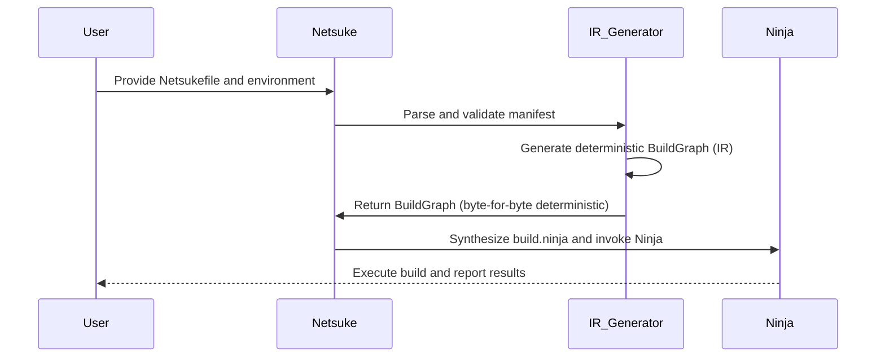
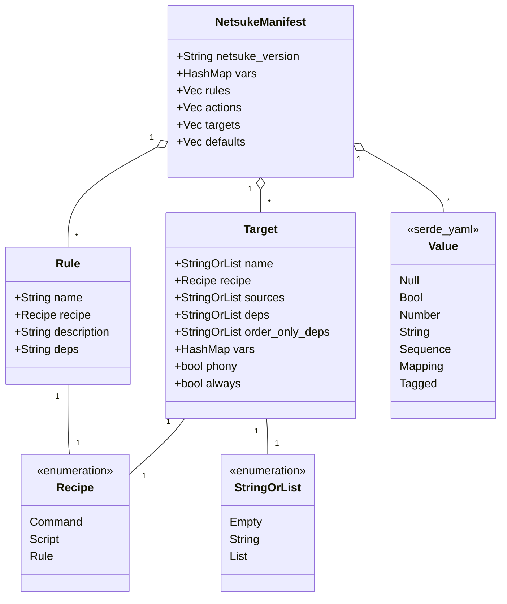

# Netsuke: A Mid-Level Design for a Modern Build System in Rust

## Section 1: Core Architecture and Data Flow

This document presents a mid-level engineering design for Netsuke, a modern
build automation tool implemented in Rust. Netsuke is designed to provide
the power and dependency resolution capabilities of traditional `make` while
offering a significantly more intuitive, readable, and secure user experience.
This is achieved by leveraging a user-friendly YAML-based manifest, a powerful
Jinja templating engine for dynamic configuration, and the high-performance
Ninja build system as its execution backend.

### 1.1 Introduction: Netsuke as a Build System Compiler

At its core, Netsuke should not be conceptualized as a direct, imperative
replacement for `make`. Instead, it is architected as a high-level **build
system compiler**. This architectural paradigm is central to its design. Ninja,
the chosen execution backend, describes itself as a low-level "assembler" for
build systems.[^1] It is intentionally constrained, lacking features like string
manipulation or conditional logic, to ensure its primary goal: running builds as
fast as possible.[^2]

This design choice by Ninja's authors necessitates the existence of a higher-
level generator tool. Netsuke fulfills this role. It provides a rich, user-
friendly language (YAML with Jinja) for describing the *what* and *why* of
a build—the project's structure, its logical rules, and its configurable
parameters. Netsuke's primary responsibility is to compile this high-level
description into a low-level, highly optimized execution plan that Ninja can
understand and execute. This separation of concerns—Netsuke managing build
logic and Ninja managing execution—is the foundational principle of the entire
architecture.

### 1.2 The Five Stages of a Netsuke Build

The process of transforming a user's `Netsukefile` manifest into a completed
build artifact follows a distinct, five-stage pipeline. This multi-stage data
flow ensures that dynamic configurations are fully resolved into a static plan
before execution, a critical requirement for compatibility with Ninja.

1. Stage 1: Manifest Ingestion

   The process begins by locating and reading the user's project manifest file
   (e.g., Netsukefile) from the filesystem into memory as a raw string.

2. Stage 2: Jinja Evaluation

   The raw manifest string is treated as a Jinja template. Netsuke's templating
   engine processes this string, evaluating all expressions, executing control
   structures (loops, conditionals), and applying filters. This stage resolves
   all dynamic aspects of the build, producing a static, pure YAML string as
   its output.

3. Stage 3: YAML Parsing & Deserialization

   The static YAML string generated in the previous stage is passed to a
   YAML parser. This parser validates the YAML syntax and deserializes the
   content into a set of strongly typed Rust data structures. This collection
   of structs, which directly mirrors the YAML schema, can be considered an
   "unprocessed" Abstract Syntax Tree (AST) of the build plan.

4. Stage 4: IR Generation & Validation

   The AST is traversed to construct a canonical, fully resolved Intermediate
   Representation (IR) of the build. This IR represents the build as a static
   dependency graph with all file paths, commands, and dependencies explicitly
   defined. During this transformation, Netsuke performs critical validation
   checks. It verifies the existence of referenced rules, ensures each rule
   has exactly one of `command` or `script`, and ensures every target specifies
   exactly one of `rule`, `command`, or `script`. Circular dependencies and
   missing inputs are also detected at this stage.

5. Stage 5: Ninja Synthesis & Execution

   The final, validated IR is traversed by a code generator. This generator
   synthesizes the content of a `build.ninja` file, translating the IR's nodes
   and edges into corresponding Ninja rule and build statements. Once the file
   is written, Netsuke invokes the `ninja` executable as a subprocess, passing
   control to it for the final dependency checking and command-execution phase.

   Netsuke's pipeline is **deterministic**. Given the same `Netsukefile` and
   environment variables, the generated `build.ninja` will be byte-for-byte
   identical. This property is essential for reproducible builds and makes the
   output suitable for caching or source control.



### 1.3 The Static Graph Mandate

The architecture's multi-stage pipeline is a direct consequence of a fundamental
design constraint imposed by the choice of Ninja as the backend. Ninja's
remarkable speed in incremental builds stems from its simplicity; it operates
on a pre-computed, static dependency graph and avoids costly runtime operations
like filesystem queries (e.g., glob expansion) or string manipulation.[^2]

At the same time, a "friendlier" build system must offer dynamic capabilities.
Users will expect to define builds that can adapt to their environment, such
as using different compiler flags on Linux versus Windows, or automatically
discovering source files in a directory. These features are provided in Netsuke
by the Jinja templating engine.

This creates a necessary architectural division. All the dynamic logic,
templating, and configuration must be fully evaluated by Netsuke *before* Ninja
is ever invoked. The point of this transition is the Intermediate Representation
(IR) generated in Stage 4. The IR serves as a static snapshot of the build
plan after all Jinja logic has been resolved. It is the "object code" that
the Netsuke "compiler" produces, which can then be handed off to the Ninja
"assembler" for execution. This mandate for a pre-computed static graph dictates
the entire five-stage pipeline and establishes a clean boundary between the
user-facing logic layer and the machine-facing execution layer.

## Section 2: The Netsuke Manifest: A User-Centric YAML Schema

The primary interface for the user is the Netsuke manifest file, `Netsukefile`.
The design of its YAML schema is paramount to achieving the goal of being
"friendlier" than `make`. The schema is guided by a set of core principles
aimed at maximizing readability, reducing cognitive overhead, and promoting
best practices.

### 2.1 Schema Design Principles

- **Readability:** The schema prioritizes human-readability. It uses clear,
  descriptive keys and a structured format to make build configurations self-
  documenting. This stands in contrast to the often-cryptic special variables
  and implicit rules of Makefiles.

- **Declarative Style:** Users should declare the desired state of their
  project—the targets they want to build and the rules to build them—rather
  than writing imperative scripts. Netsuke is responsible for determining the
  necessary steps to achieve that state.

- **Reusability:** The schema is designed to encourage the creation of reusable
  components. Variables and rules are defined once and can be referenced
  throughout the manifest, reducing duplication and improving maintainability.

- **Discoverability:** The structure is intended to be intuitive. A developer
  familiar with YAML should be able to understand the intent of a simple
  `Netsukefile` file with minimal reference to documentation.

### 2.2 Top-Level Schema Structure

A `Netsukefile` file is a YAML mapping containing a set of well-defined top-
level keys.

- `netsuke_version`: A mandatory string that specifies the version of the
  Netsuke schema the manifest conforms to (e.g., `"1.0"`). This allows for
  future evolution of the schema while maintaining backward compatibility. This
  version string should be parsed and validated using the `semver` crate.[^4]

- `vars`: A mapping of global key-value string pairs. These variables are
  available for substitution in rule commands and target definitions and are
  exposed to the Jinja templating context.

- `macros`: An optional list of Jinja macro definitions. Each item provides a
  `signature` string using standard Jinja syntax and a `body` declared with
  the YAML `|` block style. Netsuke registers these macros in the template
  environment before rendering other sections.

- `rules`: A list of rule definitions. Each rule is a reusable template for a
  command, analogous to a Ninja `rule` block.[^2]

- `targets`: The primary list of build targets. Each target defines an output,
  the sources it depends on, and the rule used to produce it. This corresponds
  to a Ninja `build` statement.[^3]

- `actions`: A secondary list of build targets. Any target placed here is
  treated as `{ phony: true, always: false }` by default.

- `defaults`: An optional list of target names to be built when Netsuke is
  invoked without any specific targets on the command line. This maps directly
  to Ninja's `default` target statement.[^3]

The class diagram below summarizes the structure of a `Netsukefile` and the
relationships between its components.



### 2.3 Defining `rules`

Each entry in the `rules` list is a mapping that defines a reusable action.

- `name`: A unique string identifier for the rule.

- `command`: A single command string to be executed. It may include the
  placeholders `{{ ins }}` and `{{ outs }}` to represent input and output files.
  Netsuke expands these placeholders to space-separated, shell-escaped lists
  of file paths before hashing the action. When generating the Ninja rule, the
  lists are replaced with Ninja's `$in` and `$out` macros. After interpolation
  the command must be parsable by [shlex](https://docs.rs/shlex/latest/shlex/).
  Any interpolation other than `ins` or `outs` is automatically shell-escaped.

- `script`: A multi-line script declared with the YAML `|` block style. The
  entire block is passed to an interpreter. If the first line begins with `#!`
  Netsuke executes the script verbatim, respecting the shebang. Otherwise, the
  block is wrapped in the interpreter specified by the optional `interpreter`
  field (defaulting to `/bin/sh -e`). For `/bin/sh` scripts, each interpolation
  is automatically passed through the `shell_escape` filter unless a `| raw`
  filter is applied. Future versions will allow configurable script languages
  with their own escaping rules. On Windows, scripts default to `powershell
  -Command` unless the manifest's `interpreter` field overrides the setting.
  Exactly one of `command` or `script` must be provided. The manifest parser
  enforces this rule to prevent invalid states.

  Internally, these options deserialize into a shared `Recipe` enum tagged with
  a `kind` field. Serde aliases ensure manifests that omit the tag continue to
  load correctly.

- `description`: An optional, user-friendly string that is printed to the
  console when the rule is executed. This maps to Ninja's `description` field
  and improves the user's visibility into the build process.[^2]

- `deps`: An optional field to configure support for C/C++-style header
  dependency generation. Its value specifies the format (e.g., `gcc` or `msvc`),
  which instructs Netsuke to generate the appropriate `depfile` or `deps`
  attribute in the corresponding Ninja rule.[^3]

### 2.4 Defining `targets`

Each entry in `targets` defines a build edge; placing a target in the optional
`actions` list instead marks it as `phony: true` with `always` left `false`.

- `name`: The primary output file or files for this build step. This can be a
  single string or a list of strings.

- `rule`: The name of the rule (from the `rules` section) to use for building
  this target. A YAML list may be supplied to run multiple rules sequentially.

```yaml
rule:
  - build
  - clean-up
```

- `command`: A single command string to run directly for this target.

- `script`: A multi-line script passed to the interpreter. When present, it is
  defined using the YAML `|` block style.

Only one of `rule`, `command`, or `script` may be specified. The parser
validates this exclusivity during deserialization. When multiple fields are
present, Netsuke emits a `RecipeConflict` error with the message "rule, command
and script are mutually exclusive".

  This union deserializes into the same `Recipe` enum used for rules. The parser
  enforces that only one variant is present, maintaining backward compatibility
  through serde aliases when `kind` is omitted.

- `sources`: The input files required by the command. This can be a single
  string or a list of strings. If any source entry matches the `name` of another
  target, that target is built first, before the current target's explicit
  `deps`.

- `deps`: An optional list of other target names. These targets are explicit
  dependencies and must be successfully built before this target can be. A
  change in any of these dependencies will trigger a rebuild of the current
  target.

- `order_only_deps`: An optional list of other target names that must be built
  before this target, but whose modification does not trigger a rebuild of this
  target. This maps directly to Ninja's order-only dependencies, specified with
  the `||` operator.[^7]

- `vars`: An optional mapping of local variables. These variables override any
  global variables defined in the top-level `vars` section for the scope of
  this target only. This provides the same functionality as Ninja's build-local
  variables.[^3]

- `macros`: An optional list of Jinja macro definitions. Each item provides a
  `signature` string using standard Jinja syntax and a `body` declared with
  the YAML `|` block style. Netsuke registers these macros in the template
  environment before rendering other sections.

- `phony`: When set to `true`, the target runs when explicitly requested even if
  a file with the same name exists. The default value is `false`.

- `always`: When set to `true`, the target runs on every invocation regardless
  of timestamps or dependencies. The default value is `false`.

### 2.5 Generated Targets with `foreach`

Large sets of similar outputs can clutter a manifest when written individually.
Netsuke supports a `foreach` entry within `targets` to generate multiple outputs
succinctly. The expression assigned to `foreach` is evaluated during the Jinja
render phase, and each value becomes `item` in the target context.

```yaml
- foreach: "{{ glob('assets/svg/*.svg') }}"
  name: "{{ outdir }}/{{ item | basename | replace('.svg', '.png') }}"
  rule: rasterise
  sources: "{{ item }}"
```

Each element in the sequence produces a separate target. The resulting build
graph is still fully static and behaves the same as if every target were
declared explicitly.

### 2.6 Table: Netsuke Manifest vs. Makefile

To illustrate the ergonomic advantages of the Netsuke schema, the following
table compares a simple C compilation project defined in both a traditional
`Makefile` and a `Netsukefile` file. The comparison highlights Netsuke's
explicit, structured, and self-documenting nature.

| Feature         | Makefile Example                                                                   | Netsukefile Example                                                                                               |
| --------------- | ---------------------------------------------------------------------------------- | ----------------------------------------------------------------------------------------------------------------- |
| Variables       | CC=gcc                                                                             | { vars: { cc: gcc } }                                                                                             |
| Macros          | define greet\\t@echo Hello $$1endef                                                | { macros: { signature: "greet(name)", body: "Hello {{ name }}" } }                                                |
| Rule Definition | %.o: %.c\\n\\t$(CC) -c $< -o $@                                                    | { rules: { name: compile, command: "{{ cc }} -c {{ ins }} -o {{ outs }}", description: "Compiling {{ outs }}" } } |
| Target Build    | my_program: main.o utils.o\\t$(CC) $^ -o $@                                        | { targets: { name: my_program, rule: link, sources: \[main.o, utils.o\] }                                         |
| Readability     | Relies on cryptic automatic variables ($@, $\<, $^) and implicit pattern matching. | Uses explicit, descriptive keys (name, rule, sources) and standard YAML list/map syntax.                          |

## Section 3: Parsing and Deserialization Strategy

Once the Jinja evaluation stage has produced a pure YAML string, the next
critical step is to parse this string and deserialize it into a structured, in-
memory representation. The choice of libraries and the definition of the target
data structures are crucial for the robustness and maintainability of Netsuke.

### 3.1 Crate Selection: `serde_yaml`

For YAML parsing and deserialization, the recommended crate is `serde_yaml`.
This choice is based on its deep and direct integration with the `serde`
framework, the de-facto standard for serialization and deserialization in the
Rust ecosystem. Using `serde_yaml` allows `serde`'s powerful derive macros
to automatically generate the deserialization logic for Rust structs. This
approach is idiomatic, highly efficient, and significantly reduces the amount
of boilerplate code that needs to be written and maintained. A simple `#`
annotation on a struct is sufficient to make it a deserialization target.

While other promising YAML libraries like `saphyr` exist, their `serde`
integration (`saphyr-serde`) is currently described as "soon-to-be" or is at
a highly experimental stage (version 0.0.0)[^11] Building a core component
of Netsuke on a nascent or unreleased library would introduce significant and
unnecessary project risk.

`serde_yaml` is mature, widely adopted, and battle-tested, making it the prudent
choice for production-quality software.

### 3.2 Core Data Structures (`ast.rs`)

The Rust structs that `serde_yaml` will deserialize into form the Abstract
Syntax Tree (AST) of the build manifest. These structs must precisely mirror the
YAML schema defined in Section 2. They will be defined in a dedicated module,
`src/ast.rs`, and annotated with `#` to enable automatic deserialization and
easy debugging.

Rust

````rust
// In src/ast.rs

use serde::Deserialize;
use std::collections::HashMap;

/// Represents the top-level structure of a Netsukefile file.
#[serde(deny_unknown_fields)]
pub struct NetsukeManifest {
    pub netsuke_version: String,

    #[serde(default)]
    pub vars: HashMap<String, serde_yaml::Value>,

    #[serde(default)]
    pub rules: Vec<Rule>,

    #[serde(default)]
    pub actions: Vec<Target>,

    pub targets: Vec<Target>,

    #[serde(default)]
    pub defaults: Vec<String>,
}

/// Represents a reusable command template.
#[serde(deny_unknown_fields)]
pub struct Rule {
    pub name: String,
    pub recipe: Recipe,
    pub description: Option<String>,
    pub deps: Option<String>,
    // Additional fields like 'pool' or 'restat' can be added here
    // to map to more advanced Ninja features.
}

/// A union of execution styles for both rules and targets.
#[serde(tag = "kind", rename_all = "lowercase")]
pub enum Recipe {
    #[serde(alias = "command")]
    Command { command: String },
    #[serde(alias = "script")]
    Script { script: String },
    #[serde(alias = "rule")]
    Rule { rule: StringOrList },
}

/// Represents a single build target or edge in the dependency graph.
#[serde(deny_unknown_fields)]
pub struct Target {
    pub name: StringOrList,
    pub recipe: Recipe,

    #[serde(default)]
    pub sources: StringOrList,

    #[serde(default)]
    pub deps: StringOrList,

    #[serde(default)]
    pub order_only_deps: StringOrList,

    #[serde(default)]
    pub vars: HashMap<String, String>,

    /// Run this target when requested even if a file with the same name exists.
    #[serde(default)]
    pub phony: bool,

    /// Run this target on every invocation regardless of timestamps.
    #[serde(default)]
    pub always: bool,
}

/// An enum to handle fields that can be either a single string or a list of strings.
#[serde(untagged)]
pub enum StringOrList {
    #[default]
    Empty,
    String(String),
    List(Vec<String>),
}
```rust

*Note: The* `StringOrList` *enum with* `#[serde(untagged)]` *provides the
flexibility for users to specify single sources, dependencies, and rule names as
a simple string and multiple as a list, enhancing user-friendliness.*

### 3.3 The Two-Pass Parsing Requirement

The integration of a templating engine like Jinja fundamentally shapes the
parsing pipeline, mandating a two-pass approach. It is impossible to parse the
user's `Netsukefile` file with `serde_yaml` in a single step.

Consider a manifest containing Jinja syntax:

YAML

```yaml
targets:
  - name: my_app
    sources: "{{ glob('src/*.c') }}"
    rule: compile
````

The value of `sources`, `{{ glob('src/*.c') }}`, is not a valid YAML string from
the perspective of a strict parser. Attempting to deserialize this directly with
`serde_yaml` would result in a parsing error.

Therefore, the process must be sequential:

1. **First Pass (Jinja Rendering):** The entire `Netsukefile` file is read as a
   raw text template. The `minijinja` engine renders this template, executing
   the `glob('src/*.c')` function and substituting its result. The output of
   this pass is a new string.

YAML

```yaml
 targets:
   - name: my_app
     sources: ["src/main.c", "src/utils.c"]
     rule: compile

```

1. **Second Pass (YAML Deserialization):** This new, rendered string, which is
   now pure and valid YAML, is then passed to `serde_yaml`. The parser can now
   successfully deserialize this text into the `NetsukeManifest` Rust struct.

This two-pass mechanism cleanly separates the concerns of templating and data
structure parsing. It allows each library to do what it does best without
interference, ensuring a robust and predictable ingestion pipeline.

## Section 4: Dynamic Builds with the Jinja Templating Engine

To provide the dynamic capabilities and logical expressiveness that make a
build system powerful and "friendly," Netsuke will integrate a Jinja templating
engine. This engine acts as the user's primary tool for scripting and
configuration within the YAML manifest.

### 4.1 Crate Selection: `minijinja`

The recommended templating engine is `minijinja`.

This crate is the ideal choice for several reasons. It is explicitly designed
as a Rust implementation of the Jinja2 template engine, aiming for close
compatibility with its syntax and behaviour.[^15] This is advantageous as Jinja2
is a mature, well-documented, and widely understood language, reducing the
learning curve for new Netsuke users. Furthermore,

`minijinja` is designed with minimal dependencies, which is beneficial for
keeping Netsuke's compile times and binary size reasonable.[^17] Its API is
well-documented and provides first-class support for adding custom functions and
filters, which is essential for extending its capabilities to suit the needs of
a build system.[^16]

Alternative template engines like Askama are less suitable for this use case.
Askama is a type-safe engine that compiles templates into Rust code at build
time.[^18] This model is incompatible with Netsuke's requirement to load and
parse user-defined manifest files at runtime.

`minijinja`, with its dynamic environment and runtime rendering, is perfectly
aligned with Netsuke's architecture.

### 4.2 The Jinja Environment and Context

Netsuke will construct a single `minijinja::Environment` instance at startup.
This environment will be configured with a set of custom functions and filters
that provide build-specific functionality.

When rendering a user's `Netsukefile` file, the initial context provided to
the template will be constructed from the `vars` section of the manifest. This
allows users to define variables in their YAML and immediately reference them
within Jinja expressions. For example:

YAML

```yaml
vars:
  compiler: gcc
  src_dir: src

targets:
  - name: "{{ compiler }}_output"
    sources: "{{ glob(src_dir ~ '/*.c') }}"
    #...
```

### 4.3 User-Defined Macros

Netsuke allows users to declare reusable Jinja macros directly in the manifest.
These are provided in a top-level `macros` list where each entry defines a
`signature` and a `body` string. The body must use YAML's `|` block syntax so
multi-line macro definitions remain readable. All macros are registered with the
template environment before any other section is rendered.

YAML

```yaml
macros:
  - signature: "greet(name)"
    body: |
      Hello {{ name }}
```

Macros can be invoked in any templated field using normal Jinja call syntax.
For example:

```yaml
rules:
  - name: hello
    command: "echo {{ greet('world') }}"
```

If a macro name matches a built-in function or filter, the macro overrides the
built-in definition. This mirrors Jinja's behaviour and follows `minijinja`
semantics where later definitions shadow earlier ones.

### 4.4 Essential Custom Functions

To transform `minijinja` from a general-purpose templating engine into a
powerful build tool, Netsuke must expose a curated set of custom functions to
the template environment. These functions will be implemented in safe Rust,
providing a secure bridge to the underlying system.

- `env(var_name: &str) -> Result<String, Error>`: A function that reads an
  environment variable from the system. This allows build configurations to be
  influenced by the external environment (e.g., `PATH`, `CC`).

- `glob(pattern: &str) -> Result<Vec<String>, Error>`: A function that performs
  file path globbing. This is a critical feature for any modern build tool,
  allowing users to easily specify sets of source files (e.g., `src/**/*.c`).
  The results are returned sorted lexicographically and symlinks are followed to
  keep builds deterministic. This function bridges a key feature gap, as Ninja
  itself does not support globbing.[^3]

- `python_version(requirement: &str) -> Result<bool, Error>`: An example of a
  domain-specific helper function that demonstrates the extensibility of this
  architecture. This function would execute `python --version` or `python3
  --version` using `std::process::Command` 19, parse the output using the

  `semver` crate 4, and compare it against a user-provided SemVer requirement
  string (e.g.,

  `">=3.8"`). This allows for conditional logic in the build based on toolchain
  versions.

### 4.5 Essential Custom Filters

In addition to functions, custom filters provide a concise, pipe-based syntax
for transforming data within templates.

- `| shell_escape`: A filter that takes a string or list and escapes it for
  safe inclusion as a single argument in a shell command. This is a non-
  negotiable security feature to prevent command injection vulnerabilities.
  The implementation will use the `shell-quote` crate for robust, shell-aware
  quoting.[^22]

- `| to_path`: A filter that converts a string into a platform-native path
  representation, handling `/` and `\` separators correctly.

- `| parent`: A filter that takes a path string and returns its parent
  directory.

### 4.6 Jinja as the "Logic Layer"

The integration of Jinja is more than a simple convenience for string
substitution. It effectively serves as the **logic layer** for the entire
build system. Traditional `make` provides powerful but often opaque functions
like `$(shell...)` and `$(wildcard...)`. Netsuke achieves and surpasses this
functionality in a much friendlier and safer way.

By implementing complex or potentially unsafe operations (like filesystem access
or command execution) as custom functions in Rust and exposing them as simple,
declarative primitives in the Jinja environment, Netsuke provides a powerful
yet controlled scripting environment. The user can write a clean, readable
template like `sources: {{ glob("src/*.c") }}`, and the complex, error-prone
logic of traversing the filesystem is handled by secure, well-tested Rust code.
This design pattern is the key to providing both power and safety, fulfilling
the core requirement of a system that is friendlier and more robust than its
predecessors.

### 4.7 Template Standard Library

Netsuke bundles a small "standard library" of Jinja helpers. These tests,
filters and functions are available to every template and give concise access to
common filesystem queries, path manipulations, collection utilities and network
operations.

#### File-system tests

| Test                                           | True when the operand…                                           |
| ---------------------------------------------- | ---------------------------------------------------------------- |
| `dir` / `file` / `symlink` / `pipe` / `device` | …is that object type                                             |
| `present`                                      | …exists (any type)                                               |
| `owned`                                        | …is owned by the current UID                                     |
| `readable` / `writable` / `executable`         | …has the corresponding permission bit for current user           |
| `empty`                                        | …has size 0 bytes                                                |
| `older_than(value)`                            | …has `mtime` < given value (seconds, `timedelta`, or file)       |
| `newer_than(value)`                            | …has `mtime` > given value                                       |
| `contains(substr)`                             | …file’s text contains **substr**                                 |
| `matches(regex)`                               | …file’s text matches **regex**                                   |
| `type(kind)`                                   | …is of the file-type string supplied (`"file"`, `"dir"`, etc.)   |

#### Path & file filters

| Filter                                     | Purpose                                                              |
| ------------------------------------------ | -------------------------------------------------------------------- |
| `basename`                                 | Return last path component                                           |
| `dirname`                                  | Return parent directory                                              |
| `with_suffix(suffix, n=1, sep='.')`        | Replace last `n` dotted suffix components (`foo.tar.gz → foo.zip`)   |
| `relative_to(root)`                        | Make path relative to **root**                                       |
| `realpath`                                 | Resolve symlinks to canonical path                                   |
| `commonpath(other)`                        | Longest common prefix with **other**                                 |
| `expanduser`                               | Expand leading `~`                                                   |
| `size`                                     | File size in bytes                                                   |
| `contents(encoding='utf-8')`               | File content as text                                                 |
| `linecount`                                | Number of text lines                                                 |
| `head(n=10)` / `tail(n=10)`                | First / last *n* lines                                               |
| `mtime` / `ctime`                          | Return timestamp (`datetime`)                                        |
| `age(unit='s')`                            | Seconds (or `m`, `h`, `d`) since `mtime`                             |
| `date(fmt='%Y-%m-%d')`                     | Format `mtime`/`ctime`                                               |
| `owner` / `group`                          | User / group name                                                    |
| `stat`                                     | Full `os.stat()` result as dict                                      |
| `hash(alg='sha256')`                       | Hex digest of file (`md5`, `sha1`, …)                                |
| `digest(n=8, alg='sha256')`                | Truncated digest (e.g. build ID)                                     |
| `base64` / `hex`                           | Encode bytes or string                                               |
| `slugify`                                  | Make filename-safe slug                                              |
| `snake_case` / `camel_case` / `kebab-case` | Rename helpers                                                       |

All built-in filters use `snake_case`. The `camel_case` helper is provided in
place of `camelCase` so naming remains consistent with `snake_case` and `kebab-
case`.

#### Generic collection filters

| Filter                            | Purpose                                      |
| --------------------------------- | -------------------------------------------- |
| `uniq`                            | De-duplicate list (preserve order)           |
| `flatten`                         | One-level flatten of nested lists            |
| `group_by(attr)`                  | Dict keyed on `attr` of list items           |
| `zip(other)`                      | Pairwise tuples of two lists                 |
| `version_compare(other, op='>=')` | SemVer comparison (`'<'`, `'<=', '==', …`)   |

#### Network & command functions / filters

| Name                                                  | Kind         | Purpose                                                          |
| ----------------------------------------------------- | ------------ | ---------------------------------------------------------------- |
| `fetch(url, cache=False, cache_dir='.netsuke/fetch')` | **function** | Retrieve URL, return content (str/bytes)                         |
| `http_head(url)`                                      | function     | Return headers dict                                              |
| `download(url, dest)`                                 | function     | Idempotent file download (returns **dest**)                      |
| `shell(cmd)`                                          | **filter**   | Pipe value to arbitrary shell command; marks template **impure** |
| `grep`, `sed`, `awk`, `cut`, `wc`, `tr`               | filters      | Canonical wrappers implemented via `shell()` for convenience     |

Using `shell()` marks the template as *impure* and disables caching of the
rendered YAML between Stage&nbsp;2 and Stage&nbsp;3. This avoids accidental
reuse of results that depend on external commands.

Custom external commands can be registered as additional filters. Those should
be marked `pure` if safe for caching or `impure` otherwise.

#### Time helpers

| Name                  | Kind     | Purpose                                   |
| --------------------- | -------- | ----------------------------------------- |
| `now()`               | function | Current `datetime` (UTC by default)       |
| `timedelta(**kwargs)` | function | Convenience creator for `age` comparisons |

##### Example usage

```jinja

  {{ "config.yaml" | contents | grep("version") }}


{{ "src/app.c" | basename | with_suffix(".o") }}
{{ fetch('https://example.com/data.csv', cache=True) | head(5) }}
```

## Section 5: The Bridge to Ninja: Intermediate Representation and Code Generation

After the user's manifest has been fully rendered by Jinja and deserialized
into the AST, the next phase is to transform this high-level representation into
a format suitable for the Ninja backend. This is accomplished via a two-step
process: converting the AST into a canonical Intermediate Representation (IR),
and then synthesizing the final `build.ninja` file from that IR.

### 5.1 The Role of the Intermediate Representation (IR)

The Intermediate Representation is a critical architectural component that
serves as the static, fully resolved, and validated representation of the entire
build graph. It is the bridge between the user-facing front-end (the YAML schema
and its corresponding AST) and the machine-facing back-end (the Ninja file
format).

The primary purpose of the IR is to create a decoupling layer. This abstraction
barrier allows the front-end and back-end to evolve independently. For example,
the YAML schema could be significantly redesigned in a future version of
Netsuke, but as long as the transformation logic is updated to produce the same
stable IR, the Ninja generation back-end would require no changes. Conversely,
if the decision were made to support an alternative execution back-end (e.g.,
a distributed build system), only a new generator module (`IR -> NewBackend`)
would need to be written, leaving the entire front-end parsing and validation
logic untouched.

Importantly, the IR contains **no Ninja-isms**. Placeholders such as `$in`
and `$out` are resolved to plain lists of file paths, and command strings are
expanded before hashing. This deliberate absence of Ninja-specific syntax makes
the IR a stable contract that future back-ends—distributed builders, remote
executors, or otherwise—can consume without modification.

Furthermore, the IR is the ideal stage at which to perform graph-level analysis
and optimizations, such as detecting circular dependencies, pruning unused build
targets, or identifying duplicate build actions.

### 5.2 IR Data Structures (`ir.rs`)

The IR data structures are designed to closely mirror the conceptual model of
the Ninja build system, which consists of "Action" nodes (commands) and "Target"
nodes (files).[^7] This close mapping simplifies the final code generation step.

Rust

```rust
// In src/ir.rs

use std::collections::HashMap;
use std::path::{Path, PathBuf};

/// The complete, static build graph.
pub struct BuildGraph {
    /// A map of all unique actions (rules) in the build.
    /// The key is a hash of the action's properties to enable deduplication.
    pub actions: HashMap<String, Action>,

    /// A map of all target files to be built. The key is the output path.
    pub targets: HashMap<PathBuf, BuildEdge>,

    /// A list of targets to build by default.
    pub default_targets: Vec<PathBuf>,
}

/// Represents a reusable command, analogous to a Ninja 'rule'.
pub struct Action {
    pub recipe: Recipe,
    pub description: Option<String>,
    pub depfile: Option<String>, // Template for the.d file path, e.g., "$out.d"
    pub deps_format: Option<String>, // "gcc" or "msvc"
    pub pool: Option<String>,
    pub restat: bool,
}

/// Represents a single build statement, analogous to a Ninja 'build' edge.
/// It connects a set of inputs to a set of outputs via an Action. The `phony`
/// and `always` flags control execution when outputs already exist or when
/// timestamps would normally skip the step.
pub struct BuildEdge {
    /// The unique identifier of the Action used for this edge.
    pub action_id: String,

    /// Explicit inputs that, when changed, trigger a rebuild.
    pub inputs: Vec<PathBuf>,

    /// Outputs explicitly generated by the command.
    pub explicit_outputs: Vec<PathBuf>,

    /// Outputs implicitly generated by the command. Maps to Ninja's '|' syntax.
    pub implicit_outputs: Vec<PathBuf>,

    /// Dependencies that must be built first but do not trigger a rebuild on change.
    /// Maps to Ninja's '||' syntax.
    pub order_only_deps: Vec<PathBuf>,

    /// Run this edge when requested even if the output file already exists.
    pub phony: bool,

    /// Run this edge on every invocation regardless of timestamps.
    pub always: bool,
}
```

### 5.3 The Transformation Process: AST to IR

The core logic of the validation stage is a function, `ir::from_manifest`, that
consumes a `NetsukeManifest` (the AST) and produces a `BuildGraph` (the IR).
This transformation involves several steps:

1. **Action Consolidation:** Iterate through the `manifest.rules` from the AST.
   For each rule, create a corresponding `ir::Action` struct. These actions
   are stored in the `BuildGraph`'s `actions` map, keyed by a hash of their
   fully resolved command text, interpreter, local variables, and depfile
   options. This ensures deduplication only occurs when two actions are truly
   interchangeable.

2. **Target Expansion:** Iterate through the `manifest.targets` and the optional
   `manifest.actions`. Entries in `actions` are treated identically to targets
   but with `phony` defaulting to `true`. For each item, resolve all strings
   into `PathBuf`s and resolve all dependency names against other targets.

3. **Edge Creation:** For each AST target, create an `ir::BuildEdge` object.
   This involves linking it to the appropriate `ir::Action` (by its ID),
   transferring the `phony` and `always` flags, and populating its input and
   output vectors.

4. **Graph Validation:** As the graph is constructed, perform validation checks.
   This includes ensuring that every rule referenced by a target exists in
   the `actions` map and running a cycle detection algorithm (e.g., a depth-
   first search maintaining a visitation state) on the dependency graph to fail
   compilation if a circular dependency is found.

### 5.4 Ninja File Synthesis (`ninja_gen.rs`)

The final step is to synthesize the `build.ninja` file from the `BuildGraph`
IR. This process is a straightforward, mechanical translation from the IR data
structures to the Ninja file syntax.

1. **Write Variables:** Any global variables that need to be passed to Ninja can
   be written at the top of the file (e.g., `msvc_deps_prefix` for Windows
2. **Write Rules:** Iterate through the `graph.actions` map. For each
   `ir::Action`, write a corresponding Ninja `rule` statement. The input and
   output lists stored in the action replace the `ins` and `outs` placeholders.
   These lists are then rewritten as Ninja's `$in` and `$out`.

   When an action's `recipe` is a script, the generated rule wraps the script
   in an invocation of `/bin/sh -e -c` so that multi-line scripts execute
   consistently across platforms.

   Code snippet

   ````ninja
   # Generated from an ir::Action
   rule cc command = gcc -c -o $out $in description = CC $out depfile = $out.d
   deps = gcc

   ```ninja

   ````

3. **Write Build Edges:** Iterate through the `graph.targets` map. For each
   `ir::BuildEdge`, write a corresponding Ninja `build` statement. This involves
   formatting the lists of explicit outputs, implicit outputs, inputs, and
   order-only dependencies using the correct Ninja syntax (`:`, `|`, and `||
   `).[^7] Use Ninja's built-in `phony` rule when `phony` is `true`. For an
   `always` edge, either generate a `phony` build with no outputs or emit a
   dummy output marked `restat = 1` and depend on a permanently dirty target so
   the command runs on each invocation.

   Code snippet

   ```ninja
   # Generated from an ir::BuildEdge
   build foo.o: cc foo.c build bar.o: cc bar.c build my_app: link foo.o bar.o |

   ```

| lib_dependency.a |

4\. **Write Defaults:** Finally, write the `default` statement, listing all
paths from `graph.default_targets`.ninja

default my_app

\`\`\`

## Section 6: Process Management and Secure Execution

The final stage of a Netsuke build involves executing commands. While Netsuke
delegates the core task scheduling and execution to the Ninja binary, it remains
responsible for invoking Ninja correctly and, most importantly, for ensuring
that the commands it generates for Ninja to run are constructed securely.

### 6.1 Invoking Ninja

Netsuke will use Rust's standard library `std::process::Command` API to
configure and spawn the `ninja` process.19 This provides fine-grained control
over the child process's execution environment.

The command construction will follow this pattern:

1. A new `Command` is created via `Command::new("ninja")`. Netsuke will assume
   `ninja` is available in the system's `PATH`.

2. Arguments passed to Netsuke's own CLI will be translated and forwarded to
   Ninja. For example, a `Netsuke build -C build/ my_target` command would
   result in `Command::new("ninja").arg("-C").arg("build/").arg("my_target")`.
   Flags like `-j` for parallelism will also be passed through.[^8]

3. The working directory for the Ninja process will be set using
   `.current_dir()` if the user provides a `-C` flag.

4. Standard I/O streams (`stdin`, `stdout`, `stderr`) will be configured using
   `.stdout(Stdio::piped())` and `.stderr(Stdio::piped())`.[^24] This allows
   Netsuke to capture the real-time output from Ninja, which can then be
   streamed to the user's console, potentially with additional formatting or
   status updates from Netsuke itself.

### 6.2 The Criticality of Shell Escaping

A primary security responsibility for Netsuke is the prevention of command
injection attacks. The `command` strings defined in a user's `Netsukefile`
are templates. When Netsuke substitutes variables like file paths into these
templates, it is imperative that these substituted values are treated as
single, literal arguments by the shell that Ninja ultimately uses to execute
the command.

Without proper escaping, a malicious or even accidental filename like `"my file;
rm -rf /;.c"` could be interpreted as multiple commands, leading to catastrophic
consequences.

For this critical task, the recommended crate is `shell-quote`.

While other crates like `shlex` exist, `shell-quote` offers a more robust and
flexible API specifically designed for this purpose.[^22] It supports quoting
for multiple shell flavors (e.g., Bash, sh, Fish), which is vital for a cross-
platform build tool. It also correctly handles a wide variety of input types,
including byte strings and OS-native strings, which is essential for dealing
with non-UTF8 file paths. The

`QuoteExt` trait provided by the crate offers an ergonomic and safe method
for building command strings by pushing quoted components into a buffer:
`script.push_quoted(Bash, "foo bar")`.

### 6.3 Implementation Strategy

The command generation logic within the `ninja_gen.rs` module must not use
simple string formatting (like `format!`) to construct the final command strings
Instead, parse the Netsuke command template (e.g., `{{ cc }} -c {{ ins }} -o`
`{{ outs }}`) and build the final command string step by step. The placeholders
`{{ ins }}` and `{{ outs }}` are expanded to space-separated lists of file paths
within Netsuke itself, each path being shell-escaped using the `shell- quote`
API. When the command is written to `build.ninja`, these lists replace Ninja's
`$in` and `$out` macros. After substitution, the command is validated with
[`shlex`] (<https://docs.rs/shlex/latest/shlex/>) to ensure it parses correctly.
This approach guarantees that every dynamic part of the command is securely
quoted.

### 6.4 Automatic Security as a "Friendliness" Feature

The concept of being "friendlier" than `make` extends beyond syntactic sugar
to encompass safety and reliability. A tool that is easy to use but exposes the
user to trivial security vulnerabilities is fundamentally unfriendly. In many
build systems, the burden of correct shell quoting falls on the user, an error-
prone task that requires specialized knowledge.

Netsuke's design elevates security to a core feature by making it automatic and
transparent. The user writes a simple, unquoted command template, and Netsuke
performs the complex and critical task of making it secure behind the scenes. By
integrating `shell-quote` directly into the Ninja file synthesis stage, Netsuke
protects users from a common and dangerous class of errors by default. This
approach embodies a deeper form of user-friendliness: one that anticipates and
mitigates risks on the user's behalf.

## Section 7: A Framework for Friendly and Actionable Error Reporting

A key differentiator for a "friendly" tool is how it communicates failure.
Cryptic, unhelpful error messages are a major source of frustration for
developers. Netsuke's error handling framework is designed to provide messages
that are clear, contextual, and actionable.

### 7.1 Error Handling Philosophy

Errors are not exceptional events; they are an expected part of the development
workflow. Every error reported by Netsuke to the user must strive to answer
three fundamental questions:

1. **What** went wrong? A concise summary of the failure (e.g., "YAML parsing
   failed," "Build configuration is invalid").

2. **Where** did it go wrong? Precise location information, including the file,
   line number, and column where applicable (e.g., "in `Netsukefile` at line 15,
   column 3").

3. **Why** did it go wrong, and what can be done about it? The underlying cause
   of the error and a concrete suggestion for how to fix it (e.g., "Cause:
   Found a tab character, which is not allowed. Hint: Use spaces for indentation
   instead.").

### 7.2 Crate Selection and Strategy: `anyhow` and `thiserror`

To implement this philosophy, Netsuke will adopt a hybrid error handling
strategy using the `anyhow` and `thiserror` crates. This is a common and highly
effective pattern in the Rust ecosystem for creating robust applications and
libraries.[^27]

- `thiserror`: This crate will be used *within* Netsuke's internal library
  modules (e.g., `parser`, `ir`, `ninja_gen`) to define specific, structured
  error types. The `#[derive(Error)]` macro reduces boilerplate and allows for
  the creation of rich, semantic errors.[^29]

  Rust

  ```rust // In src/ir.rs use thiserror::Error; use std::path::PathBuf;

  #
  pub enum IrGenError {
      #
      RuleNotFound { target_name: String, rule_name: String, },

      #[error("A circular dependency was detected involving target '{path}'.")]
      CircularDependency { path: PathBuf, },

      #
      DependencyNotFound { target_name: String, dependency_name: String, }, }

  ```

- `anyhow`: This crate will be used in the main application logic (`main.rs`)
  and at the boundaries between modules. `anyhow::Result` serves as a
  convenient, dynamic error type that can wrap any underlying error that
  implements `std::error::Error`.[^30] The primary tools used will be the

  `?` operator for clean error propagation and the `.context()` and
  `.with_context()` methods for adding high-level, human-readable context to
  errors as they bubble up the call stack.[^31]

### 7.3 Error Handling Flow

The flow of an error from its origin to the user follows a clear path of
enrichment:

1. A specific, low-level error occurs within a module. For instance, the IR
   generator detects a missing rule and creates an `IrGenError::RuleNotFound`.

2. The function where the error occurred returns
   `Err(IrGenError::RuleNotFound {... }.into())`. The `.into()` call converts
   the specific `thiserror` enum variant into a generic `anyhow::Error` object,
   preserving the original error as its source.

3. A higher-level function in the call stack, which called the failing function,
   receives this `Err` value. It uses the `.with_context()` method to
   wrap the error with more application-level context. For example:
   `ir::from_manifest(ast)` `.with_context(|| "Failed to build the internal
   build graph from the manifest")?`.

4. This process of propagation and contextualization repeats as the error
   bubbles up towards `main`.

5. Finally, the `main` function receives the `Err` result. It prints the entire
   error chain provided by `anyhow`, which displays the highest-level context
   first, followed by a list of underlying "Caused by:" messages. This provides
   the user with a rich, layered explanation of the failure, from the general to
   the specific.

For automation use cases, Netsuke will support a `--diag-json` flag. When
enabled, the entire error chain is serialized to JSON, allowing editors and CI
tools to annotate failures inline.

### 7.4 Table: Transforming Errors into User-Friendly Messages

This table provides a specification for the desired output of Netsuke's error
reporting system, contrasting raw, unhelpful messages with the friendly,
actionable output that the implementation should produce.

| Error Type | Poor Message (Default)                                                               | Netsuke's Friendly Message (Goal)                                                                                                                                               |
| ---------- | ------------------------------------------------------------------------------------ | ------------------------------------------------------------------------------------------------------------------------------------------------------------------------------- |
| YAML Parse | (line 15, column 3): Found a tab character where indentation is expected             | Error: Failed to parse 'Netsukefile'. Caused by: Found a tab character. Hint: Use spaces for indentation instead of tabs.                                                       |
| Validation | thread 'main' panicked at 'Rule not found'                                           | Error: Build configuration is invalid. Caused by: Target 'my_program' uses a rule named 'link-program' which is not defined in the 'rules' section.                             |
| Execution  | ninja: error: 'main.o', needed by 'my_program', missing and no known rule to make it | Error: Build failed during execution. Caused by: Ninja could not build target 'my_program' because its dependency 'main.o' is missing. Hint: Ensure a target produces 'main.o'. |

## Section 8: Command-Line Interface (CLI) Design

The command-line interface is the user's entry point to Netsuke. A well-designed
CLI is essential for a good user experience. It should be intuitive, self-
documenting, and consistent with the conventions of modern command-line tools.

### 8.1 Crate Selection: `clap`

The CLI for Netsuke will be built using the `clap` (Command Line Argument
Parser) crate, specifically leveraging its `derive` feature. `clap` is the de-
facto standard for building rich, professional CLIs in Rust. It automatically
generates parsing logic, help messages, version information, and shell
completions from simple struct definitions. Its integration with error handling
frameworks like `anyhow` is seamless, making it the ideal choice.[^32]

### 8.2 CLI Structure and Commands

The CLI's structure will be defined using a set of structs annotated with
`clap`'s derive macros. This provides a single, clear source of truth for the
entire CLI specification.

Rust

```rust
// In src/main.rs

use clap::{Parser, Subcommand};
use std::path::PathBuf;

/// A modern, friendly build system that uses YAML and Jinja, powered by Ninja.
#[command(author, version, about, long_about = None)]
struct Cli {
    /// Path to the Netsuke manifest file to use.
    #[arg(short, long, value_name = "FILE", default_value = "Netsukefile")]
    file: PathBuf,

    /// Change to this directory before doing anything.
    directory: Option<PathBuf>,

    /// Set the number of parallel build jobs.
    #[arg(short, long, value_name = "N")]
    jobs: Option<usize>,

    #[command(subcommand)]
    command: Option<Commands>,
}

enum Commands {
    /// Build specified targets (or default targets if none are given) [default].
    Build {
        /// A list of specific targets to build.
        targets: Vec<String>,
    },

    /// Remove build artifacts and intermediate files.
    Clean {},

    /// Display the build dependency graph in DOT format for visualization.
    Graph {},
}
```

*Note: The* `Build` *command is wrapped in an* `Option<Commands>` *and will be
treated as the default subcommand if none is provided, allowing for the common*
`Netsuke [targets...]` *invocation.*

### 8.3 Command Behaviour

The behaviour of each subcommand is clearly defined:

- `Netsuke build [targets...]`: This is the primary and default command. It
  executes the full five-stage pipeline: ingestion, Jinja rendering, YAML
  parsing, IR generation, and Ninja synthesis. It then invokes `ninja` to build
  the list of specified `targets`. If no targets are provided on the command
  line, it will build the targets listed in the `defaults` section of the
  manifest.

- `Netsuke clean`: This command provides a convenient way to clean the build
  directory. It will invoke the Ninja backend with the appropriate flags, such
  as `ninja -t clean`, to remove the outputs of the build rules.

- `Netsuke graph`: This command is an introspection and debugging tool. It will
  run the Netsuke pipeline up to Stage 4 (IR Generation) and then invoke
  Ninja with the graph tool, `ninja -t graph`. This outputs the complete build
  dependency graph in the DOT language. The result can be piped through `dot
  -Tsvg` or displayed via `netsuke graph --html` using an embedded Dagre.js
  viewer. Visualising the graph is invaluable for understanding and debugging
  complex projects.

### 8.4 Design Decisions

The CLI is implemented using clap's derive API in `src/cli.rs`. The `Build`
subcommand is optional so that invoking `netsuke` without a subcommand defaults
to building the manifest's default targets. The working directory flag uses
`-C` to mirror Ninja's convention, ensuring command line arguments map directly
onto the underlying build tool. Error scenarios are validated using clap's
`ErrorKind` enumeration in unit tests and via Cucumber steps for behavioural
coverage.

## Section 9: Implementation Roadmap and Strategic Recommendations

This final section outlines a strategic plan for implementing Netsuke, along
with a summary of key technological choices and potential avenues for future
development. This roadmap is designed to manage complexity, mitigate risk, and
ensure that a functional and robust tool is delivered efficiently.

### 9.1 Phased Implementation Plan

A phased implementation approach is recommended to tackle the project in
manageable stages. Each phase builds upon the last and has a clear, verifiable
goal.

- **Phase 1: The Static Core**

  - **Objective:** To create a minimal, working build compiler for static
    manifests.

  - **Tasks:**

    1. Implement the initial `clap` CLI structure for the `build` command.

    2. Implement the YAML parser using `serde_yaml` and the AST data structures
       (`ast.rs`).

    3. Implement the AST-to-IR transformation logic, including basic validation
       like checking for rule existence.

    4. Implement the IR-to-Ninja file generator (`ninja_gen.rs`).

    5. Implement the `std::process::Command` logic to invoke `ninja`.

  - **Success Criterion:** Netsuke can successfully take a `Netsukefile` file
    *without any Jinja syntax* and compile it to a `build.ninja` file, then
    execute it to produce the correct artifacts. This phase validates the entire
    static compilation pipeline.

- **Phase 2: The Dynamic Engine**

  - **Objective:** To integrate the templating engine and support dynamic
    manifests.

  - **Tasks:**

    1. Integrate the `minijinja` crate into the build pipeline.

    2. Implement the two-pass parsing mechanism: first render the manifest with
       `minijinja`, then parse the result with `serde_yaml`.

    3. Populate the initial Jinja context with the global `vars` from the
       manifest.

    4. Implement basic Jinja control flow (``, ``) and
       variable substitution.

  - **Success Criterion:** Netsuke can successfully build a manifest that uses
    variables and conditional logic (e.g., different compiler flags based on
    a variable).

- **Phase 3: The "Friendly" Polish**

  - **Objective:** To implement the advanced features that deliver a superior
    user experience.

  - **Tasks:**

    1. Implement the full suite of custom Jinja functions (`glob`, `env`, etc.)
       and filters (`shell_escape`).

    2. Mandate the use of `shell-quote` for all command variable substitutions.

    3. Refactor the error handling to fully adopt the `anyhow`/`thiserror`
       strategy, ensuring all user-facing errors are contextual and actionable
       as specified in Section 7.

    4. Implement the `clean` and `graph` subcommands.

    5. Refine the CLI output for clarity and readability.

  - **Success Criterion:** Netsuke is a feature-complete, secure, and
    user-friendly build tool that meets all the initial design goals.

### 9.2 Key Technology Summary

This table serves as a quick-reference guide to the core third-party crates
selected for this project and the rationale for their inclusion.

| Component      | Recommended Crate  | Rationale                                                                                                               |
| -------------- | ------------------ | ----------------------------------------------------------------------------------------------------------------------- |
| CLI Parsing    | clap               | The Rust standard for powerful, derive-based CLI development.                                                           |
| YAML Parsing   | serde_yaml         | Mature, stable, and provides seamless integration with the serde framework.                                             |
| Templating     | minijinja          | High compatibility with Jinja2, minimal dependencies, and supports runtime template loading.                            |
| Shell Quoting  | shell-quote        | A critical security component; provides robust, shell-specific escaping for command arguments.                          |
| Error Handling | anyhow + thiserror | An idiomatic and powerful combination for creating rich, contextual, and user-friendly error reports.                   |
| Versioning     | semver             | The standard library for parsing and evaluating Semantic Versioning strings, essential for the `netsuke_version` field. |

### 9.3 Future Enhancements

The architecture described in this document provides a solid foundation for a
powerful build tool. The use of a decoupled IR, in particular, opens up many
possibilities for future enhancements beyond the initial scope.

- **Advanced Caching:** While Ninja provides excellent file-based incremental
  build caching, Netsuke could implement a higher-level artifact caching
  layer. This could involve caching build outputs in a shared network location
  (e.g., S3) or a local content-addressed store, allowing for cache hits across
  different machines or clean checkouts.

- **Plugin Architecture:** A system could be designed to allow users to load
  custom Jinja functions and filters from external Rust crates at runtime. This
  would enable the community to extend Netsuke's capabilities without requiring
  changes to the core application.

- **Language-Specific Toolchains:** Netsuke could offer pre-packaged "toolchain"
  modules. For example, a `Netsuke-rust-toolchain` could provide a standard
  set of rules and variables for compiling Rust projects, abstracting away the
  details of invoking `cargo`.

- **Distributed Builds:** The IR is backend-agnostic. A future version of
  Netsuke could include an alternative generator that targets a distributed
  build system, allowing for massively parallel builds across a cluster of
  machines. The user's `Netsukefile` manifest would remain unchanged.

## Section 10: Example Manifests

The repository includes several complete Netsuke manifests in the `examples/
` directory. They demonstrate how the YAML schema can be applied to real-world
projects.

- [`basic_c.yml`](../examples/basic_c.yml): a minimal C project compiling two
  object files and linking them into a small application.
- [`photo_edit.yml`](../examples/photo_edit.yml): converts RAW photographs and
  generates a simple HTML gallery for previewing the results.
- [`visual_design.yml`](../examples/visual_design.yml): rasterises a set of SVG
  design assets into PNG images using Inkscape.
- [`website.yml`](../examples/website.yml): builds a static web site from
  Markdown pages with Pandoc and assembles an index page.
- [`writing.yml`](../examples/writing.yml): produces a multi-chapter PDF book
  by combining chapters rendered from Markdown via LaTeX.

### **Works cited**

[^1]: Ninja, a small build system with a focus on speed, accessed on July 12,
2025, <https://ninja-build.org/>

[^2]: Ninja (build system) - Wikipedia, accessed on July 12, 2025, <https://
en.wikipedia.org/wiki/Ninja%5C_(build_system)>

[^3]: A Complete Guide To The Ninja Build System - Spectra - Mathpix, accessed
on July 12, 2025, <<<https://spectra.mathpix.com/article/2024.01.00364/a->
complete-> guide-to-the-ninja-build-system>

[^4]: semver - Rust, accessed on July 12, 2025, <<https://creative-coding-the->
hard-way.github.io/Agents/semver/index.html>

Versioning - GitHub, accessed on July 12, 2025, <<<https://github.com/dtolnay/>
> semver>

<https://docs.rs/semver/latest/semver/>

[^7]: How Ninja works - Fuchsia, accessed on July 12, 2025, <https://
fuchsia.dev/fuchsia-src/development/build/ninja_how>

[^8]: The Ninja build system, accessed on July 12, 2025, <<https://ninja->
build.org/manual.html>

<https://groups.google.com/g/ninja-build/c/34ebqOUxnXg>

[^11]: Saphyr libraries - [crates.io](http://crates.io): Rust Package Registry,
accessed on July 12, 2025, <https://crates.io/crates/saphyr>

accessed on July 12, 2025, <https://github.com/saphyr-rs/saphyr>

accessed on July 12, 2025, <https://crates.io/crates/saphyr-serde>

<https://docs.rs/saphyr>

[^15]: minijinja - [crates.io](http://crates.io): Rust Package Registry,
accessed on July 12, 2025, <https://crates.io/crates/minijinja>

[^16]: minijinja - Rust - [Docs.rs](http://Docs.rs), accessed on July 12, 2025,
<https://docs.rs/minijinja/>

[^17]: minijinja - Rust, accessed on July 12, 2025, <<https://
wasmerio.github.io/> wasmer-pack/api-docs/minijinja/index.html>

[^18]: Template engine — list of Rust libraries/crates // [Lib.rs](http://
Lib.rs), accessed on July 12, 2025, <https://lib.rs/template-engine>

web.mit.edu/rust-lang_v1.25/arch/amd64_ubuntu1404/share/doc/rust/html/std/
process/struct.Command.html>

<https://syncromsp.com/blog/how-to-check-python-version/>

<https://4geeks.com/how-to/how-to-check-python-version>

[^22]: shell_quote - Rust - [Docs.rs](http://Docs.rs), accessed on July 12,
2025, <https://docs.rs/shell-quote/latest/shell_quote/>

web.mit.edu/rust-lang_v1.25/arch/amd64_ubuntu1404/share/doc/rust/html/std/
process/index.html>

[^24]: std::process - Rust, accessed on July 12, 2025, <<https://doc.rust->
lang.org/std/process/index.html>

doc.rust-lang.org/std/process/struct.Command.html>

<https://docs.rs/shlex/latest/shlex/>

[^27]: Rust Error Handling Compared: anyhow vs thiserror vs snafu, accessed on
July 12, 2025, <<<https://dev.to/leapcell/rust-error-handling-compared-anyhow->
vs-> thiserror-vs-snafu-2003>

and Advanced Techniques - Technorely, accessed on July 12, 2025, <https://
technorely.com/insights/effective-error-handling-in-rust-cli-apps-best-
practices-examples-and-advanced-techniques>

[^29]: Practical guide to Error Handling in Rust - Dev State, accessed on July
12, 2025, <https://dev-state.com/posts/error_handling/>

[^30]: thiserror and anyhow - Comprehensive Rust, accessed on July 12, 2025,
<https://comprehensive-rust.mo8it.com/error-handling/thiserror-and-anyhow.html>

[^31]: Simple error handling for precondition/argument checking in Rust

- Stack Overflow, accessed on July 12, 2025, <<https://stackoverflow.com/>
questions/78217448/simple-error-handling-for-precondition-argument-checking-
in-rust>

[^32]: Nicer error reporting - Command Line Applications in Rust, accessed on
July 12, 2025, <https://rust-cli.github.io/book/tutorial/errors.html>
