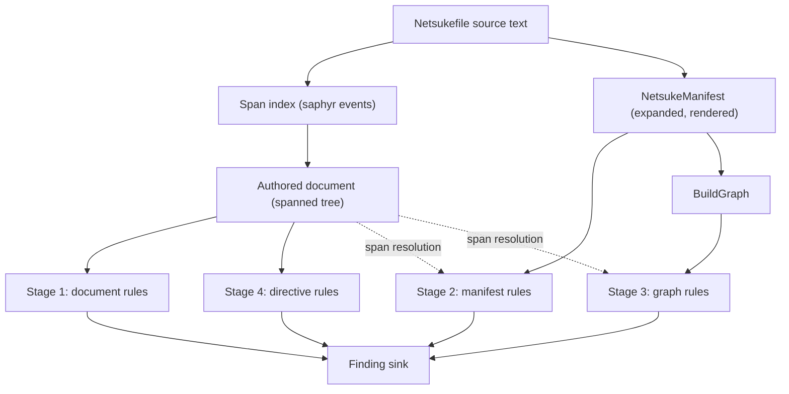

# Netsuke manifest linter design

## Front matter

- **Status:** living. The v0.4.0 linter is a prototype: it is implemented and
  shipped behind `netsuke check`, but its rule set, default severities, and
  most of the contracts below are expected to change once the rules have been
  used against manifests their authors did not write. Roadmap phase 7 owns that
  feedback loop and the freeze that ends it. Rule identifiers are the
  exception: they are permanent from v0.4.0. Update this document as the phase
  progresses rather than treating it as a record of what was once decided.
- **Scope:** the manifest linter — its rule model, compiler-stage hooks, rule
  identifiers, suppression contract, policy configuration, and output schemas.
- **Primary audience:** Netsuke contributors adding or changing lint rules, and
  operators wiring `netsuke check` into `make`, continuous integration (CI),
  editors, and agents.
- **Documents that take precedence:**
  - [ADR-018](adr-018-manifest-linting-under-netsuke-check.md) owns the command
    placement, the findings-as-data output contract, and the sequencing that
    keeps rule prose in the registry for the prototype period.
  - [ADR-003](adr-003-agent-consistent-human-first-cli.md) owns the command-line
    interface (CLI) doctrine this design conforms to.
  - [ADR-014](adr-014-backend-text-escaping-seam.md) owns the Ninja escaping
    boundary that the migration rules police.
  - [users' guide](users-guide.md) is the source of truth for manifest syntax;
    this document never restates it normatively.
  - [linter rule reference](netsuke-linter-rules.md) is the source of truth for
    each shipped rule's identifier, category, default severity, and remediation.

## 1. Problem and product thesis

A `Netsukefile` is executable build configuration. Most of what makes one bad
is not a syntax error: it parses, it lowers to a valid graph, and it produces a
`build.ninja` that Ninja accepts. It then rebuilds the world on every
invocation, breaks on a machine whose `/bin/sh` is not `bash`, silently mangles
a shell variable the author meant to keep, or races because a target consumes
another target's output without declaring the edge.

Netsuke already rejects the manifests it can prove wrong. `IrGenError` covers
unknown rules, duplicate outputs, and cycles; `NinjaGenError` covers reserved
paths, unsupported characters, and unanalysable command lists. Everything
between "parses" and "provably wrong" is currently unpoliced, and that band is
where the expensive mistakes live.

The thesis is that a build-system compiler is the right place to host this
analysis, because it already has the artefacts a build-file linter would
otherwise have to reconstruct: an expanded manifest, a resolved recipe per
target, and a static dependency graph. A standalone YAML style checker cannot
tell an order-only directory dependency from a content dependency, cannot see
that a literal path in a recipe is another target's output, and cannot know that
`$$PATH` used to be the correct workaround and no longer is.

The linter is therefore a semantic analysis over Netsuke's own compiler stages,
not a text pass over YAML.

### 1.1 Prior art surveyed

Table: build-file linters surveyed, and what each contributed to this design

| Tool            | Shape                                                                   | What it contributed                                                                                                                                                                                                                                                                                                                |
| --------------- | ----------------------------------------------------------------------- | ---------------------------------------------------------------------------------------------------------------------------------------------------------------------------------------------------------------------------------------------------------------------------------------------------------------------------------- |
| `mbake`         | Makefile formatter plus a `validate` step that shells out to GNU `make` | Confirms the split this design makes explicit: `mbake`'s own rules are formatting rules (spacing, `.PHONY` placement, line continuations) and its only semantic check is delegating to the real parser. Its per-rule Boolean configuration file and its GNU error format influenced the policy table and the compact human output. |
| `checkmake`     | Makefile linter with named rules                                        | `minphony`, `phonydeclared`, and `timestampexpanded` are semantic rules over a parsed Makefile. Named rules over an already-parsed model is the model adopted here.                                                                                                                                                                |
| `hadolint`      | Dockerfile linter                                                       | Stable identifiers, per-rule severity, `--failure-threshold`, and inline `# hadolint ignore=<code>` suppression that names the rule. The failure-threshold concept is adopted as `--fail-on`.                                                                                                                                      |
| `buildifier`    | Bazel linter                                                            | `# buildifier: disable=<rule-name>` suppression scoped to the following statement, and self-describing kebab-case rule names rather than opaque codes. Both are adopted.                                                                                                                                                           |
| ShellCheck      | Shell linter                                                            | Directive comments carrying a rule identifier, and a per-rule documentation page reachable from every diagnostic. The `url` field on each finding serves the same purpose.                                                                                                                                                         |
| Clippy and Ruff | Rust and Python linters                                                 | Category metadata separate from the identifier, opt-in rule groups, and machine output that is a first-class product rather than a scraped rendering.                                                                                                                                                                              |

Two conclusions from the survey shaped the rule set. First, the highest-value
rules in every one of these tools are the ones that require a parsed model:
`checkmake`'s `phonydeclared` and `hadolint`'s `DL3020` are useful precisely
because they know what a phony target and a `COPY` directive are. Second, none
of these tools localizes its rule text; rule identifiers and remediation prose
are treated as versioned technical documentation. Netsuke follows both.

### 1.2 Evidence from real manifests

The first rule set was selected from defects present in Netsuke's own shipped
example manifests and from behaviour changes the project has already documented
as breaking. Every rule below cites the evidence that justified it.

Table: defects found in the repository's own example manifests

| Evidence                                                                                                                              | Manifest                                       | Rule it justifies                   |
| ------------------------------------------------------------------------------------------------------------------------------------- | ---------------------------------------------- | ----------------------------------- |
| `deps: ["{{ build_dir }}"]` on a chapter target, where `build_dir` is produced by a `mkdir` target                                    | `examples/writing.yml`                         | `directory-dep-not-order-only`      |
| `command: "cat input.txt \| tr 'a-z' 'A-Z' > output.txt"` on a target whose `name` is `output.txt` and whose `sources` is `input.txt` | `examples/hello-world/Netsukefile`             | `literal-recipe-path`               |
| `actions: - name: clean / command: "rm -f *.o app"`                                                                                   | `examples/basic_c.yml`                         | `builtin-clean-action`              |
| `script: \| feh {{ out_dir }} &`                                                                                                      | `examples/photo_edit.yml`                      | `background-job`                    |
| `combine` rule chaining two commands with `&&` in one scalar                                                                          | `examples/writing.yml`                         | `command-chain-not-list`            |
| `link`, `page`, and `index` rules with no `description`                                                                               | `examples/basic_c.yml`, `examples/website.yml` | `rule-without-description` (opt-in) |
| `run` and `clean` actions with no `description`, so `netsuke help targets` cannot describe them                                       | `examples/basic_c.yml`                         | `action-without-description`        |

Table: documented behaviour changes that leave a detectable stale workaround

| Evidence                                                                                                                                                                                          | Source                                                                                          | Rule it justifies                              |
| ------------------------------------------------------------------------------------------------------------------------------------------------------------------------------------------------- | ----------------------------------------------------------------------------------------------- | ---------------------------------------------- |
| "Existing manifests that wrote the former workaround `$$PATH` must change to `$PATH`; otherwise the shell receives `$$PATH`, whose first two dollars are its process identifier."                 | [ADR-014](adr-014-backend-text-escaping-seam.md)                                                | `manual-ninja-escape`                          |
| `$in` and `$out` are still substituted during lowering, but the users' guide documents only `{{ ins }}` and `{{ outs }}`, so a recipe that means the shell variable `$out` is silently rewritten. | `src/ir/cmd_interpolate/mod.rs`, [users' guide](users-guide.md#targets-inputs-and-dependencies) | `legacy-placeholder`                           |
| "The v0.1.0-beta2 `script` implementation invokes `/bin/sh -e`; it is not currently a portable PowerShell abstraction."                                                                           | [users' guide](users-guide.md#rules-and-recipes)                                                | `bashism`                                      |
| "Serial lists containing two or more dependencies require Ninja 1.10 or newer", so a serial list shorter than that is inert.                                                                      | [users' guide](users-guide.md#run-direct-dependencies-serially)                                 | `serial-order-without-deps`                    |
| "`phony` targets are always considered out of date, while `always` targets are regenerated even if their inputs are unchanged."                                                                   | `src/ast/target.rs`                                                                             | `redundant-always`, `phony-dep-of-file-target` |

## 2. Constraints

These are assumed by every later section rather than re-justified.

1. **No new top-level noun.** `check` is already in the canonical command
   vocabulary and is listed as unbuilt work in roadmap task 3.15.1. The linter
   is that command. See
   [ADR-018](adr-018-manifest-linting-under-netsuke-check.md).
2. **Non-interactive and deterministic.** No prompts, no network, no clock, and
   no dependence on terminal capabilities for the analysis itself. Two runs
   over the same manifest and configuration produce byte-identical findings in
   a fixed order.
3. **No reparsing.** Rules consume the compiler's own artefacts. The single
   exception is the span index in section 4, which reads the source once to
   recover positions the typed manifest does not retain.
4. **Findings never mutate anything.** `netsuke check` has no `--fix`. Automated
   rewriting of an executable manifest is out of scope for v0.4.0.
5. **The linter must not duplicate a hard error.** Anything `IrGenError`,
   `NinjaGenError`, or the manifest parser already rejects is out of scope; a
   lint rule that fires only on a manifest that cannot compile is dead code.
6. **Bounded output.** Every list the command emits is bounded and reports its
   own truncation.

## 3. Architecture

### 3.1 Stage hooks

The linter binds to four points. The following description precedes the diagram
for screen-reader users: the manifest source text flows into a span index and,
in parallel, through the existing compiler stages; each of the first three lint
stages consumes the artefact produced immediately above it, a fourth stage
inspects the suppression directives themselves, and all four feed one finding
sink.

Figure: the linter's four stage hooks over the compiler pipeline



Stage 1, **document rules**, sees the manifest exactly as the author wrote it:
templates unexpanded, `foreach` unrolled to nothing, every scalar carrying its
source span. This is the correct stage for anything about authored text — a
stale `$$`, a bashism, a literal path that should have been `{{ outs }}` — and
for anything that must not see rendered output, such as unused-variable
analysis, which needs the template references that rendering consumes.

Stage 2, **manifest rules**, sees `NetsukeManifest` after `foreach` and `when`
expansion and after Jinja rendering. This is the correct stage for anything
about resolved identity: which rules are referenced, which recipes are
duplicates, which dependency appears twice under two different keys.

Stage 3, **graph rules**, sees `BuildGraph`. This is the correct stage for
anything about the lowered edge set: reachability from the defaults, and
whether a recipe consumes an output it has not declared a dependency on.

Stage 4, **directive rules**, sees the suppression directives together with how
many findings each one silenced. It runs after the other three, because a rule
that reports on a directive that suppressed nothing cannot know that until the
rules it names have run. Section 6 describes the three rules that bind here.

A rule binds to exactly one stage. Where a property is observable at more than
one stage, the rule binds to the earliest stage that can decide it, because
earlier stages have better provenance.

### 3.2 Module layout

```plaintext
src/lint/
├── mod.rs          public entry point and orchestration
├── engine.rs       stage execution, ordering, suppression application
├── rule.rs         RuleMeta, Category, Stage, the four stage traits, FindingSink
├── registry.rs     the static rule table and lookup by identifier or category
├── finding.rs      Finding and its miette Diagnostic projection
├── severity.rs     Severity, FailOn, and their parsing
├── policy.rs       resolved per-rule severity from selectors
├── document.rs     the spanned authored document
├── document_build.rs  saphyr event stream to spanned tree
├── scalar_span.rs  narrowing scanner-reported scalar spans
├── resolve.rs      best-effort span resolution for stages 2 and 3
├── suppress.rs     directive scanning and block scoping
├── report.rs       bounding, counting, and the diagnostic projection
└── rules/          one module per category, rules colocated with their tests
```

Rules live in per-category modules rather than one file per rule so that a
category's shared helpers — shell tokenization, path-word matching — stay
adjacent to the rules that use them, following the repository's
group-by-feature convention.

## 4. Source provenance

`NetsukeManifest` retains no source positions. YAML is parsed straight into a
`serde_json::Value`, `foreach` expansion rewrites that tree, and typed
deserialization discards everything but the values. Positions survive only
inside `serde_saphyr`'s parse error, and only for the first stage.

The linter therefore reads the source a second time, but not to reinterpret it.
`document_build.rs` streams the source through `saphyr_parser::Parser`, which
yields `(Event, Span)` pairs, and assembles a spanned tree: every scalar,
sequence, and mapping node carries the byte range it occupies. This is a
position index over the same bytes `serde_saphyr` consumed, not a second
opinion about their meaning. If the two disagree the manifest did not parse, and
`netsuke check` reports the parse error instead of running any rule.

Span availability by stage:

- **Stage 1** always has an exact span, because every value a rule inspects is a
  node in the spanned tree.
- **Stages 2 and 3** resolve spans through `resolve.rs`, which maps a manifest
  item back to its authored node in two steps. Positional correspondence is
  used when a section's expanded length equals its authored length, which holds
  for every manifest that does not use `foreach`. Otherwise the resolver
  matches on the authored `name` scalar when that scalar is literal. When
  neither succeeds, the finding is emitted without a span and names the target,
  rule, or action instead.

This is deliberately conservative. A wrong span is worse than no span: it sends
a reader to the wrong line and, because suppression is span-scoped, it would
let a directive on one target silence a finding about another. `resolve.rs`
returns `None` rather than guessing.

## 5. Rule model

### 5.1 Identity

A rule is identified by a stable, self-describing, kebab-case name that is
unique across every stage and category, for example
`directory-dep-not-order-only`.

The name is the identifier used in policy configuration, in suppression
directives, in `--explain`, in the rule reference documentation, and in the
`rule` field of the JSON output. It never changes. A rule that is retired keeps
its name reserved; a rule whose meaning changes materially gets a new name.

Category is metadata, not part of the identifier, so that recategorizing a rule
does not invalidate a configuration file or a suppression comment. This is the
one place this design departs from Ruff, whose codes embed the category.

Each finding also carries a miette diagnostic code of the form
`netsuke::lint::<name_in_snake_case>`, matching the existing convention for
Netsuke diagnostic codes, and a `url` pointing at the rule's section in the
rule reference.

### 5.2 Metadata

```rust,no_run
pub struct RuleMeta {
    pub name: &'static str,
    pub category: Category,
    pub default_severity: DefaultSeverity,
    pub summary: &'static str,
    pub rationale: &'static str,
    pub remediation: &'static str,
}
```

`summary` is the one-line diagnostic message template. `rationale` explains why
the construct is a problem and `remediation` states the canonical alternative;
both are printed by `--explain` and both appear verbatim in the rule reference
documentation, which a contract test checks against the same registry in both
directions. Keeping all three in the registry is what makes the documentation
provably complete rather than aspirationally complete.

`DefaultSeverity` is either `On(Severity)` for a rule that runs unless
disabled, or `Off` for a rule that runs only when a policy selector enables it.
The `Off` bucket is reserved for rules that encode a project convention rather
than a defect: `unreachable-target` is `Off` because building a target by name
without declaring it a default is a legitimate workflow, and
`rule-without-description` is `Off` because descriptions are a house style, not
a correctness property.

### 5.3 Stage traits

```rust,no_run
pub trait DocumentRule: Sync {
    fn meta(&self) -> &'static RuleMeta;
    fn check(&self, doc: &Document, sink: &mut FindingSink<'_>);
}

pub trait ManifestRule: Sync {
    fn meta(&self) -> &'static RuleMeta;
    fn check(&self, ctx: &ManifestContext<'_>, sink: &mut FindingSink<'_>);
}

pub trait GraphRule: Sync {
    fn meta(&self) -> &'static RuleMeta;
    fn check(&self, ctx: &GraphContext<'_>, sink: &mut FindingSink<'_>);
}

pub trait DirectiveRule: Sync {
    fn meta(&self) -> &'static RuleMeta;
    fn check(&self, ctx: &DirectiveContext<'_>, sink: &mut FindingSink<'_>);
}
```

`FindingSink` is bound to one rule for the duration of that rule's `check`, so
a rule cannot attribute a finding to a different rule, and the engine — not the
rule — stamps the severity resolved from policy. A rule states what it found
and where; it does not decide how loudly to say it.

`ManifestContext` and `GraphContext` carry the artefact plus the span resolver
and the authored document, so a stage-2 or stage-3 rule can offer source
context without reparsing. `DirectiveContext` carries the directives and, per
directive, how many findings it silenced, counted before suppression is applied
so a directive that did its job is recorded as used even though its finding
never reaches the output.

### 5.4 Findings and ordering

A finding carries the rule name, the resolved severity, a message, an optional
span with a label, and an optional list of secondary spans. Findings are sorted
by span start, then by rule name, then by message, so output is stable across
runs and across the hash-map iteration orders inside `BuildGraph`. Findings
without a span sort after findings with one.

## 6. Suppression

Suppression is narrow by construction: a directive names one or more rules and
must state a reason. There is no blanket disable comment and no `all` selector.

```yaml
targets:
  # netsuke-lint: allow background-job -- the previewer is intentionally detached
  - name: preview
    script: |
      feh processed &
```

Grammar:

- `# netsuke-lint: allow <rule>[, <rule>…] -- <reason>` suppresses the named
  rules within one node.
- `# netsuke-lint-file: allow <rule>[, <rule>…] -- <reason>` suppresses the
  named rules for the whole file. It exists because findings that cannot be
  resolved to a span cannot be suppressed by a scoped directive.

Scoping follows YAML indentation rather than the node tree, because that is how
a reader sees the file:

- A directive with manifest content before it on the same line governs that
  line's declaration, together with every following line indented further.
- A directive alone on its line governs the declaration starting at the next
  line that is neither blank nor another comment, on the same terms. A run of
  directives above one declaration therefore all govern that declaration.
- A finding is suppressed when its span begins inside the governed block. The
  test turns on where the finding starts rather than on whether its whole span
  fits, because a collection node's reported span can run past its own
  declaration, and an over-wide end should not let a finding escape a directive
  that plainly governs it.

A `#` inside a quoted or block scalar is not a directive. The scanner knows
this because it consults the span index from section 4: a `#` inside any
scalar's span is content. This is why the suppression scanner is span-aware
rather than line-based, and it is the reason `script: |` blocks containing
shell comments do not accidentally disable rules.

Three rules police the directives themselves, so that suppression cannot rot
silently:

- `unknown-suppression` fires when a directive names a rule that does not exist,
  which catches typos and rules removed by an upgrade.
- `suppression-without-reason` fires when a directive omits the `--` reason.
- `unused-suppression` fires when a directive suppressed nothing, which catches
  a suppression left behind after the underlying problem was fixed.

`unused-suppression` is itself suppressible by a file-level directive, because
a manifest shared across platforms can legitimately carry a directive that is
inert on the current host.

## 7. Policy configuration

Policy is expressed by one repeatable selector rather than a family of
enable/disable/severity flags:

```text
--rule <NAME>=<SEVERITY>
```

`NAME` is a rule name or a category name; `SEVERITY` is `off`, `advice`,
`warning`, or `error`. Selectors apply in order, so a category selector
followed by a rule selector narrows it:

```sh
netsuke check --rule clarity=off --rule literal-recipe-path=error
```

Setting a severity on an `Off`-by-default rule enables it. Setting `off` on any
rule disables it. An unknown name is an error, not a warning, so a typo in CI
configuration fails loudly instead of silently widening or narrowing the run.

`--fail-on <SEVERITY>` sets the threshold at which findings become a command
failure. It accepts `error` (the default), `warning`, `advice`, or `never`.

Both flags layer through the existing OrthoConfig precedence, so a project can
fix its policy in `netsuke.toml`:

```toml
[cmds.check]
rule = ["clarity=off", "unreachable-target=warning"]
fail_on = "warning"
```

Nothing about policy resolution consults the environment beyond that precedence
chain, reads the terminal, or varies with time.

## 8. Command surface

`netsuke check` analyses the manifest selected by the existing root `--file` and
`--directory` flags. It adds four flags and no new top-level noun:

Table: flags added by `netsuke check`

| Flag                     | Purpose                                                                                                                                                                                            |
| ------------------------ | -------------------------------------------------------------------------------------------------------------------------------------------------------------------------------------------------- |
| `--rule <NAME=SEVERITY>` | Repeatable policy selector, described in section 7.                                                                                                                                                |
| `--fail-on <SEVERITY>`   | Threshold at which findings fail the command.                                                                                                                                                      |
| `--limit <N>`            | Maximum findings reported, keeping the first in source order. `0` disables the limit and reports every finding. The verdict is decided before bounding, so truncation never changes the exit code. |
| `--explain [NAME]`       | Print the rule reference for one rule, or the whole catalogue when no name is given, instead of analysing a manifest.                                                                              |

`--explain` is a mode of `check` rather than a top-level `explain` command
because the roadmap defers that noun until it has a clear user-facing workflow,
and because rule documentation is only meaningful in the context of the command
that produces the findings.

## 9. Output contracts

### 9.1 Human output

Findings render through the existing miette reporter, so they inherit source
snippets, the project's colour, emoji, and accessibility policies, and the same
visual grammar as every other Netsuke diagnostic. A summary line follows,
stating the count at each severity and any truncation.

Machine consumers — editors, CI, and agents — use `--json`. This design does
not add a second human format for them to scrape, in keeping with ADR-003's
rule that `--json` is the only structured result mode.

### 9.2 JSON output

`netsuke --json check` emits exactly one document, using the shared envelope.
The per-finding object is the existing diagnostic entry shape, so a consumer
parses one finding representation regardless of which branch it arrives in.

When no finding reaches the failure threshold the command succeeds and writes a
result document to stdout:

```json
{
  "schema_version": 1,
  "generator": { "name": "netsuke", "version": "0.1.0-beta2" },
  "result": {
    "command": "check",
    "status": "pass",
    "fail_on": "error",
    "summary": {
      "error": 0, "warning": 2, "advice": 1,
      "reported": 3, "suppressed": 1, "omitted": 0
    },
    "truncated": false,
    "findings": [
      {
        "message": "depends on the directory `build` through `deps`",
        "code": "netsuke::lint::directory_dep_not_order_only",
        "severity": "warning",
        "help": "Move the directory to `order_only_deps`, which guarantees it exists first without tracking its timestamp.",
        "url": "https://github.com/leynos/netsuke/blob/main/docs/netsuke-linter-rules.md#directory-dep-not-order-only",
        "causes": [],
        "source": { "name": "Netsukefile" },
        "primary_span": {
          "label": "directory-dep-not-order-only",
          "offset": 412, "length": 14,
          "line": 24, "column": 7, "end_line": 24, "end_column": 21,
          "snippet": "      - \"{{ build_dir }}\""
        },
        "labels": [],
        "related": []
      }
    ]
  }
}
```

When a finding reaches the threshold the command fails and writes a diagnostic
document to stderr with stdout empty, preserving the existing envelope
invariant. The document holds one top-level diagnostic — the threshold summary
— whose `related` array carries the same finding objects in the same order:

```json
{
  "schema_version": 1,
  "generator": { "name": "netsuke", "version": "0.1.0-beta2" },
  "diagnostics": [
    {
      "message": "Lint findings reached the error threshold: 1 of 3 reported.",
      "code": "netsuke::lint::threshold_exceeded",
      "severity": "error",
      "help": "Fix the reported findings, adjust --rule, or relax --fail-on.",
      "related": ["…one entry per finding, same shape as result.findings…"]
    }
  ]
}
```

A consumer reads `result.findings` when present and `diagnostics[0].related`
otherwise. Both arrays are bounded by `--limit`, and `result.truncated` or the
threshold message states when truncation occurred.

`netsuke --json check --explain` emits a result document whose `result.command`
is `check-explain` and whose `result.rules` array carries the registry: name,
category, stage, default severity, diagnostic code, summary, rationale,
remediation, and documentation URL for every rule. This is the catalogue an
editor or agent reads to build a rule picker without scraping prose.

### 9.3 Exit codes

`netsuke check` exits `0` when no finding reaches the failure threshold and `1`
when one does, matching Netsuke's current binary exit model. A failure to
analyse — missing manifest, parse error, unknown rule name — is an ordinary
command error and also exits `1` with a diagnostic document. The forthcoming
exit-code taxonomy in roadmap task 3.15.5 will separate these classes; this
design does not pre-empt it.

## 10. The first rule set

The rule reference in [netsuke-linter-rules.md](netsuke-linter-rules.md) is the
normative list. A contract test checks it against the registry in both
directions, so it can neither omit a shipped rule nor document one that does
not exist. The summary below groups the first set by the concern it addresses.

Table: the v0.4.0 rule set

| Rule                           | Stage     | Category    | Default | Concern                                                                                  |
| ------------------------------ | --------- | ----------- | ------- | ---------------------------------------------------------------------------------------- |
| `manual-ninja-escape`          | document  | migration   | warning | Stale pre-v0.1.0 `$$` workaround now reaching the shell as a literal `$$`.               |
| `legacy-placeholder`           | document  | migration   | warning | Undocumented `$in`/`$out` spelling that also captures a shell variable of the same name. |
| `literal-recipe-path`          | document  | clarity     | warning | Recipe repeats a declared output or source path instead of `{{ outs }}`/`{{ ins }}`.     |
| `command-chain-not-list`       | document  | clarity     | advice  | Scalar `command` chaining with `&&` where an ordered list is the canonical form.         |
| `bashism`                      | document  | portability | warning | Construct that `/bin/sh -e` does not portably support.                                   |
| `background-job`               | document  | determinism | warning | Recipe detaches a process, so completion no longer means the work finished.              |
| `recursive-build-invocation`   | document  | determinism | warning | Recipe invokes `netsuke`, `make`, or `ninja`, defeating the single static graph.         |
| `builtin-clean-action`         | document  | redundancy  | advice  | Handwritten `clean` action duplicating `netsuke clean`.                                  |
| `serial-order-without-deps`    | document  | redundancy  | advice  | `dependency_order: serial` with fewer than two `deps`, which is inert.                   |
| `redundant-always`             | document  | redundancy  | advice  | `always` on a target that is already phony.                                              |
| `action-without-description`   | document  | clarity     | advice  | Action invisible to `netsuke help targets` discovery.                                    |
| `rule-without-description`     | document  | clarity     | off     | House style: every rule carries Ninja progress text.                                     |
| `unused-var`                   | document  | hygiene     | warning | Global `vars` entry no template references.                                              |
| `unused-macro`                 | document  | hygiene     | warning | Declared macro never called.                                                             |
| `unused-rule`                  | manifest  | hygiene     | warning | Declared rule no target or action references.                                            |
| `duplicate-rule-recipe`        | manifest  | redundancy  | warning | Two rules with identical recipes that should be one rule.                                |
| `redundant-dependency`         | manifest  | redundancy  | advice  | Same path declared under more than one dependency key.                                   |
| `phony-dep-of-file-target`     | manifest  | caching     | warning | File target depends on an always-dirty phony target.                                     |
| `directory-dep-not-order-only` | manifest  | caching     | warning | Directory-producing target used as a content dependency.                                 |
| `undeclared-target-input`      | graph     | correctness | warning | Recipe consumes another target's output without declaring the edge.                      |
| `unreachable-target`           | graph     | clarity     | off     | Target reachable from no default and no other target.                                    |
| `unknown-suppression`          | directive | suppression | warning | Directive names a rule that does not exist.                                              |
| `suppression-without-reason`   | directive | suppression | warning | Directive omits its `--` reason.                                                         |
| `unused-suppression`           | directive | suppression | advice  | Directive suppressed nothing.                                                            |

## 11. Testing strategy

Every rule ships three tests at minimum: a positive case that must fire, a
negative case that must not, and a suppression case proving the directive
silences it and that removing the reason produces `suppression-without-reason`.
These live beside the rule module.

Beyond the per-rule floor:

- A registry contract test asserts that every rule name is unique, that every
  rule appears in the rule reference document, and that the document contains
  no section for a rule that does not exist.
- Property tests over generated manifests assert the engine invariants that are
  not rule-specific: findings are ordered deterministically, a suppression
  directive never suppresses a finding outside its node, `--limit` never
  changes which findings would have been reported before truncation, and the
  resolved severity of a finding equals the policy for its rule.
- Snapshot tests pin the human rendering and both JSON branches.
- Behavioural tests exercise `netsuke check` end to end through the binary,
  including the exit code and the stdout/stderr split in JSON mode.
- The repository's own example manifests are linted by a test, which both
  documents the rules against real input and prevents the examples from
  regressing once they are fixed.

## 12. Risks and trade-offs

**False positives are the main risk.** A linter that cries wolf gets disabled
wholesale, which is worse than not shipping it. Three mitigations: rules that
depend on a project convention default to `Off`; rules that need a heuristic —
`literal-recipe-path`, `undeclared-target-input` — match on word boundaries
against paths the manifest itself declares, never on free text; and any rule
that cannot resolve a span reports the symbolic location rather than guessing.

**Span resolution is best-effort for stages 2 and 3.** A `foreach` manifest may
produce findings without source context. The alternative — threading provenance
through `foreach` expansion — is a change to the compiler's hot path for the
benefit of a diagnostic, and is deferred until evidence says the missing spans
actually hurt.

**Rule text is not localized yet.** Rule prose will move to the Fluent
catalogues under roadmap step 7.2, keyed by the rule's stable name; rule
identifiers never move, because they are values a user types and a machine
matches. The command's framing text — help, summary, threshold message, and
errors — is already localized.
[ADR-018](adr-018-manifest-linting-under-netsuke-check.md) records why the
prose migration waits for the rule set to settle.

**The rule set will grow faster than the engine.** The registry is a static
table and adding a rule touches the table, one category module, the rule
reference, and three tests. Nothing about adding a rule requires touching the
CLI, the output schema, or the localization catalogues, which is the property
that keeps the growth cheap.

## 13. Future extension points

- **Structured command syntax (v0.2.0).** When recipes can be expressed as
  structured commands rather than shell text, `bashism`,
  `command-chain-not-list`, and `background-job` gain a stronger remediation
  target, and a new rule can prefer the structured form outright.
- **Git-aware change detection (v0.3.0).** Once Netsuke knows which inputs are
  tracked, `undeclared-target-input` can be extended to untracked inputs, and a
  new caching rule can flag recipes that read files outside the declared graph.
- **Dependency and provider configuration (v0.3.0).** The issue's
  "ambiguous or weakly reproducible provider configuration" family has no rules
  in v0.4.0 because the manifest cannot yet express providers. The stage-2 hook
  is where those rules will bind.
- **Editor integration.** The JSON catalogue from `--explain --json` and the
  per-finding span data are together sufficient for a language server; nothing
  further is needed from this design.
- **Autofix.** Several rules have a mechanical remediation. A `--fix` mode would
  need a span-preserving YAML rewriter, which is a separate project.
