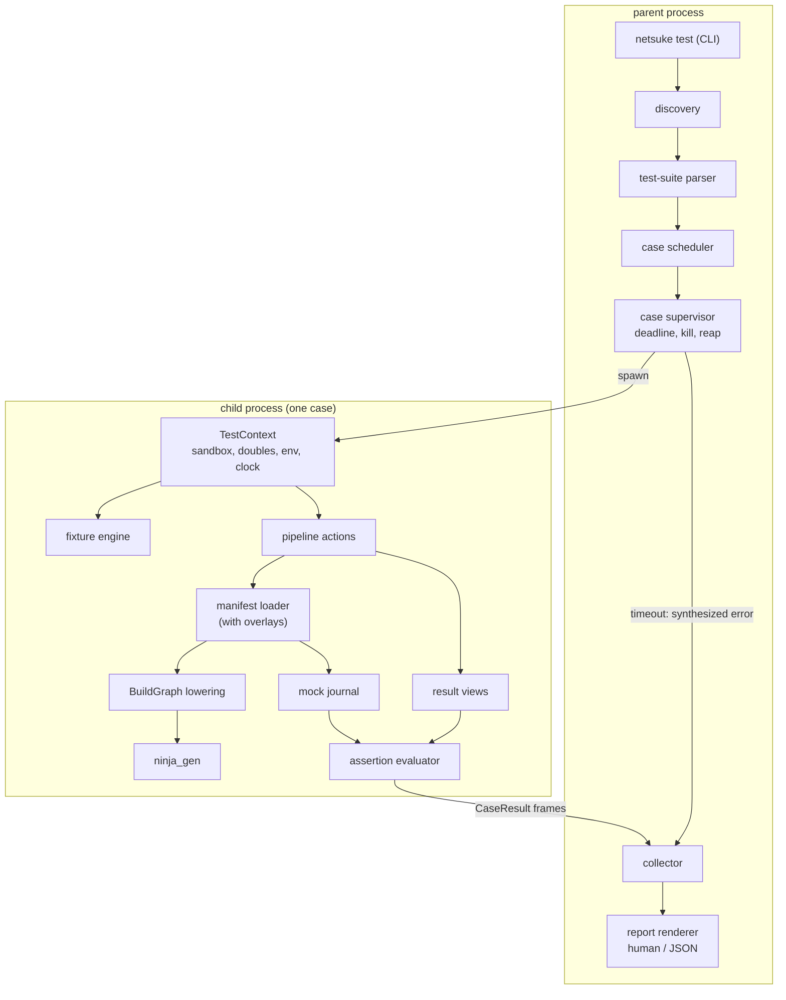

# Netsuke test framework technical design

## Front matter

- **Status:** Draft.
- **Scope:** The implementation architecture of the Netsukefile testing
  framework: pipeline integration, injection seams, the test-suite parser,
  the mock engine, the fixture engine, command-line integration, and the
  verification obligations the implementation must discharge. The
  user-facing dialect is normative in the companion
  [UX and semantic design](netsuke-test-framework-ux-design.md); this
  document does not restate its semantics except where implementation
  detail depends on them.
- **Primary audience:** Netsuke developers implementing `netsuke test`, and
  reviewers assessing the architecture.
- **Governing documents:**
  [RFC 0001](rfcs/0001-netsukefile-testing-framework.md);
  [netsuke-design.md](netsuke-design.md) for the compiler pipeline;
  [ADR-008](adr-008-environment-seam-taxonomy.md) for environment seams;
  [ADR-010](adr-010-scope-glob-capability-to-literal-prefix.md) for
  filesystem capability scoping. Accepted ADRs take precedence over this
  document.

## 1. Constraints

Non-negotiable constraints the rest of the document assumes:

- **C1 — one compiler.** `netsuke test` calls the same public library
  functions as the build path: the manifest loader, `BuildGraph`
  lowering, and `ninja_gen::generate`. The test runner adds overlays; it
  never re-implements manifest semantics.
- **C2 — no ambient mutation.** The runner must not mutate the process
  environment, the project root, or global state. All test I/O happens
  inside per-case `cap-std` sandboxes; all environment values flow through
  injected readers per ADR-008.
- **C3 — no execution.** No action in the first version spawns Ninja, build
  commands, or fixture shell commands. The stdlib command helpers are
  disabled under test (§4.5). When the deferred `execute` action does
  arrive it should drive `NinjaProcessOptions` — the narrow execution type
  carrying working directory, job count, and stderr suppression — rather
  than fabricating a `Cli`, since that decoupling exists precisely so
  non-CLI callers can run Ninja.
- **C4 — deterministic by default.** Clock, network, and environment are
  test-controlled. An unmocked impure call is an error, not a silent
  passthrough.
- **C5 — localized, stream-pure output.** User-facing strings go through
  the Fluent localization layer; `--json` obeys the one-document stream
  contract that the wider CLI roadmap mandates.

## 2. Architecture summary

The feature adds one new subsystem, `src/testing/`, plus narrow seams in
existing modules. The runner parses test files into a test-suite AST, then
executes each case in a child process that builds a per-case
`TestContext` (sandbox, doubles, environment, clock), drives pipeline
actions through the existing manifest/IR/Ninja code with an
overlay-carrying options structure, and evaluates assertions against
structured result views. The parent supervises those children and renders
the report.

The process boundary exists to make `--timeout` enforceable (§8.1); it is
not a second evaluator. The diagram below shows the flow for one case,
with the parent/child split marked: discovery and parsing happen once in
the parent, case execution happens in a killable child, and the
`CaseResult` returns over a versioned frame protocol for reporting.



_Figure 1: Test case execution flow across the process boundary. Existing
compiler components (manifest loader, BuildGraph, ninja_gen) are reused
unchanged apart from overlay injection at environment-construction time.
The supervisor enforces the deadline and, on expiry, supplies a
synthesized errored result in place of the child's._

## 3. Pipeline integration

### 3.1. The pipeline today

The loader driver `from_str_named` (`src/manifest/mod.rs:119`) runs six
stages: read, `serde_saphyr` parse into a JSON value tree, MiniJinja
environment construction (strict undefined; `env()` and `glob()` registered
from an injected `EnvReader` and the glob expander; stdlib registered
according to the selected `StdlibRegistration`; manifest `vars` exposed as
globals), macro registration plus `expand_foreach` (which also evaluates
`when`), `serde_json::from_value` deserialization into `NetsukeManifest`,
and `render_manifest` string rendering. The fullest-parameterized entry
point is `from_path_with_policy_and_env` (`src/manifest/mod.rs:380`), which
already accepts a `NetworkPolicy`, an `EnvReader`, and a coarse
`ManifestLoadStage` callback.

Two ordering facts drive the design. First, `foreach` and `when` evaluate
against the raw value tree _before_ typed deserialization, so doubles for
`glob`, `env`, and friends must be installed in the environment before
`expand_foreach` runs. Second, manifest macros are registered before
expansion (`register_manifest_macros`, `src/manifest/jinja_macros/mod.rs`),
so macro substitution is an overlay registered _after_ manifest macros and
_before_ expansion.

### 3.2. The restricted-load precedent

`netsuke help targets` established the pattern this framework extends. The
loader already selects its standard-library boundary through an enum
(`StdlibRegistration`, `src/manifest/mod.rs:113`) with two variants:
`Full(Box<StdlibConfig>)` for builds, and `ManifestQuery` for
side-effect-free discovery. `src/manifest/query.rs` owns that boundary, and
`register_manifest_query` (`src/stdlib/register.rs:114`) implements it by
registering the pure helpers and replacing `env`, `glob`, `fetch`, `shell`,
`grep`, and `contents` with stubs that raise a located diagnostic naming
the unavailable operation.

The test runner is a third load mode of exactly this shape, so it extends
the existing enum rather than introducing a parallel mechanism:

```rust
enum StdlibRegistration {
    Full(Box<StdlibConfig>),
    ManifestQuery,
    Test(Box<StdlibConfig>),   // sandbox-rooted; impure helpers refuse
}
```

Three consequences follow, each replacing machinery this design would
otherwise have invented:

- The disabled-helper diagnostic already exists.
  `manifest_query_operation_error` (`src/stdlib/register.rs:185`) is the
  template for the "unavailable under test" messages in §4.5; the test
  mode reuses the mechanism with its own message keys rather than
  intercepting MiniJinja's unknown-function error.
- `disabled_env_reader` (`src/manifest/env_reader.rs:79`) already provides
  a reader that refuses every lookup. The test reader is that reader with
  the case's declared variables layered over it (§4.1).
- `src/manifest/query.rs` is the precedent module for a capability-scoped
  non-build load, and the test runner's loader entry belongs beside it
  rather than in a new location.

### 3.3. Loader options

The loader gains an options-carrying entry point; the existing entry points
become thin wrappers over it with default options.

```rust
pub struct ManifestLoadOptions<'a> {
    pub registration: StdlibRegistration,
    pub env_reader: Option<EnvReader>,
    pub overlays: Option<TemplateOverlays>,
    pub on_stage: Option<&'a mut dyn FnMut(ManifestLoadStage)>,
}

/// Test-supplied substitutions applied to the MiniJinja environment
/// after stdlib and manifest-macro registration, before foreach expansion.
pub struct TemplateOverlays {
    pub functions: IndexMap<String, OverlayCallable>,
    pub macro_substitutions: IndexMap<String, String>,
}
```

`registration` carries the stdlib boundary rather than a bare
`StdlibConfig` plus a separate `NetworkPolicy`, because §3.2 already binds
those together per mode: the network policy for a test load is a property
of `StdlibRegistration::Test`, not an independently settable knob. This
keeps one place where a load mode's capabilities are decided. `Test`
boxes its payload like `Full`, matching the existing constructors in
`parse_with_config.rs` and `query.rs` and keeping the variants near enough
in size that the enum stays cheap to move.

The structure is named `TemplateOverlays`, not `EnvOverlays`: in this
codebase "env" means the process environment (ADR-008, `EnvReader`), and
these overlays substitute callables in the MiniJinja _template_
environment. The clock deliberately does not appear here — it has exactly
one owner, `StdlibConfig` (§4.2). `on_stage` keeps the existing
`&mut dyn FnMut` shape from `from_path_with_policy_and_env`.

`OverlayCallable` wraps a double's dispatch closure (§6). Registration
order inside environment construction becomes:

1. `env()` and `glob()` from the effective `EnvReader` and glob expander;
2. stdlib via `register_with_config` (with the test's `StdlibConfig`);
3. manifest `vars` globals;
4. manifest macros;
5. **overlays** — test doubles registered last so they shadow same-named
   stdlib functions (MiniJinja `add_function` replaces an existing
   registration), plus macro substitutions, which additionally rewrite the
   macro-import prelude (§4.4);
6. `expand_foreach`, deserialization, rendering as today.

The overlay hook is compiled unconditionally: it is an ordinary parameter,
not a test-only `cfg`, because the test runner is a production code path of
the shipped binary.

### 3.4. Result views

`NetsukeManifest` already derives `Serialize` (`src/ast/mod.rs:101`), and
`GraphView` (`src/graph_view/`) is an existing deterministic projection of
`BuildGraph` with sorted nodes and edges. The assertion layer builds on
both:

- `result.manifest` — the rendered manifest serialized to a MiniJinja
  value.
- `result.graph` — a `TestGraphView` wrapping `GraphView` with the helper
  methods the UX design promises (`has_target`, `has_rule`, `target(name)`
  field access), exposed as a MiniJinja object.
- `result.ninja` — the string from `ninja_gen::generate`
  (`src/ninja_gen/mod.rs:87`), which is already deterministic for snapshot
  tests.

The IR types themselves are not exposed: the views are a stable assertion
surface that can hold shape while internal IR evolves.

## 4. Injection seams

Each seam follows the ADR-008 taxonomy; two exist, two are new.

### 4.1. Environment (existing)

`EnvReader` (`src/manifest/env_reader.rs:56`) is an
`Arc<dyn Fn(&str) -> Result<String, EnvReadError> + Send + Sync>`. The
runner builds one from the case's `given.env` map: declared names return
their values, `unset` names and everything else return
`EnvReadError::NotPresent`. The host environment is reachable only through
an explicit future opt-in; the default reader never consults it (C2, C4).

### 4.2. Clock (new seam)

`now()` currently calls `OffsetDateTime::now_utc()` directly
(`src/stdlib/time/mod.rs:49`) — a gap relative to ADR-008. The stdlib time
module gains a clock provider in the `EnvReader` shape (an `Arc` closure,
because MiniJinja registration requires `Send + Sync`):

```rust
pub type ClockProvider = Arc<dyn Fn() -> OffsetDateTime + Send + Sync>;
```

Production registration wraps `OffsetDateTime::now_utc`; the test runner
supplies a fixed instant parsed from `given.clock.now`. The seam lives in
`StdlibConfig` alongside the existing `path_override` and `home_directory`
knobs — the clock's single owner — and is a prerequisite refactor
deliverable in its own right.

### 4.3. Network (policy, not transport)

`fetch()` builds its HTTP agent inline (`src/stdlib/network/mod.rs`), so
transport injection would be invasive. The test runner does not need it: a
test that wants `fetch` results declares a double for the `fetch` function
itself, and overlays register after the stdlib (§3.3), so the double
shadows the refusing stub. The real network code is therefore unreachable
under test — either the overlay answers the call, or the refusing stub
raises a diagnostic telling the author to declare one. No transport seam is
built, and no live agent is ever constructed.

### 4.4. Macro substitution (new mechanism)

`substitute("stand_in")` compiles the stand-in macro from the test file
through the same `register_macro` path as manifest macros, then installs a
journalling wrapper that records the call and delegates to the compiled
stand-in. Signature arity is validated when the macro is called, as with
ordinary manifest macros; earlier validation is a possible refinement, not
a first-version requirement.

Installing that wrapper takes more than `add_function`. `register_macro`
does two things per macro: it adds a global function, _and_ it appends
`` to a `MACRO_IMPORTS_GLOBAL` string
that `render_template` (`src/manifest/jinja_macros/mod.rs`) prepends to
every template it renders. An imported macro binds a template-local name,
and template-local names resolve ahead of environment globals — so a
same-named `add_function` overlay is shadowed at render time, and a
substituted `compile_cmd` would still run the original macro while
journalling nothing.

Macro substitution therefore edits the prelude as well as the global: for
each substituted name the overlay removes that name's entry from
`MACRO_IMPORTS_GLOBAL` and re-adds an import bound to the stand-in's
compiled template. Both halves are one operation and must stay together;
the phase-1 spike (§13) covers the prelude rewrite, not merely
`add_function` replacement, because the prelude is the half that actually
decides which macro renders.

### 4.5. Stdlib configuration under test

The runner constructs a per-case `StdlibConfig`
(`src/stdlib/config/mod.rs:21`) rooted at the sandbox:

| Knob | Test value |
| --- | --- |
| `workspace_root` | the case sandbox directory (`cap-std` `Dir`) |
| `network_policy` | deny all |
| `path_override`, `pathext_override` | empty unless the case stubs `which` |
| `home_directory` | `HomeDirectory::Missing` |
| command helpers | registered as refusing stubs (C3) |

_Table 1: Per-case stdlib configuration._

The command helpers, `fetch`, and the other impure entry points are
registered as stubs that refuse, following `register_manifest_query`
(§3.2) rather than being left unregistered. Refusing stubs beat omission:
under strict-undefined MiniJinja an absent function yields a generic
unknown-function error, whereas a registered stub raises a located
diagnostic that names the operation and points at the double syntax. The
test mode supplies its own message keys through the existing
`manifest_query_operation_error` shape.

`workspace_root` alone does not achieve that scoping, and the design must
not pretend otherwise. Two filesystem helpers bypass it today:

- `glob()` is registered in `src/manifest/mod.rs` over
  `glob::expand_glob(&pattern)`, which takes no workspace root. Its
  matcher traverses ambiently, and the capability it opens is rooted at
  the pattern's literal prefix — `.` for a relative pattern, meaning the
  process working directory. ADR-010 records the ambient traversal as an
  accepted limitation of the build path.
- File tests (`dir`, `file`, `symlink`, and the rest) reach
  `path::file_type_matches`, whose `parent_dir` helper calls
  `Dir::open_ambient_dir(.., ambient_authority())`. `register_file_tests`
  never receives `StdlibConfig` at all.

Left unaddressed, a fixture-built project would be globbed from the
runner's working directory instead of its own sandbox, which is both
host-dependent and the exact non-determinism this framework exists to
remove. The test registration therefore supplies sandbox-rooted adapters
for both helpers: `glob()` resolves relative patterns against the case
sandbox `Dir`, and the file tests resolve their paths through the same
handle, rejecting escapes rather than falling back to ambient authority.
These adapters are test-mode components, not changes to the build path's
behaviour, so ADR-010's accepted limitation stands for builds while tests
get the stronger guarantee they require.

With those adapters in place the visibility consequence is worth stating
plainly: the project tree is _not_ visible to a manifest under test. A
default-subject test sees only the files its fixtures and `given.fs`
created. Invariant I4 (§11) is scoped accordingly, and invariant I5's
no-ambient-filesystem claim depends on these adapters existing.

## 5. Test-suite AST and parser

A separate AST in `src/testing/ast.rs`; `NetsukeManifest` is not
stretched.

```rust
pub struct TestFile {
    pub netsuke_test_version: DialectVersion, // MAJOR.MINOR, not semver
    pub imports: Vec<Utf8PathBuf>,
    pub vars: IndexMap<String, YamlValue>,
    pub macros: Vec<MacroDefinition>,        // reused from src/ast/mod.rs
    pub fixtures: IndexMap<String, FixtureDef>,
    pub cases: IndexMap<String, TestCase>,   // test_* keys, document order
}
```

Parsing partitions top-level keys: the five known keys deserialize into
typed structures with `deny_unknown_fields`; keys matching
`test_[A-Za-z0-9_]+` deserialize as `TestCase`; anything else is a
diagnostic with a nearest-known-key suggestion. `IndexMap` preserves
declaration order for cases, `let` bindings, and mock entries, because the
dialect's semantics depend on document order.

Discovery reads the manifest's `tests` block by raw extraction of the
top-level `tests` key from the `serde_saphyr` value tree, with no template
evaluation — so discovery works before the subject's template environment
exists, and succeeds even when the subject manifest does not load. Imports
form a directed acyclic graph: a cycle is a suite error naming the cycle,
and resolution depth is capped. Support files parse once per run into
shared immutable declarations, not once per case.

Validation at parse time: duplicate keys (already fatal in
`serde_saphyr`), at least one step per case, at least one of
`given`/`when`/`then` per step, fixture references resolve, imports stay
inside the test tree, expression fields reject `{{`-style template syntax
(the UX design's expression/template split), and matcher objects use only
the closed vocabulary.

The `tests` block on the manifest side is a new optional field on
`NetsukeManifest` with `deny_unknown_fields` semantics preserved;
compatibility consequences are covered in RFC 0001.

## 6. Mock engine

`src/testing/mocks.rs` owns double state:

```rust
pub struct DoubleRegistry {
    doubles: IndexMap<String, Double>,
    journal: Journal,
}

pub struct Double {
    pub kind: DoubleKind,                 // Stub | Mock | Spy
    pub ordered: bool,
    pub lenient: bool,
    pub entries: Vec<CallEntry>,          // first-match-wins
}

pub struct CallEntry {
    pub matchers: Vec<ArgMatcher>,
    pub response: Response,               // Returns(Value) | Raises(..)
    pub times: Option<u32>,
    pub matched: Cell<u32>,
}
```

Dispatch acquires the registry lock, appends the invocation to the
journal, selects a response, and _releases the lock before producing it_.
Selection scans `entries` for the first matcher-accepting entry with
remaining `times` budget. Ordering changes both which entries are eligible
and what a mismatch means:

- Unordered (the default) considers every entry in declaration order and
  takes the first that accepts the arguments and has budget left.
- `ordered: true` considers only the next unconsumed entry. An entry
  without `times` is never consumed, so it stays the candidate for every
  subsequent call and later entries remain unreachable behind it — an
  unbounded entry in an ordered double is therefore a terminal entry, and
  the parser warns when one precedes another. An entry with `times: N`
  is consumed after its Nth match, and the next entry becomes the
  candidate.

A mismatch never silently skips ahead in an ordered double: if the
candidate entry rejects the arguments, dispatch fails rather than
searching later entries, because declaration order is precisely what the
author asked to pin. Unordered doubles fall through to later entries and
fail only when none accepts. Tests cover repeated calls against an
unbounded entry, an unbounded entry followed by another, and a mismatch
under both ordering modes. A `Mock` with no accepting entry yields a
MiniJinja error carrying a structured payload, which the runner converts
into the unmatched-call report with its suggested YAML stanza. A `Stub`
falls back to its `default` or `Undefined`. A `Spy` resolves to a handle
the runner captured when it constructed the effective callable — the
runner holds these handles itself rather than retrieving previously
registered functions from the MiniJinja environment, which offers no such
retrieval.

Releasing the lock before invoking a spy's delegate is load-bearing, not
an optimization. A spied callable may call another double — a spied macro
whose body calls a mocked `glob` is the ordinary case — and that nested
dispatch re-enters the same registry. Holding the lock across the delegate
would deadlock the case. Dispatch therefore returns a resolved action
while unlocked, and the nested call takes the lock in its own turn. A test
covering a spy that invokes a second double guards this.

Journal entries record the arguments, and the identity of the responding
entry as a `(double, entry_index)` pair rather than a Rust reference or a
cloned response value. A borrowed `&CallEntry` would make the journal
self-referential within `DoubleRegistry`; the index pair is stable across
the case, keeps response-value deduplication a separate concern (the value
still lives once in its `CallEntry`), and survives the registry being
locked and unlocked around each dispatch. The per-double journal ceiling
from the UX design is enforced at append time; breaching it turns the case
into an error naming the double.

Registry state is per case and lives behind an `Arc<Mutex<..>>` captured by
the overlay closures; nothing is process-global, so parallel cases cannot
observe each other (invariant I1, §11). Overlay dispatch runs under
`catch_unwind`: a panic inside matcher evaluation or value conversion
becomes a case error, and the registry lock recovers from poisoning so
end-of-case verification can still report the journalled calls.

End-of-case verification walks the registry. A `Mock` entry that never
matched a call is an unmet expectation and fails the case. `times` plays
no part in that judgement: it is a maximum-call budget, so an entry
declared `times: 3` that matched once or twice is satisfied, and only an
entry that matched zero times is unmet. Nothing fails merely because a
budget went unspent. Doubles with zero journal entries raise the
unnecessary-double warning unless `lenient`.

Matcher evaluation is a closed enum (`Exact(Value)`, `Any`,
`IsA(TypeName)`, `Regex(compiled)`, `Contains(Value)`,
`StartsWith(String)`, `Not(Box<ArgMatcher>)`) compiled at parse time so an
invalid regex is a suite error, not a mid-run surprise. `Exact` backs both
the bare-argument form and the `eq:` escape hatch; the parser lowers both
to it.

## 7. Fixture engine

`src/testing/fixtures.rs` resolves the case's requested fixtures into a
dependency graph (`uses` edges), topologically sorts it — a cycle is a
suite error naming the cycle — and executes setup actions in order. A
topological sort leaves independent fixtures mutually unordered, so the
sort breaks ties deterministically rather than by hash iteration order:
fixtures requested by the step come first in request order, and fixtures
pulled in only as `uses` dependencies follow in declaration order within
their file. Two fixtures that depend on nothing therefore always set up in
the same sequence, and reverse-order teardown is correspondingly stable. A
test with several independent fixtures asserts both the setup and the
teardown sequence. Each
case owns one sandbox: a temporary directory opened as a `cap-std` `Dir`,
within which `tmpdir`, `mkdir`, `write`, `copy`, and `remove` operate by
relative path. Absolute paths and `..` traversal are rejected at
action-evaluation time, keeping fixtures inside the capability boundary
that ADR-010 established for globbing.

Subject-manifest paths pass through the same boundary before the loader
sees them. `open_manifest_workspace` accepts any path and opens its parent
with ambient authority, which is right for `netsuke build -f <path>` but
too wide for a test: it would let a case read anything the invoking user
can read. The test runner therefore resolves and validates each
author-supplied subject path — the action's `manifest` argument,
`given.subject`, and the case's `subject` — after template evaluation and
before opening the workspace, rejecting absolute paths and any path
escaping the case sandbox, including through symlinked components that
already exist. The enclosing project's Netsukefile is the one approved
path outside the sandbox, admitted read-only. This is a test-mode
restriction layered above the shared loader, not a change to the build
path's behaviour. Fixture `env` actions write into
the case-level environment map owned by `TestContext`, before `given.env`
is applied over them.

All case sandboxes live under one per-run root named
`netsuke-test-<pid>-<nonce>`. The runner installs an interrupt handler
that stops scheduling, tears down completed fixtures, removes the run root
unless `--keep`, and exits with the interrupted code; a SIGKILL still
leaks, so the recognizable naming scheme plus age-based reaping of stale
run roots at the start of the next run makes leaks self-healing. A case
whose sandbox cannot be provisioned is errored and isolated; only failure
to create the run root itself aborts the run.

Teardown obligations (UX design §9) are implemented with a completion
stack: each fixture pushes onto the stack only after its setup finishes,
and case cleanup pops the stack unconditionally — after assertion
failures, action errors, and fixture-setup failures alike. A teardown
error does not stop the unwind: remaining entries still pop, the errors
aggregate into the report, and the sandbox is retained. `--keep` skips
sandbox deletion for failing cases and prints the retained path.

Fixture `exports` are Jinja templates evaluated against the fixture's
local bindings (for example the `tmpdir` name) and exposed to `let` and
assertions as `fixtures.<name>.<field>`.

## 8. Actions and the case runner

`src/testing/actions.rs` implements the three pipeline actions as thin
compositions of public library functions:

- `load_manifest` → `manifest::from_str_named`-equivalent entry with
  `ManifestLoadOptions` (§3.3);
- `build_graph` → `BuildGraph::from_manifest`
  (`src/ir/from_manifest.rs:38`) over the loaded manifest;
- `generate_ninja` → `ninja_gen::generate` over the built graph.

Within a step, the actions share one pipeline pass: `build_graph` and
`generate_ninja` extend the step's memoized artefacts rather than
re-running the loader, which keeps a three-action `when` at one template
evaluation and makes journal counts independent of the action list (the
UX design §10 makes this the observable contract). A later step's action
starts a fresh pass.

Each action produces an `ActionResult { action, ok, views, error }`. The
case runner keeps them in a `results: Vec<ActionResult>` that accumulates
across the whole case in execution order, never resetting between steps.
`result` is sugar for the last element. Assertions index the history
positionally — `results[0]`, `results | length` — so a step that runs
`load_manifest` then `generate_ninja` can compare the two stages, and a
later step can still read an earlier step's outcome. Indices are stable
because actions only ever append.

An action failure with `expect_failure` in the following `then` is a
normal comparison; without it, the failure fails the case at the point of
the first assertion that needs a missing view (or immediately when the step
has no `then`).

The scheduler runs cases in parallel up to `--jobs` (defaulting to
available parallelism), one case per worker, with no shared mutable state
at all. A worker supervises one child at a time (§8.1) and forwards the
finished, immutable `CaseResult` — whether the child produced it or the
supervisor synthesized it after a timeout — down a channel to a single
collector, and only the collector writes the report. That keeps report
assembly free of locking and makes
ordering a property of the collector rather than of scheduling luck — it
buffers results and restores sorted file order, then declaration order
within each file, before rendering. Cases therefore complete in whatever
order they finish while human and JSON output stay byte-stable; a test
that completes cases deliberately out of order and diffs both renderings
guards this.

Case execution runs under `catch_unwind` inside the child; a panic that
escapes it becomes an abnormal child exit, which the supervisor records as
an errored case. Either way the worker survives and every selected case
reaches the report (invariant I9). Process isolation strengthens this:
a child that aborts outright can no longer take the run down with it.

### 8.1. Enforcing the per-case timeout

`--timeout` is a hard per-case wall-clock bound, not a best-effort one.
Making it hard requires a cancellation boundary, because MiniJinja
evaluation is not preemptible: a single large loop inside one target field
can run indefinitely inside one `render_template` call, yielding to no
checkpoint the runner controls. Cooperative deadline checks alone cannot
bound that, so each case executes in an independently killable child
process.

The split is deliberately narrow. The parent keeps discovery, parsing,
scheduling, timeout enforcement, child reaping, and all report rendering.
The child executes exactly one case — fixtures, overlays, pipeline
actions, assertions — and returns a `CaseResult`. Nothing about the
compiler pipeline changes: the child runs the same loader, IR builder, and
generator as before (C1), so this is an execution boundary, not a second
evaluator.

Timeout behaviour in the parent:

1. Start the deadline before spawning, so spawn cost counts against the
   case rather than being free.
2. Wait with `wait_timeout`, exactly as `src/stdlib/command/execution.rs`
   already bounds stdlib command helpers.
3. On expiry, kill the child and reap it. `std::process::Child::kill` maps
   to `SIGKILL` on Unix and `TerminateProcess` on Windows, so termination
   needs no platform-specific code; CI covers both (`ubuntu-latest` and
   `windows-latest`).
4. Collect a partial result if the protocol delivered one complete frame
   before termination; otherwise synthesize an errored `CaseResult`
   carrying a timeout diagnostic.
5. Attach whatever mock journal arrived, so a timed-out case still shows
   which doubles it reached.

The child streams to the parent over its stdout pipe using
length-prefixed `serde_json` frames, versioned like the existing
`json_envelope` (`SCHEMA_VERSION`) so parent and child cannot silently
disagree. `serde_json` is already a dependency; no IPC crate, socket, or
named pipe is introduced. Frames are bounded — a journal ceiling breach
truncates rather than streaming without limit — and the parent treats a
truncated final frame as "no complete result", falling to step 4. The
child's stderr is captured and folded into the case's diagnostics rather
than leaking into the parent's stream, preserving stream purity (I8).

Cooperative checkpoints remain, and are now the graceful path rather than
the only one. The deadline is still checked at overlay dispatch, loader
stage callbacks, each fixture setup and teardown action, between pipeline
actions, and between assertions; macro depth and `foreach` expansion
ceilings still apply. A case that reaches a checkpoint reports itself
cleanly with a full journal and completes its own teardown. Termination is
the backstop for the case that never reaches one. The design does not
claim that a blocked in-process action is interrupted where it stands: it
claims the process running it is killed.

Cleanup ownership follows the same split:

| Situation | Teardown performed by |
| --- | --- |
| Normal completion | child, before sending its result |
| Cooperative timeout | child, after marking the case errored |
| Forced termination | parent, over the case sandbox |
| Child panic | parent, after observing abnormal exit |
| Interruption (Ctrl-C) | parent, for every live child and the run root |

_Table 2: Fixture teardown ownership._

Case sandboxes stay under the existing per-run root, so the parent can
always finish cleanup a dead child left undone. A timed-out case retains
its sandbox for inspection, on the same terms as `--keep`, and the path is
printed. The parent reaps every child it spawns, including on the
interrupt path, so no zombies survive the run.

## 9. CLI integration

`src/cli/parser.rs` gains `Commands::Test(TestArgs)` with the flags from
the UX design §12. Like `GraphArgs`, the purely per-invocation flags are
`#[serde(skip)]`ed out of OrthoConfig layering; candidates for config-file
defaults (`jobs`, display policy) follow the existing precedence rules.
`src/runner/dispatch.rs` routes the variant to `testing::run`, which owns
discovery, scheduling, and process exit-code mapping (0, 1, 2, 3, and 130
per the UX design). Interruption keeps its own exit result and is not
folded into the internal-runner-error class.

New user-facing strings — report lines, diagnostics, warnings — get keys in
`src/localization/keys.rs` and Fluent messages. The build-time
completeness audit requires the keys in every registered locale (34
catalogues beyond `en-US`), so the string surface is a real delivery cost:
keys are defined early in the phasing, not at the end, so translation
lands in batches rather than as a release-blocking cliff. Two artefacts
are deliberately locale-invariant machine output, not localized prose: the
suggested YAML stanza for unmatched calls and the expression-with-values
rendering in failure reports.

## 10. Reporting

`src/testing/report.rs` renders both formats from one `SuiteReport`
structure. Human rendering streams per case through the
design-token/display-policy machinery like other commands; only JSON
buffers the whole run, emitting exactly one document carrying the
`format_version` field (C5, UX design §13). `failed` and `errored` are
distinct case states throughout, and each failure record carries the
rendered expression-with-values text — truncated per the UX design's
elision rule — so CI consumers get the same diagnostic a terminal user
sees without unbounded report growth.

## 11. Verification obligations

Named invariants the implementation must discharge, with their
verification methods. These are design commitments, not a test-type list.

- **I1 — case isolation.** No double, journal entry, environment binding,
  fixture export, or sandbox file from one case is observable from
  another, including under `--jobs` parallelism. _Method:_ concurrent
  integration tests that deliberately reuse double and fixture names
  across cases and assert disjoint journals.
- **I2 — teardown exactly once, reverse order.** Every fixture whose setup
  completed tears down exactly once, in reverse setup order, on every exit
  path. _Method:_ `proptest` over randomly generated fixture dependency
  graphs of at most 16 fixtures, with injected failures at each lifecycle
  point, asserting the teardown sequence property; case counts are bounded
  in the nextest profile so this suite cannot become the slowest gate.
- **I3 — strict mock determinism.** An unmatched call on a `Mock` fails
  the action at the call site; the journal preserves call order, arguments,
  and responses. _Method:_ unit tests per matcher and dispatch rule;
  `rstest` parameterized cases over the matcher vocabulary.
- **I4 — semantic fidelity.** For any manifest with no doubles declared
  whose file observations are confined to the sandbox (fixture-provided
  files) or fully doubled, `load_manifest`/`build_graph`/`generate_ninja`
  under `netsuke test` produce results identical to the build path run
  over the same tree. The scoping is forced by §4.5: the sandbox root
  means a manifest observing the project tree legitimately differs under
  test. _Method:_ differential tests that run both paths over the example
  manifests inside one tree and compare serialized outputs; `insta`
  snapshots of the generated Ninja.
- **I5 — no build execution, no network, no ambient environment.** Under
  test, no build command, Ninja invocation, or fixture shell command runs;
  no socket is opened; and no host environment variable is read outside an
  explicit opt-in. The per-case child process (§8.1) is the runner
  supervising itself, not the manifest executing anything, and it inherits
  every restriction in this list. _Method:_ the seams make
  these unrepresentable (impure helpers registered as refusing stubs,
  deny-all policy, closed `EnvReader`); negative tests assert every
  refusal diagnostic.
- **I6 — schema strictness.** Unknown keys anywhere in the test dialect
  fail with a located diagnostic. _Method:_ table-driven negative parser
  tests covering each structure.
- **I7 — build-path neutrality.** A manifest containing a `tests` block
  behaves identically under `build`, `graph`, `generate`, and `clean` to
  the same manifest without it. _Method:_ differential snapshot tests.
- **I8 — report stream purity.** `--json` emits exactly one report
  document on stdout with empty stderr whenever the run _completes_ —
  whether every case passed, some failed or errored (exit 1), or the run
  was interrupted (exit 130). Only a _command_ failure — invalid suite or
  selector, zero selected cases without `--allow-empty` (exit 2), or an
  internal runner error before a report can be assembled (exit 3) —
  suppresses the stdout document and emits one diagnostic document on
  stderr instead. The distinction matters because a completed run with
  failing cases is the primary thing automation reads from stdout;
  emptying stdout there would defeat `--json`. _Method:_ the existing
  stream-purity behavioural test pattern extended to `test`, with cases
  for each exit class.
- **I9 — conservation of cases.** Every selected case appears in the
  report exactly once, as passed, failed, errored, or skipped — including
  under child panic, forced termination, and interruption. _Method:_
  scheduler tests with injected panics and deadline breaches, asserting
  report totals against the selection count.
- **I10 — the timeout is enforced.** No case exceeds its deadline by more
  than the termination and reaping window, whatever the manifest does.
  _Method:_ a case whose manifest contains a deliberately non-cooperative
  template expression — one large enough to run indefinitely inside a
  single render with no checkpoint — asserting that the run terminates,
  the case is errored with a timeout diagnostic, its partial journal
  survives, its sandbox is retained, its fixtures are torn down, no child
  process outlives the run, and `--json` still emits exactly one document.
  Cooperative expiry is covered separately and deterministically through
  an injected clock: a fixture setup action that passes a checkpoint after
  the deadline must error the case, keep the partial journal, and tear
  down every fixture whose setup completed; a teardown action that does
  the same must continue unwinding the remaining stack, aggregate its
  errors, retain the sandbox, and report the case as errored. Neither test
  depends on wall-clock delays.

The combinatorial surface that carries the highest interaction risk is
double kind × ordering × `times` × matcher type. I3's parameterized suite
enumerates kind, ordering, and `times` exhaustively and pairs them with
each matcher type individually. Full four-way enumeration is not run, but
structural separation is not offered as the reason: matching and
consumption meet in entry selection, so the interaction is real and the
suite covers it directly with named cases —

- a first entry whose `times` budget is exhausted, so a later entry with a
  broader matcher must take the call;
- an `ordered` double whose next entry rejects the arguments, pinning
  whether selection falls through or fails;
- a catch-all entry after a specific one, in both declaration orders,
  confirming first-match-wins rather than best-match;
- a `times`-bounded entry that is never exhausted, confirming a maximum
  does not become a minimum (UX design §8.2).

These are the cases where a bug would otherwise hide behind the
independence claim.

New `tests/*.rs` files land as real Cargo targets; the existing
integration-test wiring contract test enforces this automatically.

## 12. Module layout

```plaintext
src/testing/
  mod.rs          — public run() entry, suite orchestration
  ast.rs          — test-suite AST
  discovery.rs    — tests root resolution, include/exclude, imports
  parser.rs       — YAML parsing, test_* partitioning, validation
  eval.rs         — expression evaluation, expression/template split
  context.rs      — TestContext, sandbox, result views
  fixtures.rs     — fixture graph, setup/teardown
  actions.rs      — pipeline actions
  supervisor.rs   — child spawn, deadline, kill, reap
  protocol.rs     — versioned length-prefixed CaseResult frames
  mocks.rs        — DoubleRegistry, matchers, journal
  assertions.rs   — assertion normalization and evaluation
  report.rs       — SuiteReport, human and JSON rendering
  errors.rs       — thiserror diagnostics for the subsystem
```

Existing modules touched: `src/manifest/mod.rs` (options entry point,
`StdlibRegistration::Test`, overlay registration), `src/manifest/query.rs`
(test-mode loader entry beside the query entry), `src/stdlib/register.rs`
(test-mode registration), `src/stdlib/time/` (clock seam),
`src/stdlib/config/` (clock in `StdlibConfig`), `src/ast/mod.rs` (optional
`tests` field), `src/cli/parser.rs` and `src/runner/dispatch.rs` (command
wiring), `src/localization/keys.rs` (strings). Errors are semantic
`thiserror` enums per module, composed into the runner's reporting. The
supervisor reuses the `wait_timeout`-then-kill-then-reap pattern already
proven in `src/stdlib/command/execution.rs`, and `protocol.rs` follows the
`src/json_envelope.rs` versioning convention rather than inventing its
own. The
subsystem follows whichever diagnostic direction (miette versus anyhow)
the in-flight migration settles on, and must not add new dependencies on
the deprecated path.

## 13. Phasing

The minimum viable implementation, in dependency order:

1. Overlay spike, clock seam, and `ManifestLoadOptions` refactor (no
   behaviour change; I4/I7 differential tests land here). The spike comes
   first because it gates the overlay architecture: it pins MiniJinja
   `add_function` replacement semantics for shadowing, and the runner-side
   handle capture that spies depend on (§6). If shadowing fails, the
   fallback is filtering the macro out of `register_manifest_macros` via
   `TemplateOverlays`, which the options structure already permits.
2. Test-suite AST, parser, and discovery (I6). Localization keys for the
   dialect's diagnostics are defined from this phase onwards (§9).
3. Mock engine and overlays for functions and macro substitution (I1, I3).
4. Fixture engine and sandbox (I2).
5. Actions, result views, and the case supervisor with its frame protocol
   (I9, I10).
6. Assertion evaluation and the failure taxonomy.
7. CLI wiring, remaining localization, and reporting (I5, I8).
8. Author-facing documentation: a users' guide chapter on writing and
   running manifest tests, indexed from `contents.md`.

Deferred work is enumerated in the UX design §15; nothing in this
architecture forecloses it. Roadmap phase 6 tracks these deliverables as
numbered tasks.

## 14. Synchronization

This document must be kept in step with the decisions and documents that
govern it. When any of the following change, this document is updated in
the same change set or the divergence is called out explicitly here until
it is reconciled:

- The [UX design](netsuke-test-framework-ux-design.md), which is normative
  for dialect semantics; implementation detail here must not contradict it.
- [RFC 0001](rfcs/0001-netsukefile-testing-framework.md), which positions
  and scopes the feature.
- [ADR-008](adr-008-environment-seam-taxonomy.md), which governs the
  environment injection seams §4 relies on.
- [ADR-010](adr-010-scope-glob-capability-to-literal-prefix.md), which
  governs the glob capability scoping the mock engine and sandbox rely on.
- [Roadmap phase 6](roadmap.md), which tracks the phasing above (§13) as
  numbered deliverables.

If an accepted ADR changes, the ADR wins: this document is either updated
to match or the divergence is recorded here until it is.
