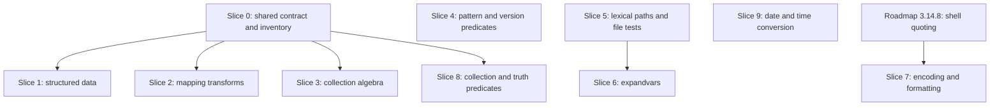

# RFC 0006: Ansible-inspired template standard-library expansion

## Preamble

- **RFC number:** 0006
- **Status:** Proposed
- **Created:** 2026-08-26
- **Tracking issue:**
  [#596](https://github.com/leynos/netsuke/issues/596)
- **Release target:** after v0.1.0 final; no part of this RFC may land in the
  v0.1.0 hardening release defined by
  [#594](https://github.com/leynos/netsuke/issues/594).

### Number allocation

No RFC has been merged to `main` yet, so the `docs/rfcs/` sequence is defined
entirely by in-flight branches. This RFC takes `0006` and treats the numbers
below it as reserved, per the "gaps are acceptable when numbers are reserved,
drafted on another branch, or intentionally skipped" rule in
[the documentation style guide](../documentation-style-guide.md).

| Numbers | Reserved for | Current state |
| --- | --- | --- |
| 0001 | Structured command blocks, plus the two amendments | Drafted in [#573](https://github.com/leynos/netsuke/pull/573) and superseded by [#600](https://github.com/leynos/netsuke/pull/600) |
| 0002 to 0004 | Manifest composition: repository-relative includes, versioned local bundles, digest-pinned external bundles | Drafted in [#600](https://github.com/leynos/netsuke/pull/600) |
| 0005 | Held free for the first renumbering out of the current 0001 to 0002 collision | [#556](https://github.com/leynos/netsuke/pull/556) and [#566](https://github.com/leynos/netsuke/pull/566) both draft at numbers already claimed by [#600](https://github.com/leynos/netsuke/pull/600) |
| 0006 | This RFC | Proposed |

_Table 1: RFC sequence reservations across in-flight branches._

## 1. Summary

Ansible has spent fifteen years accumulating a Jinja standard library for
people who write declarative configuration in YAML. Netsuke writes declarative
build manifests in YAML. The overlap in ergonomic need is large, and the
overlap in judgement is small: much of Ansible's surface encodes Python
quirks, unstable set ordering, permissive coercion, deprecated compatibility
behaviour, and orchestration concepts that have no meaning in a build graph.

This RFC surveys every function, filter, and test exposed by ansible-core
2.21.3, records an explicit accept, defer, or reject disposition for each
candidate, and specifies Netsuke-native contracts for the accepted set. It
proposes fifty-seven new helpers — forty-one filters and sixteen tests —
across ten capability groups, three behaviour-preserving options on existing
helpers, a normative cross-cutting contract that every accepted helper must
satisfy, deliberate resolutions for every naming collision with MiniJinja and
the existing Netsuke surface, and a delivery sequence of ten focused slices.

This RFC specifies behaviour only. It contains no implementation, and it is
not itself a request to merge one large standard-library change. Accepted
groups become focused child issues after v0.1.0 final.

## 2. Problem

Netsuke manifests currently reach outside the template language for
operations that a build description should be able to express directly.

- **Structured data cannot be read.** A manifest that needs a field from
  `Cargo.toml` metadata, a compiler's JSON output, a package manifest, or a
  generated configuration fragment must shell out to `jq`, `yq`, Python, or
  Ruby through `shell()`. That imports a host dependency, an escaping hazard,
  and a subprocess into what should be pure manifest-time planning.
- **Mapping composition is manual.** Layering default settings, per-platform
  overrides, and per-target overrides is the central activity of a build
  manifest, and Netsuke offers no merge primitive at all.
- **Build matrices are awkward.** Cartesian products over target triples,
  feature sets, and optimization levels have to be pre-expanded by hand or
  written as nested `foreach` blocks.
- **String matching is absent.** Extracting a version from `--version` output,
  filtering a `glob()` result by pattern, or normalizing a toolchain
  identifier all require either a subprocess or contorted `split`/`join`
  chains.
- **Version comparison is string comparison.** `"1.10.0" > "1.9.0"` is false
  under lexicographic ordering, and manifests that select compiler flags by
  toolchain version have no correct way to express the test.
- **Cross-platform path text cannot be built.** Netsuke's existing path
  filters use host-native parsing, so a Unix host cannot lexically compose or
  inspect a Windows path for a cross-compilation target.
- **Existence cannot be probed.** Netsuke has file-type tests, but no way to
  ask whether a path exists at all, and no way to distinguish a dangling
  symbolic link from an absent one.

Each gap currently resolves to the same workaround: call `shell()`. Every such
call converts a pure, cacheable, capability-free planning expression into a
subprocess with ambient authority, an escaping surface, and a host dependency.
The goal of this RFC is to make that workaround unnecessary for the common
cases, not to reproduce Ansible.

## 3. Current state

### 3.1. MiniJinja built-ins already available

`Cargo.toml` requests `minijinja = "2.12.0"`; `Cargo.lock` currently resolves
`2.21.0`. The built-in surface below is present in both, and this RFC treats
it as the baseline that must not be duplicated.

- **Filters:** `abs`, `attr`, `batch`, `bool`, `capitalize`, `chain`, `count`,
  `d`, `default`, `dictsort`, `e`, `escape`, `first`, `float`, `format`,
  `groupby`, `indent`, `int`, `items`, `join`, `last`, `length`, `lines`,
  `list`, `lower`, `map`, `max`, `min`, `pprint`, `reject`, `rejectattr`,
  `replace`, `reverse`, `round`, `safe`, `select`, `selectattr`, `slice`,
  `sort`, `split`, `string`, `sum`, `title`, `tojson`, `trim`, `unique`,
  `upper`, `urlencode`, `zip`.
- **Tests:** `boolean`, `defined`, `divisibleby`, `endingwith`, `escaped`,
  `even`, `false`, `filter`, `float`, `in`, `integer`, `int`, `iterable`,
  `lower`, `mapping`, `none`, `number`, `odd`, `safe`, `sameas`, `sequence`,
  `startingwith`, `string`, `test`, `true`, `undefined`, `upper`, and the
  comparison family `eq`/`equalto`/`==`, `ne`/`!=`, `lt`/`lessthan`/`<`,
  `le`/`<=`, `gt`/`greaterthan`/`>`, `ge`/`>=`.
- **Globals:** `debug`, `dict`, `namespace`, `range`.

### 3.2. Netsuke extensions already available

`src/stdlib/register.rs` is the composition root. It registers the following
on top of MiniJinja, with `env` and `glob` registered a layer up in
`src/manifest/mod.rs`.

- **Functions:** `env`, `glob`, `fetch`, `now`, `timedelta`, `which`,
  `command_available`.
- **Filters:** `basename`, `dirname`, `with_suffix`, `relative_to`,
  `realpath`, `expanduser`, `size`, `contents`, `linecount`, `hash`, `digest`,
  `uniq`, `flatten`, `group_by`, `shell`, `grep`, `which`.
- **Tests:** `dir`, `file`, `symlink`, `pipe`, `block_device`, `char_device`,
  `device`.

Three existing mechanisms matter to this proposal.

1. **Capability injection.** `StdlibConfig` threads a `cap_std` workspace
   directory handle, a `NetworkPolicy`, byte budgets, a `HomeDirectory` value,
   and PATH overrides into `register_with_config`. The sole ambient-authority
   grant is the `Dir::open_ambient_dir` call at the composition root.
   [ADR-008](../adr-008-environment-seam-taxonomy.md) records the seam
   taxonomy: narrow closure seams for one or two call sites, snapshot values
   for wider ones.
2. **Manifest-query restriction.** The runner's read-only generation pipeline,
   `runner::generation::load_manifest`, loads manifests through
   `register_manifest_query`, which registers only lexical path filters, the
   collection filters, and `timedelta`, then re-registers `env`, `glob`,
   `fetch`, `shell`, `grep`, and `contents` as always-failing stubs.
   `netsuke help targets` is its only command consumer today, but
   [the developers' guide](../developers-guide.md) already admits future
   dry-run and background-generation callers into the same pipeline. This RFC
   therefore treats the restriction as a property of the read-only
   registration rather than of one command, and "available in manifest
   queries" below should be read that way throughout.
3. **Documented examples are executed.** Every fenced example in
   `docs/stdlib-yaml-and-jinja-guide.md` carries a `tested-example` marker and
   is loaded, generated, and in most cases executed by
   `tests/documentation_examples_tests.rs` and
   `tests/documentation_examples_e2e_tests.rs`.

### 3.3. Known weaknesses in the current surface

Three existing gaps constrain this design and are called out so the follow-up
work does not silently inherit them.

- **Excluded helpers do not all fail explicitly.** `register_manifest_query`
  stubs six helpers: `env`, `glob`, `fetch`, `shell`, `grep`, and `contents`.
  A further sixteen names registered in the full environment are absent from
  the manifest-query environment altogether, so a manifest query reports
  "unknown filter" or "unknown test" rather than explaining the restriction.
  They are the filters `realpath`, `expanduser`, `size`, `linecount`, `hash`,
  and `digest`; `which`, which is registered as both a filter and a function;
  the functions `command_available` and `now`; and the file tests `dir`,
  `file`, `symlink`, `pipe`, `block_device`, `char_device`, and `device`.
  Section 6.2 makes explicit failure normative, and section 14.1 schedules the
  repair across that whole set rather than the path filters alone.
- **`manifest_query_operation_error` is not localized.** It builds its message
  with `format!` rather than a Fluent key, unlike the rest of the stdlib.
- **`now` has no injected clock seam.** It calls `OffsetDateTime::now_utc()`
  directly. The time helpers proposed here are pure and do not need the seam,
  but the gap is recorded because it bounds how far time behaviour can be
  tested deterministically.

## 4. Goals and non-goals

- Goals:
  - Make the common build-manifest contortions expressible without `shell()`.
  - Give every accepted helper a written contract covering purity,
    determinism, capability scope, platform behaviour, types, errors, resource
    bounds, and diagnostics, before any code is written.
  - Resolve every naming collision with MiniJinja and the existing Netsuke
    surface deliberately, in one place.
  - Produce a delivery sequence of focused slices that can each ship, be
    reviewed, and be reverted independently.
  - Keep the generated build graph byte-for-byte reproducible from the same
    inputs.
- Non-goals:
  - Ansible compatibility. Name parity is a discoverability convenience, never
    a requirement, and never a reason to reproduce a behaviour Netsuke would
    otherwise reject.
  - A generic plugin or lookup dispatcher. See section 10.5.
  - Any change to the v0.1.0 release scope.
  - Any change to the existing `hash` contract. See section 11.1.
  - Implementation. This RFC specifies behaviour; child issues implement it.

## 5. Licensing and provenance boundary

Ansible is licensed GPL-3.0-or-later. Netsuke is licensed ISC. The following
rules are normative for every child issue arising from this RFC.

1. Names, concepts, documented signatures, and independently verified
   observable behaviour may be borrowed.
2. Ansible's Python implementation must not be copied, transliterated, or
   mechanically ported. Implementations are written in Rust from the contracts
   in this document and are validated against Netsuke-owned tests.
3. Where a contract in this RFC diverges from Ansible, the divergence is
   deliberate and is recorded in section 12. Divergence is the default
   whenever Ansible's behaviour depends on a Python quirk, unstable set
   ordering, permissive coercion, or deprecated compatibility handling.
4. The only Ansible material reproduced in this document is the set of Jinja
   signatures in section 7, which record what was surveyed.

The prior art surveyed is ansible-core `v2.21.3`:
[`filter/core.py`](https://github.com/ansible/ansible/blob/v2.21.3/lib/ansible/plugins/filter/core.py),
[`filter/mathstuff.py`](https://github.com/ansible/ansible/blob/v2.21.3/lib/ansible/plugins/filter/mathstuff.py),
[`filter/urls.py`](https://github.com/ansible/ansible/blob/v2.21.3/lib/ansible/plugins/filter/urls.py),
[`test/core.py`](https://github.com/ansible/ansible/blob/v2.21.3/lib/ansible/plugins/test/core.py),
[`test/files.py`](https://github.com/ansible/ansible/blob/v2.21.3/lib/ansible/plugins/test/files.py),
and
[`test/mathstuff.py`](https://github.com/ansible/ansible/blob/v2.21.3/lib/ansible/plugins/test/mathstuff.py).

## 6. Cross-cutting contract

This section is normative. A child issue that does not satisfy every clause
below for every helper it adds is not complete.

### 6.1. Purity classes

Every helper carries exactly one purity label, recorded in its documentation
entry and asserted by a test.

| Class | Meaning | Available in manifest queries |
| --- | --- | --- |
| Pure | Result depends only on the supplied value and arguments | Yes |
| Clock-observing | Reads the wall clock | No |
| Environment-observing | Reads process environment variables | No |
| Filesystem-observing | Reads filesystem metadata or contents | No |
| Network-observing | Performs a network request | No |
| Subprocess-observing | Spawns a child process | No |

_Table 2: Purity classes and their manifest-query availability._

Of the fifty-seven helpers proposed here, fifty-two are pure, four are
filesystem-observing, and one is environment-observing. No proposed helper is
clock-observing, network-observing, or subprocess-observing.

### 6.2. Manifest-query availability

Only pure, non-disclosing helpers are registered in the read-only
manifest-query environment. That environment serves `netsuke help targets`
today and any later read-only generation caller, so a helper admitted here is
admitted to every such caller at once.

1. Every pure helper added by this RFC is registered in
   `register_query_helpers`.
2. Every non-pure helper added by this RFC is registered in
   `register_disabled_query_helpers` as an always-failing stub. Excluded
   helpers must fail explicitly with a diagnostic naming the helper and the
   restriction; they must never simply be absent.
3. The stub diagnostic is localized through a Fluent key, replacing the
   current `format!`-built message.
4. A test asserts each helper's disposition by exercising its registration,
   rather than by differencing the two name sets. Clause 2 keeps every
   non-pure helper registered in the manifest-query environment as a stub, so
   a compliant implementation has the same names in both modes and the
   difference is always empty. For every helper in the inventory from section
   14.1 the test instead checks that the name resolves in both environments,
   that a pure helper evaluates normally under the manifest-query
   registration, and that a non-pure helper raises the restriction diagnostic
   there. A helper missing from the inventory, or one whose manifest-query
   registration neither evaluates nor raises the restriction diagnostic, fails
   the test. This makes it impossible to add a non-pure helper without
   deciding its query disposition.

### 6.3. Determinism

A `Netsukefile` compiled twice from the same inputs must produce the same
generated Ninja byte for byte.

- **Ordering.** Every helper that returns a sequence or mapping defines its
  output order in terms of input order. No helper may expose an iteration
  order derived from a hash table. This explicitly rejects Ansible's
  set-backed collection filters.
- **Serialization.** `to_yaml` and `to_nice_json` define key order, indent,
  scalar quoting, line endings, and trailing-newline behaviour exactly.
- **Line endings.** All generated text uses LF, on every platform.
- **Path rendering.** Lexical path helpers render with the separator of the
  selected dialect, not the host.
- **Locale.** No helper produces locale-dependent text. Where a human-readable
  rendering is unavoidable, as in `strftime` and `human_readable`, the
  invariant C locale and ASCII digits are pinned. See sections 8.10 and 8.9.
- **Randomness.** No helper consumes an unseeded random source. See section
  9.1.

### 6.4. Capability boundary

- Filesystem access goes through the injected `cap_std` workspace handle
  already threaded by `StdlibConfig`. No leaf helper performs an ambient
  filesystem read.
- Environment access goes through an injected reader supplied at the
  composition root, following the narrow-closure seam that `expanduser`
  already uses and that [ADR-008](../adr-008-environment-seam-taxonomy.md)
  prescribes for a small number of call sites. `expandvars` is the only new
  helper that needs one.
- A path outside the capability boundary is an error, never a `false` result.
  A filesystem predicate that silently reported `false` for an out-of-scope
  path would be a trapdoor: it would make a capability violation
  indistinguishable from an ordinary absent file.
- Lexical path helpers never touch the filesystem, and normalizing path text
  never grants authority. `normpath` collapsing `../../etc/passwd` does not
  make the result reachable; containment remains the capability layer's job.

### 6.5. Platform contract

- Every helper documents its Unix, Windows, and unsupported-platform
  behaviour.
- Cross-platform lexical operations take an explicit `dialect` argument with
  the values `host`, `posix`, and `windows`. `host` selects `posix` or
  `windows` by compilation target. A helper whose purpose is to parse another
  platform's paths must never fall back to host-native parsing.
- A helper that cannot honour its contract on the running platform fails with
  a typed diagnostic naming the platform and the capability. It does not
  return a plausible-looking wrong answer.

### 6.6. Type and error contract

- **Accepted kinds.** Each helper enumerates the MiniJinja value kinds it
  accepts. Unlisted kinds are errors.
- **No silent coercion.** A helper that expects a string rejects numbers and
  booleans rather than stringifying them. Python's permissive coercion is not
  reproduced.
- **Undefined.** Netsuke uses strict undefined semantics. Passing an undefined
  value to any helper in this RFC is an error. No helper introduces an
  Ansible-style undefined-tolerant path.
- **Null.** `none` is a value, not an absence. Helpers state whether they
  accept it. Where a helper reports "no result", it returns `none` so that
  `is none` and `| default(...)` compose, rather than returning undefined.
- **Duplicates.** Every helper that can encounter a duplicate key states its
  policy. The default is to reject.
- **Overflow.** Integer arithmetic in `human_to_bytes`, `product`,
  `combinations`, and `permutations` is checked. Overflow is a diagnostic, not
  a wrap or a panic.
- **Enumerated options.** Every string-valued option argument enumerates its
  valid values in the error raised for an unknown value, satisfying roadmap
  task 3.15.5.

### 6.7. Canonical value equality

Ordered set algebra, `subset`, `superset`, `contains`, and duplicate detection
all need a value-equality relation that is deterministic and does not force
values through a hash set.

- Two values are equal when their **canonical key** is byte-identical. The
  canonical key is the RFC 8785 canonical JSON form of the value, produced by
  the `serde_json_canonicalizer` dependency Netsuke already carries.
- Mappings compare by their key-value content, independent of insertion order,
  because canonical JSON sorts object keys. Sequences compare order-sensitively.
- Values that have no canonical JSON form, including undefined, callables, and
  the `now()` timestamp object, cannot participate. Passing one to a helper
  that needs canonical equality is a typed error naming the value kind.
- Deduplication preserves first appearance. Implementations may use an
  order-preserving map keyed on the canonical key; they must not expose the
  map's iteration order.

### 6.8. Resource bounds

Every parser, combinatorial helper, regular-expression operation, and
materialized output rejects unreasonable expansion **before** allocating.

| Bound | Default | Applies to |
| --- | --- | --- |
| Input length | 8 MiB | `from_json`, `from_yaml`, `from_yaml_all`, `b64decode` |
| Nesting depth | 128 | `from_json`, `from_yaml`, `from_yaml_all`, `combine(recursive=true)` |
| Alias expansion nodes | 100000 | `from_yaml`, `from_yaml_all` |
| Output tuples | 100000 | `product`, `combinations` |
| Output tuples | 10000 | `permutations` |
| Match count | 100000 | `regex_findall` |
| Compiled pattern size | 1 MiB | every regular-expression helper |
| Compiled pattern cache | 64 entries, least-recently-used | every regular-expression helper |

_Table 3: Default resource bounds by helper family._

Combinatorial cardinality is computed with checked arithmetic and compared
against the ceiling before any allocation. The diagnostic reports both the
computed cardinality and the ceiling. Defaults are constants in the first
implementation slice; exposing them as configuration is deferred until a
consumer needs it.

### 6.9. Diagnostics and localization

- Helpers return `Result<T, minijinja::Error>` with
  `ErrorKind::InvalidOperation`, as the existing stdlib does.
- Each new capability group defines a private domain error enum and exactly
  one `impl From<DomainError> for minijinja::Error`, following the
  `ResolveError` pattern that
  [the developers' guide](../developers-guide.md) already names as the
  template for future stdlib helpers. Ad hoc `Error::new` calls scattered
  through leaf functions are not acceptable at this scale.
- Every user-facing message is a Fluent key under `stdlib.<module>.<condition>`
  with a matching `keys::STDLIB_<MODULE>_<CONDITION>` constant.
- Every error carries a machine-readable code of the form
  `netsuke::jinja::<module>::<reason>`, matching the shape `which` already
  uses for `netsuke::jinja::which::not_found`. Today that convention exists
  only in `which`; this RFC promotes it to policy for new helpers. Extending
  it retroactively to the existing stdlib is out of scope here.

### 6.10. Naming and alias policy

Netsuke registers exactly **one** name per capability.

- No Ansible alias families are adopted. `directory`, `is_dir`, `link`,
  `is_link`, `is_abs`, `is_same_file`, `is_mount`, `issubset`, `issuperset`,
  `failure`, `success`, `successful`, `change`, `skip`, and `version_compare`
  are all rejected.
- Where two names would differ only in a default argument value, one name with
  an explicit argument wins. This is why `to_nice_yaml` is rejected in favour
  of `to_yaml(indent=...)` and the `win_*` family is rejected in favour of
  `dialect='windows'`.
- Filters, functions, and tests occupy separate namespaces in Jinja. Where a
  name is reused across namespaces, section 11 records the resolution
  explicitly rather than leaving it to chance.

### 6.11. Documentation and testing obligations

Each accepted helper requires all of the following before its child issue
closes.

1. An entry in `docs/stdlib-yaml-and-jinja-guide.md` giving its signature,
   purity label, prose contract, edge cases, and an example, in the format the
   guide already uses.
2. At least one `tested-example` fence exercised by
   `tests/documentation_examples_tests.rs`, and, where the helper can run
   without network or host dependencies, by
   `tests/documentation_examples_e2e_tests.rs`.
3. Unit tests covering accepted kinds, rejected kinds, boundary values,
   duplicate handling, and every enumerated option value including the
   unknown-value error.
4. Property tests where an invariant exists: round trips for the encoding and
   serialization helpers, ordering and idempotence for the set algebra,
   composition laws for `combine`, `path_join`, and `normpath`, and
   serialization determinism for `to_yaml` and `to_nice_json`.
5. An integration test proving the helper expands correctly inside a manifest.
6. An integration test proving the manifest-query disposition from section
   6.2.
7. A row in the maintained inventory table described in section 14.1.

## 7. Candidate matrix

Every name registered by the six surveyed ansible-core 2.21.3 plugin modules
appears below with its surveyed Jinja signature and an explicit disposition.
Dispositions are **Accept**, **Defer**, or **Reject**. Accepted names link to
their Netsuke contract in section 8; deferred names are explained in section 9
and rejected names in section 10.

### 7.1. Core filters

| Ansible name | Surveyed signature | Disposition | Netsuke resolution |
| --- | --- | --- | --- |
| `b64decode` | `b64decode(string, encoding='utf-8', urlsafe=False)` | Accept | §8.9 |
| `b64encode` | `b64encode(string, encoding='utf-8', urlsafe=False)` | Accept | §8.9 |
| `to_uuid` | `to_uuid(string, namespace=UUID_NAMESPACE_ANSIBLE)` | Accept | §8.9, with a Netsuke namespace |
| `to_json` | `to_json(a, profile=None, **kwargs)` | Reject | MiniJinja `tojson` |
| `to_nice_json` | `to_nice_json(a, indent=4, sort_keys=True, **kwargs)` | Accept | §8.1, `indent=2`, `sort_keys=false` |
| `from_json` | `from_json(a, profile=None, **kwargs)` | Accept | §8.1 |
| `to_yaml` | `to_yaml(a, *_args, default_flow_style=None, vault_behavior=None, **kwargs)` | Accept | §8.1 |
| `to_nice_yaml` | `to_nice_yaml(a, indent=4, *_args, default_flow_style=False, **kwargs)` | Reject | Redundant with `to_yaml(indent=...)`; §10.2 |
| `from_yaml` | `from_yaml(data)` | Accept | §8.1 |
| `from_yaml_all` | `from_yaml_all(data)` | Accept | §8.1, materialized |
| `basename` | `os.path.basename` | Reject | Exists; gains `dialect` in §8.6 |
| `dirname` | `os.path.dirname` | Reject | Exists; gains `dialect` in §8.6 |
| `expanduser` | `os.path.expanduser` | Reject | Exists |
| `expandvars` | `os.path.expandvars` | Accept | §8.6, environment-observing |
| `path_join` | `path_join(paths)` | Accept | §8.6 |
| `realpath` | `os.path.realpath` | Reject | Exists |
| `relpath` | `os.path.relpath` | Accept | §8.6, alongside `relative_to` |
| `splitext` | `os.path.splitext` | Accept | §8.6 |
| `win_basename` | `ntpath.basename` | Reject | `basename(dialect='windows')`; §10.2 |
| `win_dirname` | `ntpath.dirname` | Reject | `dirname(dialect='windows')`; §10.2 |
| `win_splitdrive` | `ntpath.splitdrive` | Reject | `splitdrive(dialect='windows')`; §8.6 |
| `commonpath` | `commonpath(paths)` | Accept | §8.6 |
| `normpath` | `os.path.normpath` | Accept | §8.6 |
| `fileglob` | `fileglob(pathname)` | Reject | `glob(files_only=true)`; §8.7 |
| `bool` | `to_bool(value)` | Reject | MiniJinja `bool`; coercion policy in §8.8 |
| `to_datetime` | `to_datetime(string, format="%Y-%m-%d %H:%M:%S")` | Accept | §8.10 |
| `strftime` | `strftime(string_format, second=None, utc=False)` | Accept | §8.10, reshaped |
| `quote` | `quote(a)` | Reject | `shell_quote`; §10.2 |
| `md5` | `md5s` | Reject | Weak digest; §10.4 |
| `sha1` | `checksum_s` | Reject | Weak digest; §10.4 |
| `checksum` | `checksum_s` | Reject | Ambiguous alias; §11.1 |
| `password_hash` | `get_encrypted_password(password, hashtype='sha512', salt=None, ...)` | Reject | Secrecy concern unrelated to build graphs |
| `hash` | `get_hash(data, hashtype='sha1')` | Accept as `text_hash` | §8.9; existing `hash` unchanged; §11.1 |
| `regex_replace` | `regex_replace(value='', pattern='', replacement='', ignorecase=False, multiline=False, count=0, mandatory_count=0)` | Accept | §8.4 |
| `regex_escape` | `regex_escape(string, re_type='python')` | Accept | §8.4, single dialect |
| `regex_search` | `regex_search(value, regex, *args, **kwargs)` | Accept | §8.4, reshaped |
| `regex_findall` | `regex_findall(value, regex, multiline=False, ignorecase=False)` | Accept | §8.4, reshaped |
| `ternary` | `ternary(value, true_val, false_val, none_val=None)` | Reject | Jinja conditional expressions |
| `random` | `rand(environment, end, start=None, step=None, seed=None)` | Defer | §9.1, seeded only |
| `shuffle` | `randomize_list(mylist, seed=None)` | Defer | §9.1, seeded only |
| `mandatory` | `mandatory(a, msg=None)` | Reject | Strict undefined already errors |
| `comment` | `comment(text, style='plain', **kw)` | Accept | §8.9 |
| `type_debug` | `type_debug(obj)` | Defer | §9.3 |
| `combine` | `combine(*terms, **kwargs)` | Accept | §8.2 |
| `extract` | `extract(environment, item, container, morekeys=None)` | Accept | §8.2, explicit missing policy |
| `flatten` | `flatten(mylist, levels=None, skip_nulls=True)` | Reject | Exists |
| `dict2items` | `dict_to_list_of_dict_key_value_elements(mydict, key_name='key', value_name='value')` | Accept | §8.2 |
| `items2dict` | `list_of_dict_key_value_elements_to_dict(mylist, key_name='key', value_name='value')` | Accept | §8.2, plus `duplicates` |
| `subelements` | `subelements(obj, subelements, skip_missing=False)` | Accept | §8.2 |
| `split` | `str.split` | Reject | MiniJinja `split` |
| `groupby` | `_cleansed_groupby(*args, **kwargs)` | Reject | MiniJinja `groupby`; §11.2 |
| `d` / `default` | `ansible_default(value, default_value='', boolean=False)` | Reject | MiniJinja `d` / `default` |
| `map` | `wrapped_map(*args, **kwargs)` | Reject | MiniJinja `map` |
| `select` | `wrapped_select(*args, **kwargs)` | Reject | MiniJinja `select` |
| `selectattr` | `wrapped_selectattr(*args, **kwargs)` | Reject | MiniJinja `selectattr` |
| `reject` | `wrapped_reject(*args, **kwargs)` | Reject | MiniJinja `reject` |
| `rejectattr` | `wrapped_rejectattr(*args, **kwargs)` | Reject | MiniJinja `rejectattr` |

_Table 4: Disposition of ansible-core `filter/core.py` names._

### 7.2. Collection and mathematical filters

| Ansible name | Surveyed signature | Disposition | Netsuke resolution |
| --- | --- | --- | --- |
| `union` | `union(environment, a, b)` | Accept | §8.3, ordered |
| `intersect` | `intersect(environment, a, b)` | Accept | §8.3, ordered |
| `difference` | `difference(environment, a, b)` | Accept | §8.3, ordered |
| `symmetric_difference` | `symmetric_difference(environment, a, b)` | Accept | §8.3, ordered |
| `product` | `itertools.product` | Accept | §8.3, bounded |
| `permutations` | `itertools.permutations` | Accept | §8.3, bounded |
| `combinations` | `itertools.combinations` | Accept | §8.3, bounded |
| `zip_longest` | `itertools.zip_longest` | Accept | §8.3, required `fill_value` |
| `zip` | `zip` | Reject | MiniJinja `zip` |
| `unique` | `unique(environment, a, case_sensitive=None, attribute=None)` | Reject | MiniJinja `unique`, Netsuke `uniq`; §11.3 |
| `human_readable` | `human_readable(size, isbits=False, unit=None)` | Accept | §8.9 |
| `human_to_bytes` | `human_to_bytes(size, default_unit=None, isbits=False)` | Accept | §8.9 |
| `rekey_on_member` | `rekey_on_member(data, key, duplicates='error')` | Accept | §8.2, sequences only |
| `log` | `logarithm(x, base=math.e)` | Defer | §9.2 |
| `pow` | `power(x, y)` | Defer | §9.2 |
| `root` | `inversepower(x, base=2)` | Defer | §9.2 |

_Table 5: Disposition of ansible-core `filter/mathstuff.py` names._

### 7.3. URL filters

| Ansible name | Surveyed signature | Disposition | Netsuke resolution |
| --- | --- | --- | --- |
| `urldecode` | `unquote_plus(string, encoding='utf-8', errors='replace')` | Accept | §8.9, `plus` defaults to false |

_Table 6: Disposition of ansible-core `filter/urls.py` names._

### 7.4. Core tests

| Ansible name | Surveyed signature | Disposition | Netsuke resolution |
| --- | --- | --- | --- |
| `match` | `match(value, pattern='', ignorecase=False, multiline=False)` | Accept | §8.4 |
| `search` | `search(value, pattern='', ignorecase=False, multiline=False)` | Accept | §8.4 |
| `regex` | `regex(value='', pattern='', ignorecase=False, multiline=False, match_type='search')` | Accept | §8.4 |
| `version` | `version_compare(value, version, operator='eq', strict=None, version_type=None)` | Accept | §8.5, operator required |
| `version_compare` | same callable as `version` | Reject | Alias; §6.10 |
| `any` | `any` | Accept | §8.8 |
| `all` | `all` | Accept | §8.8 |
| `truthy` | `truthy(value, convert_bool=False)` | Accept | §8.8, closed vocabulary |
| `falsy` | `falsy(value, convert_bool=False)` | Accept | §8.8, closed vocabulary |
| `defined` / `undefined` | Ansible wrappers | Reject | MiniJinja `defined` / `undefined` |
| `failed` / `failure` | `failed(result)` | Reject | Task results have no meaning in a build graph |
| `succeeded` / `success` / `successful` | `success(result)` | Reject | As above |
| `reachable` / `unreachable` | `reachable(result)` / `unreachable(result)` | Reject | As above |
| `timedout` | `timedout(result)` | Reject | As above |
| `changed` / `change` | `changed(result)` | Reject | As above |
| `skipped` / `skip` | `skipped(result)` | Reject | As above |
| `started` / `finished` | `started(result)` / `finished(result)` | Reject | As above |
| `vault_encrypted` | `vault_encrypted(value)` | Reject | Netsuke has no vault |
| `vaulted_file` | `vaulted_file(value)` | Reject | Netsuke has no vault |

_Table 7: Disposition of ansible-core `test/core.py` names._

### 7.5. Filesystem tests

| Ansible name | Surveyed callable | Disposition | Netsuke resolution |
| --- | --- | --- | --- |
| `exists` | `os.path.exists` | Accept | §8.7 |
| `link_exists` | `os.path.lexists` | Accept | §8.7 |
| `abs` | `os.path.isabs` | Accept | §8.7, pure and lexical; §11.4 |
| `same_file` | `os.path.samefile` | Accept | §8.7 |
| `mount` | `os.path.ismount` | Accept | §8.7, platform-qualified, sequenced last |
| `directory` / `is_dir` | `os.path.isdir` | Reject | Netsuke `dir` |
| `file` / `is_file` | `os.path.isfile` | Reject | Netsuke `file` |
| `link` / `is_link` | `os.path.islink` | Reject | Netsuke `symlink` |
| `is_abs` / `is_same_file` / `is_mount` | aliases | Reject | Alias thicket; §6.10 |

_Table 8: Disposition of ansible-core `test/files.py` names._

### 7.6. Collection tests

| Ansible name | Surveyed signature | Disposition | Netsuke resolution |
| --- | --- | --- | --- |
| `subset` | `issubset(a, b)` | Accept | §8.8, set semantics |
| `superset` | `issuperset(a, b)` | Accept | §8.8, set semantics |
| `contains` | `contains(seq, value)` | Accept | §8.8 |
| `issubset` / `issuperset` | aliases | Reject | Alias; §6.10 |
| `nan` / `isnan` | `isnotanumber(x)` | Reject | §10.3 |

_Table 9: Disposition of ansible-core `test/mathstuff.py` names._

### 7.7. Global functions

Ansible's notable global functions are `lookup`, `query`, `q`, `now`, and
`undef`.

| Ansible name | Disposition | Netsuke resolution |
| --- | --- | --- |
| `now` | Reject as a new name | Netsuke `now(offset=...)` already exists and is stronger; formatting is added in §8.10 |
| `undef` | Reject | Conflicts with strict-undefined semantics and has no value without Ansible's variable-precedence machinery |
| `lookup` | Reject | §10.5 |
| `query` / `q` | Reject | §10.5 |

_Table 10: Disposition of ansible-core global functions._

### 7.8. Disposition totals

Rows above cover alias groups as single entries, so the row counts and the
count of new Netsuke names differ. Both are given.

| Measure | Count |
| --- | --- |
| Surveyed entries accepted | 55 |
| Surveyed entries deferred | 6 |
| Surveyed entries rejected because MiniJinja or Netsuke already provides the capability | 22 |
| Surveyed entries rejected as a redundant alias or spelling | 10 |
| Surveyed entries rejected on principle | 18 |
| New Netsuke filters introduced | 41 |
| New Netsuke tests introduced | 16 |
| Existing Netsuke helpers gaining a behaviour-preserving option | 3 |

_Table 11: Candidate matrix totals._

Three accepted capabilities are registered under a Netsuke name rather than
the surveyed one: Ansible's `hash` becomes `text_hash` (§11.1), its `quote`
becomes `shell_quote` (§10.2), and its `win_splitdrive` becomes
`splitdrive(dialect='windows')` (§8.6).

## 8. Accepted capabilities

Signatures below follow the convention already used by
[the standard-library guide](../stdlib-yaml-and-jinja-guide.md):
`value | filter(arguments)` for filters, `function(arguments)` for functions,
and `value is test(arguments)` for Jinja tests. Arguments shown with a default
are optional keyword arguments; arguments shown without one are required.

### 8.1. Structured data interchange

All six helpers in this group are pure. They exist so that manifests can
consume compiler metadata, package manifests, and generated configuration
fragments without a subprocess.

#### `text | from_json`

Parses one JSON document into native MiniJinja values.

- Accepts a string. Any other kind is an error.
- Object key order is preserved. Netsuke already builds `serde_json` with
  `preserve_order`.
- Duplicate object keys are rejected. The diagnostic names the duplicated key
  and the byte offset of its second occurrence. This is the one place where
  Netsuke must add detection that the default parser does not perform, because
  last-key-wins is a silent data-loss trapdoor in a build manifest.
- Errors report line, column, and byte offset where the parser supplies them.
- Integral JSON numbers within the signed or unsigned 64-bit range become
  integers; all other numbers become floats. Non-finite values cannot be
  expressed in JSON and are therefore never produced.
- Bounded by input length and nesting depth per table 3.

#### `text | from_yaml`

Parses exactly one YAML document into native values using the existing
`serde-saphyr` stack adopted by
[ADR-001](../adr-001-replace-serde-yml-with-serde-saphyr.md).

- Accepts a string. A stream containing zero documents or two or more
  documents is an error naming the count; use `from_yaml_all` for streams.
- Mapping key order is preserved.
- Duplicate mapping keys are rejected, naming the key and its source position.
- Mapping keys may be strings, integers, or booleans. Sequence and mapping
  keys are rejected.
- Non-standard tags are rejected. Netsuke does not inherit Ansible's loader
  behaviour, including its unsafe-string and vault tags.
- Merge keys (`<<`) are rejected as ambiguous with `combine`, which has an
  explicit list policy and an explicit recursion flag.
- Anchors and aliases are permitted but bounded by a total expanded-node
  budget, so that an alias-expansion bomb fails with a diagnostic rather than
  exhausting memory. If `serde-saphyr` cannot bound alias expansion, the
  implementation slice must reject aliases outright and record that in the
  guide rather than shipping an unbounded parser.
- Bounded by input length and nesting depth per table 3.

#### `text | from_yaml_all`

Parses a multi-document YAML stream and returns a **materialized** sequence of
documents.

- Every per-document rule from `from_yaml` applies to each document.
- The result is fully materialized before it is returned. No lazy iterator is
  exposed, so a malformed later document fails at the point of the filter call
  rather than surfacing unpredictably during a later loop.
- An empty stream yields an empty sequence.
- The input-length and node budgets apply to the whole stream, not per
  document.

#### `value | to_yaml(indent=2, sort_keys=false, explicit_start=false)`

Deterministically serializes a native value as block-style YAML.

- `indent` is an integer from 1 to 8. Sequence items are indented under their
  parent key.
- `sort_keys=false` preserves insertion order; `sort_keys=true` sorts mapping
  keys by their canonical key from section 6.7.
- `explicit_start=true` emits a leading `---`.
- Output uses LF line endings and ends with exactly one trailing newline.
- Scalars are never folded or wrapped, at any width.
- Quoting is unambiguous by construction: a string scalar is quoted whenever
  an unquoted rendering could be read back as a boolean, a null, a number, a
  timestamp, or an empty value, and whenever it has leading or trailing
  whitespace. This explicitly covers the YAML 1.1 spellings `yes`, `no`, `on`,
  `off`, `y`, and `n`, so the Norway problem cannot reach a generated file.
- Round trip: `value | to_yaml | from_yaml` returns a value equal to `value`
  under section 6.7 canonical equality, for every value expressible in YAML.
  This is a property test.
- Undefined input is an error.

#### `value | to_nice_json(indent=2, sort_keys=false)`

Pretty-prints JSON. MiniJinja's `tojson` remains the compact serializer; no
`to_json` alias is added.

- `indent` is an integer from 0 to 8. Zero produces compact output with no
  whitespace, matching `tojson`.
- `sort_keys` behaves as for `to_yaml`.
- Output uses LF line endings and does **not** end with a trailing newline, so
  the result composes inside a larger document.
- Integer and boolean mapping keys are rendered in their canonical string
  form. Other key kinds are rejected rather than coerced.
- Round trip: `value | to_nice_json | from_json` returns an equal value.

### 8.2. Mapping and sequence transforms

All six helpers in this group are pure. They are the highest-value group for
Netsuke because layering defaults, platform overrides, and per-target
overrides is what `vars`, `foreach`, and conditional actions exist to do.

#### `mapping | combine(*others, recursive=false, list_merge='replace')`

Merges mappings left to right, with later mappings taking precedence.

- Every positional argument must be a mapping. Any other kind is an error
  naming the argument position and its kind.
- **Ordering.** Keys keep first-appearance order. Overriding an existing key
  replaces its value in place, keeping the key's original position; a new key
  is appended in encounter order. This makes the result independent of hash
  iteration and stable under repeated compilation.
- `recursive=false` replaces a whole value. `recursive=true` merges nested
  mappings; where either side is not a mapping, the right-hand value replaces
  the left. Recursion is bounded by the nesting-depth budget in table 3.
- `list_merge` selects the policy for two sequence values at the same key:
  `replace` (default), `keep` the left, `append` the right after the left, or
  `prepend` the right before the left. Ansible's `append_rp` and `prepend_rp`
  variants are rejected: removing elements "present in the other list" is a
  set-flavoured operation hiding inside a merge, and `union` composes more
  legibly.
- An unknown `list_merge` value is an error enumerating the four valid values.
- Merge laws verified by property test, scoped to the policies and modes that
  satisfy them.
  - **Identity.** Merging with an empty mapping returns an equal mapping under
    every `list_merge` policy, with or without `recursive`.
  - **Self-merge idempotence.** Merging a mapping with itself returns an equal
    mapping under `list_merge='replace'` and `list_merge='keep'`, with or
    without `recursive`.
  - **Associativity.** Asserted only when `recursive=false` and `list_merge`
    is `replace` or `keep`. It is deliberately **not** claimed for
    `recursive=true`, even under those two policies: recursive merging is
    non-associative whenever an intermediate operand replaces a nested mapping
    with a scalar and a later operand supplies a mapping at the same key. Take
    `a = {'x': {'a': 1}}`, `b = {'x': 0}`, and `c = {'x': {'b': 2}}`. Grouping
    to the left, `a | combine(b)` yields `{'x': 0}` because the right-hand
    scalar replaces the nested mapping, and combining that with `c` yields
    `{'x': {'b': 2}}` because the left-hand side at `x` is no longer a
    mapping. Grouping to the right, `b | combine(c)` yields `{'x': {'b': 2}}`,
    and combining `a` with that yields `{'x': {'a': 1, 'b': 2}}` because both
    sides at `x` are now mappings and merge recursively. The two groupings
    differ.
  - **`append` and `prepend`.** These accumulate deliberately and are
    non-idempotent: `{'x': [1]}` merged with itself under `append` yields
    `{'x': [1, 1]}`. Associativity is not asserted for them either.
  - **Regression coverage.** The implementation slice adds a regression test
    for the recursive counterexample above, alongside the property tests for
    the three laws.
- The guide states these limits at the argument so that authors do not assume
  an accumulating or recursive merge is repeatable or re-groupable.

#### `mapping | dict2items(key_name='key', value_name='value')`

Converts a mapping into a sequence of two-key mappings.

- Output order is the input mapping's order.
- `key_name` and `value_name` must be non-empty strings and must differ. Equal
  names are an error.
- Non-mapping input is an error.

#### `sequence | items2dict(key_name='key', value_name='value', duplicates='error')`

The inverse of `dict2items`.

- Each element must be a mapping containing both named fields. A missing field
  is an error naming the element index and the absent field.
- The key field must be a string, integer, or boolean.
- `duplicates` is `error` (default), `first`, or `last`. An unknown value is an
  error enumerating the three. The default rejects, because a duplicate key
  during configuration layering is nearly always a manifest bug.
- Output order is first-appearance order of the derived keys.
- Round trip: `mapping | dict2items | items2dict` equals `mapping`.

#### `key | extract(container, morekeys=none, default=<none supplied>)`

Resolves a key, or a nested key path, against a container. The subject is the
**key**, not the container, so the filter composes with `map`:
`names | map('extract', toolchains)`.

- `container` may be a mapping, in which case `key` must be a string, integer,
  or boolean; or a sequence, in which case `key` must be a non-negative
  integer. Negative indices are rejected rather than wrapping.
- `morekeys` is a further key, or a sequence of further keys, applied
  successively to each intermediate result.
- **Missing-value behaviour is explicit.** Without `default`, a missing key or
  an out-of-range index is an error naming the failing step of the path. With
  `default`, that value is returned instead. The filter never yields undefined.
- Traversing into a non-container intermediate value is always an error, even
  when `default` is supplied, because it indicates a shape mismatch rather
  than an absent entry.

#### `sequence | subelements(path, skip_missing=false)`

Expands parent objects against a nested child sequence.

- `path` is a dotted string such as `'toolchains.targets'`, or a sequence of
  keys. A dotted string is split on `.`; keys containing a literal dot must be
  supplied as a sequence.
- The result is a sequence of two-element sequences, each `[parent, child]`.
- Order is parents in input order, and within each parent, children in their
  own order.
- A parent that lacks the path, or whose value at the path is `none`, is an
  error unless `skip_missing=true`, in which case it contributes no pairs.
- A parent whose value at the path exists but is not a sequence is **always**
  an error. `skip_missing` covers absence, never a type mismatch.
- Non-mapping parents are an error.

#### `sequence | rekey_on_member(key, duplicates='error')`

Re-indexes a sequence of mappings by one member, returning a mapping.

- Input must be a sequence of mappings. Ansible also accepts a
  mapping-of-mappings and silently discards the original keys; Netsuke rejects
  that form. Feed it `| dictsort | map(...)` or `| items2dict` instead.
- Each element must contain `key`. A missing member is an error naming the
  element index.
- The derived key must be a string, integer, or boolean.
- `duplicates` is `error` (default) or `overwrite`. An unknown value is an
  error enumerating both.
- Output order is first-appearance order of the derived keys. With
  `overwrite`, a later element replaces the value in place and keeps the
  original position.

### 8.3. Ordered collection algebra

All eight helpers in this group are pure. Equality and deduplication follow
section 6.7 throughout. Ansible's set-backed implementations return unstable
orderings; every helper here defines its order explicitly, because the
generated Ninja must be byte-identical across compilations.

#### `a | union(b)`

Elements of `a` in order, followed by elements of `b` not already present, in
`b`'s order. Duplicates within either input are removed, keeping first
appearance.

#### `a | intersect(b)`

Elements of `a` that also appear in `b`, in `a`'s order, deduplicated.

#### `a | difference(b)`

Elements of `a` that do not appear in `b`, in `a`'s order, deduplicated.

#### `a | symmetric_difference(b)`

Elements of `a` absent from `b`, in `a`'s order, followed by elements of `b`
absent from `a`, in `b`'s order. Each half is deduplicated.

For all four, both operands must be sequences; any other kind is an error.
Property tests cover idempotence, commutativity where it holds (`union` and
`intersect` commute as sets but not as sequences, so the property is stated
over the canonical key set), and the identity that
`a | union(b) | length` equals
`a | uniq | length + (b | difference(a) | uniq | length)`.

#### `a | product(*others, repeat=1)`

Cartesian product, for build matrices over target triples, feature sets, and
optimization levels.

- Every operand must be a sequence.
- The result is a sequence of sequences, each of length
  `(1 + others | length) * repeat`, ordered with the rightmost operand varying
  fastest.
- `repeat` is an integer of at least 1 and repeats the whole operand list.
- Cardinality is computed with checked arithmetic **before** allocation and
  compared against the ceiling in table 3. The diagnostic reports the computed
  cardinality, the operand lengths, and the ceiling.
- Elements are not deduplicated; the product is positional.
- An empty operand yields an empty result, as in ordinary set theory.

#### `sequence | combinations(r)`

Combinations of length `r`, ordered by ascending source index, matching the
standard lexicographic-by-position ordering.

- `r` is a required non-negative integer. `r` greater than the input length
  yields an empty sequence; `r` of zero yields a single empty combination.
- Selection is positional, so duplicate input elements produce duplicate
  output tuples. Pipe through `uniq` first if that is not wanted.
- Cardinality is checked before allocation against the ceiling in table 3.

#### `sequence | permutations(r=none)`

Permutations of length `r`, defaulting to the full input length.

- `r` is a non-negative integer or `none`. `r` greater than the input length
  yields an empty sequence.
- Ordering and duplicate handling match `combinations`.
- Permutations carry a lower ceiling than `product` and `combinations`
  (table 3) because factorial growth outruns a shared limit far sooner.

#### `a | zip_longest(*others, fill_value)`

Zips sequences to the length of the longest input.

- `fill_value` is **required**. Ansible defaults it to `None`; making it
  required prevents a silent `none` from entering a build graph unnoticed.
- Every operand must be a sequence.
- The result is a sequence of sequences, one per position of the longest
  input, each of length `1 + others | length`.
- MiniJinja's `zip` already supplies the shortest-input behaviour.

### 8.4. Pattern matching

Four filters and three tests. All pure.

#### The Netsuke regular-expression dialect

Rust has no Python `re` implementation, and pretending otherwise would produce
a surface that fails unpredictably. The public contract therefore names its
dialect.

- **Dialect name:** `netsuke-regex-v1`. It is the syntax of the Rust `regex`
  crate: Unicode-aware by default, leftmost-first alternation, and guaranteed
  linear-time matching in the length of the input.
- **Supported:** character classes including Unicode properties, anchors,
  greedy and lazy quantifiers, bounded repetition, alternation, capturing and
  non-capturing groups, named groups `(?P<name>...)`, and inline flags
  `(?i)`, `(?m)`, `(?s)`, `(?x)`, and `(?U)`.
- **Not supported:** look-ahead `(?=...)` and `(?!...)`, look-behind
  `(?<=...)` and `(?<!...)`, back-references inside a pattern, recursion,
  atomic groups, possessive quantifiers, and `\G`. These are consequences of
  the linear-time guarantee, not omissions. An unsupported construct produces
  a typed diagnostic naming the construct and the offset, not a generic parse
  failure.
- **Invalid patterns** always produce a typed, localized diagnostic carrying
  the pattern, the offset, and the parser's explanation.
- **Bounds.** Compiled-pattern size and the compiled-pattern cache follow
  table 3. Patterns are compiled once per distinct pattern and flag
  combination.
- The `ignorecase` and `multiline` keyword arguments are conveniences for the
  inline `(?i)` and `(?m)` flags. No further flag keywords are added, because
  inline flags already cover the rest.
- All four filters and all three tests accept a string subject only. Numbers
  and booleans are rejected rather than stringified.

#### `value | regex_replace(pattern, replacement, ignorecase=false, multiline=false, count=0, mandatory_count=0)`

- `count=0` replaces every match; a positive `count` replaces at most that
  many, from the left.
- `mandatory_count` of zero imposes no requirement. A positive value requires
  exactly that many replacements to have been made, and errors otherwise. This
  turns a silent no-op substitution into a manifest error, which is worth
  keeping.
- **Replacement syntax** uses the dialect's own form: `$1`, `${1}`, `$name`,
  and `${name}`, with `$$` for a literal dollar. A group that did not
  participate expands to the empty string.
- A replacement containing a Python-style `\1` or `\g<name>` back-reference is
  **rejected** with a diagnostic pointing at the `$1` form. This is a
  deliberate migration guard: a manifest pasted from Ansible would otherwise
  silently emit the literal text `\1`.

#### `value | regex_search(pattern, ignorecase=false, multiline=false, group=none)`

- Returns the matched text, or the text of the selected capture group when
  `group` is supplied. `group` is a non-negative integer index or a capture
  group name.
- Returns `none` when there is no match, and `none` when the named group did
  not participate. It never returns undefined, so `| default(...)` and
  `is none` compose.
- A `group` that does not exist in the pattern is an error, distinguishing a
  manifest bug from a non-participating group.

#### `value | regex_findall(pattern, ignorecase=false, multiline=false, group=none)`

- Returns a sequence of strings: one whole match per match, or one capture
  group per match when `group` is supplied.
- Ansible and Python return whole matches, single group texts, or tuples of
  groups depending on how many groups the pattern happens to contain. Netsuke
  rejects that polymorphism: the return shape depends only on the arguments,
  never on the pattern.
- A non-participating group contributes `none` at that position.
- Bounded by the match ceiling in table 3.

#### `value | regex_escape(dialect='netsuke')`

- Returns a pattern that matches `value` literally.
- `netsuke` is the only accepted dialect. An unknown value is an error
  enumerating the valid ones. Ansible's `posix_basic` is not offered; nothing
  in Netsuke consumes POSIX basic regular expressions.

#### `value is match(pattern, ignorecase=false, multiline=false)`

True when the pattern matches at the start of the subject. The match need not
consume the whole subject.

#### `value is search(pattern, ignorecase=false, multiline=false)`

True when the pattern matches anywhere in the subject.

#### `value is regex(pattern, match_type='search', ignorecase=false, multiline=false)`

Explicit selection between `search`, `match`, and `fullmatch`. `fullmatch`
requires the pattern to match the entire subject. An unknown `match_type` is
an error enumerating the three.

### 8.5. Version predicates

#### `value is version(other, operator, scheme='semver')`

A Jinja test, not a transformation filter, so it reads as a predicate:

```jinja

```

- `operator` is **required**. Ansible defaults it to `eq`; a silent equality
  comparison is a poor default for a predicate whose whole purpose is
  ordering. Accepted values are `==`, `!=`, `<`, `<=`, `>`, `>=`, and the
  mnemonics `eq`, `ne`, `lt`, `le`, `gt`, `ge`. An unknown value is an error
  enumerating all twelve.
- `scheme` currently accepts only `semver`. The argument exists so that a
  future scheme is an additive change rather than a breaking one. An unknown
  value is an error enumerating the accepted schemes.
- Both operands are parsed strictly by the existing `semver` dependency. A
  parse failure is an error naming which operand failed and the offending
  text. There is no lenient mode: `1.82` is not a Semantic Version and is
  rejected rather than silently treated as `1.82.0`.
- Ordering follows Semantic Versioning §11. Pre-release identifiers order
  below the corresponding release, and **build metadata is ignored** for
  comparison. Both facts are documented at the helper.
- Non-string operands are errors.
- Ansible's `strict` and `version_type` arguments are not adopted. `strict` is
  Netsuke's only behaviour, and `version_type` is replaced by `scheme` with a
  closed vocabulary. PEP 440, Debian, RPM, and deliberately loose comparisons
  become new `scheme` values only when a real consumer requires one; calling
  any of them `semver` would be a lie.
- Version strings carrying a `v` prefix or a vendor suffix must be normalized
  by the manifest, for which `regex_search` is the sanctioned tool. See
  section 16 for the open question on whether to relax this.

### 8.6. Lexical path composition

Netsuke's existing path filters parse with host-native rules, which is correct
for local paths and wrong for cross-compilation, where a Unix host must
compose and inspect Windows path text. Rather than adopting Ansible's `win_*`
family, this RFC introduces one uniform mechanism.

#### The `dialect` argument

Every lexical path helper takes `dialect`, whose accepted values are:

- `host` (default): `windows` when compiled for Windows, `posix` otherwise;
- `posix`: `/` separator, no drive letters, case-sensitive comparison;
- `windows`: `\` and `/` both accepted as separators and `\` emitted,
  drive-letter and UNC roots recognized, ASCII-case-insensitive comparison of
  path components for `commonpath` and `relpath`.

An unknown value is an error enumerating the three. `dialect` is additive on
the existing `basename` and `dirname` filters, which keep their present
host-native behaviour when it is omitted, so no shipped manifest changes
meaning.

Every helper in this group is **pure and lexical**. None touches the
filesystem, none resolves symbolic links, and none grants authority.
Normalizing `../../etc/passwd` produces text, not access; containment remains
the capability layer's responsibility, per section 6.4.

#### `parts | path_join(dialect='host')`

Joins a sequence of path components.

- Input must be a non-empty sequence of non-empty strings. An empty sequence
  and an empty component are both errors, rather than being silently skipped.
- An absolute component after the first position is an **error** naming the
  index. Python resets the accumulated path at an absolute component, which
  means `['/safe/root', '/etc/passwd'] | path_join` yields `/etc/passwd`. That
  is a trapdoor in a build manifest and Netsuke refuses it.
- Under the `windows` dialect, joining components with differing drive letters
  is an error.

#### `path | normpath(dialect='host')`

Lexically normalizes separators and `.` and `..` components.

- Redundant separators and `.` components are removed.
- A `..` component cancels the preceding component when one exists and is not
  itself `..`.
- In a relative path, leading `..` components are preserved, because they
  cannot be cancelled.
- In an absolute path, a `..` at the root is discarded; the root is its own
  parent.
- The result never carries a trailing separator except for a bare root. Empty
  input yields `.`.
- The guide states the classic caveat: in the presence of symbolic links,
  lexical normalization can change which file a path denotes. Use `realpath`
  when the filesystem must be consulted.

#### `path | splitext(dialect='host')`

Returns a two-element sequence `[stem, extension]`.

- The split happens at the last `.` in the final component, provided that `.`
  is not the first character of the component.
- A dotfile such as `.gitignore` yields `['.gitignore', '']`.
- A component with no dot yields `[path, '']`.
- The extension includes its leading dot.
- **Multi-suffix behaviour is stated rather than inherited:** only the final
  suffix is split, so `archive.tar.gz` yields `['archive.tar', '.gz']`. The
  guide points at the existing `with_suffix(suffix, count)` filter for
  multi-suffix work.

#### `paths | commonpath(dialect='host')`

Returns the longest common lexical path.

- Comparison is component-wise, never character-wise, so `/usr/lib` and
  `/usr/libexec` share `/usr`, not `/usr/lib`.
- Input must be a non-empty sequence of strings.
- Mixing absolute and relative paths is an error.
- Under the `windows` dialect, differing drive letters or UNC roots are an
  error.
- Inputs containing `..` are rejected, because a purely lexical common prefix
  is not meaningful once a path can ascend.
- The result carries no trailing separator except for a bare root.

#### `path | relpath(start, dialect='host')`

Returns a general lexical relative path from `start` to `path`, which may
contain `..`.

- Mixing absolute and relative operands is an error, as are differing drives
  under the `windows` dialect.
- Equal paths yield `.`.
- The existing `relative_to` filter is unchanged and remains the stricter
  tool: it rejects a path outside the supplied root, which is what a manifest
  usually wants. `relpath` is for the cases that genuinely need to ascend. The
  guide contrasts the two side by side.

#### `path | splitdrive(dialect='host')`

Returns a two-element sequence `[drive, rest]`.

- Under the `windows` dialect this recognizes both drive-letter roots such as
  `C:` and UNC roots such as `\\server\share`.
- Under the `posix` dialect the drive is always empty.
- This replaces Ansible's `win_splitdrive`; see section 10.2.

#### `text | expandvars(dialect='host', missing='error')`

The one **environment-observing** helper in this RFC.

- Expands `$NAME` and `${NAME}` in every dialect, and additionally `%NAME%`
  under the `windows` dialect. `$$` produces a literal dollar.
- Variable names match `[A-Za-z_][A-Za-z0-9_]*`. A malformed reference such as
  an unterminated `${` is an error, not a passthrough.
- `missing` is `error` (default), `empty`, or `preserve`. Strict by default,
  because an unset variable silently collapsing to nothing is how build
  commands acquire an empty argument. An unknown value is an error
  enumerating the three.
- A non-UTF-8 environment value is an error, matching the existing `env`
  function.
- It reads the environment through the injected reader described in section
  6.4, not through an ambient `std::env::var` call in the leaf helper.
- It is **excluded from the read-only manifest-query registration**, exactly
  as `env` is, and fails with the explicit restriction diagnostic from section
  6.2.
- It does not expand `~`; `expanduser` already does that.

### 8.7. Filesystem predicates

Five tests, plus one option on the existing `glob` function. Every test except
`abs` is filesystem-observing, is capability-scoped to the injected workspace
handle, and is unavailable during manifest queries.

#### `path is exists`

True when the path resolves to an existing filesystem object, following
symbolic links. A dangling symbolic link is therefore `false`.

#### `path is link_exists`

True when link metadata resolves, so a dangling symbolic link is `true`. This
is the pair that distinguishes "the link is missing" from "the target is
missing", which no existing Netsuke test can express.

#### `path is abs(dialect='host')`

**Pure and lexical.** True when the path is absolute under the selected
dialect. Under the `windows` dialect, a rooted path with no drive such as
`\foo` is not absolute, and neither is a drive-relative path such as `C:foo`.
Because it is pure, `abs` is available during manifest queries, unlike the
other four tests in this group. See section 11.4 for the namespace resolution
against MiniJinja's `abs` filter.

#### `path is same_file(other)`

True when both paths denote the same filesystem object.

- Comparison is by file identity, not by path spelling: device and inode on
  Unix, volume serial number and file index on Windows.
- Both operands must exist. A missing operand is an **error**, not `false`,
  because "these are not the same file" and "one of them is not there" are
  different manifest bugs.
- On a platform where file identity cannot be determined, the test errors with
  a diagnostic naming the platform. It never guesses by comparing normalized
  path text.

#### `path is mount`

True when the path is a mount point.

- Unix: the path is a mount point when its device identifier differs from its
  parent's, or when it is its own parent.
- Windows: the path is a mount point when it is a volume root or a mounted
  folder.
- On any other platform the test errors with a diagnostic naming the platform
  and the capability, per section 6.5.
- This is the most platform-divergent helper in the RFC and is therefore
  sequenced last within its slice. If the Windows semantics cannot be
  specified crisply during implementation, the acceptable fallback is a
  Unix-only implementation with an explicit unsupported-platform error on
  Windows, recorded in the guide. Silently returning `false` on Windows is not
  an acceptable fallback.

#### `glob(pattern, files_only=false)`

Ansible's `fileglob` is rejected. Netsuke already has `glob()`, and a second
glob implementation would mean two capability-scoping stories, two literal
prefix rules, and two sets of observability counters.

- `files_only=true` filters the result to regular files, following symbolic
  links.
- The existing capability scoping from
  [ADR-010](../adr-010-scope-glob-capability-to-literal-prefix.md) is
  unchanged, as are the existing ordering and observability contracts.
- `glob(...) | select('file')` remains available and equivalent; the option
  exists because it avoids a per-entry filter round trip for the common case.

### 8.8. Collection and truth predicates

Seven tests, all pure. They compose with `select`, `selectattr`, `reject`, and
`rejectattr`, which is the reason they are tests rather than filters.

#### `values is any` and `values is all`

- The subject must be a sequence. Any other kind is an error.
- Each element is evaluated with ordinary MiniJinja truthiness. Neither test
  performs string-to-boolean conversion.
- An undefined element is an error, per strict-undefined semantics.
- An empty sequence yields `false` for `any` and `true` for `all`, following
  the usual quantifier convention.

#### `values is subset(other)` and `values is superset(other)`

- Both operands must be sequences.
- **Semantics are set-based over the canonical key from section 6.7:**
  duplicates on either side are ignored, and order is irrelevant. `[1, 1, 2]`
  is a subset of `[1, 2]`. Multiset semantics are not offered; no consumer has
  needed them, and offering both spellings would invite confusion.
- Equality never routes through a hash set, so no unstable ordering can leak.
  The result is a boolean, so no ordering is observable in any case, but the
  implementation constraint is stated because it also governs the ordered set
  algebra in section 8.3.
- A value with no canonical form is an error naming its kind.

#### `container is contains(value)`

Reads backwards in isolation and is worth having anyway, because Jinja passes
the attribute value as the test subject:

```jinja
{{ records | selectattr('tags', 'contains', 'rust') | list }}
```

- For a sequence, true when some element equals `value` under section 6.7
  canonical equality.
- For a mapping, membership is over **keys**, matching Jinja's `in` operator
  on mappings.
- For a string, true when `value` is a string and occurs as a substring. A
  non-string `value` against a string container is an error rather than
  `false`.
- Any other container kind is an error.
- MiniJinja's `in` test is the same relation with the operands the other way
  round; the guide says so explicitly so authors can pick the readable one.

#### `value is truthy(convert_bool=false)` and `value is falsy(convert_bool=false)`

- With `convert_bool=false`, which is the default, these are exactly ordinary
  MiniJinja truthiness and its negation. Nothing is coerced.
- With `convert_bool=true`, a **string** subject is matched, after trimming
  and ASCII case-folding, against a closed vocabulary: `true`, `yes`, `on`,
  and `1` are true; `false`, `no`, `off`, and `0` are false. Any other string
  is an error enumerating the eight accepted spellings.
- Non-string subjects fall back to ordinary truthiness even when
  `convert_bool=true`.
- Undefined is an error.
- Ansible's deprecated permissive fallback, which treats an unrecognized
  string as truthy, is not reproduced. Guessing at `maybe` is worse than
  failing.
- `truthy` and `falsy` are exact complements for every input on which both
  succeed; this is a property test.

### 8.9. Encoding, identity, and formatting

Nine filters, all pure.

#### `text | b64encode(urlsafe=false, padding=true)`

- The subject must be a string. It is encoded as UTF-8 before Base64.
- `urlsafe=true` selects the `-` and `_` alphabet.
- `padding=false` omits `=` padding.
- Netsuke has no byte-string value kind, so binary input is out of scope. The
  `contents` filter returns text, which is what this composes with.

#### `text | b64decode(urlsafe=false, strict=true)`

- The subject must be a string of Base64 text.
- The decoded bytes must be valid UTF-8. Invalid UTF-8 is an error naming the
  byte offset, because Netsuke has no byte-string value to return.
- `strict=true`, the default, rejects characters outside the selected
  alphabet, embedded whitespace or newlines, and non-canonical padding.
  `strict=false` tolerates embedded whitespace only.
- `urlsafe` selects the alphabet explicitly. The filter does not sniff.
- Bounded by input length per table 3.
- Round trip: `text | b64encode | b64decode` equals `text`, for both
  alphabets. This is a property test.

#### `text | urldecode(plus=false)`

- Percent-decodes the subject. The decoded bytes must be valid UTF-8.
- **`+` does not decode to a space by default.** MiniJinja's `urlencode`
  percent-encodes a space as `%20`, so a `plus=true` default would break the
  round trip with the encoder Netsuke actually ships. `plus=true` opts into
  `application/x-www-form-urlencoded` decoding for text that came from a form
  encoder.
- An invalid or truncated percent escape is an error naming the offset.
- Round trip: `text | urlencode | urldecode` equals `text`.

#### `text | to_uuid(namespace=<Netsuke namespace>)`

Deterministic UUID version 5 generation, over the UTF-8 bytes of the subject.

- The default namespace is `b595e56a-6555-5c8e-bdad-af5bfc354511`, which is
  itself UUID version 5 of the standard URL namespace
  `6ba7b811-9dad-11d1-80b4-00c04fd430c8` over the string
  `https://github.com/leynos/netsuke`. Both the derivation and the resulting
  literal are recorded here so the value is reproducible and frozen. Netsuke
  does **not** inherit Ansible's namespace.
- `namespace` accepts a UUID in canonical hyphenated form. Any other value is
  an error.
- Output is the lowercase canonical hyphenated form.
- UUID version 5 is defined over SHA-1. That use is a namespacing primitive,
  not a security digest, so it does not fall under the `legacy-digests`
  feature policy that gates the `md5` and `sha1` algorithms of the existing
  `hash` filter. The distinction is recorded at the helper so a future reader
  does not "fix" it.

#### `text | shell_quote(dialect='sh')`

Quotes one value for a named shell dialect, reusing Netsuke's existing
quoting machinery rather than adding a second implementation.

- The subject must be a string. An embedded NUL is an error.
- `dialect` currently accepts only `sh`, matching the single `shell-quote`
  feature Netsuke enables. An unknown value is an error enumerating the
  accepted dialects.
- **This is the same capability as the `shell_escape` helper documented but
  unimplemented today**, which roadmap task 3.14.8 exists to resolve. That
  task remains the owner and ships first; this RFC contributes only the
  canonical name and the `dialect` argument. Section 13 records the
  sequencing.
- Ansible's `quote` alias is rejected; see section 10.2.
- Structured recipes, tracked in
  [#593](https://github.com/leynos/netsuke/issues/593), remain the preferred
  shell-free answer. This filter is for the manifests that still need a shell.

#### `text | comment(style='hash', prefix=none)`

Decorates text as comments for common generated-file syntaxes.

- Line styles prefix every line: `hash` (`#`), `slashes` (`//`), and
  `semicolon` (`;`). A non-empty line receives the marker and one space; an
  empty line receives the bare marker with no trailing whitespace, so the
  output has no trailing spaces anywhere.
- Block styles wrap the whole text between markers on their own lines:
  `c_block` (`/*` and `*/`) and `xml` (`<!--` and `-->`).
- A block style whose input already contains the closing marker is an
  **error**. Emitting it would silently terminate the comment early and let
  the remaining text escape into the generated file as live syntax.
- `prefix` overrides `style` with an explicit line prefix.
- An unknown `style` is an error enumerating the five presets.
- Output uses LF line endings and adds no trailing newline.
- Ansible's banner-drawing `plain` style, with its decoration rows, is not
  reproduced; a generated file does not need a border.

#### `number | human_readable(unit_system='binary', unit=none, precision=2, bits=false)`

Formats a byte or bit count for display.

- The subject must be an integer or a finite float. A non-finite float is an
  error.
- `unit_system` is `binary` (`KiB`, `MiB`, `GiB`, …) or `decimal` (`kB`, `MB`,
  `GB`, …). Binary is the default because build tooling counts in powers of
  two. An unknown value is an error enumerating both.
- `unit` forces a specific unit rather than selecting the largest that leaves
  a value of at least one. An unknown unit is an error enumerating the units
  valid for the selected system.
- `precision` is an integer from 0 to 6. Rounding is half away from zero, and
  trailing zeros are retained, so output is a deterministic function of the
  input.
- `bits=true` selects bit units.
- **Output is locale-independent**: ASCII digits, `.` as the decimal
  separator, no digit grouping, and a single space before the unit. This is a
  display string; it is never parsed back except by `human_to_bytes`.
- Negative values render with a leading `-`.

#### `text | human_to_bytes(default_unit=none, bits=false)`

Parses a human-readable size strictly.

- Grammar: an optional sign, a decimal number, optional whitespace, and an
  optional unit.
- Units are `B`; the decimal multiples `kB`, `MB`, `GB`, `TB`, `PB`, `EB`; the
  binary multiples `KiB`, `MiB`, `GiB`, `TiB`, `PiB`, `EiB`; and the bare
  letters `K`, `M`, `G`, `T`, `P`, `E`.
- **A bare letter means the binary multiple**, so `512M` is 536870912. This
  matches Ansible and ordinary build tooling, and it is documented at the
  helper rather than left to be discovered.
- Parsing is **case-insensitive throughout**. Ansible distinguishes bits from
  bytes by the case of a trailing `b`, which is a genuine footgun; Netsuke
  selects bits with the `bits` keyword argument only.
- `default_unit` supplies the unit for an input that carries none. Without it,
  a bare number is interpreted as bytes.
- The result is an integer number of bytes, computed with checked arithmetic.
  Overflow is an error. A non-integral result, such as `0.1B`, is an error
  rather than a silent truncation.
- An unknown unit is an error enumerating the valid units.
- Round trip: for every value representable exactly,
  `n | human_readable(precision=0) | human_to_bytes` equals `n` when `n` is a
  whole multiple of the selected unit. The guide states the rounding caveat
  for values that are not.

#### `text | text_hash(algorithm='sha256')`

Hashes the UTF-8 bytes of a string.

- This is a **new, distinct name**. Netsuke's existing `hash` filter treats
  its subject as a _file path_ and hashes that file's contents. Overloading
  one name with type-dependent or existence-dependent behaviour would be a
  trapdoor: a manifest bug that turned a path into arbitrary text would change
  from an error into a plausible wrong answer. Section 11.1 records the
  resolution.
- `algorithm` accepts `sha256` (default) and `sha512`. `sha1` and `md5` are
  accepted only when the existing `legacy-digests` Cargo feature is enabled,
  and produce the same feature-gated diagnostic that `hash` already emits.
  This reuses the existing policy rather than inventing a second one.
- Output is lowercase hexadecimal.
- Ansible's `checksum`, `md5`, and `sha1` filters are rejected; see sections
  10.4 and 11.1.

### 8.10. Date and time conversion

Two filters, both pure. Netsuke's `now(offset=...)` object and `timedelta(...)`
already exceed Ansible's equivalents; only conversion is missing. Reading the
clock stays in `now`, which remains clock-observing and remains unavailable
during manifest queries.

#### The Netsuke conversion-specifier set

Both filters share one closed set of `strftime`-style conversion specifiers,
chosen because manifest authors already know them and because the underlying
`time` dependency's own descriptor syntax is not a public-facing contract
Netsuke should adopt.

| Specifier | Meaning |
| --- | --- |
| `%Y` | Year, four or more digits, with a sign beyond the four-digit range |
| `%y` | Year modulo 100, zero-padded to two digits |
| `%m` | Month, 01 to 12 |
| `%d` | Day of month, 01 to 31 |
| `%H` | Hour, 00 to 23 |
| `%I` | Hour, 01 to 12 |
| `%M` | Minute, 00 to 59 |
| `%S` | Second, 00 to 60 |
| `%f` | Fractional second, six digits |
| `%j` | Day of year, 001 to 366 |
| `%z` | UTC offset as `+HHMM` |
| `%s` | Unix epoch seconds |
| `%a`, `%A` | Abbreviated and full weekday name, invariant C locale |
| `%b`, `%B` | Abbreviated and full month name, invariant C locale |
| `%p` | `AM` or `PM`, invariant C locale |
| `%%` | A literal `%` |

_Table 12: Accepted conversion specifiers for `to_datetime` and `strftime`._

- **Locale is pinned, not detected.** The five name-producing specifiers
  always render the invariant C locale's English forms. Identical manifests
  therefore cannot acquire machine-dependent graph text, which satisfies the
  determinism requirement in section 6.3.
- **`%Z` is not offered.** Netsuke's timestamp value wraps a
  `time::OffsetDateTime`, which retains a numeric UTC offset and no zone
  identity, and Netsuke depends on no IANA time-zone database. A zone
  abbreviation therefore cannot be recovered from a timestamp, whether it came
  from `now()` or from `to_datetime`. Abbreviations are ambiguous in any case,
  with `CST` denoting several distinct zones. Use `%z` for the numeric offset.
- Any specifier outside table 12, including `%Z`, `%c`, `%x`, `%X`, `%U`,
  `%W`, and `%G`, is an error enumerating the supported set. Locale-varying,
  zone-naming, and week-numbering specifiers are excluded deliberately.
- An unterminated trailing `%` is an error.

#### `text | to_datetime(format='%Y-%m-%d %H:%M:%S', timezone='UTC')`

- Parses `text` against `format` into the timestamp value that `now()` already
  returns, so the two are interchangeable downstream.
- A parse failure is an error naming the offending position in the input and
  the specifier that failed.
- `timezone` supplies the zone for an input whose format carries no offset. It
  accepts `UTC` and fixed offsets in `+HH:MM` form. IANA zone names are
  rejected, because supporting them means shipping or depending on a
  time-zone database, which is a separate decision with its own reproducibility
  consequences.
- When the format does carry an offset through `%z`, that offset wins and
  `timezone` is ignored; supplying both is not an error.

#### `timestamp | strftime(format)`

- Formats the timestamp value produced by `now()` or `to_datetime`.
- Also accepts an integer count of Unix epoch seconds, for values that arrive
  from `from_json` or a command's output.
- Floats are rejected. Sub-second epoch values raise a rounding question the
  filter should not answer silently; convert to an integer in the manifest.
- Round trip: for every format that is lossless,
  `text | to_datetime(fmt) | strftime(fmt)` equals `text`. This is a property
  test over the lossless subset.
- Ansible's `strftime(format, second, utc)` shape, in which the format is the
  subject and the timestamp an argument, is not adopted; piping the timestamp
  reads better and matches how `now()` is used today.
- A `now(...).format(...)` method is **not** added. One spelling per
  capability, per section 6.10.

## 9. Deferred capabilities

Deferred means the capability is plausible but no consumer has been named. A
deferred entry ships when a real `Netsukefile` needs it, and its evidence bar
is recorded here so the next reviewer does not have to reconstruct it.

### 9.1. Seeded randomization

Ansible exposes `random` and `shuffle`. Their unseeded forms directly violate
Netsuke's deterministic-graph mandate and **must never exist**.

Deterministic forms requiring an explicit seed are conceivable:

```jinja
{{ values | shuffle(seed='stable-test-partition-v1') }}
{{ values | random(seed='stable-test-choice-v1') }}
```

Both are deferred. Adopting them would make the shuffling algorithm and the
seed-to-stream mapping part of Netsuke's compatibility contract forever: a
future change to either would silently repartition a user's test suite. The
evidence bar is a named use case, most plausibly deterministic test sharding,
together with an agreed algorithm to pin.

### 9.2. Mathematics

`log`, `pow`, and `root` are easy to implement and low-value for build
manifests, and each introduces floating-point edge cases around domain errors,
signed zero, and rounding that must then be specified and tested. They are
deferred until an actual `Netsukefile` requires them.

Integer exponentiation with checked arithmetic is a separate, better-behaved
question and may be considered on its own merits, as `ipow`, if a consumer
appears.

### 9.3. Type debugging

`type_debug` can help diagnose template data, but MiniJinja already supplies
`debug()`, `pprint`, and a full set of type tests. It is deferred until a
concrete diagnostic session shows that the existing facilities do not expose
the relevant value kind cleanly.

## 10. Rejected capabilities

Rejected means the capability should not exist in Netsuke, not merely that it
is unscheduled.

### 10.1. Ansible orchestration concepts

The task-result tests `failed`, `succeeded`, `changed`, `skipped`,
`reachable`, `unreachable`, `timedout`, `started`, and `finished` describe the
outcome of an Ansible task. Netsuke's manifest-time templates run before any
build action exists, so these have no referent. The vault tests
`vault_encrypted` and `vaulted_file` describe an encryption facility Netsuke
does not have. `password_hash` brings salt, algorithm, dependency, and secrecy
concerns entirely unrelated to build-graph construction. `undef` conflicts
with strict-undefined semantics and is worthless without Ansible's
variable-precedence machinery.

### 10.2. Redundant names

- `to_nice_yaml` differs from `to_yaml` only in a default indent.
  `to_yaml(indent=4)` says the same thing with one name. This is the alias
  policy in section 6.10 applied to its most tempting exception, and it is
  flagged as an open question in section 16 so a reviewer can overrule it.
- `win_basename`, `win_dirname`, and `win_splitdrive` are replaced by
  `dialect='windows'` on `basename`, `dirname`, and the new `splitdrive`. One
  uniform mechanism covers `posix` as well, which the `win_*` family cannot,
  and it extends to `normpath`, `splitext`, `commonpath`, `relpath`, and
  `path_join` without three more names each.
- `quote` is rejected in favour of `shell_quote`. In a template language that
  also has `escape` and `e` for markup escaping, a bare `quote` that silently
  means _shell_ quoting is exactly the sort of ambiguity that produces a
  command-injection bug.
- `checksum`, `version_compare`, `issubset`, `issuperset`, `is_abs`,
  `is_same_file`, `is_mount`, `directory`, `is_dir`, `is_file`, `is_link`,
  `failure`, `success`, `successful`, `change`, and `skip` are all aliases.
  Netsuke has no compatibility-alias policy, and this RFC does not create one.
- `fileglob` is rejected in favour of `glob(files_only=true)`. See section
  8.7.
- `ternary` is rejected because Jinja already has conditional expressions, and
  `mandatory` because strict undefined already errors.

### 10.3. `nan` and `isnan`

Neither JSON nor YAML round-trips a non-finite float deterministically, and no
build-manifest use case has been offered. The tests are rejected rather than
deferred: their presence would imply that non-finite floats are expected to
flow through manifests, which is not a shape Netsuke wants to encourage.

### 10.4. Weak digest names

`md5` and `sha1` as standalone filter names are rejected. Netsuke already
gates weak digests behind the `legacy-digests` Cargo feature and exposes them
through the `algorithm` argument of `hash`, `digest`, and now `text_hash`.
Adding two more top-level names would make the weak algorithms _more_
discoverable than the strong ones.

### 10.5. Generic lookup dispatch

A generic `lookup(plugin_name, ...)` or `query(...)` dispatcher hides I/O,
purity, capability scope, policy, and result cardinality behind a string. It
cannot be audited by reading a manifest, it cannot be classified by section
6.1, and it cannot be gated by section 6.2, because the answer to "is this
pure?" depends on a runtime string.

Netsuke's explicit `env`, `glob`, `contents`, `fetch`, and `which` helpers are
easier to audit, easier to document, and easier to bound. Useful lookup
_capabilities_ should be stolen as typed named helpers, one at a time.

If a future extension or provider design proves that explicit functions cannot
scale, that work belongs with the provider architecture in
[#590](https://github.com/leynos/netsuke/issues/590), composing with a single
dynamic registry rather than creating a second one.

## 11. Naming-collision resolutions

### 11.1. `hash`, `digest`, `text_hash`, and `checksum`

Netsuke's `hash(path, algorithm)` and `digest(path, length, algorithm)` both
treat their subject as a **file path** and stream that file's contents.
Ansible's `hash(data, hashtype)` hashes the **string itself**.

- The existing `hash` and `digest` contracts are **unchanged** by this RFC.
  Changing them would silently turn every existing `{{ path | hash }}` into a
  hash of the path text, which is a wrong answer that looks right.
- Text hashing is added under the distinct name `text_hash`.
- `hash_text` is not registered; one spelling wins, and `text_hash` parallels
  `text` as the subject kind rather than as an operation.
- `checksum` is not registered as an alias for either. It is exactly the word
  that would make a reader guess wrong about file versus text.
- If Netsuke ever wants Ansible's spelling, it requires a deliberate breaking
  release with a migration plan, not an overload.

### 11.2. `groupby` and `group_by`

MiniJinja's `groupby` groups a sequence by an attribute and returns
`(grouper, list)` pairs. Netsuke's `group_by` is a separate existing filter.
Both remain, both keep their current behaviour, and Ansible's `groupby` is not
adopted. The obligation this RFC creates is documentary: the inventory in
section 14.1 must state the difference at both entries, so authors stop
picking one by guesswork.

### 11.3. `unique` and `uniq`

MiniJinja's `unique` and Netsuke's `uniq` both exist today. Ansible's `unique`
is not adopted. As with `groupby`, the resolution is documentary: the
inventory records which is which, and section 8.3 defines its deduplication in
terms of section 6.7 canonical equality so a reader can tell whether either
existing filter already does what they want.

### 11.4. `abs` as both a filter and a test

MiniJinja registers `abs` as a **filter** meaning numeric absolute value. This
RFC registers `abs` as a **test** meaning "is an absolute path". Jinja keeps
filters and tests in separate namespaces, so `{{ n | abs }}` and
`` coexist without ambiguity in the grammar.

The collision is nonetheless real for a human reader, so:

- the inventory lists both, adjacent, with their namespaces marked; and
- the guide's path section states the distinction where `abs` is introduced.

The alternative names considered were `absolute` and `abs_path`. `abs` was
kept because the discoverability benefit of the Ansible spelling is real and
the grammatical ambiguity is not. Section 16 records this as an open question.

### 11.5. `quote`

Not registered. See section 10.2.

### 11.6. `now`

Netsuke's `now(offset=...)` already exists, returns a structured timestamp
object, and is stronger than Ansible's. Ansible's calling convention is not
adopted, no second `now` is registered, and formatting arrives as the separate
`strftime` filter in section 8.10.

### 11.7. `items` and `dict2items`

MiniJinja's `items` filter converts a mapping to a sequence of two-element
`[key, value]` sequences. `dict2items` produces a sequence of two-**key
mappings** with configurable field names, which is what `selectattr`,
`groupby`, and `foreach` bindings actually want. Both are useful; the
inventory records the difference.

### 11.8. `in` and `contains`

MiniJinja's `in` test asks whether the subject is contained by the argument.
`contains` asks whether the subject contains the argument. They are the same
relation with the operands reversed, and `contains` exists because
`selectattr` passes the attribute value as the subject. Both are documented at
each other.

### 11.9. `urlencode` and `urldecode`

MiniJinja's `urlencode` percent-encodes a space as `%20`. `urldecode`
therefore defaults `plus=false`, so that the pair round-trips. See section
8.9.

## 12. Deliberate divergences from Ansible

Each divergence below is a place where Ansible's observable behaviour was
surveyed and deliberately not reproduced. They are collected here so a
reviewer can assess the judgement in one pass, and so an implementer does not
"restore compatibility" by accident.

| Ansible behaviour | Netsuke behaviour | Reason |
| --- | --- | --- |
| Set-backed collection filters return unstable order | Every collection helper defines its output order in terms of input order | A `Netsukefile` compiled twice must emit identical Ninja |
| `from_json` and `from_yaml` accept duplicate keys, last wins | Duplicate keys are rejected with the key and offset | Silent data loss during configuration layering |
| `regex_findall` returns whole matches, one group, or tuples depending on the pattern | Return shape depends only on the arguments | Pattern-dependent return kinds break `map` and `select` chains |
| Replacement back-references are `\1` | Replacement back-references are `$1`; `\1` is rejected with a hint | The Rust dialect's own syntax, plus a migration guard against silent literal output |
| `version` defaults `operator` to `eq` | `operator` is required | A silent equality default defeats the point of an ordering predicate |
| `version_type` permits loose and ecosystem-specific parsing under a `semver` banner | `scheme` accepts only `semver`, strictly | Calling a permissive parser `semver` is a lie |
| `truthy` falls back to truthy for unrecognized strings | Unrecognized strings error, enumerating eight accepted spellings | Guessing at `maybe` is worse than failing |
| `human_to_bytes` distinguishes bits from bytes by the case of a trailing `b` | Case-insensitive throughout; `bits` selects bits | Case-sensitive unit parsing is a footgun |
| `path_join` resets at an absolute component | An absolute component after the first is an error | `['/safe/root', '/etc/passwd']` yielding `/etc/passwd` is a trapdoor |
| `subelements` `skip_missing` also tolerates non-sequence values | `skip_missing` covers absence only; a type mismatch always errors | Absence and shape mismatch are different bugs |
| `rekey_on_member` accepts a mapping and discards its keys | Sequences only | Silent key loss |
| `combine` offers `append_rp` and `prepend_rp` list policies | Four policies: `replace`, `keep`, `append`, `prepend` | Element removal hidden inside a merge; `difference` composes more legibly |
| `zip_longest` defaults its fill value to `None` | `fill_value` is required | Prevents a silent `none` entering a build graph |
| `strftime` output is locale-sensitive | The invariant C locale is pinned and locale-varying specifiers are rejected | Identical manifests must not acquire machine-dependent text |
| `to_uuid` defaults to Ansible's namespace | Defaults to a documented Netsuke namespace | Netsuke should not inherit another project's identity space |
| `comment` block styles do not check for the closing marker | A block style errors when the input contains the closing marker | Otherwise the remainder escapes into the generated file as live syntax |
| Weak digests are ordinary filter names | Weak digests stay behind the `legacy-digests` feature and the `algorithm` argument | Do not make weak algorithms more discoverable than strong ones |
| `hash` hashes the supplied string | Netsuke's `hash` continues to hash the file at the supplied path; text hashing is `text_hash` | Type-dependent overloading would be a trapdoor |

_Table 13: Deliberate divergences from surveyed Ansible behaviour._

## 13. Compatibility, dependencies, and migration

### 13.1. Release positioning

Nothing in this RFC lands in v0.1.0. That release is a hardening release as
defined by [#594](https://github.com/leynos/netsuke/issues/594), and its scope
is three release-blocking defects plus the migration canaries. The slices in
section 14 target v0.1.x and v0.2.x after v0.1.0 final ships.

### 13.2. Backwards compatibility

Every change proposed here is additive.

- Fifty-seven new names are registered: forty-one filters and sixteen tests.
  None collides with an existing Netsuke or MiniJinja registration within the
  same namespace; section 11 records the one cross-namespace reuse.
- Three existing helpers gain optional arguments with behaviour-preserving
  defaults: `basename(dialect='host')`, `dirname(dialect='host')`, and
  `glob(files_only=false)`.
- No existing contract changes. In particular `hash`, `digest`, `now`,
  `group_by`, `uniq`, `flatten`, and `relative_to` are untouched.

Because the change is additive, no manifest migration is required. The
migration guidance that _is_ required is documentary: the inventory in section
14.1 must tell an Ansible-literate author which spellings Netsuke deliberately
does not have and what to write instead.

### 13.3. Relationship to in-flight work

| Work item | Relationship |
| --- | --- |
| Roadmap 3.14.8, `shell_escape` | Owns the shell-quoting capability and ships first. This RFC contributes the canonical name `shell_quote` and the `dialect` argument; the roadmap task should adopt them so the two do not diverge |
| Roadmap 3.15.5, enumerable errors | Section 6.6 requires every string-valued option to enumerate its valid values on failure; these helpers are a large new source of such options |
| [#594](https://github.com/leynos/netsuke/issues/594) | Gates all of this work; nothing here may widen the hardening release |
| [#593](https://github.com/leynos/netsuke/issues/593) | Structured recipes remain the preferred shell-free answer; `shell_quote` serves the manifests that still need a shell |
| [#590](https://github.com/leynos/netsuke/issues/590) | Owns any future dynamic provider registry; section 10.5 defers all dispatcher questions there |
| [ADR-008](../adr-008-environment-seam-taxonomy.md) | Governs the `expandvars` environment seam |
| [ADR-010](../adr-010-scope-glob-capability-to-literal-prefix.md) | Governs `glob(files_only=true)`, whose capability scoping is unchanged |
| [ADR-001](../adr-001-replace-serde-yml-with-serde-saphyr.md) | Governs the YAML stack that `from_yaml` and `from_yaml_all` use |

_Table 14: Relationship to in-flight Netsuke work._

### 13.4. New dependencies

| Crate | Needed by | Notes |
| --- | --- | --- |
| `regex` | §8.4 | The dialect in section 8.4 is defined as this crate's syntax; its linear-time guarantee is what makes untrusted patterns safe |
| `base64` | §8.9 | Both alphabets and configurable padding |
| `uuid`, feature `v5` | §8.9 | Avoids making the optional `sha1` dependency mandatory, which would disturb the `legacy-digests` policy |
| `percent-encoding` | §8.9 | May instead be satisfied by the existing `url` dependency, which already vendors percent decoding; the implementation slice picks one and does not add both |

_Table 15: New dependencies by capability group._

Existing dependencies carry the rest: `serde_json` with `preserve_order`,
`serde-saphyr`, `semver`, `shell-quote`, `time`, `indexmap`, `lru`,
`serde_json_canonicalizer`, `camino`, and `cap-std`.

Each new dependency must pass the repository's supply-chain gates before its
slice merges, and each must be licence-compatible with ISC. All four
candidates are dual MIT or Apache-2.0 at the time of writing; the implementing
slice re-verifies rather than assuming.

## 14. Delivery slices and sequencing

This RFC is deliberately not one implementation change. Each slice below
becomes a focused child issue that can ship, be reviewed, and be reverted
independently, and each carries the full cross-cutting contract from section 6
rather than saying only "match Ansible".

For screen readers: the following flowchart shows slice 0 as the sole
prerequisite for slices 1, 2, 3 and 8; slice 5 as the prerequisite for slice
6; and roadmap task 3.14.8 as an external prerequisite for slice 7. Slices 4,
5 and 9 have no prerequisites within this RFC.



_Figure 1: Prerequisite relationships between the delivery slices._

### 14.1. Slice 0: shared contract and inventory foundation

This slice exists because seven of the eight remaining slices would otherwise
each invent their own version of the same shared machinery.

- The canonical value key and equality relation from section 6.7, with its
  property tests.
- A shared checked-cardinality and bounded-materialization helper implementing
  table 3, so combinatorial and parser bounds are enforced in one place.
- The domain-error and `netsuke::jinja::<module>::<reason>` diagnostic
  scaffolding from section 6.9, following the existing `ResolveError` pattern.
- The manifest-query disposition test from section 6.2. It exercises every
  inventory entry against both the full registration and the manifest-query
  registration, verifying that each pure helper evaluates normally under the
  manifest-query registration, and that each non-pure helper resolves there
  but raises the localized manifest-query restriction diagnostic. It does not
  compare the two environments' name sets, which are identical by construction
  once clause 2 of section 6.2 is satisfied.
- The repair of the two existing gaps recorded in section 3.3. This slice
  localizes `manifest_query_operation_error` through a Fluent key, and it adds
  an explicit stub for every one of the sixteen names that section 3.3 records
  as absent from the manifest-query environment, so no helper silently
  disappears from a manifest query. Every stub raises the same localized
  manifest-query restriction diagnostic. The names are:
  - the filters `realpath`, `expanduser`, `size`, `linecount`, `hash`, and
    `digest`;
  - `which`, which needs a stub in both its filter form and its function form,
    because filters and functions occupy separate namespaces;
  - the functions `command_available` and `now`; and
  - the tests `dir`, `file`, `symlink`, `pipe`, `block_device`, `char_device`,
    and `device`.
- The **maintained inventory** in
  [the standard-library guide](../stdlib-yaml-and-jinja-guide.md): one table
  distinguishing MiniJinja built-ins, existing Netsuke extensions, adopted
  Ansible-inspired helpers, and deliberately unsupported Ansible helpers with
  the Netsuke spelling to use instead. A test asserts that every registered
  name appears in the inventory, so the table cannot drift.

### 14.2. Slice 1: structured data interchange

`from_json`, `from_yaml`, `from_yaml_all`, `to_yaml`, `to_nice_json`.
Requires slice 0 for the bounded-parser helper. This slice unlocks direct
consumption of compiler metadata, package manifests, and bounded output from
`contents` and `fetch`.

### 14.3. Slice 2: mapping transforms

`combine`, `dict2items`, `items2dict`, `extract`, `subelements`,
`rekey_on_member`. Requires slice 0 for canonical equality and duplicate
detection. This is the highest-value slice for `vars`, `foreach`, per-entry
overrides, and platform or toolchain configuration layering.

### 14.4. Slice 3: ordered collection algebra

`union`, `intersect`, `difference`, `symmetric_difference`, `product`,
`combinations`, `permutations`, `zip_longest`. Requires slice 0 for canonical
equality and the cardinality bound.

### 14.5. Slice 4: pattern and version predicates

`regex_replace`, `regex_search`, `regex_findall`, `regex_escape`, and the
tests `match`, `search`, `regex`, and `version`. Adds the `regex` dependency
and the bounded compiled-pattern cache. The version predicate has no
dependency on the regular-expression work and may be split out if the slice
grows too large for one review.

### 14.6. Slice 5: lexical paths and filesystem predicates

`path_join`, `normpath`, `splitext`, `commonpath`, `relpath`, `splitdrive`,
the `dialect` argument on `basename` and `dirname`, the tests `exists`,
`link_exists`, `abs`, `same_file`, and `mount`, and `glob(files_only=...)`.

Order within the slice: the `dialect` mechanism first, then the pure lexical
helpers, then the filesystem predicates, then `mount` last for the reason in
section 8.7.

### 14.7. Slice 6: environment-backed path expansion

`expandvars`. Separated from slice 5 because it is the only
environment-observing helper in the RFC and therefore the only one that needs
an injected reader, a manifest-query stub, and its own capability review.

### 14.8. Slice 7: encoding, identity, and formatting

`b64encode`, `b64decode`, `urldecode`, `to_uuid`, `shell_quote`, `comment`,
`human_readable`, `human_to_bytes`, `text_hash`. Requires roadmap task 3.14.8
to have settled the shell-quoting capability, per section 13.3.

### 14.9. Slice 8: collection and truth predicates

`any`, `all`, `subset`, `superset`, `contains`, `truthy`, `falsy`. Requires
slice 0 for canonical equality. Small, and a good candidate for pairing with
whichever larger slice lands alongside it.

### 14.10. Slice 9: date and time conversion

`to_datetime` and `strftime`, plus the shared conversion-specifier table and
its invariant-locale renderer.

### 14.11. Recommended first wave

If the whole set cannot be scheduled at once, the following subset covers the
most common build-manifest contortions with the least conceptual sprawl:

1. Slice 0 in full, because everything else depends on it.
2. From slice 2: `combine`, `dict2items`, `items2dict`.
3. Slice 3 in full.
4. From slice 4: the regular-expression family and `version`.
5. From slice 5: `path_join`, `normpath`, `splitext`, `exists`,
   `link_exists`.
6. From slice 1: `from_json`.
7. From slice 7: `b64encode` and `b64decode`.

### 14.12. Per-slice acceptance

Every slice must satisfy all of the following before it merges:

- every clause of section 6 for every helper it adds;
- the documentation and testing obligations in section 6.11;
- a row per helper in the maintained inventory from section 14.1; and
- green `make check-fmt`, `make lint`, `make doc-coverage`, `make test`,
  `make markdownlint`, and `make nixie` on the merge commit.

## 15. Alternatives considered

### 15.1. Adopt the Ansible surface wholesale, names and all

Maximum discoverability for Ansible-literate authors, and the smallest design
burden: copy the signature list and implement it.

Rejected. It would import unstable set ordering into a system whose central
promise is a reproducible graph, import permissive coercion into a system with
strict undefined semantics, import roughly twenty alias names for capabilities
Netsuke already has under shorter spellings, and import Python quirks such as
`path_join`'s absolute-component reset as though they were features. It would
also make the licensing boundary harder to hold, because "match Ansible
exactly" is an instruction that invites reading the implementation.

### 15.2. Add nothing and rely on `shell()`

Zero new surface, zero new dependencies, and zero new contracts to maintain.

Rejected. It is the status quo, and the status quo converts pure manifest-time
planning into subprocess execution for operations as ordinary as reading a
JSON field. Every such conversion adds a host dependency, an escaping surface,
and a capability escalation, and it makes `netsuke help targets` unable to
answer questions it should be able to answer purely.

### 15.3. One generic `lookup(...)` dispatcher

A single extensible entry point, and new capabilities become registry entries
rather than new names.

Rejected in section 10.5. Purity, capability scope, and manifest-query
availability cannot be determined statically when the operation is selected by
a runtime string, which breaks sections 6.1 and 6.2 at the root.

### 15.4. Ship one omnibus standard-library change

One review, one consistent design pass, no risk of the slices diverging in
convention.

Rejected. Fifty-seven helpers across four new dependencies is not reviewable
as one change, is not revertible in parts, and would in practice land its
conventions in whatever order the first few helpers happened to be written.
Slice 0 exists precisely to fix the conventions before the volume arrives.

### 15.5. Defer the `dialect` mechanism and adopt the `win_*` family

Three more names, no new mechanism, and exact Ansible parity for the Windows
path helpers.

Rejected in section 10.2. The `win_*` family covers three operations out of
eight and cannot express the `posix` direction at all, which is the direction
a Windows host needs when generating paths for a Unix target.

## 16. Open questions

1. **Is rejecting `to_nice_yaml` correct?** Section 10.2 rejects it as
   redundant with `to_yaml(indent=4)`. The counter-argument is
   discoverability: an Ansible-literate author will reach for the name, and
   MiniJinja's "unknown filter" error will not help them. An intermediate
   option is to register `to_nice_yaml` solely to raise a typed diagnostic
   naming `to_yaml(indent=4)`. A reviewer should settle this before slice 1.
2. **Is `abs` the right test name?** Section 11.4 keeps it despite the
   cross-namespace reuse with MiniJinja's `abs` filter. `absolute` and
   `abs_path` were the alternatives. Settle before slice 5.
3. **Should `version` tolerate a `v` prefix?** Section 8.5 rejects it and
   points at `regex_search`. Tags and `--version` output carry the prefix
   constantly, so an explicit `strip_prefix=true` argument may be worth more
   than the purity. Settle before slice 4.
4. **Can `serde-saphyr` bound alias expansion?** Section 8.1 requires either a
   bounded expansion budget or outright rejection of aliases. Which of the two
   applies is a fact about the dependency and must be established during slice
   1, not assumed here.
5. **Should the bounds in table 3 be configurable?** They are constants in the
   first implementation. Exposing them through `StdlibConfig` is
   straightforward but adds public surface; no consumer has asked yet.
6. **Should `text_hash` gain a truncating sibling?** The existing `digest`
   filter is `hash` plus a length. If `text_hash` proves useful, `text_digest`
   is the obvious follow-on. It is not proposed here for want of a use case.
7. **Does `now` need an injected clock seam?** Section 3.3 records the gap.
   Nothing in this RFC requires it, because `to_datetime` and `strftime` are
   pure, but a future slice that wants deterministic time tests will have to
   answer it.

## 17. Recommendation

Adopt this RFC as the specification for Netsuke's Ansible-inspired
standard-library expansion, and schedule the slices in section 14 as focused
child issues after v0.1.0 final.

The case for adopting rather than deferring is that the gaps in section 2 are
not stylistic. Each one currently resolves to `shell()`, and each such
resolution trades a pure, bounded, capability-free planning expression for a
subprocess with ambient authority. Fifty-seven helpers is a large number, but
the alternative is not a smaller standard library; it is the same operations
expressed as shell pipelines that Netsuke can neither audit nor reproduce.

The case for adopting _this_ specification rather than Ansible's surface is
section 12. Eighteen surveyed behaviours are deliberately not reproduced, and
each of them is a place where Ansible's answer would have cost Netsuke either
a reproducible graph, a strict type contract, or an honest name. The
discoverability benefit of shared spellings is real, and it is retained
wherever it is free; it is dropped wherever it would have to be paid for in
correctness.

Slice 0 should be scheduled first regardless of which capability slices are
prioritized. Its conventions — canonical equality, checked bounds, typed
localized diagnostics, manifest-query enumeration, and the maintained
inventory — are what keep the following slices from each inventing their own,
and they are considerably cheaper to establish before fifty-seven helpers
exist than after.
